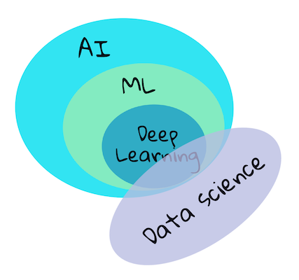

# Introdução ao machine learning

> 🎥 Clique na imagem acima para assistir um vídeo que ilustra a diferença entre machine learning, AI, e deep learning.

## [Questionário inicial](https://gray-sand-07a10f403.1.azurestaticapps.net/quiz/1?loc=ptbr)

### Introdução

Nossas boas vindas a este curso de machine learning clássico para iniciantes! Quer você seja completamente novo neste tópico, ou um praticante de ML experiente que esteja procurando se atualizar em uma área, estamos felizes por você se juntar a nós! Queremos criar um ponto de lançamento amigável para seu estudo de ML e ficaríamos felizes em avaliar, responder e incorporar o seu [feedback](https://github.com/microsoft/ML-For-Beginners/discussions).

> 🎥 Clique na imagem acima para assistir: John Guttag, do MIT, apresenta o machine learning.

### Primeiros passos com machine learning

Antes de iniciar este curso, você precisa ter seu computador configurado e pronto para executar notebooks localmente.

- **Configure sua máquina com estes vídeos**. Use os links a seguir para aprender [como instalar o Python](https://youtu.be/CXZYvNRIAKM) em seu sistema e [configurar um editor de texto](https://youtu.be/EU8eayHWoZg) para desenvolvimento.
- **Aprenda Python**. Também é recomendável ter um conhecimento básico de [Python](https://docs.microsoft.com/learn/paths/python-language/?WT.mc_id=academic-77952-leestott), uma linguagem de programação útil para cientistas de dados (data scientists) que usamos neste curso.
- **Aprenda Node.js e JavaScript**. Também usamos JavaScript algumas vezes neste curso para criar aplicativos web, então você precisará ter [node](https://nodejs.org) e [npm](https://www.npmjs.com/) instalado, assim como o [Visual Studio Code](https://code.visualstudio.com/) disponível para desenvolvimento em Python e JavaScript.
- **Crie uma conta no GitHub**. Como você nos encontrou aqui no [GitHub](https://github.com),talvez você já tenha uma conta, mas se não, crie uma e faça um fork deste curso para usar por conta própria. (Sinta-se à vontade para nos dar uma estrela também 😊).
- **Explore o Scikit-learn**. Familiarize-se com o [Scikit-learn](https://scikit-learn.org/stable/user_guide.html), um conjunto de bibliotecas de ML referenciadas nestas lições.

### O que é machine learning?

O termo 'machine learning' é um dos termos mais populares e usados ​​atualmente. Há uma boa chance de você já ter ouvido esse termo pelo menos uma vez se estiver familiarizado com tecnologia, independentemente do campo em que trabalha. A mecânica do aprendizado de máquina (machine learning), entretanto, é um mistério para a maioria das pessoas. Para um iniciante em machine learning, o assunto às vezes pode parecer opressor. Portanto, é importante entender o que realmente é o machine learning e aprender sobre isso passo a passo, por meio de exemplos práticos.

> Google Trends mostra a recente 'curva de hype' do termo 'machine learning'.

Vivemos em um universo cheio de mistérios fascinantes. Grandes cientistas como Stephen Hawking, Albert Einstein e muitos outros dedicaram suas vidas à busca de informações significativas que desvendam os mistérios do mundo ao nosso redor. Esta é a condição humana de aprendizagem: uma criança humana aprende coisas novas e descobre a estrutura de seu mundo ano a ano à medida que chega à idade adulta.

O cérebro e os sentidos de uma criança percebem os fatos ao seu redor e gradualmente aprendem os padrões ocultos de vida que ajudam a criança a criar regras lógicas para identificar os padrões aprendidos. O processo de aprendizagem do cérebro humano torna os humanos a criatura viva mais sofisticada deste mundo. Aprender continuamente, descobrindo padrões ocultos e, em seguida, inovar nesses padrões permite que nos tornemos cada vez melhores ao longo de nossa vida. Esta capacidade de aprendizagem e capacidade de evolução está relacionada a um conceito chamado [plasticidade cerebral](https://www.simplypsychology.org/brain-plasticity.html). Superficialmente, podemos traçar algumas semelhanças motivacionais entre o processo de aprendizado do cérebro humano e os conceitos de aprendizado de máquina.

O [cérebro humano](https://www.livescience.com/29365-human-brain.html) percebe coisas do mundo real, processa as informações percebidas, toma decisões racionais e executa certas ações com base nas circunstâncias. Isso é o que chamamos de comportamento inteligente. Quando programamos um fac-símile do processo comportamental inteligente para uma máquina, isso é chamado de inteligência artificial (AI).

Embora os termos possam ser confundidos, o machine learning (ML) é um subconjunto importante da inteligência artificial. **ML se preocupa em usar algoritmos especializados para descobrir informações significativas e encontrar padrões ocultos de dados percebidos para corroborar o processo de tomada de decisão racional**.

> Um diagrama que mostra as relações entre AI, ML, deep learning, and data science. Infográfico de [Jen Looper](https://twitter.com/jenlooper) inspirado [neste gráfico](https://softwareengineering.stackexchange.com/questions/366996/distinction-between-ai-ml-neural-networks-deep-learning-and-data-mining)

## O que você aprenderá neste curso

Nesta seção, vamos cobrir apenas os conceitos básicos de machine learning que um iniciante deve conhecer. Abordamos o que chamamos de 'machine learning clássico' principalmente usando o Scikit-learn, uma excelente biblioteca que muitos alunos usam para aprender o básico. Para compreender conceitos mais amplos de inteligência artificial ou deep learning, é indispensável um forte conhecimento fundamental de machine learning e, por isso, gostaríamos de oferecê-lo aqui.

Neste curso você aprenderá:

- conceitos fundamentais de machine learning
- a história do ML
- ML e justiça
- técnicas de regressão de ML
- técnicas de classificação com ML
- técnicas de agrupamento de ML
- técnicas de processamento de linguagem natural de ML
- técnicas de ML de previsão de séries temporais
- aprendizagem por reforço
- aplicativos do mundo real para ML

## O que não cobriremos

- deep learning
- redes neurais (neural networks)
- AI

Para tornar essa experiência de aprendizado melhor, evitaremos as complexidades das redes neurais, 'deep learning' - construção de modelos em várias camadas usando redes neurais - e AI, que discutiremos em um currículo diferente. Também ofereceremos um futuro currículo de ciência de dados para consolidar esse aspecto desse campo mais amplo.

## Por que estudar machine learning?

O machine learning, de uma perspectiva de sistemas, é definido como a criação de sistemas automatizados que podem aprender padrões ocultos de dados para ajudar na tomada de decisões inteligentes.

Essa motivação é vagamente inspirada em como o cérebro humano aprende certas coisas com base nos dados que percebe do mundo exterior.

✅ Pense por um minuto por que uma empresa iria querer tentar usar estratégias de machine learning em vez de criar um mecanismo baseado em regras embutido.

### Aplicações do machine learning

Os aplicativos de machine learning agora estão em quase todos os lugares e são tão onipresentes quanto os dados que fluem em nossas sociedades, gerados por nossos smartphones, dispositivos conectados e outros sistemas. Considerando o imenso potencial dos algoritmos de aprendizado de máquina (machine learning) de última geração, os pesquisadores têm explorado sua capacidade de resolver problemas multidimensionais e multidisciplinares da vida real com excelentes resultados positivos.

**Você pode usar o machine learning de várias maneiras**:

- Para prever a probabilidade de doença a partir do histórico médico ou relatórios de um paciente.
- Para aproveitar os dados meteorológicos para prever eventos meteorológicos.
- Para entender o sentimento de um texto.
- Para detectar notícias falsas (fake news) e impedir a propagação de propaganda.

Finanças, economia, ciências da terra, exploração espacial, engenharia biomédica, ciências cognitivas e até mesmo campos das humanidades adaptaram o machine learning para resolver os árduos e pesados problemas de processamento de dados de seu domínio.

O machine learning automatiza o processo de descoberta de padrões, encontrando insights significativos do mundo real ou dados gerados. Ele provou ser altamente valioso em aplicações comerciais, de saúde e financeiras, entre outras.

Em um futuro próximo, compreender os fundamentos do machine learning será uma obrigação para pessoas de qualquer domínio devido à sua ampla adoção.

---

## 🚀 Desafio

Esboce, no papel ou usando um aplicativo online como [Excalidraw](https://excalidraw.com/), sua compreensão das diferenças entre AI, ML, deep learning e data science. Adicione algumas idéias de problemas que cada uma dessas técnicas é boa para resolver.

## [Questionário pós-aula](https://gray-sand-07a10f403.1.azurestaticapps.net/quiz/2?loc=ptbr)

## Revisão e autoestudo

Para saber mais sobre como você pode trabalhar com algoritmos de ML na nuvem, siga este [Caminho de aprendizagem](https://docs.microsoft.com/learn/paths/create-no-code-predictive-models-azure-machine-learning/?WT.mc_id=academic-77952-leestott).

Faça o [Caminho de aprendizagem](https://docs.microsoft.com/learn/modules/introduction-to-machine-learning/?WT.mc_id=academic-77952-leestott) sobre os fundamentos do ML.

## Tarefa

[Comece a trabalhar](assignment.pt-br.md)
