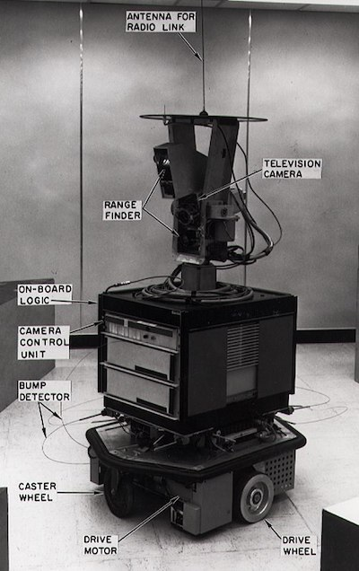

# 機械学習の歴史

> [Tomomi Imura](https://www.twitter.com/girlie_mac)によるスケッチ

## [Pre-lecture quiz](https://gray-sand-07a10f403.1.azurestaticapps.net/quiz/3?loc=ja)

この授業では、機械学習と人工知能の歴史における主要な出来事を紹介します。

人工知能（AI）の歴史は、機械学習の歴史と密接に関係しています。なぜならば、機械学習を支えるアルゴリズムと計算の進歩が、AIの発展につながったからです。これらの分野は、1950年代に明確になり始めましたが、重要な[アルゴリズム、統計、数学、計算、技術的な発見](https://wikipedia.org/wiki/Timeline_of_machine_learning)は、この時代よりも前に、そして同時に行われていたことを覚えておくとよいでしょう。実際、人々は[何百年も](https://wikipedia.org/wiki/History_of_artificial_intelligence)この問題について考えてきました。（この記事では、「考える機械」というアイデアの歴史的な知的基盤について説明されています。）

## 注目すべき発見
- 1763年、1812年 [ベイズの定理](https://wikipedia.org/wiki/Bayes%27_theorem)とその前身の発見。ある事象が起こる確率を、事前の知識に基づいて記述する推論の基礎となる定理とその応用。
- 1805年 フランスの数学者アドリアン＝マリー・レジェンドルによる[最小二乗理論](https://wikipedia.org/wiki/Least_squares)。この理論は、データのフィッティングに役立つ。
- 1913年 ロシアの数学者アンドレイ・マルコフにちなんで名付けられた[マルコフ連鎖](https://wikipedia.org/wiki/Markov_chain)は、以前の状態に基づいて起こりうる一連の事象を記述するために使用される。
- 1957年 [パーセプトロン](https://wikipedia.org/wiki/Perceptron)は、アメリカの心理学者フランク・ローゼンブラットが発明した線形分類器の一種であり、深層学習の基盤となっている。
- 1967 [最小近傍法](https://wikipedia.org/wiki/Nearest_neighbor)は、元々は経路探索のために考案されたアルゴリズム。MLではパターンの検出に用いられる。
- 1970年 [バックプロパゲーション](https://wikipedia.org/wiki/Backpropagation)を用いて[フィードフォワード・ニューラルネットワーク（順伝播型ニューラルネットワーク）](https://wikipedia.org/wiki/Feedforward_neural_network)を学習する。
- 1982年 [回帰型ニューラルネットワーク](https://wikipedia.org/wiki/Recurrent_neural_network) は、フィードフォワード・ニューラルネットワークから派生した人工的なニューラルネットワークで、時間的なグラフを作成します。

✅ 少し調べてみてください。MLとAIの歴史の中で重要な日付は他にありますか？

## 1950: 思考する機械
アラン・チューリングは、[2019年に世間から](https://wikipedia.org/wiki/Icons:_The_Greatest_Person_of_the_20th_Century)20世紀最大の科学者として投票された、真に優れた人物で、「考えることができる機械」という概念の基礎を築くのに貢献したとされています。彼は、否定的な意見や、この概念の実証的な証拠を必要とする自分自身と、この先自然言語処理の授業で触れることとなる[チューリング・テスト](https://www.bbc.com/news/technology-18475646)を作成することで戦いました。

## 1956: ダートマス・サマー・リサーチ・プロジェクト
ダートマス・サマー・リサーチ・プロジェクトは、分野としての人工知能にとって重要な出来事であり、ここで「人工知能」という言葉が作られました（[出典](https://250.dartmouth.edu/highlights/artificial-intelligence-ai-coined-dartmouth)）

> 学習やその他の知能のあらゆる側面は、原理的に非常に正確に記述することができるので、それをシミュレートする機械を作ることができる。

主任研究者である数学のジョン・マッカーシー教授は、「学習のあらゆる側面や知能のその他の特徴は、原理的に非常に正確に記述することができるので、それをシミュレートする機械を作ることができるという推測に基づいて進めていきたい」と考えていました。参加者の中には、この分野の著名人であるマービン・ミンスキーもいました。

このワークショップでは、「記号的手法の台頭、限定された領域に焦点を当てたシステム（初期のエキスパートシステム）、演繹的システムと帰納的システムの比較」などの議論が開始され、促進されたと評価されています。（[出典](https://wikipedia.org/wiki/Dartmouth_workshop)）

## 1956 - 1974: 黄金期

1950年代から70年代半ばまでは、AIがさまざまな問題を解決してくれるのではないかという楽観的な見方が広がっていました。1967年、マービン・ミンスキーは「一世代のうちに...『人工知能』を作るという問題は実質的に解決されるだろう」と自信を持って述べている。(Minsky, Marvin (1967), Computation: Finite and Infinite Machines, Englewood Cliffs, N.J.: Prentice-Hall)

自然言語処理の研究が盛んになり、検索が洗練されてより強力になり、平易な言語による指示で簡単な作業をこなす「マイクロワールド」という概念が生まれた。

研究は政府機関から潤沢な資金が提供され、計算とアルゴリズムが進歩し、知的機械のプロトタイプが作られた。その中には次のようなものがある。

* 移動したり、タスクを実行する方法を「知的に」決定することができるロボット[「Shakey」](https://wikipedia.org/wiki/Shakey_the_robot) 

    
    > 1972のShakey

* 初期の「おしゃべりロボット」であるElizaは、人と会話することができ、原始的な「セラピスト」の役割を果たした。エリザについては、NLPのレッスンで詳しく説明します。

    
    > チャットボットEliza

* 「Blocks world」は、ブロックを積み上げたり並べ替えたりするマイクロワールドの一例で、機械に判断力を身につけさせる実験を行った。[SHRDLU](https://wikipedia.org/wiki/SHRDLU)をはじめとするライブラリの進歩は、言語処理の発展に大きく貢献した。

    
    
    > 🎥 上の画像をクリックすると動画が見られます："SHRDLUを用いたblocks world"

## 1974 - 1980: AIの冬

1970年代半ばになると、「知的な機械」を作ることの複雑さが過小評価されていたことや、利用可能な計算能力を考慮すると、その将来性が過大評価されていたことが明らかになりました。資金が枯渇し、この分野への信頼が低下した。信頼性に影響を与えた問題には以下のようなものがある。:

- **限界**. 計算能力の限界
- **組み合わせの爆発**. 学習に必要なパラメータの量は、コンピュータに要求されることが多くなるにつれて指数関数的に増加しましたが、コンピュータの性能や能力は並行して進化しませんでした。
- **データの少なさ**. データが不足していたため、アルゴリズムのテスト、開発、改良のプロセスが妨げられた。
- **正しい質問をしているのかどうか**. 問いかけていた質問そのものが疑問視され始めた。研究者たちは、自分たちのアプローチに批判的な意見を持つようになった。
  - チューリングテストは、「コンピュータをプログラミングすることで、言語を理解しているように見せかけることはできるが、本当の意味での理解はできない」とする「チャイニーズルーム理論」などによって、疑問視されるようになった。([出典](https://plato.stanford.edu/entries/chinese-room/))
  - セラピストとしてELIZAのような人工知能を社会に導入することの倫理性が問われた。
それと同時に、さまざまなAIの流派が形成され始めました。一つは、["Scruffy"と "Neat AI"](https://wikipedia.org/wiki/Neats_and_scruffies)という二分法である。Scruffyな研究室では、目的の結果が得られるまで何時間もプログラムをいじっていた一方、neatな研究室では、論理と形式的な問題解決を重視する。ELIZAやSHRDLUなどが有名なScruffyであるシステムである。1980年代に入って、MLシステムの再現性が求められるようになると、結果が説明可能であることから、次第にneatなアプローチが主流になっていきました。

## 1980s エキスパートシステム

分野が発展するにつれ、ビジネスへの貢献が明確になり、1980年代には「エキスパートシステム」が普及しました。「エキスパートシステムは、人工知能（AI）ソフトウェアの中で最初に真に成功した形態の一つである。」と言われています。（[出典](https://wikipedia.org/wiki/Expert_system)）

このタイプのシステムは、ビジネス要件を定義するルールエンジンと、ルールシステムを活用して新たな事実を推論する推論エンジンで構成されるハイブリッド型です。

また、この時代はニューラルネットワークにも注目が集まった。

## 1987 - 1993: AIの冷え込み

専門分野に特化したエキスパートシステムのハードウェアが普及したことで、専門性が高くなりすぎてしまうという残念な結果になりました。また、パーソナルコンピュータの台頭は、これらの大規模で専門的な中央集権的システムと競合した。コンピューティングの民主化が始まり、最終的には現代の爆発的なビッグデータへの道が開かれました。

## 1993 - 2011

この期間では、それ以前にデータと計算能力の不足によって引き起こされていた問題を、MLやAIが解決できるようになっていた。特に2007年頃にスマートフォンが登場したことで、良くも悪くもデータ量が急速に増加し、広く利用されるようになりました。計算機の性能も飛躍的に向上し、アルゴリズムもそれに合わせて進化していきました。過去の自由奔放な時代から、真の学問としての結晶化が始まり、この分野は成熟していきました。

## 現在

現在、機械学習やAIは、私たちの生活のほぼすべての部分に関わっています。このような時代には、これらのアルゴリズムが人間の生活に及ぼすリスクや潜在的な影響を注意深く理解することが求められます。マイクロソフトのブラッド・スミスは、「情報技術は、プライバシーや表現の自由といった基本的な人権保護の核心に迫る問題を提起します。情報技術は、プライバシーや表現の自由といった基本的な人権保護の根幹に関わる問題を提起します。我々の見解では、これらの問題は、政府による思慮深い規制と、許容される使用方法に関する規範の策定を必要としています。」と述べています。（[出典](https://www.technologyreview.com/2019/12/18/102365/the-future-of-ais-impact-on-society/)）

未来がどうなるかはまだわかりませんが、これらのコンピュータシステムと、それを動かすソフトウェアやアルゴリズムを理解することは重要です。このカリキュラムが自身で判断するにあたり、より良い理解を助けるものになると幸いです。

> 🎥  上の画像をクリックすると動画が見られます：このレクチャーではYann LeCunがディープラーニングの歴史について議論しています。 

---
## 🚀Challenge

これらの歴史的瞬間の1つを掘り下げて、その背後にいる人々について学びましょう。魅力的な人々がいますし、文化的に空白の状態で科学的発見がなされたことはありません。どういったことが見つかるでしょうか？

## [Post-lecture quiz](https://gray-sand-07a10f403.1.azurestaticapps.net/quiz/4?loc=ja)

## 振り返りと自習

視聴するべき教材は以下になります:

[Amy BoydがAIの進化について述べているポッドキャスト](http://runasradio.com/Shows/Show/739)

## 課題

[年表を作成する](./assignment.ja.md)
