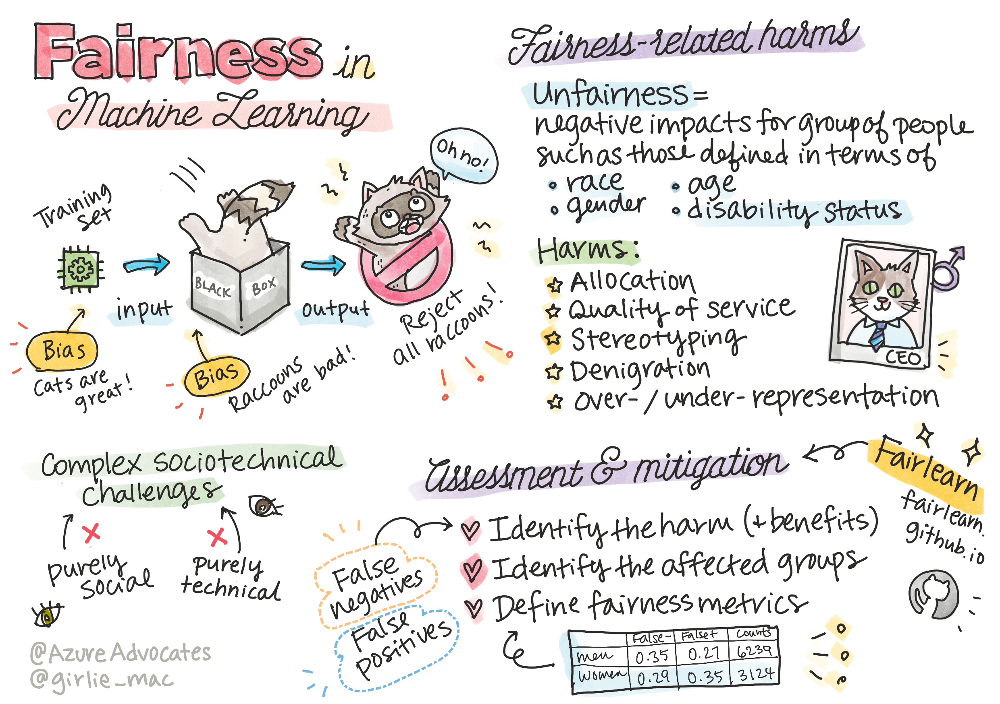
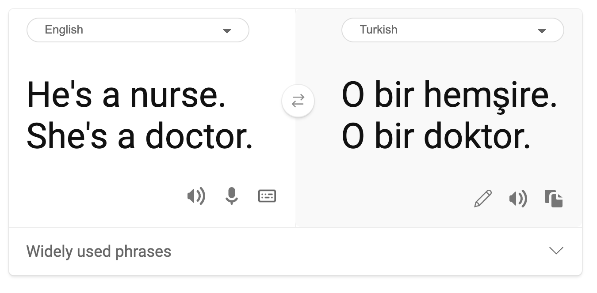

# Justicia en el Aprendizaje Automático

> Sketchnote por [Tomomi Imura](https://www.twitter.com/girlie_mac)

## [Examen previo a la lección](https://white-water-09ec41f0f.azurestaticapps.net/quiz/5/)

## Introducción

En esta sección, comenzarás a descubrir como el aprendizaje automático puede y está impactando nuestra vida diaria. Incluso ahora mismo, hay sistemas y modelos involucrados en tareas diarias de toma de decisiones, como los diagnósticos del cuidado de la salud o detección del fraude. Es importante que estos modelos funcionen correctamente con el fin de proveer resultados justos para todos.

Imagina que podría pasar si los datos que usas para construir estos modelos carecen de cierta demografía, como es el caso de raza, género, punto de vista político, religión, o representan desproporcionadamente estas demografías. ¿Qué pasa cuando los resultados del modelo son interpretados en favor de alguna demografía? ¿Cuál es la consecuencia para la aplicación?

En esta lección, será capaz de:

- Tomar conciencia de la importancia de la justicia en el aprendizaje automático.
- Aprender acerca de daños relacionados a la justicia.
- Aprender acerca de la evaluación de la justicia y mitigación.

## Prerrequisitos

Como un prerrequisito, por favor toma la ruta de aprendizaje "Responsible AI Principles" y mira el vídeo debajo sobre el tema:

Aprende más acerca de la AI responsable siguiendo este [curso](https://docs.microsoft.com/es-es/learn/modules/responsible-ai-principles/?WT.mc_id=academic-15963-cxa)

> 🎥 Haz clic en imagen superior para el vídeo: Enfoque de Microsoft para la AI responsable

## Injusticia en los datos y algoritmos

> "Si torturas los datos lo suficiente, estos confesarán cualquier cosa" - Ronald Coase

Esta oración suena extrema, pero es cierto que los datos pueden ser manipulados para soportar cualquier conclusión. Dicha manipulación puede ocurrir a veces de forma no intencional. Como humanos, todos tenemos sesgos, y muchas veces es difícil saber conscientemente cuando estás introduciendo un sesgo en los datos.

El garantizar la justicia en la AI y aprendizaje automático sigue siendo un desafío socio-tecnológico complejo. Esto quiere decir que no puede ser afrontado desde una perspectiva puramente social o técnica.

### Daños relacionados con la justicia

¿Qué quieres decir con injusticia? "injusticia" engloba impactos negativos, o "daños", para un grupo de personas, como aquellos definidos en términos de raza, género, edad o estado de discapacidad.

Los principales daños relacionados a la justicia pueden ser clasificados como de:

- **Asignación**, si un género o etnia, por ejemplo, se favorece sobre otro.
- **Calidad del servicio**. Si entrenas los datos para un escenario específico pero la realidad es mucho más compleja, esto conlleva a servicio de bajo rendimiento.
- **Estereotipo**. El asociar un cierto grupo con atributos preasignados.
- **Denigrado**. Criticar injustamente y etiquetar algo o alguien.
- **Sobre- o sub- representación** La idea es que un cierto grupo no es visto en una cierta profesión, y cualquier servicio o función que sigue promocionándolo está contribuyendo al daño.

Demos un vistazo a los ejemplos.

### Asignación

Considerar un sistema hipotético para seleccionar solicitudes de préstamo. El sistema tiende a seleccionar a hombres blancos como mejores candidatos por encima de otros grupos. Como resultado, los préstamos se retienen para ciertos solicitantes.

Otro ejemplo sería una herramienta experimental de contratación desarrollada por una gran corporación para seleccionar candidatos. La herramienta discriminó sistemáticamente un género de otro usando los modelos entrenados para preferir palabras asociadas con otras, lo cual resultó en candidatos penalizados cuyos currículos contienen palabras como "equipo de rugby femenino".

✅ Realiza una pequeña investigación para encontrar un ejemplo del mundo real de algo como esto.

### Calidad del servicio

Los investigadores encontraron que varios clasificadores de género comerciales tenían altas tasas de error en las imágenes de mujeres con tonos de piel más oscuros, al contrario que con imágenes de hombres con tonos de piel más claros. [Referencia](https://www.media.mit.edu/publications/gender-shades-intersectional-accuracy-disparities-in-commercial-gender-classification/)

Otro ejemplo infame es el dispensador de jabón para manos que parece no ser capaz de detectar a la gente con piel de color oscuro. [Referencia](https://gizmodo.com/why-cant-this-soap-dispenser-identify-dark-skin-1797931773)

### Estereotipo

La vista de género estereotipada fue encontrada en una traducción automática. Cuando se tradujo “Él es un enfermero y ella es una doctora” al turco, se encontraron los problemas. El turco es un idioma sin género el cual tiene un  pronombre "o" para comunicar el singular de la tercera persona, pero al traducir nuevamente la oración del turco al inglés resulta la frase estereotipada e incorrecta de “Ella es una enfermera y él es un doctor”.

### Denigración

Una tecnología de etiquetado de imágenes horriblemente etiquetó imágenes de gente con color oscuro de piel como gorilas. El etiquetado incorrecto es dañino no solo porque el sistema cometió un error, sino porque específicamente aplicó una etiqueta que tiene una larga historia de ser usada a propósito para denigrar a la gente negra.

> 🎥 Da clic en la imagen superior para el video: AI, ¿No soy una mujer? - un espectáculo que muestra el daño causado por la denigración racista de una AI.

### Sobre- o sub- representación

Los resultados de búsqueda de imágenes sesgados pueden ser un buen ejemplo de este daño. Cuando se buscan imágenes de profesiones con un porcentaje igual o mayor de hombres que de mujeres, como en ingeniería, o CEO, observa que los resultados están mayormente inclinados hacia un género dado.

> Esta búsqueda en Bing para 'CEO' produce resultados bastante inclusivos

Estos cinco tipos principales de daños no son mutuamente exclusivos, y un solo sistema puede exhibir más de un tipo de daño. Además, cada caso varía en severidad. Por ejemplo, etiquetar injustamente a alguien como un criminal es un daño mucho más severo que etiquetar incorrectamente una imagen. Es importante, sin embargo, el recordar que aún los daños relativamente no severos pueden hacer que la gente se sienta enajenada o señalada y el impacto acumulado puede ser extremadamente opresivo.
 
✅ **Discusión**: Revisa algunos de los ejemplos y ve si estos muestran diferentes daños.

|                         | Asignación | Calidad del servicio | Estereotipo | Denigrado | Sobre- o sub- representación |
| ----------------------- | :--------: | :----------------: | :----------: | :---------: | :----------------------------: |
| Sistema de contratación automatizada |     x      |         x          |      x       |             |               x                |
| Traducción automática   |            |                    |              |             |                                |
| Etiquetado de fotos        |            |                    |              |             |                                |

## Detectando injusticias

Hay varias razones por las que un sistema se comporta injustamente. Los sesgos sociales, por ejemplo, pueden ser reflejados en los conjutos de datos usados para entrenarlos. Por ejemplo, la injusticia en la contratación puede ser exacerbada por la sobre dependencia en los datos históricos. Al emplear patrones elaborados a partir de currículos enviados a la compañía en un período de 10 años, el modelo determinó que los hombres estaban más calificados porque la mayoría de los currículos provenían de hombres, reflejo del pasado dominio masculino en la industria tecnológica.

Los datos inadecuados acerca de cierto grupo de personas pueden ser la razón de la injusticia. Por ejemplo, los clasificadores de imágenes tienes una tasa de error más alta para imágenes de gente con piel oscura porque los tonos de piel más oscura fueron sub-representados en los datos.

Las suposiciones erróneas hechas durante el desarrollo también causan injusticia. Por ejemplo, un sistema de análisis facial intentó predecir quién cometerá un crimen basado en imágenes de los rostros de personas que pueden llevar a supuestos dañinos. Esto podría llevar a daños substanciales para las personas clasificadas erróneamente.

## Entiende tus modelos y construye de forma justa
 
A pesar de los muchos aspectos de justicia que no son capturados en métricas cuantitativas justas, y que no es posible borrar totalmente el sesgo de un sistema para garantizar la justicia, eres responsable de detectar y mitigar problemas de justicia tanto como sea posible.

Cuando trabajas con modelos de aprendizaje automático, es importante entender tus modelos asegurando su interpretabilidad y evaluar y mitigar injusticias.

Usemos el ejemplo de selección de préstamos para aislar el caso y averiguar el nivel de impacto de cada factor en la predicción.

## Métodos de evaluación

1. **Identifica daños (y beneficios)**. El primer paso es identificar daños y beneficios. Piensa en cómo las acciones y decisiones pueden afectar tanto a clientes potenciales como al negocio mismo.

2. **Identifica los grupos afectados**. Una vez que entendiste qué clase de daños o beneficios pueden ocurrir, identifica los grupos que podrían ser afectados. ¿Están estos grupos definidos por género, etnicidad, o grupo social?

3. **Define métricas de justicia**. Finalmente, define una métrica para así tener algo con qué medir en tu trabajo para mejorar la situación.

### Identifica daños (y beneficios)

¿Cuáles son los daños y beneficios asociados con el préstamo? Piensa en escenarios con falsos negativos y falsos positivos: 

**Falsos negativos** (rechazado, pero Y=1) - en este caso, un solicitante que sería capaz de pagar un préstamo es rechazado. Esto es un evento adverso porque los recursos de los préstamos se retienen a los solicitantes calificados.

**Falsos positivos** (aceptado, pero Y=0) - en este caso, el solicitante obtiene un préstamo pero eventualmente incumple. Como resultado, el caso del solicitante será enviado a la agencia de cobro de deudas lo cual puede afectar en sus futuras solicitudes de préstamo.

### Identifica los grupos afectados

Los siguientes pasos son determinar cuales son los grupos que suelen ser afectados. Por ejemplo, en caso de una solicitud de tarjeta de crédito, un modelo puede determinar que las mujeres deberían recibir mucho menor límite de crédito comparado con sus esposos con los cuales comparten ingreso familiar. Una demografía entera, definida por género, es de este modo afectada.

### Define métricas de justicia

Has identificado los daños y un grupo afectado, en este caso, delimitado por género. Ahora, usa los factores cuantificados para desagregar sus métricas. Por ejemplo, usando los datos abajo, puedes ver que las mujeres tienen la tasa de falso positivo más grande y los hombres tienen la más pequeña, y que lo opuesto es verdadero para los falsos negativos.

✅ En una lección futura de Clustering, verás como construir esta 'matriz de confusión' en código

|            | Tasa de falso positivo | Tasa de falso negativo | contador |
| ---------- | ------------------- | ------------------- | ----- |
| Mujeres    | 0.37                | 0.27                | 54032 |
| Hombres    | 0.31                | 0.35                | 28620 |
| No-binario | 0.33                | 0.31                | 1266  |

Esta tabla nos dice varias cosas. Primero, notamos que hay comparativamente pocas personas no-binarias en los datos. Los datos están sesgados, por lo que necesitas ser cuidadoso en cómo interpretas estos números.

En este caso, tenemos 3 grupos y 2 métricas. En el caso de cómo nuestro sistema afecta a los grupos de clientes con sus solicitantes de préstamo, esto puede ser suficiente, pero cuando quieres definir grupos mayores, querrás reducir esto a conjuntos más pequeños de resúmenes. Para hacer eso, puedes agregar más métricas, como la mayor diferencia o la menor tasa de cada falso negativo y falso positivo.

✅ Detente y piensa: ¿Qué otros grupos es probable se vean afectados a la hora de solicitar un préstamo?

## Mitigando injusticias

Para mitigar injusticias, explora el modelo para generar varios modelos mitigados y compara las compensaciones que se hacen entre la precisión y justicia para seleccionar el modelo más justo.

Esta lección introductoria no profundiza en los detalles de mitigación algorítmica de injusticia, como los enfoques de post-procesado y de reducciones, pero aquí tienes una herramiento que podrías probar:

### Fairlearn 

[Fairlearn](https://fairlearn.github.io/) es un paquete Python de código abierto que te permite evaluar la justicia de tus sistemas y mitigar injusticias.

La herramienta te ayuda a evaluar cómo unos modelos de predicción afectan a diferentes grupos, permitiéndote comparar múltiples modelos usando métricas de rendimiento y justicia, y provee un conjunto de algoritmos para mitigar injusticia en regresión y clasificación binaria.

- Aprende cómo usar los distintos componentes revisando el repositorio de [GitHub](https://github.com/fairlearn/fairlearn/) de Fairlearn.

- Explora la [guía de usuario](https://fairlearn.github.io/main/user_guide/index.html), [ejemplos](https://fairlearn.github.io/main/auto_examples/index.html)

- Prueba algunos [notebooks de ejemplo](https://github.com/fairlearn/fairlearn/tree/master/notebooks).
  
- Aprende a [cómo activar evaluación de justicia](https://docs.microsoft.com/azure/machine-learning/how-to-machine-learning-fairness-aml?WT.mc_id=academic-15963-cxa) de los modelos de aprendizaje automático en Azure Machine Learning.
  
- Revisa estos [notebooks de ejemplo](https://github.com/Azure/MachineLearningNotebooks/tree/master/contrib/fairness) para más escenarios de evaluaciones de justicia en Azure Machine Learning.

---
## 🚀 Desafío

Para prevenir que los sesgos sean introducidos en primer lugar, debemos:

- Tener una diversidad de antecedentes y perspectivas entre las personas trabajando en los sistemas.
- Invertir en conjuntos de datos que reflejen la diversidad de nuestra sociedad.
- Desarrollar mejores métodos para la detección y corrección de sesgos cuando estos ocurren.

Piensa en escenarios de la vida real donde la injusticia es evidente en la construcción y uso de modelos. ¿Qué más debemos considerar?

## [Cuestionario posterior a la lección](https://white-water-09ec41f0f.azurestaticapps.net/quiz/6/)
## Revisión y autoestudio 

En esta lección has aprendido algunos de los conceptos básicos de justicia e injusticia en el aprendizaje automático.

Mira este taller para profundizar en estos temas:

- YouTube: [Daños relacionados con la justicia en sistemas de AI: Ejemplos, evaluaciones, y mitigación - YouTube](https://www.youtube.com/watch?v=1RptHwfkx_k) por Hanna Wallach y Miro Dudik

También lee:

- Centro de recursos de Microsoft RAI: [Recursos de AI responsable – Microsoft AI](https://www.microsoft.com/ai/responsible-ai-resources?activetab=pivot1%3aprimaryr4)

- Grupo de investigación de Microsoft FATE: [FATE: Fairness, Accountability, Transparency, and Ethics in AI - Microsoft Research](https://www.microsoft.com/research/theme/fate/)

Explorar la caja de herramientas de Fairlearn

[Fairlearn](https://fairlearn.org/)

Lee acerca de las herramientas de Azure Machine Learning para asegurar justicia

- [Azure Machine Learning](https://docs.microsoft.com/azure/machine-learning/concept-fairness-ml?WT.mc_id=academic-15963-cxa)

## Tarea

[Explora Fairlearn](../translations/assignment.es.md)
