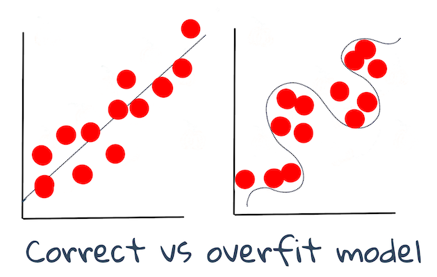

# Técnicas de Machine Learning

O processo de construção, uso e manutenção de modelos de machine learning e os dados que eles usam é um processo muito diferente de muitos outros fluxos de trabalho de desenvolvimento. Nesta lição, vamos desmistificar o processo e delinear as principais técnicas que você precisa saber. Você irá:

- Compreender os processos que sustentam o aprendizado de máquina em alto nível.
- Explorar conceitos básicos como 'modelos', 'previsões' e 'dados de treinamento'..

## [Questionário pré-aula](https://gray-sand-07a10f403.1.azurestaticapps.net/quiz/7?loc=ptbr)

## Introdução

Em um alto nível, a arte de criar processos de machine learning (ML) é composta por uma série de etapas:

1. **Decida sobre a questão**. A maioria dos processos de ML começa fazendo uma pergunta que não pode ser respondida por um simples programa condicional ou mecanismo baseado em regras. Essas questões geralmente giram em torno de previsões baseadas em uma coleção de dados.
2. **Colete e prepare dados**. Para responder à sua pergunta, você precisa de dados. A qualidade e, às vezes, a quantidade de seus dados determinarão o quão bem você pode responder à sua pergunta inicial. A visualização de dados é um aspecto importante desta fase. Esta fase também inclui a divisão dos dados em um grupo de treinamento e teste para construir um modelo.
3. **Escolha um método de treinamento**. Dependendo da sua pergunta e da natureza dos seus dados, você precisa escolher como deseja treinar um modelo para melhor refletir seus dados e fazer previsões precisas em relação a eles. Esta é a parte do seu processo de ML que requer conhecimentos específicos e, muitas vezes, uma quantidade considerável de experimentação.
4. **Treine o modelo**. Usando seus dados de treinamento, você usará vários algoritmos para treinar um modelo para reconhecer padrões nos dados. O modelo pode alavancar pesos internos que podem ser ajustados para privilegiar certas partes dos dados sobre outras para construir um modelo melhor.
5. **Avalie o modelo**. Você usa dados nunca antes vistos (seus dados de teste) de seu conjunto coletado para ver como o modelo está se saindo.
6. **Ajuste de parâmetros**. Com base no desempenho do seu modelo, você pode refazer o processo usando diferentes parâmetros, ou variáveis, que controlam o comportamento dos algoritmos usados para treinar o modelo.
7. **Preveja**. Use novas entradas para testar a precisão do seu modelo.

## Que pergunta fazer

Os computadores são particularmente adeptos da descoberta de padrões ocultos nos dados. Esse recurso é muito útil para pesquisadores que têm dúvidas sobre um determinado campo que não podem ser respondidas facilmente criando um mecanismo de regras baseado em condições. Dada uma tarefa atuarial, por exemplo, um cientista de dados pode ser capaz de construir manualmente regras sobre a mortalidade de fumantes versus não fumantes.

Quando muitas outras variáveis ​​são introduzidas na equação, no entanto, um modelo de ML pode ser mais eficiente para prever as taxas de mortalidade futuras com base no histórico de saúde anterior. Um exemplo mais alegre seria fazer previsões do tempo de abril para um determinado local com base em dados que incluem latitude, longitude, mudança climática, proximidade do oceano, padrões de fluxo de jato e muito mais.

✅ Esta [apresentação](https://www2.cisl.ucar.edu/sites/default/files/2021-10/0900%20June%2024%20Haupt_0.pdf) sobre modelos meteorológicos oferece uma perspectiva histórica do uso do ML na análise meteorológica.

## Tarefas de pré-construção

Antes de começar a construir seu modelo, há várias tarefas que você precisa concluir. Para testar sua pergunta e formar uma hipótese com base nas previsões de um modelo, você precisa identificar e configurar vários elementos.

### Dados

Para poder responder à sua pergunta com qualquer tipo de certeza, você precisa de uma boa quantidade de dados do tipo certo. Há duas coisas que você precisa fazer neste momento:

- **Coletar dados**. Tendo em mente a lição anterior sobre justiça na análise de dados, colete seus dados com cuidado. Esteja ciente das fontes desses dados, de quaisquer tendências inerentes que possam ter e documente sua origem.
- **Prepare os dados**. Existem várias etapas no processo de preparação de dados. Pode ser necessário agrupar dados e normalizá-los se vierem de fontes diversas. Você pode melhorar a qualidade e a quantidade dos dados por meio de vários métodos, como a conversão de strings em números (como fazemos em [Clustering](../../../5-Clustering/1-Visualize/README.md)). Você também pode gerar novos dados, com base no original (como fazemos em [Classificação](../../../4-Classification/1-Introduction/README.md)). Você pode limpar e editar os dados (como faremos antes da lição[Web App](../../../3-Web-App/README.md)). Finalmente, você também pode precisar randomizá-lo e embaralhá-lo, dependendo de suas técnicas de treinamento.

✅ Depois de coletar e processar seus dados, reserve um momento para ver se o formato permitirá que você responda à pergunta pretendida. Pode ser que os dados não funcionem bem em sua tarefa, como descobrimos em nossas lições de [Clustering](../../../5-Clustering/1-Visualize/README.md)!

### Recursos e Alvo

Um [recurso](https://www.datasciencecentral.com/profiles/blogs/an-introduction-to-variable-and-feature-selection) é uma propriedade mensurável de seus dados. Em muitos conjuntos de dados, é expresso como um cabeçalho de coluna como 'data', 'tamanho' ou 'cor'. Sua variável de recurso, geralmente representada como `X` no código, representa a variável de entrada que será usada para treinar o modelo.

Um alvo é algo que você está tentando prever. Alvo geralmente representado como `y` no código, representa a resposta à pergunta que você está tentando fazer sobre seus dados: em Dezembro, quais abóboras de **cor**serão mais baratas? em São Francisco, quais bairros terão o melhor **preço** imobiliário? Às vezes, o destino também é conhecido como atributo de rótulo.

### Selecionando sua variável de característica

🎓 **Seleção e extração de recursos** Como você sabe qual variável escolher ao construir um modelo? Você provavelmente passará por um processo de seleção ou extração de recursos para escolher as variáveis certas para o modelo de melhor desempenho. Eles não são a mesma coisa, no entanto: "A extração de recursos cria novos recursos a partir de funções dos recursos originais, enquanto a seleção de recursos retorna um subconjunto dos recursos." ([fonte](https://wikipedia.org/wiki/Feature_selection))

### Visualize seus dados

Um aspecto importante do kit de ferramentas de uma pessoa cientista de dados é o poder de visualizar dados usando várias bibliotecas excelentes, como Seaborn ou MatPlotLib. A representação visual de seus dados pode permitir que você descubra correlações ocultas que você pode explorar. As visualizações também podem ajudar a descobrir distorções ou dados desequilibrados (como encontrado em[Classificação](../../../4-Classification/2-Classifiers-1/README.md)).

### Divida seu conjunto de dados

Antes do treinamento, você precisa dividir seu conjunto de dados em duas ou mais partes de tamanhos desiguais que ainda representam bem os dados.

- **Treinamento**. Esta parte do conjunto de dados é adequada ao seu modelo para treiná-lo. Este conjunto constitui a maior parte do conjunto de dados original.
- **Teste**. Um conjunto de dados de teste é um grupo independente de dados, geralmente coletado dos dados originais, que você usa para confirmar o desempenho do modelo construído.
- **Validando**. Um conjunto de validação é um grupo menor independente de exemplos que você usa para ajustar os hiperparâmetros do modelo, ou arquitetura, para melhorar o modelo. Dependendo do tamanho dos seus dados e da pergunta que você está fazendo, pode não ser necessário construir este terceiro conjunto (como observamos em [Previsão de série temporal](../../../7-TimeSeries/1-Introduction/README.md)).

## Construindo um modelo

Usando seus dados de treinamento, sua meta é construir um modelo, ou uma representação estatística de seus dados, usando vários algoritmos para **treiná-los**. O treinamento de um modelo o expõe aos dados e permite que ele faça suposições sobre os padrões percebidos que descobre, valida e aceita ou rejeita.

### Decidir sobre um método de treinamento

Desvendando da sua pergunta e da natureza dos seus dados, você escolherá um método para treiná-los. Percorrendo a [documentação do Scikit-learn](https://scikit-learn.org/stable/user_guide.html) - que usamos neste curso - você pode explorar muitas maneiras de treinar um modelo. Dependendo da sua experiência, pode ser necessário tentar vários métodos diferentes para construir o melhor modelo. É provável que você passe por um processo pelo qual os cientistas de dados avaliam o desempenho de um modelo, alimentando-o com dados invisíveis, verificando a precisão, o viés e outros problemas que degradam a qualidade e selecionando o método de treinamento mais apropriado para a tarefa em questão.

### Treine um modelo

Armado com seus dados de treinamento, você está pronto para 'ajustá-los' para criar um modelo. Você notará que em muitas bibliotecas de ML você encontrará o código 'model.fit' - é neste momento que você envia sua variável de recurso como uma matriz de valores (geralmente 'X') e uma variável de destino (geralmente 'y').

### Avalie o modelo

Assim que o processo de treinamento for concluído (pode levar muitas iterações, ou 'epochs', para treinar um modelo grande), você poderá avaliar a qualidade do modelo usando dados de teste para avaliar seu desempenho. Esses dados são um subconjunto dos dados originais que o modelo não analisou anteriormente. Você pode imprimir uma tabela de métricas sobre a qualidade do seu modelo.

🎓 **Adaptação do modelo**

No contexto do machine learning, o ajuste do modelo refere-se à precisão da função subjacente do modelo à medida que tenta analisar dados com os quais não está familiarizado.

🎓 **Underfitting** e **overfitting** são problemas comuns que degradam a qualidade do modelo, pois o modelo não se ajusta bem o suficiente ou se ajusta muito bem. Isso faz com que o modelo faça previsões muito alinhadas ou muito vagamente alinhadas com seus dados de treinamento. Um modelo de ajuste excessivo prevê os dados de treinamento muito bem porque aprendeu os detalhes e o ruído dos dados muito bem. Um modelo insuficiente não é preciso, pois não pode analisar com precisão seus dados de treinamento, nem os dados que ainda não foram 'visto'.

> Infográfico por [Jen Looper](https://twitter.com/jenlooper)

## Ajuste de parâmetro

Quando o treinamento inicial estiver concluído, observe a qualidade do modelo e considere melhorá-lo ajustando seus 'hiperparâmetros'. Leia mais sobre o processo [na documentação](https://docs.microsoft.com/en-us/azure/machine-learning/how-to-tune-hyperparameters?WT.mc_id=academic-77952-leestott).

## Predição

Este é o momento em que você pode usar dados completamente novos para testar a precisão do seu modelo. Em uma configuração de ML 'aplicada', onde você está construindo ativos da web para usar o modelo na produção, este processo pode envolver a coleta de entrada do usuário (um pressionamento de botão, por exemplo) para definir uma variável e enviá-la ao modelo para inferência, ou avaliação.

Nessas lições, você descobrirá como usar essas etapas para preparar, criar, testar, avaliar e prever - todos os gestos de uma pessoa cientista de dados e muito mais, conforme você avança em sua jornada para se tornar um engenheiro de ML de 'full stack'.

---

## 🚀Desafio

Desenhe um fluxograma refletindo as etapas de um praticante de ML. Onde você se vê agora no processo? Onde você prevê que encontrará dificuldade? O que parece fácil para você?

## [Questionário pós-aula](https://gray-sand-07a10f403.1.azurestaticapps.net/quiz/8?loc=ptbr)

## Revisão e Autoestudo

Procure por entrevistas online com  pessoas cientistas de dados que discutem seu trabalho diário. Aqui está [uma](https://www.youtube.com/watch?v=Z3IjgbbCEfs).

## Tarefa

[Entreviste uma pessoa cientista de dados](assignment.pt-br.md)