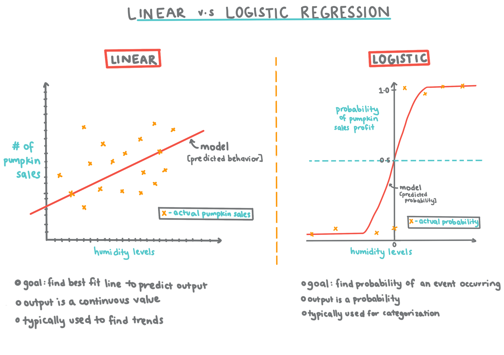
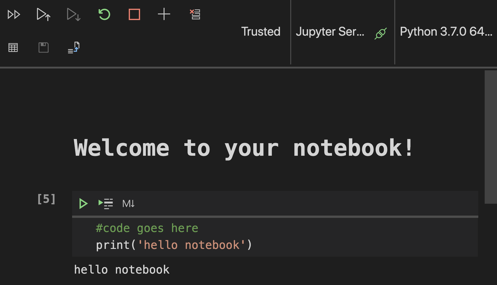

# Get started with Python and Scikit-Learn for Regression models


> Infographic by [Dasani Madipalli](https://twitter.com/dasani_decoded)

## [Pre-lecture quiz](https://jolly-sea-0a877260f.azurestaticapps.net/quiz/5/)
## Introduction

The lessons in this section cover types of Regression in the context of machine learning. Regression models can help determine the relationship between variables. This type of model can predict values such as length, temperature, or age, thus uncovering relationships between variables as it analyzes datapoints.

In this series of lessons, you'll discover the difference between Linear vs. Logistic Regression, and when you should use one or the other.

But before you do anything, make sure you have the right tools in place!

In this lesson, you will learn:
- How to configure your computer for local machine learning tasks
- Getting used to working with Jupyter notebooks
- An introduction to Scikit-Learn, including installation
- An introduction to Linear Regression with a hands-on exercise 
  
## Installations and Configurations

[](https://youtu.be/7EXd4_ttIuw "Using Python with Visual Studio Code")

> Click this image to watch a video on using Python within VS Code.

1. Ensure that [Python](https://www.python.org/downloads/) is installed on your computer. You will use Python for many data science and machine learning tasks. Most computer systems already include a Python installation. There are useful [Python Coding Packs](https://code.visualstudio.com/learn/educators/installers?WT.mc_id=academic-15963-cxa) available as well to ease the setup for some users. Some usages of Python, however, require one version of the software, whereas others require a different version. For this reason, it's useful to work within a virtual environment. 

2. Make sure you have Visual Studio Code installed on your computer. Follow [these instructions](https://code.visualstudio.com/) for the basic installation. You are going to use Python in Visual Studio Code in this course, so you might want to brush up on how to [configure](https://docs.microsoft.com/learn/modules/python-install-vscode?WT.mc_id=academic-15963-cxa) VS Code for Python development.

> Get comfortable with Python by working through this collection of [Learn modules](https://docs.microsoft.com/users/jenlooper-2911/collections/mp1pagggd5qrq7?WT.mc_id=academic-15963-cxa)

3. Install Scikit-Learn by following [these instructions](https://scikit-learn.org/stable/install.html). Since you need to ensure that you use Python 3, it's recommended that you use a virtual environment. Note, if you are installing this library on a M1 Mac, there are special instructions on the page linked above.
## Your ML Authoring Environment

You are going to use **notebooks** to develop your Python code and create machine learning models. This type of file is a common tool for data scientists, and they can be identified by their suffix `.ipynb`.

Notebooks are an interactive environment that allow the developer to both code and add notes and documentation around the code.
### Working with A Notebook

In this folder, you will find the file `notebook.ipynb`. If you open it in VS Code, assuming VS Code is properly configured, a Jupyter server will start with Python 3+ started. You will find areas of the notebook that can be 'run' by pressing arrows next to code blocks, and other areas that contain text.

In your notebook, add a comment. To do this, click the 'md' icon and add a bit of markdown, like `# Welcome to your notebook`.

Next, add some Python code: Type `print('hello notebook')` and click the arrow to run the code. You should see the printed statement, 'hello notebook'.



You can interleaf your code with comments to self-document the notebook.

✅ Think for a minute how different a web developer's working environment is versus that of a data scientist.
## Up and Running with Scikit-Learn

Now that Python is set up in your local environment and you are comfortable with Jupyter notebooks, let's get equally comfortable with Scikit-Learn (pronounce it `sci` as in `science`). Scikit-Learn provides an [extensive API](https://scikit-learn.org/stable/modules/classes.html#api-ref) to help you perform ML tasks.

According to their [website](https://scikit-learn.org/stable/getting_started.html), "Scikit-learn is an open source machine learning library that supports supervised and unsupervised learning. It also provides various tools for model fitting, data preprocessing, model selection and evaluation, and many other utilities."
### Let's unpack some of this jargon:

> 🎓 A machine learning **model** is a mathematical model that generates predictions given data to which it has not been exposed. It builds these predictions based on its analysis of data and extrapolating patterns.

> 🎓 **[Supervised Learning](https://en.wikipedia.org/wiki/Supervised_learning)** works by mapping an input to an output based on example pairs. It uses **labeled** training data to build a function to make predictions. [Download a printable Zine about Supervised Learning](https://zines.jenlooper.com/zines/supervisedlearning.html). Regression, which is covered in this group of lessons, is a type of supervised learning.

> 🎓 **[Unsupervised Learning](https://en.wikipedia.org/wiki/Unsupervised_learning)** works similarly but it maps pairs using **unlabeled data**. [Download a printable Zine about Supervised Learning](https://zines.jenlooper.com/zines/unsupervisedlearning.html)

> 🎓 **[Model Fitting](https://scikit-learn.org/stable/auto_examples/model_selection/plot_underfitting_overfitting.html#sphx-glr-auto-examples-model-selection-plot-underfitting-overfitting-py)** in the context of machine learning refers to the accuracy of the model's underlying function as it attempts to analyze data with which it is not familiar. **Underfitting** and **overfitting** are common problems that degrade the quality of the model as the model fits either not well enough or too well. This causes the model to make predictions either too closely aligned or too loosely aligned with its training data. An overfit model predicts training data too well because it has learned the data's details and noise too well. An underfit model is not accurate as it can neither accurately analyze its training data nor data it has not yet 'seen'.

> 🎓 **Data Preprocessing** is the process whereby data scientists clean and convert data for use in the machine learning lifecycle. 

> 🎓 **Model Selection and Evaluation** is the process whereby data scientists evaluate the accuracy of a model by feeding it unseen data, selecting the most appropriate model for the task at hand.

In this course, you will use Scikit-Learn and other tools to build machine learning models to perform what we call 'traditional machine learning' tasks. We have deliberately avoided neural networks and deep learning, as they are better covered in our forthcoming 'AI for Beginners' curriculum. 

Scikit-Learn makes it straightforward to build models and evaluate them for use. It is primarily focused on using numeric data and contains several ready-made datasets for use as learning tools. It also includes pre-built models for students to try. Let's explore the process of loading prepackaged data and using a built in estimator  first ML model with Scikit-Learn with some basic data.
## Your First Scikit-Learn Notebook

> This tutorial was inspired by the [Linear Regression example](https://scikit-learn.org/stable/auto_examples/linear_model/plot_ols.html#sphx-glr-auto-examples-linear-model-plot-ols-py) on Scikit-Learn's web site.

In the `notebook.ipynb` file associated to this lesson, clear out all the cells by pressing the 'trash can' icon.

In this section, you will work with a small dataset about diabetes that is built into Scikit-Learn for learning purposes. Imagine that you wanted to test a treatment for diabetic patients. Machine Learning models might help you determine which patients would respond better to the treatment, based on combinations of variables. Even a very basic Regression Model, when visualized, might show information about variables that would help you organize your theoretical clinical trials. 

> ✅ There are many types of Regression methods, and which one you pick depends on the answer you're looking for. If you want to predict the probable height for a person of a given age, you'd use Linear Regression, as you're seeking a **numeric value**. If you're interested in discovering whether a type of recipe should be considered vegan or not, you're looking for a **category assignment** so you would use Logistic Regression. You'll learn more about Logistic Regression later. Think a bit about some questions you can ask of data, and which of these methods would be more appropriate.

Let's get started on this task.

1. Import some libraries to help with your tasks. First, import `matplotlib`, a useful [graphing tool](https://matplotlib.org/). We will use it to create a line plot. Also import [numpy](https://numpy.org/doc/stable/user/whatisnumpy.html), a useful library for handling numeric data in Python. Load up `datasets` and the `linear_model` from the Scikit-Learn library. Load `model_selection` for splitting data into training and test sets. 

```python
import matplotlib.pyplot as plt
import numpy as np
from sklearn import datasets, linear_model, model_selection
```

2. Print out a bit of the built-in [diabetes housing dataset](https://scikit-learn.org/stable/datasets/toy_dataset.html#diabetes-dataset). It includes 442 samples of data around diabetes, with 10 feature variables, some of which include:

age: age in years
bmi: body mass index
bp: average blood pressure
s1 tc: T-Cells (a type of white blood cells)

✅ This dataset includes the concept of 'sex' as a feature variable important to research around diabetes. Many medical datasets include this type of binary classification. Think a bit about how categorizations such as this might exclude certain parts of a population from treatments.

3. In a new cell, load the diabetes dataset as data and target (X and y, loaded as a tuple). X will be a data matrix, and y will be the regression target. Add some print commands to show the shape of the data matrix and its first element:

> 🎓 A **tuple** is an [ordered list of elements](https://en.wikipedia.org/wiki/Tuple).
✅ Think a bit about the relationship between the data and the regression target. Linear regression predicts relationships between feature X and target variable y. Can you find the [target](https://scikit-learn.org/stable/datasets/toy_dataset.html#diabetes-dataset) for the diabetes dataset in the documentation? What is this dataset demonstrating, given that target? 

```python
X, y = datasets.load_diabetes(return_X_y=True)
print(X.shape)
print(X[0])
```

You can see that this data has 442 items shaped in arrays of 10 elements:

```text
(442, 10)
[ 0.03807591  0.05068012  0.06169621  0.02187235 -0.0442235  -0.03482076
 -0.04340085 -0.00259226  0.01990842 -0.01764613]
```

4. Next, select a portion of this dataset to plot by arranging it into a new array using numpy's newaxis function. We are going to use Linear Regression to generate a line between values in this data, according to a pattern it determines.

```python
X = X[:, np.newaxis, 2]
```
✅ At any time, print out the data to check its shape

5. Now that you have data ready to be plotted, you can see if a machine can help determine a logical split between the numbers in this dataset. To do this, you need to split both the data (X) and the target (y) into test and training sets. Scikit-Learn has a straightforward way to do this; you can split your test data at a given point.

```python
X_train, X_test, y_train, y_test = model_selection.train_test_split(X, y, test_size=0.33)
```
6. Now you are ready to train your model! Load up the Linear Regression model and train it with your X and y training sets:

✅ `model.fit` is a command you'll see in many ML libraries such as TensorFlow

```python
model = linear_model.LinearRegression()
model.fit(X_train, y_train)
```

7. Then, create a prediction using test data. This will be used to draw the line between data groups

```python
y_pred = model.predict(X_test)
```

8. Now it's time to show the data in a plot. Matplotlib is a very useful tool for this task. Create a scatterplot of all the X and y test data, and use the prediction to draw a line in the most appropriate place, between the model's data groupings.

```python
plt.scatter(X_test, y_test,  color='black')
plt.plot(X_test, y_pred, color='blue', linewidth=3)
plt.show()
```


✅ Think a bit about what's going on here. A straight line is running through many small dots of data, but what is it doing exactly? Can you see how you should be able to use this line to predict where a new, unseen data point should fit in relationship to the plot's y axis? Try to put into words the practical use of this model.

Congratulations, you just built your first Linear Regression model, created a prediction with it, and displayed it in a plot!

---
## 🚀Challenge

Plot a different variable from this dataset. Hint: edit this line: `X = X[:, np.newaxis, 2]`. Given this dataset's target, what are you able to discover about the progression of diabetes as a disease?
## [Post-lecture quiz](https://jolly-sea-0a877260f.azurestaticapps.net/quiz/6/)

## Review & Self Study

Read more about the concept of Regression and think about what kinds of questions can be answered by this technique. Take this [tutorial](https://docs.microsoft.com/learn/modules/train-evaluate-regression-models?WT.mc_id=academic-15963-cxa) to deepen your understanding.

**Assignment**: [A different dataset](assignment.md)
