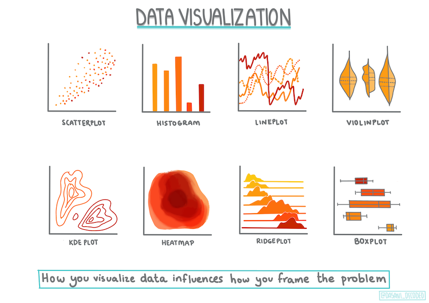
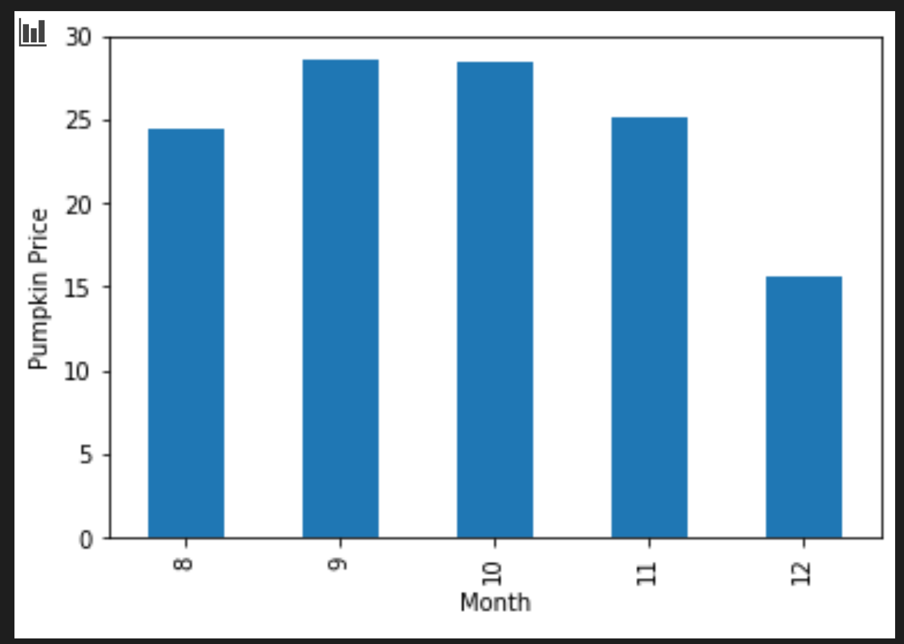

# Membangun sebuah model regresi dengan Scikit-learn: siapkan dan visualisasikan data


> Infografik oleh [Dasani Madipalli](https://twitter.com/dasani_decoded)

## [Kuis pra-ceramah](https://gray-sand-07a10f403.1.azurestaticapps.net/quiz/11/)

## Pembukaan

Karena sekarang kamu sudah siap dengan alat-alat yang akan diperlukan untuk mulai melampiaskan pembangunan model *machine learning* dengan Scikit-learn, kamu juga siap untuk mulai membuat pertanyaan dari datamu. Selagi kamu bekerja dengan data dan mengaplikasikan solusi ML, sangatlah penting untuk mengerti bagaimana menanyakan cara yang benar dan tepat untuk mengemukakan potensial *dataset*-mu.

Dalam pelajaran ini, kamu akan belajar:

- Cara mempersiapkan datamu untuk pembangunan model.
- Cara menggunakan Matplotlib untuk memvisualisasikan data.

## Menanyakan pertanyaan yang tepat dari datamu

Pertanyaan yang perlu dijawab akan menentukan jenis algoritma ML yang kamu akan memanfaatkan. Lalu, kualitas jawaban yang kamu akan dapat sangat tergantung pada sifat datamu (*the nature of your data*).

Lihatlah [data](../data/US-pumpkins.csv) yang disiapkan untuk pelajaran ini. Kamu bisa membuka file .csv ini di VS Code. Membaca dengan cepat, *dataset* ini ada yang kosong dan ada yang campuran data *string* dan data numerik. Adapula sebuah kolom 'Package' yang aneh dan mengandung data antara 'sacks', 'bins', dll. Terus terang, data ini amburadul.

Faktanya adalah tidak sering kita dihadiahkan sebuah *dataset* yang langsung bisa digunakan untuk membuat sebuah model ML. Dalam pelajaran ini, kamu akan belajar bagaimana menyiapkan sebuah *dataset* 'mentah' menggunakan *library* standar Python. Kamu juga akan belajar aneka teknik untuk memvisualisasikan datanya.

## Studi kasus: 'pasar labu'

Dalam folder ini kamu akan menemukan sebuah file .csv dalam folder `data` bernama [US-pumpkins.csv](../data/US-pumpkins.csv) yang mempunyai 1757 baris data tentang pasar labu disortir dalam pengelompokkan berdasarkan kota. Ini adalah data mentah yang diambil dari [Specialty Crops Terminal Markets Standard Reports (Laporan Standar Pasar Terminal Tanaman Khusus)](https://www.marketnews.usda.gov/mnp/fv-report-config-step1?type=termPrice) yang didistribusi Departemen Agrikultur Amerika Serikat.

### Menyiapkan data

Data ini terbuka untuk umum (*publik domain*) dan bisa diunduh sebagai banyak file terpisah berdasarkan kota dari situs internet Departemen Agrikultur Amerika Serikat. Supaya tidak berurusan dengan terlalu banyak file, kami telah menggabungkan data dari semua kota menjadi satu *spreadsheet* (file Excel). Jadi kamu sudah _menyiapkan_ datanya sedikit. Selanjutnya, mari kita lihat datanya.

### Data labu - kesimpulan-kesimpulan awal

Apa yang kamu cermati tentang data ini? Kamu sudah melihat bahwa ada campuran *string*, nomor, kekosongan, dan nilai-nilai aneh yang harus diartikan.

Pertanyaan apa yang kamu bisa tanyakan dari data data ini menggunakan teknik regresi? Kalau "Prediksikan harga jual sebuah labu pada bulan tertentu" bagaimana? Melihat datanya sekali lagi, ada beberapa perubahan yang kamu harus terapkan untuk membuat struktur data yang diperlukan untuk tugas ini.

## Latihan - analisiskan data labu

Mari menggunakan [Pandas](https://pandas.pydata.org/) (singkatan dari `Python Data Analysis`), sebuah alat yang sangat beruna untuk membentuk, menganalisis, dan menyiapkan data labu ini.

### Pertama, carilah tanggal yang hilang

Kamu harus mengambil langkah untuk mencari tanggal-tanggal yang hilang terlebih dahulu:

1. Konversi tanggal-tanggalnya menjadi format bulan (tanggal-tanggal ini dalam format Amerika Serikat, yaitu `BULAN/TANGGAL/TAHUN`).
2. Jadikan data bulan menjadi kolom baru

Buka file _notebook.ipynb_ dalam Visual Studio Code dan impor *spreadsheet*-nya menjadi sebuah *dataframe* Pandas.

1. Gunakan fungsi `head()` untuk melihat lima baris pertama.

    ```python
    import pandas as pd
    pumpkins = pd.read_csv('../../data/US-pumpkins.csv')
    pumpkins.head()
    ```

    ✅ Fungsi apa yang akan kamu gunakan untuk melihat lima baris **terakhir**?

2. Periksa apa ada data yang hilang dalam *dataframe* ini:

    ```python
    pumpkins.isnull().sum()
    ```

    Ada data yang hilang, namun mungkin tidak akan diperlukan untuk tugas ini.

3. Untuk menjadikan *dataframe* kamu lebih mudah untuk digunakan, buanglah beberapa kolom menggunakan `drop()` dan simpanlah kolom-kolom yang diperlukan saja:

    ```python
    new_columns = ['Package', 'Month', 'Low Price', 'High Price', 'Date']
    pumpkins = pumpkins.drop([c for c in pumpkins.columns if c not in new_columns], axis=1)
    ```

### Kedua, tentukan harga rata-rata labu

Pikirkan bagaimana caranya menentukan harga rata-rata sebuah labu pada bulan tertentu. Kamu akan pilih kolom apa saja untuk tugas ini? Petunjuk: kamu akan perlu 3 kolom.

Solusi: Ambil rata-rata kolom `Low Price` dan `High Price` untuk mengisi kolom `Price` yang baru. Terus, konversikan kolom `Date` untuk hanya menunjukkan bulan saja. Untungnya, berdasarkan pemeriksaan di atas, tidak ada data tanggal atau harga yang hilang.

1. Untuk mengkalkulasi rata-rata, tambahlah kode berikut:

    ```python
    price = (pumpkins['Low Price'] + pumpkins['High Price']) / 2
    
    month = pd.DatetimeIndex(pumpkins['Date']).month
    
    ```

   ✅ Jangan ragu untuk mem-*print* data apapun yang kamu ingin periksa menggunakan `print(month)`.

2. Sekarang, salinlah data yang telah dikonversi ke sebuah *dataframe* Pandas yang baru:

    ```python
    new_pumpkins = pd.DataFrame({'Month': month, 'Package': pumpkins['Package'], 'Low Price': pumpkins['Low Price'],'High Price': pumpkins['High Price'], 'Price': price})
    ```

    Jika *dataframe* baru ini di-*print*, kamu akan lihat sebuah *dataset* yang rapih darimana kamu bisa membangun model regresi barumu.

### But wait! There's something odd here
### Tunggu! Ada yang aneh di sini

Kalau kamu lihat kolom `Package`, labu dijual dalam berbagai konfigurasi. Beberapa dijual dalam satuan '1 1/9 bushel', beberapa per labu, beberapa per pon, dan beberapa dalam dus-dus besar dengan kelebaran yang berbeda-beda.

> Kelihatannya susah untuk menimbang labu secara konsisten

Menggali data orisinal lebih dalam, sangatlah menarik untuk melihat apapun dengan `Unit of Sale` (satuan penjualan) yang sama dengan 'EACH' atau 'PER BIN' akan mempunyai jenis `Package` yang per inci, per bin, atau 'each'. Kelihatannya susah untuk menimbang labu secara konsisten, jadi mari memilah datanya dengan hanya memilih labu yang kolom `Package`-nya sama dengan *string* 'bushel'.

1. Tambah sebuah filter di atas file tetapi dibawah impor .csv yang di awal

    ```python
    pumpkins = pumpkins[pumpkins['Package'].str.contains('bushel', case=True, regex=True)]
    ```
    
	Kalau kamu *print* datanya sekarang, kamu bisa lihat bahwa kamu hanya mendapatkan sekitar 415 baris data yang mengandung data labu per bushel.

### Tunggu! Masih ada satu lagi

Apa kamu sadar bahwa jumlah bushel berbeda-beda per baris? Kamu harus menormalisasi harganya supaya kamu menunjukkan harga per bushel. Gunakanlah sedikit matematika untuk menstandarisasinya.

1. Tambahlah beberapa baris ini setelah blok yang membuat *dataframe* new_pumpkins:

    ```python
    new_pumpkins.loc[new_pumpkins['Package'].str.contains('1 1/9'), 'Price'] = price/(1 + 1/9)
    
    new_pumpkins.loc[new_pumpkins['Package'].str.contains('1/2'), 'Price'] = price/(1/2)
    ```

✅ Berdasarkan [The Spruce Eats](https://www.thespruceeats.com/how-much-is-a-bushel-1389308), berat satu bushel tergantung jenis hasil bumi sebab bushel adalah satuan volume. "Satu bushel tomat, sebagai contoh, seharusnya seberat 56 pon (25.4 kg)... Dedaunan mengambil lebih banyak ruang tetapi lebih ringan, jadi satu bushel bayam hanya seberat 20 pon (9.1 kg)" (diterjemah). Lumayan rumit ya! Kita tidak usah mengkonversi bushel ke pon saja bagaimana, jadi kita gunakan satuan harga per bushel? Namun, semua riset ini tentang bushel labu menunjukkan sebagaimana pentingnya untuk mengerti sifat datamu!

Sekarang, kamu bisa meneliti harga per satuan berdasarkan hitungan bushel mereka. Jika kamu *print* datanya sekali lagi, kamu bisa lihat bagaimana telah distandarisasi.

✅ Apa kamu sadar bahwa labu yang dijual per setengah bushel sangat mahal? Kira-kira mengapa ya? Petunjuk: labu kecil jauh lebih mahal daripada labu besar, mungkin karena ada lebih banyak per bushel, apalagi mengingat pula bahwa satu labu besar mempunyai rongga kosong yang besar di dalamnya.

## Strategi Visualisasi

Sebagian dari peran seorang *data scientist* adalah untuk mendemonstrasikan kualitas dan sifat data yang sedang digunakan. Untuk melakukan ini, mereka seringkali membuat visualisasi-visualisasi atau grafik menarik yang menunjukkan aspek-aspek berbeda tentang datanya. Dengan cara ini, mereka dapat menunjukkan hubungan-hubungan dan celah-celah secara visual. Kalau tidak secara visual, akan susah untuk menemukan pola-pola tersebut.

Visualisasi juga bisa membantu menentukan teknik *machine learning* yang palingn cocok untuk datanya. Sebagai contoh, sebuah petak sebar yang kelihatannya mengikuti sebuah garis mengindikasikan bahwa data ini adalah kandidat baik untuk latihan regresi linear.

Satu *library* visualisasi data yang bekerja dengan baik dalam sebuah *Jupyter notebook* adalah [Matplotlib](https://matplotlib.org/) (yang kamu juga lihat dalam pelajaran sebelumnya).

> Carilah pengalaman dalam memvisualisasi data dengan [tutorial-tutorial ini](https://docs.microsoft.com/learn/modules/explore-analyze-data-with-python?WT.mc_id=academic-77952-leestott).

## Latihan - sebuah experimen dengan Matplotlib

Coba membuat beberapa grafik sederhana untuk menunjukkan *dataframe* baru yang baru kamu buat. Kira-kira, sebuah plot garis akan menunjukkan apa ya?

1. Impor Matplotlib di atas file tetapi di bawah impor Pandas:

    ```python
    import matplotlib.pyplot as plt
    ```

2. Jalankan ulang keseluruhan *notebook*-nya.
3. Di bagian bawah *notebook*-nya, tambahkan sebuah sel untuk menggambarkan datanya sebagai sebuah kotak.

    ```python
    price = new_pumpkins.Price
    month = new_pumpkins.Month
    plt.scatter(price, month)
    plt.show()
    ```

    

    Apakah grafik ini berguna? Apa ada yang mengejutkanmu?

    Sebenarnya tidak terlalu berguna karena dia hanya menunjukkan datamu sebagai sebuah penyebaran poin pada bulan tertentu.

### Jadikan berguna

Untuk menjadikan sebuah grafik menjadi berguna, biasanya datanya harus dikelompokkan dengan suatu cara. Kita coba membuat suatu plot di mana sumbu y menunjukkan bulan dan datanya mendemonstrasikan distribusi data, yuk!

1. Tambah sebuah sel untuk membuat sebuah diagram batang berkelompok:

    ```python
    new_pumpkins.groupby(['Month'])['Price'].mean().plot(kind='bar')
    plt.ylabel("Pumpkin Price")
    ```

    

    Nah, ini lebih berguna! Kelihatannya visualisasi ini mengindikasi bahwa labu itu paling mahal pada bulan September dan Oktober. Apa itu sesuai ekspektasimu? Mengapa?

---

## 🚀Tantangan

Jelajahi jenis-jenis visualisasi yang beda dan yang disediakan Matplotlib. Jenis mana yang paling cocok untuk kasus regresi?

## [Kuis pasca-ceramah](https://gray-sand-07a10f403.1.azurestaticapps.net/quiz/12/)

## Review & Pembelajaran Mandiri

Lihatlah beragam cara memvisualisasi data. Buatlah sebuah daftar dari aneka *library* yang tersedia dan catatlah yang mana yang paling baik untuk jenis-jenis tugas tertentu. Sebagai contoh, bagaimana dengan visualisasi 2D vs. 3D? Apa yang kamu temukan?

## Tugas

[Menjelajahi visualisasi](../assignment.md)
