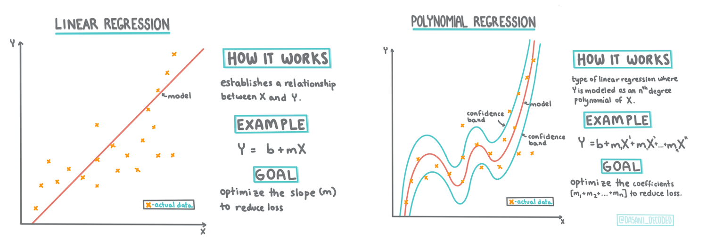
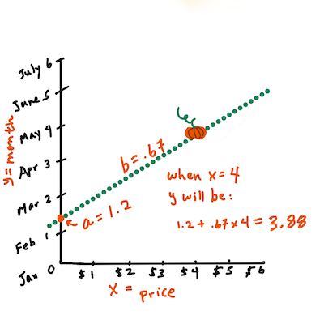
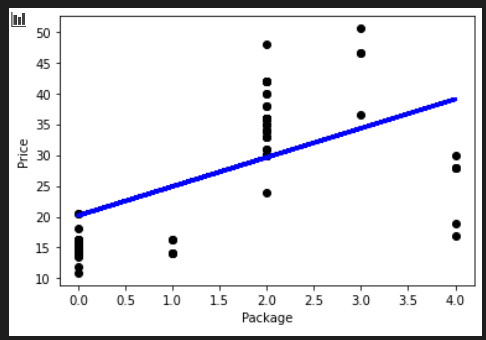
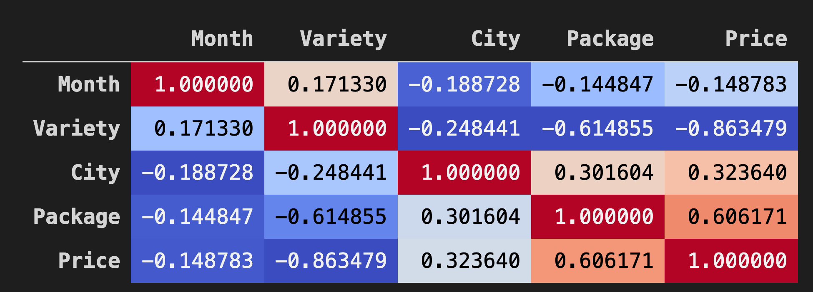
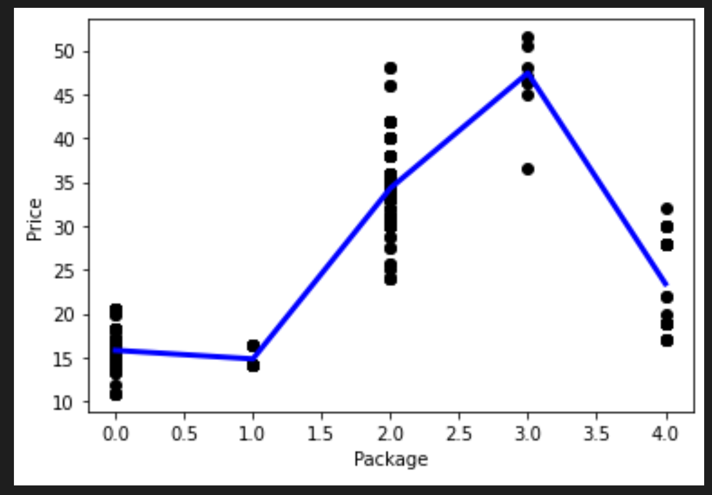

# Scikit-learn을 사용한 regression 모델 만들기: regression 2가지 방식


> Infographic by [Dasani Madipalli](https://twitter.com/dasani_decoded)

## [강의 전 퀴즈](https://white-water-09ec41f0f.azurestaticapps.net/quiz/13/)

### 소개 

지금까지 이 강의에서 사용할 호박 가격 데이터셋에서 모은 샘플 데이터로 regression이 무엇인지 찾아보았습니다. Matplotlib을 사용하여 시각화했습니다.

이제 ML의 regression에 대하여 더 깊게 파고 들 준비가 되었습니다. 이 강의에서, 2가지 타입의 regression에 대해 배웁니다: 이 기술의 기반이 되는 수학의 일부와 함께, _basic linear regression_ 과 _polynomial regression_.


> 이 커리큘럼 대부분에 걸쳐서, 수학에 대한 최소한의 지식을 가정하고, 다른 필드에서 온 학생들이 수학에 접근할 수 있도록 노력하므로, 이해를 돕기 위하여 노트, 🧮 callouts, 다이어그램과 기타 학습 도구를 찾아보세요.

### 필요한 조건

지금즈음 조사하고 있던 호박 데이터의 구조에 익숙해집니다. 이 강의의 _notebook.ipynb_ 파일에서 preloaded와 pre-cleaned된 것을 찾을 수 있습니다. 파일에서, 호박 가격은 새로운 데이터프레임에서 bushel per로 보여집니다. Visual Studio Code의 커널에서 이 노트북을 실행할 수 있는 지 확인합니다.

### 준비하기

참고하자면, 이러한 질문을 물어보기 위해서 이 데이터를 불러오고 있습니다.

- 호박을 사기 좋은 시간은 언제인가요?
- 작은 호박 케이스의 가격은 얼마인가요?
- half-bushel 바구니 또는 1 1/9 bushel 박스로 사야 하나요?

이 데이터로 계속 파봅시다.

이전 강의에서, Pandas 데이터프레임을 만들고 원본 데이터셋의 일부를 채웠으며, bushel로 가격을 표준화했습니다. 그렇게 했지만, 가을에만 400개의 데이터 포인트를 모을 수 있었습니다.

이 강의에 첨부된 notebook에서 미리 불러온 데이터를 봅시다. 데이터를 미리 불러오고 초기 scatterplot(산점도)이 월 데이터를 보여주도록 차트로 만듭니다. 더 정리하면 데이터의 특성에 대하여 조금 더 자세히 알 수 있습니다.

## Linear regression 라인

1 강의에서 배웠던 것처럼, linear regression 연습의 목표는 라인을 그릴 수 있어야 합니다:

- **변수 관계 보이기**. 변수 사이 관게 보이기
- **예상하기**. 새로운 데이터 포인트가 라인과 관련해서 어디에 있는지 정확하게 예측합니다.
 
이런 타입의 선을 그리는 것은 **Least-Squares Regression** 의 전형적입니다. 'least-squares'이라는 말은 regression 라인을 두른 모든 데이터 포인트가 제곱된 다음에 더하는 것을 의미합니다. 이상적으로, 적은 수의 오류, 또는 `least-squares`를 원하기 때문에, 최종 합계는 가능한 작아야 합니다.

모든 데이터 포인트에서 누적 거리가 가장 짧은 라인을 모델링하기 원합니다. 방향보다 크기에 관심있어서 항을 더하기 전에 제곱합니다.

> **🧮 Show me the math** 
> 
> _line of best fit_ 이라고 불리는 이 선은, [an equation](https://en.wikipedia.org/wiki/Simple_linear_regression)으로 표현할 수 있습니다:
> 
> ```
> Y = a + bX
> ```
>
> `X` 는 '독립(설명) 변수'입니다. `Y`는 '종속 변수'입니다. 라인의 기울기는 `b`이고 `a`는 y-절편이며, `X = 0`일 떄 `Y`의 값을 나타냅니다.
>
>
>
> 우선, 기울기 `b`를 구합니다. Infographic by [Jen Looper](https://twitter.com/jenlooper)
>
> 즉, 호박의 원본 질문을 참조해봅니다 : "predict the price of a pumpkin per bushel by month", `X`는 가격을 나타내고 `Y`는 판매한 달을 나타냅니다.
>
>
>
> Y의 값을 구합니다. 만약 4달러 정도 준다면, 4월만 가능합니다! Infographic by [Jen Looper](https://twitter.com/jenlooper)
>
> 라인을 구하는 수학은 절편, 또는 `X = 0`일 때 `Y`가 위치한 곳에 따라, 달라지는 라인의 기울기를 볼 수 있어야 합니다.
>
> [Math is Fun](https://www.mathsisfun.com/data/least-squares-regression.html) 웹사이트에서 값을 구하는 방식을 지켜볼 수 있습니다. 그리고 [this Least-squares calculator](https://www.mathsisfun.com/data/least-squares-calculator.html)를 찾아가서 숫자 값이 라인에 어떤 영향을 주는 지 볼 수 있습니다.

## 상관 관계

이해할 하나의 용어는 주어진 X와 Y 변수 사이의 **Correlation Coefficient**입니다. scatterplot(산점도)를 사용해서, 이 계수를 빠르게 시각화할 수 있습니다. 데이터 포인트를 깔끔한 라인으로 흩어 둔 plot은 상관 관계가 높지만, 데이터 포인트가  X와 Y 사이 어디에나 흩어진 plot은 상관 관계가 낮습니다.

좋은 linear regression 모델은 regression 라인과 같이 Least-Squares Regression 방식을 사용하여 (0 보다 1에 가까운) 높은 상관 계수를 가집니다.

✅ 이 강위에서 같이 주는 노트북을 실행하고 City to Price의 scatterplot (산점도)를 봅니다. scatterplot (산점도)의 시각적 해석에 따르면, 호박 판매를 도시와 가격에 연관지으면 데이터가 높거나 낮은 상관 관계를 보이는 것 같나요?


## Regression를 위한 데이터 준비하기

지금부터 연습에 기반한 수학을 이해했으므로, Regression 모델을 만들어서 호박 가격이 괜찮은 호박 패키지를 예측할 수 있는 지 봅니다. holiday pumpkin patch를 위해서 호박을 사는 사람은 이 정보로 패치용 호박 패키지를 최적으로 사고 싶습니다.

Scikit-learn을 사용할 예정이기 때문에, (할 수 있지만) 손으로 직접 할 필요가 없습니다. 수업 노트북의 주 데이터-처리 블록에서, Scikit-learn의 라이브러리를 추가하여 모든 문자열 데이터를 숫자로 자동 변환합니다:

```python
from sklearn.preprocessing import LabelEncoder

new_pumpkins.iloc[:, 0:-1] = new_pumpkins.iloc[:, 0:-1].apply(LabelEncoder().fit_transform)
```

new_pumpkins 데이터프레임을 보면, 모든 문자열은 이제 숫자로 보입니다. 직접 읽기는 힘들지만 Scikit-learn은 더욱 더 이해하기 쉽습니다!
지금부터 regression에 잘 맞는 데이터에 대하여 (scatterplot(산점도) 지켜보는 것 말고도) 교육적인 결정을 할 수 있습니다.

잠재적으로 좋은 예측 모델을 만드려면 데이터의 두 포인트 사이 좋은 상관 관계를 찾아야 합니다. 도시와 가격 사이에는 약한 상관 관계만 있다는, 사실이 밝혀졌습니다:

```python
print(new_pumpkins['City'].corr(new_pumpkins['Price']))
0.32363971816089226
```

하지만 패키지와 가격 사이에는 조금 더 큰 상관 관계가 있습니다. 이해가 되나요? 일반적으로, 농산물 박스가 클수록, 가격도 높습니다.

```python
print(new_pumpkins['Package'].corr(new_pumpkins['Price']))
0.6061712937226021
```

데이터에 물어보기 좋은 질문은 이렇습니다: 'What price can I expect of a given pumpkin package?'

regression 모델을 만들어봅니다

## linear 모델 만들기

모델을 만들기 전에, 데이터를 다시 정리합니다. Null 데이터를 드랍하고 데이터가 어떻게 보이는 지 다시 확인합니다.

```python
new_pumpkins.dropna(inplace=True)
new_pumpkins.info()
```

그러면, 최소 셋에서 새로운 데이터프레임을 만들고 출력합니다:

```python
new_columns = ['Package', 'Price']
lin_pumpkins = new_pumpkins.drop([c for c in new_pumpkins.columns if c not in new_columns], axis='columns')

lin_pumpkins
```

```output
	Package	Price
70	0	13.636364
71	0	16.363636
72	0	16.363636
73	0	15.454545
74	0	13.636364
...	...	...
1738	2	30.000000
1739	2	28.750000
1740	2	25.750000
1741	2	24.000000
1742	2	24.000000
415 rows × 2 columns
```

1. 이제 X와 Y 좌표 데이터를 대입합니다:

   ```python
   X = lin_pumpkins.values[:, :1]
   y = lin_pumpkins.values[:, 1:2]
   ```
✅ 어떤 일이 생기나요? [Python slice notation](https://stackoverflow.com/questions/509211/understanding-slice-notation/509295#509295)으로 `X` 와 `y`를 채울 배열을 생성합니다.

2. 다음으로, regression model-building 루틴을 시작합니다:

   ```python
   from sklearn.linear_model import LinearRegression
   from sklearn.metrics import r2_score, mean_squared_error, mean_absolute_error
   from sklearn.model_selection import train_test_split

   X_train, X_test, y_train, y_test = train_test_split(X, y, test_size=0.2, random_state=0)
   lin_reg = LinearRegression()
   lin_reg.fit(X_train,y_train)

   pred = lin_reg.predict(X_test)

   accuracy_score = lin_reg.score(X_train,y_train)
   print('Model Accuracy: ', accuracy_score)
   ```

   상관 관계가 좋지 못해서, 만들어진 모델은 딱히 정확하지 않습니다.

   ```output
   Model Accuracy:  0.3315342327998987
   ```

3. 프로세스에서 그려진 라인을 시각화할 수 있습니다:

   ```python
   plt.scatter(X_test, y_test,  color='black')
   plt.plot(X_test, pred, color='blue', linewidth=3)

   plt.xlabel('Package')
   plt.ylabel('Price')

   plt.show()
   ```
   

4. 가상의 Variety에 대하여 모델을 테스트합니다:

   ```python
   lin_reg.predict( np.array([ [2.75] ]) )
   ```
   
   전설적 Variety의 반품된 가격입니다:

   ```output
   array([[33.15655975]])
   ```

regression 라인의 로직이 사실이라면, 숫자는 의미가 있습니다.

🎃 축하드립니다. 방금 전에 몇 호박 종의 가격 예측하는 모델을 만들었습니다. holiday pumpkin patch는 아릅답습니다. 하지만 더 좋은 모델을 만들 수 있습니다!

## Polynomial regression

linear regression의 또 다른 타입은 polynomial regression 입니다. 때때로 변수 사이 linear 관계가 있지만 - 호박 볼륨이 클수록, 가격이 높아지는 - 이런 관계를 평면 또는 직선으로 그릴 수 없습니다.

✅ polynomial regression을 사용할 수 있는 데이터의 [some more examples](https://online.stat.psu.edu/stat501/lesson/9/9.8)입니다.

이전 plot에서 다양성과 가격 사이 관계를 봅니다. scatterplot(산점도)이 반드시 직선으로 분석되어야 하는 것처럼 보이나요? 아마 아닐겁니다. 이 케이스에서, polynomial regression을 시도할 수 있습니다.

✅ Polynomials는 하나 또는 더 많은 변수와 계수로 이루어 질 수 있는 수학적 표현식입니다.

Polynomial regression은 nonlinear 데이터에 더 맞는 곡선을 만듭니다.

1. 원본 호박 데이터의 세그먼트로 채워진 데이터프레임을 다시 만듭니다:

   ```python
   new_columns = ['Variety', 'Package', 'City', 'Month', 'Price']
   poly_pumpkins = new_pumpkins.drop([c for c in new_pumpkins.columns if c not in new_columns], axis='columns')

   poly_pumpkins
   ```

데이터프레임의 데이터 사이 상관 관계를 시각화하는 좋은 방식은 'coolwarm' 차트에 보여주는 것입니다:

2. 인수 값으로 `coolwarm`을 `Background_gradient()` 메소드에 사용합니다:

   ```python
   corr = poly_pumpkins.corr()
   corr.style.background_gradient(cmap='coolwarm')
   ```
   이 코드로 heatmap을 만듭니다:
   

이 차트를 보고 있으면, 패키지와 가격 사이 좋은 상관 관계를 시각화할 수 있습니다. 그래서 이전의 모델보다 약간 좋게 만들 수 있어야 합니다.

### 파이프라인 만들기

Scikit-learn에는 polynomial regression 모델을 만들 때 도움을 받을 수 있는 API가 포함되어 있습니다 - the `make_pipeline` [API](https://scikit-learn.org/stable/modules/generated/sklearn.pipeline.make_pipeline.html?highlight=pipeline#sklearn.pipeline.make_pipeline). 추정량의 체인인 'pipeline'이 만들어집니다. 이 케이스는, 파이프라인에 polynomial features, 또는 nonlinear 경로를 만들 예측이 포함됩니다.

1. X 와 y 열을 작성합니다:

   ```python
   X=poly_pumpkins.iloc[:,3:4].values
   y=poly_pumpkins.iloc[:,4:5].values
   ```

2. `make_pipeline()` 메소드를 불러서 파이프라인을 만듭니다:

   ```python
   from sklearn.preprocessing import PolynomialFeatures
   from sklearn.pipeline import make_pipeline

   pipeline = make_pipeline(PolynomialFeatures(4), LinearRegression())

   X_train, X_test, y_train, y_test = train_test_split(X, y, test_size=0.2, random_state=0)

   pipeline.fit(np.array(X_train), y_train)

   y_pred=pipeline.predict(X_test)
   ```

### 시퀀스 만들기

이 지점에서, 파이프라인이 시퀀스를 만들 수 있도록 _sorted_ 데이터로 새로운 데이터프레임을 만들 필요가 있습니다.

해당 코드를 추가합니다:

   ```python
   df = pd.DataFrame({'x': X_test[:,0], 'y': y_pred[:,0]})
   df.sort_values(by='x',inplace = True)
   points = pd.DataFrame(df).to_numpy()

   plt.plot(points[:, 0], points[:, 1],color="blue", linewidth=3)
   plt.xlabel('Package')
   plt.ylabel('Price')
   plt.scatter(X,y, color="black")
   plt.show()
   ```

`pd.DataFrame`을 불러서 새로운 데이터프레임을 만듭니다. 그러면 `sort_values()`도 불러서 값을 정렬합니다. 마지막으로 polynomial plot을 만듭니다:



데이터에 더 맞는 곡선을 볼 수 있습니다.

모델의 정확도를 확인합시다:

   ```python
   accuracy_score = pipeline.score(X_train,y_train)
   print('Model Accuracy: ', accuracy_score)
   ```

   그리고 짠!

   ```output
   Model Accuracy:  0.8537946517073784
   ```

더 좋습니다! 가격을 예측해봅시다:

### 예측하기

새로운 값을 넣고 예측할 수 있나요?

`predict()`를 불러서 예측합니다:
 
   ```python
   pipeline.predict( np.array([ [2.75] ]) )
   ```

   이렇게 예측됩니다:

   ```output
   array([[46.34509342]])
   ```

주어진 plot에서, 의미가 있습니다! 그리고, 이전보다 모델이 더 좋아졌다면, 같은 데이터를 보고, 더 비싼 호박을 위한 예산이 필요합니다!

🏆 좋습니다! 이 강의에서 두가지 regression 모델을 만들었습니다. regression의 마지막 섹션에서, 카테고리를 결정하기 위한 logistic regression에 대하여 배우게 됩니다.

---
## 🚀 도전

노트북에서 다른 변수를 테스트하면서 상관 관계가 모델 정확도에 어떻게 대응되는 지 봅니다.

## [강의 후 퀴즈](https://white-water-09ec41f0f.azurestaticapps.net/quiz/14/)

## 검토 & 자기주도 학습

이 강의에서 Linear Regression에 대하여 배웠습니다. Regression의 다른 중요 타입이 있습니다. Stepwise, Ridge, Lasso 와 Elasticnet 기술에 대하여 읽어봅니다. 더 배우기 위해서 공부하기 좋은 코스는 [Stanford Statistical Learning course](https://online.stanford.edu/courses/sohs-ystatslearning-statistical-learning)입니다.

## 과제 

[Build a Model](../assignment.md)