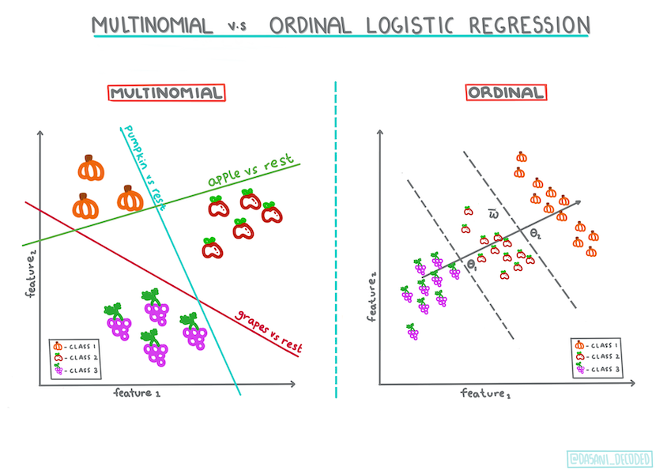
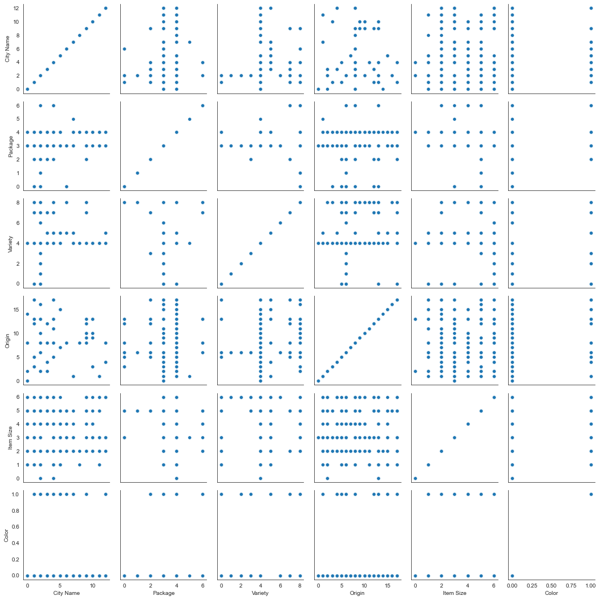
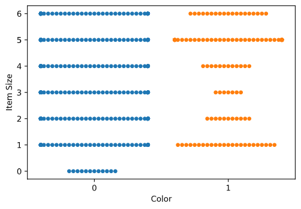
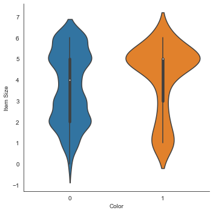
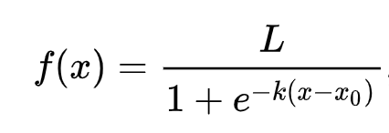
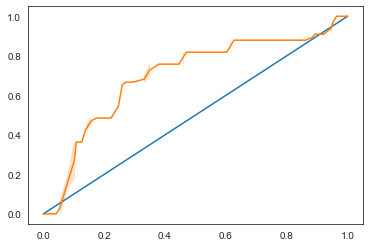

# カテゴリ予測のためのロジスティック回帰


> [Dasani Madipalli](https://twitter.com/dasani_decoded) によるインフォグラフィック
## [講義前のクイズ](https://gray-sand-07a10f403.1.azurestaticapps.net/quiz/15/)

## イントロダクション

回帰の最後のレッスンでは、古典的な機械学習手法の一つである、「ロジスティック回帰」を見ていきます。この手法は、2値のカテゴリを予測するためのパターンを発見するために使います。例えば、「このお菓子は、チョコレートかどうか？」、「この病気は伝染するかどうか？」、「この顧客は、この商品を選ぶかどうか？」などです。

このレッスンでは以下の内容を扱います。

- データを可視化するための新しいライブラリ
- ロジスティック回帰について

✅ この[モジュール](https://docs.microsoft.com/learn/modules/train-evaluate-classification-models?WT.mc_id=academic-77952-leestott) では、今回のタイプのような回帰について理解を深めることができます。

## 前提条件

カボチャのデータを触ったことで、データの扱いにかなり慣れてきました。その際にバイナリカテゴリが一つあることに気づきました。「`Color`」です。

いくつかの変数が与えられたときに、あるカボチャがどのような色になる可能性が高いか (オレンジ🎃または白👻)を予測するロジスティック回帰モデルを構築してみましょう。

> なぜ、回帰についてのレッスンで二値分類の話をしているのでしょうか？ロジスティック回帰は、線形ベースのものではありますが、[実際には分類法](https://scikit-learn.org/stable/modules/linear_model.html#logistic-regression) であるため、言語的な便宜上です。次のレッスングループでは、データを分類する他の方法について学びます。

## 質問の定義

ここでは、「Orange」か「Not Orange」かの二値で表現しています。データセットには「striped」というカテゴリーもありますが、ほとんど例がないので、ここでは使いません。データセットからnull値を削除すると、このカテゴリーは消えてしまいます。

> 🎃 面白いことに、白いカボチャを「お化けカボチャ」と呼ぶことがあります。彫るのが簡単ではないので、オレンジ色のカボチャほど人気はありませんが、見た目がクールですよね！

## ロジスティック回帰について

ロジスティック回帰は、前回学んだ線形回帰とは、いくつかの重要な点で異なります。

### 2値分類

ロジスティック回帰は、線形回帰とは異なる特徴を持っています。ロジスティック回帰は、二値のカテゴリー（「オレンジ色かオレンジ色でないか」）についての予測を行うのに対し、線形回帰は連続的な値を予測します。例えば、カボチャの産地と収穫時期が与えられれば、その価格がどれだけ上昇するかを予測することができます。


> [Dasani Madipalli](https://twitter.com/dasani_decoded) によるインフォグラフィック
### その他の分類

ロジスティック回帰には他にもMultinomialやOrdinalなどの種類があります。

- **Multinomial**: これは2つ以上のカテゴリーを持つ場合です。 (オレンジ、白、ストライプ)
- **Ordinal**: これは、順序付けられたカテゴリを含むもので、有限の数のサイズ（mini、sm、med、lg、xl、xxl）で並べられたカボチャのように、結果を論理的に並べたい場合に便利です。


> [Dasani Madipalli](https://twitter.com/dasani_decoded) によるインフォグラフィック

### 線形について

このタイプの回帰は、「カテゴリーの予測」が目的ですが、従属変数（色）と他の独立変数（都市名やサイズなどのデータセットの残りの部分）の間に明確な線形関係がある場合に最も効果的です。これらの変数を分ける線形性があるかどうかを把握するのは良いことです。

### 変数が相関している必要はない

線形回帰は、相関性の高い変数ほどよく働くことを覚えていますか？ロジスティック回帰は、そうとは限りません。相関関係がやや弱いこのデータには有効ですね。

### 大量のきれいなデータが必要です

一般的にロジスティック回帰は、より多くのデータを使用すれば、より正確な結果が得られます。私たちの小さなデータセットは、このタスクには最適ではありませんので、その点に注意してください。

✅ ロジスティック回帰に適したデータの種類を考えてみてください。

## エクササイズ - データの整形

まず、NULL値を削除したり、一部の列だけを選択したりして、データを少し綺麗にします。

1. 以下のコードを追加:

    ```python
    from sklearn.preprocessing import LabelEncoder
    
    new_columns = ['Color','Origin','Item Size','Variety','City Name','Package']
    
    new_pumpkins = pumpkins.drop([c for c in pumpkins.columns if c not in new_columns], axis=1)
    
    new_pumpkins.dropna(inplace=True)
    
    new_pumpkins = new_pumpkins.apply(LabelEncoder().fit_transform)
    ```

    新しいデータフレームはいつでも確認することができます。

    ```python
    new_pumpkins.info
    ```

### 可視化 - グリッド状に並べる

ここまでで、[スターターノートブック](../notebook.ipynb) にパンプキンデータを再度読み込み、`Color`を含むいくつかの変数を含むデータセットを保持するように整形しました。別のライブラリを使って、ノートブック内のデータフレームを可視化してみましょう。[Seaborn](https://seaborn.pydata.org/index.html) というライブラリを使って、ノートブック内のデータフレームを可視化してみましょう。このライブラリは、今まで使っていた`Matplotlib`をベースにしています。

Seabornには、データを可視化するためのいくつかの優れた方法があります。例えば、各データの分布を横並びのグリッドで比較することができます。

1. かぼちゃのデータ`new_pumpkins`を使って、`PairGrid`をインスタンス化し、`map()`メソッドを呼び出して、以下のようなグリッドを作成します。

    ```python
    import seaborn as sns
    
    g = sns.PairGrid(new_pumpkins)
    g.map(sns.scatterplot)
    ```

    

    データを並べて観察することで、Colorのデータが他の列とどのように関連しているのかを知ることができます。

    ✅ この散布図をもとに、どのような面白い試みが考えられるでしょうか？

### swarm plot

Colorは2つのカテゴリー（Orange or Not）であるため、「カテゴリカルデータ」と呼ばれ、「可視化にはより[専門的なアプローチ](https://seaborn.pydata.org/tutorial/categorical.html?highlight=bar) 」が必要となります。このカテゴリと他の変数との関係を可視化する方法は他にもあります。

Seabornプロットでは、変数を並べて表示することができます。

1. 値の分布を示す、'swarm' plotを試してみます。 

    ```python
    sns.swarmplot(x="Color", y="Item Size", data=new_pumpkins)
    ```

    

### Violin plot

'violin' タイプのプロットは、2つのカテゴリーのデータがどのように分布しているかを簡単に視覚化できるので便利です。Violin plotは、分布がより「滑らか」に表示されるため、データセットが小さい場合はあまりうまくいきません。

1. パラメータとして`x=Color`、`kind="violin"` をセットし、 `catplot()`メソッドを呼びます。

    ```python
    sns.catplot(x="Color", y="Item Size",
                kind="violin", data=new_pumpkins)
    ```

    

    ✅ 他の変数を使って、このプロットや他のSeabornのプロットを作成してみてください。

さて、`Color`の二値カテゴリと、より大きなサイズのグループとの関係がわかったところで、ロジスティック回帰を使って、あるカボチャの色について調べてみましょう。

> **🧮 数学の確認**
>
> 線形回帰では、通常の最小二乗法を用いて値を求めることが多かったことを覚えていますか？ロジスティック回帰は、[シグモイド関数](https://wikipedia.org/wiki/Sigmoid_function) を使った「最尤」の概念に依存しています。シグモイド関数は、プロット上では「S」字のように見えます。その曲線は「ロジスティック曲線」とも呼ばれます。数式は次のようになります。
>
> 
>
> ここで、シグモイドの中点はx=0の点、Lは曲線の最大値、kは曲線の急峻さを表します。この関数の結果が0.5以上であれば、そのラベルは二値選択のクラス「1」になります。そうでない場合は、「0」に分類されます。

## モデルの構築

これらの二値分類を行うためのモデルの構築は、Scikit-learnでは驚くほど簡単にできます。

1. 分類モデルで使用したい変数を選択し、`train_test_split()`メソッドでトレーニングセットとテストセットを分割します。

    ```python
    from sklearn.model_selection import train_test_split
    
    Selected_features = ['Origin','Item Size','Variety','City Name','Package']
    
    X = new_pumpkins[Selected_features]
    y = new_pumpkins['Color']
    
    X_train, X_test, y_train, y_test = train_test_split(X, y, test_size=0.2, random_state=0)
    
    ```

2. これで、学習データを使って`fit()`メソッドを呼び出し、モデルを訓練し、その結果を出力することができます。

    ```python
    from sklearn.model_selection import train_test_split
    from sklearn.metrics import accuracy_score, classification_report 
    from sklearn.linear_model import LogisticRegression
    
    model = LogisticRegression()
    model.fit(X_train, y_train)
    predictions = model.predict(X_test)
    
    print(classification_report(y_test, predictions))
    print('Predicted labels: ', predictions)
    print('Accuracy: ', accuracy_score(y_test, predictions))
    ```

    モデルのスコアボードを見てみましょう。1000行程度のデータしかないことを考えると、悪くないと思います。

    ```output
                       precision    recall  f1-score   support
    
               0       0.85      0.95      0.90       166
               1       0.38      0.15      0.22        33
    
        accuracy                           0.82       199
       macro avg       0.62      0.55      0.56       199
    weighted avg       0.77      0.82      0.78       199
    
    Predicted labels:  [0 0 0 0 0 0 0 0 0 0 0 0 0 0 0 0 0 0 0 0 1 0 0 0 0 0 0 0 0 0 0 0 0 1 0 0 0
     0 0 0 0 0 0 0 0 0 0 1 0 0 0 0 0 0 0 0 0 0 0 0 0 0 0 0 0 0 0 0 0 0 0 0 0 0
     1 0 0 0 0 0 0 0 0 0 0 0 0 0 0 0 0 0 0 0 0 0 0 0 0 0 0 0 1 0 0 0 0 0 0 0 1
     0 0 0 0 0 0 0 0 0 0 0 0 0 0 0 0 0 0 0 0 0 0 0 0 0 0 0 0 0 0 0 0 0 0 1 1 1
     0 0 0 0 0 0 0 0 0 0 0 0 0 0 0 0 0 0 0 0 0 0 0 0 0 0 0 0 0 0 0 0 0 0 0 0 0
     0 0 0 1 0 1 0 0 1 0 0 0 1 0]
    ```

## 混同行列による理解度の向上


上記の項目を出力することで[スコアボードレポート](https://scikit-learn.org/stable/modules/generated/sklearn.metrics.classification_report.html?highlight=classification_report#sklearn.metrics.classification_report) を得ることができますが、[混同行列](https://scikit-learn.org/stable/modules/model_evaluation.html#confusion-matrix) を使うことで、より簡単にモデルを理解することができるかもしれません。


> 🎓 [混同行列](https://wikipedia.org/wiki/Confusion_matrix) とは、モデルの真の陽性と陰性を表す表で、予測の正確さを測ることができます。

1. `confusion_matrix()`メソッドを呼んで、混同行列を作成します。

    ```python
    from sklearn.metrics import confusion_matrix
    confusion_matrix(y_test, predictions)
    ```

    T作成したモデルの混同行列をみてみてください。

    ```output
    array([[162,   4],
           [ 33,   0]])
    ```

Scikit-learnでは、混同行列の行 (axis=0)が実際のラベル、列 (axis=1)が予測ラベルとなります。

|       |   0   |   1   |
| :---: | :---: | :---: |
|   0   |  TN   |  FP   |
|   1   |  FN   |  TP   |

ここで何が起こっているのか？例えば、カボチャを「オレンジ色」と「オレンジ色でない」という2つのカテゴリーに分類するように求められたとしましょう。

- モデルではオレンジ色ではないと予測されたカボチャが、実際には「オレンジ色ではない」というカテゴリーに属していた場合、「true negative」と呼ばれ、左上の数字で示されます。
- モデルではオレンジ色と予測されたカボチャが、実際には「オレンジ色ではない」カテゴリーに属していた場合、「false negative」と呼ばれ、左下の数字で示されます。
- モデルがオレンジではないと予測したかぼちゃが、実際にはカテゴリー「オレンジ」に属していた場合、「false positive」と呼ばれ、右上の数字で示されます。
- モデルがカボチャをオレンジ色と予測し、それが実際にカテゴリ「オレンジ」に属する場合、「true positive」と呼ばれ、右下の数字で示されます。

お気づきの通り、true positiveとtrue negativeの数が多く、false positiveとfalse negativeの数が少ないことが好ましく、これはモデルの性能が高いことを意味します。

混同行列は、precisionとrecallにどのように関係するのでしょうか？上記の分類レポートでは、precision（0.83）とrecall（0.98）が示されています。

Precision = tp / (tp + fp) = 162 / (162 + 33) = 0.8307692307692308

Recall = tp / (tp + fn) = 162 / (162 + 4) = 0.9759036144578314

✅ Q: 混同行列によると、モデルの出来はどうでしたか？ A: 悪くありません。true negativeがかなりの数ありますが、false negativeもいくつかあります。

先ほどの用語を、混同行列のTP/TNとFP/FNのマッピングを参考にして再確認してみましょう。

🎓 Precision: TP/(TP + FP) 探索されたインスタンスのうち、関連性のあるインスタンスの割合（どのラベルがよくラベル付けされていたかなど）。

🎓 Recall: TP/(TP + FN) ラベリングされているかどうかに関わらず、探索された関連インスタンスの割合です。

🎓 f1-score: (2 * precision * recall)/(precision + recall) precisionとrecallの加重平均で、最高が1、最低が0となる。

🎓 Support: 取得した各ラベルの出現回数です。

🎓 Accuracy: (TP + TN)/(TP + TN + FP + FN) サンプルに対して正確に予測されたラベルの割合です。

🎓 Macro Avg: 各ラベルの非加重平均指標の計算で、ラベルの不均衡を考慮せずに算出される。

🎓 Weighted Avg: 各ラベルのサポート数（各ラベルの真のインスタンス数）で重み付けすることにより、ラベルの不均衡を考慮して、各ラベルの平均指標を算出する。

✅ 自分のモデルでfalse negativeの数を減らしたい場合、どの指標に注目すべきか考えられますか？

## モデルのROC曲線を可視化する

これは悪いモデルではありません。精度は80%の範囲で、理想的には、一連の変数が与えられたときにカボチャの色を予測するのに使うことができます。

いわゆる「ROC」スコアを見るために、もう一つの可視化を行ってみましょう。

```python
from sklearn.metrics import roc_curve, roc_auc_score

y_scores = model.predict_proba(X_test)
# calculate ROC curve
fpr, tpr, thresholds = roc_curve(y_test, y_scores[:,1])
sns.lineplot([0, 1], [0, 1])
sns.lineplot(fpr, tpr)
```
Seaborn を再度使用して、モデルの [受信者操作特性 (Receiving Operating Characteristic)](https://scikit-learn.org/stable/auto_examples/model_selection/plot_roc.html?highlight=roc) またはROCをプロットします。ROC曲線は、分類器の出力を、true positiveとfalse positiveの観点から見るためによく使われます。ROC曲線は通常、true positive rateをY軸に、false positive rateをX軸にとっています。したがって、曲線の急峻さと、真ん中の線形な線と曲線の間のスペースが重要で、すぐに頭を上げて中線を超えるような曲線を求めます。今回のケースでは、最初にfalse positiveが出て、その後、ラインがきちんと上に向かって超えていきます。



最後に、Scikit-learnの[`roc_auc_score` API](https://scikit-learn.org/stable/modules/generated/sklearn.metrics.roc_auc_score.html?highlight=roc_auc#sklearn.metrics.roc_auc_score) を使って、実際の「Area Under the Curve」(AUC)を計算します。

```python
auc = roc_auc_score(y_test,y_scores[:,1])
print(auc)
```
結果は`0.6976998904709748`となりました。AUCの範囲が0から1であることを考えると、大きなスコアが欲しいところです。なぜなら、予測が100%正しいモデルはAUCが1になるからです。

今後の分類のレッスンでは、モデルのスコアを向上させるための反復処理の方法を学びます。一旦おめでとうございます。あなたはこの回帰のレッスンを完了しました。

---
## 🚀チャレンジ

ロジスティック回帰については、まだまだ解き明かすべきことがたくさんあります。しかし、学ぶための最良の方法は、実験することです。この種の分析に適したデータセットを見つけて、それを使ってモデルを構築してみましょう。ヒント：面白いデータセットを探すために[Kaggle](https://www.kaggle.com/search?q=logistic+regression+datasets) を試してみてください。

## [講義後クイズ](https://gray-sand-07a10f403.1.azurestaticapps.net/quiz/16/)

## レビュー & 自主学習

ロジスティック回帰の実用的な使い方について、[Stanfordからのこの論文](https://web.stanford.edu/~jurafsky/slp3/5.pdf) の最初の数ページを読んでみてください。これまで学んできた回帰タスクのうち、どちらか一方のタイプに適したタスクについて考えてみてください。何が一番うまくいくでしょうか？

## 課題 

[回帰に再挑戦する](./assignment.ja.md)
