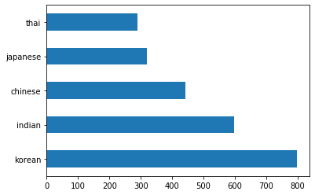
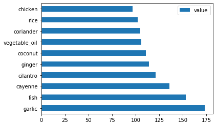
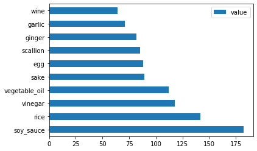
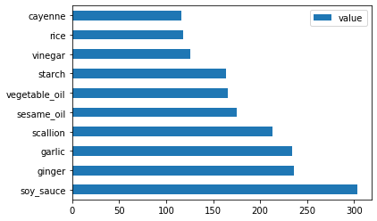
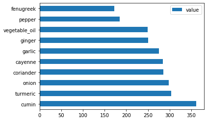
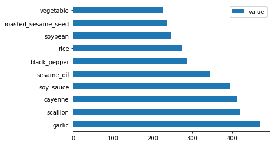

# Introduction to classification

In these four lessons, you will explore a fundamental focus of classic machine learning - _classification_. We will walk through using various classification algorithms with a dataset about all the brilliant cuisines of Asia and India. Hope you're hungry!


> Celebrate pan-Asian cuisines in these lessons! Image by [Jen Looper](https://twitter.com/jenlooper)

Classification is a form of [supervised learning](https://wikipedia.org/wiki/Supervised_learning) that bears a lot in common with regression techniques. If machine learning is all about predicting values or names to things by using datasets, then classification generally falls into two groups: _binary classification_ and _multiclass classification_.

[](https://youtu.be/eg8DJYwdMyg "Introduction to classification")

> 🎥 Click the image above for a video: MIT's John Guttag introduces classification

Remember:

- **Linear regression** helped you predict relationships between variables and make accurate predictions on where a new datapoint would fall in relationship to that line. So, you could predict _what price a pumpkin would be in September vs. December_, for example.
- **Logistic regression** helped you discover "binary categories": at this price point, _is this pumpkin orange or not-orange_?

Classification uses various algorithms to determine other ways of determining a data point's label or class. Let's work with this cuisine data to see whether, by observing a group of ingredients, we can determine its cuisine of origin.

## [Pre-lecture quiz](https://gray-sand-07a10f403.1.azurestaticapps.net/quiz/19/)

> ### [This lesson is available in R!](./solution/R/lesson_10.html)

### Introduction

Classification is one of the fundamental activities of the machine learning researcher and data scientist. From basic classification of a binary value ("is this email spam or not?"), to complex image classification and segmentation using computer vision, it's always useful to be able to sort data into classes and ask questions of it.

To state the process in a more scientific way, your classification method creates a predictive model that enables you to map the relationship between input variables to output variables.


> Binary vs. multiclass problems for classification algorithms to handle. Infographic by [Jen Looper](https://twitter.com/jenlooper)

Before starting the process of cleaning our data, visualizing it, and prepping it for our ML tasks, let's learn a bit about the various ways machine learning can be leveraged to classify data.

Derived from [statistics](https://wikipedia.org/wiki/Statistical_classification), classification using classic machine learning uses features, such as `smoker`, `weight`, and `age` to determine _likelihood of developing X disease_. As a supervised learning technique similar to the regression exercises you performed earlier, your data is labeled and the ML algorithms use those labels to classify and predict classes (or 'features') of a dataset and assign them to a group or outcome.

✅ Take a moment to imagine a dataset about cuisines. What would a multiclass model be able to answer? What would a binary model be able to answer? What if you wanted to determine whether a given cuisine was likely to use fenugreek? What if you wanted to see if, given a present of a grocery bag full of star anise, artichokes, cauliflower, and horseradish, you could create a typical Indian dish?

[](https://youtu.be/GuTeDbaNoEU "Crazy mystery baskets")

> 🎥 Click the image above for a video.The whole premise of the show 'Chopped' is the 'mystery basket' where chefs have to make some dish out of a random choice of ingredients. Surely a ML model would have helped!

## Hello 'classifier'

The question we want to ask of this cuisine dataset is actually a **multiclass question**, as we have several potential national cuisines to work with. Given a batch of ingredients, which of these many classes will the data fit?

Scikit-learn offers several different algorithms to use to classify data, depending on the kind of problem you want to solve. In the next two lessons, you'll learn about several of these algorithms.

## Exercise - clean and balance your data

The first task at hand, before starting this project, is to clean and **balance** your data to get better results. Start with the blank _notebook.ipynb_ file in the root of this folder.

The first thing to install is [imblearn](https://imbalanced-learn.org/stable/). This is a Scikit-learn package that will allow you to better balance the data (you will learn more about this task in a minute).

1. To install `imblearn`, run `pip install`, like so:

    ```python
    pip install imblearn
    ```

1. Import the packages you need to import your data and visualize it, also import `SMOTE` from `imblearn`.

    ```python
    import pandas as pd
    import matplotlib.pyplot as plt
    import matplotlib as mpl
    import numpy as np
    from imblearn.over_sampling import SMOTE
    ```

    Now you are set up to read import the data next.

1. The next task will be to import the data:

    ```python
    df  = pd.read_csv('../data/cuisines.csv')
    ```

   Using `read_csv()` will read the content of the csv file _cusines.csv_ and place it in the variable `df`.

1. Check the data's shape:

    ```python
    df.head()
    ```

   The first five rows look like this:

    ```output
    |     | Unnamed: 0 | cuisine | almond | angelica | anise | anise_seed | apple | apple_brandy | apricot | armagnac | ... | whiskey | white_bread | white_wine | whole_grain_wheat_flour | wine | wood | yam | yeast | yogurt | zucchini |
    | --- | ---------- | ------- | ------ | -------- | ----- | ---------- | ----- | ------------ | ------- | -------- | --- | ------- | ----------- | ---------- | ----------------------- | ---- | ---- | --- | ----- | ------ | -------- |
    | 0   | 65         | indian  | 0      | 0        | 0     | 0          | 0     | 0            | 0       | 0        | ... | 0       | 0           | 0          | 0                       | 0    | 0    | 0   | 0     | 0      | 0        |
    | 1   | 66         | indian  | 1      | 0        | 0     | 0          | 0     | 0            | 0       | 0        | ... | 0       | 0           | 0          | 0                       | 0    | 0    | 0   | 0     | 0      | 0        |
    | 2   | 67         | indian  | 0      | 0        | 0     | 0          | 0     | 0            | 0       | 0        | ... | 0       | 0           | 0          | 0                       | 0    | 0    | 0   | 0     | 0      | 0        |
    | 3   | 68         | indian  | 0      | 0        | 0     | 0          | 0     | 0            | 0       | 0        | ... | 0       | 0           | 0          | 0                       | 0    | 0    | 0   | 0     | 0      | 0        |
    | 4   | 69         | indian  | 0      | 0        | 0     | 0          | 0     | 0            | 0       | 0        | ... | 0       | 0           | 0          | 0                       | 0    | 0    | 0   | 0     | 1      | 0        |
    ```

1. Get info about this data by calling `info()`:

    ```python
    df.info()
    ```

    Your out resembles:

    ```output
    <class 'pandas.core.frame.DataFrame'>
    RangeIndex: 2448 entries, 0 to 2447
    Columns: 385 entries, Unnamed: 0 to zucchini
    dtypes: int64(384), object(1)
    memory usage: 7.2+ MB
    ```

## Exercise - learning about cuisines

Now the work starts to become more interesting. Let's discover the distribution of data, per cuisine 

1. Plot the data as bars by calling `barh()`:

    ```python
    df.cuisine.value_counts().plot.barh()
    ```

    

    There are a finite number of cuisines, but the distribution of data is uneven. You can fix that! Before doing so, explore a little more. 

1. Find out how much data is available per cuisine and print it out:

    ```python
    thai_df = df[(df.cuisine == "thai")]
    japanese_df = df[(df.cuisine == "japanese")]
    chinese_df = df[(df.cuisine == "chinese")]
    indian_df = df[(df.cuisine == "indian")]
    korean_df = df[(df.cuisine == "korean")]
    
    print(f'thai df: {thai_df.shape}')
    print(f'japanese df: {japanese_df.shape}')
    print(f'chinese df: {chinese_df.shape}')
    print(f'indian df: {indian_df.shape}')
    print(f'korean df: {korean_df.shape}')
    ```

    the output looks like so:

    ```output
    thai df: (289, 385)
    japanese df: (320, 385)
    chinese df: (442, 385)
    indian df: (598, 385)
    korean df: (799, 385)
    ```

## Discovering ingredients

Now you can dig deeper into the data and learn what are the typical ingredients per cuisine. You should clean out recurrent data that creates confusion between cuisines, so let's learn about this problem.

1. Create a function `create_ingredient()` in Python to create an ingredient dataframe. This function will start by dropping an unhelpful column and sort through ingredients by their count:

    ```python
    def create_ingredient_df(df):
        ingredient_df = df.T.drop(['cuisine','Unnamed: 0']).sum(axis=1).to_frame('value')
        ingredient_df = ingredient_df[(ingredient_df.T != 0).any()]
        ingredient_df = ingredient_df.sort_values(by='value', ascending=False,
        inplace=False)
        return ingredient_df
    ```

   Now you can use that function to get an idea of top ten most popular ingredients by cuisine.

1. Call `create_ingredient()` and plot it calling `barh()`:

    ```python
    thai_ingredient_df = create_ingredient_df(thai_df)
    thai_ingredient_df.head(10).plot.barh()
    ```

    

1. Do the same for the japanese data:

    ```python
    japanese_ingredient_df = create_ingredient_df(japanese_df)
    japanese_ingredient_df.head(10).plot.barh()
    ```

    

1. Now for the chinese ingredients:

    ```python
    chinese_ingredient_df = create_ingredient_df(chinese_df)
    chinese_ingredient_df.head(10).plot.barh()
    ```

    

1. Plot the indian ingredients:

    ```python
    indian_ingredient_df = create_ingredient_df(indian_df)
    indian_ingredient_df.head(10).plot.barh()
    ```

    

1. Finally, plot the korean ingredients:

    ```python
    korean_ingredient_df = create_ingredient_df(korean_df)
    korean_ingredient_df.head(10).plot.barh()
    ```

    

1. Now, drop the most common ingredients that create confusion between distinct cuisines, by calling `drop()`: 

   Everyone loves rice, garlic and ginger!

    ```python
    feature_df= df.drop(['cuisine','Unnamed: 0','rice','garlic','ginger'], axis=1)
    labels_df = df.cuisine #.unique()
    feature_df.head()
    ```

## Balance the dataset

Now that you have cleaned the data, use [SMOTE](https://imbalanced-learn.org/dev/references/generated/imblearn.over_sampling.SMOTE.html) - "Synthetic Minority Over-sampling Technique" - to balance it.

1. Call `fit_resample()`, this strategy generates new samples by interpolation.

    ```python
    oversample = SMOTE()
    transformed_feature_df, transformed_label_df = oversample.fit_resample(feature_df, labels_df)
    ```

    By balancing your data, you'll have better results when classifying it. Think about a binary classification. If most of your data is one class, a ML model is going to predict that class more frequently, just because there is more data for it. Balancing the data takes any skewed data and helps remove this imbalance. 

1. Now you can check the numbers of labels per ingredient:

    ```python
    print(f'new label count: {transformed_label_df.value_counts()}')
    print(f'old label count: {df.cuisine.value_counts()}')
    ```

    Your output looks like so:

    ```output
    new label count: korean      799
    chinese     799
    indian      799
    japanese    799
    thai        799
    Name: cuisine, dtype: int64
    old label count: korean      799
    indian      598
    chinese     442
    japanese    320
    thai        289
    Name: cuisine, dtype: int64
    ```

    The data is nice and clean, balanced, and very delicious! 

1. The last step is to save your balanced data, including labels and features, into a new dataframe that can be exported into a file:

    ```python
    transformed_df = pd.concat([transformed_label_df,transformed_feature_df],axis=1, join='outer')
    ```

1. You can take one more look at the data using `transformed_df.head()` and `transformed_df.info()`. Save a copy of this data for use in future lessons:

    ```python
    transformed_df.head()
    transformed_df.info()
    transformed_df.to_csv("../data/cleaned_cuisines.csv")
    ```

    This fresh CSV can now be found in the root data folder.

---

## 🚀Challenge

This curriculum contains several interesting datasets. Dig through the `data` folders and see if any contain datasets that would be appropriate for binary or multi-class classification? What questions would you ask of this dataset?

## [Post-lecture quiz](https://gray-sand-07a10f403.1.azurestaticapps.net/quiz/20/)

## Review & Self Study

Explore SMOTE's API. What use cases is it best used for? What problems does it solve?

## Assignment 

[Explore classification methods](assignment.md)
