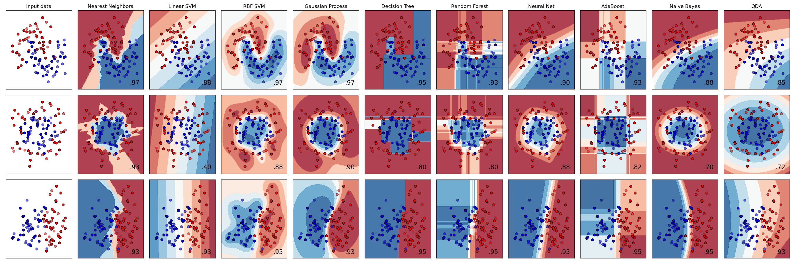
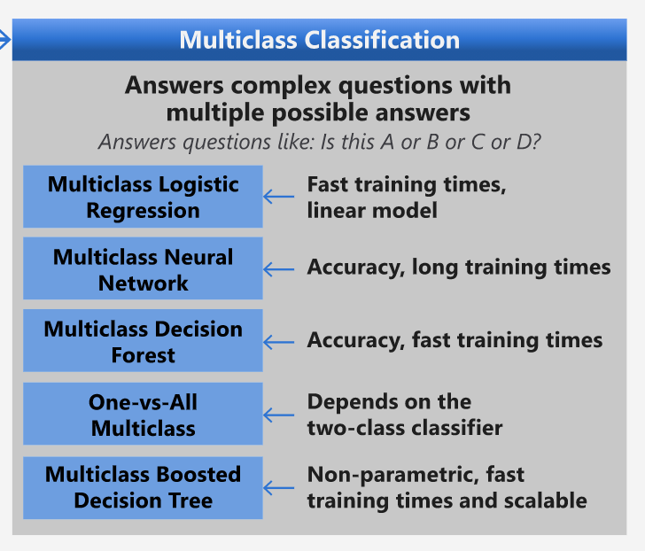
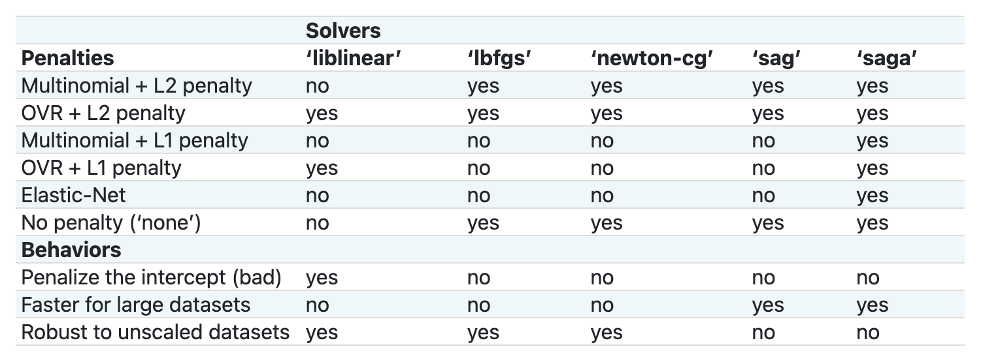

# 요리 classifiers 1

이 강의에서는, 요리에 대하여 균형적이고, 깔끔한 데이터로 채운 저번 강의에서 저장했던 데이터셋을 사용합니다.

다양한 classifiers와 데이터셋을 사용해서 _재료 그룹 기반으로 주어진 국민 요리를 예측_ 합니다. 이러는 동안, classification 작업에 알고리즘을 활용할 몇 방식에 대해 자세히 배워볼 예정입니다.

## [강의 전 퀴즈](https://gray-sand-07a10f403.1.azurestaticapps.net/quiz/21/)

## 준비하기

[Lesson 1](../../1-Introduction/README.md)을 완료했다고 가정하고, 4가지 강의의 최상단 `/data` 폴더에서 _cleaned_cuisines.csv_ 파일이 있는지 확인합니다.

## 연습 - 국민 요리 예측하기

1. 강의의 _notebook.ipynb_ 폴더에서 작업하고, Pandas 라이브러리와 이 파일을 가져옵니다:

    ```python
    import pandas as pd
    cuisines_df = pd.read_csv("../../data/cleaned_cuisines.csv")
    cuisines_df.head()
    ```

    데이터는 이렇게 보입니다:


    |     | Unnamed: 0 | cuisine | almond | angelica | anise | anise_seed | apple | apple_brandy | apricot | armagnac | ... | whiskey | white_bread | white_wine | whole_grain_wheat_flour | wine | wood | yam | yeast | yogurt | zucchini |
    | --- | ---------- | ------- | ------ | -------- | ----- | ---------- | ----- | ------------ | ------- | -------- | --- | ------- | ----------- | ---------- | ----------------------- | ---- | ---- | --- | ----- | ------ | -------- |
    | 0   | 0          | indian  | 0      | 0        | 0     | 0          | 0     | 0            | 0       | 0        | ... | 0       | 0           | 0          | 0                       | 0    | 0    | 0   | 0     | 0      | 0        |
    | 1   | 1          | indian  | 1      | 0        | 0     | 0          | 0     | 0            | 0       | 0        | ... | 0       | 0           | 0          | 0                       | 0    | 0    | 0   | 0     | 0      | 0        |
    | 2   | 2          | indian  | 0      | 0        | 0     | 0          | 0     | 0            | 0       | 0        | ... | 0       | 0           | 0          | 0                       | 0    | 0    | 0   | 0     | 0      | 0        |
    | 3   | 3          | indian  | 0      | 0        | 0     | 0          | 0     | 0            | 0       | 0        | ... | 0       | 0           | 0          | 0                       | 0    | 0    | 0   | 0     | 0      | 0        |
    | 4   | 4          | indian  | 0      | 0        | 0     | 0          | 0     | 0            | 0       | 0        | ... | 0       | 0           | 0          | 0                       | 0    | 0    | 0   | 0     | 1      | 0        |


1. 지금부터, 여러가지 라이브러리를 가져옵니다:

    ```python
    from sklearn.linear_model import LogisticRegression
    from sklearn.model_selection import train_test_split, cross_val_score
    from sklearn.metrics import accuracy_score,precision_score,confusion_matrix,classification_report, precision_recall_curve
    from sklearn.svm import SVC
    import numpy as np
    ```

1. 훈련을 위한 2가지 데이터프레임으로 X 와 y 좌표를 나눕니다. `cuisine`은 라벨 프레임일 수 있습니다:

    ```python
    cuisines_label_df = cuisines_df['cuisine']
    cuisines_label_df.head()
    ```

    이렇게 보일 예정입니다:

    ```output
    0    indian
    1    indian
    2    indian
    3    indian
    4    indian
    Name: cuisine, dtype: object
    ```

1. `drop()`을 불러서 `Unnamed: 0` 열과 `cuisine` 열을 드랍합니다. 훈련 가능한 features로 남긴 데이터를 저장합니다:

    ```python
    cuisines_feature_df = cuisines_df.drop(['Unnamed: 0', 'cuisine'], axis=1)
    cuisines_feature_df.head()
    ```

    features는 이렇게 보입니다:

|      | almond | angelica | anise | anise_seed | apple | apple_brandy | apricot | armagnac | artemisia | artichoke |  ... | whiskey | white_bread | white_wine | whole_grain_wheat_flour | wine | wood |  yam | yeast | yogurt | zucchini |
| ---: | -----: | -------: | ----: | ---------: | ----: | -----------: | ------: | -------: | --------: | --------: | ---: | ------: | ----------: | ---------: | ----------------------: | ---: | ---: | ---: | ----: | -----: | -------: |
|    0 |      0 |        0 |     0 |          0 |     0 |            0 |       0 |        0 |         0 |         0 |  ... |       0 |           0 |          0 |                       0 |    0 |    0 |    0 |     0 |      0 |        0 | 0 |
|    1 |      1 |        0 |     0 |          0 |     0 |            0 |       0 |        0 |         0 |         0 |  ... |       0 |           0 |          0 |                       0 |    0 |    0 |    0 |     0 |      0 |        0 | 0 |
|    2 |      0 |        0 |     0 |          0 |     0 |            0 |       0 |        0 |         0 |         0 |  ... |       0 |           0 |          0 |                       0 |    0 |    0 |    0 |     0 |      0 |        0 | 0 |
|    3 |      0 |        0 |     0 |          0 |     0 |            0 |       0 |        0 |         0 |         0 |  ... |       0 |           0 |          0 |                       0 |    0 |    0 |    0 |     0 |      0 |        0 | 0 |
|    4 |      0 |        0 |     0 |          0 |     0 |            0 |       0 |        0 |         0 |         0 |  ... |       0 |           0 |          0 |                       0 |    0 |    0 |    0 |     0 |      1 |        0 | 0 |

지금부터 모델을 훈련할 준비가 되었습니다!

## classifier 고르기

이제 데이터를 정리하고 훈련할 준비가 되었으므로, 작업에 사용할 알고리즘을 정해야 합니다.

Scikit-learn은 Supervised Learning 아래에 classification 그룹으로 묶여있고, 이 카테고리에서 다양한 분류 방식을 찾을 수 있습니다. [The variety](https://scikit-learn.org/stable/supervised_learning.html)는 처음에 꽤 당황스럽습니다. 다음 방식에 모든 classification 기술이 포함되어 있습니다:

- Linear 모델
- Support Vector Machines
- Stochastic Gradient Descent
- Nearest Neighbors
- Gaussian Processes
- Decision Trees
- Ensemble methods (voting Classifier)
- Multiclass 와 multioutput algorithms (multiclass 와 multilabel classification, multiclass-multioutput classification)

> [neural networks to classify data](https://scikit-learn.org/stable/modules/neural_networks_supervised.html#classification)를 사용할 수 있지만, 이 강의의 범위를 벗어납니다.

### 어떠한 classifier 사용하나요?

그래서, 어떤 classifier를 골라야 하나요? 자주, 여러가지로 실행하며 좋은 결과를 보는 게 테스트 방식입니다. Scikit-learn은 KNeighbors, SVC 두 방식으로 GaussianProcessClassifier, DecisionTreeClassifier, RandomForestClassifier, MLPClassifier, AdaBoostClassifier, GaussianNB 그리고 QuadraticDiscrinationAnalysis 와 비교하여 만든 데이터셋에 대한 [side-by-side comparison](https://scikit-learn.org/stable/auto_examples/classification/plot_classifier_comparison.html)을 제공하고, 시각화된 결과를 보입니다:


> Plots generated on Scikit-learn's documentation

> AutoML은 클라우드에서 comparisons을 실행해서 이러한 문제를 깔끔하게 해결했으며, 데이터에 적당한 알고리즘을 고를 수 있습니다. [here](https://docs.microsoft.com/learn/modules/automate-model-selection-with-azure-automl/?WT.mc_id=academic-77952-leestott)에서 시도해봅니다.

### 더 괜찮은 접근법

그러나, 성급히 추측하기보다 더 괜찮은 방식으로, 내려받을 수 있는 [ML Cheat sheet](https://docs.microsoft.com/azure/machine-learning/algorithm-cheat-sheet?WT.mc_id=academic-77952-leestott)의 아이디어를 따르는 것입니다. 여기, multiclass 문제에 대하여, 몇 선택 사항을 볼 수 있습니다:


> multiclass classification 옵션을 잘 설명하는, Microsoft의 알고리즘 치트 시트의 섹션

✅ 치트 시트를 내려받고, 출력해서, 벽에 겁니다!

### 추리하기

만약 주어진 제약 사항을 감안해서 다른 접근 방식으로 추론할 수 있는지 봅니다:

- **Neural networks 매우 무겁습니다**. 깔끔하지만, 최소 데이터셋과, 노트북으로 로컬에서 훈련했다는 사실을 보면, 이 작업에서 neural networks는 매우 무겁습니다.
- **two-class classifier 아닙니다**. one-vs-all를 빼기 위해서, two-class classifier를 사용하지 않습니다.
- **Decision tree 또는 logistic regression 작동할 수 있습니다**. decision tree 또는, multiclass를 위한 logistic regression이 작동할 수 있습니다.
- **Multiclass Boosted Decision Trees 다른 문제를 해결합니다**. multiclass boosted decision tree는 nonparametric 작업에 가장 적당합니다. 예시로. 랭킹을 만드려고 디자인 했으므로, 유용하지 않습니다.

### Scikit-learn 사용하기

Scikit-learn으로 데이터를 분석할 예정입니다. 그러나, Scikit-learn에는 logistic regression을 사용할 많은 방식이 존재합니다. [parameters to pass](https://scikit-learn.org/stable/modules/generated/sklearn.linear_model.LogisticRegression.html?highlight=logistic%20regressio#sklearn.linear_model.LogisticRegression)를 찾아봅니다.

기본적으로 Scikit-learn에서 logistic regression을 하도록 요청할 때 지정할 필요가 있는, `multi_class` 와 `solver` 중요한 두 개의 파라미터가 있습니다. `multi_class` 값은 특정 동작을 적용합니다. solver의 값은 사용할 알고리즘입니다. 모든 solver가 모든 `multi_class` 값들을 연결하지 않습니다.

문서에 따르면, multiclass 케이스인 경우, 훈련 알고리즘은 아래와 같습니다:

- **one-vs-rest (OvR) 스키마를 사용합니다**, `multi_class` 옵션을 `ovr`로 한 경우
- **cross-entropy loss를 사용합니다**, `multi_class` 옵션을 `multinomial`로 한 경우. (현재 `multinomial` 옵션은 ‘lbfgs’, ‘sag’, ‘saga’ 그리고 ‘newton-cg’ solvers에서 지원됩니다.)"

> 🎓 'scheme'는 여기에서 'ovr' (one-vs-rest) 혹은 'multinomial'일 것입니다. logistic regression은 binary classification을 잘 지원할 수 있도록 디자인 되었으므로, 스키마를 사용하면 multiclass classification 작업을 잘 핸들링할 수 있습니다. [source](https://machinelearningmastery.com/one-vs-rest-and-one-vs-one-for-multi-class-classification/)

> 🎓 'solver'는 "the algorithm to use in the optimization problem"로 정의됩니다. [source](https://scikit-learn.org/stable/modules/generated/sklearn.linear_model.LogisticRegression.html?highlight=logistic%20regressio#sklearn.linear_model.LogisticRegression).

Scikit-learn은 solvers가 다양한 데이터 구조에 제시된 다른 문제 방식을 설명하고자 이 표를 제공합니다:



## 연습 - 데이터 나누기

지난 강의에서 최근에 배웠으므로 첫 훈련 시도에 대한 logistic regression으로 집중할 수 있습니다. 
`train_test_split()` 불러서 데이터를 훈련과 테스트 그룹으로 나눕니다:

```python
X_train, X_test, y_train, y_test = train_test_split(cuisines_feature_df, cuisines_label_df, test_size=0.3)
```

## 연습 - logistic regression 적용하기

multiclass 케이스로, 사용할 _scheme_ 와 설정할 _solver_ 를 선택해야 합니다. 훈련할 multiclass 세팅과 **liblinear** solver와 함께 LogisticRegression을 사용합니다.

1. multi_class를 `ovr`로 설정하고 solver도 `liblinear`로 설정해서 logistic regression을 만듭니다:

    ```python
    lr = LogisticRegression(multi_class='ovr',solver='liblinear')
    model = lr.fit(X_train, np.ravel(y_train))
    
    accuracy = model.score(X_test, y_test)
    print ("Accuracy is {}".format(accuracy))
    ```

    ✅ 가끔 기본적으로 설정되는, `lbfgs`처럼 다른 solver를 시도합니다

    > 노트, Pandas [`ravel`](https://pandas.pydata.org/pandas-docs/stable/reference/api/pandas.Series.ravel.html) 함수를 사용해서 필요한 순간에 데이터를 평평하게 핍니다.

    정확도는 **80%** 보다 좋습니다!

1. 하나의 행 데이터 (#50)를 테스트하면 모델이 작동하는 것을 볼 수 있습니다:

    ```python
    print(f'ingredients: {X_test.iloc[50][X_test.iloc[50]!=0].keys()}')
    print(f'cuisine: {y_test.iloc[50]}')
    ```

    결과가 출력됩니다:

   ```output
   ingredients: Index(['cilantro', 'onion', 'pea', 'potato', 'tomato', 'vegetable_oil'], dtype='object')
   cuisine: indian
   ```

   ✅ 다른 행 번호로 시도해보고 결과를 확인합니다.

1. 깊게 파보면, 예측 정확도를 확인할 수 있습니다:

    ```python
    test= X_test.iloc[50].values.reshape(-1, 1).T
    proba = model.predict_proba(test)
    classes = model.classes_
    resultdf = pd.DataFrame(data=proba, columns=classes)
    
    topPrediction = resultdf.T.sort_values(by=[0], ascending = [False])
    topPrediction.head()
    ```

    결과가 출력됩니다 - 인도 요리가 가장 좋은 확률에 최선으로 추측됩니다.

    |          |        0 |
    | -------: | -------: |
    |   indian | 0.715851 |
    |  chinese | 0.229475 |
    | japanese | 0.029763 |
    |   korean | 0.017277 |
    |     thai | 0.007634 |

    ✅ 모델이 이를 인도 요리라고 확신하는 이유를 설명할 수 있나요?

1. regression 강의에서 했던 행동처럼, classification 리포트를 출력해서 자세한 정보를 얻습니다:

    ```python
    y_pred = model.predict(X_test)
    print(classification_report(y_test,y_pred))
    ```

    |              | precision | recall | f1-score | support |
    | ------------ | --------- | ------ | -------- | ------- |
    | chinese      | 0.73      | 0.71   | 0.72     | 229     |
    | indian       | 0.91      | 0.93   | 0.92     | 254     |
    | japanese     | 0.70      | 0.75   | 0.72     | 220     |
    | korean       | 0.86      | 0.76   | 0.81     | 242     |
    | thai         | 0.79      | 0.85   | 0.82     | 254     |
    | accuracy     | 0.80      | 1199   |          |         |
    | macro avg    | 0.80      | 0.80   | 0.80     | 1199    |
    | weighted avg | 0.80      | 0.80   | 0.80     | 1199    |

## 🚀 도전

이 강의에서, 정리된 데이터로 재료의 시리즈를 기반으로 국민 요리를 예측할 수 있는 머신러닝 모델을 만들었습니다. 시간을 투자해서 Scikit-learn이 데이터를 분류하기 위해 제공하는 다양한 옵션을 읽어봅니다. 무대 뒤에서 생기는 일을 이해하기 위해서 'solver'의 개념을 깊게 파봅니다.

## [강의 후 퀴즈](https://gray-sand-07a10f403.1.azurestaticapps.net/quiz/22/)
## 검토 & 자기주도 학습

[this lesson](https://people.eecs.berkeley.edu/~russell/classes/cs194/f11/lectures/CS194%20Fall%202011%20Lecture%2006.pdf)에서 logistic regression 뒤의 수학에 대해서 더 자세히 파봅니다.

## 과제 

[Study the solvers](../assignment.md)
