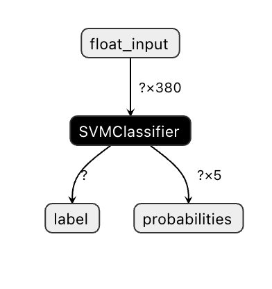

# 构建一个美食推荐 Web 应用程序

在本节课程中，您将使用您在之前课程中学习到的一些方法和本系列课程用到的美食数据集来构建一个分类模型。此外，您还会使用 Onnx Web 运行时构建一个小的 Web 应用程序去使用保存的模型。
机器学习最有用的实际运用之一就是构建推荐系统，今天您可以朝这个方向迈出第一步了！

[](https://youtu.be/17wdM9AHMfg "Applied ML")

> 🎥 点击上面的图片查看视频

## [课前测验](https://gray-sand-07a10f403.1.azurestaticapps.net/quiz/25/)

本节课程中您将会学习：

- 如何构建模型并将它保存为 Onnx 模型
- 如何使用 Netron 去检查模型
- 如何在 Web 应用程序中使用您的模型去进行推理

## 构建您的模型

建立应用机器学习系统是让这些技术赋能您的业务系统的一个重要部分。通过使用 Onnx 您可以在 Web 应用程序中使用模型（如果需要可以离线使用它们）。

[之前的课程](../../../3-Web-App/1-Web-App/translations/README.zh-cn.md)中，您构建并 “pickled” 了一个 UFO 目击事件的回归模型，并在一个 Flask 应用程序中使用。虽然了解它的架构会很有用，但这是一个全栈 Python 应用程序，您的需求可能包括使用 JavaScript 应用程序。

在本节课程中，您可以构建一个基于 JavaScript 的基础系统进行推理。不过无论如何，首先您需要训练一个模型并将其转换给 Onnx 使用。

## 练习 - 训练分类模型

首先，使用之前我们使用的清洗后的菜品数据集来训练一个分类模型。

1. 从导入库开始：

    ```python
    !pip install skl2onnx
    import pandas as pd 
    ```

    您需要 [skl2onnx](https://onnx.ai/sklearn-onnx/) 来帮助您将 Scikit-learn 模型转换为 Onnx 格式。

2. 然后使用 `read_csv()` 读取一个 CSV 文件，按照您在之前课程中用的相同方式处理您的数据：

    ```python
    data = pd.read_csv('../data/cleaned_cuisines.csv')
    data.head()
    ```

3. 删除前两列无用的列，将其余的数据保存为 X：

    ```python
    X = data.iloc[:,2:]
    X.head()
    ```

4. 保存标签为 y：

    ```python
    y = data[['cuisine']]
    y.head()
    
    ```

### 开始训练

我们将使用有着不错精度的 SVC 库。

1. 从 Scikit-learn 导入一些合适的库：

    ```python
    from sklearn.model_selection import train_test_split
    from sklearn.svm import SVC
    from sklearn.model_selection import cross_val_score
    from sklearn.metrics import accuracy_score,precision_score,confusion_matrix,classification_report
    ```

2. 拆分训练数据和测试数据：

    ```python
    X_train, X_test, y_train, y_test = train_test_split(X,y,test_size=0.3)
    ```

3. 像您在之前课程中所做的一样，构建一个 SVC 分类器模型：

    ```python
    model = SVC(kernel='linear', C=10, probability=True,random_state=0)
    model.fit(X_train,y_train.values.ravel())
    ```

4. 现在，调用 `predict()` 测试您的模型：

    ```python
    y_pred = model.predict(X_test)
    ```

5. 打印分类报告来检查模型质量：

    ```python
    print(classification_report(y_test,y_pred))
    ```

    如我们之前看见的，精度挺好：

    ```output
                    precision    recall  f1-score   support
    
         chinese       0.72      0.69      0.70       257
          indian       0.91      0.87      0.89       243
        japanese       0.79      0.77      0.78       239
          korean       0.83      0.79      0.81       236
            thai       0.72      0.84      0.78       224
    
        accuracy                           0.79      1199
       macro avg       0.79      0.79      0.79      1199
    weighted avg       0.79      0.79      0.79      1199
    ```

### 将您的模型转换到 Onnx

请确保使用正确的张量进行转换。数据集列出了 380 种原料，因此您需要在 `FloatTensorType` 中标记这个数字：

1. 设置张量数为 380 来进行转换。

    ```python
    from skl2onnx import convert_sklearn
    from skl2onnx.common.data_types import FloatTensorType
    
    initial_type = [('float_input', FloatTensorType([None, 380]))]
    options = {id(model): {'nocl': True, 'zipmap': False}}
    ```

2. 创建 onx 并保存为文件 **model.onnx**：

    ```python
    onx = convert_sklearn(model, initial_types=initial_type, options=options)
    with open("./model.onnx", "wb") as f:
        f.write(onx.SerializeToString())
    ```

    > 注意，您可以给您的转换脚本传入[选项](https://onnx.ai/sklearn-onnx/parameterized.html)。在这种情况下，我们传入设为 True 的 `nocl` 参数和设为 False 的 `zipmap` 参数。由于这是一个分类模型，您可以选择删除产生字典列表的 ZipMap（不必要）。`nocl` 指模型中包含的类别信息。通过将 `nocl` 设置为 True 来减小模型的大小。

运行完整的 notebook 工程文件现在将会构建一个 Onnx 模型并保存到此文件夹中。

## 查看您的模型

在 Visual Studio Code 中，Onnx 模型的结构不是很清晰。但有一个非常好的免费软件，很多研究员用它做模型可视化以保证模型被正确构建。下载 [Netron](https://github.com/lutzroeder/Netron) 然后打开您的 model.onnx 文件。您能看到您的简单模型被可视化了，其中列举有传入的参数 `380` 和分类器：



Netron 是查看您模型的有用工具。

现在您准备好了在 Web 应用程序中使用这个简洁的模型。我们来构建一个应用程序，当您查看冰箱时它会派上用场，并试图找出您可以使用哪种剩余食材组合来烹饪给定的菜肴，这由您的模型决定。

## 构建一个推荐器 Web 应用程序

您可以在 Web 应用程序中直接使用您的模型。这种架构允许您在本地运行，如果需要的话甚至可以离线运行。我们从在您保存 `model.onnx` 文件的相同目录下创建一个 `index.html` 文件开始。

1. 在 _index.html_ 文件中，添加以下标签：

    ```html
    <!DOCTYPE html>
    <html>
        <header>
            <title>Cuisine Matcher</title>
        </header>
        <body>
            ...
        </body>
    </html>
    ```

2. 现在在 `body` 标签内，添加一些标签来展示代表一些配料的 checkbox 列表：

    ```html
    <h1>Check your refrigerator. What can you create?</h1>
            <div id="wrapper">
                <div class="boxCont">
                    <input type="checkbox" value="4" class="checkbox">
                    <label>apple</label>
                </div>
            
                <div class="boxCont">
                    <input type="checkbox" value="247" class="checkbox">
                    <label>pear</label>
                </div>
            
                <div class="boxCont">
                    <input type="checkbox" value="77" class="checkbox">
                    <label>cherry</label>
                </div>
    
                <div class="boxCont">
                    <input type="checkbox" value="126" class="checkbox">
                    <label>fenugreek</label>
                </div>
    
                <div class="boxCont">
                    <input type="checkbox" value="302" class="checkbox">
                    <label>sake</label>
                </div>
    
                <div class="boxCont">
                    <input type="checkbox" value="327" class="checkbox">
                    <label>soy sauce</label>
                </div>
    
                <div class="boxCont">
                    <input type="checkbox" value="112" class="checkbox">
                    <label>cumin</label>
                </div>
            </div>
            <div style="padding-top:10px">
                <button onClick="startInference()">What kind of cuisine can you make?</button>
            </div> 
    ```

    注意，每个 checkbox 都给定了一个值，它反映了根据数据集可以找到对应配料的索引。例如，在这个按字母顺序排列的列表中，Apple 在第五列，由于我们从 0 开始计数，因此它的值是 4 。您可以查阅[配料表格](../../data/ingredient_indexes.csv)来查找给定配料的索引。

    继续您在 index.htlm 文件中的工作，在最后一个闭合的 `</div>` 后添加一个脚本代码块去调用模型。

3. 首先，导入 [Onnx Runtime](https://www.onnxruntime.ai/)：

    ```html
    <script src="https://cdn.jsdelivr.net/npm/onnxruntime-web@1.9.09/dist/ort.min.js"></script> 
    ```

    > Onnx Runtime 用于在多种硬件平台上运行 Onnx 模型，包括优化和使用的 API。

4. 一旦 Runtime 就位，您可以调用它：

    ```javascript
    <script>
        const ingredients = [0, 0, 0, 0, 0, 0, 0, 0, 0, 0, 0, 0, 0, 0, 0, 0, 0, 0, 0, 0, 0, 0, 0, 0, 0, 0, 0, 0, 0, 0, 0, 0, 0, 0, 0, 0, 0, 0, 0, 0, 0, 0, 0, 0, 0, 0, 0, 0, 0, 0, 0, 0, 0, 0, 0, 0, 0, 0, 0, 0, 0, 0, 0, 0, 0, 0, 0, 0, 0, 0, 0, 0, 0, 0, 0, 0, 0, 0, 0, 0, 0, 0, 0, 0, 0, 0, 0, 0, 0, 0, 0, 0, 0, 0, 0, 0, 0, 0, 0, 0, 0, 0, 0, 0, 0, 0, 0, 0, 0, 0, 0, 0, 0, 0, 0, 0, 0, 0, 0, 0, 0, 0, 0, 0, 0, 0, 0, 0, 0, 0, 0, 0, 0, 0, 0, 0, 0, 0, 0, 0, 0, 0, 0, 0, 0, 0, 0, 0, 0, 0, 0, 0, 0, 0, 0, 0, 0, 0, 0, 0, 0, 0, 0, 0, 0, 0, 0, 0, 0, 0, 0, 0, 0, 0, 0, 0, 0, 0, 0, 0, 0, 0, 0, 0, 0, 0, 0, 0, 0, 0, 0, 0, 0, 0, 0, 0, 0, 0, 0, 0, 0, 0, 0, 0, 0, 0, 0, 0, 0, 0, 0, 0, 0, 0, 0, 0, 0, 0, 0, 0, 0, 0, 0, 0, 0, 0, 0, 0, 0, 0, 0, 0, 0, 0, 0, 0, 0, 0, 0, 0, 0, 0, 0, 0, 0, 0, 0, 0, 0, 0, 0, 0, 0, 0, 0, 0, 0, 0, 0, 0, 0, 0, 0, 0, 0, 0, 0, 0, 0, 0, 0, 0, 0, 0, 0, 0, 0, 0, 0, 0, 0, 0, 0, 0, 0, 0, 0, 0, 0, 0, 0, 0, 0, 0, 0, 0, 0, 0, 0, 0, 0, 0, 0, 0, 0, 0, 0, 0, 0, 0, 0, 0, 0, 0, 0, 0, 0, 0, 0, 0, 0, 0, 0, 0, 0, 0, 0, 0, 0, 0, 0, 0, 0, 0, 0, 0, 0, 0, 0, 0, 0, 0, 0, 0, 0, 0, 0, 0, 0, 0, 0, 0, 0, 0, 0, 0, 0, 0, 0, 0, 0, 0, 0, 0, 0, 0, 0, 0, 0, 0, 0, 0, 0, 0, 0, 0, 0, 0, 0, 0]
        
        const checks = [].slice.call(document.querySelectorAll('.checkbox'));

        // 使用 async context 去调用 onnxruntime 方法
        function init() {
            
            checks.forEach(function (checkbox, index) {
                checkbox.onchange = function () {
                    if (this.checked) {
                        var index = checkbox.value;

                        if (index !== -1) {
                            ingredients[index] = 1;
                        }
                        console.log(ingredients)
                    }
                    else {
                        var index = checkbox.value;

                        if (index !== -1) {
                            ingredients[index] = 0;
                        }
                        console.log(ingredients)
                    }
                }
            })
        }

        function testCheckboxes() {
                for (var i = 0; i < checks.length; i++)
                    if (checks[i].type == "checkbox")
                        if (checks[i].checked)
                            return true;
                return false;
        }

        async function startInference() {

            let checked = testCheckboxes()

            if (checked) {
                try {
                    // 创建一个新的 session 并加载模型。           
                    const session = await ort.InferenceSession.create('./model.onnx');

                    const input = new ort.Tensor(new Float32Array(ingredients), [1, 380]);
                    const feeds = { float_input: input };

                    // 传入 feeds 并运行。

                    const results = await session.run(feeds);

                    // 读取结果。
                    alert('You can enjoy ' + results.label.data[0] + ' cuisine today!')

                } catch (e) {
                    console.log(`failed to inference ONNX model: ${e}.`);
                }
            }
            else alert("Please check an ingredient")
        }
        init();
               
    </script>
    ```

在这段代码中，发生了这些事情：

1. 您创建了一个由 380 个可能值（ 1 或 0 ）组成的数组，这些值被发送给模型进行推理，具体取决于是否选中了配料的 checkbox。
2. 您创建了一个 checkbox 数组并在应用程序启动时调用的 `init` 方法中确定它们是否被选中。选中 checkbox 后，`ingredients` 数组会发生变化来反映所选的配料。
3. 您创建了一个 `testCheckboxes` 方法检查是否有 checkbox 被选中。
4. 当按钮被点击将会使用 `startInference` 方法，如果有任一 checkbox 被选中，该方法会开始推理。
5. 推理过程包括：
   1. 设置异步加载模型
   2. 创建了一个要传入模型的张量结构
   3. 创建 `feeds`，它反映了您在训练模型时创建的 `float_input` 输入（您可以使用 Netron 来验证具体名称）
   4. 发送 `feeds` 到模型并等待返回结果

## 测试您的应用程序

在 Visual Studio Code 中，从您的 index.html 文件所在的文件夹打开一个终端。请确保您已经全局安装了 [http-server](https://www.npmjs.com/package/http-server)，按提示输入 `http-server`，一个 localhost 页面将会打开，您可以浏览您的 Web 应用程序。检查一下给出不同的配料会有什么菜品会被推荐：


祝贺您已经创建了一个包含几个字段的 “推荐” Web 应用程序。花点时间来构建这个系统吧！

## 🚀挑战

您的 Web 应用程序还很小巧，所以继续使用[配料索引](../../data/ingredient_indexes.csv)中的配料数据和索引数据来构建它吧。用什么样的口味组合才能创造出一道特定的民族菜肴？

## [课后测验](https://gray-sand-07a10f403.1.azurestaticapps.net/quiz/26/)

## 回顾与自学

虽然本课程只讨论了创建一个菜品配料推荐系统的效果，但机器学习的应用程序领域有非常丰富的示例。阅读了解这些系统是如何构建的：

- https://www.sciencedirect.com/topics/computer-science/recommendation-engine
- https://www.technologyreview.com/2014/08/25/171547/the-ultimate-challenge-for-recommendation-engines/
- https://www.technologyreview.com/2015/03/23/168831/everything-is-a-recommendation/

## 作业

[构建一个推荐器](../translations/assignment.zh-CN.md)
