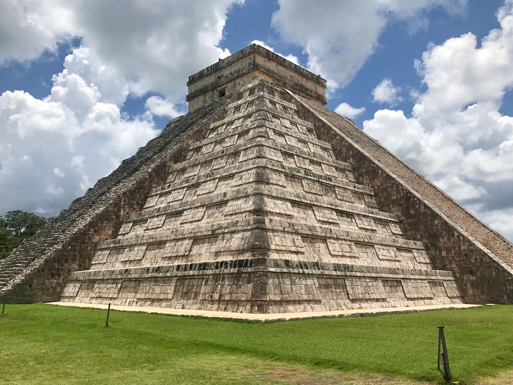

# Clustering Models for Machine Learning
## Regional topic: Clustering models for Maya architecture in Central America

In Central America, the amazing [ancient Maya civilization](https://en.wikipedia.org/wiki/Maya_civilization) is well-known for its architectural sites, often comprising impressive pyramids.  

> Photo by <a href="https://unsplash.com/@amongthestones?utm_source=unsplash&utm_medium=referral&utm_content=creditCopyText">Jimmy Baum</a> on <a href="https://unsplash.com/s/photos/maya-archaeology?utm_source=unsplash&utm_medium=referral&utm_content=creditCopyText">Unsplash</a>

In this series of lessons, you will discover a new way to analyze data using Clustering techniques. Clustering is particularly useful when your dataset lacks labels. If it does have labels, then classification techniques are more useful. But in cases where you are looking to group unlabelled data, clustering is a great way to discover patterns.
## Topics

1. [Introduction to Clustering with Data Visualizations](1-Visualize/README.md)
2. [K-Means Clustering](2-K-Means/README.md)
3. [Centroid Clustering](3-Centroid/README.md)
4. [Build an API for Recommendations](4-API/README.md)
## Credits

"Introduction to Clustering" was written with ♥️ by [Jen Looper](https://www.twitter.com/jenlooper)