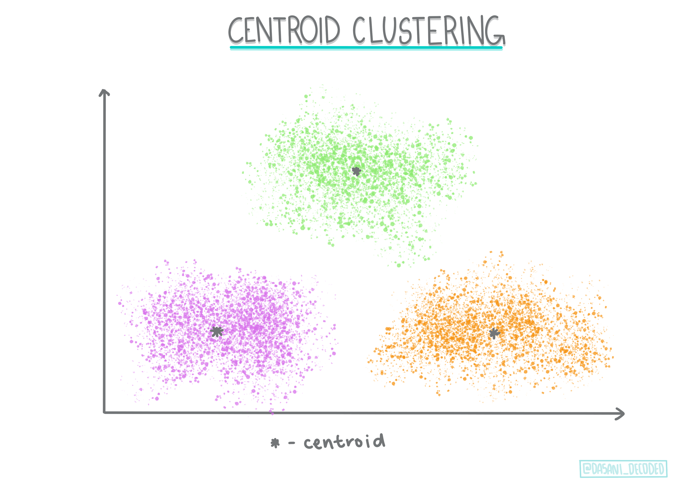
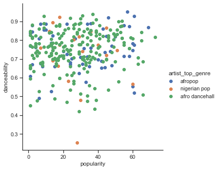

# Clustering 소개하기

Clustering이 데이터셋에 라벨을 붙이지 않거나 입력이 미리 정의한 출력과 맞지 않는다고 가정한다면 [Unsupervised Learning](https://wikipedia.org/wiki/Unsupervised_learning) 타입입니다. 다양한 알고리즘으로 라벨링되지 않은 데이터를 정렬하고 데이터에서 식별할 패턴에 따라 묶을 수 있게 제공됩니다.

[](https://youtu.be/ty2advRiWJM "No One Like You by PSquare")

> 🎥 영상을 보려면 이미지 클릭. While you're studying machine learning with clustering, enjoy some Nigerian Dance Hall tracks - this is a highly rated song from 2014 by PSquare.

## [강의 전 퀴즈](https://gray-sand-07a10f403.1.azurestaticapps.net/quiz/27/)

### 소개

[Clustering](https://link.springer.com/referenceworkentry/10.1007%2F978-0-387-30164-8_124)은 데이터를 탐색할 때 매우 유용합니다. 나이지리아 사람들이 음악을 듣는 방식에서 트렌드와 패턴을 찾아 도움을 받을 수 있는지 봅니다.

✅ 시간을 내서 clustering 사용법에 대해 생각해봅니다. 실생활에서, clustering은 빨래 바구니를 가지고 가족 구성원의 옷 🧦👕👖🩲을 정리하는 순간에 발생합니다. 데이터 사이언스에서, clustering은 사용자의 선호를 분석하거나, 라벨을 붙이지 않은 데이터셋 특성을 정하는 순간에 발생합니다. Clustering은, 어떤 식으로든, 양말 서랍처럼, 혼란스러움을 이해하는 순간에 도움을 받을 수 있습니다.

[](https://youtu.be/esmzYhuFnds "Introduction to Clustering")

> 🎥 영상을 보려면 이미지 클릭: MIT's John Guttag introduces clustering

전문적인 설정에서, clustering은 시장 세분화처럼 결정하면서 사용할 수 있습니다, 예시로, 특정 나이대가 어떤 아이템을 구매하는지 결정할 수 있습니다. 또 다른 용도는 anomaly detection이며, 아마도 신용 카드 거래 데이터셋에서 사기를 적발하기 위함입니다. 또는 clustering으로 의학촬영의 배치에서 종양을 판단할 수 있습니다.

✅ 시간을 내서, 은행, 이커머스, 비지니스 설정에서, 'in the wild' 어떻게 clustering을 접했는지 생각합니다.

> 🎓 흥미로운 사실은, cluster analysis는 1930년에 인류학과 심리학의 필드에서 유래되었습니다. 어떻게 사용했는지 상상 되나요?

또한, 그룹화된 검색 결과를 위해서 사용합니다. - 예를 들면, 쇼핑 링크, 이미지, 또는 리뷰. Clustering은 줄이려는 대규모 데이터셋이 있고 세분화된 분석을 하고 싶을 때 유용하므로, 다른 모델이 설계되기 전까지 데이터를 학습하며 이 기술을 사용할 수 있습니다.

✅ 데이터가 클러스터에서 구성되면, 클러스터 ID를 할당하며, 이 기술로 데이터셋의 프라이버시를 보호할 때 유용합니다; 식별할 수 있는 데이터를 더 노출하는 대신, 클러스터 ID로 데이터 포인트를 참조할 수 있습니다. 클러스터의 다른 요소가 아닌 클러스터 ID를 참조해서 식별하는 이유를 생각할 수 있나요?

이 [Learn module](https://docs.microsoft.com/learn/modules/train-evaluate-cluster-models?WT.mc_id=academic-77952-leestott)에서 clustering 기술을 깊게 이해합니다.

## Clustering 시작하기

[Scikit-learn](https://scikit-learn.org/stable/modules/clustering.html)은 clustering을 수행하는 방식의 큰 배열을 제공합니다. 선택한 타입은 사용 케이스에 따라서 달라질 예정입니다. 문서에 따르면, 각 방식에 다양한 이점이 있습니다. Scikit-learn에서 지원하는 방식과 적절한 사용 케이스에 대한 단순화된 테이블입니다:

| Method name                  | Use case                                                               |
| :--------------------------- | :--------------------------------------------------------------------- |
| K-Means                      | general purpose, inductive                                             |
| Affinity propagation         | many, uneven clusters, inductive                                       |
| Mean-shift                   | many, uneven clusters, inductive                                       |
| Spectral clustering          | few, even clusters, transductive                                       |
| Ward hierarchical clustering | many, constrained clusters, transductive                               |
| Agglomerative clustering     | many, constrained, non Euclidean distances, transductive               |
| DBSCAN                       | non-flat geometry, uneven clusters, transductive                       |
| OPTICS                       | non-flat geometry, uneven clusters with variable density, transductive |
| Gaussian mixtures            | flat geometry, inductive                                               |
| BIRCH                        | large dataset with outliers, inductive                                 |

> 🎓 클러스터를 만드는 방식에서 데이터 포인트를 그룹으로 수집하는 것과 많이 비슷합니다. 몇 단어를 풀어봅니다:
>
> 🎓 ['Transductive' vs. 'inductive'](https://wikipedia.org/wiki/Transduction_(machine_learning))
> 
> Transductive 추론은 특정한 테스트 케이스로 맵핑되어 관찰된 훈련 케이스에서 유래됩니다. Inductive 추론은 오직 테스트 케이스에서만 적용되는 일반적인 규칙으로 맵핑된 훈련 케이스에서 유래됩니다.
> 
> 예시: 오직 일부만 라벨링된 데이터를 가지고 있다고 생각합니다. 일부 'records', 'cds', 공백으로 이루어져 있습니다. 공백에 라벨을 제공하는 일입니다. 만약 inductive 접근법을 선택했다면, 'records'와 'cds'를 찾는 모델로 훈련하고, 라벨링되지 않은 데이터에 라벨을 적용합니다. 이 접근법은 실제 'cassettes'를 분류할 때 골치아픕니다. transductive 접근법은, 반면에, 비슷한 아이템과 함께 그룹으로 묶어서 라벨을 적용하므로 알려지지 않은 데이터보다 효과적으로 핸들링합니다. 이 케이스에서, 클러스터는 'round musical things'와 'square musical things'를 반영할 수 있습니다.
> 
> 🎓 ['Non-flat' vs. 'flat' geometry](https://datascience.stackexchange.com/questions/52260/terminology-flat-geometry-in-the-context-of-clustering)
> 
> 수학 용어에서 유래된, non-flat vs. flat 기하학은 'flat' ([Euclidean](https://wikipedia.org/wiki/Euclidean_geometry)) 또는 'non-flat' (non-Euclidean) 기하학 방식으로 포인트 사이 거리를 특정하는 것을 의미합니다.
>
> 이 컨텍스트에서 'Flat'은 Euclidean 기하학 (일부는 'plane' 기하학으로 가르침)을, non-flat은 non-Euclidean을 나타냅니다. 기하학은 머신러닝과 어떤 연관성이 있나요? 음, 수학과 기반이 같은 두 필드라서, 클러스터에서 포인트 사이의 거리를 측정할 수 있는 공통 방식이 있으며, 데이터의 특성에 기반해서, 'flat' 또는 'non-flat'으로 마무리지을 수 있습니다. [Euclidean distances](https://wikipedia.org/wiki/Euclidean_distance)는 두 포인트 사이 선분의 길이로 측정합니다. [Non-Euclidean distances](https://wikipedia.org/wiki/Non-Euclidean_geometry)는 곡선에 따라서 측정됩니다. 만약 데이터가, 시각화되어서, 평면에 존재하지 않은 것으로 보인다면, 특별 알고리즘을 사용해서 핸들링할 수 있습니다.
>

> Infographic by [Dasani Madipalli](https://twitter.com/dasani_decoded)
> 
> 🎓 ['Distances'](https://web.stanford.edu/class/cs345a/slides/12-clustering.pdf)
> 
> 클러스터는 distance matrix로 정의됩니다, 예시로. 포인트 사이 거리입니다. 거리는 몇 방식으로 측정될 수 있습니다. Euclidean 클러스터는 포인트 값의 평균으로 정의되고, 'centroid' 또는 중심 포인트를 포함합니다. 거리는 이 중심까지 거리로 측정됩니다. Non-Euclidean 거리는 다른 포인트에서 가까운 포인트, 'clustroids'로 나타냅니다. Clustroid는 다음과 같이 다양한 방식으로 정의할 수 있습니다. 
> 
> 🎓 ['Constrained'](https://wikipedia.org/wiki/Constrained_clustering)
> 
> [Constrained Clustering](https://web.cs.ucdavis.edu/~davidson/Publications/ICDMTutorial.pdf)은 unsupervised 방식에서 'semi-supervised' 학습을 접목합니다. 포인트 사이 관계는 'cannot link' 또는 'must-link'로 플래그되어 데이터 셋에 일부 룰을 강제합니다.

>
> 예시: 만약 알고리즘이 라벨링하지 못했거나 세미-라벨링된 데이터의 배치에서 풀리면, 만들어지는 클러스터의 품질이 내려갈 수 있습니다. 위 예시에서, 클러스터는 'round music things'와 'square music things'와 'triangular things'와 'cookies'를 그룹으로 묶을 수 있습니다. 만약 제한사항이나, 따라야할 룰이 주어진다면 ("the item must be made of plastic", "the item needs to be able to produce music") 알고리즘이 더 좋은 선택을 하도록 '제한'해서 도와줄 수 있습니다.
> 
> 🎓 'Density'
> 
> 'noisy' 데이터는 'dense'로 칩니다. 각 클러스터의 포인트 사이 거리에서 조금 밀집해있거나, 'crowded'한 것으로 증명할 수 있으므로, 데이터는 적당한 clustering 방식으로 분석되어질 필요가 있습니다. [This article](https://www.kdnuggets.com/2020/02/understanding-density-based-clustering.html)에서 K-Means clustering vs. HDBSCAN 알고리즘을 사용해서 고르지않는 클러스터 밀집도로 노이즈 데이터셋을 찾아보고 서로 다른 차이점을 시연합니다.

## Clustering 알고리즘

100개 이상 clustering 알고리즘이 있고, 현재 데이터의 특성에 기반해서 사용하는 게 다릅니다. 몇 주요 사항에 대해 이야기해봅니다:

- **Hierarchical clustering**. 만약 오브젝트가 멀리 떨어져있지 않고, 가까운 오브젝트와 근접성으로 분류된다면, 클러스터는 다른 오브젝트의 거리에 따라서 형태가 만들어집니다. Scikit-learn의 agglomerative clustering은 계층적입니다.

   
   > Infographic by [Dasani Madipalli](https://twitter.com/dasani_decoded)

- **Centroid clustering**. 이 인기있는 알고리즘은 'k', 또는 형성할 클러스터의 수를 선택해야 될 필요가 있으며, 이후 알고리즘은 클러스터의 중심 포인트를 결정하고 포인트 주변 데이터를 수집합니다. [K-means clustering](https://wikipedia.org/wiki/K-means_clustering)은 인기있는 centroid clustering 버전입니다. 중심이 가까운 평균에 따라서 이름이 정해집니다. 클러스터에서 제곱 거리가 최소화됩니다.

   
   > Infographic by [Dasani Madipalli](https://twitter.com/dasani_decoded)

- **Distribution-based clustering**. 통계 모델링에서, distribution-based clustering은 데이터 포인트가 클러스터에 있는 확률을 기반으로, 할당에 중점을 둡니다. Gaussian mixture 방식이 이 타입에 속합니다.

- **Density-based clustering**. 데이터 포인트는 밀집도나 서로 그룹으로 묶어진 기반으로 클러스터에 할당합니다. 그룹에서 멀리 떨어진 데이터 포인트를 아웃라이어나 노이즈로 간주합니다. DBSCAN, Mean-shift와 OPTICS는 이 clustering 타입에 해당됩니다.

- **Grid-based clustering**. multi-dimensional 데이터셋이면, 그리드가 만들어지고 데이터가 그리드의 셀에 나눈 뒤에, 클러스터를 만듭니다.

## 연습 - 데이터 cluster

기술에서 Clustering은 적절한 시각화로 크게 도움받으므로, 음악 데이터로 시각화해서 시작해봅니다. 이 연습은 데이터의 특성에 가장 효과적으로 사용할 clustering 방식을 정할 때 도움받을 수 있습니다.

1. 이 폴더에서 _notebook.ipynb_ 파일을 엽니다.

1. 좋은 데이터 시각화를 위해서 `Seaborn` 패키지를 가져옵니다.

    ```python
    !pip install seaborn
    ```

1. _nigerian-songs.csv_ 의 노래 데이터를 추가합니다. 일부 노래 데이터가 있는 데이터 프레임을 불러옵니다. 라이브러리를 가져오고 데이터를 덤프해서 찾아봅니다:

    ```python
    import matplotlib.pyplot as plt
    import pandas as pd
    
    df = pd.read_csv("../data/nigerian-songs.csv")
    df.head()
    ```

    데이터의 첫 몇 줄을 확인합니다:

    |     | name                     | album                        | artist              | artist_top_genre | release_date | length | popularity | danceability | acousticness | energy | instrumentalness | liveness | loudness | speechiness | tempo   | time_signature |
    | --- | ------------------------ | ---------------------------- | ------------------- | ---------------- | ------------ | ------ | ---------- | ------------ | ------------ | ------ | ---------------- | -------- | -------- | ----------- | ------- | -------------- |
    | 0   | Sparky                   | Mandy & The Jungle           | Cruel Santino       | alternative r&b  | 2019         | 144000 | 48         | 0.666        | 0.851        | 0.42   | 0.534            | 0.11     | -6.699   | 0.0829      | 133.015 | 5              |
    | 1   | shuga rush               | EVERYTHING YOU HEARD IS TRUE | Odunsi (The Engine) | afropop          | 2020         | 89488  | 30         | 0.71         | 0.0822       | 0.683  | 0.000169         | 0.101    | -5.64    | 0.36        | 129.993 | 3              |
    | 2   | LITT!                    | LITT!                        | AYLØ                | indie r&b        | 2018         | 207758 | 40         | 0.836        | 0.272        | 0.564  | 0.000537         | 0.11     | -7.127   | 0.0424      | 130.005 | 4              |
    | 3   | Confident / Feeling Cool | Enjoy Your Life              | Lady Donli          | nigerian pop     | 2019         | 175135 | 14         | 0.894        | 0.798        | 0.611  | 0.000187         | 0.0964   | -4.961   | 0.113       | 111.087 | 4              |
    | 4   | wanted you               | rare.                        | Odunsi (The Engine) | afropop          | 2018         | 152049 | 25         | 0.702        | 0.116        | 0.833  | 0.91             | 0.348    | -6.044   | 0.0447      | 105.115 | 4              |

1. `info()`를 불러서, 데이터 프레임에 대한 약간의 정보를 얻습니다:

    ```python
    df.info()
    ```

   출력은 이렇게 보입니다:

    ```output
    <class 'pandas.core.frame.DataFrame'>
    RangeIndex: 530 entries, 0 to 529
    Data columns (total 16 columns):
     #   Column            Non-Null Count  Dtype  
    ---  ------            --------------  -----  
     0   name              530 non-null    object 
     1   album             530 non-null    object 
     2   artist            530 non-null    object 
     3   artist_top_genre  530 non-null    object 
     4   release_date      530 non-null    int64  
     5   length            530 non-null    int64  
     6   popularity        530 non-null    int64  
     7   danceability      530 non-null    float64
     8   acousticness      530 non-null    float64
     9   energy            530 non-null    float64
     10  instrumentalness  530 non-null    float64
     11  liveness          530 non-null    float64
     12  loudness          530 non-null    float64
     13  speechiness       530 non-null    float64
     14  tempo             530 non-null    float64
     15  time_signature    530 non-null    int64  
    dtypes: float64(8), int64(4), object(4)
    memory usage: 66.4+ KB
    ```

1. `isnull()`을 부르고 합산이 0인지 확인해서, Null 값을 다시 검토합니다:

    ```python
    df.isnull().sum()
    ```

    좋게 보입니다:

    ```output
    name                0
    album               0
    artist              0
    artist_top_genre    0
    release_date        0
    length              0
    popularity          0
    danceability        0
    acousticness        0
    energy              0
    instrumentalness    0
    liveness            0
    loudness            0
    speechiness         0
    tempo               0
    time_signature      0
    dtype: int64
    ```

1. 데이터를 서술합니다:

    ```python
    df.describe()
    ```

    |       | release_date | length      | popularity | danceability | acousticness | energy   | instrumentalness | liveness | loudness  | speechiness | tempo      | time_signature |
    | ----- | ------------ | ----------- | ---------- | ------------ | ------------ | -------- | ---------------- | -------- | --------- | ----------- | ---------- | -------------- |
    | count | 530          | 530         | 530        | 530          | 530          | 530      | 530              | 530      | 530       | 530         | 530        | 530            |
    | mean  | 2015.390566  | 222298.1698 | 17.507547  | 0.741619     | 0.265412     | 0.760623 | 0.016305         | 0.147308 | -4.953011 | 0.130748    | 116.487864 | 3.986792       |
    | std   | 3.131688     | 39696.82226 | 18.992212  | 0.117522     | 0.208342     | 0.148533 | 0.090321         | 0.123588 | 2.464186  | 0.092939    | 23.518601  | 0.333701       |
    | min   | 1998         | 89488       | 0          | 0.255        | 0.000665     | 0.111    | 0                | 0.0283   | -19.362   | 0.0278      | 61.695     | 3              |
    | 25%   | 2014         | 199305      | 0          | 0.681        | 0.089525     | 0.669    | 0                | 0.07565  | -6.29875  | 0.0591      | 102.96125  | 4              |
    | 50%   | 2016         | 218509      | 13         | 0.761        | 0.2205       | 0.7845   | 0.000004         | 0.1035   | -4.5585   | 0.09795     | 112.7145   | 4              |
    | 75%   | 2017         | 242098.5    | 31         | 0.8295       | 0.403        | 0.87575  | 0.000234         | 0.164    | -3.331    | 0.177       | 125.03925  | 4              |
    | max   | 2020         | 511738      | 73         | 0.966        | 0.954        | 0.995    | 0.91             | 0.811    | 0.582     | 0.514       | 206.007    | 5              |

> 🤔 만약 라벨링 안 한 데이터가 필요하지 않은 unsupervised 방식으로, clustering을 작업하게되면, 왜 데이터로 라벨을 보여주나요? 데이터 탐색 단계에서 편리하겠지만, clustering 알고리즘이 동작할 때는 필요 없습니다. 열 헤더를 제거하고 열 넘버로 데이터를 참조할 수 있습니다.

데이터의 일반적 값을 봅니다. 랭킹에 못 들은 음악을 보여주는 건, '0'일 수 있습니다. 바로 제거하겠습니다.

1. 가장 인기있는 장르를 찾기 위해서 barplot을 사용합니다:

    ```python
    import seaborn as sns
    
    top = df['artist_top_genre'].value_counts()
    plt.figure(figsize=(10,7))
    sns.barplot(x=top[:5].index,y=top[:5].values)
    plt.xticks(rotation=45)
    plt.title('Top genres',color = 'blue')
    ```

    

✅ 만약 상위 값을 많이 보려면,  top `[:5]`을 더 큰 값으로 변경하거나, 제거해서 다 봅니다.

노트, 상위 장르가 'Missing'으로 서술되어 있으면, Spotify에서 분류하지 않았으므로, 제거합니다.

1. 필터링해서 missing 데이터를 제거합니다

    ```python
    df = df[df['artist_top_genre'] != 'Missing']
    top = df['artist_top_genre'].value_counts()
    plt.figure(figsize=(10,7))
    sns.barplot(x=top.index,y=top.values)
    plt.xticks(rotation=45)
    plt.title('Top genres',color = 'blue')
    ```

    이제 장르를 다시 확인합니다:

    

1. 지금까지, 상위 3개 장르가 데이터셋을 장악했습니다. `afro dancehall`, `afropop`, 그리고 `nigerian pop`에 집중하고 인기도 값이 0인 모든 것을 지우기 위해서 추가로 필터링합니다 (데이터셋에서 인기도로 분류하지 않은 것은 이 목적에서 노이즈로 간주될 수 있다는 점을 의미합니다):

    ```python
    df = df[(df['artist_top_genre'] == 'afro dancehall') | (df['artist_top_genre'] == 'afropop') | (df['artist_top_genre'] == 'nigerian pop')]
    df = df[(df['popularity'] > 0)]
    top = df['artist_top_genre'].value_counts()
    plt.figure(figsize=(10,7))
    sns.barplot(x=top.index,y=top.values)
    plt.xticks(rotation=45)
    plt.title('Top genres',color = 'blue')
    ```

1. 특별히 강력한 방식으로 데이터에 상관 관계가 있는지 보기 위해서 빠르게 테스트합니다:

    ```python
    corrmat = df.corr()
    f, ax = plt.subplots(figsize=(12, 9))
    sns.heatmap(corrmat, vmax=.8, square=True)
    ```

    

    유일하게 강한 상관 관계는 `energy`와 `loudness` 사이에 있으며, 일반적으로 화려한 음악이 에너지 넘치는다는 사실은 놀랍지 않습니다. 아니라면, 상관 관계는 상대적으로 약합니다. clustering 알고리즘이 데이터를 만드는 과정을 보는 것은 흥미로울 예정입니다.

    > 🎓 상관 관계가 인과 관계를 의미하지 않는다는 것을 참고합니다! 상관 관계의 증거는 있지만 인과 관계의 증거가 없습니다. [amusing web site](https://tylervigen.com/spurious-correlations)에 이 점을 강조할 몇 자료가 있습니다.

데이터셋에 노래의 perceived popularity와 danceability가 수렴되나요? FacetGrid는 장르와 관계없이, 일렬로 늘어선 동심원을 보여줍니다. 나이지리아 사람들의 취향이 이 장르에서 특정 danceability 레벨에 수렴할 수 있지 않을까요?

✅ 다른 데이터 포인트 (energy, loudness, speechiness)와 더 많거나 다른 뮤지컬 장르로 시도합니다. 무엇을 찾을 수 있나요? 일반적으로 데이터 포인트가 확산하는 것을 보려면 `df.describe()` 테이블을 찾아봅니다.

### 연습 - 데이터 분산

이 3개 장르는 인기도에 기반해서, danceability의 인지도와 상당히 다르나요?

1. 주어진 x와 y 축에 따라서 인기도와 danceability에 대한 상위 3개 장르 데이터 분포를 찾아봅니다.

    ```python
    sns.set_theme(style="ticks")
    
    g = sns.jointplot(
        data=df,
        x="popularity", y="danceability", hue="artist_top_genre",
        kind="kde",
    )
    ```

    일반적인 수렴 점을 중심으로 동심원을 발견해서, 점의 분포를 확인할 수 있습니다.

    > 🎓 이 예시에서 continuous probability density curve로 데이터를 나타내는 KDE (Kernel Density Estimate) 그래프를 사용합니다. 여러 분포로 작업할 때 데이터를 해석할 수 있습니다.

    보통은, 3가지 장르가 인기도와 danceability로 루즈하게 정렬됩니다. 루즈하게-정렬된 데이터에서 클러스터를 결정하는 것은 힘듭니다:

    

1. scatter plot을 만듭니다:


    ```python
    sns.FacetGrid(df, hue="artist_top_genre", size=5) \
       .map(plt.scatter, "popularity", "danceability") \
       .add_legend()
    ```

    동일 축의 scatterplot은 비슷한 수렴 패턴을 보입니다

    

보통, clustering은, scatterplots으로 데이터 클러스터를 표시할 수 있으므로, 이 시각화 타입을 숙지하는 것은 매우 유용합니다. 다음 강의에서, 필터링된 데이터를 가져와서 k-means clustering으로 흥미로운 방식이 겹쳐보일 이 데이터의 그룹을 찾아보겠습니다.

---

## 🚀 도전

다음 강의를 준비하기 위해서, 프로덕션 환경에서 찾아서 사용할 수 있는 다양한 clustering 알고리즘을 차트로 만듭니다. clustering은 어떤 문제를 해결하려고 시도하나요?

## [강의 후 퀴즈](https://gray-sand-07a10f403.1.azurestaticapps.net/quiz/28/)

## 검토 & 자기주도 학습

clustering 알고리즘을 적용하기 전에, 배운대로, 데이터셋의 특성을 이해하는 게 좋습니다. 이 토픽 [here](https://www.kdnuggets.com/2019/10/right-clustering-algorithm.html)을 더 읽어봅니다.

[This helpful article](https://www.freecodecamp.org/news/8-clustering-algorithms-in-machine-learning-that-all-data-scientists-should-know/)에서 다양한 데이터 형태가 주어지면, 다양한 clustering 알고리즘이 동작하는 다른 방식을 알려줍니다.

## 과제

[Research other visualizations for clustering](../assignment.md)
