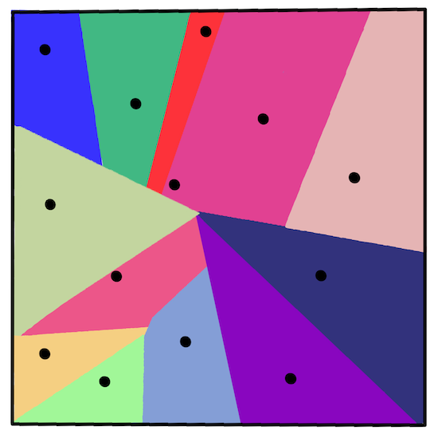
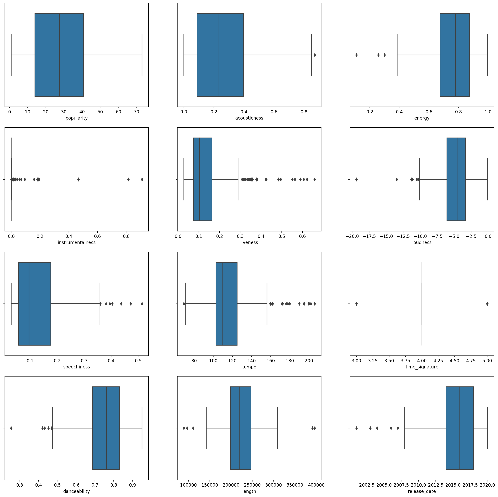
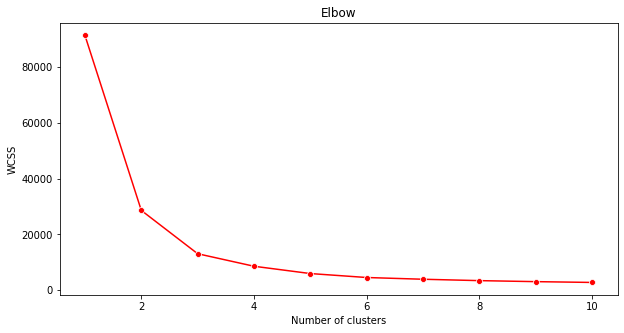
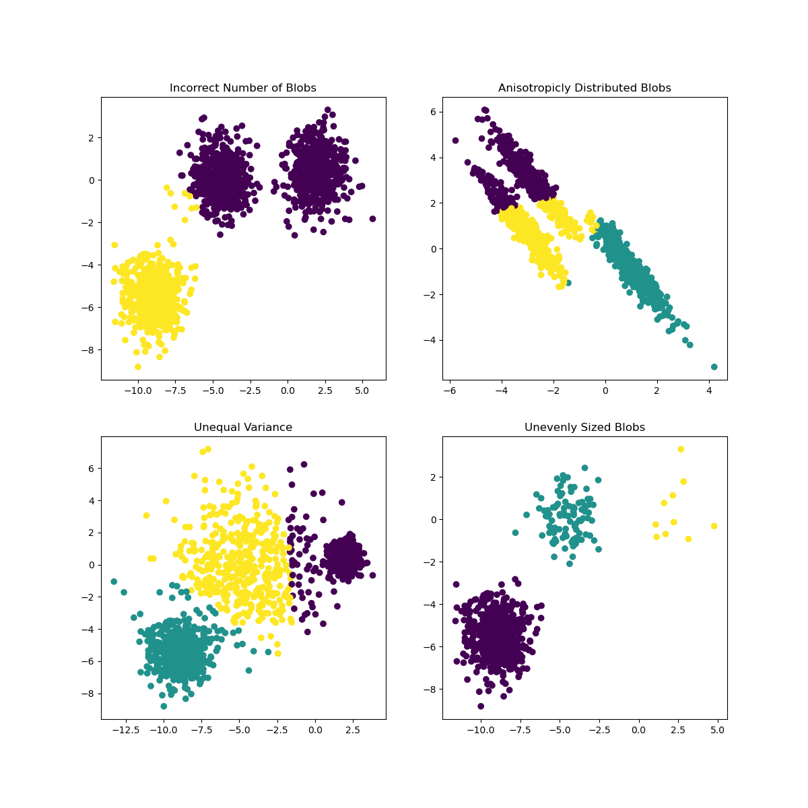

# Agrupamiento K-Medias

[](https://youtu.be/hDmNF9JG3lo "Andrew Ng explica el agrupamiento")

> 🎥 Haz clic en la imagen de arriba para ver el video: Andrew Ng explica el agrupamiento"

## [Examen previo a la lección](https://gray-sand-07a10f403.1.azurestaticapps.net/quiz/29?loc=es)

En esta lección, aprenderás cómo crear grupos usando Scikit-learn y el conjunto de datos de música Nigeriana que importaste anteriormente. Cubriremos los conceptos básicos de K-Medias para agrupamiento. Ten en mente que, como aprendiste en lecciones anteriores, hay muchas formas de de trabajar con grupos y el método que uses depende de tus datos. Probaremos K-medias ya que es la técnica de agrupamiento más común. ¡Comencemos!

Términos que sobre los que aprenderás:

- Puntaje de silueta
- Método del codo
- Inercia
- Varianza

## Introducción

[El agrupamiento K-medias](https://wikipedia.org/wiki/K-means_clustering) es un método derivado del dominio del procesamiento de señales. Se usa para dividir y particionar grupos de datos en 'k' grupos usando una serie de observaciones. Cada observación funciona para agrupar un punto de datos más cercano a su 'media' más cercana, o el punto central de un grupo.

Los grupos pueden ser visualizados como [diagramas Voronoi](https://wikipedia.org/wiki/Voronoi_diagram), los cuales incluye un punto (o 'semilla') y su región correspondiente.



> Infografía de [Jen Looper](https://twitter.com/jenlooper)

El proceso de agrupamiento K-medias [se ejecuta en un proceso de tres pasos](https://scikit-learn.org/stable/modules/clustering.html#k-means):

1. El algoritmo selecciona el k-número de puntos centrales al hacer muestreo del conjunto de datos. Después de esto, se repite:
    1. Se asigna cada muestra al centroide más cercano.
    2. Se crean nuevos centroides al tomar el valor medio de todas las muestras asignadas a los centroides previos.
    3. Luego, se calcula la diferencia entre los centroides nuevos y viejos y se repite hasta que los centroides se estabilizan.

Un inconveniente de usar K-medias incluye el hecho que necesitarás establecer 'k', que es el número de centroides. Afortunadamente el 'método del codo' ayuda a estimar un buen valor inicial para 'k'. Lo probarás en un minuto.

## Prerrequisitos

Trabajarás en el archivo _notebook.ipynb_ de esta lección, que incluye la importación de datos y limpieza preliminar que hiciste en la última lección.

## Ejercicio - preparación

Comienza por darle otro vistazo a los datos de canciones.

1. Crea un gráfico de caja, llamando a `boxplot()` para cada columna:

    ```python
    plt.figure(figsize=(20,20), dpi=200)
    
    plt.subplot(4,3,1)
    sns.boxplot(x = 'popularity', data = df)
    
    plt.subplot(4,3,2)
    sns.boxplot(x = 'acousticness', data = df)
    
    plt.subplot(4,3,3)
    sns.boxplot(x = 'energy', data = df)
    
    plt.subplot(4,3,4)
    sns.boxplot(x = 'instrumentalness', data = df)
    
    plt.subplot(4,3,5)
    sns.boxplot(x = 'liveness', data = df)
    
    plt.subplot(4,3,6)
    sns.boxplot(x = 'loudness', data = df)
    
    plt.subplot(4,3,7)
    sns.boxplot(x = 'speechiness', data = df)
    
    plt.subplot(4,3,8)
    sns.boxplot(x = 'tempo', data = df)
    
    plt.subplot(4,3,9)
    sns.boxplot(x = 'time_signature', data = df)
    
    plt.subplot(4,3,10)
    sns.boxplot(x = 'danceability', data = df)
    
    plt.subplot(4,3,11)
    sns.boxplot(x = 'length', data = df)
    
    plt.subplot(4,3,12)
    sns.boxplot(x = 'release_date', data = df)
    ```

    Estos datos son un poco ruidosos: al observar cada columna como un gráfico de caja, puedes ver los valores atípicos.

    

Podrías revisar el conjunto de datos y remover estos valores atípicos, pero eso haría que quedara un mínimo de datos.

1. Por ahora, elege qué columnas usarás para tu ejercicio de agrupamiento. Elige unas con rangos similares y codifica la columna `artist_top_genre` como datos numéricos:

    ```python
    from sklearn.preprocessing import LabelEncoder
    le = LabelEncoder()
    
    X = df.loc[:, ('artist_top_genre','popularity','danceability','acousticness','loudness','energy')]
    
    y = df['artist_top_genre']
    
    X['artist_top_genre'] = le.fit_transform(X['artist_top_genre'])
    
    y = le.transform(y)
    ```

1. Ahora necesitas elegir a cuántos grupos apuntar. Sabes que hay 3 géneros de canciones que extrajimos de el conjunto de datos, así que probemos con 3:

    ```python
    from sklearn.cluster import KMeans
    
    nclusters = 3 
    seed = 0
    
    km = KMeans(n_clusters=nclusters, random_state=seed)
    km.fit(X)
    
    # Predict the cluster for each data point
    
    y_cluster_kmeans = km.predict(X)
    y_cluster_kmeans
    ```

Ves un arreglo impreso con los grupos predichos (0, 1, 0 2) para cada fila del dataframe.

1. Usa este arreglo para calcular una 'puntaje de silueta':

    ```python
    from sklearn import metrics
    score = metrics.silhouette_score(X, y_cluster_kmeans)
    score
    ```

## Puntaje de silueta

Busca un puntaje de silueta más cercano a 1. Este puntaje varía de -1 a 1, y si el puntaje es 1, el grupo es denso y bien separado de otros grupos. Un valor cercano a 0 representa grupos superpuestos con muestras muy cercanas al límite de decisión de los grupos vecinos. [Fuente](https://dzone.com/articles/kmeans-silhouette-score-explained-with-python-exam).

Nuestro puntaje es de **.53**, justo a la mitad. Esto indica que nuestros datos no son particularmente adecuados para este tipo de agrupamiento, pero continuemos.

### Ejercicio - construye un modelo

1. Importa `KMeans` e inicia el proceso de agrupamiento.

    ```python
    from sklearn.cluster import KMeans
    wcss = []
    
    for i in range(1, 11):
        kmeans = KMeans(n_clusters = i, init = 'k-means++', random_state = 42)
        kmeans.fit(X)
        wcss.append(kmeans.inertia_)
    
    ```

    Hay algunas partes que requieren explicación.

    > 🎓 range: Estas son las iteraciones del proceso de agrupamiento

    > 🎓 random_state: "Determina la generación de números aleatorios para la inicialización del centroide." [Fuente](https://scikit-learn.org/stable/modules/generated/sklearn.cluster.KMeans.html#sklearn.cluster.KMeans)

    > 🎓 WCSS: "within-cluster sums of squares (suma de cuadrados dentro del grupo)" mide la distancia cuadrática promedio de todos los puntos dentro de un grupo al centroide dle grupo. [Fuente](https://medium.com/@ODSC/unsupervised-learning-evaluating-clusters-bd47eed175ce).

    > 🎓 Inertia: Los algoritmos K-medias intentan elegir los centroides para minimizar la 'inertia (inercia)', "una medida de cuánta coherencia interna  tienen los grupos." [Fuente](https://scikit-learn.org/stable/modules/clustering.html). El valor se agrega a la variable wcss en cada iteración.

    > 🎓 k-means++: En [Scikit-learn](https://scikit-learn.org/stable/modules/clustering.html#k-means) puedes usar la optimización 'k-means++', la cual "inicializa los centroides para que sean (generalmente) distantes uno de otro, llevando a probablemente mejores resultados que la inicialización aleatoria".

### Método del codo

Anteriormente, supusiste que, porque has apuntado a 3 géneros de canciones, deberías elegir 3 grupos. ¿Pero es el caso?

1. Usa el 'método del codo' para asegurarte.

    ```python
    plt.figure(figsize=(10,5))
    sns.lineplot(range(1, 11), wcss,marker='o',color='red')
    plt.title('Elbow')
    plt.xlabel('Number of clusters')
    plt.ylabel('WCSS')
    plt.show()
    ```

    Usa la variable `wcss` que construiste en el paso anterior para crear una gráfica que muestre dónde se está 'la curva' en el codo, la cual indica el número óptimo de grupos. ¡Quizá **es** 3!

    

## Ejercicio - muestra los grupos

1. Prueba el proceso de nuevo, esta vez configurando 3 grupos, y muestra los grupos como un gráfico de dispersión:

    ```python
    from sklearn.cluster import KMeans
    kmeans = KMeans(n_clusters = 3)
    kmeans.fit(X)
    labels = kmeans.predict(X)
    plt.scatter(df['popularity'],df['danceability'],c = labels)
    plt.xlabel('popularity')
    plt.ylabel('danceability')
    plt.show()
    ```

1. Revisa la precisión del modelo:

    ```python
    labels = kmeans.labels_
    
    correct_labels = sum(y == labels)
    
    print("Result: %d out of %d samples were correctly labeled." % (correct_labels, y.size))
    
    print('Accuracy score: {0:0.2f}'. format(correct_labels/float(y.size)))
    ```

    La precisión de este modelo no es tan buena, y la forma de los grupos te dará una pista del por qué.

    

    Estos datos están demasiado desequilibrados, muy poco correlacionados y tienen demasiada varianza entre los valores de columna para agrupar bien. De hecho, los grupos que forman están probablemente fuertemente influenciados o sesgados por las tres categorías de géneros que definimos arriba. ¡Eso fue un proceso de aprendizaje!

    En la documentación de Scikit-learn, puedes ver que un modelo como este, con grupos no muy bien demarcados, tienen un problema de 'varianza':

    
    > Infografía de Scikit-learn

## Varianza

La varianza se define como "ep promedio de diferencias cuadráticas de la media". [Fuente](https://www.mathsisfun.com/data/standard-deviation.html). En el contexto de este problema de agrupamiento, se refiere a los datos en los que los números de nuestro conjunto de datos tienden a divergir demasiado de la media.

✅ Este es un buen momento para pensar acerca de todas las formas en que podrías corregir este problema. ¿Modificar los datos un poco más? 'Usar columnas distintas? ¿Usar un algoritmo diferente? Intenta [escalando tus datos](https://www.mygreatlearning.com/blog/learning-data-science-with-k-means-clustering/) para normalizarlos y probar otras columnas.

> Prueba esta '[calculadora de varianza](https://www.calculatorsoup.com/calculators/statistics/variance-calculator.php)' para entender un poca más el concepto.

---

## 🚀Desafío

Dedica algo de tiempo a este notebook, ajustando los parámetros. ¿Puedes mejorar la precisión del modelo al limpiar más los datos (eliminando valores atípicos, por ejemplo)? Puedes usar pesos para dar mayor ponderación a las muestras de datos proporcionadas. ¿Qué más puedes hacer para crear mejores grupos?

Pista: Prueba escalar tus datos. Hay código comentado en el notebook que agrega escalado estándar para hacer que las columnas de datos se parezcan más entre sí en términos de rango. Encontrarás que mientras el puntaje de silueta disminuye el 'pliegue' en la gráfica de codo se suaviza. Esto es por qué al dejar los datos sin escalar le permite a los datos con menos variación tengan más peso. Lee un poco más de este problema [aquí](https://stats.stackexchange.com/questions/21222/are-mean-normalization-and-feature-scaling-needed-for-k-means-clustering/21226#21226).

## [Examen posterior a la lección](https://gray-sand-07a10f403.1.azurestaticapps.net/quiz/30?loc=es)

## Revisión y auto-estudio

Da un vistazo a un simulador K-Medias [como este](https://user.ceng.metu.edu.tr/~akifakkus/courses/ceng574/k-means/). Puedes usar esta herramienta para visualizar puntos de datos de muestra y determina sus centroides. Puedes editar la aleatoriedad de los datos, el número de grupos y el número de centroides. ¿Esto te ayuda para tener una idea de cómo se pueden agrupar los datos?

También, da un vistazo a [este folleto de K-Medias](https://stanford.edu/~cpiech/cs221/handouts/kmeans.html) de Stanford.

## Asignación

[Prueba distintos métodos de agrupamiento](assignment.es.md)
