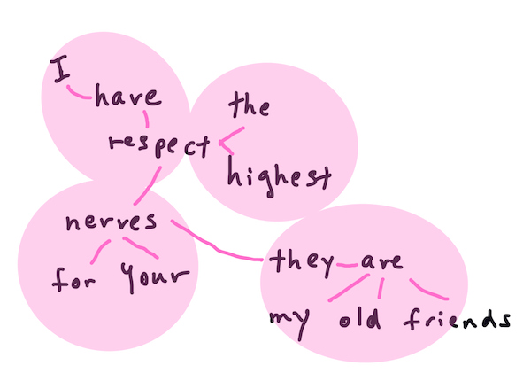
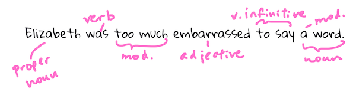

# Çox işlənən təbii dil emalı tapşırıqları və texnikaları

Əksər *təbii dil emalı* tapşırıqları üçün emal ediləcək mətn hissələrə ayrılmalı, tədqiq edilməli və nəticələr ya haradasa saxlanmalı, ya da qaydalar və data setləri ilə çarpaz istinad edilməlidir. Bu tapşırıqlar proqramçıya mətndəki termin və sözlərin _mənasını_, _niyyətini_ və yaxud da yalnız _tezliyini_ əldə etməyə imkan verir.

## [Mühazirədən əvvəl test](https://gray-sand-07a10f403.1.azurestaticapps.net/quiz/33/?loc=az)

Mətn emalında tez-tez istifadə olunan texnikaları kəşf edək. Maşın öyrənməsi ilə birlikdə bu üsullar böyük həcmdə mətni səmərəli şəkildə təhlil etməyə kömək edir. Bu tapşırıqlara ML tətbiq etməzdən əvvəl gəlin NLP mütəxəssisinin qarşılaşdığı problemləri anlayaq.

## NLP-ə xas tapşırıqlar

Üzərində işlədiyiniz mətni təhlil etməyin müxtəlif yolları var. Burada sizin yerinə yetirə biləcəyiniz tapşırıqlar mövcuddur. Həmin tapşırıqlar vasitəsilə siz mətni başa düşə və nəticələr çıxara bilərsiniz. Əksərən bu tapşırıqlar sıra ilə yerinə yetirilir.

### Tokenləşdirmə

Yəqin ki, əksər NLP alqoritmlərinin etməli olduğu ilk şey mətni tokenlərə və ya sözlərə bölməkdir. Bu sadə səslənsə də, durğu işarələrini və müxtəlif dillərin söz və cümlə ayırıcılarını nəzərə almaq onu çətinləşdirə bilər. Demarkasiyaları müəyyən etmək üçün müxtəlif üsullardan istifadə etməli ola bilərsiniz.


> **Qürur və Qərəz**-dən bir cümlənin tokenləşdirilməsi. [Jen Looper](https://twitter.com/jenlooper) tərəfindən çəkilmiş infoqrafik.

### Yerləşdirmələr

[Söz daxiletmələri](https://wikipedia.org/wiki/Word_embedding) mətn məlumatlarınızı ədədi olaraq çevirməyin bir üsuludur. Yerləşdirmə elə bir şəkildə edilir ki, oxşar mənalı sözlər və ya birlikdə istifadə olunan sözlər birləşsin.


> "I have the highest respect for your nerves, they are my old friends." - **Qürur və Qərəz**-dən bir cümlə üçün söz daxiletmələri. [Jen Looper](https://twitter.com/jenlooper) tərəfindən çəkilmiş infoqrafik.

✅ Söz yerləşdirmələr ilə sınaqlar keçirmək üçün [bu maraqlı aləti](https://projector.tensorflow.org/) sınayın. Bir sözə kliklədikdə oxşar sözlərdən ibarət qruplar görünür: 'oyuncaq' ilə 'disney', 'lego', 'playstation' və 'console' klasterləri.

### Təhlil & Nitq hissələrinin etiketlənməsi

Tokenləşdirilmiş hər bir söz nitq hissəsi olaraq isim, fel və ya sifət kimi qeyd edilə bilər. `The quick red fox jumped over the lazy brown dog` cümləsi POS(nitq hissəsinin ingiliscə qarşılığı olan "part-of-speech"-in qısaldılmış forması) olaraq fox = isim, jumped = fel kimi işarələnə bilər.



> **Qürur və Qərəz**-dən bir cümlənin təhlili. [Jen Looper](https://twitter.com/jenlooper) tərəfindən infoqrafik.

Hissələrə ayırma bir cümlədə hansı sözlərin bir-biri ilə əlaqəli olduğunu tanımaqdır - məsələn, `the quick red fox jumped`, `lazy brown dog` ardıcıllığından ayrı olan sifət-isim-fel ardıcıllığıdır.

### Söz və ifadə tezlikləri

Böyük bir mətni təhlil edərkən məsləhətdir ki, hər bir söz və ya söz birləşməsini və onun nə qədər tez rast gəlindiyini göstərən lüğət yaradılsın. `The quick red fox jumped over the lazy brown dog` cümləsindəki `the` 2 söz tezliyinə malikdir.

Sözlərin tezliyini saydığımız nümunə mətnə baxaq. Rudyard Kiplinqin "Qaliblər" şeirində aşağıdakı bənd var:

```output
What the moral? Who rides may read.
When the night is thick and the tracks are blind
A friend at a pinch is a friend, indeed,
But a fool to wait for the laggard behind.
Down to Gehenna or up to the Throne,
He travels the fastest who travels alone.
```

Tələb olunduğu kimi ifadə tezliyi böyük və ya kiçik hərflərə həssas ola bildiyinə görə, `a friend` ifadəsinin tezliyi 2, `the` ifadəsinin tezliyi 6, `travels`-in tezliyi isə 2-dir.

### N-qram

Mətn müəyyən uzunluqdakı sözlər ardıcıllığına, tək sözə (uniqram), iki sözə (biqram), üç sözə (triqram) və ya istənilən sayda sözə (n-qram) bölünə bilər.

Məsələn, n-qram balı 2 olan `the quick red fox jumped over the lazy brown dog` cümləsi aşağıdakı n-qramları əmələ gətirir:

1. the quick
2. quick red
3. red fox
4. fox jumped
5. jumped over
6. over the
7. the lazy
8. lazy brown
9. brown dog

Onları cümlə üzərində sürüşmə qutusu kimi göstərmək daha asan ola bilər. Nümunə 3 sözdən ibarət n-qramlar üçündür və hər cümlədə n-qram qalın şriftlə göstərilmişdir:

1.   <u>**the quick red**</u> fox jumped over the lazy brown dog
2.   the **<u>quick red fox</u>** jumped over the lazy brown dog
3.   the quick **<u>red fox jumped</u>** over the lazy brown dog
4.   the quick red **<u>fox jumped over</u>** the lazy brown dog
5.   the quick red fox **<u>jumped over the</u>** lazy brown dog
6.   the quick red fox jumped **<u>over the lazy</u>** brown dog
7.   the quick red fox jumped over <u>**the lazy brown**</u> dog
8.   the quick red fox jumped over the **<u>lazy brown dog</u>**


> 3-ün N-qram dəyəri: [Jen Looper](https://twitter.com/jenlooper) tərəfindən çəkilmiş infoqrafik.

### İsimin çıxarılması

Əksər cümlələrdə cümlənin subyekti və ya obyekti olan isim mövcud olur. İngilis dilində tez-tez həmin isimlərin qarşısında 'a', 'an' və ya 'the' görə bilərik. NLP-də cümlənin mənasını qavramağa çalışarkən "isimi çıxarmaq" yolu ilə cümlənin subyektinin və ya obyektinin müəyyən edilməsi tez-tez edilən bir üsuldur.

✅ "I cannot fix on the hour, or the spot, or the look or the words, which laid the foundation. It is too long ago. I was in the middle before I knew that I had begun." cümləsində olan isimləri müəyyənləşdirə bilərsinizmi?

`the quick red fox jumped over the lazy brown dog` cümləsində 2 isim var: **quick red fox** və **lazy brown dog**.

### Emosionallıq təhlili

Cümlə və ya mətn onun emosionallığını təyin etmək və ya nə dərəcədə *müsbət* və ya *mənfi* olması üçün təhlil edilə bilər. Emosionallıq *qütblük* və *obyektivlik/subyektivlik* ilə ölçülür. Qütblülük -1.0-dən 1.0-ə (mənfidən müsbətə) və 0.0-dan 1.0-ə qədər (ən obyektivdən ən subyektivinə) ölçülür.

✅ Sonradan öyrənəcəksiniz ki, maşın öyrənməsindən istifadə edərək emosionallığı müəyyən etməyin müxtəlif yolları var, lakin bunun bir yolu insan eksperti tərəfindən müsbət və ya mənfi olaraq təsnif edilən söz və ifadələrin siyahısına sahib olmaq və həmin modeli verilən mətnə tətbiq edərək qütbilik hesabını tapmaqdır. Bu üsulun bəzi hallarda necə işlədiyini və digərlərində daha az yaxşı olacağını görə bilərsinizmi?

### Bükülmə

Bükülmə verilən sözə görə həmin sözün tək və ya cəm halını əldə etməyə imkan verir.

### Lemmatizasiya(Söz kökünün müəyyən olunması)

*Lemma* sözlər qrupunun aid olduğu kök sözü bildirir. Məsələn *flew*, *flies*, *flying* sözləri *fly* felinin lemmasına malikdir.

NLP tədqiqatçısı üçün faydalı data bazaları da mövcuddur, xüsusən:

### WordNet

[WordNet](https://wordnet.princeton.edu/) hər bir söz üçün müxtəlif dillərdə onların qarşılığı, sinonimləri, antonimləri və bir çox başqa təfərrüatları özündə saxlayan lüğət bazasıdır. Tərcümələr, orfoqrafik yoxlayıcılar və ya istənilən növ dil alətləri yaratmaq üçün inanılmaz dərəcədə faydalıdırlar.

## NLP kitabxanaları

Xoşbəxtlikdən bu texnikaların hamısını özünüzün yaratmasına ehtiyac yoxdur. Çünki təbii dil emalı və ya maşın öyrənməsi üzrə ixtisaslaşmamış tərtibatçılar üçün onu daha əlçatan edən əla Python kitabxanaları mövcuddur. Növbəti dərslərdə bunlara dair daha çox nümunə olacaq, lakin burada növbəti tapşırığı yerinə yetirməkdə sizə kömək etmək üçün bəzi faydalı nümunələr öyrənəcəksiniz.

### Tapşırıq - `TextBlob` kitabxanasından istifadə etmək

Gəlin bu tip tapşırıqların həlli üçün faydalı API-ləri ehtiva edən TextBlob adlı kitabxanadan istifadə edək. TextBlob, "[NLTK](https://nltk.org) və [pattern](https://github.com/clips/pattern)-in nəhəng çiyinləri üzərində dayanır və hər ikisi ilə yaxşı uyğunlaşır." Onun API-sinə daxil edilmiş xeyli miqdarda ML var.

> Qeyd: Təcrübəli Python tərtibatçıları üçün tövsiyə olunan faydalı [Quick Start](https://textblob.readthedocs.io/en/dev/quickstart.html#quickstart) bələdçisi TextBlob üçün mövcuddur.

*İsimləri* müəyyən etməyə çalışarkən, TextBlob onları tapmaq üçün bir neçə ekstraktor variantı təklif edir.

1. `ConllExtractor`a nəzər salın.

    ```python
    from textblob import TextBlob
    from textblob.np_extractors import ConllExtractor
    # import and create a Conll extractor to use later
    extractor = ConllExtractor()

    # later when you need a noun phrase extractor:
    user_input = input("> ")
    user_input_blob = TextBlob(user_input, np_extractor=extractor)  # note non-default extractor specified
    np = user_input_blob.noun_phrases
    ```

     > Burada nə baş verir? [ConllExtractor](https://textblob.readthedocs.io/en/dev/api_reference.html?highlight=Conll#textblob.en.np_extractors.ConllExtractor) "ConLL-2000 ilə öyrədilmiş toplu təhlilindən istifadə edən isim çıxarıcı öyrətmə korpusudur”. ConLL-2000 2000-ci ildə Hesabi Təbii Dil Öyrənmə Konfransına işarə edir. Hər il bu konfrans çətin bir NLP problemini həll etmək üçün seminar keçirir. 2000-ci ildə isə bu problem isim parçalanması olmuşdur. Həmin model Wall Street Journal-dakı "15-18-ci bölmələri öyrətmə datası (211727 token) və 20-ci bölməni isə test datası (47377 token)" kimi götürərək hazırlanmışdır. Siz istifadə olunan prosedurlara [burada](https://www.clips.uantwerpen.be/conll2000/chunking/), nəticələrə isə [buradan](https://ifarm.nl/erikt/research/np-chunking.html) baxa bilərsiniz.

### Çağırış - NLP ilə botunuzun təkmilləşdirilməsi

Əvvəlki dərsdə siz çox sadə bir sual-cavab botu yaratmışdınız. İndi əhval-ruhiyyə üçün daxil etdiyinizi təhlil edərək və əhval-ruhiyyəyə uyğun cavabı çap etməklə Marvini bir az daha anlayışlı etmiş olacaqsınız. Bundan əlavə, həmçinin siz `isimi` təyin etməli və bu barədə soruşmalısınız.

Daha yaxşı danışıq botu qurarkən atmalı olduğunuz addımlar bunlardır:

1. İstifadəçiyə botla necə qarşılıqlı əlaqə qurmağı tövsiyə edən təlimatları göstərin
2. Dövrün başlanğıcı
    1. İstifadəçi daxiletməsini qəbul edin
    2. Əgər istifadəçi çıxmağı xahiş edibsə, çıxın
    3. İstifadəçi daxiletməsini emal edin və müvafiq əhval-ruhiyyə cavabını təyin edin
    4. Hissdə isim aşkar edilərsə, onu cəm formasına çevirin və bu mövzuda əlavə məlumat tələb edin
    5. Cavabı çap edin
3. 2-ci addıma qayıdın

TextBlob-dan istifadə edərək əhval-ruhiyyəni müəyyən etmək üçün nümunə kod budur. Nəzərə alın ki, yalnız dörd *qradient* əhval-ruhiyyə cavabı var (istəyərsinizsə, daha çoxunu əldə edə bilərsiniz):

```python
if user_input_blob.polarity <= -0.5:
  response = "Oh dear, that sounds bad. "
elif user_input_blob.polarity <= 0:
  response = "Hmm, that's not great. "
elif user_input_blob.polarity <= 0.5:
  response = "Well, that sounds positive. "
elif user_input_blob.polarity <= 1:
  response = "Wow, that sounds great. "
```

Sizi istiqamətləndirmək üçün bir neçə nümunə çıxışı təqdim edirik (istifadəçi girişi > ilə başlayan sətirlərdədir):

```output
Hello, I am Marvin, the friendly robot.
You can end this conversation at any time by typing 'bye'
After typing each answer, press 'enter'
How are you today?
> I am ok
Well, that sounds positive. Can you tell me more?
> I went for a walk and saw a lovely cat
Well, that sounds positive. Can you tell me more about lovely cats?
> cats are the best. But I also have a cool dog
Wow, that sounds great. Can you tell me more about cool dogs?
> I have an old hounddog but he is sick
Hmm, that's not great. Can you tell me more about old hounddogs?
> bye
It was nice talking to you, goodbye!
```

Tapşırığın mümkün həlli [buradadır](https://github.com/microsoft/ML-For-Beginners/blob/main/6-NLP/2-Tasks/solution/bot.py).

✅ Bilik yoxlanışı

1. Sizcə anlayışlı cavablar kimisə botun həqiqətən də onları başa düşdüyünü düşünməyə 'inandıra biləcək'?
2. İsimi müəyyən etmək botu daha 'inandırıcı' edirmi?
3. Nəyə görə cümlədən 'isimi' çıxarmaq faydalı olardı?

## 🚀 Məşğələ

Əvvəlki bilik yoxlamasındakı tapşırığı götürün və onu həyata keçirməyə çalışın. Botu dostunuz vasitəsilə test edin. Onu aldada bilərmi? Botunuzu daha 'inandırıcı' edə bilərsinizmi?

## [Mühazirə sonrası test](https://gray-sand-07a10f403.1.azurestaticapps.net/quiz/34/?loc=az)

## Təkrarlayın və özünüz öyrənin

Növbəti bir neçə dərsdə siz hisslərin təhlili haqqında daha çox məlumat əldə edəcəksiniz. Bu maraqlı texnikanı [KDNuggets] (https://www.kdnuggets.com/tag/nlp) saytındakı bu kimi məqalələrlə araşdırın.

## Tapşırıq

[Botun reaksiya bildirməsini təmin edin](assignment.az.md)