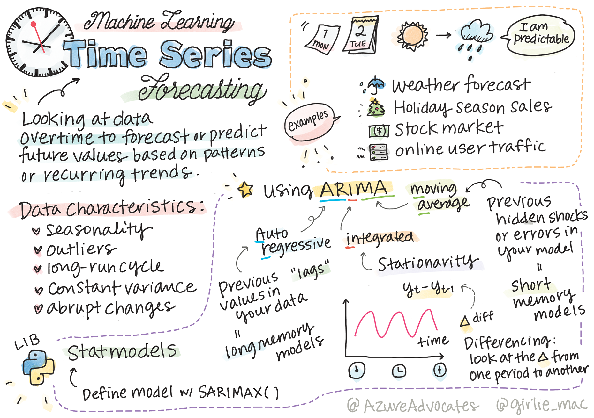
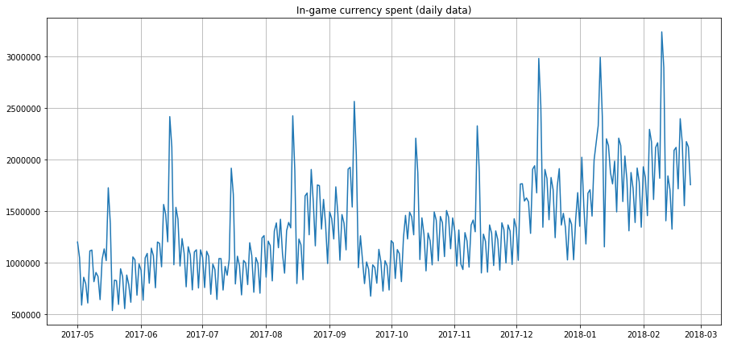
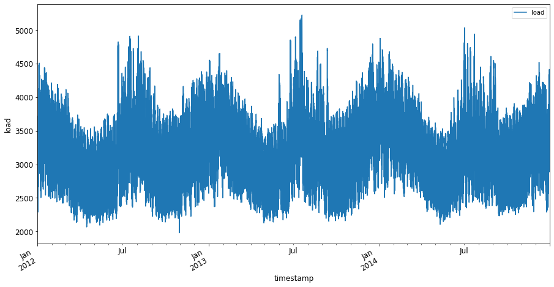

# Time series forecasting 소개하기



> Sketchnote by [Tomomi Imura](https://www.twitter.com/girlie_mac)

이 강의와 다음에서, 다른 토픽보다 덜 알려진 ML 사이언티스트의 레파토리 중에 흥미롭고 가치있는 파트인, time series forecasting에 대하여 약간 배우게 됩니다. Time series forecasting은 일종의 'crystal ball'입니다: 가격과 같은 값의 과거 성적에 기반해서, 미래 잠재 값을 예측할 수 있습니다.

[](https://youtu.be/cBojo1hsHiI "Introduction to time series forecasting")

> 🎥 이미지를 눌러서 time series forecasting에 대한 비디오를 봅니다

## [강의 전 퀴즈](https://gray-sand-07a10f403.1.azurestaticapps.net/quiz/41/)

가격, 재고, 그리고 공급과 연관된 이슈에 직접 적용하게 된다면, 비지니스에 실제로 가치있는 유용하고 흥미로운 필드가 됩니다. 딥러닝 기술은 미래의 성능을 잘 예측하기 위해 더 많은 인사이트를 얻고자 사용했지만, time series forecasting은 classic ML 기술에서 지속적으로 많은 정보를 얻는 필드입니다.

> Penn State의 유용한 time series 커리큘럼은 [here](https://online.stat.psu.edu/stat510/lesson/1)에서 찾을 수 있습니다

## 소개

시간에 따라 얼마나 자주 사용하는지 데이터를 제공하는 smart parking meters의 배열을 관리한다고 가정해봅니다.

> 미터기의 과거 퍼포먼스를 기반으로, 공급과 수요의 법칙에 따라서 미래 값을, 예측할 수 있나요?

목표를 이루기 위해 언제 할 지 정확히 예측하는 것은 time series forecasting으로 다룰 수 있는 도전입니다. 주차 공간을 찾을 때 바쁜 시간이면 더 많은 요금을 받아서 기분은 안 좋겠지만, 거리 청소할 수익을 벌 수 있는 확실한 방식이 될 예정입니다!

time series 알고리즘 일부를 알아보면서 노트북에서 정리하고 준비한 일부 데이터로 시작합니다. 분석할 데이터는 GEFCom2014 forecasting competition에서 가져왔습니다. 2012년과 2014년 사이 시간당 전기 부하와 온도 값의 3년치로 이루어져 있습니다. 전기 부하와 온도의 과거에 기록된 패턴이 주어지면, 전기 부하의 미래 값을 예측할 수 있습니다.

이 예시에서, 과거에 기록된 부하 데이터만 사용해서, 한 time step에 앞서 예측하는 방식을 배우게 됩니다. 그러나, 시작하기 전, 무대 뒤에서 어떤 일이 일어나는지 이해하는 것이 유용합니다.

## 일부 정의

'time series' 용어를 만나면 여러 다른 맥락에서 사용하는 것을 이해할 필요가 있습니다.

🎓 **Time series**

수학에서, "time series은 시간 순서로 인덱스된 (또는 리스트되거나 그래픽으로 표기) 데이터 포인트 시리즈입니다. 가장 일반적으로, time series는 연속해서 같은 간격의 포인트로 되어있는 시퀀스입니다." time series 예시로는 [Dow Jones Industrial Average](https://wikipedia.org/wiki/Time_series)의 당일 마감 값입니다. time series plot과 통계 모델링을 사용하면 신호 처리, 닐씨 예측, 지진 경보 등 발생하고 시간이 지나면서 데이터 포인트를 그릴 수 있는 다양한 필드에서 자주 마주하게 됩니다.

🎓 **Time series analysis**

Time series 분석은, 방금 전에 언급했던 time series 데이터의 분석입니다. Time series 데이터는 interrupting 이벤트 이전과 이후에 time series 진화 패턴을 감지하는 'interrupted time series'를 포함한 별개 폼을 가질 수 있습니다. time series에 필요한 분석 타입은, 데이터의 특성에 기반합니다. Time series 데이터 자체는 계열 숫자 또는 문자 폼을 가질 수 있습니다.

분석하면, frequency-domain과 time-domain, 선형과 비선형 등 포함해서, 다양한 방식을 사용합니다. 이 데이터 타입을 분석할 많은 방식에 대해서 [Learn more](https://www.itl.nist.gov/div898/handbook/pmc/section4/pmc4.htm)합니다.

🎓 **Time series forecasting**

Time series forecasting은 모델로 이전에 수집한 과거 데이터에서 보여준 패턴을 기반으로 미래 값을 예측합니다. regression 모델은 plot에서 x 변수를 사용할 타임 인덱스로, time series 데이터를 살펴보는 것이 가능하지만, 앞서 언급한 데이터는 스페셜 타입 모델을 사용해서 잘 분석하게 됩니다.

Time series 데이터는 linear regression으로 분석할 수 있는 데이터와 다르게, 정렬된 관찰 값의 리스트입니다. 가장 일반적인 하나는 "Autoregressive Integrated Moving Average"의 약어인, ARIMA입니다. 

[ARIMA models](https://online.stat.psu.edu/stat510/lesson/1/1.1)은 "시리즈의 현재 값을 과거 값과 과거 예측 오류로 엮습니다." 데이터가 시간이 지나면서 정렬되는, time-domain 데이터를 분석하는 게 가장 적당합니다.

> [here](https://people.duke.edu/~rnau/411arim.htm)에서 배울 수 있고 다음 강의에서 다룰 예정인, ARIMA 모델에는 여러 타입이 있습니다.

다음 강의에서, 시간이 지나가면서 바뀌는 하나의 변수에 초점을 맞추어진, [Univariate Time Series](https://itl.nist.gov/div898/handbook/pmc/section4/pmc44.htm)로 ARIMA 모델을 만드려고 합니다. 데이터 타입의 예시는 Mauna Loa Observatory에서 월별 C02 concentration을 기록한 [this dataset](https://itl.nist.gov/div898/handbook/pmc/section4/pmc4411.htm)입니다.

|  CO2   | YearMonth | Year  | Month |
| :----: | :-------: | :---: | :---: |
| 330.62 |  1975.04  | 1975  |   1   |
| 331.40 |  1975.13  | 1975  |   2   |
| 331.87 |  1975.21  | 1975  |   3   |
| 333.18 |  1975.29  | 1975  |   4   |
| 333.92 |  1975.38  | 1975  |   5   |
| 333.43 |  1975.46  | 1975  |   6   |
| 331.85 |  1975.54  | 1975  |   7   |
| 330.01 |  1975.63  | 1975  |   8   |
| 328.51 |  1975.71  | 1975  |   9   |
| 328.41 |  1975.79  | 1975  |  10   |
| 329.25 |  1975.88  | 1975  |  11   |
| 330.97 |  1975.96  | 1975  |  12   |

✅ 이 데이터셋에서 시간이 지나며 변수를 식별합니다

## 고려할 Time Series [data characteristics](https://online.stat.psu.edu/stat510/lesson/1/1.1)

time series 데이터를 봤을 때, 패턴을 더 잘 이해하고자 계산하고 완화해야 할 필요가 있는 특성이라는 점을 알 수 있습니다. 만약 분석하기 원하는 'signal'로 잠재적으로 제공하는 time series 데이터를 고려하면, 이 특성을 'noise'라고 생각할 수 있습니다. 일부 통계 기술로 이 특성 중 일부를 파생해서 이 'noise'를 자주 줄일 필요가 있을 것입니다.

time series 작업하기 위해서 알아야 되는 일부 컨셉은 여기 있습니다:

🎓 **Trends**

트랜드는 시간이 지나면서 측정할 수 있는 증감으로 정의합니다. [Read more](https://machinelearningmastery.com/time-series-trends-in-python). time series의 컨텍스트에서, time series으로 트랜드를 사용하고 필요할 때 지우는 방식입니다.

🎓 **[Seasonality](https://machinelearningmastery.com/time-series-seasonality-with-python/)**

다양한 plot 타입이 데이터에서 seasonality를 어떻게 보여주는지 [Take a look](https://itl.nist.gov/div898/handbook/pmc/section4/pmc443.htm)합니다.

🎓 **Outliers**

아웃라이어는 표준회된 데이터 분산에서 멀어져 있습니다.

🎓 **Long-run cycle**

seasonality의 독립적으로, 1년 보다 긴 경제 침체같은 long-run cycle을 보여줄 수 있습니다. 

🎓 **Constant variance**

시간이 지나면서, 일부 데이터는 낮과 밤 비율의 에너지 사용량처럼, 변하지 않는 파동을 보여줍니다. 

🎓 **Abrupt changes**

데이터는 더 분석할 필요가 있는 갑작스러운 변화를 보여줄 수 있습니다. 예시로, COVID로 인하여 비지니스가 갑자기 끝나면, 데이터에 변경이 가해집니다.

✅ 여기는 몇 년이 넘도록 일일 인-게임 통화를 보여주는 [sample time series plot](https://www.kaggle.com/kashnitsky/topic-9-part-1-time-series-analysis-in-python)입니다. 이 데이터에서 리스트로 되어있는 특성을 모두 식별할 수 있나요?



## 연습 - 전력 사용량 데이터로 시작하기

주어진 과거 사용량으로 미래 전력 사용량을 예측하기 위한 time series 모델을 만들기 시작합시다.

> 이 예시의 데이터는 GEFCom2014 forecasting competition에서 가져왔습니다. 2012년과 2014년 사이 시간당 전력 부하와 온도 값 3년치로 이루어져 있습니다.
>
> Tao Hong, Pierre Pinson, Shu Fan, Hamidreza Zareipour, Alberto Troccoli and Rob J. Hyndman, "Probabilistic energy forecasting: Global Energy Forecasting Competition 2014 and beyond", International Journal of Forecasting, vol.32, no.3, pp 896-913, July-September, 2016.

1. 이 강의의 `working` 폴더에서, _notebook.ipynb_ 파일을 엽니다. 데이터를 불러오고 시각화하기 위해 도움을 받을 수 있는 라이브러리를 추가해서 시작합니다


    ```python
    import os
    import matplotlib.pyplot as plt
    from common.utils import load_data
    %matplotlib inline
    ```

    참고, 환경을 세팅하고 데이터를 내려받으려 포함된 `common` 폴더에 있는 파일을 사용합니다.

2. 다음으로, `load_data()`와 `head()`를 불러서 데이터프레임으로 데이터를 검사합니다:

    ```python
    data_dir = './data'
    energy = load_data(data_dir)[['load']]
    energy.head()
    ```

    날짜와 load를 나타내는 두 열을 볼 수 있습니다:

    |                     |  load  |
    | :-----------------: | :----: |
    | 2012-01-01 00:00:00 | 2698.0 |
    | 2012-01-01 01:00:00 | 2558.0 |
    | 2012-01-01 02:00:00 | 2444.0 |
    | 2012-01-01 03:00:00 | 2402.0 |
    | 2012-01-01 04:00:00 | 2403.0 |

3. 지금부터, `plot()` 불러서 데이터를 plot 합니다:

    ```python
    energy.plot(y='load', subplots=True, figsize=(15, 8), fontsize=12)
    plt.xlabel('timestamp', fontsize=12)
    plt.ylabel('load', fontsize=12)
    plt.show()
    ```

    

4. 지금부터, `[from date]: [to date]` 패턴에서 `energy`를 넣어서 제공하는, July 2014 첫 주를 plot합니다:

    ```python
    energy['2014-07-01':'2014-07-07'].plot(y='load', subplots=True, figsize=(15, 8), fontsize=12)
    plt.xlabel('timestamp', fontsize=12)
    plt.ylabel('load', fontsize=12)
    plt.show()
    ```

    

    예쁜 plot 입니다! 이 plot을 보고 다음 리스트된 특성을 다 판단할 수 있는지 확인합니다. 데이터를 시각화해서 추측할 내용이 있나요?

다음 강의에서, 일부 예측하는 ARIMA 모델을 만들 예정입니다.

---

## 🚀 도전

time series forecasting에서 얻을 수 있다고 생각할 수 있는 모든 산업과 조사 영역의 리스트를 만듭니다. 예술에 이 기술을 적용할 수 있다고 생각하나요? 경제학에서? 생태학에서? 리테일에서? 산업에서? 금융에서? 또 다른 곳은 어딘가요?

## [강의 후 퀴즈](https://gray-sand-07a10f403.1.azurestaticapps.net/quiz/42/)

## 검토 & 자기주도 학습

여기에서 커버되지 않지만, neural network는 가끔 time series forecasting의 classic 방식을 개선할 때 사용합니다. [in this article](https://medium.com/microsoftazure/neural-networks-for-forecasting-financial-and-economic-time-series-6aca370ff412)에서 해당 내용을 더 읽어봅니다.

## 과제

[Visualize some more time series](../assignment.md)
