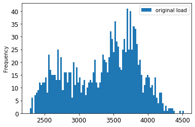
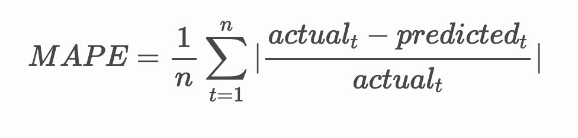

# Time series forecasting with ARIMA

In the previous lesson, you learned a bit about time series forecasting and loaded a dataset showing the fluctuations of electrical load over a time period.

[](https://youtu.be/IUSk-YDau10 "Introduction to ARIMA")

> 🎥 Click the image above for a video: A brief introduction to ARIMA models. The example is done in R, but the concepts are universal.

## [Pre-lecture quiz](https://gray-sand-07a10f403.1.azurestaticapps.net/quiz/43/)

## Introduction

In this lesson, you will discover a specific way to build models with [ARIMA: *A*uto*R*egressive *I*ntegrated *M*oving *A*verage](https://wikipedia.org/wiki/Autoregressive_integrated_moving_average). ARIMA models are particularly suited to fit data that shows [non-stationarity](https://wikipedia.org/wiki/Stationary_process).

## General concepts

To be able to work with ARIMA, there are some concepts you need to know about:

- 🎓 **Stationarity**. From a statistical context, stationarity refers to data whose distribution does not change when shifted in time. Non-stationary data, then, shows fluctuations due to trends that must be transformed to be analyzed. Seasonality, for example, can introduce fluctuations in data and can be eliminated by a process of 'seasonal-differencing'.

- 🎓 **[Differencing](https://wikipedia.org/wiki/Autoregressive_integrated_moving_average#Differencing)**. Differencing data, again from a statistical context, refers to the process of transforming non-stationary data to make it stationary by removing its non-constant trend. "Differencing removes the changes in the level of a time series, eliminating trend and seasonality and consequently stabilizing the mean of the time series." [Paper by Shixiong et al](https://arxiv.org/abs/1904.07632)

## ARIMA in the context of time series

Let's unpack the parts of ARIMA to better understand how it helps us model time series and help us make predictions against it.

- **AR - for AutoRegressive**. Autoregressive models, as the name implies, look 'back' in time to analyze previous values in your data and make assumptions about them. These previous values are called 'lags'. An example would be data that shows monthly sales of pencils. Each month's sales total would be considered an 'evolving variable' in the dataset. This model is built as the "evolving variable of interest is regressed on its own lagged (i.e., prior) values." [wikipedia](https://wikipedia.org/wiki/Autoregressive_integrated_moving_average)

- **I - for Integrated**. As opposed to the similar 'ARMA' models, the 'I' in ARIMA refers to its *[integrated](https://wikipedia.org/wiki/Order_of_integration)* aspect. The data is 'integrated' when differencing steps are applied so as to eliminate non-stationarity.

- **MA -  for Moving Average**. The [moving-average](https://wikipedia.org/wiki/Moving-average_model) aspect of this model refers to the output variable that is determined by observing the current and past values of lags.

Bottom line: ARIMA is used to make a model fit the special form of time series data as closely as possible.

## Exercise - build an ARIMA model

Open the [_/working_](https://github.com/microsoft/ML-For-Beginners/tree/main/7-TimeSeries/2-ARIMA/working) folder in this lesson and find the [_notebook.ipynb_](https://github.com/microsoft/ML-For-Beginners/blob/main/7-TimeSeries/2-ARIMA/working/notebook.ipynb) file.

1. Run the notebook to load the `statsmodels` Python library; you will need this for ARIMA models.

1. Load necessary libraries

1. Now, load up several more libraries useful for plotting data:

    ```python
    import os
    import warnings
    import matplotlib.pyplot as plt
    import numpy as np
    import pandas as pd
    import datetime as dt
    import math

    from pandas.plotting import autocorrelation_plot
    from statsmodels.tsa.statespace.sarimax import SARIMAX
    from sklearn.preprocessing import MinMaxScaler
    from common.utils import load_data, mape
    from IPython.display import Image

    %matplotlib inline
    pd.options.display.float_format = '{:,.2f}'.format
    np.set_printoptions(precision=2)
    warnings.filterwarnings("ignore") # specify to ignore warning messages
    ```

1. Load the data from the `/data/energy.csv` file into a Pandas dataframe and take a look:

    ```python
    energy = load_data('./data')[['load']]
    energy.head(10)
    ```

1. Plot all the available energy data from January 2012 to December 2014. There should be no surprises as we saw this data in the last lesson:

    ```python
    energy.plot(y='load', subplots=True, figsize=(15, 8), fontsize=12)
    plt.xlabel('timestamp', fontsize=12)
    plt.ylabel('load', fontsize=12)
    plt.show()
    ```

    Now, let's build a model!

### Create training and testing datasets

Now your data is loaded, so you can separate it into train and test sets. You'll train your model on the train set. As usual, after the model has finished training, you'll evaluate its accuracy using the test set. You need to ensure that the test set covers a later period in time from the training set to ensure that the model does not gain information from future time periods.

1. Allocate a two-month period from September 1 to October 31, 2014 to the training set. The test set will include the two-month period of November 1 to December 31, 2014:

    ```python
    train_start_dt = '2014-11-01 00:00:00'
    test_start_dt = '2014-12-30 00:00:00'
    ```

    Since this data reflects the daily consumption of energy, there is a strong seasonal pattern, but the consumption is most similar to the consumption in more recent days.

1. Visualize the differences:

    ```python
    energy[(energy.index < test_start_dt) & (energy.index >= train_start_dt)][['load']].rename(columns={'load':'train'}) \
        .join(energy[test_start_dt:][['load']].rename(columns={'load':'test'}), how='outer') \
        .plot(y=['train', 'test'], figsize=(15, 8), fontsize=12)
    plt.xlabel('timestamp', fontsize=12)
    plt.ylabel('load', fontsize=12)
    plt.show()
    ```

    

    Therefore, using a relatively small window of time for training the data should be sufficient.

    > Note: Since the function we use to fit the ARIMA model uses in-sample validation during fitting, we will omit validation data.

### Prepare the data for training

Now, you need to prepare the data for training by performing filtering and scaling of your data. Filter your dataset to only include the time periods and columns you need, and scaling to ensure the data is projected in the interval 0,1.

1. Filter the original dataset to include only the aforementioned time periods per set and only including the needed column 'load' plus the date:

    ```python
    train = energy.copy()[(energy.index >= train_start_dt) & (energy.index < test_start_dt)][['load']]
    test = energy.copy()[energy.index >= test_start_dt][['load']]

    print('Training data shape: ', train.shape)
    print('Test data shape: ', test.shape)
    ```

    You can see the shape of the data:

    ```output
    Training data shape:  (1416, 1)
    Test data shape:  (48, 1)
    ```

1. Scale the data to be in the range (0, 1).

    ```python
    scaler = MinMaxScaler()
    train['load'] = scaler.fit_transform(train)
    train.head(10)
    ```

1. Visualize the original vs. scaled data:

    ```python
    energy[(energy.index >= train_start_dt) & (energy.index < test_start_dt)][['load']].rename(columns={'load':'original load'}).plot.hist(bins=100, fontsize=12)
    train.rename(columns={'load':'scaled load'}).plot.hist(bins=100, fontsize=12)
    plt.show()
    ```

    

    > The original data

    

    > The scaled data

1. Now that you have calibrated the scaled data, you can scale the test data:

    ```python
    test['load'] = scaler.transform(test)
    test.head()
    ```

### Implement ARIMA

It's time to implement ARIMA! You'll now use the `statsmodels` library that you installed earlier.

Now you need to follow several steps

   1. Define the model by calling `SARIMAX()` and passing in the model parameters: p, d, and q parameters, and P, D, and Q parameters.
   2. Prepare the model for the training data by calling the fit() function.
   3. Make predictions calling the `forecast()` function and specifying the number of steps (the `horizon`) to forecast.

> 🎓 What are all these parameters for? In an ARIMA model there are 3 parameters that are used to help model the major aspects of a time series: seasonality, trend, and noise. These parameters are:

`p`: the parameter associated with the auto-regressive aspect of the model, which incorporates *past* values.
`d`: the parameter associated with the integrated part of the model, which affects the amount of *differencing* (🎓 remember differencing 👆?) to apply to a time series.
`q`: the parameter associated with the moving-average part of the model.

> Note: If your data has a seasonal aspect - which this one does - , we use a seasonal ARIMA model (SARIMA). In that case you need to use another set of parameters: `P`, `D`, and `Q` which describe the same associations as `p`, `d`, and `q`, but correspond to the seasonal components of the model.

1. Start by setting your preferred horizon value. Let's try 3 hours:

    ```python
    # Specify the number of steps to forecast ahead
    HORIZON = 3
    print('Forecasting horizon:', HORIZON, 'hours')
    ```

    Selecting the best values for an ARIMA model's parameters can be challenging as it's somewhat subjective and time intensive. You might consider using an `auto_arima()` function from the [`pyramid` library](https://alkaline-ml.com/pmdarima/0.9.0/modules/generated/pyramid.arima.auto_arima.html),

1. For now try some manual selections to find a good model.

    ```python
    order = (4, 1, 0)
    seasonal_order = (1, 1, 0, 24)

    model = SARIMAX(endog=train, order=order, seasonal_order=seasonal_order)
    results = model.fit()

    print(results.summary())
    ```

    A table of results is printed.

You've built your first model! Now we need to find a way to evaluate it.

### Evaluate your model

To evaluate your model, you can perform the so-called `walk forward` validation. In practice, time series models are re-trained each time a new data becomes available. This allows the model to make the best forecast at each time step.

Starting at the beginning of the time series using this technique, train the model on the train data set. Then make a prediction on the next time step. The prediction is evaluated against the known value. The training set is then expanded to include the known value and the process is repeated.

> Note: You should keep the training set window fixed for more efficient training so that every time you add a new observation to the training set, you remove the observation from the beginning of the set.

This process provides a more robust estimation of how the model will perform in practice. However, it comes at the computation cost of creating so many models. This is acceptable if the data is small or if the model is simple, but could be an issue at scale.

Walk-forward validation is the gold standard of time series model evaluation and is recommended for your own projects.

1. First, create a test data point for each HORIZON step.

    ```python
    test_shifted = test.copy()

    for t in range(1, HORIZON+1):
        test_shifted['load+'+str(t)] = test_shifted['load'].shift(-t, freq='H')

    test_shifted = test_shifted.dropna(how='any')
    test_shifted.head(5)
    ```

    |            |          | load | load+1 | load+2 |
    | ---------- | -------- | ---- | ------ | ------ |
    | 2014-12-30 | 00:00:00 | 0.33 | 0.29   | 0.27   |
    | 2014-12-30 | 01:00:00 | 0.29 | 0.27   | 0.27   |
    | 2014-12-30 | 02:00:00 | 0.27 | 0.27   | 0.30   |
    | 2014-12-30 | 03:00:00 | 0.27 | 0.30   | 0.41   |
    | 2014-12-30 | 04:00:00 | 0.30 | 0.41   | 0.57   |

    The data is shifted horizontally according to its horizon point.

1. Make predictions on your test data using this sliding window approach in a loop the size of the test data length:

    ```python
    %%time
    training_window = 720 # dedicate 30 days (720 hours) for training

    train_ts = train['load']
    test_ts = test_shifted

    history = [x for x in train_ts]
    history = history[(-training_window):]

    predictions = list()

    order = (2, 1, 0)
    seasonal_order = (1, 1, 0, 24)

    for t in range(test_ts.shape[0]):
        model = SARIMAX(endog=history, order=order, seasonal_order=seasonal_order)
        model_fit = model.fit()
        yhat = model_fit.forecast(steps = HORIZON)
        predictions.append(yhat)
        obs = list(test_ts.iloc[t])
        # move the training window
        history.append(obs[0])
        history.pop(0)
        print(test_ts.index[t])
        print(t+1, ': predicted =', yhat, 'expected =', obs)
    ```

    You can watch the training occurring:

    ```output
    2014-12-30 00:00:00
    1 : predicted = [0.32 0.29 0.28] expected = [0.32945389435989236, 0.2900626678603402, 0.2739480752014323]

    2014-12-30 01:00:00
    2 : predicted = [0.3  0.29 0.3 ] expected = [0.2900626678603402, 0.2739480752014323, 0.26812891674127126]

    2014-12-30 02:00:00
    3 : predicted = [0.27 0.28 0.32] expected = [0.2739480752014323, 0.26812891674127126, 0.3025962399283795]
    ```

1. Compare the predictions to the actual load:

    ```python
    eval_df = pd.DataFrame(predictions, columns=['t+'+str(t) for t in range(1, HORIZON+1)])
    eval_df['timestamp'] = test.index[0:len(test.index)-HORIZON+1]
    eval_df = pd.melt(eval_df, id_vars='timestamp', value_name='prediction', var_name='h')
    eval_df['actual'] = np.array(np.transpose(test_ts)).ravel()
    eval_df[['prediction', 'actual']] = scaler.inverse_transform(eval_df[['prediction', 'actual']])
    eval_df.head()
    ```

    Output
    |     |            | timestamp | h   | prediction | actual   |
    | --- | ---------- | --------- | --- | ---------- | -------- |
    | 0   | 2014-12-30 | 00:00:00  | t+1 | 3,008.74   | 3,023.00 |
    | 1   | 2014-12-30 | 01:00:00  | t+1 | 2,955.53   | 2,935.00 |
    | 2   | 2014-12-30 | 02:00:00  | t+1 | 2,900.17   | 2,899.00 |
    | 3   | 2014-12-30 | 03:00:00  | t+1 | 2,917.69   | 2,886.00 |
    | 4   | 2014-12-30 | 04:00:00  | t+1 | 2,946.99   | 2,963.00 |


    Observe the hourly data's prediction, compared to the actual load. How accurate is this?

### Check model accuracy

Check the accuracy of your model by testing its mean absolute percentage error (MAPE) over all the predictions.

> **🧮 Show me the math**
>
> 
>
>  [MAPE](https://www.linkedin.com/pulse/what-mape-mad-msd-time-series-allameh-statistics/) is used to show prediction accuracy as a ratio defined by the above formula. The difference between actual<sub>t</sub> and predicted<sub>t</sub> is divided by the actual<sub>t</sub>. "The absolute value in this calculation is summed for every forecasted point in time and divided by the number of fitted points n." [wikipedia](https://wikipedia.org/wiki/Mean_absolute_percentage_error)

1. Express equation in code:

    ```python
    if(HORIZON > 1):
        eval_df['APE'] = (eval_df['prediction'] - eval_df['actual']).abs() / eval_df['actual']
        print(eval_df.groupby('h')['APE'].mean())
    ```

1. Calculate one step's MAPE:

    ```python
    print('One step forecast MAPE: ', (mape(eval_df[eval_df['h'] == 't+1']['prediction'], eval_df[eval_df['h'] == 't+1']['actual']))*100, '%')
    ```

    One step forecast MAPE:  0.5570581332313952 %

1. Print the multi-step forecast MAPE:

    ```python
    print('Multi-step forecast MAPE: ', mape(eval_df['prediction'], eval_df['actual'])*100, '%')
    ```

    ```output
    Multi-step forecast MAPE:  1.1460048657704118 %
    ```

    A nice low number is best: consider that a forecast that has a MAPE of 10 is off by 10%.

1. But as always, it's easier to see this kind of accuracy measurement visually, so let's plot it:

    ```python
     if(HORIZON == 1):
        ## Plotting single step forecast
        eval_df.plot(x='timestamp', y=['actual', 'prediction'], style=['r', 'b'], figsize=(15, 8))

    else:
        ## Plotting multi step forecast
        plot_df = eval_df[(eval_df.h=='t+1')][['timestamp', 'actual']]
        for t in range(1, HORIZON+1):
            plot_df['t+'+str(t)] = eval_df[(eval_df.h=='t+'+str(t))]['prediction'].values

        fig = plt.figure(figsize=(15, 8))
        ax = plt.plot(plot_df['timestamp'], plot_df['actual'], color='red', linewidth=4.0)
        ax = fig.add_subplot(111)
        for t in range(1, HORIZON+1):
            x = plot_df['timestamp'][(t-1):]
            y = plot_df['t+'+str(t)][0:len(x)]
            ax.plot(x, y, color='blue', linewidth=4*math.pow(.9,t), alpha=math.pow(0.8,t))

        ax.legend(loc='best')

    plt.xlabel('timestamp', fontsize=12)
    plt.ylabel('load', fontsize=12)
    plt.show()
    ```

    

🏆 A very nice plot, showing a model with good accuracy. Well done!

---

## 🚀Challenge

Dig into the ways to test the accuracy of a Time Series Model. We touch on MAPE in this lesson, but are there other methods you could use? Research them and annotate them. A helpful document can be found [here](https://otexts.com/fpp2/accuracy.html)

## [Post-lecture quiz](https://gray-sand-07a10f403.1.azurestaticapps.net/quiz/44/)

## Review & Self Study

This lesson touches on only the basics of Time Series Forecasting with ARIMA. Take some time to deepen your knowledge by digging into [this repository](https://microsoft.github.io/forecasting/) and its various model types to learn other ways to build Time Series models.

## Assignment

[A new ARIMA model](assignment.md)
