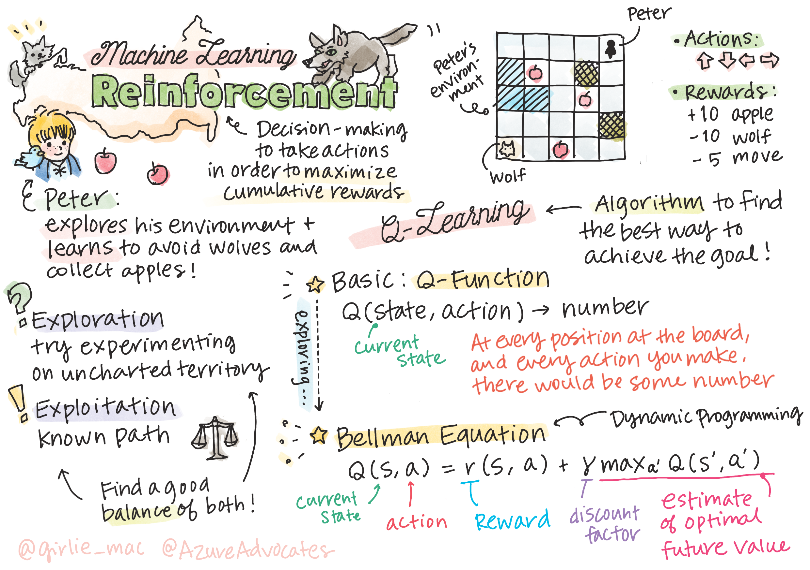
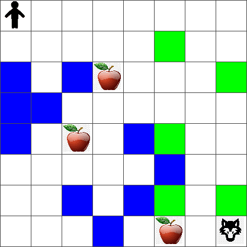
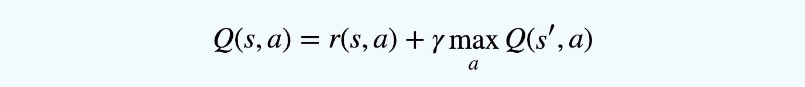
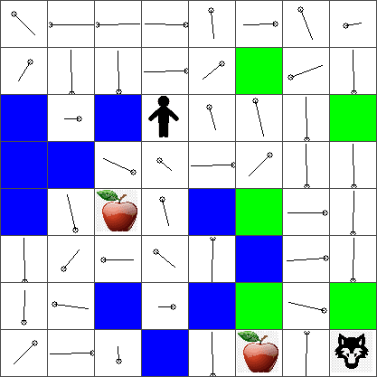
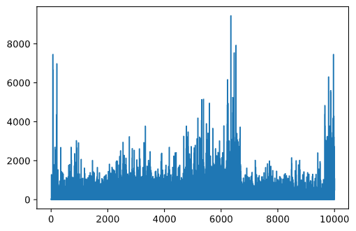

# Introduction to Reinforcement Learning and Q-Learning


> Sketchnote by [Tomomi Imura](https://www.twitter.com/girlie_mac)

Reinforcement learning involves three important concepts: the agent, some states, and a set of actions per state. By executing an action in a specified state, the agent is given a reward. Again imagine the computer game Super Mario. You are Mario, you are in a game level, standing next to a cliff edge. Above you is a coin. You being Mario, in a game level, at a specific position ... that's your state. Moving one step to the right (an action) will take you over the edge, and that would give you a low numerical score. However, pressing the jump button would let you score a point and you would stay alive. That's a positive outcome and that should award you a positive numerical score.

By using reinforcement learning and a simulator (the game), you can learn how to play the game to maximize the reward which is staying alive and scoring as many points as possible.

[](https://www.youtube.com/watch?v=lDq_en8RNOo)

> 🎥 Click the image above to hear Dmitry discuss Reinforcement Learning

## [Pre-lecture quiz](https://gray-sand-07a10f403.1.azurestaticapps.net/quiz/45/)

## Prerequisites and Setup

In this lesson, we will be experimenting with some code in Python. You should be able to run the Jupyter Notebook code from this lesson, either on your computer or somewhere in the cloud.

You can open [the lesson notebook](https://github.com/microsoft/ML-For-Beginners/blob/main/8-Reinforcement/1-QLearning/notebook.ipynb) and walk through this lesson to build.

> **Note:** If you are opening this code from the cloud, you also need to fetch the [`rlboard.py`](https://github.com/microsoft/ML-For-Beginners/blob/main/8-Reinforcement/1-QLearning/rlboard.py) file, which is used in the notebook code. Add it to the same directory as the notebook.

## Introduction

In this lesson, we will explore the world of **[Peter and the Wolf](https://en.wikipedia.org/wiki/Peter_and_the_Wolf)**, inspired by a musical fairy tale by a Russian composer, [Sergei Prokofiev](https://en.wikipedia.org/wiki/Sergei_Prokofiev). We will use **Reinforcement Learning** to let Peter explore his environment, collect tasty apples and avoid meeting the wolf.

**Reinforcement Learning** (RL) is a learning technique that allows us to learn an optimal behavior of an **agent** in some **environment** by running many experiments. An agent in this environment should have some **goal**, defined by a **reward function**.

## The environment

For simplicity, let's consider Peter's world to be a square board of size `width` x `height`, like this:



Each cell in this board can either be:

* **ground**, on which Peter and other creatures can walk.
* **water**, on which you obviously cannot walk.
* a **tree** or **grass**, a place where you can rest.
* an **apple**, which represents something Peter would be glad to find in order to feed himself.
* a **wolf**, which is dangerous and should be avoided.

There is a separate Python module, [`rlboard.py`](https://github.com/microsoft/ML-For-Beginners/blob/main/8-Reinforcement/1-QLearning/rlboard.py), which contains the code to work with this environment. Because this code is not important for understanding our concepts, we will import the module and use it to create the sample board (code block 1):

```python
from rlboard import *

width, height = 8,8
m = Board(width,height)
m.randomize(seed=13)
m.plot()
```

This code should print a picture of the environment similar to the one above.

## Actions and policy

In our example, Peter's goal would be able to find an apple, while avoiding the wolf and other obstacles. To do this, he can essentially walk around until he finds an apple.

Therefore, at any position, he can choose between one of the following actions: up, down, left and right.

We will define those actions as a dictionary, and map them to pairs of corresponding coordinate changes. For example, moving right (`R`) would correspond to a pair `(1,0)`. (code block 2):

```python
actions = { "U" : (0,-1), "D" : (0,1), "L" : (-1,0), "R" : (1,0) }
action_idx = { a : i for i,a in enumerate(actions.keys()) }
```

To sum up, the strategy and goal of this scenario are as follows:

- **The strategy**, of our agent (Peter) is defined by a so-called **policy**. A policy is a function that returns the action at any given state. In our case, the state of the problem is represented by the board, including the current position of the player.

- **The goal**, of reinforcement learning is to eventually learn a good policy that will allow us to solve the problem efficiently. However, as a baseline, let's consider the simplest policy called **random walk**.

## Random walk

Let's first solve our problem by implementing a random walk strategy. With random walk, we will randomly choose the next action from the allowed actions, until we reach the apple (code block 3).

1. Implement the random walk with the below code:

    ```python
    def random_policy(m):
        return random.choice(list(actions))
    
    def walk(m,policy,start_position=None):
        n = 0 # number of steps
        # set initial position
        if start_position:
            m.human = start_position 
        else:
            m.random_start()
        while True:
            if m.at() == Board.Cell.apple:
                return n # success!
            if m.at() in [Board.Cell.wolf, Board.Cell.water]:
                return -1 # eaten by wolf or drowned
            while True:
                a = actions[policy(m)]
                new_pos = m.move_pos(m.human,a)
                if m.is_valid(new_pos) and m.at(new_pos)!=Board.Cell.water:
                    m.move(a) # do the actual move
                    break
            n+=1
    
    walk(m,random_policy)
    ```

    The call to `walk` should return the length of the corresponding path, which can vary from one run to another. 

1. Run the walk experiment a number of times (say, 100), and print the resulting statistics (code block 4):

    ```python
    def print_statistics(policy):
        s,w,n = 0,0,0
        for _ in range(100):
            z = walk(m,policy)
            if z<0:
                w+=1
            else:
                s += z
                n += 1
        print(f"Average path length = {s/n}, eaten by wolf: {w} times")
    
    print_statistics(random_policy)
    ```

    Note that the average length of a path is around 30-40 steps, which is quite a lot, given the fact that the average distance to the nearest apple is around 5-6 steps.

    You can also see what Peter's movement looks like during the random walk:

    

## Reward function

To make our policy more intelligent, we need to understand which moves are "better" than others. To do this, we need to define our goal.

The goal can be defined in terms of a **reward function**, which will return some score value for each state. The higher the number, the better the reward function. (code block 5)

```python
move_reward = -0.1
goal_reward = 10
end_reward = -10

def reward(m,pos=None):
    pos = pos or m.human
    if not m.is_valid(pos):
        return end_reward
    x = m.at(pos)
    if x==Board.Cell.water or x == Board.Cell.wolf:
        return end_reward
    if x==Board.Cell.apple:
        return goal_reward
    return move_reward
```

An interesting thing about reward functions is that in most cases, *we are only given a substantial reward at the end of the game*. This means that our algorithm should somehow remember "good" steps that lead to a positive reward at the end, and increase their importance. Similarly, all moves that lead to bad results should be discouraged.

## Q-Learning

An algorithm that we will discuss here is called **Q-Learning**. In this algorithm, the policy is defined by a function (or a data structure) called a **Q-Table**. It records the "goodness" of each of the actions in a given state.

It is called a Q-Table because it is often convenient to represent it as a table, or multi-dimensional array. Since our board has dimensions `width` x `height`, we can represent the Q-Table using a numpy array with shape `width` x `height` x `len(actions)`: (code block 6)

```python
Q = np.ones((width,height,len(actions)),dtype=np.float)*1.0/len(actions)
```

Notice that we initialize all the values of the Q-Table with an equal value, in our case - 0.25. This corresponds to the "random walk" policy, because all moves in each state are equally good. We can pass the Q-Table to the `plot` function in order to visualize the table on the board: `m.plot(Q)`.


In the center of each cell there is an "arrow" that indicates the preferred direction of movement. Since all directions are equal, a dot is displayed.

Now we need to run the simulation, explore our environment, and learn a better distribution of Q-Table values, which will allow us to find the path to the apple much faster.

## Essence of Q-Learning: Bellman Equation

Once we start moving, each action will have a corresponding reward, i.e. we can theoretically select the next action based on the highest immediate reward. However, in most states, the move will not achieve our goal of reaching the apple, and thus we cannot immediately decide which direction is better.

> Remember that it is not the immediate result that matters, but rather the final result, which we will obtain at the end of the simulation.

In order to account for this delayed reward, we need to use the principles of **[dynamic programming](https://en.wikipedia.org/wiki/Dynamic_programming)**, which allow us to think about out problem recursively.

Suppose we are now at the state *s*, and we want to move to the next state *s'*. By doing so, we will receive the immediate reward *r(s,a)*, defined by the reward function, plus some future reward. If we suppose that our Q-Table correctly reflects the "attractiveness" of each action, then at state *s'* we will chose an action *a* that corresponds to maximum value of *Q(s',a')*. Thus, the best possible future reward we could get at state *s* will be defined as `max`<sub>a'</sub>*Q(s',a')* (maximum here is computed over all possible actions *a'* at state *s'*).

This gives the **Bellman formula** for calculating the value of the Q-Table at state *s*, given action *a*:



Here γ is the so-called **discount factor** that determines to which extent you should prefer the current reward over the future reward and vice versa.

## Learning Algorithm

Given the equation above, we can now write pseudo-code for our learning algorithm:

* Initialize Q-Table Q with equal numbers for all states and actions
* Set learning rate α ← 1
* Repeat simulation many times
   1. Start at random position
   1. Repeat
        1. Select an action *a* at state *s*
        2. Execute action by moving to a new state *s'*
        3. If we encounter end-of-game condition, or total reward is too small - exit simulation  
        4. Compute reward *r* at the new state
        5. Update Q-Function according to Bellman equation: *Q(s,a)* ← *(1-α)Q(s,a)+α(r+γ max<sub>a'</sub>Q(s',a'))*
        6. *s* ← *s'*
        7. Update the total reward and decrease α.

## Exploit vs. explore

In the algorithm above, we did not specify how exactly we should choose an action at step 2.1. If we are choosing the action randomly, we will randomly **explore** the environment, and we are quite likely to die often as well as explore areas where we would not normally go. An alternative approach would be to **exploit** the Q-Table values that we already know, and thus to choose the best action (with higher Q-Table value) at state *s*. This, however, will prevent us from exploring other states, and it's likely we might not find the optimal solution.

Thus, the best approach is to strike a balance between exploration and exploitation. This can be done by choosing the action at state *s* with probabilities proportional to values in the Q-Table. In the beginning, when Q-Table values are all the same, it would correspond to a random selection, but as we learn more about our environment, we would be more likely to follow the optimal route while allowing the agent to choose the unexplored path once in a while.

## Python implementation

We are now ready to implement the learning algorithm. Before we do that, we also need some function that will convert arbitrary numbers in the Q-Table into a vector of probabilities for corresponding actions.

1. Create a function `probs()`:

    ```python
    def probs(v,eps=1e-4):
        v = v-v.min()+eps
        v = v/v.sum()
        return v
    ```

    We add a few `eps` to the original vector in order to avoid division by 0 in the initial case, when all components of the vector are identical.

Run them learning algorithm through 5000 experiments, also called **epochs**: (code block 8)
```python
    for epoch in range(5000):
    
        # Pick initial point
        m.random_start()
        
        # Start travelling
        n=0
        cum_reward = 0
        while True:
            x,y = m.human
            v = probs(Q[x,y])
            a = random.choices(list(actions),weights=v)[0]
            dpos = actions[a]
            m.move(dpos,check_correctness=False) # we allow player to move outside the board, which terminates episode
            r = reward(m)
            cum_reward += r
            if r==end_reward or cum_reward < -1000:
                lpath.append(n)
                break
            alpha = np.exp(-n / 10e5)
            gamma = 0.5
            ai = action_idx[a]
            Q[x,y,ai] = (1 - alpha) * Q[x,y,ai] + alpha * (r + gamma * Q[x+dpos[0], y+dpos[1]].max())
            n+=1
```

After executing this algorithm, the Q-Table should be updated with values that define the attractiveness of different actions at each step. We can try to visualize the Q-Table by plotting a vector at each cell that will point in the desired direction of movement. For simplicity, we draw a small circle instead of an arrow head.



## Checking the policy

Since the Q-Table lists the "attractiveness" of each action at each state, it is quite easy to use it to define the efficient navigation in our world. In the simplest case, we can select the action corresponding to the highest Q-Table value: (code block 9)

```python
def qpolicy_strict(m):
        x,y = m.human
        v = probs(Q[x,y])
        a = list(actions)[np.argmax(v)]
        return a

walk(m,qpolicy_strict)
```

> If you try the code above several times, you may notice that sometimes it "hangs", and you need to press the STOP button in the notebook to interrupt it. This happens because there could be situations when two states "point" to each other in terms of optimal Q-Value, in which case the agents ends up moving between those states indefinitely.

## 🚀Challenge

> **Task 1:** Modify the `walk` function to limit the maximum length of path by a certain number of steps (say, 100), and watch the code above return this value from time to time.

> **Task 2:** Modify the `walk` function so that it does not go back to the places where it has already been previously. This will prevent `walk` from looping, however, the agent can still end up being "trapped" in a location from which it is unable to escape.

## Navigation

A better navigation policy would be the one that we used during training, which combines exploitation and exploration. In this policy, we will select each action with a certain probability, proportional to the values in the Q-Table. This strategy may still result in the agent returning back to a position it has already explored, but, as you can see from the code below, it results in a very short average path to the desired location (remember that `print_statistics` runs the simulation 100 times): (code block 10)

```python
def qpolicy(m):
        x,y = m.human
        v = probs(Q[x,y])
        a = random.choices(list(actions),weights=v)[0]
        return a

print_statistics(qpolicy)
```

After running this code, you should get a much smaller average path length than before, in the range of 3-6.

## Investigating the learning process

As we have mentioned, the learning process is a balance between exploration and exploration of gained knowledge about the structure of problem space. We have seen that the results of learning (the ability to help an agent to find a short path to the goal) has improved, but it is also interesting to observe how the average path length behaves during the learning process:



The learnings can be summarized as:

- **Average path length increases**. What we see here is that at first, the average path length increases. This is probably due to the fact that when we know nothing about the environment, we are likely to get trapped in bad states, water or wolf. As we learn more and start using this knowledge, we can explore the environment for longer, but we still do not know where the apples are very well.

- **Path length decrease, as we learn more**. Once we learn enough, it becomes easier for the agent to achieve the goal, and the path length starts to decrease. However, we are still open to exploration, so we often diverge away from the best path, and explore new options, making the path longer than optimal.

- **Length increase abruptly**. What we also observe on this graph is that at some point, the length increased abruptly. This indicates the stochastic nature of the process, and that we can at some point "spoil" the Q-Table coefficients by overwriting them with new values. This ideally should be minimized by decreasing learning rate (for example, towards the end of training, we only adjust Q-Table values by a small value).

Overall, it is important to remember that the success and quality of the learning process significantly depends on parameters, such as learning rate, learning rate decay, and discount factor. Those are often called **hyperparameters**, to distinguish them from **parameters**, which we optimize during training (for example, Q-Table coefficients). The process of finding the best hyperparameter values is called **hyperparameter optimization**, and it deserves a separate topic.

## [Post-lecture quiz](https://gray-sand-07a10f403.1.azurestaticapps.net/quiz/46/)

## Assignment 
[A More Realistic World](assignment.md)
