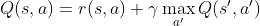

# Introduzione a Reinforcement Learning e  Q-Learning


> Sketchnote di [Tomomi Imura](https://www.twitter.com/girlie_mac)

Il reinforcement learning (apprendimento per rinforzo) coinvolge tre concetti importanti: l'agente, alcuni stati e un insieme di azioni per stato. Eseguendo un'azione in uno stato specifico, l'agente riceve una ricompensa. Si immagini di nuovo il gioco per computer Super Mario. Si è Mario, ci si trova in un livello di gioco, in piedi accanto a un dirupo. Sopra a Mario c'è una moneta. L'essere Mario, in un livello di gioco, in una posizione specifica... questo è il proprio stato. Spostarsi di un passo a destra (un'azione) porterebbe Mario oltre il limite e questo darebbe un punteggio numerico basso. Tuttavia, premendo il pulsante di salto si farà segnare un punto e si rimarrà vivi. Questo è un risultato positivo e dovrebbe assegnare un punteggio numerico positivo.

Usando reinforcement learning e un simulatore (il gioco), si può imparare a giocare per massimizzare la ricompensa che consiste nel rimanere in vita e segnare più punti possibile.

[](https://www.youtube.com/watch?v=lDq_en8RNOo)

> 🎥 Fare clic sull'immagine sopra per ascoltare Dmitry discutere sul reinforcement learning

## [Quiz pre-lezione](https://gray-sand-07a10f403.1.azurestaticapps.net/quiz/45/?loc=it)

## Prerequisiti e Configurazione

In questa lezione si sperimenterà del codice in Python. Si dovrebbe essere in grado di eseguire il codice di Jupyter Notebook da questa lezione, sul proprio computer o da qualche parte nel cloud.

Si può aprire [il notebook della lezione](notebook.ipynb) e seguire questa lezione per sviluppare.

> **Nota:** Se si sta aprendo questo codice dal cloud, occorre anche recuperare il file [`rlboard.py`](../rlboard.py) , che viene utilizzato nel codice del notebook. Aggiungerlo alla stessa directory del notebook.

## Introduzione

In questa lezione si esplorerà il mondo di **[Pierino e il lupo](https://it.wikipedia.org/wiki/Pierino_e_il_lupo)**, ispirato a una fiaba musicale di un compositore russo, [Sergei Prokofiev](https://it.wikipedia.org/wiki/Sergei_Prokofiev). Si userà **Reinforcement Learning** per permettere a Pierino di esplorare il suo ambiente, raccogliere gustose mele ed evitare di incontrare il lupo.

**Reinforcement Learning** (RL) è una tecnica di apprendimento che  permette di apprendere un comportamento ottimale di un **agente** in un certo **ambiente** eseguendo molti esperimenti. Un agente in questo ambiente dovrebbe avere un **obiettivo**, definito da una **funzione di ricompensa**.

## L’ambiente

Per semplicità, si considera il mondo di Pierino come una tavola di gioco quadrata di dimensioni `width` X `height`, (larghezza X altezza), in questo modo:


Ogni cella in questa tavola può essere:

* **terra**, sulla quale possono camminare Pierino e le altre creature.
* **acqua**, sulla quale ovviamente non è possibile camminare.
* un **albero** o un **prato**, un luogo dove riposarsi.
* una **mela**, che rappresenta qualcosa che Pierino sarebbe felice di trovare per nutrirsi.
* un **lupo**, che è pericoloso e dovrebbe essere evitato.

C'è un modulo Python separato, [`rlboard.py`](../rlboard.py), che contiene il codice per lavorare con questo ambiente. Poiché questo codice non è importante per comprendere i  concetti esposti, si importerà il modulo e lo si utilizzerà per creare la tavola di gioco di esempio (blocco di codice 1):

```python
from rlboard import *

width, height = 8,8
m = Board(width,height)
m.randomize(seed=13)
m.plot()
```

Questo codice dovrebbe stampare un'immagine dell'ambiente simile a quella sopra.

## Azioni e policy

In questo esempio, l'obiettivo di Pierino sarebbe quello di trovare una mela, evitando il lupo e altri ostacoli. Per fare ciò, può essenzialmente camminare finché non trova una mela.

Pertanto, in qualsiasi posizione, può scegliere tra una delle seguenti azioni: su, giù, sinistra e destra.

Si definiranno queste azioni come un dizionario e si mapperanno su coppie di corrispondenti cambiamenti di coordinate. Ad esempio, lo spostamento a destra (`R`) corrisponderebbe a una coppia `(1,0)`. (blocco di codice 2):

```python
actions = { "U" : (0,-1), "D" : (0,1), "L" : (-1,0), "R" : (1,0) }
action_idx = { a : i for i,a in enumerate(actions.keys()) }
```

Per riassumere, la strategia e l'obiettivo di questo scenario sono i seguenti:

- **La strategia** del nostro agente (Pierino) è definita da una cosiddetta **policy**. Una policy è una funzione che restituisce l'azione ad ogni dato stato. In questo caso, lo stato del problema è rappresentato dalla tavola di gioco, inclusa la posizione attuale del giocatore.

- **L'obiettivo** del reinforcement learning è alla fine imparare una buona policy che consentirà di risolvere il problema in modo efficiente. Tuttavia, come linea di base, si considera la policy più semplice chiamata **random walk**.

## Random walk (passeggiata aleatoria)

Prima si risolve il problema implementando una strategia di random walk. Tramite random walk, si sceglierà casualmente l'azione successiva tra quelle consentite, fino a raggiungere la mela (blocco di codice 3).

1. Implementare random walk con il codice seguente:

   ```python
   def random_policy(m):
       return random.choice(list(actions))

   def walk(m,policy,start_position=None):
       n = 0 # numero di passi
       # imposta posizione iniziale
       if start_position:
           m.human = start_position
       else:
           m.random_start()
       while True:
           if m.at() == Board.Cell.apple:
               return n # successo!
           if m.at() in [Board.Cell.wolf, Board.Cell.water]:
               return -1 # mangiato dal lupo o annegato
           while True:
               a = actions[policy(m)]
               new_pos = m.move_pos(m.human,a)
               if m.is_valid(new_pos) and m.at(new_pos)!=Board.Cell.water:
                   m.move(a) # esegue la mossa effettiva
                   break
           n+=1

   walk(m,random_policy)
   ```

   La chiamata a `walk` dovrebbe restituire la lunghezza del percorso corrispondente, che può variare da una esecuzione all'altra.

1. Eseguire l'esperimento di walk un certo numero di volte (100 ad esempio) e stampare le statistiche risultanti (blocco di codice 4):

   ```python
   def print_statistics(policy):
       s,w,n = 0,0,0
       for _ in range(100):
           z = walk(m,policy)
           if z<0:
               w+=1
           else:
               s += z
               n += 1
       print(f"Average path length = {s/n}, eaten by wolf: {w} times")

   print_statistics(random_policy)
   ```

   Notare che la lunghezza media di un percorso è di circa 30-40 passi, che è parecchio, dato che la distanza media dalla mela più vicina è di circa 5-6 passi.

   Si può anche vedere come appare il movimento di Pierino durante la passeggiata aleatoria:

   

## Funzione di ricompensa

Per rendere la policy più intelligente, occorre capire quali mosse sono "migliori" di altre. Per fare questo, si deve definire l'obiettivo.

L'obiettivo può essere definito in termini di una **funzione di ricompensa**, che restituirà un valore di punteggio per ogni stato. Più alto è il numero, migliore è la funzione di ricompensa. (blocco di codice 5)

```python
move_reward = -0.1
goal_reward = 10
end_reward = -10

def reward(m,pos=None):
    pos = pos or m.human
    if not m.is_valid(pos):
        return end_reward
    x = m.at(pos)
    if x==Board.Cell.water or x == Board.Cell.wolf:
        return end_reward
    if x==Board.Cell.apple:
        return goal_reward
    return move_reward
```

Una cosa interessante delle funzioni di ricompensa è che nella maggior parte dei casi viene *data una ricompensa sostanziale solo alla fine del gioco*. Ciò significa che l'algoritmo dovrebbe in qualche modo ricordare i passaggi "buoni" che portano a una ricompensa positiva alla fine e aumentare la loro importanza. Allo stesso modo, tutte le mosse che portano a cattivi risultati dovrebbero essere scoraggiate.

## Q-Learning

Un algoritmo che verrà trattato qui si chiama **Q-Learning**. In questo algoritmo, la policy è definita da una funzione (o una struttura dati) chiamata **Q-Table**. Registra la "bontà" di ciascuna delle azioni in un dato stato.

Viene chiamata Q-Table perché spesso è conveniente rappresentarla come una tabella o un array multidimensionale. Poiché la tavola di gioco ha dimensioni `width` x `height`, si può rappresentare la tabella Q usando un array numpy con forma `width` x `height` x `len(actions)`: (blocco di codice 6)

```python
Q = np.ones((width,height,len(actions)),dtype=np.float)*1.0/len(actions)
```

Notare che si inizializzano tutti i valori della Q-Table con un valore uguale, in questo caso - 0.25. Ciò corrisponde alla policy di "random walk", perché tutte le mosse in ogni stato sono ugualmente buone. Si può passare la Q-Table alla funzione `plot` per visualizzare la tabella sulla tavola di gioco: `m.plot (Q)`.


Al centro di ogni cella è presente una "freccia" che indica la direzione di spostamento preferita. Poiché tutte le direzioni sono uguali, viene visualizzato un punto.

Ora si deve eseguire la simulazione, esplorare l'ambiente e apprendere una migliore distribuzione dei valori della Q-Table, che  consentirà di trovare il percorso verso la mela molto più velocemente.

## Essenza di Q-Learning: Equazione di Bellman

Una volta che si inizia il movimento, ogni azione avrà una ricompensa corrispondente, vale a dire che si può teoricamente selezionare l'azione successiva in base alla ricompensa immediata più alta. Tuttavia, nella maggior parte degli stati, la mossa non raggiungerà l'obiettivo di raggiungere la mela, e quindi non è possibile decidere immediatamente quale direzione sia migliore.

> Si ricordi che non è il risultato immediato che conta, ma piuttosto il risultato finale, che sarà ottenuto alla fine della simulazione.

Per tenere conto di questa ricompensa ritardata, occorre utilizzare i principi della **[programmazione dinamica](https://it.wikipedia.org/wiki/Programmazione_dinamica)**, che consentono di pensare al problema in modo ricorsivo.

Si supponga di essere ora nello stato *s*, e di voler passare allo stato *s* successivo. In tal modo, si riceverà la ricompensa immediata *r(s,a)*, definita dalla funzione di ricompensa, più qualche ricompensa futura. Se si suppone che la Q-Table rifletta correttamente l'"attrattiva" di ogni azione, allora allo stato *s'* si sceglierà *un'azione a* che corrisponde al valore massimo di *Q(s',a')*. Pertanto, la migliore ricompensa futura possibile che si potrebbe ottenere allo stato *s* sarà definita come `max`<sub>a'</sub>*Q(s',a')* (il massimo qui è calcolato su tutte le possibili azioni *a'* allo stato *s'*).

Questo dà la **formula** di Bellman per calcolare il valore della Q-Table allo stato *s*, data l'azione *a*:



Qui y è il cosiddetto **fattore di sconto** che determina fino a che punto si dovrebbe preferire il premio attuale a quello futuro e viceversa.

## Algoritmo di Apprendimento

Data l'equazione di cui sopra, ora si può scrivere pseudo-codice per l'algoritmo di apprendimento:

* Inizializzare Q-Table Q con numeri uguali per tutti gli stati e le azioni
* Impostare la velocità di apprendimento α ← 1
* Ripetere la simulazione molte volte
   1. Iniziare in una posizione casuale
   1. Ripetere
      1. Selezionare un'azione *a* nello stato *s*
      2. Eseguire l'azione trasferendosi in un nuovo stato *s'*
      3. Se si incontra una condizione di fine gioco o la ricompensa totale è troppo piccola, uscire dalla simulazione
      4. Calcolare la ricompensa *r* nel nuovo stato
      5. Aggiornare Q-Function secondo l'equazione di Bellman: *Q(s,a)* ← *(1-α)Q(s,a)+α(r+γ max<sub>a'</sub>Q(s',a'))*
      6. *s* ← *s'*
      7. Aggiornare la ricompensa totale e diminuire α.

## Sfruttamento contro esplorazione

Nell'algoritmo sopra, non è stato specificato come esattamente si dovrebbe scegliere un'azione al passaggio 2.1. Se si sceglie l'azione in modo casuale, si **esplorerà** casualmente l'ambiente e molto probabilmente si morirà spesso e si esploreranno aree in cui normalmente non si andrebbe. Un approccio alternativo sarebbe **sfruttare** i valori della Q-Table già noti, e quindi scegliere l'azione migliore (con un valore Q-Table più alto) allo stato *s*. Questo, tuttavia, impedirà di esplorare altri stati ed è probabile che non si potrebbe trovare la soluzione ottimale.

Pertanto, l'approccio migliore è trovare un equilibrio tra esplorazione e sfruttamento. Questo può essere fatto scegliendo l'azione allo stato *s* con probabilità proporzionali ai valori nella Q-Table. All'inizio, quando i valori della Q-Table sono tutti uguali, corrisponderebbe a una selezione casuale, ma man mano che si impara di più sull'ambiente, si sarà più propensi a seguire il percorso ottimale consentendo all'agente di scegliere il percorso inesplorato una volta ogni tanto.

## Implementazione Python

Ora si è pronti per implementare l'algoritmo di apprendimento. Prima di farlo, serve anche una funzione che converta i numeri arbitrari nella Q-Table in un vettore di probabilità per le azioni corrispondenti.

1. Creare una funzione `probs()`:

   ```python
   def probs(v,eps=1e-4):
       v = v-v.min()+eps
       v = v/v.sum()
       return v
   ```

   Aggiungere alcuni `eps` al vettore originale per evitare la divisione per 0 nel caso iniziale, quando tutte le componenti del vettore sono identiche.

Esegure l'algoritmo di apprendimento attraverso 5000 esperimenti, chiamati anche **epoche**: (blocco di codice 8)

    ```python
    for epoch in range(5000):

        # Sceglie il punto iniziale
        m.random_start()

        # Inizia a viaggiare
        n=0
        cum_reward = 0
        while True:
            x,y = m.human
            v = probs(Q[x,y])
            a = random.choices(list(actions),weights=v)[0]
            dpos = actions[a]
            m.move(dpos,check_correctness=False) # si consente al giocatore di spostarsi oltre la tavola di gioco, il che fa terminare l'episodioepisode
            r = reward(m)
            cum_reward += r
            if r==end_reward or cum_reward < -1000:
                lpath.append(n)
                break
            alpha = np.exp(-n / 10e5)
            gamma = 0.5
            ai = action_idx[a]
            Q[x,y,ai] = (1 - alpha) * Q[x,y,ai] + alpha * (r + gamma * Q[x+dpos[0], y+dpos[1]].max())
            n+=1
    ```

Dopo aver eseguito questo algoritmo, la Q-Table dovrebbe essere aggiornata con valori che definiscono l'attrattiva delle diverse azioni in ogni fase. Si può provare a visualizzare la Q-Table tracciando un vettore in ogni cella che punti nella direzione di movimento desiderata. Per semplicità, si disegna un piccolo cerchio invece di una punta di freccia.


## Controllo della policy

Poiché la Q-Table elenca l'"attrattiva" di ogni azione in ogni stato, è abbastanza facile usarla per definire la navigazione efficiente in questo mondo. Nel caso più semplice, si può selezionare l'azione corrispondente al valore Q-Table più alto: (blocco di codice 9)

```python
def qpolicy_strict(m):
        x,y = m.human
        v = probs(Q[x,y])
        a = list(actions)[np.argmax(v)]
        return a

walk(m,qpolicy_strict)
```

> Se si prova più volte il codice sopra, si potrebbe notare che a volte "si blocca" e occorre premere il pulsante STOP nel notebook per interromperlo. Ciò accade perché potrebbero esserci situazioni in cui due stati "puntano" l'uno all'altro in termini di Q-Value ottimale, nel qual caso gli agenti finiscono per spostarsi tra quegli stati indefinitamente.

## 🚀 Sfida

> **Attività 1:** modificare la funzione `walk` per limitare la lunghezza massima del percorso di un certo numero di passaggi (ad esempio 100) e osservare il codice sopra restituire questo valore di volta in volta.

> **Attività 2:** Modificare la funzione di `walk` in modo che non torni nei luoghi in cui è già stata in precedenza. Ciò impedirà la ricorsione di `walk`, tuttavia, l'agente può comunque finire per essere "intrappolato" in una posizione da cui non è in grado di fuggire.

## Navigazione

Una policy di navigazione migliore sarebbe quella usata durante l'addestramento, che combina sfruttamento ed esplorazione. In questa policy, si selezionerà ogni azione con una certa probabilità, proporzionale ai valori nella Q-Table. Questa strategia può comunque portare l'agente a tornare in una posizione già esplorata, ma, come si può vedere dal codice sottostante, risulta in un percorso medio molto breve verso la posizione desiderata (ricordare che `print_statistics` esegue la simulazione 100 volte ): (blocco di codice 10)

```python
def qpolicy(m):
        x,y = m.human
        v = probs(Q[x,y])
        a = random.choices(list(actions),weights=v)[0]
        return a

print_statistics(qpolicy)
```

Dopo aver eseguito questo codice, si dovrebbe ottenere una lunghezza media del percorso molto più piccola rispetto a prima, nell'intervallo 3-6.

## Indagare il processo di apprendimento

Come accennato, il processo di apprendimento è un equilibrio tra esplorazione e sfruttamento delle conoscenze acquisite sulla struttura del problema spazio. Si è visto che i risultati dell'apprendimento (la capacità di aiutare un agente a trovare un percorso breve verso l'obiettivo) sono migliorati, ma è anche interessante osservare come si comporta la lunghezza media del percorso durante il processo di apprendimento:


Gli apprendimenti possono essere riassunti come:

- **La lunghezza media del percorso aumenta**. Quello che si vede qui è che all'inizio la lunghezza media del percorso aumenta. Ciò è probabilmente dovuto al fatto che quando non si sa nulla dell'ambiente, è probabile rimanere intrappolati in cattive condizioni, acqua o lupo. Man mano che si impara di più e si inizia a utilizzare questa conoscenza, è possibile esplorare l'ambiente più a lungo, ma non si conosce ancora molto bene dove si trovano le mele.

- **La lunghezza del percorso diminuisce, man mano che si impara di più**. Una volta imparato abbastanza, diventa più facile per l'agente raggiungere l'obiettivo e la lunghezza del percorso inizia a diminuire. Tuttavia, si è ancora aperti all'esplorazione, quindi spesso ci si allontana dal percorso migliore e si esplorano nuove opzioni, rendendo il percorso più lungo che ottimale.

- **La lunghezza aumenta bruscamente**. Quello che si osserva anche su questo grafico è che ad un certo punto la lunghezza è aumentata bruscamente. Questo indica la natura stocastica del processo e che a un certo punto si possono "rovinare" i coefficienti della Q-Table sovrascrivendoli con nuovi valori. Idealmente, questo dovrebbe essere ridotto al minimo diminuendo il tasso di apprendimento (ad esempio, verso la fine dell'allenamento, si regolano i valori di Q-Table solo di un piccolo valore).

Nel complesso, è importante ricordare che il successo e la qualità del processo di apprendimento dipendono in modo significativo da parametri come il tasso di apprendimento, il decadimento del tasso di apprendimento e il fattore di sconto. Questi sono spesso chiamati **iperparametri**, per distinguerli dai **parametri**, che si ottimizzano durante l'allenamento (ad esempio, i coefficienti della Q-Table). Il processo per trovare i valori migliori degli iperparametri è chiamato **ottimizzazione degli iperparametri** e merita un argomento a parte.

## [Quiz post-lezione](https://gray-sand-07a10f403.1.azurestaticapps.net/quiz/46/?loc=fr)

## Incarico: [Un mondo più realistico](assignment.it.md)
