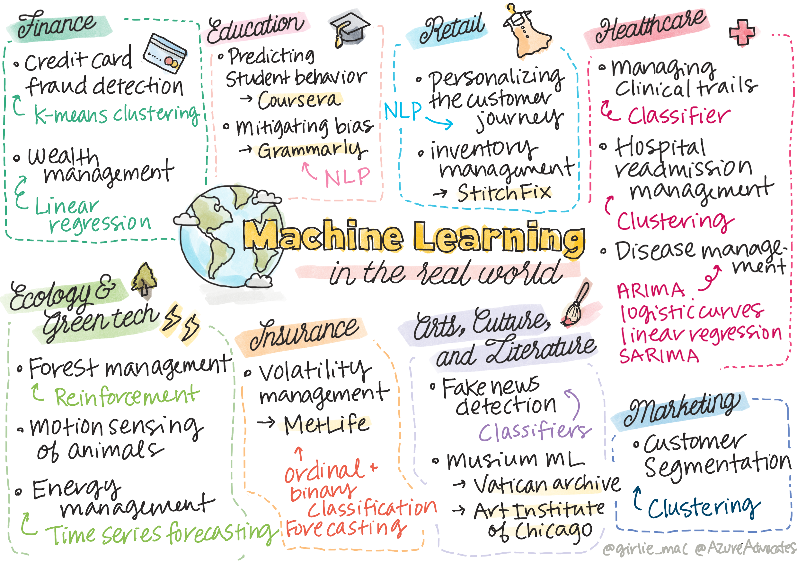

# 추신: 현실의 머신러닝

> Sketchnote by [Tomomi Imura](https://www.twitter.com/girlie_mac)

이 커리큘럼에서, 훈련하기 위한 데이터를 준비하고 머신러닝 모델으로 만드는 다양한 방식을 배웠습니다. 일렬의 classic regression, clustering, classification, natural language processing과, time series 모델을 만들었습니다. 축하드립니다! 지금부터, 모두 어떤 것을 고려했는지 궁금할 수 있습니다... 이 모델로 어떤 현실 어플리케이션을 만들었나요?

보통 딥러닝을 활용하는, AI로 산업에 많은 관심이 모이지만, 여전히 classical 머신러닝 모델의 가치있는 애플리케이션도 존재합니다. 오늘 이 애플리케이션 일부를 사용할 수도 있습니다! 이 강의에서, 8개 다양한 산업과 subject-matter 도메인에서 이 모델 타입으로 애플리케이션의 성능, 신뢰, 지능과, 사용자 가치를 어떻게 더 높일지 탐색할 예정입니다.  

## [강의 전 퀴즈](https://gray-sand-07a10f403.1.azurestaticapps.net/quiz/49/)

## 💰 금융

금융 섹터는 머신러닝을 위해 많은 기회를 제공합니다. 이 영역의 많은 문제는 ML로 모델링하고 풀면서 할 수 있습니다.

### 신용카드 사기 감지

코스 초반에 [k-means clustering](../../../5-Clustering/2-K-Means/README.md)에 대하여 배웠지만, 신용카드 사기와 관련된 문제를 풀려면 어떻게 사용할 수 있을까요?

K-means clustering은 **outlier detection**이라고 불리는 신용카드 사기 탐지 기술 중에 능숙합니다. 데이터셋에 대한 관찰의 아웃라이어 또는, 표준 편차는, 신용카드가 일반적인 수용량으로 사용되거나 평범하지 않은 일이 일어나는지 알려줄 수 있습니다. 다음 링크된 논문에서 본 것처럼, k-means clustering 알고리즘으로 신용카드를 정렬하고 아웃라이어가 얼마나 나오는지 기반해서 트랜잭션을 클러스터에 할당할 수 있습니다. 그러면, 합법적인 트랜잭션과 대비해서 사기 행위인 위험한 클러스터를 평가할 수 있습니다.

https://citeseerx.ist.psu.edu/viewdoc/download?doi=10.1.1.680.1195&rep=rep1&type=pdf

### 재산 관리

재산 관리에서, 개인 혹은 공사는 클라이언트를 대신해서 투자합니다. 이 일은 오래 재산을 유지하고 증식시키기 위해서, 효율이 나는 투자를 선택하는 게 필수적입니다.

투자 효율을 평가하는 방식 중 하나는 statistical regression을 통하는 것입니다. [Linear regression](../../../2-Regression/1-Tools/README.md)은 일부 벤치마크와 비교해서 펀드 효율을 이해하는데 가치있는 도구입니다. 또한 regression의 결과가 통게적으로 의미가 있는지, 클라이언트의 투자에 영향을 받을지 따질 수 있습니다. 추가적인 리스크를 고려할 수 있을 때, multiple regression으로 분석을 더욱 더 확장할 수 있습니다. 특정 펀드가 어덯게 동작하는지에 대한 예시로, regression으로 펀드 효율을 평가하는 다음 논문을 확인합니다.

http://www.brightwoodventures.com/evaluating-fund-performance-using-regression/

## 🎓 교육

교육 섹터도 ML이 적용되었을 때 매우 흥미롭습니다. 테스트나 에세이에서 치팅을 감지하거나 의도와 상관없는 편견을 정정하는 프로세스 관리처럼, 다루어야 할 흥미로운 문제입니다.

### 학생 행동 예측

[Coursera](https://coursera.com)라는, 온라인 오픈코스 제공자는, 많은 엔지니어링 결정을 논의하는 훌륭한 기술 블로그입니다. 이 연구 케이스에서, 낮은 NPS (Net Promoter Score) 점수와 코스를 유지하거나 하차하는 사이의 모든 상관 관계를 탐색하려는 regression 라인을 plot합니다.

https://medium.com/coursera-engineering/controlled-regression-quantifying-the-impact-of-course-quality-on-learner-retention-31f956bd592a

### 편견 완화

[Grammarly](https://grammarly.com)는, 맞춤법과 문법 오류를 확인하고, 프로덕트 전반적으로 복잡한 [natural language processing systems](../../../6-NLP/README.md)으로, 작문을 돕습니다. [introductory fairness lesson](../../../1-Introduction/3-fairness/README.md)에서 배운, 머신러닝의 gender bias를 다루는 방식을 기술 블로그에 흥미로운 케이스 스터디로 배포했습니다.

https://www.grammarly.com/blog/engineering/mitigating-gender-bias-in-autocorrect/

## 👜 리테일

리테일 섹터는 더 좋은 고객 기록을 만들고 최적의 방식으로 재고를 모으는 모든 것에 대하여, ML로 명확하게 이익을 낼 수 있습니다.

### 고객 기록 개인화

가구같은 가정용품을 파는 회사인, Wayfair에서는, 고객이 취향과 니즈에 맞는 제품을 찾도록 돕는 게 최고입니다. 이 아티클에서, 회사의 엔지니어들은 ML과 NLP로 "surface the right results for customers"하는 방식을 설명합니다. 특히나, Query Intent 엔진은 엔티티 추출, classifier 훈련, 자산과 의견 추출, 그리고 고객 리뷰에서 감정 태그까지 사용하도록 만들어졌습니다. 온라인 리테일에서 NLP가 어떻게 작동하는가에 대한 고전적인 사용 방식입니다.

https://www.aboutwayfair.com/tech-innovation/how-we-use-machine-learning-and-natural-language-processing-to-empower-search

### 재고 관리

소비자에게 의상을 배달해주는 박스 서비스인, [StitchFix](https://stitchfix.com)처럼 혁신적이고, 재빠른 회사는, 추천과 재고 관리를 ML에 많이 의존합니다. styling 팀은 merchandising 팀과 같이 일합니다, 사실은 이렇습니다: "one of our data scientists tinkered with a genetic algorithm and applied it to apparel to predict what would be a successful piece of clothing that doesn't exist today. We brought that to the merchandise team and now they can use that as a tool."

https://www.zdnet.com/article/how-stitch-fix-uses-machine-learning-to-master-the-science-of-styling/

## 🏥 의료

의료 섹션은 ML을 활용해서 연구 작업과 재입원 환자 또는 질병 확산 방지처럼 logistic 문제를 최적화할 수 있습니다.

### 임상실험 관리

임상 실험에서 독성은 제약사의 주요 관심사입니다. 알미니 많은 독성을 참을 수 있을까요? 연구에서는, 다양한 임상 시도 방식을 분석해서 임상 시도 결과의 확률을 예측하는 새로운 접근 방식이 개발되었습니다. 특히나, random forest로 약물 그룹 사이에서 식별할 수 있는 [classifier](../../../4-Classification/README.md)도 만들 수 있었습니다.

https://www.sciencedirect.com/science/article/pii/S2451945616302914

### 병원 재입원 관리

병원 치료는 특히나, 환자가 다시 입원해야 될 때 손실이 큽니다. 이 논문은 [clustering](../../../5-Clustering/README.md) 알고리즘으로 다시 입원할 가능성을 예측하는 ML로 사용하고 있는 회사를 설명합니다. 이 클러스터는 분석가가 "discover groups of readmissions that may share a common cause"하는 것이 도움됩니다.

https://healthmanagement.org/c/healthmanagement/issuearticle/hospital-readmissions-and-machine-learning

### 질병 관리

최근 팬데믹은 머신러닝이 질병 확산을 막을 수 있게 도와주는 방식에서 희망찬 미래를 보여주었습니다. 이 아티클에서, ARIMA, ARIMA, logistic curves, linear regression과, SARIMA의 사용법을 알게 됩니다. "This work is an attempt to calculate the rate of spread of this virus and thus to predict the deaths, recoveries, and confirmed cases, so that it may help us to prepare better and survive."

https://www.ncbi.nlm.nih.gov/pmc/articles/PMC7979218/

## 🌲 생태학과 환경 기술

자연과 생태학은 동물과 자연 사이의 상호 작용으로 초점을 맞추어진 많이 민감한 시스템으로 이루어져 있습니다. 이 시스템을 정확히 측정하고 산불이 나거나 동물 개체군이 줄어드는 것처럼, 일이 생기면 적절하게 행동하는 게 중요합니다.

### 숲 관리

이전 강의에서 [Reinforcement Learning](../../../8-Reinforcement/README.md)에 대하여 배웠습니다. 자연에서 패턴을 예측 시도하면 매우 유용할 수 있습니다. 특히나, 산불이 나고 외래종의 확산처럼 생태학적 문제를 추적할 때 사용할 수 있습니다. Canada에서, 연구원 그룹은 Reinforcement Learning으로 위성 이미지에서 산불 역학 모델을 만들었습니다. 혁신적인 "spatially spreading process (SSP)"을 사용해서, "the agent at any cell in the landscape."로 산불을 상상했습니다. "The set of actions the fire can take from a location at any point in time includes spreading north, south, east, or west or not spreading.

This approach inverts the usual RL setup since the dynamics of the corresponding Markov Decision Process (MDP) is a known function for immediate wildfire spread." 다음 링크에서 그룹이 사용했던 classic 알고리즘에 대하여 더 읽어봅니다.

https://www.frontiersin.org/articles/10.3389/fict.2018.00006/full

### 동물의 움직임 감지

딥러닝이 동물 움직임을 시각적으로-추적하려고 혁신적으로 만들었지만 (여기에 [polar bear tracker](https://docs.microsoft.com/learn/modules/build-ml-model-with-azure-stream-analytics/?WT.mc_id=academic-77952-leestott)를 만들 수 있습니다), classic ML은 여전히 이 작업에서 자리를 차지하고 있습니다.

농장 동물의 움직임을 추적하는 센서와 이 비주얼 프로세싱 타입을 사용하는 IoT도 있지만, 더 기본적인 ML 기술은 데이터를 전처리할 때 유용합니다. 예시로, 논문에서, 다양한 classifier 알고리즘으로 양의 상태를 모니터링하고 분석했습니다. 335 페이지에서 ROC curve를 알게 될 수 있습니다.

https://druckhaus-hofmann.de/gallery/31-wj-feb-2020.pdf

### ⚡️ 에너지 관리
  
[time series forecasting](../../../7-TimeSeries/README.md)의 강의에서, 수요와 공급의 이해를 기반해서 마을 수익을 발생시키기 위한 smart parking meter의 컨셉을 불렀습니다. 이 아티클에서 clustering, regression과 time series forecasting이 합쳐진, smart metering을 기반으로, Ireland의 미래 애너지 사용량 예측을 어떻게 도와줄 수 있는지 자세히 이야기 합니다.

https://www-cdn.knime.com/sites/default/files/inline-images/knime_bigdata_energy_timeseries_whitepaper.pdf

## 💼 보험

보험 섹터는 ML로 수행 가능한 재무와 보험계리학 모델을 구성하고 최적화하는 또 다른 섹터입니다.

### 변동성 관리

생명 보험 제공자인, MetLife는, 재무 모델에서 변동성을 분석하고 완화하는 방식을 곧 보입니다. 이 아티클에서 binary와 ordinal classification 시각화를 파악할 수 있습니다. 또한 예측 시각화도 찾을 수 있습니다.

https://investments.metlife.com/content/dam/metlifecom/us/investments/insights/research-topics/macro-strategy/pdf/MetLifeInvestmentManagement_MachineLearnedRanking_070920.pdf

## 🎨 예술, 문화, 그리고 문학

예술에서, 저널리즘을 예시로 들자면, 많이 흥미로운 문제입니다. 가짜 뉴스를 감지하는 것은 사람들의 여론과 관계가 있고 민주주의를 흔든다고 입증되었기 때문에 큰 문제입니다. 박물관도 유물 사이 연결고리를 찾는 것부터 자원 관리까지 모든 것에 ML로 이익을 낼 수 있습니다.

### 가짜 뉴스 감지

가짜 뉴스를 감지하는 것은 오늘의 미디어에서 고양이와 쥐의 게임으로 되어있습니다. 이 아티클에서, 원구원들은 연구했던 여러 ML 기술을 합친 시스템을 테스트하고 최적의 모델을 배포할 수 있다고 제안했습니다: "This system is based on natural language processing to extract features from the data and then these features are used for the training of machine learning classifiers such as Naive Bayes,  Support Vector Machine (SVM), Random Forest (RF), Stochastic Gradient Descent (SGD), and Logistic Regression(LR)."

https://www.irjet.net/archives/V7/i6/IRJET-V7I6688.pdf

이 아티클에서 서로 다른 ML 도메인을 합쳐서 가짜 뉴스의 확산과 실제 데미지를 막는 데 도울 수 있는 흥미로운 결과를 어떻게 얻을 수 있는지 보여줍니다; 이 케이스에서, 핵심은 집단 폭력을 유도했던 COVID 치료 방식에 대한 루머가 확산된 것입니다.

### 박물관 ML

박물관은 기술 발전이 다가오면서 수집품 카탈로그 작성과 디지털화 그리고 유물 사이 연결고리 찾는 게 더 쉬워지는 AI 혁신의 정점에 있습니다. [In Codice Ratio](https://www.sciencedirect.com/science/article/abs/pii/S0306457321001035#:~:text=1.,studies%20over%20large%20historical%20sources.) 같은 프로젝트는 Vatican Archives처럼 희귀한 수집품의 미스터리를 풀고자 도울 수 있습니다. 그러나, 박물관의 비지니스 측면에서도 ML 모델의 이익이 있습니다.

예시로, Art Institute of Chicago는 관람객이 어디에 관심있고 언제 박람회에 참석하는지 예측하는 모델을 만들었습니다. 목표로 사용자가 박물관을 방문하는 순간마다 게인마다 맞춰서 최적화된 방문객 경험을 만들고자 했습니다. "During fiscal 2017, the model predicted attendance and admissions within 1 percent of accuracy, says Andrew Simnick, senior vice president at the Art Institute."

https://www.chicagobusiness.com/article/20180518/ISSUE01/180519840/art-institute-of-chicago-uses-data-to-make-exhibit-choices

## 🏷 마케팅

### 고객 세분화

가장 효과적인 마케팅 전략은 다양한 그룹핑을 기반으로 다양한 방식에 소비자를 타게팅합니다. 이 아티클에서, Clustering 알고리즘으로 차별화된 마케팅을 지원하기 위한 이야기를 합니다. 차별화된 마케팅은 회사 브랜드 인식을 개선하고, 더 많은 소비자에게 다가가고, 더 많이 돈을 벌고자 도와줄 수 있습니다.

https://ai.inqline.com/machine-learning-for-marketing-customer-segmentation/

## 🚀 도전

이 커리큘럼에서 배웠던 일부 기술로 이익을 낼 다른 색터를 식별하고, ML을 어떻게 사용하는지 탐색합니다. 

## [강의 후 학습](https://gray-sand-07a10f403.1.azurestaticapps.net/quiz/50/)

## 검토 & 자기주도 학습

Wayfair 데이터 사이언스 팀은 회사에서 어떻게 ML을 사용하는지에 대한 여러 흥미로운 비디오를 남겼습니다. [taking a look](https://www.youtube.com/channel/UCe2PjkQXqOuwkW1gw6Ameuw/videos)해볼 가치가 있습니다!

## 과제

[A ML scavenger hunt](../assignment.md)
