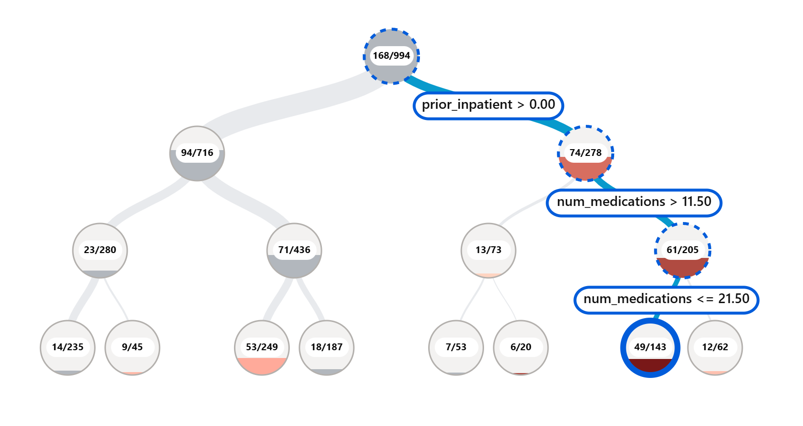
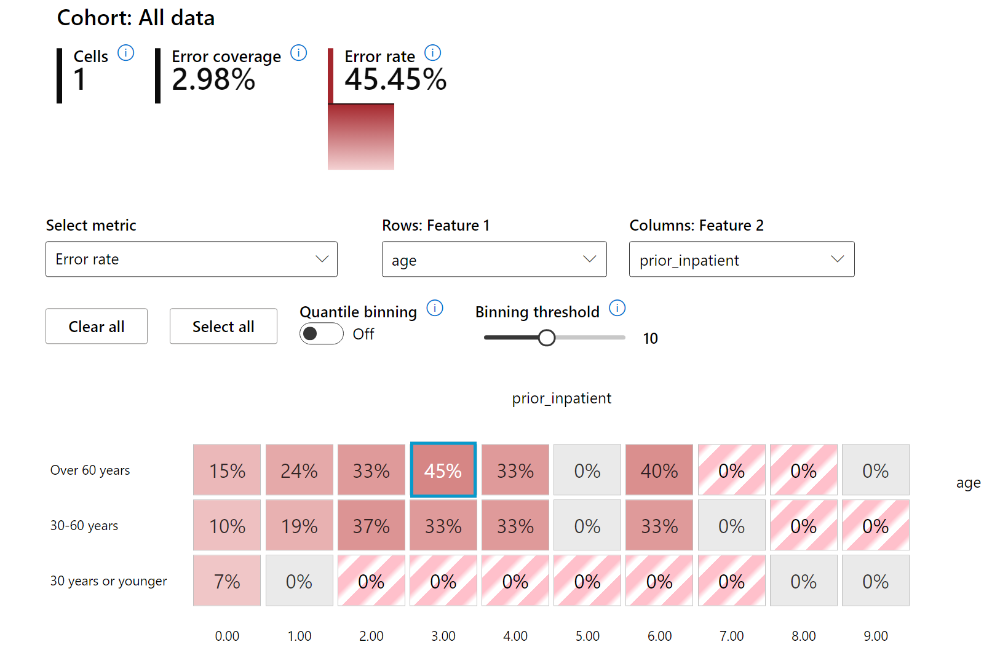
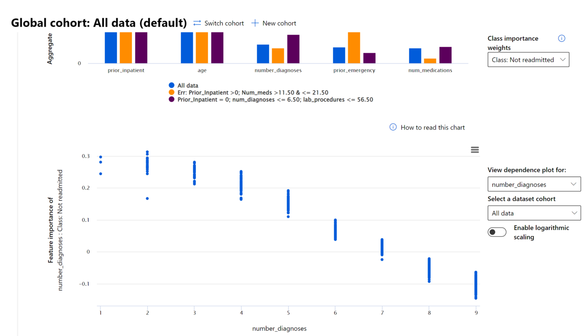

# Postskipt: Maşın öyrənməsində Məsul AI idarə paneli komponentləri ilə model analizi

## [Mühazirədən əvvəl test](https://gray-sand-07a10f403.1.azurestaticapps.net/quiz/5/?loc=az)

## Giriş

Maşın öyrənməsi günlük həyatımıza təsir edir. AI bizə fərd kimi, həmçinin cəmiyyətimizə, səhiyyəyə, maliyyəyə, təhsilə və işimizə təsir edən əsas sistemlərə öz yolunu tapır. Misal olaraq, sistemlər və modellər sağlamlığa dair diaqnozlarda və ya fırıldaqçılığın tapılması kimi gündəlik qərarvermə tapşırıqlarında iştirak edirlər. Nəticə etibarı ilə AI-də olan inkişaf və paralel sürətli adoptasiyaya cavab olaraq cəmiyyətimizin gözləntiləri və genişlənən tənzimləmələr də artır. Biz daim AI sistemlərinin bəzi sahələrdə gözləntiləri ödəmədiyini görürük, yeni çağırışlar yaradır və hökümətlər AI həllərini tənzimləməyə başlayırlar. Buna görə də modellərin analizindən hər kəsə ədalətli, etibarlı, inkluziv, şəffaf və cavabdeh olacağı nəticələr çıxarması vacibdir.

Bu kurikulumda biz məsul AI problemləri olan modelləri praktik hansı alətlərlə yoxlaya biləcəyimizi öyrənəcəyik. Ənənəvi maşın öyrənməsi analizi texnikaları toplanmış dəqiqlik və ya orta xəta itkisi kimi kəmiyyət hesablamalarına əsaslanırlar. Təsəvvür et ki, model qurmaq üçün istifadə etdiyin datada bəzi demoqrafik məlumatlar əksikdir, misal üçün irqi, cinsi, siyasi görüş, dini inanc kimi demoqrafiyaları normalara uyğun paylanmayıb. Modelin nəticəsinin yalnız bəzi demoqrafiyaya uyğun olsa necə olacaq? Bunun nəticəsində modeldə azlıq təşkil edən həssas qruplar üçün ədalətlilik, inklusivlik və ya etibarlılıq problemləri ortaya çıxacaq. Başqa məqam isə budur ki, maşın öyrənməsi modelləri qara qutu kimi hesab olunur, bu onların proqnozlarının nəyə əsaslanıb verdiyini izah etməyi daha da çətinləşdirir. Bunların hamısı data mühəndislərinin və AI developerlərinin modeli analiz etmək, ədalətliliyini və ya etibarlılığını yoxlamaq üçün lazımi alətlərinin olmamasına görə rastlaşdıqları problemlərdir.

Bu dərsdə modelləri aşağıdakı üsullarla analiz etməyi öyrənəcəksən:

-	**Xəta analizi**: data paylanmasının hansı hissəsində modelin daha çox xətası olduğunu aşkar edəcək.
- **Modelə baxış**: modelin performans dəyərlərində bərabərsizliklərini aşkarlamaq üçün datanın müxtəlif seqmentlərində müqayisəli analizlər aparacaq.
- **Data analizi**: modeli korlayan, bir demoqrafiyanı digərindən daha üstün tuta biləcək hallarda datanın hansı hissəsində iştirakın həddindən artıq və ya əksik olduğunu araşdıracaq.
- **Parametr önəmi**: hansı parametlərin modelin qlobal və ya lokal səviyyədə proqnazlarına təsir edəcəyini anlayacaq.

## İlkin tələblər

İlkin tələblərə uyğun olaraq [mühəndislər üçün Məsul AI alətlərini](https://www.microsoft.com/ai/ai-lab-responsible-ai-dashboard) təkrarlayın.

> 

## Xəta analizi

Dəqiqliyi ölçmək üçün istifadə olunan ənənəvi model performans metrikaların əksəriyyəti düzgün və səhv təxminlərin nisbətinin hesablamasına əsaslanır. Misal üçün modelin 89% dəqiqliyə malik olması və eyni zamanda xəta itkisi 0.001-dirsə, bu yaxşı performans sayılır. Xətalar çox vaxt dataset boyunca bərabər paylanmış olmur. Sən modeldə 89% dəqiqlik qiyməti ala bilərsən və eyni zamanda datanın fərqli hissələrində modelin 42% xətalı olduğunu da görə bilərsən. Bəzi data qruplarında olan xəta naxışlarının nəticəsində ədalətlilik və ya etibarlılıq problemləri yarana bilər. Buna görə modelin harada daha yaxşı və pis işlədiyini anlamaq vacibdir. Çox sayda qeyri-dəqiq məlumatlar olan data hissələri modelində vacib data demoqrafiyaya çevrilə bilər.

RAI idarə panelində Xəta analizi komponenti model xətalarının müxtəlif hissələr üzərində necə paylanıldığını ağac sxemi şəklində vizuallaşdırır. Bu hansı parametrin və datasetin hansı hissəsində yuxarı dərəcədə xətaların olduğunu aşkarlamağa köməkçi olur. Modelin qeyri-dəqiqliklərinin haradan gəldiyini görməklə problemin kökünü araşdırmağa başlaya bilərsiniz. Həmçinin data qrupları üzərində də analizlər apara bilərsən. Bu data qrupları araşdırma prosesində modelin performansının bir qrupda yaxşı, lakin digərində xətalı olduğunu bilməyə kömək edə bilər.

Ağac sxemindəki vizual göstəricilər xətanın yerini sürətli təyin etməyə kömək edir. Misal üçün qırmızının daha tünd olduğu düyündə daha çox xəta dərəcəsi var.

İstilik xəritələnməsi başqa bir vizuallaşdırma funksiyasıdır və burada istifadəçilər modelin ümumi və ya data qrupları üzərində xəta dərəcəsini artırmaqda rol oynayan bir və ya iki parametri aşkar edə bilərlər.

Xəta analizini bu hallarda istifadə edin:

* Model xətalarının datasetlər üzərində və fərqli giriş dəyələrləri, parametr ölçülərində dərin anlayış əldə etmək istəyəndə.
* Toplanmış performans metrikasını hissələrə bölməklə xətalı data qruplarınını kəşf etmək və növbəti miqrasiya addımlarından xəbərdar olmaq istəyəndə.

## Modelə baxış

Maşın öyrənmə modelinin performansını dəyərləndirmək üçün onun davranışlarını vahid sistem kimi anlamaq lazımdır. Bunu birdən çox metrikanı analiz etməklə əldə etmək olar, misal üçün xəta dərəcəsi, dəqiqlik, yenidən çağrılma və ya MAE (Orta mütləq xəta) istifadə olunmaqla performans metrikaları arasındakı fərqlilikləri tapmaq olar. Bir performans metrikası əla görünə bilər, lakin qeyri-dəqiqliklər digər metrikada üzə çıxa bilər. Əlavə olaraq bütün datasetin və ya hissələrin üzərində metrikaların fərqliliklərini müqayisə etməklə modelin harada yaxşı və ya pis nəticələr göstərdiyini üzə çıxarmağa kömək edəcək. Bu xüsusi olaraq modelin performansının həssas və ya qeyri-həssas xüsusiyyətlər arasında (misal üçün irq, cins və ya yaş fərqləri) ədalətliliyin pozulma hallarını aşkarlamaq üçün vacibdir. Misal üçün modelin müəyyən data qrupunda həssas xüsusiyyətlərdə daha çox xəta verməsi modelin ədalətsizliyə səbəb olacağını bildirir.

RAI idarə panelinin Modelə baxış komponenti sadəcə data qruplarının performans metrikalarını analiz etməyə kömək etmir, həmçinin istifadəçilərə modelin nəticələrini digər data qrupları arasında da müqayisə etməyə imkan yaradır.

Komponentin parametr üzərində analiz funksionallığı istifadəçilərin bəzi parametrlərdə anomaliyaları aşkar etmək üçün aşağı səviyyəyə kimi alt-qruplara düşməyə imkan verir. Misal üçün idarə panelində istifadəçi tərəfindən seçilmiş parametrə əsasən avtomatik alt-qruplar yaradan məntiqi var (misal üçün *"time_in_hospital < 3"* or *"time_in_hospital >= 7"*). Bu istifadəçinin bəzi parametrləri böyük data qrupundan ayırmağa və modelin xətalı nəticələrinə əsas hansıların təsir etdiyini görməyə imkan yaradır.

Modelə baxış komponenti 2 növ metrikaların fərqlərini dəstəkləyir:

**Model performansında fərqlilik**: Bu qrupa aid metrikalar seçilmiş parametrlərin datanın alt-qrupları arasında fərqlərini hesablayır. Bəzi nümunələr:

* Dəqiqlik dərəcəsində fərq
* Xəta dərəcəsində fərq
* Dəqiqlikdə fərq
* Yenidən çağrılmada fərq
* Orta mütləq xətalarda fərq (MAE)

**Seçilmiş dərəcələrdə fərq**: Bu metrika gözlənilən proqnoz dərəcələrinin alt-qruplar arasında fərqlərini hesablayır. Buna nümunə olaraq kreditlərə təsdiq dərəcələrində fərqləri göstərmək olar. Seçilmiş dərəcə ikili qruplaşdırma tətbiqində 1 kimi qiymətləndirilən data nöqtələrinin tutduğu hissə, reqressiyada isə proqnozlaşdıran dəyərlərinin paylanılması nəzərdə tutulur.

## Data analizi

> "Dataya lazımi qədər işgəncə etsən, o hər şeyi çaşdıracaq" - Ronald Koas

Bu fikir ekstremal səslənsə də, datanın istənilən fikri dəstəkləyə biləcək dərəcədə manipulasiya edilə bilməsi doğrudur. Belə manipulasiyalar bəzən qeyri-ixtiyari olur. İnsan olaraq bizim də bəzi tərəf tutduğumuz məqamlar var və dataya tərəfkeşliyi gətirdiyimizi şüurlu olaraq bilməyimiz çox zaman çətin olur. AI-də və maşın öyrənməsində ədalətliliyin sığortalanması hələ də qəliz problem kimi qalır.

Data ənənəvi model performans metrikaları üçün böyük bir kor nöqtədir. Sən yüksək dəqiqlik qiyməti əldə edə bilərsən, lakin bu sənin datasetinin tərəf tutduğu ehtimalını həmişə əks etdirməyəcək. Misal üçün şirkətdə idarəedici pozisiyada işçilərin 27%-i qadın, 73%-u kişi olan dataseti ilə öyrədilən iş reklamı AI modeli tətbiqdə yuxarı vəzifəli işlər üçün adədən kişiləri hədəfləyəcək. Datakı belə disbalans modelin proqnozlarını bir cinsə tərəf çox yönəldə bilər. Bu AI modelində harada cinsi ayrı-seçkilik problemi olduğunu üzə çıxarır.

RAI idarə panelində Data analizi komponenti datasetin hansı hissəsində həddindən artıq çox və ya az iştirakın olduğunu təyin etməyə kömək edir. Biz istifadəçilərə datanın balans pozuntularından və ya müəyyən data qrupunun az təmsil edilməsinə görə yaranan xəta və ədalətlilik problemlərinin kökündəki səbəbi analiz etməyə kömək edir. Bu, istifadəçilərə proqnozlaşdırılan və həqiqi nəticələr, xəta qrupları və xüsusi parametrlərə əsasən vizualizasiya imkanları verir. Bəzən az təmsil olunan data qrupunun kəşfi modelin yaxşı öyrənmədiyini və nəticədə yüksək qeyri-dəqiqliyin olduğunu üzə çıxarır. Data ayrı-seçkiliyi olan modelə sahib olmaq sadəcə ədalətlilik problemi deyil, həmçinin modelin inkluziv və etibarlı olmadığını da göstərir.

Aşağıdakı hallarda data analizini istifadə et:

* Datasetin statistikasını müxtəlif filtrlər tətbiq edərək fərqli ölçüdə hissələrə bölərək kəşf et (həmçinin data qrupu kimi də tanınır).
* Datasetin müxtəlif qruplarda və parametr qruplarında paylanılmasını başa düş.
* Ədalətlilik, xəta analizi və səbəbiyyət (başqa idarə paneli komponentindən əldə olunur) ilə bağlı tapıntılarının datasetin paylanılması ilə əlaqəli olduğunu təyin et.
* Təmsiletmə, etiket, parametr problemlərindən, etiket ayrı-seçkiliyindən və oxşar faktorlardan əmələ gələn xətaları azaltmaq üçün hansı sahədə daha çox data yığmalı olduğuna qərar ver.

## Modelin şərh edilməsi

Maşın öyrənmə modelləri qara qutulara bənzəyirlər. Hansı açar data parametri modelin proqnozlarını idarə etdiyini başa düşmək çətindir. Modelin verdiyi proqnozların səbəbinin şəffaflığını təmin etmək vacibdir. Məsələn, əgər AI sistemi diabet xəstəsinin 30 gündən daha tez xəstəxanaya yenidən qayıdacağını təxmin edirsə, bunun hansı datalara əsasən proqnozlaşdırdığını təmin etməlidir. Dəstəkləyici data göstəriciləri xəstəxana işçilərinə və xəstəxanalara daha şüurlu qərarlar verməsi üçün şəffaflıq gətirir. Əlavə olaraq modelin fərdi xəstəyə verdiyi proqnozu izah edə bilməsi həmçinin səhiyyə qaydalarına cavabdehliyini də mümkün edir. Sən insanların həyatına təsir edəcək maşın öyrənməsi modelləri istifadə edirsənsə, modelin qərarlarına təsir edən amilləri başa düşməyin və izah edə bilməyin vacibdir. Modelin izah olunması və şərh edilə bilməsi aşağıdakı ssenarilərdə suallara cavab verməyə kömək edir:

* Model analizi: Mənim modelim niyə belə səhv etdi? Modelimi necə təkmilləşdirə bilərəm?
* İnsan-AI əməkdaşlığı: Modelin qərarlarını necə anlaya və güvənə bilərəm?
* Qaydalara uyğunluq: Modelim qanunlarını tələblərini ödəyirmi?

RAI idarə panelinin Parametr vacibliyi komponenti modelin proqnozlarını necə etdiyini analiz etməyə və dərindən anlamağa kömək edir. Bu alət həmçinin maşın öyrənməsi peşəkarlarına və qərar verənlərə modelin davranışlarının qanunlara uyğunluğunu göstərmək üçün hansı parametrlərin təsir etdiyini izah və isbat etməyə kömək edir. Əlavə olaraq, istifadəçilər hansı parametlərin modelin proqnozlarına təsir etdiyini həm qlobal, həm də local izahlarla araşdıra bilərlər. Qlobal izahlar modelin ümumi proqnozlarına təsir edən baş parametrləri siyahı kimi verir. Local izahlar isə modelin fərdi hallarda proqnozlarına səbəb olan parametləri göstərir. Local izahları araşdırmaq imkanı xüsusi hallarda modelin dəqiq və ya qeyri-dəqiq proqnozlarının səbəbini analiz etmək, daha yaxşı başa düşmək və şərh etmək üçün də faydalıdır.

* Qlobal izahlar: Məsələn, hansı parametlər diabet xəstələrinin xəstəxanaya geri qayıdış modelinin ümumi davranışına təsir edir?
* Local izahlar: Məsələn, xəstəxanaya düşmüş 60 yaşdan yuxarı diabet xəstəsi növbəti 30 gün ərzində yenidən xəstəxanaya geri qaydıdıb-qayıtmayacağını proqnozu nəyə əsasən verilir?

Modelin müxtəlif data qrupları üzərində performans yoxlamasının analiz prosesində Parametr vacibliyi komponenti qruplar üzərində parametrlərin hansı dərəcədə təsiri olduğunu göstərir. Bu, modelin xətalı proqnozlarına səbəb olan parametrin təsir səviyyəsini müqayisə etməklə anomaliyaları aşkar etməyə kömək edir. Parametr vacibliyi komponenti parametrin hansı dəyərinin modelin nəticəsinə müsbət və ya mənfi təsiri olduğunu göstərə bilir. Məsələn, əgər model qeyri-dəqiq proqnoz verirsə, koponent sənə hansı parametrin və ya parametrin hansı dəyərinin proqnoza təsir etdiyini tapmaq üçün dərinə enməyə imkan yaradır. Bu səviyyədə məlumat sadəcə analiz etməyə kömək etmir, həmçinin audit hallarında şəffaflıq və cavabdehliyi də təmin edir. Son olaraq komponent sənə ədalətlilik problemlərini müəyyən etməyə də kömək edə bilər. Fərz edək ki, əgər etnik və ya cins kimi həssas parametr modelin proqnozunda çox təsir qüvvəsi varsa, bu modeldə irqi və cinsi ayrı-seçkiliyin ola bilməsinə dair bir işarədir.

Şərh edilməni bu hallarda istifadə et:

* Hansı parametrlərin proqnozlar üçün daha vacib olduğunu başa düşərək AI sistemin proqnozlarının nə qədər güvənli olduğuna əmin ol.
* Modelini analiz etmək üçün ilk olaraq onu başa düşməyə çalış və modelin sağlam parameteləri istifadə etdiyini və cüzi yanlış korrelasiya verdiyini təyin et.
* Modelin həssas və ya onunla çox korrelasiya olan parametrlər üzərində ayrı-seçkilik etdiyini anlamaqla mümkün qeyri-ədalətliliyin mənbəsini üzə çıxar.
* Modelin lokal izahlarını yaradaraq və nəticələri vizuallaşdıraraq istifadəçinin güvənini qazan.
* Modelləri təsdiqləyərək və qərarlarının insanlar üzərində təsirini izləyərək AI sistemlər üzərində tənzimləyici audit işlərini icra et.

## Nəticə

RAI idarə panelinin bütün komponentlərin hamısı sənə cəmiyyət üçün az zərərli və daha güvənli maşın öyrətməsi modeli yaratmağa kömək edəcək praktik alətlərdir. Bu, diskriminasiya və ya müəyyən qrupları fürsətlərdən kənarlaşdırmaq, fiziki və psixoloji zərər kimi insan haqqlarına qarşı olan təhdidlərin qarşısını almağa kömək edəcək. Bu həmçinin sənin modelinə olan güvəni qərarlarını lokal izahlar yaratmaqla və nəticələri vizuallaşdırmaqla kömək edəcək. Mümkün ola biləcək ziyanları belə təsnifləşdirilə bilər:

- **Yerləşdirmə**, müəyyən cinsin və ya irqin digəri üzərində daha çox seçilməsi.
- **Xidmət keyfiyyəti**. Əgər bir ssenariyə uyğun data ilə öyrətmə etsən, bu reallıqda daha qəliz vəziyyətlərdə zəif xidmət göstərməyə gətirib çıxaracaq.
- **Stereotiplər**. Bəzi qrupları əvvəldən təyin olunmuş parametrlərlə əlaqələndirmək.
- **Böhtan**. Ədalətsiz şəkildə nəyisə və ya kimisə etiketləmək və mühakimə etmək.
- **Çox- və ya az- təmsil**. İdeya budur ki, bəzi qrupların bəzi peşələrdə, xidmətlərdə və ya funksiyalarda görülməməsi onların əleyhinə qərarlara dəstək verir.

### Azure RAI idarə paneli

[Azure RAI idarə paneli](https://learn.microsoft.com/en-us/azure/machine-learning/concept-responsible-ai-dashboard?WT.mc_id=aiml-90525-ruyakubu) data və AI mühəndislərinin modelin davranışlarını daha yaxşı başa düşməyə, kəşf etməyə və AI modellərinin arzuolunmaz xətalarının qarşısını almaq üçün aparıcı akademik institutlar və Microsoft kimi təşkilatlar tərəfindən hazırlanmış açıq mənbə alətləri üzərində qurulub.

- RAI idarə panelində müxtəlif komponentləri necə istifadə edə biləcəyini [bu sənədlərdən](https://learn.microsoft.com/en-us/azure/machine-learning/how-to-responsible-ai-dashboard?WT.mc_id=aiml-90525-ruyakubu) öyrən.

- RAI idarə panelində Azure Maşın öyrənməsi ilə daha çox məsul AI ssenarilərini analiz etmək üçün [nümunə notbukları](https://github.com/Azure/RAI-vNext-Preview/tree/main/examples/notebooks) yoxla.

---
## 🚀 Məşğələ

Statistik və data ayrı-seçkiliyinin qarşısını almaq üçün biz ilk növbətə bunları etməliyik:

- sistemlərdə işləyən insanlar arasında müxtəlif təcrübələrə və perspektivlərə malik olmaq
- bizim cəmiyyətimizin fərqliliklərini əks etdirən datasetlərə sərmayə qoymaq
- ayrı-seçkiliyin baş verdiyi yerləri təyin etməyə və düzəltməyə daha yaxşı üsullar inkişaf etdirmək

Model yaradılmasında ədalətsizliyin aşkar olduğu və istidadə olunduğu real həyat ssenariləri barədə düşün. Biz başqa nələri nəzərə almalıyıq?

## [Mühazirə sonrası test](https://gray-sand-07a10f403.1.azurestaticapps.net/quiz/6/?loc=az)

## Təkrarlayın və özünüz öyrənin

Bu dərsdə sən maşın öyrənməsində məsul AI ilə birlikdə istifadə oluna biləcək praktik alətləri öyrəndin.

Aşağıdakı məşğələlərə baxaraq mözvuları daha dərindən mənimsə:

- Məsul AI idarə paneli: RAI-ni praktikada istifadə etmək üçün vahid pəncərə, Besmira Nuşi və Mehrnuş Sameki tərəfindən.

> 🎥 Video üçün yuxarıdakı şəkilə klikləyin: Məsul AI idarə paneli: RAI-ni praktikada istifadə etmək üçün vahid pəncərə, Besmira Nuşi və Mehrnuş Sameki tərəfindən.

Aşağıdakı materiallara istinad edərək məsul AI və daha güvənli modelləri necə qura biləcəyin barədə öyrən:

- ML modellərini analiz etmək üçün Microsoft-un RAI idarə panel alətləri: [Məsul AI alətləri resursu](https://aka.ms/rai-dashboard)

- Məsul AI alətlərini araşdır: [Github](https://github.com/microsoft/responsible-ai-toolbox)

- Microsoft-un RAI resurs mərkəzi: [Məsul AI resursləri – Microsoft AI](https://www.microsoft.com/ai/responsible-ai-resources?activetab=pivot1%3aprimaryr4)

- Microsoft-un RAI resurs mərkəzi: [Məsul AI resursları – Microsoft AI](https://www.microsoft.com/ai/responsible-ai-resources?activetab=pivot1%3aprimaryr4)

- Microsoft-un FATE araşdırma qrupu: [FATE: AI-da Ədalətlilik, Cavabdehlik, Şəffaflıq, və Etika - Microsoft Research](https://www.microsoft.com/research/theme/fate/)

## Tapşırıq

[RAI idarə panelini kəşf et](assignment.az.md)
