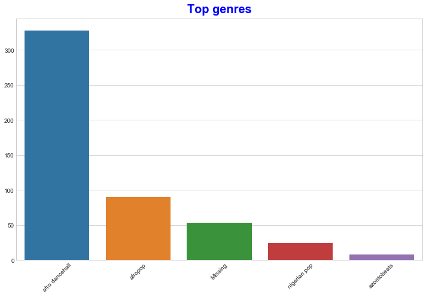

# Introduction to Clustering

[](https://youtu.be/ty2advRiWJM "No One Like You by PSquare")

> While you're studying Machine Learning with Clustering, enjoy some Nigerian Dance Hall tracks - this is a highly rated song from 2014 by PSquare.
## [Pre-lecture quiz](link-to-quiz-app)
### Introduction

Clustering is a type of unsupervised learning that presumes that a dataset is unlabelled. It uses various algorithms to sort through unlabeled data and provide groupings according to patterns it discerns in the data. Clustering is very useful for data exploration. Let's see if it can help discover trends and patterns in the way Nigerian audiences consume music.

✅ Take a minute to think about the uses of clustering. In real life, clustering happens whenever you have a pile of laundry and need to sort out your family members' clothes 🧦👕👖🩲. In data science, clustering happens when trying to analyze a user's preferences, or determine the characteristics of any unlabeled dataset. Clustering, in a way, helps make sense of chaos.

In real life, clustering can be used to determine things like market segmentation, determining what age groups buy what items, for example. Another use would be anomaly detection, perhaps to detect fraud from a dataset of credit card transactions. Or you might use clustering to determine tumors in a batch of medical scans. Alternately, you could use it for grouping search results - by shopping links, images, or reviews, for example. Clustering is useful when you have a large dataset that you want to reduce and on which you want to perform more granular analysis, so the technique can be used to learn about data before other models are constructed.

✅ Once your data is organized in clusters, you assign it a cluster Id, and this technique can be useful when preserving a dataset's privacy; you can instead refer to a data point by its cluster id, rather than by more revealing identifiable data. Can you think of other reasons why you'd refer to a cluster Id rather than other elements of the cluster to identify it?
## Getting started with clustering

[Scikit-Learn offers a large array](https://scikit-learn.org/stable/modules/clustering.html) of methods to perform clustering. The type you choose will depend on your use case. According to the documentation, each method has various benefits. Here is a simplified table of the methods supported by Scikit-Learn and their appropriate use cases:

| Method name                  | Use case                                                               |
| :--------------------------- | :--------------------------------------------------------------------- |
| K-Means                      | general purpose, inductive                                             |
| Affinity propagation         | many, uneven clusters, inductive                                       |
| Mean-shift                   | many, uneven clusters, inductive                                       |
| Spectral clustering          | few, even clusters, transductive                                       |
| Ward hierarchical clustering | many, constrained clusters, transductive                               |
| Agglomerative clustering     | many, constrained, non Euclidean distances, transductive               |
| DBSCAN                       | non-flat geometry, uneven clusters, transductive                       |
| OPTICS                       | non-flat geometry, uneven clusters with variable density, transductive |
| Gaussian mixtures            | flat geometry, inductive                                               |
| BIRCH                        | large dataset with outliers, inductive                                 |

> 🎓 How we create clusters has a lot to do with how we gather up the data points into groups. Let's unpack some vocabulary:
>
> 🎓 ['Transductive' vs. 'inductive'](https://wikipedia.org/wiki/Transduction_(machine_learning))
> Transductive inference is derived from observed training cases that map to specific test cases. Inductive inference is derived from training cases that map to general rules which are only then applied to test cases.
> 
> 🎓 ['Non-flat' vs. 'flat' geometry](https://datascience.stackexchange.com/questions/52260/terminology-flat-geometry-in-the-context-of-clustering)
> Derived from mathematical terminology, non-flat vs. flat geometry refers to the measure of distances between points by either 'flat' (non-[Euclidean](https://wikipedia.org/wiki/Euclidean_geometry)) or 'non-flat' (Euclidean) geometrical methods. 
> 
> 🎓 ['Distances'](https://web.stanford.edu/class/cs345a/slides/12-clustering.pdf)
> Clusters are defined by their distance matrix, e.g. the distances between points. This distance can be measured a few ways. Euclidean clusters are defined by the average of the point values, and contain a 'centroid' or center point. Distances are thus measured by the distance to that centroid. Non-Euclidean distances refer to 'clustroids', the point closest to other points. Clustroids in turn can be defined in various ways.
> 
> 🎓 ['Constrained'](https://wikipedia.org/wiki/Constrained_clustering)
> Constrained Clustering introduces 'semi-supervised' learning into this unsupervised method. The relationships between points are flagged as 'cannot link' or 'must-link' so some rules are forced on the dataset.
> 
> 🎓 'Density'
> Data that is 'noisy' is considered to be 'dense'. The distances between points in each of its clusters may prove, on examination, to be more or less dense, or 'crowded' and thus this data needs to be analyzed with the appropriate clustering method. [This article](https://www.kdnuggets.com/2020/02/understanding-density-based-clustering.html) demonstrates the difference between using K-Means clustering vs. HDBSCAN algorithms to explore a noisy dataset with uneven cluster density.
### Preparation

Clustering is heavily dependent on visualization, so let's get started.

Open the notebook.ipynb file in this folder and append the song data .csv file. Load up a dataframe with some data about the songs. Get ready to explore this data by importing the libraries and dumping out the data:

```python
import matplotlib.pyplot as plt
import pandas as pd

df = pd.read_csv("../data/nigerian-songs.csv")
df.head()
```

|     | name                     | album                        | artist              | artist_top_genre | release_date | length | popularity | danceability | acousticness | energy | instrumentalness | liveness | loudness | speechiness | tempo   | time_signature |
| --- | ------------------------ | ---------------------------- | ------------------- | ---------------- | ------------ | ------ | ---------- | ------------ | ------------ | ------ | ---------------- | -------- | -------- | ----------- | ------- | -------------- |
| 0   | Sparky                   | Mandy & The Jungle           | Cruel Santino       | alternative r&b  | 2019         | 144000 | 48         | 0.666        | 0.851        | 0.42   | 0.534            | 0.11     | -6.699   | 0.0829      | 133.015 | 5              |
| 1   | shuga rush               | EVERYTHING YOU HEARD IS TRUE | Odunsi (The Engine) | afropop          | 2020         | 89488  | 30         | 0.71         | 0.0822       | 0.683  | 0.000169         | 0.101    | -5.64    | 0.36        | 129.993 | 3              |
| 2   | LITT!                    | LITT!                        | AYLØ                | indie r&b        | 2018         | 207758 | 40         | 0.836        | 0.272        | 0.564  | 0.000537         | 0.11     | -7.127   | 0.0424      | 130.005 | 4              |
| 3   | Confident / Feeling Cool | Enjoy Your Life              | Lady Donli          | nigerian pop     | 2019         | 175135 | 14         | 0.894        | 0.798        | 0.611  | 0.000187         | 0.0964   | -4.961   | 0.113       | 111.087 | 4              |
| 4   | wanted you               | rare.                        | Odunsi (The Engine) | afropop          | 2018         | 152049 | 25         | 0.702        | 0.116        | 0.833  | 0.91             | 0.348    | -6.044   | 0.0447      | 105.115 | 4              |


Check the first few lines of data:

Get some information about the dataframe:

```python
df.info()
```

<class 'pandas.core.frame.DataFrame'>
RangeIndex: 530 entries, 0 to 529
Data columns (total 16 columns):
 #   Column            Non-Null Count  Dtype  
---  ------            --------------  -----  
 0   name              530 non-null    object 
 1   album             530 non-null    object 
 2   artist            530 non-null    object 
 3   artist_top_genre  530 non-null    object 
 4   release_date      530 non-null    int64  
 5   length            530 non-null    int64  
 6   popularity        530 non-null    int64  
 7   danceability      530 non-null    float64
 8   acousticness      530 non-null    float64
 9   energy            530 non-null    float64
 10  instrumentalness  530 non-null    float64
 11  liveness          530 non-null    float64
 12  loudness          530 non-null    float64
 13  speechiness       530 non-null    float64
 14  tempo             530 non-null    float64
 15  time_signature    530 non-null    int64  
dtypes: float64(8), int64(4), object(4)
memory usage: 66.4+ KB

It's useful that this data is mostly numeric, so it's almost ready for clustering.

Check for null values:

```python
df.isnull().sum()
```

Looking good:

name                0
album               0
artist              0
artist_top_genre    0
release_date        0
length              0
popularity          0
danceability        0
acousticness        0
energy              0
instrumentalness    0
liveness            0
loudness            0
speechiness         0
tempo               0
time_signature      0
dtype: int64

Describe the data:

```python
df.describe()
```

|       | release_date | length      | popularity | danceability | acousticness | energy   | instrumentalness | liveness | loudness  | speechiness | tempo      | time_signature |
| ----- | ------------ | ----------- | ---------- | ------------ | ------------ | -------- | ---------------- | -------- | --------- | ----------- | ---------- | -------------- |
| count | 530          | 530         | 530        | 530          | 530          | 530      | 530              | 530      | 530       | 530         | 530        | 530            |
| mean  | 2015.390566  | 222298.1698 | 17.507547  | 0.741619     | 0.265412     | 0.760623 | 0.016305         | 0.147308 | -4.953011 | 0.130748    | 116.487864 | 3.986792       |
| std   | 3.131688     | 39696.82226 | 18.992212  | 0.117522     | 0.208342     | 0.148533 | 0.090321         | 0.123588 | 2.464186  | 0.092939    | 23.518601  | 0.333701       |
| min   | 1998         | 89488       | 0          | 0.255        | 0.000665     | 0.111    | 0                | 0.0283   | -19.362   | 0.0278      | 61.695     | 3              |
| 25%   | 2014         | 199305      | 0          | 0.681        | 0.089525     | 0.669    | 0                | 0.07565  | -6.29875  | 0.0591      | 102.96125  | 4              |
| 50%   | 2016         | 218509      | 13         | 0.761        | 0.2205       | 0.7845   | 0.000004         | 0.1035   | -4.5585   | 0.09795     | 112.7145   | 4              |
| 75%   | 2017         | 242098.5    | 31         | 0.8295       | 0.403        | 0.87575  | 0.000234         | 0.164    | -3.331    | 0.177       | 125.03925  | 4              |
| max   | 2020         | 511738      | 73         | 0.966        | 0.954        | 0.995    | 0.91             | 0.811    | 0.582     | 0.514       | 206.007    | 5              |

## Visualize the data

Now, find out the most popular music genre using a barplot:

```python
top = df['artist_top_genre'].value_counts()
plt.figure(figsize=(10,7))
sns.barplot(x=top[:5].index,y=top[:5].values)
plt.xticks(rotation=45)
plt.title('Top genres',color = 'blue')
```


✅ If you'd like to see more top values, change this `[:5]` to a bigger value, or remove it to see all. It's interesting that one of the top genres is called 'Missing'!

Explore the data by checking the most popular genre:


## 🚀Challenge


## [Post-lecture quiz](link-to-quiz-app)

## Review & Self Study

Take a look at Stanford's K-Means Simulator [here](https://stanford.edu/class/engr108/visualizations/kmeans/kmeans.html). You can use this tool to visualize sample data points and determine its centroids. With fresh data, click 'update' to see how long it takes to find convergence. You can edit the data's randomness, numbers of clusters and numbers of centroids. Does this help you get an idea of how the data can be grouped?

**Assignment**: [Assignment Name](assignment.md)
