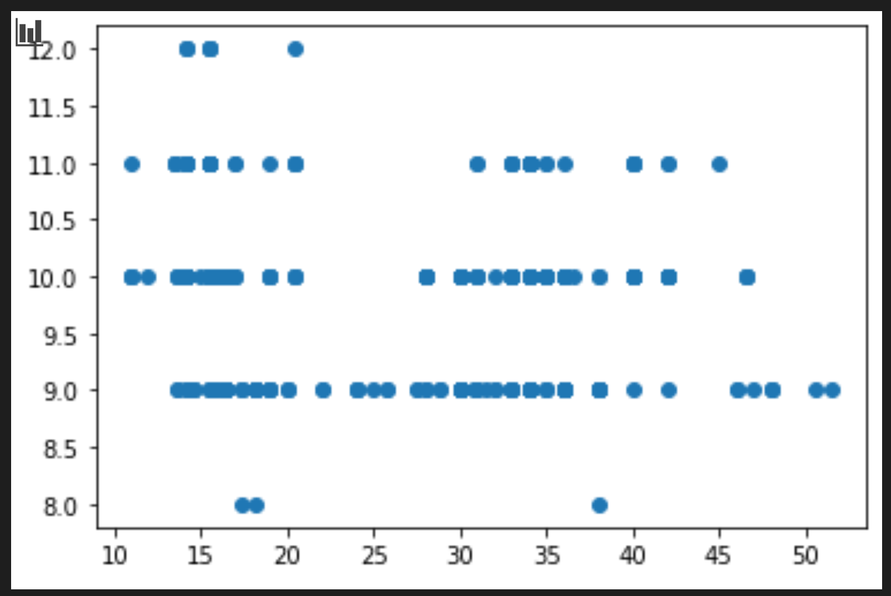

# Construindo um modelo de regressão usando Scikit-learn: preparar e visualizar dados


Infográfico por [Dasani Madipalli](https://twitter.com/dasani_decoded)

## [Questionário inicial](https://gray-sand-07a10f403.1.azurestaticapps.net/quiz/11?loc=ptbr)

> ### [Esta liçao está disponível em R!](../solution/R/lesson_2-R.ipynb)

## Introdução

Agora que você configurou as ferramentas que precisa para começar a construir modelos de _machine learning_ com o Scikit-learn, vamos fazer perguntas sobre seus dados. Conforme você trabalha com dados e aplica soluções de ML, é muito importante entender como fazer a pergunta certa para obter o melhor de seu conjunto de dados.

Nesta lição, você irá aprender a:

- Como preparar os dados para a construção do modelo.
- Como usar matplotlib para visualização de dados.

[](https://youtu.be/11AnOn_OAcE "Preparando e Visualizando dados - Clique para assistir!")
> 🎥 Clique na imagem acima para assistir a um vídeo sobre os principais aspectos desta lição (vídeo em inglês).


## Fazendo a pergunta correta a seus dados

A pergunta que você precisa responder determinará que tipo de algoritmos de ML você usará. E a qualidade da resposta que você receber dependerá muito da natureza dos seus dados.

Dê uma olhada [nesses dados](../../data/US-pumpkins.csv). Você pode abrir este arquivo .csv no VS Code. Uma rápida leitura mostra imediatamente que existem espaços em branco e uma mistura de strings e dados numéricos. Há também uma coluna estranha chamada `Package` onde os dados são uma mistura entre 'sacks' (sacos), 'bins' (caixas) e outros valores. Esses dados estão uma bagunça.

A verdade é que raramente somos apresentados a um conjunto de dados que pode ser usado diretamente para criar um modelo de ML. Nesta lição, você aprenderá como preparar um conjunto de dados "bruto" usando bibliotecas Python. Você também aprenderá várias técnicas para visualizar os dados.

## Caso de estudo: 'o mercado de abóboras'

Na pasta `data`, na raiz do projeto, você encontrará um arquivo .csv chamado [US-pumpkins.csv](../../data/US-pumpkins.csv) que inclui 1757 linhas de dados sobre o mercado de abóboras, classificados em agrupamentos por cidade. Estes são dados brutos extraídos dos [Specialty Crops Terminal Markets Standard Reports](https://www.marketnews.usda.gov/mnp/fv-report-config-step1?type=termPrice) (Relatórios Padrão de Mercados Terminais para Cultivos Especiais) distribuído pelo Departamento de Agricultura dos Estados Unidos.

### Preparando os dados

Esses dados são abertos ao público. Podem ser baixados em arquivos separados, por cidade, no site do USDA. Para evitar muitos arquivos separados, concatenamos todos os dados da cidade em uma planilha, feito isso, já _preparamos_ os dados um pouco. Agora vamos examinar mais de perto os dados.

### Dados das abóboras - conclusões inciais

O que você acha desses dados? Você já viu que existe uma mistura de strings, números, espaços em branco e valores estranhos?

Que pergunta você pode fazer sobre esses dados, usando uma técnica de regressão? Que tal "Como prever o preço de uma abóbora à venda durante um determinado mês"?. Olhando novamente para os dados, existem algumas mudanças que você precisa fazer para criar a estrutura de dados necessária para a tarefa.

## Exercício - Análise dos dados das abóboras

Vamos usar o [Pandas](https://pandas.pydata.org/), (que significa `Python Data Analysis`) uma ferramenta útil para moldar, analizar e preparar dados.

### Primeiro, procuramos datas faltantes

Você precisará seguir alguns passos para procurar por datas faltantes:

1. Converta as datas para um formato mensal (as datas estão no formato dos EUA, ou seja, `MM/DD/AAAA`).
2. Transforme o mês numa nova coluna.

Abra o arquivo _notebook.ipynb_ no Visual Studio Code e importe a planilha no formato de um _dataframe_ Pandas.

1. Use a função `head()` para visualizar as cinco primeiras linhas.

    ```python
    import pandas as pd
    pumpkins = pd.read_csv('../data/US-pumpkins.csv')
    pumpkins.head()
    ```

    ✅ Qual função você usaria para visualizar as últimas cinco linhas?

1. Veja se existe datas faltantes no _dataframe_ atual:

    ```python
    pumpkins.isnull().sum()
    ```

    Alguns dados estão faltando, mas talvez não sejam necessários para esta tarefa.

1. Para tornar seu _dataframe_ mais fácil de usar, remova algumas das colunas usando a função `drop()`, mantendo apenas as colunas que você precisa:

    ```python
    new_columns = ['Package', 'Month', 'Low Price', 'High Price', 'Date']
    pumpkins = pumpkins.drop([c for c in pumpkins.columns if c not in new_columns], axis=1)
    ```

### Segundo, calcule o preço médio das abóboras

Pense em como determinar o preço médio de uma abóbora em um determinado mês. Quais colunas você escolheria para esta tarefa? Dica: você precisará de 3 colunas.

Solução: pegue a média das colunas `Low Price` (Preço baixo) e `High Price` (Preço alto) para preencher a nova coluna `Price` (Preço) e converta a coluna `Date` (Data) para mostrar apenas o mês. Felizmente, de acordo com a verificação acima, não faltam dados de datas ou preços.

1. Pra calcular a média, adicione o seguinte código:

    ```python
    price = (pumpkins['Low Price'] + pumpkins['High Price']) / 2

    month = pd.DatetimeIndex(pumpkins['Date']).month

    ```

   ✅ Sinta-se a vontade para imprimir qualquer dado usando `print(nome da variável aqui)`.

2. Agora, copie sua data convertida em um _dataframe_ Pandas novinho em folha:

    ```python
    new_pumpkins = pd.DataFrame({'Month': month, 'Package': pumpkins['Package'], 'Low Price': pumpkins['Low Price'],'High Price': pumpkins['High Price'], 'Price': price})
    ```

    Ao imprimir seu _dataframe_, você verá um conjunto de dados limpo e organizado para criar seu modelo de regressão.

### Mas espere! Parece que tem algo estranho 🤔

Se você olhar a coluna `Package` (Pacote), as abóboras são vendidas em muitas configurações diferentes. Algumas são vendidas em medidas de '1 1/9 bushel' (bushel é uma unidade de medida, equivalente à "alqueire"), e algumas de '1/2 bushel', algumas por abóbora, algumas por libra (unidade de medida) e algumas em grandes caixas de larguras variadas.

> Parece que é difícil pesar a abóbora de uma forma consistente.

Analisando os dados originais, é interessante observar que qualquer coisa com `Unit of Sale` (Unidade de Venda) igual a 'EACH' ou 'PER BIN' também tem o tipo `Package` com "per inch" (por polegada), "per bin" (por caixa) ou "each" (ambos). Como as abóboras são difíceis de pesar de forma consistente, vamos filtrá-las selecionando apenas as abóboras com a string "bushel" em sua coluna `Package`.

1. Adicione um filtro na parte superior do arquivo, abaixo da importação inicial do .csv:

    ```python
    pumpkins = pumpkins[pumpkins['Package'].str.contains('bushel', case=True, regex=True)]
    ```

    Se você imprimir os dados agora, verá que retorna cerca de 415 contendo dados de abóboras por bushel.

### Opa! Mais uma coisa...

Você notou que a quantidade de bushel varia por linha? Você precisa normalizar o preço para mostrar o preço por bushel.

1. Adicione essas linhas após o bloco criando o _dataframe_ `new_pumpkins`:

    ```python
    new_pumpkins.loc[new_pumpkins['Package'].str.contains('1 1/9'), 'Price'] = price/(1 + 1/9)

    new_pumpkins.loc[new_pumpkins['Package'].str.contains('1/2'), 'Price'] = price/(1/2)
    ```

✅ De acordo com [The Spruce Eats](https://www.thespruceeats.com/how-much-is-a-bushel-1389308), o peso por bushel depende do tipo de produto, pois é uma medida de volume. "Um bushel de tomates, por exemplo, deve pesar 56 libras (25,4 kg).. Folhas e verduras ocupam mais espaço com menos peso, então um bushel de espinafre pesa apenas 20 libras (9,1 kg)." (fala traduzida). É muito complicado! Não vamos nos preocupar em fazer uma conversão de bushel para libra e, em vez disso, definir o preço por bushel. Perceba que todo esse estudo de bushels de abóboras mostra como é muito importante entender a natureza de seus dados!

Você pode analisar o preço por unidade com base na medição do bushel. Se você imprimir os dados mais uma vez, verá como eles estão padronizados.

✅ Você notou que as abóboras vendidas a meio bushel são muito caras? Você pode descobrir por quê? Dica: as abóboras pequenas são muito mais caras do que as grandes, provavelmente porque há muito mais delas por bushel, especialmente considerando que uma abóbora grande tem uma grande cavidade vazia.

## Estratégias de visualização

Parte da função do _data scientist_ é demonstrar a qualidade e a natureza dos dados com os quais está trabalhando. Para fazer isso, eles geralmente criam visualizações, ou plotagens, gráficos e tabelas, mostrando diferentes aspectos dos dados. Dessa forma, eles são capazes de mostrar visualmente relações e lacunas que, de outra forma, seriam difíceis de descobrir.

As visualizações também podem ajudar a determinar a técnica de _machine learning_ mais adequada para os dados. Um gráfico de dispersão que parece seguir uma linha, por exemplo, indica que os dados são bons candidatos para um exercício de regressão linear.

Uma biblioteca de visualização de dados que funciona bem nos blocos de _notebooks_ é a [Matplotlib](https://matplotlib.org/) (que você também viu na lição anterior).

> Ganhe mais experiência em visualização de dados fazendo [esses tutoriais](https://docs.microsoft.com/learn/modules/explore-analyze-data-with-python?WT.mc_id=academic-77952-leestott).

## Exercício - Experimento com Matplotlib

Tente criar alguns gráficos básicos para exibir o novo _dataframe_ que você acabou de criar. O que um gráfico de linha básico mostraria?

1. Importe a Matplotlib no início do arquivo, embaixo da importação do pandas:

    ```python
    import matplotlib.pyplot as plt
    ```

1. Execute o _notebook_ inteiro para atualizá-lo.
1. No final do _notebook_, adicione uma célula para plotar os dados:

    ```python
    price = new_pumpkins.Price
    month = new_pumpkins.Month
    plt.scatter(price, month)
    plt.show()
    ```

    

    Esse gráfico é relevante? Alguma coisa nele te surpreende?

    O gráfico não é útil, pois tudo o que faz é exibir seus dados como uma distribuição de pontos em um determinado mês.

### Torne o gráfico útil

Para fazer com que os gráficos exibam dados úteis, você precisa agrupar os dados de alguma forma. Vamos tentar criar um gráfico onde o eixo "y" mostra os meses e o eixo "x" mostra a distribuição dos preços das abóboras.

1. Adicione uma célula de código para criar um gráfico de barras:

    ```python
    new_pumpkins.groupby(['Month'])['Price'].mean().plot(kind='bar')
    plt.ylabel("Pumpkin Price")
    ```

    

    Essa visualização de dados parece ser mais útil! Parece indicar que o preço mais alto das abóboras ocorre em setembro e outubro. Isso atende às suas expectativas? Por quê ou por quê não?

---

## 🚀Desafio

Explore os diferentes tipos de visualização que o Matplotlib oferece. Quais tipos são mais adequados para problemas de regressão?

## [Questionário para fixação](https://gray-sand-07a10f403.1.azurestaticapps.net/quiz/12?loc=ptbr)

## Revisão e Auto Aprendizagem

Dê uma olhada nas maneiras de visualizar dados. Faça uma lista das várias bibliotecas disponíveis e observe quais são as melhores para determinados tipos de tarefas, por exemplo, visualizações 2D vs. visualizações 3D. O que você descobriu?

## Tarefa

[Explorando visualização](assignment.pt-br.md).
