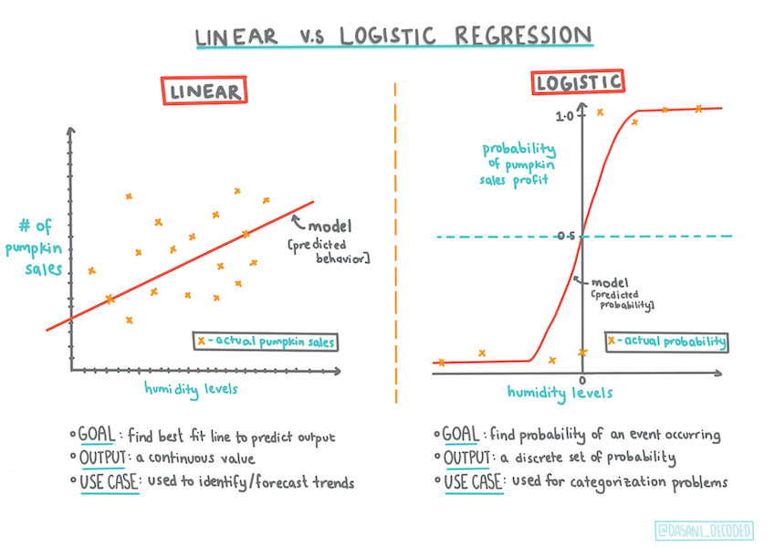
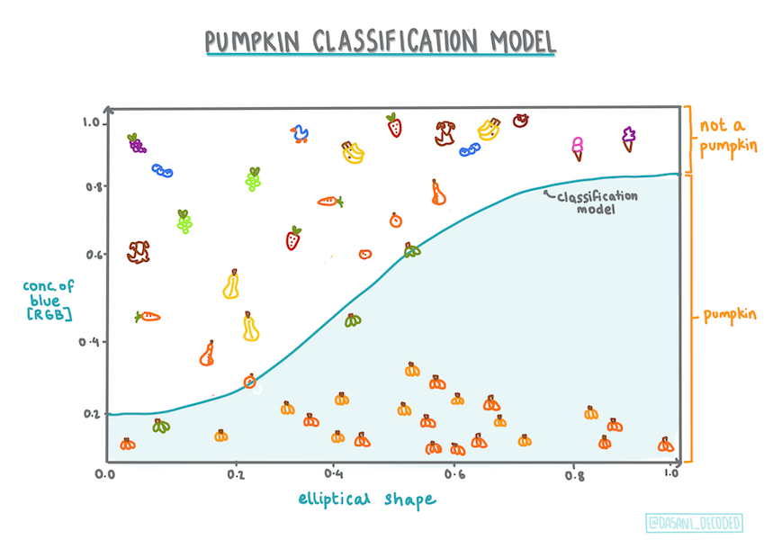
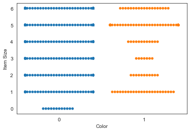

# Regressão logística para prever categorias


> Infográfico por [Dasani Madipalli](https://twitter.com/dasani_decoded)
## [Questionário inicial](https://gray-sand-07a10f403.1.azurestaticapps.net/quiz/15?loc=ptbr)

> ### [Esta liçao está disponível em R!](../solution/R/lesson_4-R.ipynb)

## Introdução

Nesta lição final sobre Regressão, uma das técnicas básicas do ML _clássico_, vamos estudar a Regressão Logística. Essa técnica serve para descobrir padrões e prever categorias binárias. Este doce é de chocolate ou não? Esta doença é contagiosa ou não? Este cliente vai escolher este produto ou não?

Você irá aprender:

- Uma nova biblioteca para visualização de dados
- Técnicas de regressão logística

✅ Aprofunde seu conhecimento de como trabalhar com este tipo de regressão neste [módulo](https://docs.microsoft.com/learn/modules/train-evaluate-classification-models?WT.mc_id=academic-77952-leestott).

## Pré-requisito

Tendo trabalhado com os dados das abóboras, estamos familiarizados o suficiente com eles para perceber que há uma categoria binária com a qual podemos trabalhar: `Color` (cor).

Vamos construir um modelo de regressão logística para prever _qual a cor que a abóbora provavelmente terá_ (laranja 🎃 ou branca 👻), com base em algumas colunas.

> Por que estamos falando de classificação binária em um grupo de lições sobre regressão? Apenas por conveniência linguística, regressão logística é [um método de classificação](https://scikit-learn.org/stable/modules/linear_model.html#logistic-regression), mesmo sendo linear. Vamos aprender outros modos de classificar dados em lições mais a frente.

## Defina a pergunta

Para esta lição, expressaremos 'Orange' (Laranja) ou 'Not Orange' (Não Laranja) como um dado binário. Existe uma categoria 'striped' (listrada) em nosso conjunto de dados, mas há poucas instâncias dela, então não a usaremos. Ela desaparece assim que removemos os valores nulos no conjunto de dados.

> 🎃 Curiosidade: podemos chamar as abóboras brancas de 'abóboras fantasmas'. Elas não são fáceis de esculpir, por isso não são tão populares quanto as laranjas mas são legais também!

## Sobre a regressão logística

A regressão logística difere da regressão linear em alguns aspectos importantes.

### Classificação binária

A regressão logística oferece uma previsão sobre uma categoria binária ("laranja ou não laranja"), enquanto a linear é capaz de prever valores contínuos, por exemplo: _quanto o preço de uma abóbora vai subir_ dada sua origem e a época de colheita.


> Infográfico por [Dasani Madipalli](https://twitter.com/dasani_decoded)

### Outros tipos de classificações

Existem outros tipos de regressão logística, incluindo multinomial e ordinal:

- **Multinomial**, que envolve ter mais de uma categoria - "Laranja, Branco e Listrado".
- **Ordinal**, que envolve categorias ordenadas. É útil se quisermos ordenar nossos resultados logicamente, como nossas abóboras que são ordenadas por um número finito de tamanhos (mini, sm, med, lg, xl, xxl).


> Infográfico por [Dasani Madipalli](https://twitter.com/dasani_decoded)

### Continua sendo linear

Embora esse tipo de regressão esteja relacionado a "previsões de categoria", ele funciona ainda melhor quando há uma relação linear clara entre a variável dependente (cor) e as outras variáveis ​​independentes (o resto do conjunto de dados, como o nome da cidade e as dimensões). É bom saber se existe alguma relação linear entre essas variáveis previamente.

### Variáveis ​​NÃO devem ser correlacionadas

Lembra como a regressão linear funcionou melhor com variáveis ​​correlacionadas? A regressão logística é o oposto: as variáveis ​​não precisam disso. Logo, funciona para dados que têm correlações baixas.

### Você precisará de muitos dados. E tratados.

A regressão logística fornecerá resultados mais precisos se você usar mais dados; portanto, tenha em mente que, como o conjunto de dados das abóboras é pequeno, talvez não sirva para esta tarefa.

✅ Pense sobre os tipos de dados que funcionariam bem com regressão logística.

## Exercício - Organizar os dados

Primeiro, limpamos os dados eliminando os valores nulos e selecionando apenas algumas das colunas:

1. Adicione o seguinte código:

    ```python
    from sklearn.preprocessing import LabelEncoder
    
    new_columns = ['Color','Origin','Item Size','Variety','City Name','Package']
    
    new_pumpkins = pumpkins.drop([c for c in pumpkins.columns if c not in new_columns], axis=1)
    
    new_pumpkins.dropna(inplace=True)
    
    new_pumpkins = new_pumpkins.apply(LabelEncoder().fit_transform)
    ```

    Você pode usar o código abaixo dar uma espiada em como está seu _dataframe_:

    ```python
    new_pumpkins.info
    ```

### Visualização: _side-by-side grid_ (grade lado-a-lado)

Após carregar mais uma vez seu [_notebook_](../notebook.ipynb) com os dados das abóboras e tratá-los para preservar um conjunto de dados contendo algumas colunas, incluindo `Color`, vamos visualizar o _dataframe_ no _notebook_ usando uma biblioteca diferente: a [Seaborn](https://seaborn.pydata.org/index.html).

Seaborn oferece algumas maneiras interessantes de visualizar dados. Por exemplo, você pode comparar as distribuições dos dados para cada ponto em uma grade lado-a-lado.

1. Crie a grade instanciando um `PairGrid`, usando nossos dados de abóboras `new_pumpkins`, seguido pela chamada da função `map()`:

    ```python
    import seaborn as sns
    
    g = sns.PairGrid(new_pumpkins)
    g.map(sns.scatterplot)
    ```

    

    Olhando os dados lado a lado, você pode ver como os dados da coluna `Color` se relacionam com as outras colunas.

    ✅ Consegue imaginar o que podemos explorar, dada essa grade de gráficos de dispersão?

### Gráfico _swarm_

Como `Color` é uma categoria binária (laranja ou não), ela é chamada de 'dado categórico' e precisa de 'uma [abordagem mais especializada](https://seaborn.pydata.org/tutorial/categorical.html?highlight=bar) para visualização'. Existem outras maneiras de visualizar a relação desta coluna com as outras.

As colunas ​​podem ser visualizadas lado a lado com os gráficos Seaborn.

1. Experimente um gráfico _swarm_ para mostrar a distribuição de valores:

    ```python
    sns.swarmplot(x="Color", y="Item Size", data=new_pumpkins)
    ```

    

### Gráfico violino

Um gráfico do tipo "violino" é útil para visualizar como os dados são distribuídos nas duas categorias. Plotagens semelhantes a violino não funcionam tão bem com conjuntos de dados menores porque a distribuição é exibida de forma mais "uniforme".

1. Use como parâmetros `x=Color`, `kind="violin"` e chame a função `catplot()`:

    ```python
    sns.catplot(x="Color", y="Item Size",
                kind="violin", data=new_pumpkins)
    ```

    

    ✅ Tente criar este gráfico e outros gráficos Seaborn, usando outras colunas.

Agora podemos imaginar a relação entre as duas categorias binárias de cor e tamanho (_item size_). Vamos explorar a regressão logística para prever a cor de uma abóbora em particular.

> **🧮 Me mostre a matemática** 
>
> Você se lembra como a regressão linear costumava usar mínimos quadrados comuns para chegar a um valor? A regressão logística depende do conceito de 'probabilidade máxima' usando [funções sigmóide](https://wikipedia.org/wiki/Sigmoid_function). Uma 'função sigmóide' em um gráfico parece estar na forma de um 'S'. Ela pega um valor e o mapeia para algo entre 0 e 1. Sua curva também é chamada de 'curva logística'. Sua fórmula é assim:
>
> 
>
> o ponto médio do sigmóide encontra-se no eixo X. `L` é o valor máximo da curva e `k` é a inclinação da curva. Se o resultado da função for maior que 0.5, o valor atribuído à função será classificado como '1'. Caso contrário, será classificado como '0'.

## Construindo um modelo

Construir um modelo para encontrar classificações binárias é muito simples no Scikit-learn.

1. Selecione as colunas que deseja usar em seu modelo de classificação e divida os conjuntos de dados em conjuntos de treinamento e teste chamando `train_test_split()`:

    ```python
    from sklearn.model_selection import train_test_split
    
    Selected_features = ['Origin','Item Size','Variety','City Name','Package']
    
    X = new_pumpkins[Selected_features]
    y = new_pumpkins['Color']
    
    X_train, X_test, y_train, y_test = train_test_split(X, y, test_size=0.2, random_state=0)
    
    ```

1. Usando seus dados de treinamento, treine seu modelo chamando a função `fit()`, e imprima o resultado:

    ```python
    from sklearn.model_selection import train_test_split
    from sklearn.metrics import accuracy_score, classification_report 
    from sklearn.linear_model import LogisticRegression
    
    model = LogisticRegression()
    model.fit(X_train, y_train)
    predictions = model.predict(X_test)
    
    print(classification_report(y_test, predictions))
    print('Predicted labels: ', predictions)
    print('Accuracy: ', accuracy_score(y_test, predictions))
    ```

    Veja o placar do seu modelo. Nada mal, especialmente com apenas 1000 linhas de dados:

    ```output
                       precision    recall  f1-score   support
    
               0       0.85      0.95      0.90       166
               1       0.38      0.15      0.22        33
    
        accuracy                           0.82       199
       macro avg       0.62      0.55      0.56       199
    weighted avg       0.77      0.82      0.78       199
    
    Predicted labels:  [0 0 0 0 0 0 0 0 0 0 0 0 0 0 0 0 0 0 0 0 1 0 0 0 0 0 0 0 0 0 0 0 0 1 0 0 0
     0 0 0 0 0 0 0 0 0 0 1 0 0 0 0 0 0 0 0 0 0 0 0 0 0 0 0 0 0 0 0 0 0 0 0 0 0
     1 0 0 0 0 0 0 0 0 0 0 0 0 0 0 0 0 0 0 0 0 0 0 0 0 0 0 0 1 0 0 0 0 0 0 0 1
     0 0 0 0 0 0 0 0 0 0 0 0 0 0 0 0 0 0 0 0 0 0 0 0 0 0 0 0 0 0 0 0 0 0 1 1 1
     0 0 0 0 0 0 0 0 0 0 0 0 0 0 0 0 0 0 0 0 0 0 0 0 0 0 0 0 0 0 0 0 0 0 0 0 0
     0 0 0 1 0 1 0 0 1 0 0 0 1 0]
    ```

## Melhor compreensão usando Matriz de Confusão

Embora você possa obter os [valores](https://scikit-learn.org/stable/modules/generated/sklearn.metrics.classification_report.html?highlight=classification_report#sklearn.metrics.classification_report) de um relatório de *placar* do seu modelo como na *impressão* acima, você pode entender melhor o desempenho do seu modelo com uma [matriz de confusão](https://scikit-learn.org/stable/modules/model_evaluation.html#confusion-matrix).

> 🎓 Uma '[matriz de confusão](https://wikipedia.org/wiki/Confusion_matrix)' (ou 'matriz de erro') é uma tabela que expressa os verdadeiros e falsos positivos e negativos, medindo a acurácia das previsões.

1. Para obter a matriz de confusão, chame a função `confusion_matrix()`:

    ```python
    from sklearn.metrics import confusion_matrix
    confusion_matrix(y_test, predictions)
    ```

    Dê uma olhada na matriz de confusão do seu modelo:

    ```output
    array([[162,   4],
           [ 33,   0]])
    ```

> Na Scikit-learn, as linhas nas matrizes de confusão (eixo 0) são classes reais e colunas (eixo 1) são classes previstas.

> |       |   0   |   1   |
> | :---: | :---: | :---: |
> |   0   |  TP (True Positive = Verdadeiro Positivo)   |  FN (False Negative = Falso Negativo)   |
> |   1   |  FP (False Positive = Falso Positivo)   |  TN (True Negative = Verdadeiro Negativo)  |

O que está acontecendo aqui? Supondo que nosso modelo tenha que classificar as abóboras entre duas categorias binárias, categoria 'laranja' e categoria 'não laranja':

- Se o seu modelo prevê que uma abóbora não é laranja e ela pertence à categoria 'não laranja', chamamos isso de verdadeiro negativo.
- Se o seu modelo prevê que uma abóbora é laranja e ela pertence à categoria 'não laranja', chamamos isso de falso positivo.
- Se o seu modelo prevê que uma abóbora não é laranja e ela pertence à categoria 'laranja', chamamos isso de falso negativo.
- Se o seu modelo prevê que uma abóbora é laranja e ela pertence à categoria 'laranja', chamamos isso de verdadeiro positivo.

Podemos perceber que é melhor ter um número maior de positivos e negativos verdadeiros e um número menor de positivos e negativos falsos pois, isso significa que o modelo tem um desempenho melhor.

✅ Pergunta: Com base na matriz de confusão, o modelo é bom ou não? Resposta: nada mal; existem muitos verdadeiros positivos (162) e poucos falsos negativos (4).

Vamos revisitar os termos que vimos anteriormente com a ajuda da matriz de confusão de TP / TN e FP / FN:

🎓 Precision: TP / (TP + FP). Razão de dados relevantes que foram previstos corretamente entre todos os dados do conjunto.

🎓 Recall: TP / (TP + FN). A proporção dos dados relevantes que foram previstos, estando rotulados corretamente ou não.

🎓 f1-score (pontuação f1): (2 * precision * recall)/(precision + recall). Uma média ponderada entre _precision_ e _recall_. 1 é bom e 0 é ruim.

🎓 Support (suporte): O número de ocorrências de cada classe.

🎓 Accuracy (acurácia): (TP + TN) / (TP + TN + FP + FN). Porcentagem de classes previstas corretamente para uma amostra.

🎓 Macro avg (média macro): Média simples (não ponderada) das métricas de cada classe.

🎓 Weighted Avg (média Ponderada): Média ponderada dos valores de _Support_ de cada classe.

Como a matriz de confusão se relaciona com _precision_ (precisão) e _recall_ (cobertura)? A matriz de confusão mostrada acima possui valores de precisão (0.83) e _recall_ (0.98), pois:

Precision = TP / (TP + FP) = 162 / (162 + 33) = 0.8307692307692308

Recall = TP / (TP + FN) = 162 / (162 + 4) = 0.9759036144578314

✅ Você consegue perceber qual métrica deve ser usada se quiser que seu modelo reduza o número de falsos negativos?

## Visualizando a curva ROC de um modelo

O modelo construído não é ruim. A acurácia é de cerca de 80%, então ele pode ser usado para prever a cor de uma abóbora com base em algumas colunas.

Vamos usar mais um tipo de visualização utilizando a ROC:

```python
from sklearn.metrics import roc_curve, roc_auc_score

y_scores = model.predict_proba(X_test)
# calculate ROC curve
fpr, tpr, thresholds = roc_curve(y_test, y_scores[:,1])
sns.lineplot([0, 1], [0, 1])
sns.lineplot(fpr, tpr)
```
Usando a Seaborn novamente, plote a [Receiving Operating Characteristic](https://scikit-learn.org/stable/auto_examples/model_selection/plot_roc.html?highlight=roc) (Característica de Operação do Receptor) do modelo ou ROC. As curvas ROC são muito usadas para obter uma visão da saída de um classificador em termos de seus verdadeiros versus falsos positivos. "As curvas ROC normalmente apresentam taxa de verdadeiro positivo no eixo Y e taxa de falso positivo no eixo X." Assim, a inclinação da curva e o espaço entre a linha do ponto médio e a curva são importantes: precisamos de uma curva que sobe e passa pela linha. No nosso caso, existem falsos positivos no começo e, em seguida, a linha avança corretamente:


Por fim, usamos a [API `roc_auc_score`](https://scikit-learn.org/stable/modules/generated/sklearn.metrics.roc_auc_score.html?highlight=roc_auc#sklearn.metrics.roc_auc_score) da Scikit-learn para calcular a 'Area Under the Curve' (área sob a curva) ou AUC:

```python
auc = roc_auc_score(y_test,y_scores[:,1])
print(auc)
```
O resultado é `0.6976998904709748`. Sabendo que a AUC varia de 0 a 1, o ideal é uma pontuação alta, pois um modelo que está 100% correto em suas previsões terá uma AUC de 1; neste caso, o modelo é _muito bom_.

Em outras lições sobre classificação, você aprenderá como iterar para melhorar as pontuações do seu modelo. Mas por enquanto, parabéns! Você concluiu as lições sobre regressão!

---
## 🚀Desafio

Ainda há muito sobre regressão logística! E a melhor maneira de aprender é experimentando. Encontre um conjunto de dados para este tipo de análise e construa um modelo com ele. O que você aprendeu? dica: tente o [Kaggle](https://www.kaggle.com/search?q=logistic+regression+datasets) para conjuntos de dados interessantes.

## [Questionário para fixação](https://gray-sand-07a10f403.1.azurestaticapps.net/quiz/16?loc=ptbr)

## Revisão e Auto Aprendizagem

Leia as primeiras páginas [deste artigo de Stanford](https://web.stanford.edu/~jurafsky/slp3/5.pdf) sobre alguns usos práticos da regressão logística. Pense nas tarefas mais adequadas para um ou outro tipo de tarefa de regressão que estudamos até agora. O que funcionaria melhor?

## Tarefa

[Refazendo a regressão](assignment.pt-br.md)
