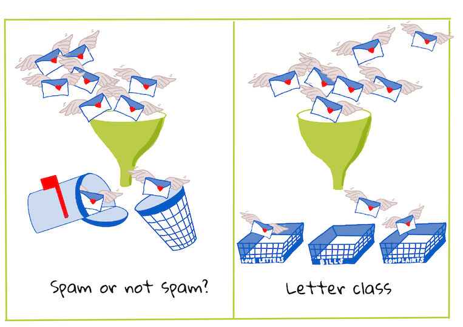

# Introduzione alla classificazione

In queste quattro lezioni si esplorerà un focus fondamentale del machine learning classico: _la classificazione_. Verrà analizzato l'utilizzo di vari algoritmi di classificazione con un insieme di dati su tutte le brillanti cucine dell'Asia e dell'India. Si spera siate affamati!


> In queste lezioni di celebrano le cucine panasiatiche! Immagine di [Jen Looper](https://twitter.com/jenlooper)

La classificazione è una forma di [apprendimento supervisionato](https://it.wikipedia.org/wiki/Apprendimento_supervisionato) che ha molto in comune con le tecniche di regressione. Se machine learning riguarda la previsione di valori o nomi di cose utilizzando insiemi di dati, la classificazione generalmente rientra in due gruppi: _classificazione binaria_ e _classificazione multiclasse_.

[](https://youtu.be/eg8DJYwdMyg "Introduzione alla classificazione")

> 🎥 Fare clic sull'immagine sopra per un video: John Guttag del MIT introduce la classificazione

Ricordare:

- La **regressione lineare** ha aiutato a prevedere le relazioni tra le variabili e a fare previsioni accurate su dove un nuovo punto dati si sarebbe posizionato in relazione a quella linea. Quindi, si potrebbe prevedere _quale prezzo avrebbe una zucca a settembre rispetto a dicembre_, ad esempio.
- La **regressione logistica** ha aiutato a scoprire le "categorie binarie": a questo prezzo, _questa zucca è arancione o non arancione_?

La classificazione utilizza vari algoritmi per determinare altri modi per definire l'etichetta o la classe di un punto dati. Si lavorerà con questi dati di cucina per vedere se, osservando un gruppo di ingredienti, è possibile determinarne la cucina di origine.

## [Quiz pre-lezione](https://gray-sand-07a10f403.1.azurestaticapps.net/quiz/19/?loc=it)

### Introduzione

La classificazione è una delle attività fondamentali del ricercatore di machine learning e data scientist. Dalla classificazione basica di un valore binario ("questa email è spam o no?"), alla complessa classificazione e segmentazione di immagini utilizzando la visione artificiale, è sempre utile essere in grado di ordinare i dati in classi e porre domande su di essi.

Per definire il processo in modo più scientifico, il metodo di classificazione crea un modello predittivo che consente di mappare la relazione tra le variabili di input e le variabili di output.



> Problemi binari e multiclasse per la gestione di algoritmi di classificazione. Infografica di [Jen Looper](https://twitter.com/jenlooper)

Prima di iniziare il processo di pulizia dei dati, visualizzazione e preparazione per le attività di machine learning, si apprenderà qualcosa circa i vari modi in cui machine learning può essere sfruttato per classificare i dati.

Derivata dalla [statistica](https://it.wikipedia.org/wiki/Classificazione_statistica), la classificazione che utilizza machine learning classico utilizza caratteristiche come l'`essere fumatore`, il `peso` e l'`età` per determinare _la probabilità di sviluppare la malattia X._ Essendo una tecnica di apprendimento supervisionata simile agli esercizi di regressione eseguiti in precedenza, i dati vengono etichettati e gli algoritmi ML utilizzano tali etichette per classificare e prevedere le classi (o "caratteristiche") di un insieme di dati e assegnarle a un gruppo o risultato.

✅ Si prenda un momento per immaginare un insieme di dati sulle cucine. A cosa potrebbe rispondere un modello multiclasse? A cosa potrebbe rispondere un modello binario? Se si volesse determinare se una determinata cucina potrebbe utilizzare il fieno greco? Se si volesse vedere se, regalando una busta della spesa piena di anice stellato, carciofi, cavolfiori e rafano, si possa creare un piatto tipico indiano?

[](https://youtu.be/GuTeDbaNoEU " Cestini misteriosi pazzeschi")

> 🎥 Fare clic sull'immagine sopra per un video. L'intera premessa dello spettacolo 'Chopped' è il 'cesto misterioso' dove gli chef devono preparare un piatto con una scelta casuale di ingredienti. Sicuramente un modello ML avrebbe aiutato!

## Ciao 'classificatore'

La domanda che si vuole porre a questo insieme di dati sulla cucina è in realtà una **domanda multiclasse**, poiché ci sono diverse potenziali cucine nazionali con cui lavorare. Dato un lotto di ingredienti, in quale di queste molte classi si identificheranno i dati?

Scikit-learn offre diversi algoritmi da utilizzare per classificare i dati, a seconda del tipo di problema che si desidera risolvere. Nelle prossime due lezioni si impareranno a conoscere molti di questi algoritmi.

## Esercizio: pulire e bilanciare i dati

Il primo compito, prima di iniziare questo progetto, sarà pulire e **bilanciare** i dati per ottenere risultati migliori. Si inizia con il file vuoto _notebook.ipynb_ nella radice di questa cartella.

La prima cosa da installare è [imblearn](https://imbalanced-learn.org/stable/). Questo è un pacchetto di apprendimento di Scikit che consentirà di bilanciare meglio i dati (si imparerà di più su questa attività tra un minuto).

1. Per installare `imblearn`, eseguire `pip install`, in questo modo:

   ```python
   pip install imblearn
   ```

1. Importare i pacchetti necessari per caricare i dati e visualizzarli, importare anche `SMOTE` da `imblearn`.

   ```python
   import pandas as pd
   import matplotlib.pyplot as plt
   import matplotlib as mpl
   import numpy as np
   from imblearn.over_sampling import SMOTE
   ```

   Ora si è pronti per la successiva importazione dei dati.

1. Il prossimo compito sarà quello di importare i dati:

   ```python
   df  = pd.read_csv('../data/cuisines.csv')
   ```

   Usando `read_csv()` si leggerà il contenuto del file csv _cusines.csv_ e lo posizionerà nella variabile `df`.

1. Controllare la forma dei dati:

   ```python
   df.head()
   ```

   Le prime cinque righe hanno questo aspetto:

   ```output
   |     | Unnamed: 0 | cuisine | almond | angelica | anise | anise_seed | apple | apple_brandy | apricot | armagnac | ... | whiskey | white_bread | white_wine | whole_grain_wheat_flour | wine | wood | yam | yeast | yogurt | zucchini |
   | --- | ---------- | ------- | ------ | -------- | ----- | ---------- | ----- | ------------ | ------- | -------- | --- | ------- | ----------- | ---------- | ----------------------- | ---- | ---- | --- | ----- | ------ | -------- |
   | 0   | 65         | indian  | 0      | 0        | 0     | 0          | 0     | 0            | 0       | 0        | ... | 0       | 0           | 0          | 0                       | 0    | 0    | 0   | 0     | 0      | 0        |
   | 1   | 66         | indian  | 1      | 0        | 0     | 0          | 0     | 0            | 0       | 0        | ... | 0       | 0           | 0          | 0                       | 0    | 0    | 0   | 0     | 0      | 0        |
   | 2   | 67         | indian  | 0      | 0        | 0     | 0          | 0     | 0            | 0       | 0        | ... | 0       | 0           | 0          | 0                       | 0    | 0    | 0   | 0     | 0      | 0        |
   | 3   | 68         | indian  | 0      | 0        | 0     | 0          | 0     | 0            | 0       | 0        | ... | 0       | 0           | 0          | 0                       | 0    | 0    | 0   | 0     | 0      | 0        |
   | 4   | 69         | indian  | 0      | 0        | 0     | 0          | 0     | 0            | 0       | 0        | ... | 0       | 0           | 0          | 0                       | 0    | 0    | 0   | 0     | 1      | 0        |
   ```

1. Si possono ottienere informazioni su questi dati chiamando `info()`:

   ```python
   df.info()
   ```

   Il risultato assomiglia a:

   ```output
   <class 'pandas.core.frame.DataFrame'>
   RangeIndex: 2448 entries, 0 to 2447
   Columns: 385 entries, Unnamed: 0 to zucchini
   dtypes: int64(384), object(1)
   memory usage: 7.2+ MB
   ```

## Esercizio - conoscere le cucine

Ora il lavoro inizia a diventare più interessante. Si scoprirà la distribuzione dei dati, per cucina

1. Tracciare i dati come barre chiamando `barh()`:

   ```python
   df.cuisine.value_counts().plot.barh()
   ```

   

   Esiste un numero finito di cucine, ma la distribuzione dei dati non è uniforme. Si può sistemare! Prima di farlo, occorre esplorare un po' di più.

1. Si deve scoprire quanti dati sono disponibili per cucina e stamparli:

   ```python
   thai_df = df[(df.cuisine == "thai")]
   japanese_df = df[(df.cuisine == "japanese")]
   chinese_df = df[(df.cuisine == "chinese")]
   indian_df = df[(df.cuisine == "indian")]
   korean_df = df[(df.cuisine == "korean")]

   print(f'thai df: {thai_df.shape}')
   print(f'japanese df: {japanese_df.shape}')
   print(f'chinese df: {chinese_df.shape}')
   print(f'indian df: {indian_df.shape}')
   print(f'korean df: {korean_df.shape}')
   ```

   il risultato si presenta così:

   ```output
   thai df: (289, 385)
   japanese df: (320, 385)
   chinese df: (442, 385)
   indian df: (598, 385)
   korean df: (799, 385)
   ```

## Alla scoperta degli ingredienti

Ora si possono approfondire i dati e scoprire quali sono gli ingredienti tipici per cucina. Si dovrebbero ripulire i dati ricorrenti che creano confusione tra le cucine, quindi si affronterà questo problema.

1. Creare una funzione `create_ingredient()` in Python per creare un dataframe ingredient Questa funzione inizierà eliminando una colonna non utile e ordinando gli ingredienti in base al loro conteggio:

   ```python
   def create_ingredient_df(df):
       ingredient_df = df.T.drop(['cuisine','Unnamed: 0']).sum(axis=1).to_frame('value')
       ingredient_df = ingredient_df[(ingredient_df.T != 0).any()]
       ingredient_df = ingredient_df.sort_values(by='value', ascending=False
       inplace=False)
       return ingredient_df
   ```

   Ora si può usare questa funzione per farsi un'idea dei primi dieci ingredienti più popolari per cucina.

1. Chiamare `create_ingredient_df()` e tracciare il grafico chiamando `barh()`:

   ```python
   thai_ingredient_df = create_ingredient_df(thai_df)
   thai_ingredient_df.head(10).plot.barh()
   ```

   

1. Fare lo stesso per i dati giapponesi:

   ```python
   japanese_ingredient_df = create_ingredient_df(japanese_df)
   japanese_ingredient_df.head(10).plot.barh()
   ```

   

1. Ora per gli ingredienti cinesi:

   ```python
   chinese_ingredient_df = create_ingredient_df(chinese_df)
   chinese_ingredient_df.head(10).plot.barh()
   ```

   

1. Tracciare gli ingredienti indiani:

   ```python
   indian_ingredient_df = create_ingredient_df(indian_df)
   indian_ingredient_df.head(10).plot.barh()
   ```

   

1. Infine, tracciare gli ingredienti coreani:

   ```python
   korean_ingredient_df = create_ingredient_df(korean_df)
   korean_ingredient_df.head(10).plot.barh()
   ```

   

1. Ora, eliminare gli ingredienti più comuni che creano confusione tra le diverse cucine, chiamando `drop()`:

   Tutti amano il riso, l'aglio e lo zenzero!

   ```python
   feature_df= df.drop(['cuisine','Unnamed: 0','rice','garlic','ginger'], axis=1)
   labels_df = df.cuisine #.unique()
   feature_df.head()
   ```

## Bilanciare l'insieme di dati

Ora che i dati sono puliti, si usa [SMOTE](https://imbalanced-learn.org/dev/references/generated/imblearn.over_sampling.SMOTE.html) - "Tecnica di sovracampionamento della minoranza sintetica" - per bilanciarlo.

1. Chiamare `fit_resample()`, questa strategia genera nuovi campioni per interpolazione.

   ```python
   oversample = SMOTE()
   transformed_feature_df, transformed_label_df = oversample.fit_resample(feature_df, labels_df)
   ```

   Bilanciando i dati, si otterranno risultati migliori quando si classificano. Si pensi a una classificazione binaria. Se la maggior parte dei dati è una classe, un modello ML prevederà quella classe più frequentemente, solo perché ci sono più dati per essa. Il bilanciamento dei dati prende tutti i dati distorti e aiuta a rimuovere questo squilibrio.

1. Ora si può controllare il numero di etichette per ingrediente:

   ```python
   print(f'new label count: {transformed_label_df.value_counts()}')
   print(f'old label count: {df.cuisine.value_counts()}')
   ```

   il risultato si presenta così:

   ```output
   new label count: korean      799
   chinese     799
   indian      799
   japanese    799
   thai        799
   Name: cuisine, dtype: int64
   old label count: korean      799
   indian      598
   chinese     442
   japanese    320
   thai        289
   Name: cuisine, dtype: int64
   ```

   I dati sono belli e puliti, equilibrati e molto deliziosi!

1. L'ultimo passaggio consiste nel salvare i dati bilanciati, incluse etichette e caratteristiche, in un nuovo dataframe che può essere esportato in un file:

   ```python
   transformed_df = pd.concat([transformed_label_df,transformed_feature_df],axis=1, join='outer')
   ```

1. Si può dare un'altra occhiata ai dati usando `transform_df.head()` e `transform_df.info()`. Salvare una copia di questi dati per utilizzarli nelle lezioni future:

   ```python
   transformed_df.head()
   transformed_df.info()
   transformed_df.to_csv("../data/cleaned_cuisine.csv")
   ```

   Questo nuovo CSV può ora essere trovato nella cartella data in radice.

---

## 🚀 Sfida

Questo programma di studi contiene diversi insiemi di dati interessanti. Esaminare le cartelle `data` e vedere se contiene insiemi di dati che sarebbero appropriati per la classificazione binaria o multiclasse. Quali domande si farebbero a questo insieme di dati?

## [Quiz post-lezione](https://gray-sand-07a10f403.1.azurestaticapps.net/quiz/20/?loc=it)

## Revisione e Auto Apprendimento

Esplorare l'API di SMOTE. Per quali casi d'uso è meglio usarla? Quali problemi risolve?

## Compito

[Esplorare i metodi di classificazione](assignment.it.md)
