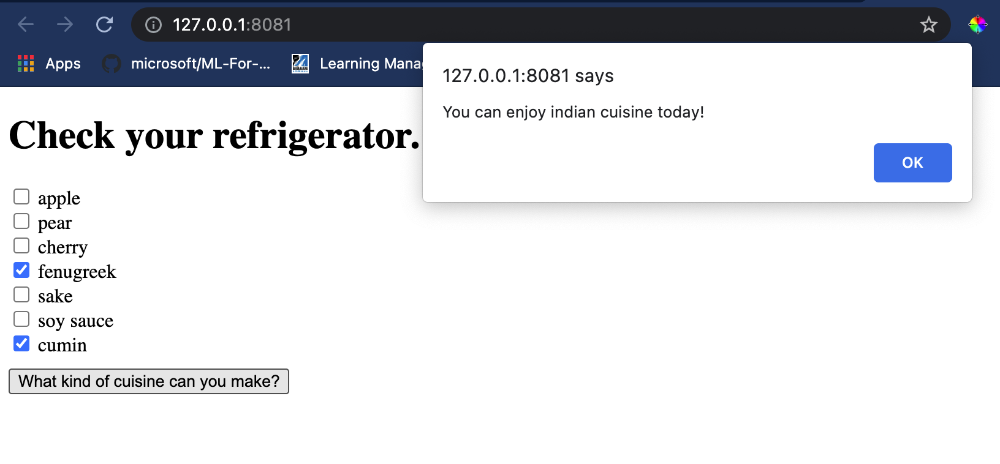

# 요리 추천 Web App 만들기

이 강의에서, 이전 강의에서 배웠던 몇 기술과 이 계열에서 사용했던 맛있는 요리 데이터셋으로 classification 모델을 만들 예정입니다. 추가로, Onnx의 웹 런타임을 활용해서, 저장된 모델로 작은 웹 앱을 만들 것입니다.

머신러닝의 유용하고 실용적인 사용 방식 중에 하나인 recommendation system을 만들고, 오늘 이 쪽으로 처음 걷습니다!

[](https://youtu.be/17wdM9AHMfg "Applied ML")

> 🎥 영상 보려면 이미지 클릭

## [강의 전 퀴즈](https://gray-sand-07a10f403.1.azurestaticapps.net/quiz/25/)

이 강의에서 다음을 배우게 됩니다:

- 모델을 만들고 Onnx 모델로 저장하는 방식
- Netron 사용해서 모델 검사하는 방식
- 추론을 위한 웹 앱에서 모델을 사용하는 방식

## 모델 만들기

Applied ML 시스템을 만드는 것은 비지니스 시스템에서 이 기술을 활용하는 부분이 중요합니다. Onnx로 웹 애플리케이션에서 (필요하면 오프라인 컨텍스트에서 사용하기도 합니다) 모델을 사용할 수 있습니다.

[previous lesson](../../../3-Web-App/1-Web-App/README.md)에서, UFO 목격에 대한 Regression 모델을 만들었고, "pickled" 한 것을, Flask 앱에서 사용했습니다. 이 구조는 알고 있다면 매우 유용하지만, full-stack Python 앱이므로, JavaScript 애플리케이션을 포함해야 된다고 요구될 수 있습니다.

이 강의에서, 추론할 기초 JavaScript-기반 시스템을 만듭니다. 그러나 먼저, 모델을 훈련하고 Onnx와 같이 사용하기 위해서 변환할 필요가 있습니다.

## 연습 - classification 모델 훈련

먼저, 이미 사용했던 깨끗한 요리 데이터셋으로 classification 모델을 훈련합니다.

1. 유용한 라이브러리를 가져와서 시작합니다:

    ```python
    !pip install skl2onnx
    import pandas as pd 
    ```

    Scikit-learn 모델을 Onnx 포맷으로 변환할 때 도움을 주는 '[skl2onnx](https://onnx.ai/sklearn-onnx/)' 가 필요합니다.

1. 그리고, `read_csv()` 사용해서 CSV 파일을 읽어보면, 이전 강의에서 했던 같은 방식으로 데이터를 작업합니다:

    ```python
    data = pd.read_csv('../data/cleaned_cuisines.csv')
    data.head()
    ```

1. 첫 2개의 필요없는 열을 제거하고 'X'로 나머지 데이터를 저장합니다:

    ```python
    X = data.iloc[:,2:]
    X.head()
    ```

1. 'y'로 라벨을 저장합니다:

    ```python
    y = data[['cuisine']]
    y.head()
    
    ```

### 훈련 루틴 개시하기

좋은 정확도의 'SVC' 라이브러리를 사용할 예정입니다.

1. Scikit-learn에서 적합한 라이브러리를 Import 합니다:

    ```python
    from sklearn.model_selection import train_test_split
    from sklearn.svm import SVC
    from sklearn.model_selection import cross_val_score
    from sklearn.metrics import accuracy_score,precision_score,confusion_matrix,classification_report
    ```

1. 훈련과 테스트 셋으로 가릅니다:

    ```python
    X_train, X_test, y_train, y_test = train_test_split(X,y,test_size=0.3)
    ```

1. 이전 강의에서 했던 것처럼 SVC Classification model 모델을 만듭니다:

    ```python
    model = SVC(kernel='linear', C=10, probability=True,random_state=0)
    model.fit(X_train,y_train.values.ravel())
    ```

1. 지금부터, `predict()`를 불러서, 모델을 테스트합니다:

    ```python
    y_pred = model.predict(X_test)
    ```

1. 모델의 품질을 확인하기 위해서 classification 리포트를 출력합니다:

    ```python
    print(classification_report(y_test,y_pred))
    ```

    전에 본 것처럼, 정확도는 좋습니다:

    ```output
                    precision    recall  f1-score   support
    
         chinese       0.72      0.69      0.70       257
          indian       0.91      0.87      0.89       243
        japanese       0.79      0.77      0.78       239
          korean       0.83      0.79      0.81       236
            thai       0.72      0.84      0.78       224
    
        accuracy                           0.79      1199
       macro avg       0.79      0.79      0.79      1199
    weighted avg       0.79      0.79      0.79      1199
    ```

### 모델을 Onnx로 변환하기

적절한 Tensor 숫자로 변환할 수 있어야 합니다. 데이터셋은 380개 성분이 나열되며, `FloatTensorType`에 숫자를 적어야 합니다:

1. 380개의 tensor 숫자로 변환하기.

    ```python
    from skl2onnx import convert_sklearn
    from skl2onnx.common.data_types import FloatTensorType
    
    initial_type = [('float_input', FloatTensorType([None, 380]))]
    options = {id(model): {'nocl': True, 'zipmap': False}}
    ```

1. onx를 생성하고 **model.onnx** 파일로 저장합니다:

    ```python
    onx = convert_sklearn(model, initial_types=initial_type, options=options)
    with open("./model.onnx", "wb") as f:
        f.write(onx.SerializeToString())
    ```

    > 노트, 변환 스크립트에서 [options](https://onnx.ai/sklearn-onnx/parameterized.html)을 줄 수 있습니다. 이 케이스에서, 'nocl'는 True, 'zipmap'은 False로 줬습니다. (필수는 아니지만) classification 모델이라서, 사전의 리스트를 만드는 ZipMap을 지울 옵션이 있습니다. `nocl`은 모델에 있는 클래스 정보를 나타냅니다. `nocl`을 'True'로 설정해서 모델의 크기를 줄입니다.

전체 노트북을 실행하면 Onnx 모델이 만들어지고 폴더에 저장됩니다.

## 모델 보기

Onnx 모델은 Visual Studio code에서 잘 볼 수 없지만, 많은 연구원들이 모델을 잘 만들었는지 보고 싶어서 모델을 시각화할 때 사용하기 매우 좋은 자유 소프트웨어가 있습니다. [Netron](https://github.com/lutzroeder/Netron)을 내려받고 model.onnx 파일을 엽니다. 380개 입력과 나열된 classifier로 간단한 모델을 시각화해서 볼 수 있습니다:


Netron은 모델을 보게 도와주는 도구입니다.

지금부터 웹 앱에서 neat 모델을 사용할 준비가 되었습니다. 냉장고를 볼 때 편리한 앱을 만들고 모델이 결정해서 건내준 요리를 조리할 수 있게 남은 재료 조합을 찾아봅니다.

## recommender 웹 애플리케이션 만들기

웹 앱에서 바로 모델을 사용할 수 있습니다. 이 구조를 사용한다면 로컬에서 실행할 수 있고 필요하면 오프라인으로 가능합니다. `model.onnx` 파일을 저장한 동일 폴더에서 `index.html` 파일을 만들기 시작합니다.

1. _index.html_ 파일에서, 다음 마크업을 추가합니다:

    ```html
    <!DOCTYPE html>
    <html>
        <header>
            <title>Cuisine Matcher</title>
        </header>
        <body>
            ...
        </body>
    </html>
    ```

1. 지금부터, `body` 테그에서 작업하며, 일부 요소를 반영하는 체크박스의 리스트로 보여줄 약간의 마크업을 추가합니다:

    ```html
    <h1>Check your refrigerator. What can you create?</h1>
            <div id="wrapper">
                <div class="boxCont">
                    <input type="checkbox" value="4" class="checkbox">
                    <label>apple</label>
                </div>
            
                <div class="boxCont">
                    <input type="checkbox" value="247" class="checkbox">
                    <label>pear</label>
                </div>
            
                <div class="boxCont">
                    <input type="checkbox" value="77" class="checkbox">
                    <label>cherry</label>
                </div>
    
                <div class="boxCont">
                    <input type="checkbox" value="126" class="checkbox">
                    <label>fenugreek</label>
                </div>
    
                <div class="boxCont">
                    <input type="checkbox" value="302" class="checkbox">
                    <label>sake</label>
                </div>
    
                <div class="boxCont">
                    <input type="checkbox" value="327" class="checkbox">
                    <label>soy sauce</label>
                </div>
    
                <div class="boxCont">
                    <input type="checkbox" value="112" class="checkbox">
                    <label>cumin</label>
                </div>
            </div>
            <div style="padding-top:10px">
                <button onClick="startInference()">What kind of cuisine can you make?</button>
            </div> 
    ```

    각 체크박스에 값이 주어졌습니다. 데이터셋에 따라서 식재료가 발견된 인덱스를 반영합니다. Apple을 예시로 들면, 알파벳 리스트에서, 5번째 열을 차지하므로, 0부터 세기 시작해서 값은 '4'가 됩니다. 주어진 식재료의 색인을 찾기 위해서 [ingredients spreadsheet](../../data/ingredient_indexes.csv)를 참고할 수 있습니다

    index.html 파일에 작업을 계속 이어서, 마지막 닫는 `</div>` 뒤에 모델을 부를 script 블록을 추가합니다.

1. 먼저, [Onnx Runtime](https://www.onnxruntime.ai/)을 가져옵니다:

    ```html
    <script src="https://cdn.jsdelivr.net/npm/onnxruntime-web@1.8.0-dev.20210608.0/dist/ort.min.js"></script> 
    ```

    > Onnx 런타임은 최적화와 사용할 API를 포함해서, 넓은 범위의 하드웨어 플랫폼으로 Onnx 모델을 실행할 때 쓰입니다.

1. 런타임이 자리에 있다면, 이렇게 부를 수 있습니다:

    ```javascript
    <script>
                const ingredients = [0, 0, 0, 0, 0, 0, 0, 0, 0, 0, 0, 0, 0, 0, 0, 0, 0, 0, 0, 0, 0, 0, 0, 0, 0, 0, 0, 0, 0, 0, 0, 0, 0, 0, 0, 0, 0, 0, 0, 0, 0, 0, 0, 0, 0, 0, 0, 0, 0, 0, 0, 0, 0, 0, 0, 0, 0, 0, 0, 0, 0, 0, 0, 0, 0, 0, 0, 0, 0, 0, 0, 0, 0, 0, 0, 0, 0, 0, 0, 0, 0, 0, 0, 0, 0, 0, 0, 0, 0, 0, 0, 0, 0, 0, 0, 0, 0, 0, 0, 0, 0, 0, 0, 0, 0, 0, 0, 0, 0, 0, 0, 0, 0, 0, 0, 0, 0, 0, 0, 0, 0, 0, 0, 0, 0, 0, 0, 0, 0, 0, 0, 0, 0, 0, 0, 0, 0, 0, 0, 0, 0, 0, 0, 0, 0, 0, 0, 0, 0, 0, 0, 0, 0, 0, 0, 0, 0, 0, 0, 0, 0, 0, 0, 0, 0, 0, 0, 0, 0, 0, 0, 0, 0, 0, 0, 0, 0, 0, 0, 0, 0, 0, 0, 0, 0, 0, 0, 0, 0, 0, 0, 0, 0, 0, 0, 0, 0, 0, 0, 0, 0, 0, 0, 0, 0, 0, 0, 0, 0, 0, 0, 0, 0, 0, 0, 0, 0, 0, 0, 0, 0, 0, 0, 0, 0, 0, 0, 0, 0, 0, 0, 0, 0, 0, 0, 0, 0, 0, 0, 0, 0, 0, 0, 0, 0, 0, 0, 0, 0, 0, 0, 0, 0, 0, 0, 0, 0, 0, 0, 0, 0, 0, 0, 0, 0, 0, 0, 0, 0, 0, 0, 0, 0, 0, 0, 0, 0, 0, 0, 0, 0, 0, 0, 0, 0, 0, 0, 0, 0, 0, 0, 0, 0, 0, 0, 0, 0, 0, 0, 0, 0, 0, 0, 0, 0, 0, 0, 0, 0, 0, 0, 0, 0, 0, 0, 0, 0, 0, 0, 0, 0, 0, 0, 0, 0, 0, 0, 0, 0, 0, 0, 0, 0, 0, 0, 0, 0, 0, 0, 0, 0, 0, 0, 0, 0, 0, 0, 0, 0, 0, 0, 0, 0, 0, 0, 0, 0, 0, 0, 0, 0, 0, 0, 0, 0, 0, 0, 0, 0, 0, 0, 0, 0, 0, 0, 0, 0, 0, 0, 0]
                
                const checks = [].slice.call(document.querySelectorAll('.checkbox'));
    
                // use an async context to call onnxruntime functions.
                function init() {
                    
                    checks.forEach(function (checkbox, index) {
                        checkbox.onchange = function () {
                            if (this.checked) {
                                var index = checkbox.value;
    
                                if (index !== -1) {
                                    ingredients[index] = 1;
                                }
                                console.log(ingredients)
                            }
                            else {
                                var index = checkbox.value;
    
                                if (index !== -1) {
                                    ingredients[index] = 0;
                                }
                                console.log(ingredients)
                            }
                        }
                    })
                }
    
                function testCheckboxes() {
                        for (var i = 0; i < checks.length; i++)
                            if (checks[i].type == "checkbox")
                                if (checks[i].checked)
                                    return true;
                        return false;
                }
    
                async function startInference() {
    
                    let checked = testCheckboxes()
    
                    if (checked) {
    
                    try {
                        // create a new session and load the model.
                        
                        const session = await ort.InferenceSession.create('./model.onnx');
    
                        const input = new ort.Tensor(new Float32Array(ingredients), [1, 380]);
                        const feeds = { float_input: input };
    
                        // feed inputs and run
    
                        const results = await session.run(feeds);
    
                        // read from results
                        alert('You can enjoy ' + results.label.data[0] + ' cuisine today!')
    
                    } catch (e) {
                        console.log(`failed to inference ONNX model: ${e}.`);
                    }
                }
                else alert("Please check an ingredient")
                    
                }
        init();
               
            </script>
    ```

이 코드에서, 몇가지 해프닝이 생깁니다:

1. 체크박스 요소가 체크되었는 지에 따라, 추론해서 모델로 보낼 380개 가능한 값(1 또는 0)의 배열을 만듭니다.
2. 체크박스의 배열과 애플리케이션을 시작하며 불렀던 `init` 함수에서 체크되었는 지 확인할 방식을 만들었습니다. 체크박스를 체크하면, 고른 재료를 반영할 수 있게 `ingredients` 배열이 변경됩니다.
3. 모든 체크박스를 체크했는지 확인하는 `testCheckboxes` 함수를 만들었습니다.
4. 버튼을 누르면 이 함수를 사용하고, 만약 모든 체크박스가 체크되어 있다면, 추론하기 시작합니다.
5. 추론 루틴에 포함됩니다:
   1. 모델의 비동기 로드 세팅하기
   2. 모델로 보낼 Tensor 구조 만들기
   3. 모델을 훈련할 때 만들었던 입력 `float_input`을 반영하는 'feeds' 만들기 (Netron으로 이름을 확인할 수 있습니다)
   4. 모델로 'feeds'를 보내고 응답 기다리기

## 애플리케이션 테스트하기

index.html 파일의 폴더에서 Visual Studio Code로 터미널 세션을 엽니다. 전역적으로 [http-server](https://www.npmjs.com/package/http-server)를 설치했는지 확인하고, 프롬프트에 `http-server`를 타이핑합니다. 로컬 호스트로 열고 웹 앱을 볼 수 있습니다. 여러 재료를 기반으로 추천된 요리를 확인합니다:



축하드립니다, 약간의 필드로 'recommendation' 웹 앱을 만들었습니다. 시간을 조금 내어 이 시스템을 만들어봅니다!

## 🚀 도전

이 웹 앱은 매우 작아서, [ingredient_indexes](../../data/ingredient_indexes.csv) 데이터에서 성분과 인덱스로 계속 만듭니다. 주어진 국민 요리를 만드려면 어떤 풍미 조합으로 작업해야 되나요?

## [Post-lecture quiz](https://gray-sand-07a10f403.1.azurestaticapps.net/quiz/26/)

## 검토 & 자기주도 학습

이 강의에서 식품 재료에 대한 recommendation 시스템 구축의 유용함을 다뤘지만, ML 애플리케이션 영역은 예제가 매우 많습니다. 이 시스템이 어떻게 만들어졌는지 읽어봅니다:

- https://www.sciencedirect.com/topics/computer-science/recommendation-engine
- https://www.technologyreview.com/2014/08/25/171547/the-ultimate-challenge-for-recommendation-engines/
- https://www.technologyreview.com/2015/03/23/168831/everything-is-a-recommendation/

## 과제 

[Build a new recommender](../assignment.md)
