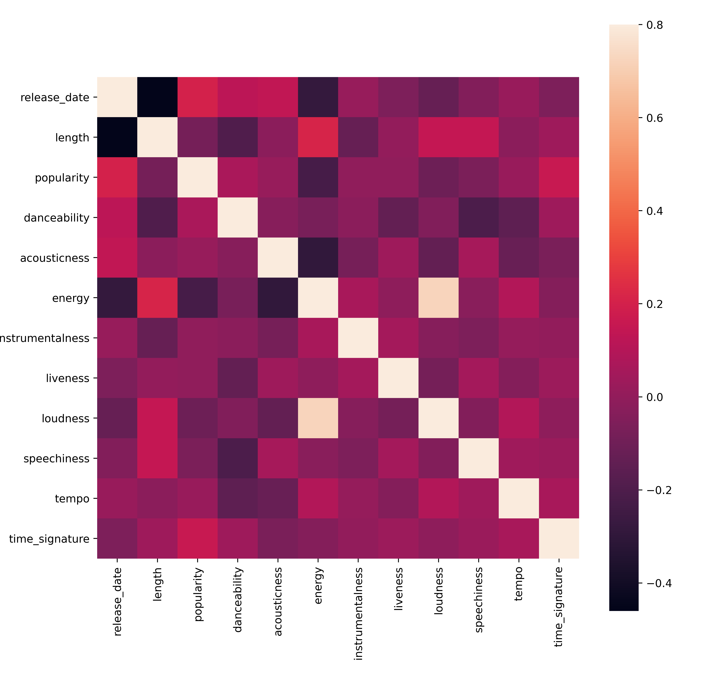
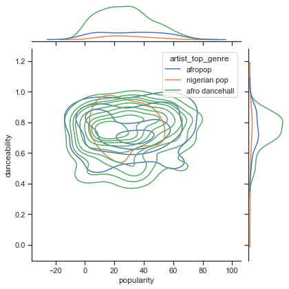

# Introducción al agrupamiento

El agrupamiento (clustering) es un tipo de [aprendizaje no supervisado](https://wikipedia.org/wiki/Unsupervised_learning) que supone que un conjunto de datos está sin etiquetar o que sus entradas no están emparejadas con salidas predefinidas. Usa varios algoritmos para ordenar datos sin etiquetar y provee agrupaciones de acuerdo a patrones que discierne en los datos.

[](https://youtu.be/ty2advRiWJM "No One Like You de PSquare")

> 🎥 Haz clic en la imagen de arriba para ver el video. Mientras estudias aprendizaje automático con agrupamiento, disfruta de algunas canciones Dance Hall Nigerianas - esta es una canción muy popular del 2014 de PSquare.

## [Examen previo a la lección](https://gray-sand-07a10f403.1.azurestaticapps.net/quiz/27?loc=es)

### Introducción

El [agrupamiento](https://link.springer.com/referenceworkentry/10.1007%2F978-0-387-30164-8_124) es muy útil para la exploración de datos. Veamos si nos puede ayudar a descubrir tendencias y patrones en la forma en que la audiencia Nigeriana consume música.

✅ Piensa por un minuto acerca de los usos del agrupamiento. En la vida real, el agrupamiento sucede siempre que tienes un montón de ropa sucia y necesitas ordenar las prendas de los miembros de la familia 🧦👕👖🩲. En la ciencia de datos, el agrupamiento ocurre cuando intentamos analizar las preferencias de los usuarios, o determinar las características de cualquier conjunto de datos no etiquetado. El agrupamiento, de cierta forma, ayuda a dar sentido al caos, como un cajón de calcetines.

[](https://youtu.be/esmzYhuFnds "introducción al agrupamiento")

> 🎥 Haz clic en la imagen de arriba para ver el video: John Guttag del MIT presenta el agrupamiento

En el ámbito profesional, el agrupamiento puede ser usado para determinar temas como la segmentación de mercado, qué grupos de edad compran qué cosas, por citar algunos. Otro uso sería la detección de anomalías, quizá para detectar el fraude de un conjunto de datos de transacciones de tarjetas de crédito. O podrías usar el agrupamiento para determinar tumores en un lote de escaneos médicos.

✅ Piensa un poco acerca de cómo encontrarías el agrupamiento 'en la naturaleza', en un entorno bancario, de comercio electrónico o de negocio.

> 🎓 Curiosamente, el análisis de agrupamiento se originó en los campos de la Antropología y Psicología en los años 1930. ¿Puedes imaginar cómo fue usado?

Alternativamente, puedes usarlo para agrupar resultados de búsqueda - por enlaces de compra, imágenes o reseñas, por citar algunos. El agrupamiento es útil cuando tienes un gran conjunto de datos el cual quieres reducir y sobre el cual deseas realizar un análisis más granular, así la técnica puede ser usada para aprender acerca de los datos antes que se construyan otros modelos.

✅ Una vez que tus datos están organizados en grupos , asignale un Id de grupo, y esta técnica puede ser útil cuando conservas la privacidad de un conjunto de datos; en su lugar te puedes referir a un punto de datos por su id de grupo, en vez de sus datos identificables más reveladores. ¿Puedes pensar en otras razones del por qué preferirías un Id de grupo en lugar de otros elementos del grupo para identificarlo?

Profundiza tu compresión de las técnicas de agrupamiento en este [módulo de aprendizaje](https://docs.microsoft.com/learn/modules/train-evaluate-cluster-models?WT.mc_id=academic-77952-leestott)

## Empezando con el agrupamiento

[Scikit-learn ofrece un gran arreglo](https://scikit-learn.org/stable/modules/clustering.html) de métodos para realizar agrupamiento. El tipo que elijas dependerá de tu caso de uso. De acuerdo a la documentación, cada método tiene varios beneficios. Aquí tienes una tabla simplificada de los métodos soportados por Scikit-learn y sus casos de uso apropiados:

| Nombre del método            | Caso de uso                                                               |
| :--------------------------- | :-------------------------------------------------------------------------|
| K-Medias                     | propósito general, inductivo                                              |
| Propagación de afinidad      | Muchos, grupos desiguales, inductivo                                      |
| Desplazamiento medio         | Muchos, grupos desiguales, inductivo                                      |
| Agrupamiento espectral       | Pocos, grupos iguales, transductivo                                       |
| Agrupación jerárquica Ward   | Muchos, grupos restringidos, transductivo                                 |
| Agrupación aglomerativa      | Muchos, restringidos, distancia no Euclidianas, transductivo              |
| DBSCAN                       | Geometría no plana, grupos desiguales, transductivo                       |
| OPTICS                       | Geometría no plana, grupos desiguales con densidad variable, transductivo |
| Mezclas Gaussianas           | Geometría plana, inductivo                                                |
| BIRCH                        | Gran conjunto de datos con valores atípicos, inductivo                    |

> 🎓 El cómo creamos los grupos tiene mucho que ver con cómo recopilamos los puntos de datos en grupos. Desempaquemos algo de vocabulario:
>
> 🎓 ['Transductivo' vs. 'inductivo'](https://wikipedia.org/wiki/Transduction_(machine_learning))
>
> La inferencia transductiva se deriva de los casos de entrenamiento observados que se asignan a casos de prueba específicos. La inferencia inductiva se deriva de los casos de entrenamiento que se asignan a reglas generales las cuales sólo aplican a los casos de prueba.
>
> Un ejemplo: Imagina que tienes un conjunto de datos que está parcialmente etiquetado. Algunas cosas son 'records', otras 'cds' y unas más están en blanco. Tu trabajo es proveer las etiquetas para los blancos. Si eliges un enfoque inductivo, entrenarías un modelo buscando 'records' y 'cds' y aplicarías esas etiquetas a tus datos sin etiquetar. Este enfoque tendrá problemas clasificando como que en realidad con 'cassettes'. Por otro lado, un enfoque transductivo, maneja estos datos desconocidos de forma más efectiva ya que funciona para agrupar elementos similares y luego aplica una etiqueta a un grupo. En este caso, los agrupamientos reflejan 'cosas musicales redondas' y 'cosas musicales cuadradas'.
>
> 🎓 [Geometría 'no plana' vs 'plana'](https://datascience.stackexchange.com/questions/52260/terminology-flat-geometry-in-the-context-of-clustering)
>
> Derivada de la terminología matemática, la geometría no plana versus plana se refiere a la medida de distancias entre puntos ya sea por métodos geométricos 'planos' ([Euclidianos](https://wikipedia.org/wiki/Euclidean_geometry)) o 'no planos' (no Euclidianos).
>
> En este contexto 'Plano' se refiere a la geometría Euclidiana (partes de las cuales se enseñan como geometría 'plana'), y no plana se refiere a la geometría no Euclidiana. ¿Qué tiene que ver la geometría con el aprendizaje automático? Bien, como dos campos que tienen sus raíces en las matemáticas, debe haber una forma común de medir las distancias entre puntos en los grupos, y eso puede hacerse de forma 'plana' o 'no plana', dependiendo de la naturaleza de los datos. Las [distancias Euclidianas](https://wikipedia.org/wiki/Euclidean_distance) se miden como la longitud de un segmento de línea entre dos puntos. Las [distancias no Euclidianas](https://wikipedia.org/wiki/Non-Euclidean_geometry) se miden como a lo largo de la curva. Si tus datos visualizados parecen no existir en un plano, podrías necesitar usar un algoritmo especializado para realizarlo.
>

> Infografía de [Dasani Madipalli](https://twitter.com/dasani_decoded)
>
> 🎓 ['Distancias'](https://web.stanford.edu/class/cs345a/slides/12-clustering.pdf)
>
> Los agrupamientos se definen por su matriz de distancia, por ejemplo, las distancias entre puntos. Esta distancia puede ser medida de varias formas. Los agrupamientos Euclidianos se definen por el promedio de los valores de los puntos, y contienen un 'centroide' o punto central. por lo tanto, las distancias son medidas por la distancia al centroide. Las distancias no Euclidianas se refieren a 'clustroides', el punto más cercano a otros puntos. Los clustroides en turno pueden ser definidos de varias formas.
>
> 🎓 ['Restringido'](https://wikipedia.org/wiki/Constrained_clustering)
> 
> El [agrupamiento restringido](https://web.cs.ucdavis.edu/~davidson/Publications/ICDMTutorial.pdf) presenta el término aprendizaje 'semi-supervisado' en este método no supervisado. Las relaciones entre los puntos son marcadas como 'cannot link' o 'must-link' por lo que algunas reglas son forzadas en el conjunto de datos.
>
> Un ejemplo: Si se libera un algoritmo en un lote de datos no etiquetados o semi-etiquetados, los agrupamientos que produce pueden ser de baja calidad. En el ejemplo de arriba, los agrupamientos pueden reunir 'round music things' y 'square music things' y 'triangular things' y 'cookies'. Si se proporcionan algunas restricciones o reglas a seguir ("el elemento debe estar hecho de plástico", "el elemento necesita ser capaz de reproducir música") esto puede ayudar a 'restringir' al algoritmo para que realice mejores elecciones.
>
> 🎓 'Densidad'
>
> Los datos que son 'ruidosos' se consideran como 'densos'. Las distancias entre los puntos en cada uno de sus grupos puede probar, al examinarse, ser más o menos densos, o 'atestados' y por lo tanto estos datos necesitan ser analizados con los métodos de agrupamiento apropiados. [Este artículo](https://www.kdnuggets.com/2020/02/understanding-density-based-clustering.html) demuestra la diferencia entre usar los algoritmos K-Medias vs HDBSCAN para explorar un conjunto de datos ruidosos con densidad de agrupamiento desigual.

## Algoritmos de agrupamiento

Existen más de 100 algoritmos de agrupamiento, y sus usos dependen de la naturaleza de los datos que se te presentan. Discutamos algunos de los más importantes:

- **Agrupamiento jerárquico** Si un objeto se clasifica por su proximidad a un objeto cercano, en lugar de uno más lejano, los grupos se forman basados en las distancias de sus miembros hacia y desde otros objetos. El agrupamiento aglomerativo de Scikit-learn es jerárquico.

   
   > Infografía de [Dasani Madipalli](https://twitter.com/dasani_decoded)

- **Agrupamiento de centroide**. Este popular algoritmo require la elección de 'k', o el número de grupos a formar, tras lo cua el algoritmo determina el punto central de un grupo y reúne datos alrededor de ese punto. [El agrupamiento K-Medias](https://wikipedia.org/wiki/K-means_clustering) es una versión popular de agrupamiento de centroide. El centro se determina por la media más cercana, por eso el nombre. La distancia al cuadrado desde el grupo se minimiza.

   
   > Infografía de [Dasani Madipalli](https://twitter.com/dasani_decoded)

- **Agrupamiento basado en distribución**. Se basa en el modelado estadístico, el agrupamiento basado en distribución se centra en determinar la probabilidad de los puntos de datos de pertenecer a un grupo, y los asigna en consecuencia. Los métodos de mezcla Gaussiana pertenecen a este tipo.

- **Agrupamiento basado en densidad**. Los puntos de datos se asignan a grupos basado en su densidad, o su agrupación unos alrededor de otros. Los puntos de datos lejanos del grupo se consideran valores atípicos o ruido. DBSCAN, desplazamiento medio y OPTICS pertenecen a este tipo de agrupamiento.

- **Agrupamiento basado en cuadrícula**. Para conjuntos de datos multi-dimensionales, se crea una cuadrícula y los datos se dividen entre las celdas de la cuadrícula, creando así los grupos.

## Ejercicio - agrupa tus datos

El agrupamiento como técnica recibe mucha ayuda de una buena visualización, así que empecemos por visualizar nuestros datos de música. Este ejercicio nos ayudará a decidir cuál de los métodos de agrupamiento deberíamos usar de forma más efectiva de acuerdo a la naturaleza de estos datos.

1. Abre el archivo _notebook.ipynb_ en este directorio.

1. Importa el paquete `Seaborn` para una buena visualización de datos.

    ```python
    !pip install seaborn
    ```

1. Adjunta los datos de la canción del archivo _nigerian-songs.csv_. Carga un dataframe con algunos datos de las canciones. Prepárate para explorar estos datos al importar las bibliotecas y volcar los datos: 

    ```python
    import matplotlib.pyplot as plt
    import pandas as pd
    
    df = pd.read_csv("../data/nigerian-songs.csv")
    df.head()
    ```

    Revisa las primeras líneas de datos:

    |     | name                     | album                        | artist              | artist_top_genre | release_date | length | popularity | danceability | acousticness | energy | instrumentalness | liveness | loudness | speechiness | tempo   | time_signature |
    | --- | ------------------------ | ---------------------------- | ------------------- | ---------------- | ------------ | ------ | ---------- | ------------ | ------------ | ------ | ---------------- | -------- | -------- | ----------- | ------- | -------------- |
    | 0   | Sparky                   | Mandy & The Jungle           | Cruel Santino       | alternative r&b  | 2019         | 144000 | 48         | 0.666        | 0.851        | 0.42   | 0.534            | 0.11     | -6.699   | 0.0829      | 133.015 | 5              |
    | 1   | shuga rush               | EVERYTHING YOU HEARD IS TRUE | Odunsi (The Engine) | afropop          | 2020         | 89488  | 30         | 0.71         | 0.0822       | 0.683  | 0.000169         | 0.101    | -5.64    | 0.36        | 129.993 | 3              |
    | 2   | LITT!                    | LITT!                        | AYLØ                | indie r&b        | 2018         | 207758 | 40         | 0.836        | 0.272        | 0.564  | 0.000537         | 0.11     | -7.127   | 0.0424      | 130.005 | 4              |
    | 3   | Confident / Feeling Cool | Enjoy Your Life              | Lady Donli          | nigerian pop     | 2019         | 175135 | 14         | 0.894        | 0.798        | 0.611  | 0.000187         | 0.0964   | -4.961   | 0.113       | 111.087 | 4              |
    | 4   | wanted you               | rare.                        | Odunsi (The Engine) | afropop          | 2018         | 152049 | 25         | 0.702        | 0.116        | 0.833  | 0.91             | 0.348    | -6.044   | 0.0447      | 105.115 | 4              |

1. Obtén información acerca del dataframe, llamando a `info()`:

    ```python
    df.info()
    ```

   La salida luce así:

    ```output
    <class 'pandas.core.frame.DataFrame'>
    RangeIndex: 530 entries, 0 to 529
    Data columns (total 16 columns):
     #   Column            Non-Null Count  Dtype  
    ---  ------            --------------  -----  
     0   name              530 non-null    object 
     1   album             530 non-null    object 
     2   artist            530 non-null    object 
     3   artist_top_genre  530 non-null    object 
     4   release_date      530 non-null    int64  
     5   length            530 non-null    int64  
     6   popularity        530 non-null    int64  
     7   danceability      530 non-null    float64
     8   acousticness      530 non-null    float64
     9   energy            530 non-null    float64
     10  instrumentalness  530 non-null    float64
     11  liveness          530 non-null    float64
     12  loudness          530 non-null    float64
     13  speechiness       530 non-null    float64
     14  tempo             530 non-null    float64
     15  time_signature    530 non-null    int64  
    dtypes: float64(8), int64(4), object(4)
    memory usage: 66.4+ KB
    ```

1. Vuelve a revisar los valores nulos, al llamar a `isnull()` y verifica que la suma sea 0:

    ```python
    df.isnull().sum()
    ```

    Se ve bien:

    ```output
    name                0
    album               0
    artist              0
    artist_top_genre    0
    release_date        0
    length              0
    popularity          0
    danceability        0
    acousticness        0
    energy              0
    instrumentalness    0
    liveness            0
    loudness            0
    speechiness         0
    tempo               0
    time_signature      0
    dtype: int64
    ```

1. Describe los datos:

    ```python
    df.describe()
    ```

    |       | release_date | length      | popularity | danceability | acousticness | energy   | instrumentalness | liveness | loudness  | speechiness | tempo      | time_signature |
    | ----- | ------------ | ----------- | ---------- | ------------ | ------------ | -------- | ---------------- | -------- | --------- | ----------- | ---------- | -------------- |
    | count | 530          | 530         | 530        | 530          | 530          | 530      | 530              | 530      | 530       | 530         | 530        | 530            |
    | mean  | 2015.390566  | 222298.1698 | 17.507547  | 0.741619     | 0.265412     | 0.760623 | 0.016305         | 0.147308 | -4.953011 | 0.130748    | 116.487864 | 3.986792       |
    | std   | 3.131688     | 39696.82226 | 18.992212  | 0.117522     | 0.208342     | 0.148533 | 0.090321         | 0.123588 | 2.464186  | 0.092939    | 23.518601  | 0.333701       |
    | min   | 1998         | 89488       | 0          | 0.255        | 0.000665     | 0.111    | 0                | 0.0283   | -19.362   | 0.0278      | 61.695     | 3              |
    | 25%   | 2014         | 199305      | 0          | 0.681        | 0.089525     | 0.669    | 0                | 0.07565  | -6.29875  | 0.0591      | 102.96125  | 4              |
    | 50%   | 2016         | 218509      | 13         | 0.761        | 0.2205       | 0.7845   | 0.000004         | 0.1035   | -4.5585   | 0.09795     | 112.7145   | 4              |
    | 75%   | 2017         | 242098.5    | 31         | 0.8295       | 0.403        | 0.87575  | 0.000234         | 0.164    | -3.331    | 0.177       | 125.03925  | 4              |
    | max   | 2020         | 511738      | 73         | 0.966        | 0.954        | 0.995    | 0.91             | 0.811    | 0.582     | 0.514       | 206.007    | 5              |

> 🤔 Si estamos trabajando con el agrupamiento, un método no supervisado que no requiere datos etiquetados. ¿Por qué mostramos estos datos con etiquetas? En la fase de exploración de datos, son útiles, pero no son necesarias para que el algoritmo de agrupamiento funcione.  Podrías sólo eliminar los encabezados de columna y referirte a los datos por el número de columna.

Observa los valores generales de los datos. Nota que 'popularity' puede ser '0', lo cual muestra las canciones que no tienen clasificación. Eliminemos esas.

1. Usa un gráfico de barras para descubrir los géneros más populares:

    ```python
    import seaborn as sns
    
    top = df['artist_top_genre'].value_counts()
    plt.figure(figsize=(10,7))
    sns.barplot(x=top[:5].index,y=top[:5].values)
    plt.xticks(rotation=45)
    plt.title('Top genres',color = 'blue')
    ```

    

✅ Si te gustaría ver los mejores valores, cambia el valor top `[:5]` por uno mayor, o elimínalo para verlos todos.

Nota, cuando el género superior se describe como 'Missing', que significa que Spotify no lo clasificó, así que deshagámonos de él.

1. Deshazte de los datos faltantes al filtrarlos

    ```python
    df = df[df['artist_top_genre'] != 'Missing']
    top = df['artist_top_genre'].value_counts()
    plt.figure(figsize=(10,7))
    sns.barplot(x=top.index,y=top.values)
    plt.xticks(rotation=45)
    plt.title('Top genres',color = 'blue')
    ```

    Ahora revisa nuevamente los géneros:

    

1. Por mucho, los mejores tres géneros dominan este conjunto de datos. Concentrémonos en `afro dancehall`, `afropop`, y `nigerian pop`, adicionalmente filtra el conjunto de datos para remover todo lo que tenga un valor de popularidad de 0 (lo que significa no fue clasificado con una popularidad en el conjunto de datos y puede ser considerado ruido para nuestros propósitos):

    ```python
    df = df[(df['artist_top_genre'] == 'afro dancehall') | (df['artist_top_genre'] == 'afropop') | (df['artist_top_genre'] == 'nigerian pop')]
    df = df[(df['popularity'] > 0)]
    top = df['artist_top_genre'].value_counts()
    plt.figure(figsize=(10,7))
    sns.barplot(x=top.index,y=top.values)
    plt.xticks(rotation=45)
    plt.title('Top genres',color = 'blue')
    ```

1. Haz una prueba rápida para ver si los datos se correlacionan de alguna forma particularmente fuerte:

    ```python
    corrmat = df.corr()
    f, ax = plt.subplots(figsize=(12, 9))
    sns.heatmap(corrmat, vmax=.8, square=True)
    ```

    

    La única correlación fuerte es entre `energy` y `loudness`, lo cual no es de sorprender, dado que la música a todo volumen es usualmente muy energética. De lo contrario, las correlaciones son relativamente débiles. Será interesante ver lo que un algoritmo de agrupamiento puede hacer con estos datos.

    > 🎓 ¡Nota que la correlación no implica causalidad! Tenemos prueba de la correlación pero no de la causalidad. Un [sitio web divertido](https://tylervigen.com/spurious-correlations) tiene algunas imágenes que enfatizan este punto.

¿Hay convergencia alguna en este conjunto de datos en torno a la popularidad percibida y bailabilidad de la canción? Una rejilla frontal muestra que hay círculos concéntricos que se alínean, sin importar el género. ¿Podría ser que los gustos Nigerianos converjan a cierto nivel con la bailabilidad de este género?

✅ Prueba distintos puntos de datos (energy, loudness, speechiness) y más o distintos géneros musicales. ¿Qué puedes descubrir? Da un vistazo a la table `df.describe()` para ver la propagación general de los puntos de datos.

### Ejercicio - distribución de datos

¿Son significativamente diferentes estos tres géneros en la percepció nde su bailabilidad, basados en su popularidad?

1. Examina nuestra distribución de datos de los tres mejores géneros por popularidad y bailabilidad junto con un eje x e y dados.

    ```python
    sns.set_theme(style="ticks")
    
    g = sns.jointplot(
        data=df,
        x="popularity", y="danceability", hue="artist_top_genre",
        kind="kde",
    )
    ```

    Puedes descubrir círculos concéntricos entorno alrededor de un punto general de convergencia, mostrando la distribución de los puntos.

    > 🎓 Nota que este ejemplo usa KDE (Estimación de la Densidad del Kernel), gráfico que representa los datos usando una curva de densidad de probabilidad continua. Esto nos permite interpretar los dato al trabajar con distribuciones múltilples.

    En general, los tres géneros se alinean libremente en términos de su probabilidad y bailabilidad. Determinar los grupos en estos datos libremente alineados será un desafío:

    

1. Crea un gráfico de dispersión:

    ```python
    sns.FacetGrid(df, hue="artist_top_genre", size=5) \
       .map(plt.scatter, "popularity", "danceability") \
       .add_legend()
    ```

    Un gráfico de dispersión de los mismos ejes muestra un patrón similar de convergencia

    

En general, para el agrupamiento, puedes usar gráficos de dispersión para mostrar grupos de datos, por lo que dominar este tipo de visualizaciones es muy útil. En la siguiente lección, tomaremos estos datos filtrados y usaremos el agrupamiento k-medias para descubrir grupos en estos datos que se vean superpuestos de formas interesantes.

---

## 🚀Desafío

En preparación para la siguiente lección, realiza una gráfica acerca de los diverso algoritmos de agrupamiento que puedes descubrir y usar en un ambiente de producción. ¿Qué tipo de problemas trata de abordar el agrupamiento?

## [Examen porterior a la lección](https://gray-sand-07a10f403.1.azurestaticapps.net/quiz/28?loc=es)

## Revisión y auto-estudio

Antes que apliques los algoritmos de agrupamiento, como aprendimos, es buena idea entender la naturaleza de tu conjunto de datos. Lee más sobre este tema [aquí](https://www.kdnuggets.com/2019/10/right-clustering-algorithm.html)

[Este útil artículo](https://www.freecodecamp.org/news/8-clustering-algorithms-in-machine-learning-that-all-data-scientists-should-know/) te guía a través de las distintas formas en que se comportan los distintos algoritmos de agrupamiento, dadas distintas formas de los datos.

## Asignación

[Investiga otras visualizaciones para agrupamiento](assignment.es.md)
