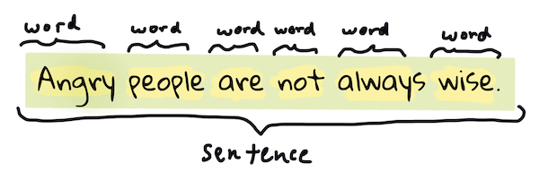

# Técnicas e tarefas frequentes do Processamento de Linguagem Natural

Para a maioria das tarefas de *processamento de linguagem natural*, o texto a ser processado precisa ser quebrado em partes e examinado, e os resultados precisam ser guardados ou cruzados com regras e data sets. Estas tarefas permitem que o programador obtenha _significado_, _intencionalidade_ ou a _frequência_ de termos e palavras em um texto.

## [Teste pré-aula](https://gray-sand-07a10f403.1.azurestaticapps.net/quiz/33?loc=ptbr)

Vamos descobrir técnicas frequentemente usadas no processamento de texto. Combinadas com aprendizado de máquina, estas técnicas ajudam você a analisar grandes quantidades de texto com eficiência. Contudo, antes de aplicar o aprendizado de máquina para estas tarefas, vamos entender os problemas enfrentados por um especialista de PLN (ou NLP).

## Tarefas frequentes para o PLN

Existem diferentes formas de analisar um texto em que você está trabalhando. Existem algumas tarefas que você pode executar e através destas você pode obter um entendimento melhor do texto e chegar a conclusões. Você geralmente as realiza em uma sequência.

### Tokenização

Provavelmente a primeira coisa que a maioria dos algoritmos de PLN precisa é fazer um split (quebra) do texto em tokens, que, na prática, são palavras. Apesar de parecer simples, considerar pontuação e delimitadores de palavras e orações de diferentes linguagens pode ser trabalhoso. Você pode ter que usar vários métodos para determinar os delimitadores.


> Tokenizando uma frase de **Orgulho e preconceito**. Infográfico por [Jen Looper](https://twitter.com/jenlooper)

### Embeddings

[Word embeddings](https://wikipedia.org/wiki/Word_embedding) (em português, podemos dizer vetores de palavras - apesar de o termo mais comum ser word embeddings) são uma forma de converter seus dados textuais em dados numéricos. Os embeddings são feitos de tal forma que as palavras com significado parecido ou palavras usadas em conjunto ficam agrupadas em clusters.


> "I have the highest respect for your nerves, they are my old friends." - Word embeddings de uma frase em **Orgulho e Preconceito**. Infográfico por [Jen Looper](https://twitter.com/jenlooper)

✅ Tente esta [ferramenta interessante](https://projector.tensorflow.org/) para experimentar com word embeddings. Clicar em uma palavra mostra o cluster (agrupamento) de palavras parecidas: 'brinquedo' está agrupado com 'disney', 'lego', 'playstation', e 'console'.

### Parsing & Marcação de Partes da Fala (Part of Speech Tagging - POS)

Toda palavra tokenizada pode ser marcada como parte da fala - um substantivo, verbo, ou adjetivo. A frase `A rápida raposa pula por cima do preguiçoso cão marrom` pode ser marcada com partes da fala da seguinte forma: raposa = substantivo, pula = verbo.


> Parseando/analisando sintaticamente uma frase de **Orgulho e Preconceito**. Infográfico por [Jen Looper](https://twitter.com/jenlooper)

Parsear é reconhecer quais palavras se relacionam entre si em uma frase - por exemplo, `A rápida raposa pula` é uma sequência com adjetivo-substantivo-verbo que difere da sequência `preguiçoso cão marrom`.  

### Frequência de palavras e frases

Um procedimento útil ao analisar um texto grande é construir um dicionário com toda palavra/frase de interesse e com a frequência ela aparece. A frase `A rápida raposa pula por cima do preguiçoso cão marrom` tem uma frequência de 1 para a palavra raposa.

Vamos observar um exemplo de texto onde contamos a frequência de palavras. O poema The Winners de Rudyard Kipling contém o seguinte verso:

> O poema não foi traduzido, porém, basta observar as frequências.

```output
What the moral? Who rides may read.
When the night is thick and the tracks are blind
A friend at a pinch is a friend, indeed,
But a fool to wait for the laggard behind.
Down to Gehenna or up to the Throne,
He travels the fastest who travels alone.
```

Dependendo do caso, pode ser necessário que a frequência de expressões considere variações de letras maiúsculas e minúsculas (case sensitive) ou não (case insensitive). Se desconsiderarmos a diferença entre maiúsculas e minúsculas, a expressão `a friend` possui frequência de 2 no poema e `the` tem frequência de 6, e a de `travels` é 2.

### N-gramas

Um texto pode ser dividido em sequências de palavras de certo tamanho, uma única palavra (unigrama), duas palavras (bigrama), três palavras (trigrama) ou qualquer número de palavras (n-gramas).

Por exemplo, `A rápida raposa pula por cima do preguiçoso cão marrom` com um n-grama de tamanho 2 produz os seguintes n-gramas:

1. a rápida 
2. rápida raposa 
3. raposa pula
4. pula por 
5. por cima 
6. cima do 
7. do preguiçoso 
8. preguiçoso cão 
9. cão marrom

Pode ser mais fácil visualizar o n-grama como uma caixa que desliza sobre a frase. Aqui está um exemplo dos n-gramas de 3 palavras, o n-grama está em negrito em cada frase:

A rápida raposa pula por cima do preguiçoso cão marrom

1.   <u>**A rápida raposa**</u> pula por cima do preguiçoso cão marrom
2.   A **<u>rápida raposa pula</u>** por cima do preguiçoso cão marrom
3.   A rápida **<u>raposa pula por</u>** cima do preguiçoso cão marrom
4.   A rápida raposa **<u>pula por cima</u>** do preguiçoso cão marrom
5.   A rápida raposa pula **<u>por cima do</u>** preguiçoso cão marrom
6.   A rápida raposa pula por **<u>cima do preguiçoso</u>** cão marrom
7.   A rápida raposa pula por cima **<u>do preguiçoso cão</u>** marrom
8.   A rápida raposa pula por cima do **<u>preguiçoso cão marrom</u>**


> N-grama de tamanho 3: Infográfico por [Jen Looper](https://twitter.com/jenlooper)

### Extração de sujeito e objeto

Na maioria das frases, existe um substantivo que é o sujeito ou o objeto da oração. Em português (e em inglês também), geralmente é possível identificá-los por serem precedidos por palavras como "a(s)" e "o(s)". Identificar o sujeito ou o objeto de uma oração é uma tarefa comum em PLN quando o objetivo é entender o significado de uma frase.

✅ Nas frases "Não sei precisar a hora, ou o lugar, ou o olhar, ou as palavras que lançaram as bases. Faz muito tempo. Eu já estava no meio antes de me dar conta de que havia começado.", você consegue identificar os sujeitos e os objetos?

Na frase `A rápida raposa pula por cima do preguiçoso cão marrom` existem dois substantivos **raposa** e **cão**, que, respectivamente, são sujeito e objeto.

### Análise de sentimento

Uma frase ou texto pode ser analisado para encontrar sentimento, ou avaliar o quão *positivo* ou *negativo* é. Sentimento é medido em *polaridade* e *objetividade/subjetividade*. Polaridade é medida de -1.0 a 1.0 (negativo a positivo) e objetividade/subjetividade é medida de 0.0 a 1.0 (mais objetivo a mais subjetivo).

✅ Mais tarde você irá aprender que existem diferentes formas de se determinar sentimento usando aprendizado de máquina (machine learning), mas um jeito de fazer é ter uma lista de palavras e frases categorizadas como positivas ou negativas por um especialista humano e aplicar este modelo ao texto para calcular a pontuação da polaridade. Você consegue perceber como isso poderia funcionar melhor em alguns casos e pior em outros?

### Inflexão/flexão

A inflexão/flexão é a variação de uma palavra. Exemplos incluem flexão de número (singular/plural), gênero (feminino/masculino) e grau (aumentativo/diminutivo).

### Lematização

Um *lema* é uma palavra (ou conjunto de palavras) que é raiz ou termo base, como, por exemplo, *voa*, *voou*, *voando* são variações (lexemas) do verbo *voar*.

Também existem databases úteis disponíveis para pesquisadores de PLN, particularmente:

### WordNet

[WordNet](https://wordnet.princeton.edu/) é uma database de palavras, sinônimos, antônimos e muitos outros detalhes para todas as palavras em muitas linguagens diferentes. É incrivelmente útil quando estamos tentando construir tradutores, verificadores de ortografia ou ferramentas de linguagem de qualquer tipo.

## Bibliotecas de PLN

Por sorte, você não precisa criar estas técnicas por si só, já que existem excelentes bibliotecas de Python disponíveis, que tornam o PLN muito mais acessível para desenvolvedores que não são especializados em processamento de linguagem natural ou machine learning. As próximas aulas incluem mais exemplos delas, mas aqui você irá aprender alguns exemplos úteis para te ajudar na próxima tarefa.

### Exercício - usando a biblioteca `TextBlob`

Iremos utilizar uma biblioteca chamada TextBlob, pois ela contém APIs convenientes para lidar com esse tipo de tarefa. O TextBlob "se apoia nos ombros dos gigantes [NLTK](https://nltk.org) e [pattern](https://github.com/clips/pattern), e funciona bem com ambos". Existe uma quantidade considerável de aprendizado de máquina embutido em sua API.

> Nota: Um guia inicial ([Quick Start](https://textblob.readthedocs.io/en/dev/quickstart.html#quickstart)) está disponível para o TextBlob e é recomendado para desenvolvedores Python.

Quando estiver tentando identificar *sujeitos e objetos*, o TextBlob oferece diversas opções de extratores para encontrar ambos. 

1. Obeserve o `ConllExtractor`.

    ```python
    from textblob import TextBlob
    from textblob.np_extractors import ConllExtractor
    # import and create a Conll extractor to use later 
    extractor = ConllExtractor()
    
    # later when you need a noun phrase extractor:
    user_input = input("> ")
    user_input_blob = TextBlob(user_input, np_extractor=extractor)  # note non-default extractor specified
    np = user_input_blob.noun_phrases                                    
    ```

    > O que está acontecendo aqui? O [ConllExtractor](https://textblob.readthedocs.io/en/dev/api_reference.html?highlight=Conll#textblob.en.np_extractors.ConllExtractor) é "um extrator de sujeito e objeto que usa parsing/análise sintática de chunks, e é treinado com o ConLL-2000 training corpus." O nome ConLL-2000 é em referência à conferência 2000 Conference on Computational Natural Language Learning. Todo ano a conferência sedia um workshop para lidar com um problema difícil de NLP e, em 2000, foi o noun phrase chunking (divisão da frase em subcomponentes - como substantivos e verbos). Um modelo foi treinado no Wall Street Journal, com "seções 15-18 como dados de treino (211727 tokens) e a seção 20 como dados de teste (47377 tokens)". Você pode ver os procedimentos utilizados [aqui](https://www.clips.uantwerpen.be/conll2000/chunking/) e os resultados [aqui](https://ifarm.nl/erikt/research/np-chunking.html).

### Desafio - melhorando seu bot com PLN

Na aula anterior você construiu um bot de perguntas e respostas bastante simples. Agora, você vai fazer Marvin um pouco mais simpático ao analisar seu input em busca do sentimento e imprimindo a resposta de forma a combinar com ele. Você também vai precisar identificar um `sujeito ou objeto` e perguntar sobre.

Seus passos quando estiver construindo um bot de conversação são:

1. Imprima instruções indicando como o usuário pode interagir com o bot
2. Comece um loop (laço)
   1. Aceite o input do usuário
   2. Se o usuário pedir para sair, então sair
   3. Processar o input do usuário e determinar resposta adequada de acordo com o sentimento expressado no input
   4. Se um sujeito ou objeto for identificado no sentimento, torne o bot mais variado e pergunte por mais inputs sobre aquele tópico
   5. Imprima a resposta
3. Voltar para o passo 2 (continuando o loop/laço)


Aqui está um trecho de código que determina o sentimento usando TextBlob. Note que só existem quatro *gradientes* de resposta a sentimento (você pode ter mais, se quiser):

> É feita uma divisão por valor de polaridade. Se estiver no intervalo, retorna respostas correspondentes: "Nossa, isso parece terrível", "Hmm, isso não parece muito bom", "Bom, isso parece positivo" e "Uau, isso soa ótimo"

```python
if user_input_blob.polarity <= -0.5:
  response = "Oh dear, that sounds bad. "
elif user_input_blob.polarity <= 0:
  response = "Hmm, that's not great. "
elif user_input_blob.polarity <= 0.5:
  response = "Well, that sounds positive. "
elif user_input_blob.polarity <= 1:
  response = "Wow, that sounds great. "
```

Aqui estão alguns outputs de exemplo para te guiar (input do usuário está nas linhas que começam com >):

```output
Hello, I am Marvin, the friendly robot.
You can end this conversation at any time by typing 'bye'
After typing each answer, press 'enter'
How are you today?
> I am ok
Well, that sounds positive. Can you tell me more?
> I went for a walk and saw a lovely cat
Well, that sounds positive. Can you tell me more about lovely cats?
> cats are the best. But I also have a cool dog
Wow, that sounds great. Can you tell me more about cool dogs?
> I have an old hounddog but he is sick
Hmm, that's not great. Can you tell me more about old hounddogs?
> bye
It was nice talking to you, goodbye!
```

Uma possível resposta para a tarefa está [aqui](../solution/bot.py)

✅ Checagem de conhecimento

1. Você acha que respostas simpáticas conseguiriam convencer uma pessoa a achar que o bot realmente entendeu o que ela disse?
2. Será que identificar sujeito e objeto tornam o bot mais convincente?
3. Porque você acha que extrair o sujeito e o objeto de uma oração é algo útil a se fazer?

---


## 🚀Desafio

Implemente o bot discutido acima da seção checagem de conhecimento e teste-o em amigos. O bot consegue enganá-los? Você consegue fazer seu bot mais convincente?

## [Teste pós-aula](https://gray-sand-07a10f403.1.azurestaticapps.net/quiz/34?loc=ptbr)

## Revisão & Autoestudo

Nas próximas aulas você vai aprender mais sobre análise de sentimento. Pesquise sobre esta técnica interessante em artigos como estes no [KDNuggets](https://www.kdnuggets.com/tag/nlp).

## Tarefa

[Faça um bot responder](assignment.pt-br.md)
