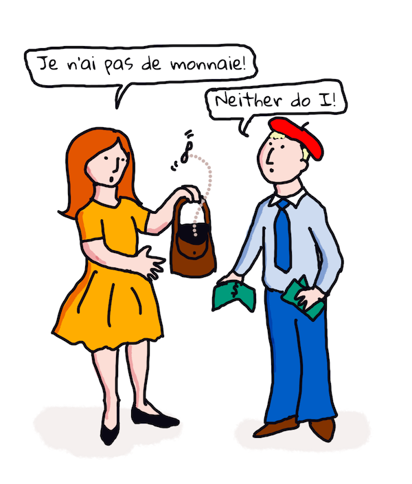

# Traducción y análisis de sentimiento con aprendizaje automático

En las lecciones anteriores aprendiste cómo construir un bot básico usando `TextBlob`, una biblioteca que embebe aprendizaje automático tras bambalinas para realizar tareas básicas de procesamiento del lenguaje natural (NLP) tales como extracción de frases nominales. Otro desafío importante en la lingüística computacional es la _traducción_ precisa de una oración de un idioma hablado o escrito a otro.

## [Examen previo a la lección](https://gray-sand-07a10f403.1.azurestaticapps.net/quiz/35?loc=es)

La traducción es siempre un problema difícil compuesto por el hecho que existen miles de idiomas y cada uno puede tener distintas reglas gramaticales. Un enfoque es convertir las reglas gramaticales formales para un idioma, como el Inglés, a una estructura no dependiente del idioma, y luego traducirlo al convertirlo de nuevo a otro idioma. Este enfoque significa que deberías realizar los siguientes pasos:

1. **Identificacción**. Identifica o etiqueta las palabras en el idioma de entrada en sustantivos, verbos, etc.
2. **Crea la traducción**. Produce una traducción directa de cada palabra en el formato del idioma objetivo.

### Oración de ejemplo, Inglés a Irlandés

En 'Inglés', la oración _I feel happy_ es de 3 palabras en el orden:

- **sujeto** (I)
- **verbo** (feel)
- **adjetivo** (happy)

Sin embargo, en el idioma 'Irlandés', la misma oración tiene una estructura gramatical muy diferente - emociones como "*happy*" o "*sad*" se expresan como `being *upon* you`.

La frase en Inglés `I feel happy` en Irlandés sería `Tá athas orm`. Una traducción *literal* sería `Happy is upon me`.

Un hablante Irlandés al traducir al Inglés diría `I feel happy`, no `Happy is upon me`, porque el entiende el significado de la oración, aún si las palabras y la estructura de la oración son diferentes.

El orden formal para la oración en Irlandés es:

- **verbo** (Tá or is)
- **adjetivo** (athas, or happy)
- **sujeto** (orm, or upon me)

## Traducción

Un programa de traducción simple podría traducir sólo las palabras, ignorando la estructura de la oración.

✅ Si has aprendido un segundo (o tercero o más) idioma como adulto, podrías haber comenzado pensando en tu idioma nativo, traduciendo un concepto palabra por palabra en tu cabeza al segundo idioma, y luego diciendo tu traducción. Esto es similar a lo que realizan los programas de traducción simple. ¡Es importante superar esta fase para lograr fluidez!

La traducción simple lleva a malas (y algunas veces divertidas) traducciones: `I feel happy` se traduce literalmente a `Mise bhraitheann athas` en Irlandés. Lo cual significa (literalmente) `me feel happy` y no es una oración Irlandesa válida. Aún cuando el Inglés e Irlandés son idiomas hablados en dos islas vecinas muy cercanas, son idiomas muy diferentes con diferentes estructuras gramaticales.

> Puedes ver más videos acerca de las tradiciones lingüísticas Irlandesas tales como [esta](https://www.youtube.com/watch?v=mRIaLSdRMMs)

### Enfoques del aprendizaje automático

Hasta ahora, hasta aprendido acerca de los enfoques a las reglas formales para el procesamiento del lenguaje natural. Otro enfoque es ignorar el significado de las palabras, y _en su lugar usar aprendizaje automático para detectar patrones_. Esto puede funcionar en traducciones si tienes demasiado texto (un *corpus*) o textos (*corpora*) tanto en el idioma origen como el destino.

Por ejemplo, considera el caso de *Orgullo y Prejuicio*, una novela Ingles muy conocidad escrita por Jane Austen in 1813. Si consultas el libro en Inglés y una traducción humana del libro en *Francés*, podrías detectar frases  en uno que están traducidas _idiomáticamente_ al otro. Lo cual harás en un minuto.

Por ejemplo, cuando una frase en Inglés como `I have no money` se traduce literalmente al Francés, se convertiría en `Je n'ai pas de monnaie`. "Monnaie" es un 'falso cognado' francés, ya que 'money' y 'monnaie' no son sinónimos. Una mejor traducción que la humana sería `Je n'ai pas d'argent`, porque transmite mejor el significado de no tener dinero (en lugar de 'loose change' lo cual es el significado de 'monnaie').



> Imagen de [Jen Looper](https://twitter.com/jenlooper)

Si un modelo de aprendizaje automático tiene suficientes traducciones humanas para construir un modelo sobre el cual basarse, puede mejorar la precisión de las traducciones al identificar patrones comunes en textos que han sido previamente traducidos por hablantes humanos expertos de ambos idiomas.

### Ejercicio - traducción

Puedes usar `TextBlob` para traducir oraciones. Prueba la famosa primer línea de **Orgullo y Prejuicio**:

```python
from textblob import TextBlob

blob = TextBlob(
    "It is a truth universally acknowledged, that a single man in possession of a good fortune, must be in want of a wife!"
)
print(blob.translate(to="fr"))

```

`TextBlob` hace un muy buen trabajo al traducir: "C'est une vérité universellement reconnue, qu'un homme célibataire en possession d'une bonne fortune doit avoir besoin d'une femme!".

Se podría discutir que la traducción de TextBlob es mucho más exacta, que la traducción Francesa de 1932 del libro por V. Leconte y Ch. Pressoir:

"C'est une vérité universelle qu'un célibataire pourvu d'une belle fortune doit avoir envie de se marier, et, si peu que l'on sache de son sentiment à cet egard, lorsqu'il arrive dans une nouvelle résidence, cette idée est si bien fixée dans l'esprit de ses voisins qu'ils le considèrent sur-le-champ comme la propriété légitime de l'une ou l'autre de leurs filles."

En este caso, la traducción proporcionada por el aprendizaje automático realiza un mejor trabajo que el traductor humano quien innecesariamente agrega palabras a las dichas por el autor para dar 'claridad'.

> ¿Qué pasa aquí? ¿y por qué TextBlob es tan bueno al traducir? Bien, tras bambalinas, usa Google translate, una IA sofisticada capaz de analizar millones de frases y predecir las mejores cadenas para la tarea en cuestión. No ocurre nada manual aquí y tienes una conexión a internet para usar `blob.translate`.

✅ Prueba unas oraciones más. ¿Cuál es mejor, la traducción del aprendizaje automático o la humana? ¿En qué casos?

## Análisis de sentimiento

Otra área donde el aprendizaje automático funciona muy bien es el análisis de sentimiento. Un enfoque de no aprendizaje automático al sentimiento es identificar las palabras y frases que son 'positivas' y 'negativas'. Luego, dada una nueva porción de texto, calcular el valor total de las palabras positivas, negativas y neutras para identificar el sentimiento en general.

Este enfoque se puede engañar fácilmente como ya has visto en la tarea de Marvin - La oración `Great, that was a wonderful waste of time, I'm glad we are lost on this dark road` es una oración sarcástica y de sentimiento negativo, pero el algoritmo simple detecta 'great', 'wonderful', 'glad' como positivas y 'waste', 'lost' y 'dark' como negativas. El sentimiento general está influenciado por estas palabras contradictorias.

✅ Detente un segundo y piensa en cómo transmitimos el sarcasmo como hablantes humanos. La inflexión del tono juega un gran rol. Intenta decir la frase "Well, that film was awesome" de distintas formas para descubrir cómo tu voz transmite el significado.

### Enfoques del aprendizaje automático

El enfoque del aprendizaje automático debería ser reunir manualmente los cuerpos de texto negativos y positivos - tweets, o reseñar de películas, o cualquier otra cosa donde el ser humano ha dado una calificación **y** una opinión escrita. Luego las técnicas de procesamiento del lenguaje natural pueden ser aplicadas a las opiniones y calificaciones, para que surjan los patrones (por ejemplo, las reseñas positivas de películas tienden a usar la frase 'merecedora del Oscar' más que las reseñas negativas, o las reseñas positivas de restaurantes dicen 'gourmet' mucho más que 'disgusting').

> ⚖️ **Ejemplo**: Si trabajaste en la oficina de un político y se debatía alguna ley nueva, los constituyentes pueden escribir a la oficina con correos electrónicos emitiendo su apoyo o rechazo a esa nueva ley. Digamos que te asignaron leer los correos electrónicos y ordenarlos en 2 pilas, *for* y *against*. Si hubiera muchos correos electrónicos, podrías estar abrumado al intentar leerlos todos. ¿No sería genial que un bot pudiera leerlos todos por ti, entenderlos y decirte a qué pila pertenecen?
>
> Una forma de lograrlo es usar aprendizaje automático. Entrenarías al modelo con una porción de los correos electrónicos de los que están en contra (*against*) y a favor (*for*). El modelo tendería a asociar frases y palabras con los lados en contra y a favor, *pero no entendería nada del contenido*, a menos que ciertas palabras y patrones fuesen más probables de aparecer en un correo clasificado como *against* o *for*. Podrías probarlo con algunos correo electrónicos que no usaste para entrenar el modelo, y ver si llegó a la misma conclusión que tú. Luego, una vez que estuvieses satisfecho con la precisión del modelo, podrías procesar correos posteriores sin necesidad de leer cada uno.

✅ ¿Este proceso suena como algún proceso que has usado en lecciones previas?

## Ejercicio - oraciones sentimentales

El sentimiento se mide con una *polaridad* de -1 a 1, donde -1 es el sentimiento más negativo, y 1 el más positivo. El sentimiento también puede medirse con el puntaje de 0 a 1, para la objetividad (0) y la subjetividad (1).

Da un vistazo más a *Orgullo y Prejuicio* de Jane Austen. El texto está disponible en [Project Gutenberg](https://www.gutenberg.org/files/1342/1342-h/1342-h.htm). la muestra de abajo muestra un pequeño programa el cual analiza el sentimiento de las primer y última oraciones del libro y muestra su polaridad de sentimiento y el puntaje subjetivo/objetivo.

Deberías usar la biblioteca `TextBlob` (descrita arriba) para determinar el sentimiento (`sentiment`) (no tienes que escribir tu propia calculadora de sentimiento) en la siguiente tarea.

```python
from textblob import TextBlob

quote1 = """It is a truth universally acknowledged, that a single man in possession of a good fortune, must be in want of a wife."""

quote2 = """Darcy, as well as Elizabeth, really loved them; and they were both ever sensible of the warmest gratitude towards the persons who, by bringing her into Derbyshire, had been the means of uniting them."""

sentiment1 = TextBlob(quote1).sentiment
sentiment2 = TextBlob(quote2).sentiment

print(quote1 + " has a sentiment of " + str(sentiment1))
print(quote2 + " has a sentiment of " + str(sentiment2))
```

Verás la siguiente salida:

```output
It is a truth universally acknowledged, that a single man in possession of a good fortune, must be in want # of a wife. has a sentiment of Sentiment(polarity=0.20952380952380953, subjectivity=0.27142857142857146)

Darcy, as well as Elizabeth, really loved them; and they were
     both ever sensible of the warmest gratitude towards the persons
      who, by bringing her into Derbyshire, had been the means of
      uniting them. has a sentiment of Sentiment(polarity=0.7, subjectivity=0.8)
```

## Desafío - revisa la polaridad de sentimiento

Tu tarea es determinar, usando la polaridad de sentimiento, si *Orgullo y Prejuicio* tiene más oraciones absolutamente positivas que absolutamente negativas. Para esta tarea, puedes asumir que un puntaje de polaridad de 1 o -1 es absolutamente positivo o negativo, respectivamente.

**Pasos:**

1. Descarga una [copia de Orgullo y Prejuicio](https://www.gutenberg.org/files/1342/1342-h/1342-h.htm) de Project Gutenberg como archivo .txt. Elimina los metadatos al inicio y final del archivo, dejando solo el texto original.
2. Abre el archivo en python y extrae los contenidos como una cadena.
3. Crea un TextBlob usando la cadena del libro
4. Analiza cada oración en el libro dentro de un ciclo
   1. Si la polaridad es 1 o -1 almacena la oración en un arreglo o lista de mensajes positivos o negativos
5. Al final, imprime todas las oraciones positivas y negativas (de forma separada) y el número de cada una.

Aquí tienes una [solución de muestra](../solution/notebook.ipynb).

✅ Verificación de conocimiento

1. El sentimiento se basa en las palabras usadas en la oración, pero ¿el código *entiende* las palabras?
2. ¿Piensas que la polaridad del sentimiento es precisa, o en otras palabras, estás *de acuerdo* con los puntajes?
   1. En particular, ¿estás de acuerdo o en desacuerdo con la polaridad **positiva** absoluta de las siguientes oraciones?
      * “What an excellent father you have, girls!” said she, when the door was shut.
      * “Your examination of Mr. Darcy is over, I presume,” said Miss Bingley; “and pray what is the result?” “I am perfectly convinced by it that Mr. Darcy has no defect.
      * How wonderfully these sort of things occur!
      * I have the greatest dislike in the world to that sort of thing.
      * Charlotte is an excellent manager, I dare say.
      * “This is delightful indeed!
      * I am so happy!
      * Your idea of the ponies is delightful.
   2. Las siguientes 3 oraciones fueron puntuadas con un sentimiento positivo absoluto, pero leyendo atentamente, esas no son oraciones positivas. ¿Por qué el análisis de sentimiento piensa que fueron oraciones positivas?
      * Happy shall I be, when his stay at Netherfield is over!” “I wish I could say anything to comfort you,” replied Elizabeth; “but it is wholly out of my power.
      * If I could but see you as happy!
      * Our distress, my dear Lizzy, is very great.
   3. ¿Estás de acuerdo o en desacuerdo con la polaridad absoluta **negativa** de las siguientes oraciones?
      - Everybody is disgusted with his pride.
      - “I should like to know how he behaves among strangers.” “You shall hear then—but prepare yourself for something very dreadful.
      - The pause was to Elizabeth’s feelings dreadful.
      - It would be dreadful!

✅ Cualquier aficionado de Jane Austen entenderá que ella usa frecuentemente sus libros para criticar los aspectos más ridículo de la sociedad de la Regencia Inglesa. Elizabeth Bennett, el personaje principal en *Orgullo y Prejuicio*, es una aguda observadora social (como la autora) y su lenguaje es a menudo muy matizado. Incluso el Sr. Darcy (el interés amoroso en la historia) nota el lenguaje juguetón y burlón de Elizabeth: "I have had the pleasure of your acquaintance long enough to know that you find great enjoyment in occasionally professing opinions which in fact are not your own."

---

## 🚀Desafío

¿Puedes hacer a Marvin aún mejor al extraer otras características de la entrada del usuario?

## [Examen posterior a la lección](https://gray-sand-07a10f403.1.azurestaticapps.net/quiz/36?loc=es)

## Revisión y autoestudio

Hay varias formas de extraer el sentimiento del texto. Piensa en las aplicaciones de negocios que podrían hacer uso de esta técnica. Piensa cómo puede salir mal. Lee más acerca de los sistemas sofisticados listos para empresas que analizan  el sentimiento tal como [Azure Text Analysis](https://docs.microsoft.com/azure/cognitive-services/Text-Analytics/how-tos/text-analytics-how-to-sentiment-analysis?tabs=version-3-1?WT.mc_id=academic-77952-leestott). Prueba algunas de las oraciones de Orgullo y Prejuicio de arriba y observa si se pueden detectar matices.

## Asignación

[Licencia poética](assignment.es.md)
