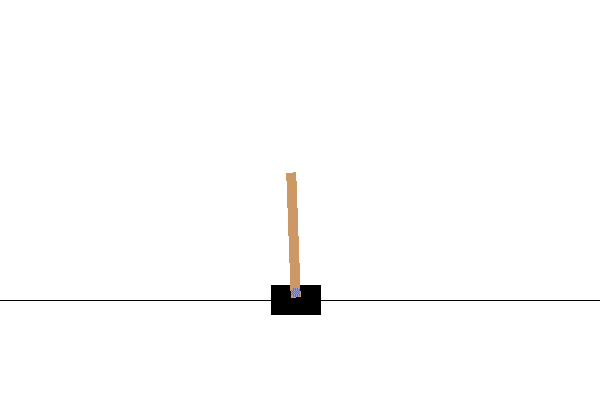

# CartPole 스케이팅

이전 강의에서 풀었던 문제는 장난감 문제처럼 보일 수 있고, 실제 시나리오에서 진짜 적용되지 않습니다. 체스나 바둑을 즐기는 것을 포함한 - 시나리오에 많은 실제 문제와 공유하기 때문에, 이 케이스는 아닙니다. 주어진 룰과 **discrete state**를 보드가 가지고 있기 때문에 비슷합니다. 

## [강의 전 퀴즈](https://gray-sand-07a10f403.1.azurestaticapps.net/quiz/47/)

## 소개

이 강의에서 Q-Learning의 같은 원칙을 하나 이상의 실수가 주어진 state인, **continuous state** 문제로 적용할 예정입니다. 다음 문제를 다루게 됩니다:

> **문제**: 만약 Peter가 늑대로부터 도망가길 원한다면, 빠르게 움직일 필요가 있습니다. Peter가 특히 Q-Learning으로, 밸런스를 유지하면서, 스케이트를 배울 수 있는지 보게 됩니다.


> Peter와 친구들은 늑대로부터 도망갈 창의력을 얻습니다! Image by [Jen Looper](https://twitter.com/jenlooper)

**CartPole** 문제로 알려진 밸런스있는 간단한 버전을 사용할 예정입니다. cartpole 월드에서, 왼쪽과 오른쪽으로 움직일 수 있는 수평 슬라이더를 가지며, 목표는 슬라이더의 위쪽에 있는 수직 폴을 밸런스하는 것입니다.


## 전제 조건

이 강의에서, **OpenAI Gym**으로 불리는 라이브러리를 사용해서 다른 **environments**를 시뮬레이션합니다. 이 강의의 코드를 로컬에서 (에시. from Visual Studio Code), 새로운 윈도우로 열어서 시뮬레이션할 수 있습니다. 코드를 온라인으로 실행할 때는, [here](https://towardsdatascience.com/rendering-openai-gym-envs-on-binder-and-google-colab-536f99391cc7)에서 설명된 것처럼, 코드를 약간 트윅할 필요가 있습니다.

## OpenAI Gym

이전 강의에서, 게임의 룰과 state는 스스로 정의했던 `Board` 클래스로 주어졌습니다. balancing pole의 물리학 그늘에서 시뮬레이션하는, 특별한 **simulation environment**를 사용할 예정입니다. 가장 인기있는 reinforcement learning 알고리즘을 훈련하기 위한 시뮬레이션 환경은 [OpenAI](https://openai.com/)애서 관리하는, [Gym](https://gym.openai.com/)이라고 불립니다. 이 gym을 사용해서 cartpole 시뮬레이션부터 Atari 게임까지 다양한 **environments**를 만들 수 있습니다.

> **노트**: OpenAI Gym [here](https://gym.openai.com/envs/#classic_control)에서 사용할 수 있는 다양한 환경을 볼 수 있습니다.

먼저, gym을 설치하고 필요한 라이브러리를 가져옵니다 (code block 1):

```python
import sys
!{sys.executable} -m pip install gym 

import gym
import matplotlib.pyplot as plt
import numpy as np
import random
```

## 연습 - cartpole 환경 초기화

cartpole balancing 문제를 풀려면, 대상 환경을 초기화할 필요가 있습니다.각 환경은 이렇게 연결되었습니다:

- **Observation space** 은 환경으로부터 받는 정보의 구조를 정의합니다. cartpole 문제라면, 폴의 위치, 속도와 일부 기타 값을 받습니다.

- **Action space** 는 가능한 액션을 정의합니다. 이 케이스에서 action space는 추상적이고, 두 액션 **left**와 **right**로 이루어져 있습니다. (code block 2)

1. 초기화하려면, 다음 코드를 타이핑합니다:

    ```python
    env = gym.make("CartPole-v1")
    print(env.action_space)
    print(env.observation_space)
    print(env.action_space.sample())
    ```

어떻게 환경이 동작하는지 보려면, 100 번 짧게 시뮬레이션 돌립니다. 각 단계에서, 수행할 액션 중 하나를 제공합니다 - 이 시뮬레이션에서 `action_space`로 액션을 랜덤 선택하게 됩니다.

1. 아래 코드를 실행하고 어떤 결과가 나오는지 봅니다.

    ✅ 로컬 설치한 Python에서 이 코드를 실행하도록 권장한다는 점을 기억합니다! (code block 3)

    ```python
    env.reset()
    
    for i in range(100):
       env.render()
       env.step(env.action_space.sample())
    env.close()
    ```

    이 이미지와 비슷한 내용이 보여지게 됩니다:

    

1. 시뮬레이션하는 동안, 액션 방식을 판단하기 위해서 관찰할 필요가 있습니다. 사실, step 함수는 현재 관측치, 보상 함수, 그리고 시뮬레이션을 지속하거나 끝내고자 가리키는 종료 플래그를 반환합니다: (code block 4)

    ```python
    env.reset()
    
    done = False
    while not done:
       env.render()
       obs, rew, done, info = env.step(env.action_space.sample())
       print(f"{obs} -> {rew}")
    env.close()
    ```

    노트북 출력에서 이렇게 보이게 됩니다:

    ```text
    [ 0.03403272 -0.24301182  0.02669811  0.2895829 ] -> 1.0
    [ 0.02917248 -0.04828055  0.03248977  0.00543839] -> 1.0
    [ 0.02820687  0.14636075  0.03259854 -0.27681916] -> 1.0
    [ 0.03113408  0.34100283  0.02706215 -0.55904489] -> 1.0
    [ 0.03795414  0.53573468  0.01588125 -0.84308041] -> 1.0
    ...
    [ 0.17299878  0.15868546 -0.20754175 -0.55975453] -> 1.0
    [ 0.17617249  0.35602306 -0.21873684 -0.90998894] -> 1.0
    ```

    시뮬레이션의 각 단계에서 반환되는 관찰 백터는 다음 값을 포함합니다:
    - Position of cart
    - Velocity of cart
    - Angle of pole
    - Rotation rate of pole

1. 이 숫자의 최소 최대 값을 가져옵니다: (code block 5)

    ```python
    print(env.observation_space.low)
    print(env.observation_space.high)
    ```

    각 시뮬레이션 단계의 보상 값은 항상 1이라는 점을 알 수 있습니다. 목표는 가장 긴 기간에 폴을 합리적으로 수직 위치에 유지하며, 가능한 오래 생존하는 것입니다.

    ✅ 사실, the CartPole 시뮬레이션은 100번 넘는 시도에서 평균 195개 보상을 얻을 수 있게 관리되면 해결된 것으로 여깁니다.

## State discretization

Q-Learning에서, 각 state에서 할 것을 정의하는 Q-Table을 만들 필요가 있습니다. 이렇게 하려면, state가 **discreet**으로 되어야하고, 더 정확해지면, 한정된 discrete 값 숫자를 포함해야 합니다. 그래서, 관측치를 어떻게든지 **discretize** 해서, 한정된 state 세트와 맵핑할 필요가 있습니다.

이렇게 할 수 있는 몇 방식이 있습니다:

- **Divide into bins**. 만약 특정 값의 간격을 알고있다면, 간격을 **bins**의 수로 나누고, 값을 속해있는 bin 숫자로 변환할 수 있습니다. numpy [`digitize`](https://numpy.org/doc/stable/reference/generated/numpy.digitize.html) 메소드로 마무리 지을 수 있습니다. 이 케이스에서, 디지털화를 선택하기 위해서 bin의 수를 기반했기 때문에, state 크기를 정확히 알게 됩니다.
  
✅ linear interpolation으로 값을 한정된 간격 (say, from -20 to 20)에 가져오고, 반올림해서 숫자를 정수로 변환할 수 있습니다. 특별하게 입력 값의 정확한 범위를 모른다면, state의 크기에서 조금만 컨트롤하게 둡니다. 예시로, 4개 중에 2개 값은 상/하 한도가 없으므로, state 개수에서 무한으로 결과가 나올 수 있습니다. 

예시에서, 두 번째 접근 방식을 사용하겠습니다. 나중에 알게 되듯이, 정의하지 못한 상/하 한도에도, 이 값은 특정하게 한정된 간격에 벗어난 값을 드물게 가지므로, 극단적인 값을 가진 state는 매우 드뭅니다.

1. 여기는 모델에서 관측치를 가지고, 4개 정수 값의 튜플을 만드는 함수입니다: (code block 6)

    ```python
    def discretize(x):
        return tuple((x/np.array([0.25, 0.25, 0.01, 0.1])).astype(np.int))
    ```

1. bin으로 다른 discretization 방식도 찾아봅니다: (code block 7)

    ```python
    def create_bins(i,num):
        return np.arange(num+1)*(i[1]-i[0])/num+i[0]
    
    print("Sample bins for interval (-5,5) with 10 bins\n",create_bins((-5,5),10))
    
    ints = [(-5,5),(-2,2),(-0.5,0.5),(-2,2)] # intervals of values for each parameter
    nbins = [20,20,10,10] # number of bins for each parameter
    bins = [create_bins(ints[i],nbins[i]) for i in range(4)]
    
    def discretize_bins(x):
        return tuple(np.digitize(x[i],bins[i]) for i in range(4))
    ```

1. 지금부터 짧은 시뮬레이션을 실행하고 분리된 환경 값을 관찰합니다. 자유롭게 `discretize`와 `discretize_bins`를 시도하고 다른점이 있다면 봅시다.

    ✅ discretize_bins는 0-베이스인, bin 숫자를 반환합니다. 그래서 0 주변 입력 변수의 값은 간격의 중간에서 (10) 숫자를 반환합니다. discretize에서, 출력 값의 범위에 대해서 신경쓰지 못하고, negative를 허용하므로, state 값은 바뀌지 못하고, 0은 0에 대응합니다. (code block 8)

    ```python
    env.reset()
    
    done = False
    while not done:
       #env.render()
       obs, rew, done, info = env.step(env.action_space.sample())
       #print(discretize_bins(obs))
       print(discretize(obs))
    env.close()
    ```

    ✅ 만약 환경 실행이 어떻게 되는지 보려면 env.render로 시작되는 줄을 주석 해제합니다. 그렇지 않으면 빠르게, 백그라운드에서 실행할 수 있습니다. Q-Learning 프로세스가 진행되면서 "invisible" 실행으로 사용할 수 있습니다.

## Q-Table 구조

이전 강의에서, state는 0부터 8까지 숫자의 간단한 쌍이라서, 8x8x2 형태 numpy tensor로 Q-Table를 표현하는 게 편리합니다. 만약 bins discretization를 사용하면, state vector의 크기를 알 수 있으므로, 같은 접근 방식을 사용하고 20x20x10x10x2 형태 배열로 state를 나타냅니다 (여기 2 개는 액션 공간의 차원이고, 첫 차원은 관찰 공간에서 각 파라미터를 사용하고자 선택된 bin의 숫자에 해당합니다).

그러나, 가끔은 관찰 공간의 정확한 넓이를 알 수 없습니다. `discretize` 함수의 케이스에서, 원본 값의 일부는 결합되지 않으므로, state가 특정한 제한 사항에 놓여있는지 확신할 수 없습니다. 따라서, 조금 다른 접근 방식으로 사용하고 dictionary로 Q-Table을 표현할 예정입니다.

1. dictionary 키로 *(state,action)* 쌍을 사용하고, 값을 Q-Table 엔트리 값에 대응합니다. (code block 9)

    ```python
    Q = {}
    actions = (0,1)
    
    def qvalues(state):
        return [Q.get((state,a),0) for a in actions]
    ```

    여기 가능한 모든 액션에 해당하는 state로 주어진 Q-Table 값의 리스트를 반환하는, `qvalues()` 함수도 정의합니다. 만약 앤트리가 Q-Table에 없다면, 기본적으로 0을 반환합니다.

## Q-Learning 시작합시다

지금부터 Peter에게 밸런스를 가르치기 직전입니다!

1. 먼저, 일부 hyperparameters를 맞춥시다: (code block 10)

    ```python
    # hyperparameters
    alpha = 0.3
    gamma = 0.9
    epsilon = 0.90
    ```

    여기, `alpha`는 각 단계에서 Q-Table의 현재 값을 어느정도 범위로 조정할 수 있게 정의하는 **learning rate**입니다. 이전 강의에서는 1로 시작하고, 훈련하는 동안 `alpha`를 낮은 값으로 낮춥니다. 이 예시에서 간단하게 하고자 변함없이 그대로 두고, `alpha` 값을 조정하는 실험을 나중에 진행할 수 있습니다. 

    `gamma`는 현재 보상을 넘는 미래 보상에 얼마나 우선 순위를 두어야 할지 나타내는 **discount factor**입니다.

    `epsilon`는 exploitation보다 exploration을 선호하는지 안 하는지에 관해 결정하는 **exploration/exploitation factor**입니다. 알고리즘에서, `epsilon` 퍼센트의 케이스는 Q-Table 값에 따라서 다음 액션을 선택하고, 남는 케이스에서는 랜덤 액션을 수행할 예정입니다. 전에 본 적 없는 검색 공간의 영역을 탐색할 수 있습니다.

    ✅ 밸런싱의 측면에서 - 랜덤 액션을 (exploration) 선택하는 것은 잘못된 방향으로 랜덤 펀치를 날릴 수 있으며, pole은 이 "실수"에서 밸런스를 복구하는 방식을 배우게 됩니다.

### 알고리즘 개선

이전 강의의 알고리즘을 두 번 개선할 수 있습니다:

- 여러 번 시뮬레이션해서, **평균 누적 보상을 계산합니다**. 각자 5000번 반복하면서 프로세스를 출력하고, 이 시간 동안에 누적 보상을 계산합니다.  195 포인트보다 더 얻었다면 - 필수보다 더 높은 퀄리티로, 문제를 해결한 것으로 간주한다는 점을 의미합니다.

- `Qmax`로, **최대 평균 누적 결과를 계산하고**, 이 결과와 일치하는 Q-Table에 저장합니다. 훈련을 할 때 가끔 평균 누적 결과가 드랍되기 시작하는 것을 알아챌 수 있고, 훈련 중 관찰된 좋은 모델에 해당하는 Q-Table의 값을 그대로 두고 싶습니다.

1. plot을 진행하기 위해서 `rewards` vector로 각 시뮬레이션의 누적 보상을 얻을 수 있습니다. (code block  11)

    ```python
    def probs(v,eps=1e-4):
        v = v-v.min()+eps
        v = v/v.sum()
        return v
    
    Qmax = 0
    cum_rewards = []
    rewards = []
    for epoch in range(100000):
        obs = env.reset()
        done = False
        cum_reward=0
        # == do the simulation ==
        while not done:
            s = discretize(obs)
            if random.random()<epsilon:
                # exploitation - chose the action according to Q-Table probabilities
                v = probs(np.array(qvalues(s)))
                a = random.choices(actions,weights=v)[0]
            else:
                # exploration - randomly chose the action
                a = np.random.randint(env.action_space.n)
    
            obs, rew, done, info = env.step(a)
            cum_reward+=rew
            ns = discretize(obs)
            Q[(s,a)] = (1 - alpha) * Q.get((s,a),0) + alpha * (rew + gamma * max(qvalues(ns)))
        cum_rewards.append(cum_reward)
        rewards.append(cum_reward)
        # == Periodically print results and calculate average reward ==
        if epoch%5000==0:
            print(f"{epoch}: {np.average(cum_rewards)}, alpha={alpha}, epsilon={epsilon}")
            if np.average(cum_rewards) > Qmax:
                Qmax = np.average(cum_rewards)
                Qbest = Q
            cum_rewards=[]
    ```

이 결과에서 알 수 있습니다:

- **목표에 가까워집니다**. 시뮬레이션을 100+번 넘게 계속 하면 195개 누적 보상을 얻는 목표에 가까워지거나, 실제로 달성했을 수도 있습니다! 만약 작은 숫자를 얻더라도, 평균적으로 5000번 넘게 하고, 드러나있는 표준으로도 100번만 수행해도 되므로, 여전히 알 수 없습니다.
  
- **보상이 드랍되기 시작합니다**. 가끔 보상이 드랍되기 시작하면, 시뮬레이션을 안 좋게 만들어서 Q-Table에 이미 학습한 값을 "destroy"할 수 있다는 점을 의미합니다.

이 관측치는 훈련 프로세스를 plot하면, 더 명확히 보입니다.

## 훈련 프로세스 Plotting

훈련 하면서, `rewards` vector로 각 반복에서 누적 보상 값을 얻었습니다. 여기에서 반복 숫자로 plot할 때 볼 수 았습니다:

```python
plt.plot(rewards)
```


그래프에서, 추계학 훈련 프로세스의 특성으로 훈련 세션 길이가 매우 달라지므로, 모든 것을 말할 수 없습니다. 이 그래프를 잘 이해하도록, 훈련 시리즈로 **running average**를 계산할 수 있습니다. 100으로 합시다. `np.convolve`으로 편하게 마무리 지을 수 있습니다: (code block 12)

```python
def running_average(x,window):
    return np.convolve(x,np.ones(window)/window,mode='valid')

plt.plot(running_average(rewards,100))
```


## 다양한 hyperparameters

더 안정적으로 훈련하기 위해서, 훈련 중에 일부 hyperparameters를 조정하는 게 괜찮습니다. 이런 특징이 있습니다:

- **For learning rate**, `alpha`는, 1에 근접한 값으로 시작하고, 파라이터를 계속 줄이게 됩니다. 시간이 지나고, Q-Table에서 좋은 확률 값을 얻으므로, 새로운 값으로 완전히 덮지않고, 살짝 조정하게 됩니다.

- **Increase epsilon**. 덜 explore하고 더 exploit하려고, `epsilon`을 천천히 증가하기 원할 수 있습니다. `epsilon`의 낮은 값으로 시작하고, 1에 가까이 올리는 것이 괜찮습니다.

> **Task 1**: hyperparameter 값으로 플레이하고 높은 누적 보상에 달성할 수 있는지 확인합니다. 195보다 더 얻을 수 있나요?

> **Task 2**: 정식으로 문제를 해결하려면, 100번 연속으로 195개 평균 보상을 얻을 필요가 있습니다. 훈련하면서 측정하고 공식적으로 문제를 해결했는지 확인합니다!

## 실행 결과 보기

실제로 훈련된 모델이 어떻게 동작하는지 보는 것은 흥미롭습니다. 시뮬레이션을 돌리고 Q-Table 확률 분포에 따라서 샘플링된, 훈련을 하는 동안 같은 액션 선택 전략으로 따라갑니다: (code block 13)

```python
obs = env.reset()
done = False
while not done:
   s = discretize(obs)
   env.render()
   v = probs(np.array(qvalues(s)))
   a = random.choices(actions,weights=v)[0]
   obs,_,done,_ = env.step(a)
env.close()
```

이렇게 보입니다:


---

## 🚀 도전

> **Task 3**: 여기, Q-Table의 최종 복사본을 사용하는 게, 최고가 아닐 수 있습니다. 최적-성능을 내는 Q-Table로 `Qbest` 변수를 저장했다는 점을 기억합니다! `Qbest`를 `Q`에 복사한 최적-성능을 내는 Q-Table로 같은 예시를 시도하고 다른 점을 파악합니다.

> **Task 4**: 여기에는 각 단계에서 최상의 액션을 선택하지 않고, 일치하는 확률 분포로 샘플링했습니다. 가장 높은 Q-Table 값으로, 항상 최상의 액션을 선택하면 더 합리적인가요? `np.argmax` 함수로 높은 Q-Table 값에 해당되는 액션 숫자를 찾아서 마무리할 수 있습니다. 이 전략을 구현하고 밸런스를 개선했는지 봅니다.

## [강의 후 퀴즈](https://gray-sand-07a10f403.1.azurestaticapps.net/quiz/48/)

## 과제: [Train a Mountain Car](../assignment.md)

## 결론

지금부터 agent에 게임에서 원하는 state를 정의하는 보상 함수로 제공하고, 검색 공간을 지능적으로 탐색할 기회를 주며 좋은 결과로 도달하도록 어떻게 훈련하는지 배웠습니다. discrete적이고 연속 환경의 케이스에서 Q-Learning 알고리즘을 성공적으로 적용했지만, discrete적인 액션으로 했습니다.

Atari 게임 스크린에서의 이미지처럼, 액션 상태 또한 연속적이고, 관찰 공간이 조금 더 복잡해지는 시뮬레이션을 공부하는 것도 중요합니다. 이 문제는 좋은 결과에 도달하기 위해서, neural networks처럼, 더 강한 머신러닝 기술을 자주 사용해야 합니다. 이러한 더 구체적인 토픽은 곧 오게 될 더 어려운 AI 코스의 주제입니다.
