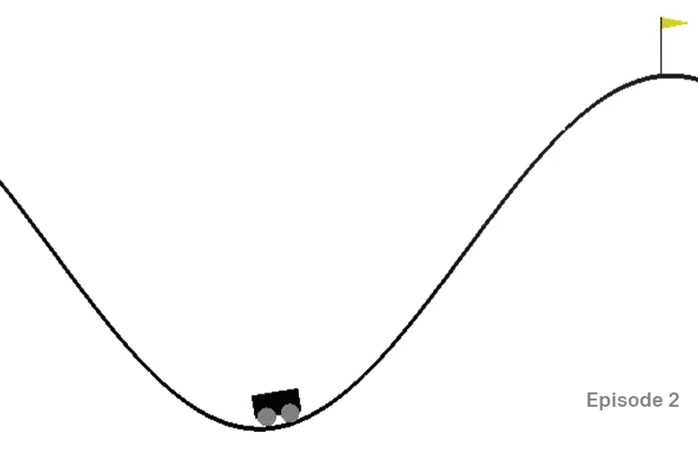

# Train Mountain Car

[OpenAI Gym](http://gym.openai.com)은 모든 환경이 동일한 API를 — 즉 동일한 `reset`, `step`, `render` 메서드 및 <b>상태 공간(action space)</b>과 <b>상태/관측 공간(observation space)</b>의 추상화를 — 제공하도록 설계되었습니다. 그러므로 다양한 상황에서 최소한의 코드 변경으로 동일한 강화학습 알고리즘을 다른 환경에 적용하는 것이 가능해집니다.

## A Mountain Car Environment

[Mountain Car 환경](https://gym.openai.com/envs/MountainCar-v0/)에는 골짜기에 갇힌 자동차가 있습니다:

이 환경에서의 목표는 각 단계에서 다음 동작 중 하나를 수행해 골짜기에서 나와 깃발을 잡는 것입니다:

| 값 | 의미           |
| -- | -------------- |
| 0  | 왼쪽으로 가속   |
| 1  | 가속 중지      |
| 2  | 오른쪽으로 가속 |

하지만 이 문제의 핵심은 자동차의 엔진이 한 번에 산을 오를 수 있을 만큼 강력하지 않다는 데에 있습니다. 따라서 목표 지점에 도달하기 위한 유일한 방법은 앞뒤로 자동차를 움직여 추진력을 얻는 것입니다.

상태/관측 공간은 두 개의 값만으로 구성됩니다:

| 값  | 상태/관측     | 최솟값 | 최댓값 |
| --- | ------------ | ----- | ------ |
|  0  | 자동차의 위치 | -1.2  | 0.6    |
|  1  | 자동차의 속도 | -0.07 | 0.07   |

산악용 자동차의 보상 체계는 다소 까다롭습니다:

 * 에이전트(agent)가 산 전상의 깃발(위치 = 0.5)에 도달하면 0의 보상이 지급됩니다.
 * 에이전트의 위치가 0.5 미만일 경우 -1의 보상이 지급됩니다.

자동차의 위치가 0.5 이상이거나 에피소드(episode)의 길이가 200 이상이면 에피소드가 종료됩니다.

## 설명

강화학습 알고리즘을 적용해 산악용 자동차 문제를 해결해 보시기 바랍니다. 기존 [notebook.ipynb](../notebook.ipynb)의 코드로 시작하면 됩니다 — 새로운 환경으로 대체하고, 상태 이산화(state discretization) 함수들을 변경하고, 기존 알고리즘을 최소한의 코드 수정으로 훈련하도록 해 보세요. 그리고 초매개변수를 조정해 결과를 최적화해 보세요.

> **참고**: 알고리즘 수렴을 위해 아마 초매개변수 조정이 필요할 겁니다.

## 평가기준표

| 평가기준  | 모범                                                                                                                                                            | 적절                                                                                                                       | 향상 필요                                                                                                          |
| -------- | --------------------------------------------------------------------------------------------------------------------------------------------------------------- | -------- | -------------------------------------------------------------------------------------------------------------------------- | ----------------------------------------------------------------------------------------------------------------- |
|          | Q 러닝(Q-learning) 알고리즘을 최소한의 코드 수정으로 CartPole 예제로부터 가져와 성공적으로 적용하였으며, 이 알고리즘으로 깃발을 잡는 문제를 200번 미만의 `step`으로 해결함 | 새로운 Q 러닝 알고리즘을 인터넷으로부터 가져와 적용했지만 잘 문서화되지 않았거나, 기존 알고리즘을 적용했지만 원하는 결과를 얻지 못함 | 어떤 알고리즘도 성공적으로 적용하지 못했으나 해법을 찾기 위해 노력함 (상태 이산화, Q 표(Q-table) 자료구조 등을 구현하였음) |