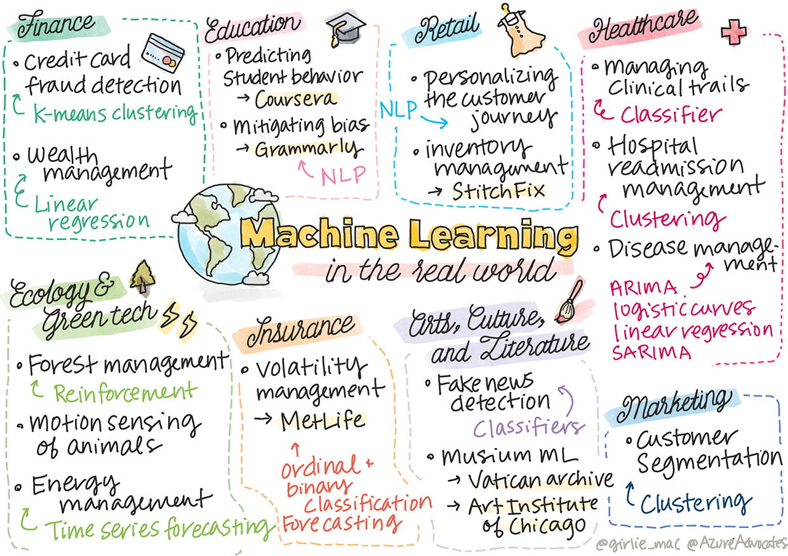

# Postscript: Machine learning in the real world

> Sketchnote by [Tomomi Imura](https://www.twitter.com/girlie_mac)

In this curriculum, you have learned many ways to prepare data for training and create machine learning models. You built a series of classic regression, clustering, classification, natural language processing, and time series models. Congratulations! Now, you might be wondering what it's all for... what are the real world applications for these models?

While a lot of interest in industry has been garnered by AI, which usually leverages deep learning, there are still valuable applications for classical machine learning models. You might even use some of these applications today! In this lesson, you'll explore how eight different industries and subject-matter domains use these types of models to make their applications more performant, reliable, intelligent, and valuable to users.

## [Pre-lecture quiz](https://gray-sand-07a10f403.1.azurestaticapps.net/quiz/49/)

## 💰 Finance

The finance sector offers many opportunities for machine learning. Many problems in this area lend themselves to be modeled and solved by using ML.

### Credit card fraud detection

We learned about [k-means clustering](../../5-Clustering/2-K-Means/README.md) earlier in the course, but how can it be used to solve problems related to credit card fraud?

K-means clustering comes in handy during a credit card fraud detection technique called **outlier detection**. Outliers, or deviations in observations about a set of data, can tell us if a credit card is being used in a normal capacity or if something unusual is going on. As shown in the paper linked below, you can sort credit card data using a k-means clustering algorithm and assign each transaction to a cluster based on how much of an outlier it appears to be. Then, you can evaluate the riskiest clusters for fraudulent versus legitimate transactions.
[Reference](https://citeseerx.ist.psu.edu/viewdoc/download?doi=10.1.1.680.1195&rep=rep1&type=pdf)

### Wealth management

In wealth management, an individual or firm handles investments on behalf of their clients. Their job is to sustain and grow wealth in the long-term, so it is essential to choose investments that perform well.

One way to evaluate how a particular investment performs is through statistical regression. [Linear regression](../../2-Regression/1-Tools/README.md) is a valuable tool for understanding how a fund performs relative to some benchmark. We can also deduce whether or not the results of the regression are statistically significant, or how much they would affect a client's investments. You could even further expand your analysis using multiple regression, where additional risk factors can be taken into account. For an example of how this would work for a specific fund, check out the paper below on evaluating fund performance using regression.
[Reference](http://www.brightwoodventures.com/evaluating-fund-performance-using-regression/)

## 🎓 Education

The educational sector is also a very interesting area where ML can be applied. There are interesting problems to be tackled such as detecting cheating on tests or essays or managing bias, unintentional or not, in the correction process.

### Predicting student behavior

[Coursera](https://coursera.com), an online open course provider, has a great tech blog where they discuss many engineering decisions. In this case study, they plotted a regression line to try to explore any correlation between a low NPS (Net Promoter Score) rating and course retention or drop-off.
[Reference](https://medium.com/coursera-engineering/controlled-regression-quantifying-the-impact-of-course-quality-on-learner-retention-31f956bd592a)

### Mitigating bias

[Grammarly](https://grammarly.com), a writing assistant that checks for spelling and grammar errors, uses sophisticated [natural language processing systems](../../6-NLP/README.md) throughout its products. They published an interesting case study in their tech blog about how they dealt with gender bias in machine learning, which you learned about in our [introductory fairness lesson](../../1-Introduction/3-fairness/README.md).
[Reference](https://www.grammarly.com/blog/engineering/mitigating-gender-bias-in-autocorrect/)

## 👜 Retail

The retail sector can definitely benefit from the use of ML, with everything from creating a better customer journey to stocking inventory in an optimal way.

### Personalizing the customer journey

At Wayfair, a company that sells home goods like furniture, helping customers find the right products for their taste and needs is paramount. In this article, engineers from the company describe how they use ML and NLP to "surface the right results for customers". Notably, their Query Intent Engine has been built to use entity extraction, classifier training, asset and opinion extraction, and sentiment tagging on customer reviews. This is a classic use case of how NLP works in online retail.
[Reference](https://www.aboutwayfair.com/tech-innovation/how-we-use-machine-learning-and-natural-language-processing-to-empower-search)

### Inventory management

Innovative, nimble companies like [StitchFix](https://stitchfix.com), a box service that ships clothing to consumers, rely heavily on ML for recommendations and inventory management. Their styling teams work together with their merchandising teams, in fact: "one of our data scientists tinkered with a genetic algorithm and applied it to apparel to predict what would be a successful piece of clothing that doesn't exist today. We brought that to the merchandise team and now they can use that as a tool."
[Reference](https://www.zdnet.com/article/how-stitch-fix-uses-machine-learning-to-master-the-science-of-styling/)

## 🏥 Health Care

The health care sector can leverage ML to optimize research tasks and also logistic problems like readmitting patients or stopping diseases from spreading.

### Managing clinical trials

Toxicity in clinical trials is a major concern to drug makers. How much toxicity is tolerable? In this study, analyzing various clinical trial methods led to the development of a new approach for predicting the odds of clinical trial outcomes. Specifically, they were able to use random forest to produce a [classifier](../../4-Classification/README.md) that is able to distinguish between groups of drugs.
[Reference](https://www.sciencedirect.com/science/article/pii/S2451945616302914)

### Hospital readmission management

Hospital care is costly, especially when patients have to be readmitted. This paper discusses a company that uses ML to predict readmission potential using [clustering](../../5-Clustering/README.md) algorithms. These clusters help analysts to "discover groups of readmissions that may share a common cause".
[Reference](https://healthmanagement.org/c/healthmanagement/issuearticle/hospital-readmissions-and-machine-learning)

### Disease management

The recent pandemic has shone a bright light on the ways that machine learning can aid in stopping the spread of disease. In this article, you'll recognize the use of ARIMA, logistic curves, linear regression, and SARIMA. "This work is an attempt to calculate the rate of spread of this virus and thus to predict the deaths, recoveries, and confirmed cases, so that it may help us to prepare better and survive."
[Reference](https://www.ncbi.nlm.nih.gov/pmc/articles/PMC7979218/)

## 🌲 Ecology and Green Tech

Nature and ecology consists of many sensitive systems where the interplay between animals and nature come into focus. It's important to be able to measure these systems accurately and act appropriately if something happens, like a forest fire or a drop in the animal population.

### Forest management

You learned about [Reinforcement Learning](../../8-Reinforcement/README.md) in previous lessons. It can be very useful when trying to predict patterns in nature. In particular, it can be used to track ecological problems like forest fires and the spread of invasive species. In Canada, a group of researchers used Reinforcement Learning to build forest wildfire dynamics models from satellite images. Using an innovative "spatially spreading process (SSP)", they envisioned a forest fire as "the agent at any cell in the landscape." "The set of actions the fire can take from a location at any point in time includes spreading north, south, east, or west or not spreading.

This approach inverts the usual RL setup since the dynamics of the corresponding Markov Decision Process (MDP) is a known function for immediate wildfire spread." Read more about the classic algorithms used by this group at the link below.
[Reference](https://www.frontiersin.org/articles/10.3389/fict.2018.00006/full)

### Motion sensing of animals

While deep learning has created a revolution in visually tracking animal movements (you can build your own [polar bear tracker](https://docs.microsoft.com/learn/modules/build-ml-model-with-azure-stream-analytics/?WT.mc_id=academic-77952-leestott) here), classic ML still has a place in this task.

Sensors to track movements of farm animals and IoT make use of this type of visual processing, but more basic ML techniques are useful to preprocess data. For example, in this paper, sheep postures were monitored and analyzed using various classifier algorithms. You might recognize the ROC curve on page 335.
[Reference](https://druckhaus-hofmann.de/gallery/31-wj-feb-2020.pdf)

### ⚡️ Energy Management
  
In our lessons on [time series forecasting](../../7-TimeSeries/README.md), we invoked the concept of smart parking meters to generate revenue for a town based on understanding supply and demand. This article discusses in detail how clustering, regression and time series forecasting combined to help predict future energy use in Ireland, based off of smart metering.
[Reference](https://www-cdn.knime.com/sites/default/files/inline-images/knime_bigdata_energy_timeseries_whitepaper.pdf)

## 💼 Insurance

The insurance sector is another sector that uses ML to construct and optimize viable financial and actuarial models. 

### Volatility Management

MetLife, a life insurance provider, is forthcoming with the way they analyze and mitigate volatility in their financial models. In this article you'll notice binary and ordinal classification visualizations. You'll also discover forecasting visualizations.
[Reference](https://investments.metlife.com/content/dam/metlifecom/us/investments/insights/research-topics/macro-strategy/pdf/MetLifeInvestmentManagement_MachineLearnedRanking_070920.pdf)

## 🎨 Arts, Culture, and Literature

In the arts, for example in journalism, there are many interesting problems. Detecting fake news is a huge problem as it has been proven to influence the opinion of people and even to topple democracies. Museums can also benefit from using ML in everything from finding links between artifacts to resource planning.

### Fake news detection

Detecting fake news has become a game of cat and mouse in today's media. In this article, researchers suggest that a system combining several of the ML techniques we have studied can be tested and the best model deployed: "This system is based on natural language processing to extract features from the data and then these features are used for the training of machine learning classifiers such as Naive Bayes,  Support Vector Machine (SVM), Random Forest (RF), Stochastic Gradient Descent (SGD), and Logistic Regression(LR)."
[Reference](https://www.irjet.net/archives/V7/i6/IRJET-V7I6688.pdf)

This article shows how combining different ML domains can produce interesting results that can help stop fake news from spreading and creating real damage; in this case, the impetus was the spread of rumors about COVID treatments that incited mob violence.

### Museum ML

Museums are at the cusp of an AI revolution in which cataloging and digitizing collections and finding links between artifacts is becoming easier as technology advances. Projects such as [In Codice Ratio](https://www.sciencedirect.com/science/article/abs/pii/S0306457321001035#:~:text=1.,studies%20over%20large%20historical%20sources.) are helping unlock the mysteries of inaccessible collections such as the Vatican Archives. But, the business aspect of museums benefits from ML models as well.

For example, the Art Institute of Chicago built models to predict what audiences are interested in and when they will attend expositions. The goal is to create individualized and optimized visitor experiences each time the user visits the museum. "During fiscal 2017, the model predicted attendance and admissions within 1 percent of accuracy, says Andrew Simnick, senior vice president at the Art Institute."
[Reference](https://www.chicagobusiness.com/article/20180518/ISSUE01/180519840/art-institute-of-chicago-uses-data-to-make-exhibit-choices)

## 🏷 Marketing

### Customer segmentation

The most effective marketing strategies target customers in different ways based on various groupings. In this article, the uses of Clustering algorithms are discussed to support differentiated marketing. Differentiated marketing helps companies improve brand recognition, reach more customers, and make more money.
[Reference](https://ai.inqline.com/machine-learning-for-marketing-customer-segmentation/)

## 🚀 Challenge

Identify another sector that benefits from some of the techniques you learned in this curriculum, and discover how it uses ML.

## [Post-lecture quiz](https://gray-sand-07a10f403.1.azurestaticapps.net/quiz/50/)

## Review & Self Study

The Wayfair data science team has several interesting videos on how they use ML at their company. It's worth [taking a look](https://www.youtube.com/channel/UCe2PjkQXqOuwkW1gw6Ameuw/videos)!

## Assignment

[A ML scavenger hunt](assignment.md)
