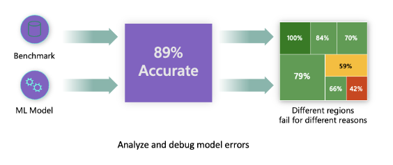
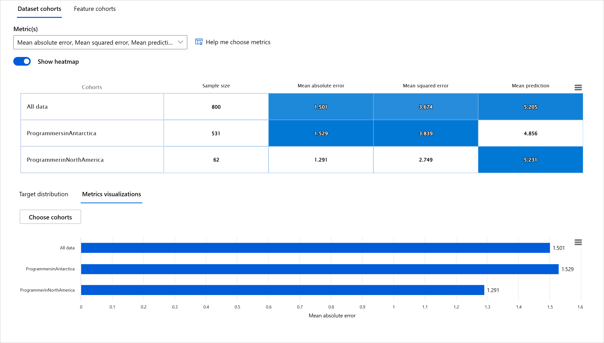
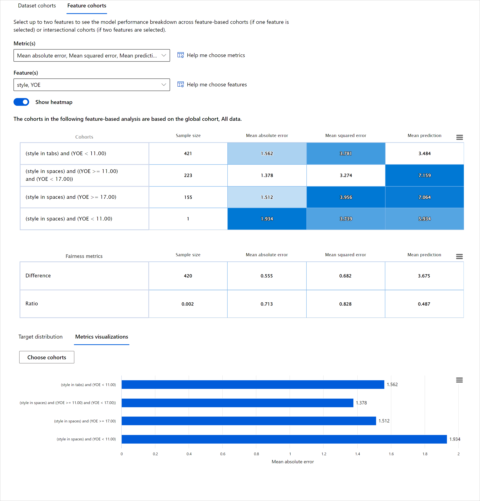
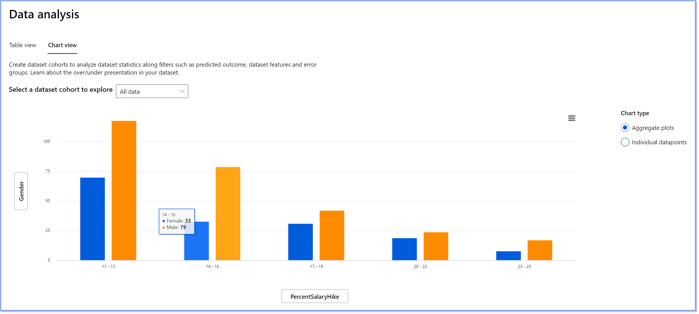
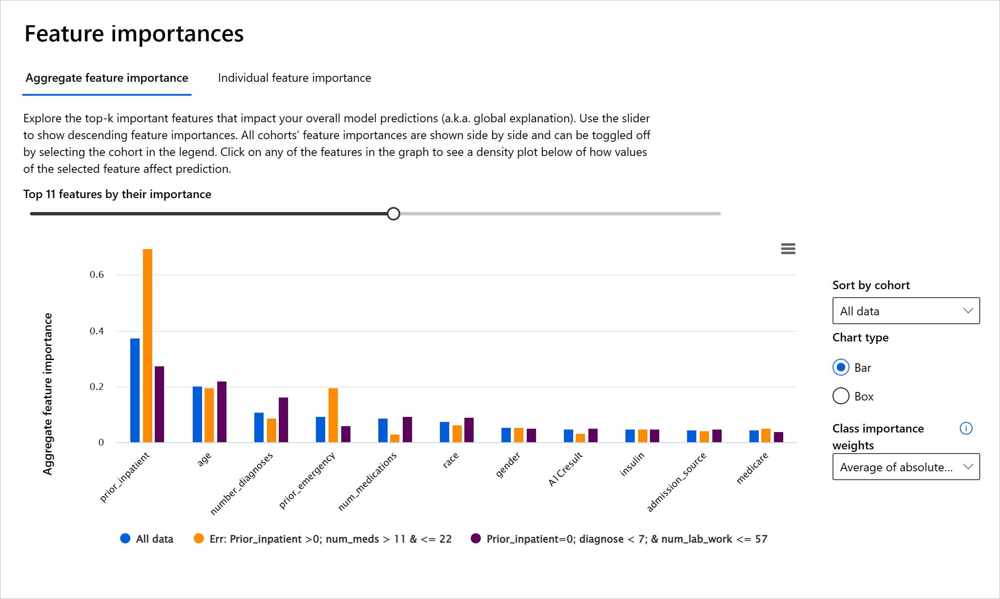

# Postscript: Model Debugging in Machine Learning using Responsible AI dashboard components
 

## [Pre-lecture quiz](https://gray-sand-07a10f403.1.azurestaticapps.net/quiz/5/)
 
## Introduction

Machine learning impacts our everyday lives. AI is finding its way into some of the most important systems that affect us as individuals as well as our society, from healthcare, finance, education, and employment. For instance, systems and models are involved in daily decision-making tasks, such as health care diagnoses or detecting fraud. Consequentially, the advancements in AI along with the accelerated adoption are being met with evolving societal expectations and growing regulation in response. We constantly see areas where AI systems continue to miss expectations; they expose new challenges; and governments are starting to regulate AI solutions. So, it is important that these models are analyzed to provide fair, reliable, inclusive, transparent, and accountable outcomes for everyone.

In this curriculum, we will look at practical tools that can be used to assess if a model has responsible AI issues. Traditional machine learning debugging techniques tend to be based on quantitative calculations such as aggregated accuracy or average error loss. Imagine what can happen when the data you are using to build these models lacks certain demographics, such as race, gender, political view, religion, or disproportionally represents such demographics. What about when the model's output is interpreted to favor some demographic? This can introduce an over or under representation of these sensitive feature groups resulting in fairness, inclusiveness, or reliability issues from the model. Another factor is, machine learning models are considered black boxes, which makes it hard to understand and explain what drives a model’s prediction. All of these are challenges data scientists and AI developers face when they do not have adequate tools to debug and assess the fairness or trustworthiness of a model.

In this lesson, you will learn about debugging your models using:

-	**Error Analysis**: identify where in your data distribution the model has high error rates.
-	**Model Overview**: perform comparative analysis across different data cohorts to discover disparities in your model’s performance metrics.
-	**Data Analysis**: investigate where there could be over or under representation of your data that can skew your model to favor one data demographic vs another.
-	**Feature Importance**: understand which features are driving your model’s predictions on a global level or local level.

## Prerequisite

As a prerequisite, please take the review [Responsible AI tools for developers](https://www.microsoft.com/ai/ai-lab-responsible-ai-dashboard)

> 

## Error Analysis

Traditional model performance metrics used for measuring accuracy are mostly calculations based on correct vs incorrect predictions. For example, determining that a model is accurate 89% of time with an error loss of 0.001 can be considered a good performance. Errors are often not distributed uniformly in your underlying dataset. You may get an 89% model accuracy score but discover that there are different regions of your data for which the model is failing 42% of the time. The consequence of these failure patterns with certain data groups can lead to fairness or reliability issues. It is essential to understand areas where the model is performing well or not. The data regions where there are a high number of inaccuracies in your model may turn out to be an important data demographic.  

The Error Analysis component on the RAI dashboard illustrates how model failure is distributed across various cohorts with a tree visualization. This is useful in identifying features or areas where there is a high error rate with your dataset. By seeing where most of the model’s inaccuracies are coming from, you can start investigating the root cause. You can also create cohorts of data to perform analysis on. These data cohorts help in the debugging process to determine why the model performance is good in one cohort, but erroneous in another.   

The visual indicators on the tree map help in locating the problem areas quicker. For instance, the darker shade of red color a tree node has, the higher the error rate.  

Heat map is another visualization functionality that users can use in investigating the error rate using one or two features to find a contributor to the model errors across an entire dataset or cohorts.

Use error analysis when you need to:

* Gain a deep understanding of how model failures are distributed across a dataset and across several input and feature dimensions.
* Break down the aggregate performance metrics to automatically discover erroneous cohorts to inform your targeted mitigation steps.

## Model Overview

Evaluating the performance of a machine learning model requires getting a holistic understanding of its behavior. This can be achieved by reviewing more than one metric such as error rate, accuracy, recall, precision, or MAE (Mean Absolute Err) to find disparities among performance metrics.  One performance metric may look great, but inaccuracies can be exposed in another metric. In addition, comparing the metrics for disparities across the entire dataset or cohorts helps shed light on where the model is performing well or not. This is especially important in seeing the model’s performance among sensitive vs insensitive features (e.g., patient race, gender, or age) to uncover potential unfairness the model may have. For example, discovering that the model is more erroneous in a cohort that has sensitive features can reveal potential unfairness the model may have.

The Model Overview component of the RAI dashboard helps not just in analyzing the performance metrics of the data representation in a cohort, but it gives users the ability to compare the model’s behavior across different cohorts.

The component's feature-based analysis functionality allows users to narrow down data subgroups within a particular feature to identify anomalies on a granular level. For example, the dashboard has built-in intelligence to automatically generate cohorts for a user-selected feature (eg., *"time_in_hospital < 3"* or *"time_in_hospital >= 7"*). This enables a user to isolate a particular feature from a larger data group to see if it is a key influencer of the model's erroneous outcomes.

The Model Overview component supports two classes of disparity metrics:

**Disparity in model performance**: These sets of metrics calculate the disparity (difference) in the values of the selected performance metric across subgroups of data. Here are a few examples:

* Disparity in accuracy rate
* Disparity in error rate
* Disparity in precision
* Disparity in recall
* Disparity in mean absolute error (MAE)

**Disparity in selection rate**: This metric contains the difference in selection rate (favorable prediction) among subgroups. An example of this is the disparity in loan approval rates. Selection rate means the fraction of data points in each class classified as 1 (in binary classification) or distribution of prediction values (in regression).

## Data Analysis

> "If you torture the data long enough, it will confess to anything" - Ronald Coase

This statement sounds extreme, but it is true that data can be manipulated to support any conclusion. Such manipulation can sometimes happen unintentionally. As humans, we all have bias, and it is often difficult to consciously know when you are introducing bias in data. Guaranteeing fairness in AI and machine learning remains a complex challenge. 

Data is a huge blind spot for traditional model performance metrics. You may have high accuracy scores, but this does not always reflect the underlining data bias that could be in your dataset. For example, if a dataset of employees has 27% of women in executive positions in a company and 73% of men at the same level, a job advertising AI model trained on this data may target mostly a male audience for senior level job positions. Having this imbalance in data skewed the model’s prediction to favor one gender. This reveals a fairness issue where there is a gender bias in the AI model.  

The Data Analysis component on the RAI dashboard helps to identify areas where there’s an over- and under-representation in the dataset. It helps users diagnose the root cause of errors and fairness issues introduced from data imbalances or lack of representation of a particular data group. This gives users the ability to visualize datasets based on predicted and actual outcomes, error groups, and specific features. Sometimes discovering an underrepresented data group can also uncover that the model is not learning well, hence the high inaccuracies. Having a model that has data bias is not just a fairness issue but shows that the model is not inclusive or reliable.

Use data analysis when you need to:

* Explore your dataset statistics by selecting different filters to slice your data into different dimensions (also known as cohorts).
* Understand the distribution of your dataset across different cohorts and feature groups.
* Determine whether your findings related to fairness, error analysis, and causality (derived from other dashboard components) are a result of your dataset's distribution.
* Decide in which areas to collect more data to mitigate errors that come from representation issues, label noise, feature noise, label bias, and similar factors.

## Model Interpretability

Machine learning models tend to be black boxes. Understanding which key data features drive a model’s prediction can be challenging.  It is important to provide transparency as to why a model makes a certain prediction. For example, if an AI system predicts that a diabetic patient is at risk of being readmitted back to a hospital in less than 30 days, it should be able to provide supporting data that led to its prediction. Having supporting data indicators brings transparency to help clinicians or hospitals to be able to make well-informed decisions. In addition, being able to explain why a model made a prediction for an individual patient enables accountability with health regulations. When you are using machine learning models in ways that affect people’s lives, it is crucial to understand and explain what influences the behavior of a model. Model explainability and interpretability helps answer questions in scenarios such as:

* Model debugging: Why did my model make this mistake? How can I improve my model?
* Human-AI collaboration: How can I understand and trust the model’s decisions?
* Regulatory compliance: Does my model satisfy legal requirements?

The Feature Importance component of the RAI dashboard helps you to debug and get a comprehensive understanding of how a model makes predictions. It is also a useful tool for machine learning professionals and decision-makers to explain and show evidence of features influencing a model's behavior for regulatory compliance. Next, users can explore both global and local explanations validate which features drive a model’s prediction. Global explanations lists the top features that affected a model’s overall prediction. Local explanations display which features led to a model’s prediction for an individual case. The ability to evaluate local explanations is also helpful in debugging or auditing a specific case to better understand and interpret why a model made an accurate or inaccurate prediction. 

* Global explanations: For example, what features affect the overall behavior of a diabetes hospital readmission model?
* Local explanations: For example, why was a diabetic patient over 60 years old with prior hospitalizations predicted to be readmitted or not readmitted within 30 days back to a hospital?

In the debugging process of examining a model’s performance across different cohorts, Feature Importance shows what level of impact a feature has across the cohorts. It helps reveal anomalies when comparing the level of influence the feature has in driving a model’s erroneous predictions. The Feature Importance component can show which values in a feature positively or negatively influenced the model’s outcome. For instance, if a model made an inaccurate prediction, the component gives you the ability to drill down and pinpoint what features or feature values drove the prediction. This level of detail helps not just in debugging but provides transparency and accountability in auditing situations. Finally, the component can help you to identify fairness issues. To illustrate, if a sensitive feature such as ethnicity or gender is highly influential in driving a model’s prediction, this could be a sign of race or gender bias in the model.

Use interpretability when you need to:

* Determine how trustworthy your AI system’s predictions are by understanding what features are most important for the predictions.
* Approach the debugging of your model by understanding it first and identifying whether the model is using healthy features or merely false correlations.
* Uncover potential sources of unfairness by understanding whether the model is basing predictions on sensitive features or on features that are highly correlated with them.
* Build user trust in your model’s decisions by generating local explanations to illustrate their outcomes.
* Complete a regulatory audit of an AI system to validate models and monitor the impact of model decisions on humans.

## Conclusion

All the RAI dashboard components are practical tools to help you build machine learning models that are less harmful and more trustworthy to society. It improves the prevention of treats to human rights; discriminating or excluding certain groups to life opportunities; and the risk of physical or psychological injury. It also helps to build trust in your model’s decisions by generating local explanations to illustrate their outcomes. Some of the potential harms can be classified as:

- **Allocation**, if a gender or ethnicity for example is favored over another.
- **Quality of service**. If you train the data for one specific scenario but the reality is much more complex, it leads to a poor performing service.
- **Stereotyping**. Associating a given group with pre-assigned attributes.
- **Denigration**. To unfairly criticize and label something or someone.
- **Over- or under- representation**. The idea is that a certain group is not seen in a certain profession, and any service or function that keeps promoting that is contributing to harm.

### Azure RAI dashboard
 
[Azure RAI dashboard](https://learn.microsoft.com/en-us/azure/machine-learning/concept-responsible-ai-dashboard?WT.mc_id=aiml-90525-ruyakubu) is built on open-source tools developed by the leading academic institutions and organizations including Microsoft are instrumental for data scientists and AI developers to better understand model behavior, discover and mitigate undesirable issues from AI models.

- Learn how to use the different components by checking out the RAI dashboard [docs.](https://learn.microsoft.com/en-us/azure/machine-learning/how-to-responsible-ai-dashboard?WT.mc_id=aiml-90525-ruyakubu)

- Check out some RAI dashboard [sample notebooks](https://github.com/Azure/RAI-vNext-Preview/tree/main/examples/notebooks) for debugging more responsible AI scenarios in Azure Machine Learning. 
  
---
## 🚀 Challenge 
 
To prevent statistical or data biases from being introduced in the first place, we should: 

- have a diversity of backgrounds and perspectives among the people working on systems 
- invest in datasets that reflect the diversity of our society 
- develop better methods for detecting and correcting bias when it occurs 

Think about real-life scenarios where unfairness is evident in model-building and usage. What else should we consider? 

## [Post-lecture quiz](https://gray-sand-07a10f403.1.azurestaticapps.net/quiz/6/)
## Review & Self Study 
 
In this lesson, you have learned some of the practical tools of incorporating responsible AI in machine learning.  

Watch this workshop to dive deeper into the topics: 

- Responsible AI Dashboard: One-stop shop for operationalizing RAI in practice by Besmira Nushi and Mehrnoosh Sameki

> 🎥 Click the image above for a video: Responsible AI Dashboard: One-stop shop for operationalizing RAI in practice by Besmira Nushi and Mehrnoosh Sameki
 
Reference the following materials to learn more about responsible AI and how to build more trustworthy models: 

- Microsoft’s RAI dashboard tools for debugging ML models: [Responsible AI tools resources](https://aka.ms/rai-dashboard)

- Explore the Responsible AI toolkit: [Github](https://github.com/microsoft/responsible-ai-toolbox)

- Microsoft’s RAI resource center: [Responsible AI Resources – Microsoft AI](https://www.microsoft.com/ai/responsible-ai-resources?activetab=pivot1%3aprimaryr4) 

- Microsoft’s FATE research group: [FATE: Fairness, Accountability, Transparency, and Ethics in AI - Microsoft Research](https://www.microsoft.com/research/theme/fate/) 

## Assignment

[Explore RAI dashboard](assignment.md) 
