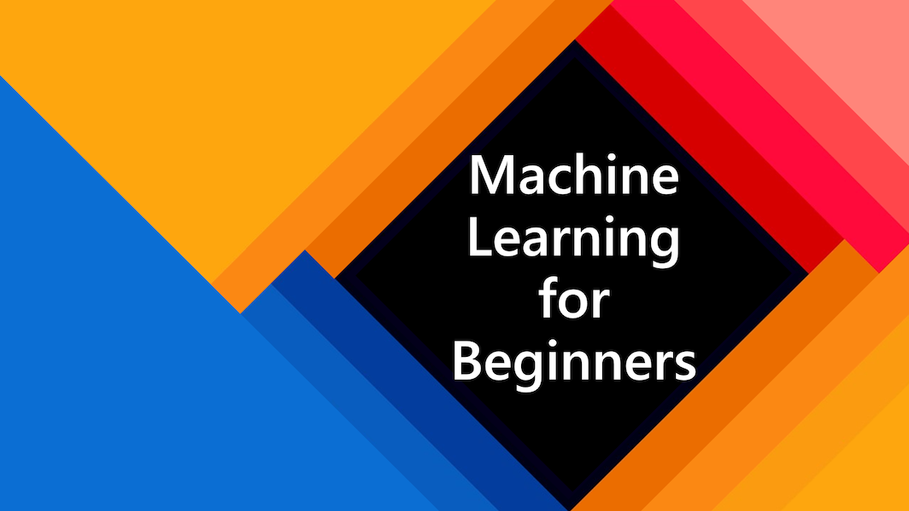

# 针对初学者的机器学习课程

> 🌍 环游世界，并通过世界文化来探索机器学习 🌍

微软 Azure Cloud 的倡导者们很高兴可以提供这套十二周、二十四节课的关于**机器学习**的课程。在这套课程中，你将学习关于**经典机器学习**的内容，主要将使用 Scikit-learn 这一库。关于深度学习的内容将会尽量避免 —— 它会被我们即将推出的 "AI for Beginners (针对初学者的 AI 教程)" 所涵盖。你也可以把这些课和我们已推出的 [Data Science for Beginners（针对初学者的数据科学教程）](https://aka.ms/datascience-beginners) 相结合！

通过把这些经典的技术应用在来自世界各地的数据，我们将 “环游世界”。每一节课都包括了课前和课后测验、课程内容的文字讲义说明、示例代码、作业等。通过这种基于项目的教学方法，你将在构建中学习，这样可以把技能学得更牢靠。

**✍️ 衷心感谢作者们** Jen Looper, Stephen Howell, Francesca Lazzeri, Tomomi Imura, Cassie Breviu, Dmitry Soshnikov, Chris Noring, Ornella Altunyan 以及 Amy Boyd

**🎨 同时也要感谢我们的插画师** Tomomi Imura, Dasani Madipalli 以及 Jen Looper

 **🙏 特别感谢 🙏 我们的微软学生大使作者们，内容贡献和内容复核者们**, Rishit Dagli, Muhammad Sakib Khan Inan, Rohan Raj, Alexandru Petrescu, Abhishek Jaiswal, Nawrin Tabassum, Ioan Samuila, 和 Snigdha Agarwal 等

---
# 准备开始

**对于学生们**，为了更好的使用这套课程，把整个仓库 fork 到你自己的 GitHub 账户中，并自行（或和一个小组一起）完成以下练习：

- 从课前测验开始
- 阅读课程内容，完成所有的活动，在每次 knowledge check 时暂停并思考
- 我们建议你基于理解来创建项目（而不是仅仅跑一遍示例代码）。示例代码的位置在每一个项目的 `/solution` 文件夹中。
- 进行课后测验
- 完成课程挑战
- 完成作业
- 一节课完成后, 访问[讨论版](https://github.com/microsoft/ML-For-Beginners/discussions)，通过填写相应的 PAT Rubric (课程目标) 来深化自己的学习成果。你也可以回应其它的 PAT，这样我们可以一起学习。

> 如果希望进一步学习，我们推荐跟随 [Microsoft Learn](https://docs.microsoft.com/en-us/users/jenlooper-2911/collections/k7o7tg1gp306q4?WT.mc_id=academic-77952-leestott) 的模块和学习路径。

**对于老师们**，我们对于如何使用这套教程[提供了一些建议](../for-teachers.md)。

---

## 项目团队

> 🎥 点击上方的图片，来观看一个关于这个项目和它的创造者们的视频！

---
## 教学方式

此课程基于两个教学原则：学生应该上手进行**项目实践**，并完成**频繁的测验**。 此外，为了使整个课程更具有整体性，课程们有一个共同的**主题**。

通过确保课程内容与项目强相关，我们让学习过程对学生更具吸引力，概念的学习也被深化了。难度较低的课前测验可以吸引学生学习课程，而课后的第二次测验也进一步重复了课堂中的概念。该课程被设计地灵活有趣，可以一次性全部学习，或者分开来一部分一部分学习。这些项目由浅入深，从第一周的小项目开始，在第十二周结束时变得较为复杂。本课程还包括一个关于机器学习实际应用的后记，可用作额外学分或进一步讨论的基础。

> 在这里，你可以找到我们的[行为守则](../CODE_OF_CONDUCT.md)，[对项目作出贡献](../CONTRIBUTING.md)以及[翻译](../TRANSLATIONS.md)指南。我们欢迎各位提出有建设性的反馈！

## 每一节课都包含：

- 可选的笔记
- 可选的补充视频
- 课前热身测验
- 文字课程
- 对于基于项目的课程，包含构建项目的分步指南
- knowledge checks
- 一个挑战
- 补充阅读
- 作业
- 课后测验

> **关于测验**：所有的测验都在[这个应用里](https://gray-sand-07a10f403.1.azurestaticapps.net/)，总共 50 个测验，每个测验三个问题。它们的链接在每节课中，而且这个测验应用可以在本地运行。请参考 `quiz-app` 文件夹中的指南。

| 课程编号 |                     主体                     |                      课程组                       | 学习目标                                                                |                        课程链接                        |     作者      |
| :------: | :------------------------------------------: | :-----------------------------------------------: | ----------------------------------------------------------------------- | :----------------------------------------------------: | :-----------: |
|    01    |                 机器学习简介                 |        [简介](../1-Introduction/translations/README.zh-cn.md)        | 了解机器学习背后的基本概念                                              |   [课程](../1-Introduction/1-intro-to-ML/translations/README.zh-cn.md)    |   Muhammad    |
|    02    |                机器学习的历史                |        [简介](../1-Introduction/translations/README.zh-cn.md)        | 了解该领域的历史                                                        |  [课程](../1-Introduction/2-history-of-ML/translations/README.zh-cn.md)   |  Jen 和 Amy   |
|    03    |                机器学习与公平                |        [简介](../1-Introduction/translations/README.zh-cn.md)        | 在构建和应用机器学习模型时，我们应该考虑哪些有关公平的重要哲学问题？    |     [课程](../1-Introduction/3-fairness/translations/README.zh-cn.md)     |    Tomomi     |
|    04    |              机器学习的技术工具              |        [简介](../1-Introduction/translations/README.zh-cn.md)        | 机器学习研究者使用哪些技术来构建机器学习模型？                          | [课程](../1-Introduction/4-techniques-of-ML/translations/README.zh-cn.md) | Chris 和 Jen  |
|    05    |                   回归简介                   |         [回归](../2-Regression/translations/README.zh-cn.md)         | 开始使用 Python 和 Scikit-learn 构建回归模型                            |       [课程](../2-Regression/1-Tools/translations/README.zh-cn.md)        |      Jen      |
|    06    |                北美南瓜价格 🎃                |         [回归](../2-Regression/translations/README.zh-cn.md)         | 可视化、进行数据清理，为机器学习做准备                                  |        [课程](../2-Regression/2-Data/translations/README.zh-cn.md)        |      Jen      |
|    07    |                北美南瓜价格 🎃                |         [回归](../2-Regression/translations/README.zh-cn.md)         | 建立线性和多项式回归模型                                                |       [课程](../2-Regression/3-Linear/translations/README.zh-cn.md)       |      Jen      |
|    08    |                北美南瓜价格 🎃                |         [回归](../2-Regression/translations/README.zh-cn.md)         | 构建逻辑回归模型                                                        |      [课程](../2-Regression/4-Logistic/translations/README.zh-cn.md)      |      Jen      |
|    09    |                一个网页应用 🔌                |        [网页应用](../3-Web-App/translations/README.zh-cn.md)         | 构建一个 Web 应用程序以使用经过训练的模型                               |        [课程](../3-Web-App/1-Web-App/translations/README.zh-cn.md)        |      Jen      |
|    10    |                   分类简介                   |       [分类](../4-Classification/translations/README.zh-cn.md)       | 清理、准备和可视化数据； 分类简介                                       |  [课程](../4-Classification/1-Introduction/translations/README.zh-cn.md)  | Jen 和 Cassie |
|    11    |            美味的亚洲和印度美食 🍜            |       [分类](../4-Classification/translations/README.zh-cn.md)       | 分类器简介                                                              | [课程](../4-Classification/2-Classifiers-1/translations/README.zh-cn.md)  | Jen 和 Cassie |
|    12    |            美味的亚洲和印度美食 🍜            |       [分类](../4-Classification/translations/README.zh-cn.md)       | 关于分类器的更多内容                                                    | [课程](../4-Classification/3-Classifiers-2/translations/README.zh-cn.md)  | Jen 和 Cassie |
|    13    |            美味的亚洲和印度美食 🍜            |       [分类](../4-Classification/translations/README.zh-cn.md)       | 使用您的模型构建一个可以「推荐」的 Web 应用                             |    [课程](../4-Classification/4-Applied/translations/README.zh-cn.md)     |      Jen      |
|    14    |                   聚类简介                   |         [聚类](../5-Clustering/translations/README.zh-cn.md)         | 清理、准备和可视化数据； 聚类简介                                       |     [课程](../5-Clustering/1-Visualize/translations/README.zh-cn.md)      |      Jen      |
|    15    |          探索尼日利亚人的音乐品味 🎧          |         [聚类](../5-Clustering/translations/README.zh-cn.md)         | 探索 K-Means 聚类方法                                                   |      [课程](../5-Clustering/2-K-Means/translations/README.zh-cn.md)       |      Jen      |
|    16    |          自然语言处理 (NLP) 简介  ☕️          |        [自然语言处理](../6-NLP/translations/README.zh-cn.md)         | 通过构建一个简单的 bot (机器人) 来了解 NLP 的基础知识                   |    [课程](../6-NLP/1-Introduction-to-NLP/translations/README.zh-cn.md)    |    Stephen    |
|    17    |              常见的 NLP 任务 ☕️               |        [自然语言处理](../6-NLP/translations/README.zh-cn.md)         | 通过理解处理语言结构时所需的常见任务来加深对于自然语言处理 (NLP) 的理解 |           [课程](../6-NLP/2-Tasks/README.md)           |    Stephen    |
|    18    |               翻译和情感分析 ♥️               |        [自然语言处理](../6-NLP/translations/README.zh-cn.md)         | 对简·奥斯汀的文本进行翻译和情感分析                                     |   [课程](../6-NLP/3-Translation-Sentiment/README.md)   |    Stephen    |
|    19    |               欧洲的浪漫酒店 ♥️               |        [自然语言处理](../6-NLP/translations/README.zh-cn.md)         | 对于酒店评价进行情感分析（上）                                          |      [课程](../6-NLP/4-Hotel-Reviews-1/README.md)      |    Stephen    |
|    20    |               欧洲的浪漫酒店 ♥️               |        [自然语言处理](../6-NLP/translations/README.zh-cn.md)         | 对于酒店评价进行情感分析（下）                                          |      [课程](../6-NLP/5-Hotel-Reviews-2/README.md)      |    Stephen    |
|    21    |               时间序列预测简介               |       [时间序列](../7-TimeSeries/translations/README.zh-cn.md)       | 时间序列预测简介 forecasting                                            |    [课程](../7-TimeSeries/1-Introduction/README.md)    |   Francesca   |
|    22    | ⚡️ 世界用电量 ⚡️ - 使用 ARIMA 进行时间序列预测 |       [时间序列](../7-TimeSeries/translations/README.zh-cn.md)       | 使用 ARIMA 进行时间序列预测                                             |       [课程](../7-TimeSeries/2-ARIMA/README.md)        |   Francesca   |
|    23    |                 强化学习简介                 |     [强化学习](../8-Reinforcement/translations/README.zh-cn.md)      | Q-Learning 强化学习简介                                                 |    [课程](../8-Reinforcement/1-QLearning/translations/README.zh-cn.md)    |    Dmitry     |
|    24    |             帮助 Peter 避开狼！🐺             |     [强化学习](../8-Reinforcement/translations/README.zh-cn.md)      | 强化学习练习                                                            |       [课程](../8-Reinforcement/2-Gym/translations/README.zh-cn.md)       |    Dmitry     |
|   后记   |        现实世界中的机器学习场景和应用        | [自然场景下的机器学习](../9-Real-World/translations/README.zh-cn.md) | 探索有趣的经典机器学习方法，了解现实世界中机器学习的应用                |    [课程](../9-Real-World/1-Applications/README.md)    |     团队      |
## 离线访问

您可以使用 [Docsify](https://docsify.js.org/#/) 离线运行此文档。 Fork 这个仓库，并在你的本地机器上[安装 Docsify](https://docsify.js.org/#/quickstart)，并在这个仓库的根文件夹中运行 `docsify serve`。你可以通过 localhost 的 3000 端口访问此文档：`localhost:3000`。
## PDF 文档们

点击[这里](../pdf/readme.pdf)查找课程的 PDF 文档。

## 需要你的帮助！

想贡献一份翻译吗？请阅读我们的[翻译指南](../TRANSLATIONS.md)并在[此处](https://github.com/microsoft/ML-For-Beginners/issues/71)添加你的意见。

## 其他课程

我们的团队还制作了其他课程！可以看一下：

- [针对初学者的 Web 开发课程](https://aka.ms/webdev-beginners)
- [针对初学者的物联网课程](https://aka.ms/iot-beginners)
- [针对初学者的数据科学课程](https://aka.ms/datascience-beginners)
