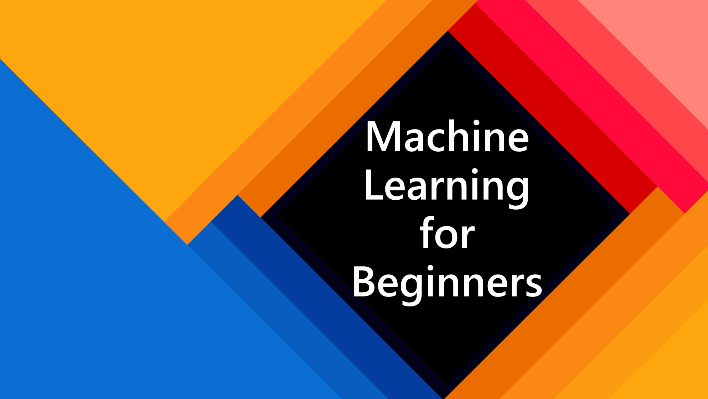

# 初心者のための機械学習 - カリキュラム

> 🌍 世界の文化に触れながら機械学習を探求する旅 🌍

マイクロソフトの Azure Cloud Advocates では、12週間、24レッスンの**機械学習**に関するカリキュラムを提供しています。このカリキュラムでは、今後公開する予定の「初心者のためのAI」で扱う深層学習を避け、主に Scikit-learn ライブラリを使用した**古典的機械学習**と呼ばれるものについて学びます。同様に公開予定の「初心者のためのデータサイエンス」と合わせてご活用ください！

世界各地のデータに古典的な手法を適用しながら、一緒に世界を旅してみましょう。各レッスンには、レッスン前後の小テストや、レッスンを完了するための指示・解答・課題などが含まれています。新しいスキルを「定着」させるものとして実証されているプロジェクトベースの教育法によって、構築しながら学ぶことができます。

**✍️ 著者の皆様に心から感謝いたします** Jen Looper さん、Stephen Howell さん、Francesca Lazzeri さん、Tomomi Imura さん、Cassie Breviu さん、Dmitry Soshnikov さん、Chris Noring さん、Ornella Altunyan さん、そして Amy Boyd さん

**🎨 イラストレーターの皆様にも心から感謝いたします** Tomomi Imura さん、Dasani Madipalli さん、そして Jen Looper さん

**🙏 Microsoft Student Ambassador の著者・査読者・コンテンツ提供者の皆様に特に感謝いたします 🙏** 特に、Rishit Dagli さん、Muhammad Sakib Khan Inan さん、Rohan Raj さん、Alexandru Petrescu さん、Abhishek Jaiswal さん、Nawrin Tabassum さん、Ioan Samuila さん、そして Snigdha Agarwal さん

---

# はじめに

**学生の皆さん**、このカリキュラムを利用するには、自分のGitHubアカウントにリポジトリ全体をフォークして、一人もしくはグループで演習を完了させてください。

- 講義前の小テストから始めてください。
- 知識を確認するたびに立ち止まったり振り返ったりしながら、講義を読んで各アクティビティを完了させてください。
- 解答のコードをただ実行するのではなく、レッスンを理解してプロジェクトを作成するようにしてください。なお、解答のコードは、プロジェクトに紐づく各レッスンの `/solution` フォルダにあります。
- 講義後の小テストを受けてください。
- チャレンジを完了させてください。
- 課題を完了させてください。
- レッスングループの完了後は [Discussionボード](https://github.com/microsoft/ML-For-Beginners/discussions) にアクセスし、適切なPAT表に記入することで「声に出して学習」してください。"PAT" とは Progress Assessment Tool（進捗評価ツール）の略で、学習を促進するために記入する表のことです。他のPATにリアクションすることもできるので、共に学ぶことが可能です。

> さらに学習を進める場合は、[Microsoft Learn](https://docs.microsoft.com/users/jenlooper-2911/collections/k7o7tg1gp306q4?WT.mc_id=academic-77952-leestott) のラーニングパスに従うことをお勧めします。

**先生方**、このカリキュラムをどのように使用するか、[いくつかの提案](../for-teachers.md) があります。

---

## チームの紹介

> 🎥 上の画像をクリックすると、このプロジェクトと、プロジェクトを作った人たちについてのビデオを観ることができます！

---

## 教育法

このカリキュラムを構築するにあたり、私たちは2つの教育方針を選びました。**プロジェクトベース**の体験と、**頻繁な小テスト**を含むことです。さらにこのカリキュラムには、まとまりを持たせるための共通の**テーマ**があります。

内容とプロジェクトとの整合性を保つことで、学生にとって学習プロセスがより魅力的になり、概念の定着度が高まります。さらに、授業前の軽い小テストは学生の学習意欲を高め、授業後の2回目の小テストはより一層の定着につながります。このカリキュラムは柔軟かつ楽しいものになるようデザインされており、すべて、もしくは一部を受講することが可能です。プロジェクトは小さなものから始まり、12週間の間に少しずつ複雑なものになっていきます。また、このカリキュラムには機械学習の実世界への応用に関するあとがきも含んでおり、追加の単位あるいは議論の題材として使用できます。

> [行動規範](../CODE_OF_CONDUCT.md)、[貢献](../CONTRIBUTING.md)、[翻訳](../TRANSLATIONS.md) のガイドラインをご覧ください。建設的なご意見をお待ちしております！

## 各レッスンの内容

- オプションのスケッチノート
- オプションの補足ビデオ
- 講義前の小テスト
- 成文のレッスン
- プロジェクトベースのレッスンを行うため、プロジェクトの構築方法に関する段階的なガイド
- 知識の確認
- チャレンジ
- 副読本
- 課題
- 講義後の小テスト

> **小テストに関する注意**: すべての小テストは [このアプリ](https://gray-sand-07a10f403.1.azurestaticapps.net/) に含まれており、各3問からなる50個の小テストがあります。これらはレッスン内からリンクされていますが、アプリをローカルで実行することもできます。`quiz-app` フォルダ内の指示に従ってください。

| レッスン番号 |                   トピック                   |                    レッスングループ                    | 学習の目的                                                                                 |                            関連するレッスン                             |      著者      |
| :----------: | :------------------------------------------: | :----------------------------------------------------: | ------------------------------------------------------------------------------------------ | :---------------------------------------------------------------------: | :------------: |
|      01      |               機械学習への導入               |  [導入](../1-Introduction/translations/README.ja.md)   | 機械学習の基本的な概念を学ぶ                                                               |  [レッスン](../1-Introduction/1-intro-to-ML/translations/README.ja.md)  |    Muhammad    |
|      02      |                機械学習の歴史                |  [導入](../1-Introduction/translations/README.ja.md)   | この分野の背景にある歴史を学ぶ                                                             | [レッスン](../1-Introduction/2-history-of-ML/translations/README.ja.md) |  Jen and Amy   |
|      03      |               公平性と機械学習               |  [導入](../1-Introduction/translations/README.ja.md)   | 機械学習モデルを構築・適用する際に学生が考慮すべき、公平性に関する重要な哲学的問題は何か？ |   [レッスン](../1-Introduction/3-fairness/translations/README.ja.md)    |     Tomomi     |
|      04      |                機械学習の手法                |  [導入](../1-Introduction/translations/README.ja.md)   | 機械学習の研究者はどのような手法でモデルを構築しているか？                                 |         [レッスン](1-Introduction/4-techniques-of-ML/README.md)         | Chris and Jen  |
|      05      |                 回帰への導入                 |           [回帰](../2-Regression/README.md)            | 回帰モデルをPythonと Scikit-learn で始める                                                 |      [レッスン](../2-Regression/1-Tools/translations/README.ja.md)      |      Jen       |
|      06      |            北米のカボチャの価格 🎃            |           [回帰](../2-Regression/README.md)            | 機械学習に向けてデータを可視化してクリーニングする                                         |      [レッスン](../2-Regression/2-Data/translations/README.ja.md)       |      Jen       |
|      07      |            北米のカボチャの価格 🎃            |           [回帰](../2-Regression/README.md)            | 線形および多項式回帰モデルを構築する                                                       |               [レッスン](2-Regression/3-Linear/README.md)               |      Jen       |
|      08      |            北米のカボチャの価格 🎃            |           [回帰](../2-Regression/README.md)            | ロジスティック回帰モデルを構築する                                                         |            [レッスン](../2-Regression/4-Logistic/README.md)             |      Jen       |
|      09      |                 Webアプリ 🔌                  |          [Web アプリ](../3-Web-App/README.md)          | 学習したモデルを使用するWebアプリを構築する                                                |              [レッスン](../3-Web-App/1-Web-App/README.md)               |      Jen       |
|      10      |                 分類への導入                 |         [分類](../4-Classification/README.md)          | データをクリーニング・前処理・可視化する。分類への導入                                     |        [レッスン](../4-Classification/1-Introduction/README.md)         | Jen and Cassie |
|      11      |       美味しいアジア料理とインド料理 🍜       |         [分類](../4-Classification/README.md)          | 分類器への導入                                                                             |        [レッスン](../4-Classification/2-Classifiers-1/README.md)        | Jen and Cassie |
|      12      |       美味しいアジア料理とインド料理 🍜       |         [分類](../4-Classification/README.md)          | その他の分類器                                                                             |        [レッスン](../4-Classification/3-Classifiers-2/README.md)        | Jen and Cassie |
|      13      |       美味しいアジア料理とインド料理 🍜       |         [分類](../4-Classification/README.md)          | モデルを使用して推薦Webアプリを構築する                                                    |           [レッスン](../4-Classification/4-Applied/README.md)           |      Jen       |
|      14      |            クラスタリングへの導入            |      [クラスタリング](../5-Clustering/README.md)       | データをクリーニング・前処理・可視化する。クラスタリングへの導入                           |            [レッスン](../5-Clustering/1-Visualize/README.md)            |      Jen       |
|      15      |       ナイジェリアの音楽的嗜好を探る 🎧       |      [クラスタリング](../5-Clustering/README.md)       | K-Means法を探る                                                                            |             [レッスン](../5-Clustering/2-K-Means/README.md)             |      Jen       |
|      16      |            自然言語処理への導入 ☕️            |           [自然言語処理](../6-NLP/README.md)           | 単純なボットを構築して自然言語処理の基礎を学ぶ                                             |          [レッスン](../6-NLP/1-Introduction-to-NLP/README.md)           |    Stephen     |
|      17      |        自然言語処理の一般的なタスク ☕️        |           [自然言語処理](../6-NLP/README.md)           | 言語構造を扱う際に必要となる一般的なタスクを理解することで、自然言語処理の知識を深める     |                 [レッスン](../6-NLP/2-Tasks/README.md)                  |    Stephen     |
|      18      |               翻訳と感情分析 ♥️               |           [自然言語処理](../6-NLP/README.md)           | ジェーン・オースティンの翻訳と感情分析                                                     |         [レッスン](../6-NLP/3-Translation-Sentiment/README.md)          |    Stephen     |
|      19      |      ヨーロッパのロマンチックなホテル ♥️      |           [自然言語処理](../6-NLP/README.md)           | ホテルのレビューの感情分析 1                                                               |            [レッスン](../6-NLP/4-Hotel-Reviews-1/README.md)             |    Stephen     |
|      20      |      ヨーロッパのロマンチックなホテル ♥️      |           [自然言語処理](../6-NLP/README.md)           | ホテルのレビューの感情分析 2                                                               |            [レッスン](../6-NLP/5-Hotel-Reviews-2/README.md)             |    Stephen     |
|      21      |              時系列予測への導入              |        [Time series](../7-TimeSeries/README.md)        | 時系列予測への導入                                                                         |          [レッスン](../7-TimeSeries/1-Introduction/README.md)           |   Francesca    |
|      22      | ⚡️ 世界の電力使用量 ⚡️ - ARIMAによる時系列予測 |        [Time series](../7-TimeSeries/README.md)        | ARIMAによる時系列予測                                                                      |              [レッスン](../7-TimeSeries/2-ARIMA/README.md)              |   Francesca    |
|      23      |               強化学習への導入               | [Reinforcement learning](../8-Reinforcement/README.md) | Q学習を使った強化学習への導入                                                              |          [レッスン](../8-Reinforcement/1-QLearning/README.md)           |     Dmitry     |
|      24      | ピーターが狼を避けるのを手伝ってください！ 🐺 | [Reinforcement learning](../8-Reinforcement/README.md) | 強化学習ジム                                                                               |             [レッスン](../8-Reinforcement/2-Gym/README.md)              |     Dmitry     |
|  Postscript  |        実世界の機械学習シナリオと応用        |      [ML in the Wild](../9-Real-World/README.md)       | 興味深くて意義のある、古典的機械学習の実世界での応用                                       |          [レッスン](../9-Real-World/1-Applications/README.md)           |      Team      |

## オフラインアクセス

[Docsify](https://docsify.js.org/#/) を使うと、このドキュメントをオフラインで実行できます。このリポジトリをフォークして、ローカルマシンに [Docsify をインストール](https://docsify.js.org/#/quickstart) し、このリポジトリのルートフォルダで `docsify serve` と入力してください。ローカルホストの3000番ポート、つまり `localhost:3000` でWebサイトが起動します。

## PDF

カリキュラムのPDFへのリンクは [こちら](../pdf/readme.pdf)。

## ヘルプ募集！

翻訳をしてみませんか？[翻訳ガイドライン](../TRANSLATIONS.md) をご覧の上、[こちら](https://github.com/microsoft/ML-For-Beginners/issues/71) でお知らせください。

## その他のカリキュラム

私たちはその他のカリキュラムも提供しています！ぜひチェックしてみてください。

- [初心者のためのWeb開発](https://aka.ms/webdev-beginners)
- [初心者のためのIoT](https://aka.ms/iot-beginners)
