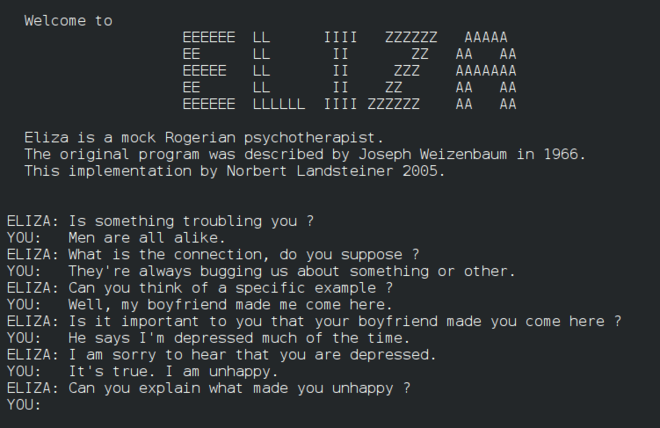

<!--
CO_OP_TRANSLATOR_METADATA:
{
  "original_hash": "b2d11df10030cacc41427a1fbc8bc8f1",
  "translation_date": "2025-08-29T13:44:29+00:00",
  "source_file": "1-Introduction/2-history-of-ML/README.md",
  "language_code": "ar"
}
-->
# تاريخ تعلم الآلة

> رسم تخطيطي بواسطة [تومومي إيمورا](https://www.twitter.com/girlie_mac)

## [اختبار ما قبل المحاضرة](https://gray-sand-07a10f403.1.azurestaticapps.net/quiz/3/)

---

> 🎥 انقر على الصورة أعلاه لمشاهدة فيديو قصير يشرح هذه الدرس.

في هذا الدرس، سنستعرض أهم المحطات في تاريخ تعلم الآلة والذكاء الاصطناعي.

تاريخ الذكاء الاصطناعي (AI) كحقل علمي مرتبط ارتباطًا وثيقًا بتاريخ تعلم الآلة، حيث أن الخوارزميات والتطورات الحاسوبية التي تدعم تعلم الآلة ساهمت في تطوير الذكاء الاصطناعي. من المفيد أن نتذكر أنه، على الرغم من أن هذه المجالات بدأت تتبلور كمجالات بحثية متميزة في الخمسينيات، فإن الاكتشافات [الخوارزمية، الإحصائية، الرياضية، الحاسوبية والتقنية](https://wikipedia.org/wiki/Timeline_of_machine_learning) سبقت وتداخلت مع هذه الحقبة. في الواقع، كان الناس يفكرون في هذه الأسئلة منذ [مئات السنين](https://wikipedia.org/wiki/History_of_artificial_intelligence): يناقش هذا المقال الأسس الفكرية التاريخية لفكرة "الآلة المفكرة".

---
## اكتشافات بارزة

- 1763، 1812 [نظرية بايز](https://wikipedia.org/wiki/Bayes%27_theorem) وأسلافها. هذه النظرية وتطبيقاتها تشكل أساس الاستدلال، حيث تصف احتمال حدوث حدث بناءً على المعرفة السابقة.
- 1805 [نظرية المربعات الصغرى](https://wikipedia.org/wiki/Least_squares) بواسطة عالم الرياضيات الفرنسي أدريان-ماري ليجيندر. هذه النظرية، التي ستتعلم عنها في وحدة الانحدار، تساعد في ملاءمة البيانات.
- 1913 [سلاسل ماركوف](https://wikipedia.org/wiki/Markov_chain)، التي سميت باسم عالم الرياضيات الروسي أندريه ماركوف، تُستخدم لوصف سلسلة من الأحداث المحتملة بناءً على الحالة السابقة.
- 1957 [بيرسيبترون](https://wikipedia.org/wiki/Perceptron) هو نوع من المصنفات الخطية اخترعه عالم النفس الأمريكي فرانك روزنبلات ويشكل أساس التقدم في التعلم العميق.

---

- 1967 [أقرب جار](https://wikipedia.org/wiki/Nearest_neighbor) هو خوارزمية صُممت في الأصل لتخطيط الطرق. في سياق تعلم الآلة، تُستخدم لاكتشاف الأنماط.
- 1970 [الانتشار العكسي](https://wikipedia.org/wiki/Backpropagation) يُستخدم لتدريب [الشبكات العصبية الأمامية](https://wikipedia.org/wiki/Feedforward_neural_network).
- 1982 [الشبكات العصبية المتكررة](https://wikipedia.org/wiki/Recurrent_neural_network) هي شبكات عصبية اصطناعية مشتقة من الشبكات العصبية الأمامية وتُنشئ رسومًا بيانية زمنية.

✅ قم ببعض البحث. ما هي التواريخ الأخرى التي تبرز كمحورية في تاريخ تعلم الآلة والذكاء الاصطناعي؟

---
## 1950: آلات تفكر

آلان تورينغ، شخصية استثنائية تم التصويت عليها [من قبل الجمهور في عام 2019](https://wikipedia.org/wiki/Icons:_The_Greatest_Person_of_the_20th_Century) كأعظم عالم في القرن العشرين، يُنسب إليه المساهمة في وضع الأساس لفكرة "آلة يمكنها التفكير". تعامل مع المشككين وحاجته الشخصية إلى أدلة تجريبية لهذه الفكرة جزئيًا من خلال إنشاء [اختبار تورينغ](https://www.bbc.com/news/technology-18475646)، الذي ستستكشفه في دروس معالجة اللغة الطبيعية.

---
## 1956: مشروع بحث صيف دارتموث

"كان مشروع البحث الصيفي في دارتموث حول الذكاء الاصطناعي حدثًا بارزًا في مجال الذكاء الاصطناعي"، وفيه تم صياغة مصطلح "الذكاء الاصطناعي" ([المصدر](https://250.dartmouth.edu/highlights/artificial-intelligence-ai-coined-dartmouth)).

> يمكن وصف كل جانب من جوانب التعلم أو أي ميزة أخرى للذكاء بدقة بحيث يمكن إنشاء آلة لمحاكاته.

---

كان الباحث الرئيسي، أستاذ الرياضيات جون مكارثي، يأمل "في المضي قدمًا بناءً على فرضية أن كل جانب من جوانب التعلم أو أي ميزة أخرى للذكاء يمكن وصفها بدقة بحيث يمكن إنشاء آلة لمحاكاته." وكان من بين المشاركين شخصية بارزة أخرى في المجال، مارفن مينسكي.

يُنسب إلى الورشة الفضل في بدء وتشجيع العديد من المناقشات بما في ذلك "ظهور الأساليب الرمزية، الأنظمة التي تركز على مجالات محدودة (أنظمة الخبراء المبكرة)، والأنظمة الاستنتاجية مقابل الأنظمة الاستقرائية." ([المصدر](https://wikipedia.org/wiki/Dartmouth_workshop)).

---
## 1956 - 1974: "السنوات الذهبية"

من الخمسينيات وحتى منتصف السبعينيات، كان هناك تفاؤل كبير بأن الذكاء الاصطناعي يمكن أن يحل العديد من المشاكل. في عام 1967، صرح مارفن مينسكي بثقة أن "في غضون جيل ... سيتم حل مشكلة إنشاء 'الذكاء الاصطناعي' بشكل كبير." (مينسكي، مارفن (1967)، الحساب: الآلات المحدودة واللامحدودة، إنجلوود كليفس، نيوجيرسي: برنتيس-هول)

ازدهرت أبحاث معالجة اللغة الطبيعية، وتم تحسين البحث وجعله أكثر قوة، وتم إنشاء مفهوم "العوالم المصغرة"، حيث تم تنفيذ المهام البسيطة باستخدام تعليمات بلغة واضحة.

---

تم تمويل الأبحاث بشكل جيد من قبل الوكالات الحكومية، وتم تحقيق تقدم في الحساب والخوارزميات، وتم بناء نماذج أولية للآلات الذكية. بعض هذه الآلات تشمل:

* [الروبوت شاكي](https://wikipedia.org/wiki/Shakey_the_robot)، الذي كان يمكنه المناورة واتخاذ قرارات لتنفيذ المهام "بذكاء".

    
    > شاكي في عام 1972

---

* إليزا، "روبوت محادثة" مبكر، كان يمكنه التحدث مع الناس والتصرف كـ "معالج" بدائي. ستتعرف أكثر على إليزا في دروس معالجة اللغة الطبيعية.

    
    > نسخة من إليزا، روبوت محادثة

---

* "عالم الكتل" كان مثالًا على عالم مصغر حيث يمكن تكديس الكتل وفرزها، وتم اختبار التجارب في تعليم الآلات اتخاذ القرارات. ساعدت المكتبات مثل [SHRDLU](https://wikipedia.org/wiki/SHRDLU) في دفع معالجة اللغة إلى الأمام.

    

    > 🎥 انقر على الصورة أعلاه لمشاهدة فيديو: عالم الكتل مع SHRDLU

---
## 1974 - 1980: "شتاء الذكاء الاصطناعي"

بحلول منتصف السبعينيات، أصبح واضحًا أن تعقيد إنشاء "آلات ذكية" قد تم التقليل من شأنه وأن وعوده، بالنظر إلى قوة الحوسبة المتاحة، قد تم تضخيمها. جف التمويل وتباطأت الثقة في المجال. بعض القضايا التي أثرت على الثقة تشمل:
---
- **القيود**. كانت قوة الحوسبة محدودة للغاية.
- **الانفجار التوافقي**. زاد عدد المعلمات التي يجب تدريبها بشكل كبير مع زيادة الطلبات على الحواسيب، دون تطور موازٍ في قوة الحوسبة والقدرات.
- **ندرة البيانات**. كانت هناك ندرة في البيانات التي أعاقت عملية اختبار وتطوير وتحسين الخوارزميات.
- **هل نطرح الأسئلة الصحيحة؟**. بدأت الأسئلة التي كانت تُطرح في المجال تخضع للتشكيك. بدأ الباحثون في مواجهة النقد حول مناهجهم:
  - تم التشكيك في اختبارات تورينغ من خلال نظريات مثل "نظرية الغرفة الصينية" التي افترضت أن "برمجة الكمبيوتر الرقمي قد تجعل الأمر يبدو وكأنه يفهم اللغة ولكنها لا يمكن أن تنتج فهمًا حقيقيًا." ([المصدر](https://plato.stanford.edu/entries/chinese-room/))
  - تم تحدي أخلاقيات إدخال ذكاء اصطناعي مثل "المعالج" إليزا إلى المجتمع.

---

في الوقت نفسه، بدأت تتشكل مدارس مختلفة للذكاء الاصطناعي. تم إنشاء تفرقة بين ممارسات ["الذكاء الاصطناعي الفوضوي" مقابل "الذكاء الاصطناعي المنظم"](https://wikipedia.org/wiki/Neats_and_scruffies). كانت المختبرات "الفوضوية" تعدل البرامج لساعات حتى تحصل على النتائج المطلوبة. أما المختبرات "المنظمة" فكانت "تركز على المنطق وحل المشكلات بشكل رسمي". كانت إليزا وSHRDLU من الأنظمة "الفوضوية" المعروفة. في الثمانينيات، مع ظهور الطلب على جعل أنظمة تعلم الآلة قابلة للتكرار، بدأ النهج "المنظم" يأخذ الصدارة لأن نتائجه أكثر قابلية للتفسير.

---
## أنظمة الخبراء في الثمانينيات

مع نمو المجال، أصبح واضحًا فائدته للأعمال التجارية، وفي الثمانينيات انتشرت "أنظمة الخبراء". "كانت أنظمة الخبراء من بين أول أشكال البرمجيات الناجحة حقًا للذكاء الاصطناعي (AI)." ([المصدر](https://wikipedia.org/wiki/Expert_system)).

هذا النوع من الأنظمة هو في الواقع _هجين_، يتكون جزئيًا من محرك قواعد يحدد متطلبات الأعمال، ومحرك استنتاج يستفيد من نظام القواعد لاستنتاج حقائق جديدة.

شهدت هذه الحقبة أيضًا اهتمامًا متزايدًا بالشبكات العصبية.

---
## 1987 - 1993: "برودة الذكاء الاصطناعي"

كان لتوسع أجهزة أنظمة الخبراء المتخصصة تأثير سلبي حيث أصبحت متخصصة للغاية. كما تنافست أجهزة الكمبيوتر الشخصية مع هذه الأنظمة الكبيرة والمركزية. بدأت ديمقراطية الحوسبة، مما مهد الطريق لانفجار البيانات الضخمة الحديث.

---
## 1993 - 2011

شهدت هذه الحقبة عصرًا جديدًا لتعلم الآلة والذكاء الاصطناعي لحل بعض المشاكل التي كانت قد ظهرت سابقًا بسبب نقص البيانات وقوة الحوسبة. بدأت كمية البيانات في الزيادة بسرعة وأصبحت أكثر توفرًا، للأفضل وللأسوأ، خاصة مع ظهور الهواتف الذكية حوالي عام 2007. توسعت قوة الحوسبة بشكل كبير، وتطورت الخوارزميات جنبًا إلى جنب. بدأ المجال في اكتساب النضج حيث بدأت الأيام الحرة السابقة تتبلور إلى تخصص حقيقي.

---
## الآن

اليوم، تعلم الآلة والذكاء الاصطناعي يؤثران على كل جزء تقريبًا من حياتنا. هذه الحقبة تتطلب فهمًا دقيقًا للمخاطر والتأثيرات المحتملة لهذه الخوارزميات على حياة البشر. كما قال براد سميث من مايكروسوفت: "تثير تكنولوجيا المعلومات قضايا تتعلق بجوهر حماية حقوق الإنسان الأساسية مثل الخصوصية وحرية التعبير. هذه القضايا تزيد من مسؤولية شركات التكنولوجيا التي تبتكر هذه المنتجات. في رأينا، تدعو أيضًا إلى تنظيم حكومي مدروس وتطوير معايير حول الاستخدامات المقبولة" ([المصدر](https://www.technologyreview.com/2019/12/18/102365/the-future-of-ais-impact-on-society/)).

---

يبقى أن نرى ما يحمله المستقبل، ولكن من المهم فهم هذه الأنظمة الحاسوبية والبرمجيات والخوارزميات التي تعمل عليها. نأمل أن يساعدك هذا المنهج الدراسي في اكتساب فهم أفضل بحيث يمكنك اتخاذ قراراتك بنفسك.

> 🎥 انقر على الصورة أعلاه لمشاهدة فيديو: يان ليكون يناقش تاريخ التعلم العميق في هذه المحاضرة

---
## 🚀تحدي

استكشف واحدة من هذه اللحظات التاريخية وتعرف أكثر على الأشخاص الذين كانوا وراءها. هناك شخصيات مثيرة للاهتمام، ولم يتم إنشاء أي اكتشاف علمي في فراغ ثقافي. ماذا تكتشف؟

## [اختبار ما بعد المحاضرة](https://gray-sand-07a10f403.1.azurestaticapps.net/quiz/4/)

---
## المراجعة والدراسة الذاتية

إليك بعض العناصر للمشاهدة والاستماع:

[هذا البودكاست حيث تناقش آمي بويد تطور الذكاء الاصطناعي](http://runasradio.com/Shows/Show/739)

---

## الواجب

[قم بإنشاء خط زمني](assignment.md)

---

**إخلاء المسؤولية**:  
تمت ترجمة هذه الوثيقة باستخدام خدمة الترجمة الآلية [Co-op Translator](https://github.com/Azure/co-op-translator). بينما نسعى لتحقيق الدقة، يرجى العلم أن الترجمات الآلية قد تحتوي على أخطاء أو معلومات غير دقيقة. يجب اعتبار الوثيقة الأصلية بلغتها الأصلية المصدر الموثوق. للحصول على معلومات حساسة أو هامة، يُوصى بالاستعانة بترجمة بشرية احترافية. نحن غير مسؤولين عن أي سوء فهم أو تفسيرات خاطئة تنشأ عن استخدام هذه الترجمة.