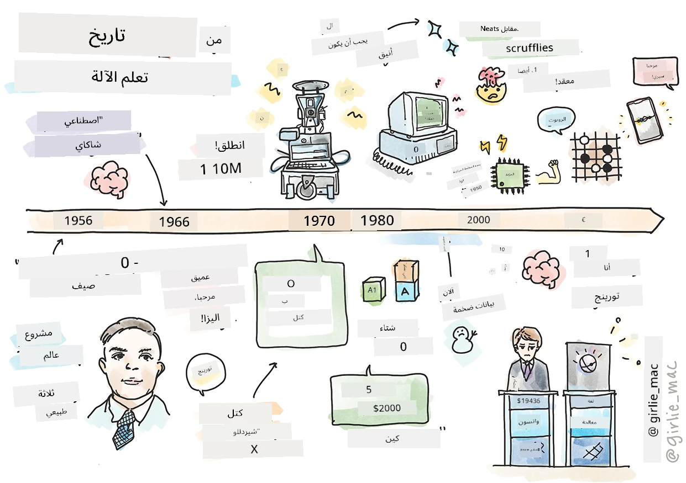
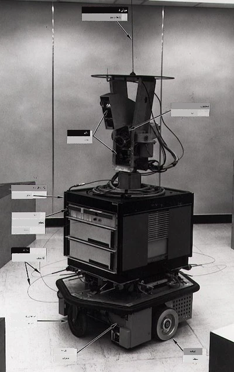
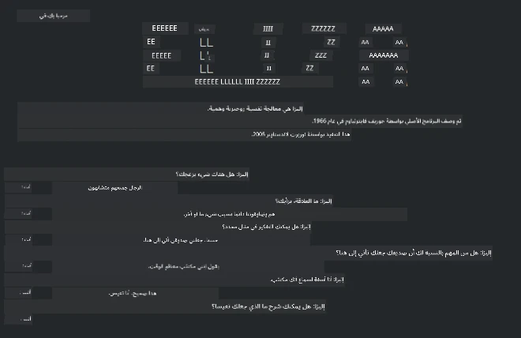

# تاريخ التعلم الآلي

> رسم توضيحي من إعداد [تومومي إيمورا](https://www.twitter.com/girlie_mac)

## [اختبار ما قبل المحاضرة](https://ff-quizzes.netlify.app/en/ml/)

---

> 🎥 انقر على الصورة أعلاه لمشاهدة فيديو قصير يشرح هذه الدرس.

في هذا الدرس، سوف نستعرض المحطات الرئيسية في تاريخ التعلم الآلي والذكاء الاصطناعي.

تاريخ الذكاء الاصطناعي (AI) كمجال مرتبط بتاريخ التعلم الآلي، حيث إن الخوارزميات والتطورات الحاسوبية التي تدعم التعلم الآلي ساهمت في تطور الذكاء الاصطناعي. من المفيد أن نتذكر أنه بينما بدأت هذه المجالات كمجالات استقصائية متميزة في خمسينيات القرن الماضي، فإن [العديد من الاكتشافات الخوارزمية والإحصائية والرياضية والحسابية والتقنية](https://wikipedia.org/wiki/Timeline_of_machine_learning) سبقت وتداخلت مع هذه الحقبة. في الواقع، كان الناس يفكرون في هذه الأسئلة منذ [مئات السنين](https://wikipedia.org/wiki/History_of_artificial_intelligence): يناقش هذا المقال الأسس الفكرية التاريخية لفكرة "آلة تفكر".

---
## اكتشافات بارزة

- 1763، 1812 [نظرية بايز](https://wikipedia.org/wiki/Bayes%27_theorem) وسابقتها. هذه النظرية وتطبيقاتها تشكل أساس الاستدلال، موصوفة احتمال حدوث حدث بناءً على المعرفة السابقة.
- 1805 [نظرية المربعات الصغرى](https://wikipedia.org/wiki/Least_squares) التي وضعها عالم الرياضيات الفرنسي أدريان ماري ليجندر. هذه النظرية، التي ستتعلم عنها في وحدة الانحدار لدينا، تساعد في ملاءمة البيانات.
- 1913 [سلاسل ماركوف](https://wikipedia.org/wiki/Markov_chain) التي سميت على اسم عالم الرياضيات الروسي أندري ماركوف، وتستخدم لوصف تسلسل من الأحداث المحتملة بناءً على حالة سابقة.
- 1957 [البيرسيترون](https://wikipedia.org/wiki/Perceptron) هو نوع من المصنفات الخطية اخترعه العالم النفسي الأمريكي فرانك روزنبلات والذي شكّل أساس التقدم في التعلم العميق.

---

- 1967 [أقرب جار](https://wikipedia.org/wiki/Nearest_neighbor) هو خوارزمية صُممت أصلاً لتخطيط الطرق. في سياق التعلم الآلي تُستخدم لاكتشاف الأنماط.
- 1970 [الانتشار العكسي](https://wikipedia.org/wiki/Backpropagation) تُستخدم لتدريب [الشبكات العصبية التغذوية الأمامية](https://wikipedia.org/wiki/Feedforward_neural_network).
- 1982 [الشبكات العصبية العودية](https://wikipedia.org/wiki/Recurrent_neural_network) هي شبكات عصبية صناعية مشتقة من الشبكات التغذوية الأمامية تُنشئ رسوماً زمنية.

✅ قم ببحث بسيط. ما التواريخ الأخرى التي تبرز كمحورية في تاريخ التعلم الآلي والذكاء الاصطناعي؟

---
## 1950: الآلات التي تفكر

آلان تورينج، شخص استثنائي حقاً وصُوّت له [من الجمهور في 2019](https://wikipedia.org/wiki/Icons:_The_Greatest_Person_of_the_20th_Century) كأعظم عالم في القرن العشرين، يُنسب إليه الفضل في إرساء أساس مفهوم "آلة قادرة على التفكير". تصدى للمتشككين وحاجته إلى أدلة تجريبية على هذا المفهوم جزئياً من خلال إنشاء [اختبار تورينج](https://www.bbc.com/news/technology-18475646)، الذي ستستكشفه في دروس معالجة اللغة الطبيعية لدينا.

---
## 1956: مشروع بحوث صيف دارتموث

"كان مشروع بحوث صيف دارتموث للذكاء الاصطناعي حدثًا تأسيسيًا كمجال للذكاء الاصطناعي"، وهنا تم صياغة مصطلح "الذكاء الاصطناعي" ([المصدر](https://250.dartmouth.edu/highlights/artificial-intelligence-ai-coined-dartmouth)).

> يمكن من حيث المبدأ وصف كل جانب من جوانب التعلم أو أي خاصية أخرى للذكاء بدقة كافية بحيث يمكن تصميم آلة لمحاكاتها.

---

كان الباحث الرئيسي، أستاذ الرياضيات جون مكارثي، يأمل "في المضي قدما على أساس الافتراض أن كل جانب من جوانب التعلم أو أي خاصية أخرى للذكاء يمكن وصفها بدقة كافية بحيث يمكن تصميم آلة لمحاكاتها." وشمل المشاركين شخصية بارزة أخرى في المجال، مارفن مينسكي.

يُعزى إلى الورشة كونها أطلقت وشجعت عدة مناقشات من بينها "صعود الأساليب الرمزية، الأنظمة التي تركز على مجالات محدودة (أنظمة الخبراء المبكرة)، والأنظمة الاستنتاجية مقابل الأنظمة الاستقرائية." ([المصدر](https://wikipedia.org/wiki/Dartmouth_workshop)).

---
## 1956 - 1974: "السنوات الذهبية"

من أوائل الخمسينات وحتى منتصف السبعينات، كان التفاؤل عاليًا بأن الذكاء الاصطناعي يمكن أن يحل الكثير من المشاكل. في 1967، صرح مارفن مينسكي بثقة أن "خلال جيل... سيتم حل مشكلة خلق 'الذكاء الاصطناعي' إلى حد كبير." (مينسكي، مارفن (1967)، الحساب: الآلات المحدودة واللانهائية، إنجلوود كليفس، نيوجيرسي: برنتيس-هول)

ازدهرت أبحاث معالجة اللغة الطبيعية، وتم تحسين البحث وجعله أكثر قوة، وظهر مفهوم "العوالم الصغيرة" حيث تُنجز المهام البسيطة باستخدام تعليمات بلغة بسيطة.

---

تم تمويل الأبحاث جيدًا من قبل الوكالات الحكومية، وتحققت تقدمات في الحوسبة والخوارزميات، وبُنيت نماذج أولية لآلات ذكية. بعض هذه الآلات تشمل:

* [شاكِي الروبوت](https://wikipedia.org/wiki/Shakey_the_robot)، الذي كان بإمكانه المناورة واتخاذ قرارات حول كيفية أداء المهام "بذكاء".

    
    > شاكِي في 1972

---

* إليزا، "البوت الحواري" المبكر، كانت تستطيع التحدث مع الناس وتصرف كـ "معالج" بدائي. ستتعلم المزيد عن إليزا في دروس معالجة اللغة الطبيعية.

    
    > نسخة من إليزا، محادثة بوك

---

* كان "عالم الكتل" مثالاً على عالم صغير حيث يمكن تكديس وفرز الكتل، ويمكن اختبار تجارب تعليم الآلات اتخاذ القرارات. ساعدت التقدمات المبنية على مكتبات مثل [SHRDLU](https://wikipedia.org/wiki/SHRDLU) على دفع معالجة اللغة إلى الأمام.

    

    > 🎥 انقر على الصورة أعلاه لمشاهدة فيديو: عالم الكتل مع SHRDLU

---
## 1974 - 1980: "الشتاء الاصطناعي"

بحلول منتصف السبعينات، أصبح واضحًا أن تعقيد صنع "آلات ذكية" كان قد قُيًّم بأقل مما ينبغي، وأن وعوده، بالنظر إلى قوة الحوسبة المتاحة، قد تم المبالغة بها. جفت مصادر التمويل وبدأ الثقة في المجال تتراجع. بعض القضايا التي أثرت على الثقة شملت:
---
- **القيود**. كانت قوة الحوسبة محدودة جدًا.
- **الانفجار التركيبي**. زاد عدد المعلمات المطلوب تدريبها بشكل أُسّي مع طلب المزيد من الحواسيب، دون تطور موازٍ في القدرة الحاسوبية والإمكانات.
- **قلة البيانات**. كان هناك نقص في البيانات الذي أعاق عملية اختبار، وتطوير، وتحسين الخوارزميات.
- **هل نطرح الأسئلة الصحيحة؟**. بدأت الأسئلة المطروحة نفسها تخضع للنقد. بدأ الباحثون يواجهون انتقادات تجاه أساليبهم:
  - تم التشكيك في اختبارات تورينج بوسائل، من بين أفكار أخرى، مثل "نظرية الغرفة الصينية" التي تفترض أن "برمجة كمبيوتر رقمي قد تجعله يبدو كأنه يفهم اللغة لكنه لا يستطيع تحقيق فهم حقيقي." ([المصدر](https://plato.stanford.edu/entries/chinese-room/))
  - تم تحدي الأخلاق في إدخال ذكاء اصطناعي مثل "المعالج" إليزا في المجتمع.

---

في الوقت نفسه، بدأت مدارس فكرية مختلفة في الذكاء الاصطناعي تتشكل. تم إنشاء تباين بين ممارسات ["الذكاء الاصطناعي الفوضوي" مقابل "النظيف"](https://wikipedia.org/wiki/Neats_and_scruffies). المختبرات الـ _الفوضوية_ كانت تعدل البرامج لساعات حتى تحصل على النتائج المرغوبة. المختبرات الـ _النظيفة_ "تركيز على المنطق وحل المشكلات بشكل رسمي". كانت إليزا وSHRDLU أنظمة _فوضوية_ معروفة. في الثمانينات، ومع ظهور الحاجة لجعل أنظمة التعلم الآلي قابلة لإعادة الإنتاج، بدأ النهج _النظيف_ يأخذ الصدارة تدريجيًا حيث تصبح نتائجه أكثر قابلية للتفسير.

---
## أنظمة الخبراء في الثمانينات

مع نمو المجال، أصبح واضحًا فائدته للأعمال التجارية، وفي الثمانينات ظهر انتشار أنظمة "الخبراء". "كانت أنظمة الخبراء من أوائل أشكال البرمجيات الناجحة الحقيقية للذكاء الاصطناعي." ([المصدر](https://wikipedia.org/wiki/Expert_system)).

هذا النوع من الأنظمة _هجين_ جزئياً، يتألف جزئياً من محرك قواعد يحدد متطلبات العمل، ومحرك استنتاج يستخدم نظام القواعد لاستنتاج حقائق جديدة.

كما شهدت هذه الحقبة اهتمامًا متزايدًا بالشبكات العصبية.

---
## 1987 - 1993: "تبريد" الذكاء الاصطناعي

كان لتكاثر أجهزة أنظمة الخبراء المتخصصة تأثير سلبي حيث أصبحت متخصصة جدًا. كما تنافست الحواسيب الشخصية الصاعدة مع هذه الأنظمة الكبيرة والمتخصصة والمركزية. بدأت ديمقراطية الحوسبة، ومهدت الطريق في نهاية المطاف لانفجار البيانات الضخمة الحديث.

---
## 1993 - 2011

شهدت هذه الحقبة عصرًا جديدًا للتعلم الآلي والذكاء الاصطناعي قادرين على حل بعض المشاكل التي نشأت سابقًا بسبب نقص البيانات وقوة الحوسبة. بدأ حجم البيانات في التزايد بسرعة وأصبح أكثر توافرًا على نطاق واسع، للأفضل والأسوأ، خصوصًا مع ظهور الهواتف الذكية حوالي 2007. توسعت قوة الحوسبة بشكل أسّي، وتطورت الخوارزميات بالتزامن. بدأ المجال يكتسب نضجًا مع تحول الأيام الحرة السابقة إلى انضباط حقيقي.

---
## الآن

اليوم، يلامس التعلم الآلي والذكاء الاصطناعي تقريبًا كل جانب من جوانب حياتنا. هذا العصر يتطلب فهمًا دقيقًا للمخاطر والتأثيرات المحتملة لهذه الخوارزميات على حياة الإنسان. كما قال براد سميث من مايكروسوفت، "تثير تكنولوجيا المعلومات قضايا تمس جوهر الحماية الأساسية لحقوق الإنسان مثل الخصوصية وحرية التعبير. تعزز هذه القضايا المسؤولية على شركات التكنولوجيا التي تصنع هذه المنتجات. ومن وجهة نظرنا، فإنها تدعو أيضًا إلى تنظيم حكومي مدروس وتطوير معايير حول الاستخدامات المقبولة" ([المصدر](https://www.technologyreview.com/2019/12/18/102365/the-future-of-ais-impact-on-society/)).

---

لا يزال المستقبل مجهولًا، ولكن من المهم فهم هذه الأنظمة الحاسوبية والبرمجيات والخوارزميات التي تعمل عليها. نأمل أن تساعدك هذه المناهج على اكتساب فهم أفضل لتتمكن من اتخاذ قرارك بنفسك.

> 🎥 انقر على الصورة أعلاه لمشاهدة فيديو: يان لوكون يناقش تاريخ التعلم العميق في هذه المحاضرة

---
## 🚀تحدي

اغمر نفسك في أحد هذه اللحظات التاريخية وتعلم المزيد عن الأشخاص خلفها. هناك شخصيات مثيرة للاهتمام، ولم يُخلق أي اكتشاف علمي في فراغ ثقافي. ماذا تكتشف؟

## [اختبار ما بعد المحاضرة](https://ff-quizzes.netlify.app/en/ml/)

---
## مراجعة ودراسة ذاتية

إليك بعض المواد لمشاهدتها والاستماع إليها:

[هذا البودكاست حيث تناقش إيمي بويّد تطور الذكاء الاصطناعي](http://runasradio.com/Shows/Show/739)

---

## الواجب

[أنشئ جدولًا زمنيًا](assignment.md)

---

<!-- CO-OP TRANSLATOR DISCLAIMER START -->
**تنويه**:
تمت ترجمة هذا المستند باستخدام خدمة الترجمة بالذكاء الاصطناعي [Co-op Translator](https://github.com/Azure/co-op-translator). بينما نسعى للدقة، يرجى العلم أن الترجمات الآلية قد تحتوي على أخطاء أو عدم دقة. يجب اعتبار المستند الأصلي بلغته الأصلية المصدر الرسمي والمعتمد. للمعلومات الهامة، يُنصح بالاستعانة بترجمة بشرية محترفة. نحن غير مسؤولين عن أي سوء فهم أو تفسير ناتج عن استخدام هذه الترجمة.
<!-- CO-OP TRANSLATOR DISCLAIMER END -->