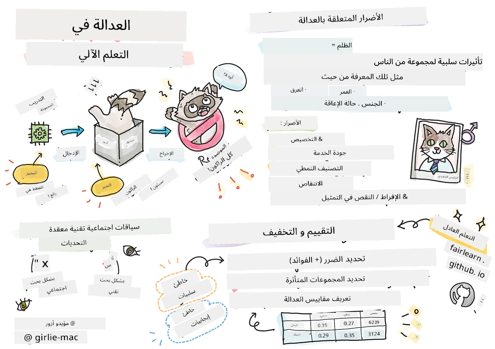

# بناء حلول التعلم الآلي مع الذكاء الاصطناعي المسؤول
 

> رسم تخطيطي بواسطة [Tomomi Imura](https://www.twitter.com/girlie_mac)

## [اختبار ما قبل المحاضرة](https://ff-quizzes.netlify.app/en/ml/)
 
## مقدمة

في هذا المنهج الدراسي، ستبدأ باكتشاف كيف يمكن للتعلم الآلي أن يؤثر ويؤثر بالفعل على حياتنا اليومية. حتى الآن، الأنظمة والنماذج تشارك في مهام اتخاذ القرار اليومية، مثل تشخيص الرعاية الصحية، الموافقات على القروض أو كشف الاحتيال. لذا، من المهم أن تعمل هذه النماذج بشكل جيد لتقديم نتائج جديرة بالثقة. مثل أي تطبيق برمجي، من الممكن أن تفشل أنظمة الذكاء الاصطناعي في الوفاء بالتوقعات أو أن تسفر عن نتيجة غير مرغوبة. لهذا السبب من الضروري أن نكون قادرين على فهم وشرح سلوك نموذج الذكاء الاصطناعي.

تخيل ما قد يحدث عندما تكون البيانات التي تستخدمها لبناء هذه النماذج تفتقر إلى بعض الفئات السكانية، مثل العرق، الجنس، الرأي السياسي، الدين، أو تمثل هذه الفئات بشكل غير متناسب. ماذا عن عندما يتم تفسير ناتج النموذج لصالح فئة سكانية معينة؟ ما هي العواقب على التطبيق؟ بالإضافة إلى ذلك، ماذا يحدث عندما يكون للنموذج نتيجة سلبية وتسبب ضرراً للناس؟ من هو المسؤول عن سلوك أنظمة الذكاء الاصطناعي؟ هذه بعض الأسئلة التي سنستكشفها في هذا المنهج.

في هذا الدرس، ستقوم بـ:

- زيادة وعيك بأهمية العدالة في التعلم الآلي والأضرار المتعلقة بالعدالة.
- التعرف على ممارسة استكشاف الحالات الشاذة والسيناريوهات غير المعتادة لضمان الموثوقية والسلامة.
- فهم الحاجة لتمكين الجميع من خلال تصميم أنظمة شاملة.
- استكشاف مدى أهمية حماية خصوصية وأمان البيانات والأشخاص.
- رؤية أهمية وجود نهج شفاف لشرح سلوك نماذج الذكاء الاصطناعي.
- الانتباه لكيفية كون المساءلة ضرورية لبناء الثقة في أنظمة الذكاء الاصطناعي.

## المتطلبات المسبقة

كمتطلب مسبق، يرجى أخذ مسار التعلم "مبادئ الذكاء الاصطناعي المسؤول" ومشاهدة الفيديو أدناه حول الموضوع:

تعرّف أكثر على الذكاء الاصطناعي المسؤول من خلال متابعة هذا [مسار التعلم](https://docs.microsoft.com/learn/modules/responsible-ai-principles/?WT.mc_id=academic-77952-leestott)

> 🎥 انقر على الصورة أعلاه لمشاهدة فيديو: نهج مايكروسوفت للذكاء الاصطناعي المسؤول

## العدالة

يجب أن تعامل أنظمة الذكاء الاصطناعي الجميع بشكل عادل وتتجنب التأثير بطرق مختلفة على مجموعات مماثلة من الناس. على سبيل المثال، عندما تقدم أنظمة الذكاء الاصطناعي التوجيه بشأن العلاج الطبي، طلبات القروض، أو التوظيف، يجب أن تقدم نفس التوصيات للجميع الذين لديهم أعراض متشابهة، أو ظروف مالية مماثلة، أو مؤهلات مهنية متقاربة. كل واحد منا كإنسان يحمل تحيزات مكتسبة تؤثر على قراراته وأفعاله. قد تكون هذه التحيزات واضحة في البيانات التي نستخدمها لتدريب أنظمة الذكاء الاصطناعي. قد يحدث مثل هذا التلاعب أحيانًا دون قصد. غالبًا ما يصعب معرفة متى تقوم بإدخال تحيز في البيانات بوعي.

**"الظلم"** يشمل التأثيرات السلبية، أو "الأضرار"، لمجموعة من الناس، مثل تلك المعرفة من حيث العرق، الجنس، العمر، أو حالة الإعاقة. يمكن تصنيف الأضرار الرئيسية المتعلقة بالعدالة على النحو التالي:

- **التخصيص**، إذا تم تفضيل جنس أو إثنية معينة على أخرى.
- **جودة الخدمة**. إذا قمت بتدريب البيانات على سيناريو محدد ولكن الواقع أكثر تعقيدًا بكثير، يؤدي ذلك إلى خدمة سيئة الأداء. على سبيل المثال، موزع صابون لا يبدو قادرًا على التعرف على الأشخاص ذوي البشرة الداكنة. [مرجع](https://gizmodo.com/why-cant-this-soap-dispenser-identify-dark-skin-1797931773)
- **الشهرة السيئة**. انتقاد لامر أو شخص بشكل غير عادل ووضع ملصقات عليه. على سبيل المثال، تقنية تصنيف الصور بالخطأ صنفت صور الأشخاص ذوي البشرة الداكنة على أنهم غوريلا.
- **التمثيل الزائد أو الناقص**. الفكرة هي أن مجموعة معينة ليست مرئية في مهنة محددة، وأي خدمة أو وظيفة تستمر في تعزيز ذلك تسهم في الإضرار.
- **الصور النمطية**. ربط مجموعة معينة بصفات محددة مسبقًا. على سبيل المثال، نظام ترجمة بين الإنجليزية والتركية قد يحتوي على أخطاء بسبب كلمات مرتبطة بالصور النمطية للجنس.

> الترجمة إلى التركية

> الترجمة مرة أخرى إلى الإنجليزية

عند تصميم واختبار أنظمة الذكاء الاصطناعي، نحتاج إلى ضمان أن الذكاء الاصطناعي عادل وليس مبرمجًا لاتخاذ قرارات متحيزة أو تمييزية، والتي يُمنع البشر من اتخاذها أيضًا. ضمان العدالة في الذكاء الاصطناعي والتعلم الآلي لا يزال تحديًا اجتماعيًا تقنيًا معقدًا.

### الموثوقية والسلامة

لبناء الثقة، يجب أن تكون أنظمة الذكاء الاصطناعي موثوقة، وآمنة، ومتسقة في الظروف العادية وغير المتوقعة. من المهم معرفة كيف ستتصرف أنظمة الذكاء الاصطناعي في مجموعة متنوعة من الحالات، خاصة عندما تكون حالات شاذة. عند بناء حلول الذكاء الاصطناعي، يجب أن يكون هناك تركيز كبير على كيفية التعامل مع مجموعة واسعة من الظروف التي قد تواجهها الحلول. على سبيل المثال، يجب على السيارة ذاتية القيادة أن تضع سلامة الناس كأولوية قصوى. ونتيجة لذلك، يحتاج الذكاء الاصطناعي المشغّل للسيارة إلى النظر في جميع السيناريوهات الممكنة التي قد تواجه السيارة مثل الليل، العواصف الرعدية أو العواصف الثلجية، الأطفال الذين يركضون عبر الشارع، الحيوانات الأليفة، أعمال الطرق، وما إلى ذلك. مدى جودة قدرة نظام الذكاء الاصطناعي على التعامل مع نطاق واسع من الظروف بشكل موثوق وآمن يعكس مستوى التوقع الذي اعتبره عالم البيانات أو مطور الذكاء الاصطناعي خلال تصميم أو اختبار النظام.

> [🎥 انقر هنا لمشاهدة فيديو: ](https://www.microsoft.com/videoplayer/embed/RE4vvIl)

### الشمولية

يجب تصميم أنظمة الذكاء الاصطناعي لتشمل وتمكن الجميع. عند تصميم وتنفيذ أنظمة الذكاء الاصطناعي، يقوم علماء البيانات ومطورو الذكاء الاصطناعي بتحديد ومعالجة الحواجز المحتملة في النظام التي قد تستبعد الناس دون قصد. على سبيل المثال، هناك مليار شخص من ذوي الإعاقة حول العالم. مع تقدم الذكاء الاصطناعي، يمكنهم الوصول إلى مجموعة واسعة من المعلومات والفرص بسهولة أكبر في حياتهم اليومية. من خلال معالجة الحواجز، يتم خلق فرص للابتكار وتطوير منتجات ذكاء اصطناعي تقدم تجارب أفضل تفيد الجميع.

> [🎥 انقر هنا لفيديو: الشمولية في الذكاء الاصطناعي](https://www.microsoft.com/videoplayer/embed/RE4vl9v)

### الأمان والخصوصية

يجب أن تكون أنظمة الذكاء الاصطناعي آمنة وتحترم خصوصية الناس. يقل ثقة الناس في الأنظمة التي تعرض خصوصيتهم، معلوماتهم أو حياتهم للخطر. عند تدريب نماذج التعلم الآلي، نعتمد على البيانات لتحقيق أفضل النتائج. لذلك، يجب مراعاة أصل البيانات وسلامتها. على سبيل المثال، هل كانت البيانات مقدمة من المستخدم أم متاحة بشكل عام؟ بعد ذلك، أثناء العمل مع البيانات، من الضروري تطوير أنظمة ذكاء اصطناعي يمكنها حماية المعلومات السرية ومقاومة الهجمات. مع انتشار الذكاء الاصطناعي، أصبح حماية الخصوصية وتأمين المعلومات الشخصية والتجارية المهمة أكثر حرجًا وتعقيدًا. تتطلب مسائل الخصوصية وأمن البيانات اهتمامًا خاصًا مع الذكاء الاصطناعي لأن الوصول إلى البيانات ضروري لأنظمة الذكاء الاصطناعي لاتخاذ تنبؤات وقرارات دقيقة ومستنيرة حول الأشخاص.

> [🎥 انقر هنا لفيديو: الأمان في الذكاء الاصطناعي](https://www.microsoft.com/videoplayer/embed/RE4voJF)

- كب صناعة، حققنا تقدمًا كبيرًا في الخصوصية والأمان، مدفوعًا بشكل كبير بتنظيمات مثل اللائحة العامة لحماية البيانات (GDPR).
- ومع أنظمة الذكاء الاصطناعي، يجب أن نعترف بالتوتر بين الحاجة إلى المزيد من البيانات الشخصية لجعل الأنظمة أكثر شخصية وفعالية – وبين الخصوصية.
- تمامًا كما حدث مع ولادة الكمبيوترات المتصلة بالإنترنت، نشهد أيضًا زيادة كبيرة في عدد قضايا الأمان المتعلقة بالذكاء الاصطناعي.
- في الوقت نفسه، رأينا استخدام الذكاء الاصطناعي لتحسين الأمان. كمثال، معظم برامج مضادات الفيروسات الحديثة تعتمد اليوم على تقنيات الذكاء الاصطناعي.
- يجب علينا التأكد من أن عمليات علم البيانات لدينا تمزج بتناغم مع أحدث ممارسات الخصوصية والأمان.

### الشفافية
يجب أن تكون أنظمة الذكاء الاصطناعي مفهومة. جزء حاسم من الشفافية هو شرح سلوك أنظمة الذكاء الاصطناعي ومكوناتها. تحسين فهم أنظمة الذكاء الاصطناعي يتطلب أن يفهم المعنيون كيف ولماذا تعمل حتى يتمكنوا من تحديد مشاكل الأداء المحتملة، مخاوف السلامة والخصوصية، التحيزات، الممارسات الاستبعادية، أو النتائج غير المقصودة. نؤمن أيضًا بأن من يستخدم أنظمة الذكاء الاصطناعي يجب أن يكون صادقًا ومنفتحًا حول متى ولماذا وكيف يختار نشرها. وكذلك حدود الأنظمة التي يستخدمونها. على سبيل المثال، إذا استخدم بنك نظام ذكاء اصطناعي لدعم قرارات إقراض المستهلكين، فمن المهم فحص النتائج وفهم البيانات التي تؤثر على توصيات النظام. بدأت الحكومات بوضع تنظيمات للذكاء الاصطناعي عبر الصناعات، لذلك يجب على علماء البيانات والمنظمات شرح ما إذا كان نظام الذكاء الاصطناعي يفي بالمتطلبات التنظيمية، خاصة عندما تكون هناك نتائج غير مرغوبة.

> [🎥 انقر هنا لفيديو: الشفافية في الذكاء الاصطناعي](https://www.microsoft.com/videoplayer/embed/RE4voJF)

- بسبب تعقيد أنظمة الذكاء الاصطناعي، يصعب فهم كيف تعمل وتفسير النتائج.
- يؤثر هذا النقص في الفهم على طريقة إدارة هذه الأنظمة، تشغيلها، وتوثيقها.
- والأهم من ذلك، يؤثر هذا النقص في الفهم على القرارات المتخذة باستخدام النتائج التي تنتجها هذه الأنظمة.

### المساءلة
 
يجب أن يكون الأشخاص الذين يصممون وينشرون أنظمة الذكاء الاصطناعي مسؤولين عن كيفية عمل أنظمتهم. الحاجة إلى المساءلة تكون مهمة بشكل خاص مع التقنيات الحساسة مثل التعرف على الوجه. مؤخرًا، كان هناك طلب متزايد لتقنية التعرف على الوجه، خاصة من منظمات إنفاذ القانون التي ترى إمكانيات التقنية في استخدامات مثل العثور على الأطفال المفقودين. ومع ذلك، يمكن أن تستخدم هذه التكنولوجيا من قبل الحكومات لتعريض الحريات الأساسية لمواطنيها للخطر، مثل تمكين المراقبة المستمرة لأفراد محددين. لذا، يجب على علماء البيانات والمنظمات أن يكونوا مسؤولين عن كيفية تأثير نظام الذكاء الاصطناعي على الأفراد أو المجتمع.

> 🎥 انقر على الصورة أعلاه لمشاهدة فيديو: تحذيرات من المراقبة الجماعية عبر التعرف على الوجه

في النهاية، أحد أكبر الأسئلة لأجيالنا، كجيل أول يجلب الذكاء الاصطناعي للمجتمع، هو كيفية ضمان بقاء الحواسيب مسؤولة أمام الناس وكيفية ضمان بقاء الأشخاص الذين يصممون الحواسيب مسؤولين أمام الجميع.

## تقييم التأثير

قبل تدريب نموذج التعلم الآلي، من المهم إجراء تقييم تأثير لفهم هدف نظام الذكاء الاصطناعي؛ ما هو الاستخدام المقصود؛ أين سيتم نشره؛ ومن سيتفاعل مع النظام. هذه المعلومات تفيد المراجعين أو المختبرين الذين يقيمون النظام لمعرفة العوامل التي يجب مراعاتها عند تحديد المخاطر المحتملة والعواقب المتوقعة.

المجالات التالية تعتبر محورية عند إجراء تقييم التأثير:

* **التأثير السلبي على الأفراد**. الوعي بأي قيود أو متطلبات، استخدام غير مدعوم أو أي قيود معروفة تعيق أداء النظام ضروري لضمان عدم استخدام النظام بطريقة قد تسبب ضررًا للأفراد.
* **متطلبات البيانات**. فهم كيف وأين سيستخدم النظام البيانات يمكن المراجعين من استكشاف متطلبات البيانات التي يجب الانتباه لها (مثل تنظيمات GDPR أو HIPAA). بالإضافة إلى ذلك، يجب فحص ما إذا كانت مصدر البيانات أو كميتها كافيين للتدريب.
* **ملخص التأثير**. جمع قائمة بالأضرار المحتملة التي قد تنشأ من استخدام النظام. خلال دورة حياة التعلم الآلي، مراجعة ما إذا تم التخفيف من المشكلات المحددة أو التعامل معها.
* **الأهداف التطبيقية** لكل من المبادئ الستة الأساسية. تقييم ما إذا تم تحقيق أهداف كل مبدأ وإذا كان هناك أي ثغرات.

## تصحيح الأخطاء مع الذكاء الاصطناعي المسؤول

مثل تصحيح الأخطاء في تطبيق برمجي، يعد تصحيح أخطاء نظام الذكاء الاصطناعي خطوة ضرورية لتحديد وحل المشكلات في النظام. هناك العديد من العوامل التي تؤثر على عدم أداء النموذج كما هو متوقع أو بشكل مسؤول. معظم مقاييس أداء النماذج التقليدية هي مقاييس كمية لأداء النموذج، والتي لا تكفي لتحليل كيف ينتهك نموذج مبادئ الذكاء الاصطناعي المسؤول. علاوة على ذلك، نموذج التعلم الآلي صندوق أسود يصعب فهم ما الذي يدفع ناتجه أو تقديم شرح عند حدوث خطأ. لاحقًا في هذا المقرر، سنتعلم كيفية استخدام لوحة تحكم الذكاء الاصطناعي المسؤول للمساعدة في تصحيح أنظمة الذكاء الاصطناعي. توفر اللوحة أداة شاملة لعلماء البيانات ومطوري الذكاء الاصطناعي لأداء:

* **تحليل الأخطاء**. لتحديد توزيع الخطأ للنموذج الذي يمكن أن يؤثر على عدالة النظام أو موثوقيته.
* **نظرة عامة على النموذج**. لاكتشاف أماكن التفاوت في أداء النموذج عبر مجموعات البيانات.
* **تحليل البيانات**. لفهم توزيع البيانات وتحديد أي تحيز محتمل في البيانات قد يؤدي إلى مشاكل في العدالة، الشمولية، والموثوقية.
* **قابلية تفسير النموذج**. لفهم ما يؤثر أو يؤثر في تنبؤات النموذج. هذا يساعد في شرح سلوك النموذج، وهو أمر مهم للشفافية والمساءلة.

## 🚀 تحدي
 
لمنع إدخال الأضرار من البداية، يجب علينا:

- وجود تنوع في الخلفيات ووجهات النظر بين الأشخاص العاملين على الأنظمة
- الاستثمار في مجموعات البيانات التي تعكس تنوع مجتمعنا
- تطوير طرق أفضل طوال دورة حياة التعلم الآلي لاكتشاف وتصحيح المسؤولية في الذكاء الاصطناعي عندما تحدث

فكر في سيناريوهات حياتية حقيقية يكون فيها عدم ثقة النموذج واضحًا في بناء النموذج واستخدامه. ماذا يجب أن نأخذ في الاعتبار أيضًا؟

## [اختبار ما بعد المحاضرة](https://ff-quizzes.netlify.app/en/ml/)

## مراجعة ودراسة ذاتية
 

في هذا الدرس، تعلمت بعض أساسيات مفاهيم العدالة وعدم العدالة في التعلم الآلي.  
 
شاهد هذه الورشة للتعمق أكثر في المواضيع: 

- في السعي نحو الذكاء الاصطناعي المسؤول: تطبيق المبادئ عملياً بقلم بيسميرا نوشي، مهرنوش سامي وأميت شارما

> 🎥 انقر على الصورة أعلاه لمشاهدة فيديو: صندوق أدوات الذكاء الاصطناعي المسؤول: إطار عمل مفتوح المصدر لبناء ذكاء اصطناعي مسؤول من تأليف بيسميرا نوشي، مهرنوش سامي، وأميت شارما

اقرأ أيضاً: 

- مركز موارد الذكاء الاصطناعي المسؤول من مايكروسوفت: [موارد الذكاء الاصطناعي المسؤول – مايكروسوفت AI](https://www.microsoft.com/ai/responsible-ai-resources?activetab=pivot1%3aprimaryr4) 

- مجموعة أبحاث FATE من مايكروسوفت: [FATE: العدالة، المساءلة، الشفافية، والأخلاقيات في الذكاء الاصطناعي - أبحاث مايكروسوفت](https://www.microsoft.com/research/theme/fate/) 

صندوق أدوات الذكاء الاصطناعي المسؤول: 

- [مستودع صندوق أدوات الذكاء الاصطناعي المسؤول على GitHub](https://github.com/microsoft/responsible-ai-toolbox)

اقرأ عن أدوات Azure Machine Learning لضمان العدالة:

- [Azure Machine Learning](https://docs.microsoft.com/azure/machine-learning/concept-fairness-ml?WT.mc_id=academic-77952-leestott) 

## المهمة

[استكشف صندوق أدوات الذكاء الاصطناعي المسؤول](assignment.md)

---

<!-- CO-OP TRANSLATOR DISCLAIMER START -->
**تنويه**:
تمت ترجمة هذا المستند باستخدام خدمة الترجمة بالذكاء الاصطناعي [Co-op Translator](https://github.com/Azure/co-op-translator). بينما نسعى للدقة، يرجى العلم أن الترجمات الآلية قد تحتوي على أخطاء أو عدم دقة. يجب اعتبار المستند الأصلي بلغته الأصلية المصدر الرسمي والمعتمد. للمعلومات الهامة، يُنصح بالاستعانة بترجمة بشرية محترفة. نحن غير مسؤولين عن أي سوء فهم أو تفسير ناتج عن استخدام هذه الترجمة.
<!-- CO-OP TRANSLATOR DISCLAIMER END -->