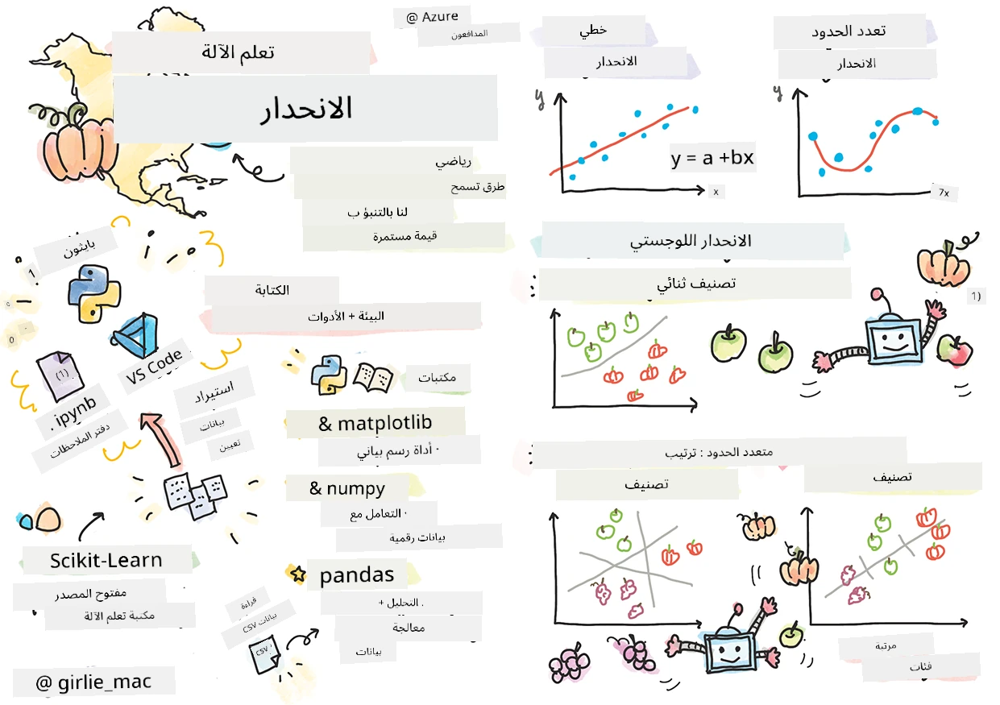
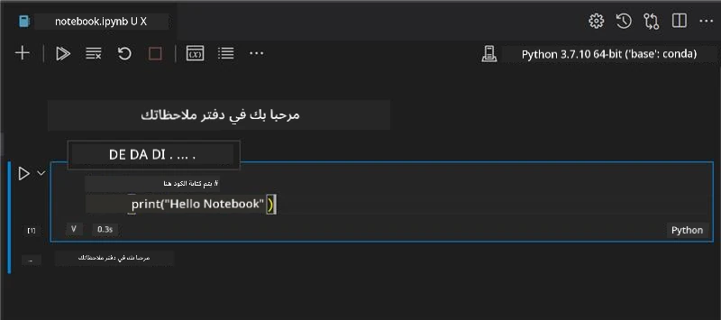
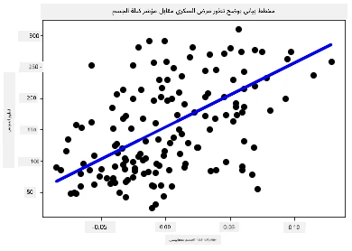

# ابدأ مع بايثون و Scikit-learn لنماذج الانحدار



> ملاحظة مرسومة بواسطة [تومومي إيمورا](https://www.twitter.com/girlie_mac)

## [اختبار قبل المحاضرة](https://ff-quizzes.netlify.app/en/ml/)

> ### [هذه الدرسة متاحة بلغة R!](../../../../2-Regression/1-Tools/solution/R/lesson_1.html)

## مقدمة

في هذه الدروس الأربعة، ستكتشف كيفية بناء نماذج الانحدار. سنناقش قريبًا ما هي استخداماتها. ولكن قبل أن تفعل أي شيء، تأكد من أن لديك الأدوات المناسبة لبدء العملية!

في هذا الدرس، ستتعلم كيفية:

- تهيئة حاسوبك لمهام التعلم الآلي المحلية.
- العمل مع دفاتر Jupyter.
- استخدام Scikit-learn، بما في ذلك التثبيت.
- استكشاف الانحدار الخطي من خلال تمرين عملي.

## التثبيتات والإعدادات

[](https://youtu.be/-DfeD2k2Kj0 "التعلم الآلي للمبتدئين - جهز أدواتك لبناء نماذج التعلم الآلي")

> 🎥 انقر على الصورة أعلاه لمشاهدة فيديو قصير يشرح كيفية تهيئة حاسوبك للتعلم الآلي.

1. **تثبيت بايثون**. تأكد من تثبيت [بايثون](https://www.python.org/downloads/) على حاسوبك. ستستخدم بايثون في العديد من مهام علم البيانات والتعلم الآلي. تتضمن معظم أنظمة الحاسوب تثبيتًا مسبقًا لبايثون. هناك أيضًا [حزم برمجة بايثون](https://code.visualstudio.com/learn/educators/installers?WT.mc_id=academic-77952-leestott) مفيدة متاحة لتسهيل الإعداد لبعض المستخدمين.

   مع ذلك، تتطلب بعض استخدامات بايثون إصدارًا معينًا من البرنامج، في حين تحتاج أخرى إلى إصدار مختلف. لذلك، من المفيد العمل ضمن [بيئة افتراضية](https://docs.python.org/3/library/venv.html).

2. **تثبيت Visual Studio Code**. تأكد من وجود Visual Studio Code مثبتًا على حاسوبك. اتبع هذه التعليمات لـ [تثبيت Visual Studio Code](https://code.visualstudio.com/) للإعداد الأساسي. ستستخدم بايثون في Visual Studio Code في هذا المساق، لذا قد ترغب في تعلُّم كيفية [تهيئة Visual Studio Code](https://docs.microsoft.com/learn/modules/python-install-vscode?WT.mc_id=academic-77952-leestott) لتطوير برامج بايثون.

   > تعرّف على بايثون بسهولة من خلال متابعة مجموعة [وحدات التعلم](https://docs.microsoft.com/users/jenlooper-2911/collections/mp1pagggd5qrq7?WT.mc_id=academic-77952-leestott)
   >
   > [](https://youtu.be/yyQM70vi7V8 "إعداد بايثون مع Visual Studio Code")
   >
   > 🎥 انقر على الصورة أعلاه لمشاهدة فيديو: استخدام بايثون في VS Code.

3. **تثبيت Scikit-learn**، باتباع [هذه التعليمات](https://scikit-learn.org/stable/install.html). بما أنك تحتاج إلى التأكد من استخدام بايثون 3، يُوصى باستخدام بيئة افتراضية. لاحظ أنه إذا كنت تثبت هذه المكتبة على ماك M1، هناك تعليمات خاصة على الصفحة المذكورة أعلاه.

1. **تثبيت Jupyter Notebook**. ستحتاج إلى [تثبيت حزمة Jupyter](https://pypi.org/project/jupyter/).

## بيئة التأليف الخاصة بك في التعلم الآلي

ستستخدم **الدفاتر** لتطوير كود بايثون الخاص بك وإنشاء نماذج التعلم الآلي. هذا النوع من الملفات أداة شائعة لدى علماء البيانات، ويمكن التعرف عليها من خلال اللاحقة أو الامتداد `.ipynb`.

الدفاتر هي بيئة تفاعلية تسمح للمطور بكتابة الكود وإضافة ملاحظات وكتابة توثيق حول الكود، وهو أمر مفيد جدًا للمشاريع التجريبية أو البحثية.

[](https://youtu.be/7E-jC8FLA2E "التعلم الآلي للمبتدئين - إعداد دفاتر Jupyter لبدء بناء نماذج الانحدار")

> 🎥 انقر على الصورة أعلاه لمشاهدة فيديو قصير يشرح هذا التمرين.

### تمرين - العمل مع دفتر ملاحظات

في هذا المجلد، ستجد الملف _notebook.ipynb_.

1. افتح _notebook.ipynb_ في Visual Studio Code.

   ستبدأ خادم Jupyter مع تشغيل بايثون 3+. ستجد أجزاء من الدفتر يمكن `تشغيلها`، وهي قطع من الكود. يمكنك تشغيل قطعة الكود من خلال اختيار الرمز الذي يشبه زر التشغيل.

1. اختر رمز `md` وأضف بعض الماركدون، والنص التالي **# مرحبًا بك في دفترك**.

   ثم أضف بعض كود بايثون.

1. اكتب **print('hello notebook')** في كتلة الكود.
1. اختر السهم لتشغيل الكود.

   سترى العبارة المطبوعة:

    ```output
    hello notebook
    ```



يمكنك دمج كودك مع التعليقات لتوثيق الدفتر بنفسك.

✅ فكر للحظة كيف تختلف بيئة عمل مطور الويب مقارنةً ببيئة عالم البيانات.

## ابدأ العمل مع Scikit-learn

الآن بعد أن تم إعداد بايثون في بيئتك المحلية وأصبحت مرتاحًا في استخدام دفاتر Jupyter، لنكتسب نفس الراحة مع Scikit-learn (تنطق `ساي` كما في `science`). يوفر Scikit-learn [واجهة برمجة تطبيقات واسعة](https://scikit-learn.org/stable/modules/classes.html#api-ref) لمساعدتك في أداء مهام التعلم الآلي.

حسب موقعهم [الرسمي](https://scikit-learn.org/stable/getting_started.html)، "سكايكيت-ليرن هي مكتبة تعلم آلي مفتوحة المصدر تدعم التعلم الخاضع للإشراف وغير الخاضع للإشراف. كما توفر أدوات متنوعة لتركيب النماذج، ومعالجة البيانات، واختيار النماذج وتقييمها، والعديد من الأدوات الأخرى."

في هذا المساق، ستستخدم Scikit-learn وأدوات أخرى لبناء نماذج تعلم آلي لأداء ما نسميه 'التعلم الآلي التقليدي'. لقد تجنبنا عمدًا الشبكات العصبية والتعلم العميق، إذ يتم تناولها بشكل أفضل في منهجية 'الذكاء الاصطناعي للمبتدئين' القادمة.

يجعل Scikit-learn بناء النماذج وتقييمها سهلاً. يركز أساسًا على استخدام البيانات الرقمية ويحتوي على عدة مجموعات بيانات جاهزة للاستخدام كأدوات تعلم. كما يتضمن نماذج مبنية مسبقًا ليجربها الطلاب. لنستكشف أولاً عملية تحميل البيانات المعبأة واستخدام مقدّر مدمج أول نموذج تعلم آلي مع Scikit-learn باستخدام بيانات أساسية.

## تمرين - دفتر ملاحظاتك الأول مع Scikit-learn

> استُلهم هذا الدليل من [مثال الانحدار الخطي](https://scikit-learn.org/stable/auto_examples/linear_model/plot_ols.html#sphx-glr-auto-examples-linear-model-plot-ols-py) على موقع Scikit-learn.


[](https://youtu.be/2xkXL5EUpS0 "التعلم الآلي للمبتدئين - مشروعك الأول للانحدار الخطي في بايثون")

> 🎥 انقر على الصورة أعلاه لمشاهدة فيديو قصير يشرح هذا التمرين.

في ملف _notebook.ipynb_ المرتبط بهذا الدرس، قم بمسح كل الخلايا بالضغط على رمز 'سلة المهملات'.

في هذا القسم، ستعمل مع مجموعة بيانات صغيرة عن مرض السكري مدمجة في Scikit-learn لأغراض التعلم. تخيل أنك تريد اختبار علاج لمرضى السكري. قد تساعدك نماذج التعلم الآلي على تحديد أي المرضى قد يستجيبون بشكل أفضل للعلاج، بناءً على تركيبات من المتغيرات. حتى نموذج انحدار بسيط جدًا، عند تصوره، قد يظهر معلومات حول المتغيرات التي قد تساعدك في تنظيم تجاربك السريرية النظرية.

✅ هناك العديد من أنواع طرق الانحدار، واختيارك يعتمد على الإجابة التي تبحث عنها. إذا أردت التنبؤ بالطول المحتمل لشخص في عمر معين، ستستخدم الانحدار الخطي، لأنك تبحث عن **قيمة رقمية**. إذا كنت مهتمًا باكتشاف ما إذا كان نوع من المأكولات يجب اعتباره نباتيًا أم لا، فأنت تبحث عن **تصنيف فئة** لذا ستستخدم الانحدار اللوجستي. ستتعلم المزيد عن الانحدار اللوجستي لاحقًا. فكر قليلًا في بعض الأسئلة التي يمكنك طرحها على البيانات، وأي من هذه الطرق سيكون الأنسب.

لنبدأ هذه المهمة.

### استيراد المكتبات

لهذه المهمة سنستورد بعض المكتبات:

- **matplotlib**. إنها أداة [رسم بياني مفيدة](https://matplotlib.org/) وسنستخدمها لإنشاء مخطط خطي.
- **numpy**. [numpy](https://numpy.org/doc/stable/user/whatisnumpy.html) مكتبة مفيدة للتعامل مع البيانات الرقمية في بايثون.
- **sklearn**. هذه هي مكتبة [Scikit-learn](https://scikit-learn.org/stable/user_guide.html).

استورد بعض المكتبات لمساعدتك في مهامك.

1. أضف الاستيرادات بكتابة الكود التالي:

   ```python
   import matplotlib.pyplot as plt
   import numpy as np
   from sklearn import datasets, linear_model, model_selection
   ```

   في الأعلى تقوم باستيراد `matplotlib`، و `numpy`، كما تستورد `datasets`، و `linear_model` و `model_selection` من `sklearn`. يستخدم `model_selection` لتقسيم البيانات إلى مجموعات تدريب واختبار.

### مجموعة بيانات السكري

تتضمن مجموعة البيانات المدمجة [السكري](https://scikit-learn.org/stable/datasets/toy_dataset.html#diabetes-dataset) 442 عينة بيانات عن مرض السكري، مع 10 متغيرات ميزة، بعضها يشمل:

- العمر: العمر بالسنوات
- مؤشر كتلة الجسم
- ضغط الدم: متوسط ضغط الدم
- s1 tc: خلايا تي (نوع من خلايا الدم البيضاء)

✅ تشمل هذه المجموعة مفهوم 'الجنس' كمتغير ميزة مهم في البحث حول السكري. تتضمن العديد من مجموعات البيانات الطبية هذا النوع من التصنيف الثنائي. فكر قليلاً في كيفية أن تصنيفات مثل هذه قد تستبعد أجزاء معينة من السكان من العلاجات.

الآن، قم بتحميل بيانات X و y.

> 🎓 تذكر، هذا تعلم مشرف، ونحتاج إلى هدف ‘y’ مسمى.

في خلية كود جديدة، قم بتحميل مجموعة بيانات السكري باستدعاء `load_diabetes()`. يشير المعطى `return_X_y=True` إلى أن `X` ستكون مصفوفة بيانات، و `y` سيكون الهدف للانحدار.

1. أضف بعض أوامر الطباعة لعرض شكل مصفوفة البيانات وعنصرها الأول:

    ```python
    X, y = datasets.load_diabetes(return_X_y=True)
    print(X.shape)
    print(X[0])
    ```

    ما تحصل عليه كرد هو زوج مرتب. ما تفعله هو تعيين أول قيمتين من الزوج إلى `X` و `y` على التوالي. تعرف أكثر [عن الأزواج المرتبة](https://wikipedia.org/wiki/Tuple).

    يمكنك رؤية أن هذه البيانات تحتوي على 442 عنصرًا مشكّلة في مصفوفات من 10 عناصر:

    ```text
    (442, 10)
    [ 0.03807591  0.05068012  0.06169621  0.02187235 -0.0442235  -0.03482076
    -0.04340085 -0.00259226  0.01990842 -0.01764613]
    ```

    ✅ فكّر قليلًا في العلاقة بين البيانات وهدف الانحدار. الانحدار الخطي يتنبأ بالعلاقات بين ميزة X والمتغير الهدف y. هل يمكنك العثور على [الهدف](https://scikit-learn.org/stable/datasets/toy_dataset.html#diabetes-dataset) لمجموعة بيانات السكري في التوثيق؟ ماذا تُظهر هذه المجموعة بناءً على الهدف؟

2. بعد ذلك، اختر جزءًا من هذه المجموعة لرسمه باختيار العمود الثالث من المجموعة. يمكنك فعل ذلك باستخدام عامل `:` لاختيار كل الصفوف، ثم اختيار العمود الثالث باستخدام الفهرس (2). يمكنك أيضًا إعادة تشكيل البيانات لتكون مصفوفة ثنائية الأبعاد - حسب المطلوب للرسم - باستخدام `reshape(n_rows, n_columns)`. إذا كان أحد المعاملات -1، يتم حساب البعد الموافق تلقائيًا.

   ```python
   X = X[:, 2]
   X = X.reshape((-1,1))
   ```

   ✅ في أي وقت، اطبع البيانات للتحقق من شكلها.

3. الآن بعد أن أصبحت لديك بيانات جاهزة للرسم، يمكنك أن ترى ما إذا كان الماكينة يمكنها المساعدة في تحديد تقسيم منطقي بين الأرقام في هذه المجموعة. للقيام بذلك، تحتاج إلى تقسيم كل من البيانات (X) والهدف (y) إلى مجموعات اختبار وتدريب. لدى Scikit-learn طريقة مباشرة لذلك؛ يمكنك تقسيم بيانات الاختبار عند نقطة معينة.

   ```python
   X_train, X_test, y_train, y_test = model_selection.train_test_split(X, y, test_size=0.33)
   ```

4. الآن أنت جاهز لتدريب نموذجك! قم بتحميل نموذج الانحدار الخطي وقم بتدريبه باستخدام مجموعات التدريب X و y الخاصة بك باستخدام `model.fit()`:

    ```python
    model = linear_model.LinearRegression()
    model.fit(X_train, y_train)
    ```

    ✅ `model.fit()` هي دالة سترى وجودها في العديد من مكتبات التعلم الآلي مثل TensorFlow

5. ثم، أنشئ توقعًا باستخدام بيانات الاختبار، باستخدام الدالة `predict()`. سيتم استخدام هذا لرسم الخط بين مجموعات البيانات.

    ```python
    y_pred = model.predict(X_test)
    ```

6. حان الوقت الآن لعرض البيانات في رسم بياني. Matplotlib أداة مفيدة جدًا لهذه المهمة. أنشئ مخطط نقاط لجميع بيانات X و y الاختبارية، واستخدم التوقع لرسم خط في المكان الأنسب، بين مجموعات بيانات النموذج.

    ```python
    plt.scatter(X_test, y_test,  color='black')
    plt.plot(X_test, y_pred, color='blue', linewidth=3)
    plt.xlabel('Scaled BMIs')
    plt.ylabel('Disease Progression')
    plt.title('A Graph Plot Showing Diabetes Progression Against BMI')
    plt.show()
    ```

   


   ✅ فكر قليلاً في ما يحدث هنا. هناك خط مستقيم يمر عبر العديد من نقاط البيانات الصغيرة، ولكنه ماذا يفعل بالضبط؟ هل ترى كيف ينبغي أن تتمكن من استخدام هذا الخط للتنبؤ بمكان تناسب نقطة بيانات جديدة غير مرئية بالنسبة لمحور y في الرسم البياني؟ حاول التعبير بالكلمات عن الاستخدام العملي لهذا النموذج.

تهانينا، لقد أنشأت نموذج الانحدار الخطي الأول لك، وأنتجت توقعًا به، وعرضته في رسم بياني!

---
## 🚀تحدي

قم برسم متغير مختلف من هذه المجموعة البيانية. تلميح: حرر هذا السطر: `X = X[:,2]`. بالنظر إلى هدف هذه البيانات، ماذا يمكنك اكتشافه عن تقدم مرض السكري كمرض؟
## [اختبار ما بعد المحاضرة](https://ff-quizzes.netlify.app/en/ml/)

## مراجعة ودراسة ذاتية

في هذا الدرس، عملت مع الانحدار الخطي البسيط، بدلاً من الانحدار الخطي أحادي المتغير أو المتعدد. اقرأ قليلاً عن الفروقات بين هذه الأساليب، أو ألق نظرة على [هذا الفيديو](https://www.coursera.org/lecture/quantifying-relationships-regression-models/linear-vs-nonlinear-categorical-variables-ai2Ef)

اقرأ المزيد عن مفهوم الانحدار وفكر في أنواع الأسئلة التي يمكن الإجابة عليها باستخدام هذه التقنية. خذ هذا [الدليل](https://docs.microsoft.com/learn/modules/train-evaluate-regression-models?WT.mc_id=academic-77952-leestott) لتعميق فهمك.

## الواجب

[مجموعة بيانات مختلفة](assignment.md)

---

<!-- CO-OP TRANSLATOR DISCLAIMER START -->
**تنويه**:
تمت ترجمة هذا المستند باستخدام خدمة الترجمة بالذكاء الاصطناعي [Co-op Translator](https://github.com/Azure/co-op-translator). بينما نسعى للدقة، يرجى العلم أن الترجمات الآلية قد تحتوي على أخطاء أو عدم دقة. يجب اعتبار المستند الأصلي بلغته الأصلية المصدر الرسمي والمعتمد. للمعلومات الهامة، يُنصح بالاستعانة بترجمة بشرية محترفة. نحن غير مسؤولين عن أي سوء فهم أو تفسير ناتج عن استخدام هذه الترجمة.
<!-- CO-OP TRANSLATOR DISCLAIMER END -->