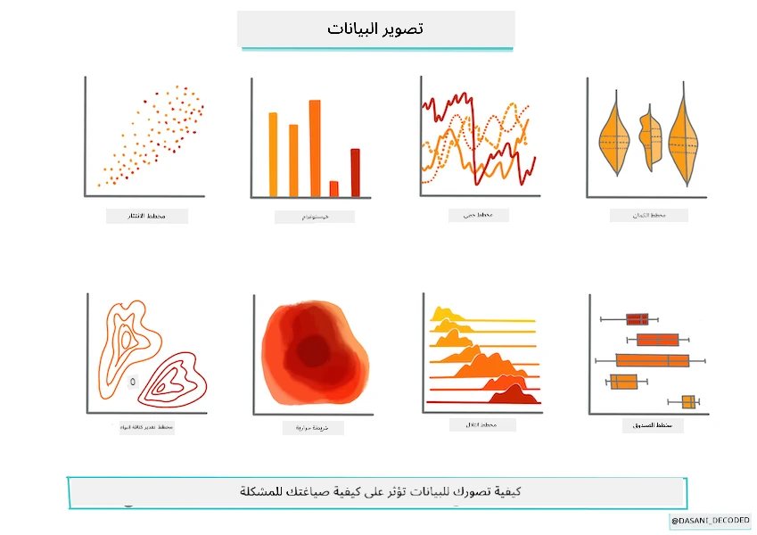
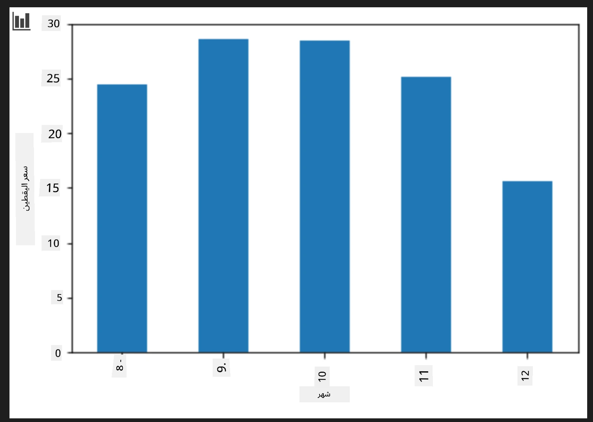
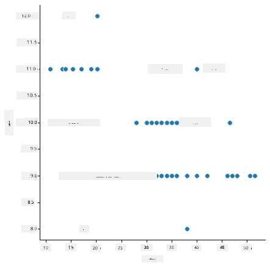
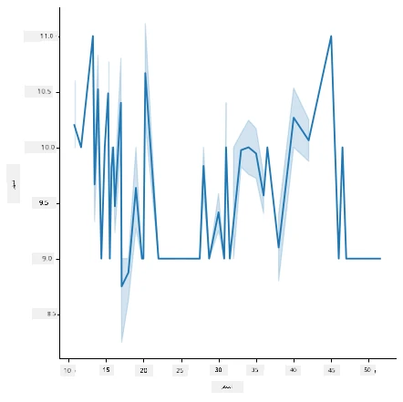
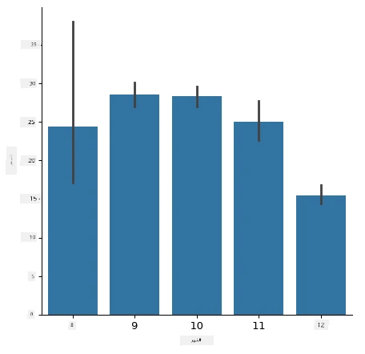
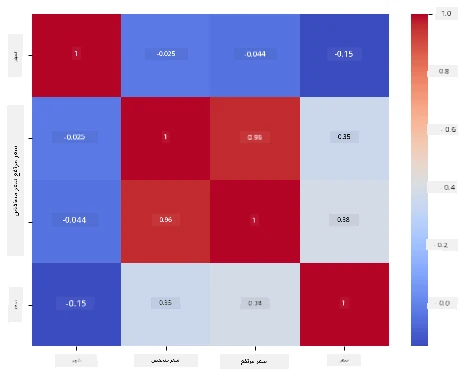

# بناء نموذج انحدار باستخدام Scikit-learn: تحضير البيانات وتصويرها



المخطط البياني بواسطة [دساني ماديباللي](https://twitter.com/dasani_decoded)

## [اختبار قبل المحاضرة](https://ff-quizzes.netlify.app/en/ml/)

> ### [هذا الدرس متاح بلغة R!](../../../../2-Regression/2-Data/solution/R/lesson_2.html)

## مقدمة

الآن بعد أن أعددت الأدوات التي تحتاجها لتبدأ في بناء نماذج تعلم الآلة باستخدام Scikit-learn، أنت جاهز لبدء طرح الأسئلة على بياناتك. أثناء عملك مع البيانات وتطبيق حلول تعلم الآلة، من المهم جدًا أن تفهم كيفية طرح السؤال الصحيح لفتح إمكانيات مجموعة بياناتك بشكل صحيح.

في هذا الدرس، ستتعلم:

- كيفية تحضير بياناتك لبناء النموذج.
- كيفية استخدام Matplotlib لتصور البيانات.
- كيفية استخدام Seaborn لتصور بيانات أكثر تعبيرًا.

## طرح السؤال الصحيح بخصوص بياناتك

السؤال الذي تحتاج إلى إجابته سيحدد نوع خوارزميات تعلم الآلة التي ستستخدمها. وجودة الجواب الذي ستحصل عليه ستكون مرتبطة بشكل كبير بطبيعة بياناتك.

ألق نظرة على [البيانات](https://github.com/microsoft/ML-For-Beginners/blob/main/2-Regression/data/US-pumpkins.csv) المقدمة لهذا الدرس. يمكنك فتح ملف .csv هذا في VS Code. نظرة سريعة تظهر على الفور وجود فراغات ومزيج من بيانات نصية ورقمية. هناك أيضًا عمود غريب اسمه 'Package' حيث البيانات مزيج بين 'sacks' و 'bins' وقيم أخرى. البيانات، في الواقع، هي فوضى إلى حد ما.

[](https://youtu.be/5qGjczWTrDQ "تعلم الآلة للمبتدئين - كيف تحلل وتنظف مجموعة بيانات")

> 🎥 انقر على الصورة أعلاه لمشاهدة فيديو قصير يشرح كيفية تحضير البيانات لهذا الدرس.

في الواقع، من غير الشائع أن تُمنح مجموعة بيانات جاهزة تمامًا للاستخدام لبناء نموذج تعلم آلة من الصندوق مباشرة. في هذا الدرس، ستتعلم كيف تحضر مجموعة بيانات خام باستخدام مكتبات بايثون القياسية. ستتعلم أيضًا تقنيات مختلفة لتصور البيانات.

## دراسة حالة: 'سوق القرع'

في هذا المجلد، ستجد ملف .csv في مجلد الجذر `data` يسمى [US-pumpkins.csv](https://github.com/microsoft/ML-For-Beginners/blob/main/2-Regression/data/US-pumpkins.csv) والذي يحتوي على 1757 سطرًا من البيانات حول سوق القرع، مرتبة في مجموعات حسب المدينة. هذه بيانات خام مستخرجة من [تقارير أسواق الخضروات المتخصصة](https://www.marketnews.usda.gov/mnp/fv-report-config-step1?type=termPrice) التي توزعها وزارة الزراعة الأمريكية.

### تحضير البيانات

هذه البيانات في الملكية العامة. يمكن تنزيلها في ملفات متعددة، لكل مدينة على حدة، من موقع وزارة الزراعة الأمريكية. لتجنب وجود ملفات متعددة كثيرة، قمنا بدمج جميع بيانات المدن في ملف جدول بيانات واحد، وبالتالي قمنا بالفعل _بتحضير_ البيانات قليلاً. بعد ذلك، دعونا نلقي نظرة أدق على البيانات.

### بيانات القرع - استنتاجات مبكرة

ماذا تلاحظ عن هذه البيانات؟ لقد رأيت بالفعل وجود مزيج من النصوص، الأرقام، الفراغات والقيم الغريبة التي تحتاج إلى تفسير.

ما السؤال الذي يمكنك طرحه على هذه البيانات باستخدام تقنية الانحدار؟ ماذا عن "توقع سعر قرعة للبيع خلال شهر معين". بالنظر مرة أخرى إلى البيانات، هناك بعض التعديلات التي تحتاج إلى إجرائها لإنشاء هيكل البيانات اللازم للمهمة.
## تمرين - تحليل بيانات القرع

دعونا نستخدم [Pandas](https://pandas.pydata.org/)، (اسمها يعني `تحليل بيانات بايثون`) أداة مفيدة جدًا لتشكيل البيانات، لتحليل وتحضير بيانات القرع هذه.

### أولاً، تحقق من تواريخ مفقودة

ستحتاج أولاً إلى اتخاذ خطوات للتحقق من التواريخ المفقودة:

1. تحويل التواريخ إلى صيغة شهر (هذه تواريخ أمريكية، لذا الصيغة هي `MM/DD/YYYY`).
2. استخراج الشهر في عمود جديد.

افتح ملف _notebook.ipynb_ في Visual Studio Code واستورد جدول البيانات إلى إطار بيانات جديد من Pandas.

1. استخدم الدالة `head()` لمشاهدة أول خمسة صفوف.

    ```python
    import pandas as pd
    pumpkins = pd.read_csv('../data/US-pumpkins.csv')
    pumpkins.head()
    ```

    ✅ ما الدالة التي ستستخدمها لعرض آخر خمسة صفوف؟

1. تحقق إذا كان هناك بيانات مفقودة في إطار البيانات الحالي:

    ```python
    pumpkins.isnull().sum()
    ```

    توجد بيانات مفقودة، لكن ربما لن تؤثر على المهمة الحالية.

1. لجعل إطار البيانات أسهل في العمل، اختر فقط الأعمدة التي تحتاجها، باستخدام دالة `loc` التي تستخرج من إطار البيانات الأصلي مجموعة من الصفوف (تمرر كمعامل أول) وأعمدة (تمرر كمعامل ثاني). التعبير `:` في الحالة أدناه يعني "كل الصفوف".

    ```python
    columns_to_select = ['Package', 'Low Price', 'High Price', 'Date']
    pumpkins = pumpkins.loc[:, columns_to_select]
    ```

### ثانيًا، حدد متوسط سعر القرع

فكر في كيفية تحديد متوسط سعر القرع في شهر معين. ما الأعمدة التي ستختارها لهذه المهمة؟ تلميح: ستحتاج إلى 3 أعمدة.

الحل: احسب متوسط عمودي `Low Price` و `High Price` لملء عمود السعر الجديد، وحول عمود التاريخ ليظهر فقط الشهر. لحسن الحظ، وفقًا للتحقق أعلاه، لا توجد بيانات مفقودة للتواريخ أو الأسعار.

1. لحساب المتوسط، أضف الشيفرة التالية:

    ```python
    price = (pumpkins['Low Price'] + pumpkins['High Price']) / 2

    month = pd.DatetimeIndex(pumpkins['Date']).month

    ```

   ✅ لا تتردد في طباعة أي بيانات تود التحقق منها باستخدام `print(month)`.

2. الآن، انسخ بياناتك المحولة إلى إطار بيانات Pandas جديد:

    ```python
    new_pumpkins = pd.DataFrame({'Month': month, 'Package': pumpkins['Package'], 'Low Price': pumpkins['Low Price'],'High Price': pumpkins['High Price'], 'Price': price})
    ```

    طباعة إطار البيانات ستظهر لك مجموعة بيانات نظيفة ومرتبة يمكنك بناء نموذج الانحدار الجديد عليها.

### انتظر! هناك أمر غريب هنا

إذا نظرت إلى عمود `Package`، فالقرع يُباع في تكوينات عديدة مختلفة. بعضه يُباع في قياسات '1 1/9 bushel' وبعضه '1/2 bushel'، بعضها بالقرعة، وبعضه بالرطل، وبعضه في صناديق كبيرة بأحجام مختلفة.

> يبدو أن وزن القرع بشكل ثابت أمر صعب جدًا

بالتعمق في البيانات الأصلية، من المثير للاهتمام أن أي شيء في `Unit of Sale` يساوي 'EACH' أو 'PER BIN' أيضًا تتضمن نوع `Package` وحدة بالبوصة أو per bin أو 'كل واحدة'. يبدو أن وزن القرع أمر صعب جدًا لتوحيده، فلنقوم بتصفية القرع باختيار فقط القرع الذي يحتوي على كلمة 'bushel' في عمود `Package`.

1. أضف فلترًا في أعلى الملف، تحت استيراد ملف .csv الأولي:

    ```python
    pumpkins = pumpkins[pumpkins['Package'].str.contains('bushel', case=True, regex=True)]
    ```

    إذا طبعت البيانات الآن، سترى أنك تأخذ فقط حوالي 415 صفًا من البيانات تحتوي على قرع بالحجم bushel.

### انتظر! هناك شيء آخر يجب فعله

هل لاحظت أن كمية bushel تختلف من صف لآخر؟ تحتاج إلى توحيد التسعير بحيث يعرض السعر لكل bushel، فقم ببعض العمليات الحسابية لتوحيده.

1. أضف هذه الأسطر بعد الكتلة التي تنشئ إطار البيانات new_pumpkins:

    ```python
    new_pumpkins.loc[new_pumpkins['Package'].str.contains('1 1/9'), 'Price'] = price/(1 + 1/9)

    new_pumpkins.loc[new_pumpkins['Package'].str.contains('1/2'), 'Price'] = price/(1/2)
    ```

✅ وفقًا لموقع [The Spruce Eats](https://www.thespruceeats.com/how-much-is-a-bushel-1389308)، وزن الـ bushel يعتمد على نوع المنتج، لأنّه قياس حجم. "bushel الطماطم، على سبيل المثال، من المفترض أن يزن 56 رطلاً... الأوراق والخضروات تأخذ مساحة أكثر مع وزن أقل، لذا bushel السبانخ يزن فقط 20 رطلاً." الأمر معقد للغاية! لن نزعج أنفسنا بتحويل bushel إلى رطل، وسنقوم بالتسعير حسب bushel. ومع ذلك، كل هذه الدراسة لأحواض القرع تظهر مدى أهمية فهم طبيعة بياناتك!

الآن يمكنك تحليل التسعير لكل وحدة بالاعتماد على قياس الـ bushel الخاص بها. إذا طبعت البيانات مرة أخرى، سترى كيف تم توحيدها.

✅ هل لاحظت أن القرع المباع بالنصف bushel مكلف للغاية؟ هل تستطيع معرفة السبب؟ تلميح: القرع الصغير أغلى بكثير من الكبير، ربما لأن هناك الكثير منه في كل bushel، بالنظر إلى المساحة غير المستخدمة التي يشغلها قرع كبير مجوف.

## استراتيجيات التصور

جزء من دور عالم البيانات هو إظهار جودة وطبيعة البيانات التي يعملون بها. لتحقيق ذلك، كثيرًا ما يقومون بإنشاء تصورات مثيرة للاهتمام، مثل المخططات والرسوم البيانية التي تظهر جوانب مختلفة من البيانات. بهذه الطريقة، يستطيعون بصريًا إظهار العلاقات والفجوات التي يصعُب اكتشافها بطرق أخرى.

[](https://youtu.be/SbUkxH6IJo0 "تعلم الآلة للمبتدئين - كيفية تصور البيانات باستخدام Matplotlib")

> 🎥 انقر على الصورة أعلاه لمشاهدة فيديو قصير يشرح كيفية تصور البيانات لهذا الدرس.

تساعد التصويرات أيضًا في تحديد تقنية تعلم الآلة الأكثر ملاءمة للبيانات. على سبيل المثال، إذا بدا أن مخطط التبعثر يتبع خطًا، فهذا يشير إلى أن البيانات مناسبة لتمرين الانحدار الخطي.

مكتبة تصور البيانات التي تعمل بشكل جيد في دفاتر Jupyter هي [Matplotlib](https://matplotlib.org/) (وقد رأيتها أيضًا في الدرس السابق).

> احصل على مزيد من الخبرة في تصور البيانات من خلال [هذه الدروس التعليمية](https://docs.microsoft.com/learn/modules/explore-analyze-data-with-python?WT.mc_id=academic-77952-leestott).

## تمرين - تجربة Matplotlib

حاول إنشاء بعض المخططات الأساسية لعرض إطار البيانات الجديد الذي أنشأته للتو. ماذا سيُظهر مخطط خطي أساسي؟

1. استورد Matplotlib في أعلى الملف، تحت استيراد Pandas:

    ```python
    import matplotlib.pyplot as plt
    ```

1. أعد تشغيل الدفتر بالكامل للتحديث.
1. في أسفل الدفتر، أضف خلية لعرض البيانات في مخطط صندوقي:

    ```python
    price = new_pumpkins.Price
    month = new_pumpkins.Month
    plt.scatter(price, month)
    plt.show()
    ```

    

    هل هذا مخطط مفيد؟ هل من شيء مفاجئ بشأنه؟

    هو ليس مفيدًا للغاية كونه يعرض بياناتك كنقاط منتشرة في شهر معين.

### اجعله مفيدًا

لجعل المخططات تعرض بيانات مفيدة، عادةً تحتاج إلى تجميع البيانات بطريقة ما. لنحاول إنشاء مخطط يعرض المحور الرأسي فيه الشهور وتوضح البيانات التوزيع.

1. أضف خلية لإنشاء مخطط أعمدة مجمعة:

    ```python
    new_pumpkins.groupby(['Month'])['Price'].mean().plot(kind='bar')
    plt.ylabel("Pumpkin Price")
    ```

    

    هذا تصور بيانات أكثر فائدة! يبدو أنه يشير إلى أن أعلى سعر للقرع يكون في سبتمبر وأكتوبر. هل يتوافق هذا مع توقعاتك؟ لماذا أو لماذا لا؟

## تمرين - تجربة Seaborn

Matplotlib قوي، لكنه قد يتطلب الكثير من الشيفرة لإنتاج مخطط مصقول. [Seaborn](https://seaborn.pydata.org/) هي مكتبة مبنية _على_ Matplotlib مصممة لتصور البيانات الإحصائية. تعمل مباشرة مع إطارات بيانات Pandas، تطبق أنماطًا افتراضية جذابة، وتتيح إنشاء مخططات إعلامية بقليل من الشفرة. وبما أن Seaborn تُرجع كائنات Matplotlib، فما زلت تستطيع استخدام كل ما تعرفه عن Matplotlib لضبط النتائج بدقة.

> إذا لم تكن قد ثبتت Seaborn، ثبتها باستخدام `pip install seaborn`.

1. استورد Seaborn في أعلى الدفتر، تحت الاستيرادات الأخرى. عادة ما يُستورد بالاسم `sns`:

    ```python
    import seaborn as sns
    ```

### مخططات تبعثر لإظهار العلاقات

جزء كبير من استكشاف البيانات قبل بناء نموذج هو البحث عن _علاقات_ بين المتغيرات. يُعد [مخطط التبعثر](https://en.wikipedia.org/wiki/Scatter_plot) من أفضل الأدوات لذلك: إذا بدت النقاط وكأنها تتبع خطًا، فقد تكون المتغيرات مرتبطة، وهذا مؤشر جيد على أن نموذج الانحدار الخطي قد يعمل.

1. أعد إنشاء مخطط التبعثر الذي أظهر السعر مقابل الشهر كما في السابق، هذه المرة باستخدام [`relplot()`](https://seaborn.pydata.org/generated/seaborn.relplot.html) من Seaborn (مخطط العلاقات) الذي يعمل مباشرة مع أعمدة إطار البيانات:

    ```python
    sns.relplot(x="Price", y="Month", data=new_pumpkins)
    ```

    

    لاحظ كيف تمرر _أسماء الأعمدة_ وإطار البيانات، ويتولى Seaborn تسمية المحاور لك.

2. يمكنك التبديل إلى مخطط خطي بتمرير `kind="line"`. Seaborn يرسم حتى شريطًا مظللًا يظهر نطاق الثقة حول الخط:

    ```python
    sns.relplot(x="Price", y="Month", kind="line", data=new_pumpkins)
    ```

    

    هذه البيانات معقدة إلى حد ما، لذلك مخطط الخط ليس الخيار الأكثر وضوحًا هنا — لكنه يظهر مدى سهولة تغيير أنواع المخططات في Seaborn.

### مخططات الأعمدة لإظهار التوزيعات


سابقًا قمت بتجميع البيانات يدويًا لإنشاء مخطط أعمدة باستخدام Matplotlib. يمكن لـ Seaborn's [`catplot()`](https://seaborn.pydata.org/generated/seaborn.catplot.html) (مخطط تصنيفي) إجراء التجميع والتجميع نيابةً عنك. بشكل افتراضي، يعرض `kind="bar"` متوسط كل فئة مع خط أسود يشير إلى فترة الثقة.

1. أنشئ مخطط أعمدة لسعر المتوسط لكل شهر:

    ```python
    sns.catplot(x="Month", y="Price", data=new_pumpkins, kind="bar")
    ```

    

    هذا يؤكد ما رأيته مع Matplotlib — حيث تصل الأسعار إلى ذروتها حول سبتمبر وأكتوبر — لكن Seaborn يعرض أيضًا مدى تباين السعر _داخل_ كل شهر.

### مخططات الحرارة لإظهار الارتباطات

تقارن مخططات التشتت متغيرين في كل مرة. عندما يكون لديك عدة أعمدة رقمية، يسمح لك [مخطط الحرارة](https://en.wikipedia.org/wiki/Heat_map) برؤية قوة العلاقة بين _كل_ زوج من الأعمدة مرة واحدة. هذه طريقة شائعة لاكتشاف الميزات الأكثر ارتباطًا قبل اختيار ما يتم تغذيته في نموذج (ويُستخدم نفس النوع من المخططات لاحقًا لعرض مصفوفات الالتباس في التصنيف).

1. ابنِ مصفوفة ارتباط باستخدام Pandas، ثم ارسمها باستخدام [`heatmap()`](https://seaborn.pydata.org/generated/seaborn.heatmap.html) من Seaborn. خيار `annot=True` يطبع قيم الارتباط على كل خلية:

    ```python
    correlations = new_pumpkins[['Month', 'Low Price', 'High Price', 'Price']].corr()
    sns.heatmap(correlations, annot=True, cmap="coolwarm")
    ```

    

    القيم القريبة من `1` (أو `-1`) تعني أن الأعمدة مرتبطة ارتباطًا _خطيًا_ قويًا. لاحظ كيف أن `السعر الأدنى` و`السعر الأعلى` مرتبطان تقريبًا بشكل مثالي. من ناحية أخرى، يظهر `الشهر` ارتباطًا خطيًا ضعيفًا فقط مع السعر — على الرغم من أن مخطط الأعمدة أعلاه كشف عن ذروة موسمية واضحة في سبتمبر وأكتوبر. هذه درس مهم: يقيس معامل الارتباط فقط العلاقات _الخطية_ المباشرة، لذلك قد يفوت الأنماط الموسمية أو غير الخطية. ✅ لماذا من المفيد النظر إلى كل من مخطط الحرارة *ومخططات* مثل مخطط الأعمدة قبل اتخاذ قرار بشأن الأعمدة التي يجب استخدامها؟

### Matplotlib أم Seaborn؟

كلا المكتبتين تستحقان المعرفة:

- **Matplotlib** يمنحك تحكمًا دقيقًا في كل عنصر من عناصر المخطط وهو الأساس الذي تبني عليه تقريبًا كل مكتبة رسم بياني بلغة بايثون أخرى.
- **Seaborn** يوفر وظائف عالية المستوى وإعدادات جذابة للمخططات الإحصائية، ويعمل مباشرة مع الإطارات البيانية، وغالبًا ما يكون أسرع لتحليل البيانات الاستكشافي.

سير العمل الشائع هو اللجوء إلى Seaborn لاستكشاف بياناتك بسرعة، ثم النزول إلى Matplotlib عند الحاجة إلى تخصيص التفاصيل.

---

## 🚀تحدي

استكشف أنواع التمثيل البياني المختلفة التي تقدمها مكتبات Matplotlib و Seaborn. ما هي الأنواع الأنسب لمشكلات الانحدار؟

## [اختبار ما بعد المحاضرة](https://ff-quizzes.netlify.app/en/ml/)

## مراجعة ودراسة ذاتية

ألقِ نظرة على الطرق الكثيرة لعرض البيانات. قم بعمل قائمة بالمكتبات المختلفة المتاحة واشرح أيها الأنسب لأنواع المهام المختلفة، مثلاً التمثيل ثنائي الأبعاد مقابل التمثيل ثلاثي الأبعاد. ماذا تكتشف؟

## المهمة

[استكشاف التمثيل البياني](assignment.md)

---

<!-- CO-OP TRANSLATOR DISCLAIMER START -->
**تنويه**:
تمت ترجمة هذا المستند باستخدام خدمة الترجمة بالذكاء الاصطناعي [Co-op Translator](https://github.com/Azure/co-op-translator). بينما نسعى للدقة، يرجى العلم أن الترجمات الآلية قد تحتوي على أخطاء أو عدم دقة. يجب اعتبار المستند الأصلي بلغته الأصلية المصدر الرسمي والمعتمد. للمعلومات الهامة، يُنصح بالاستعانة بترجمة بشرية محترفة. نحن غير مسؤولين عن أي سوء فهم أو تفسير ناتج عن استخدام هذه الترجمة.
<!-- CO-OP TRANSLATOR DISCLAIMER END -->