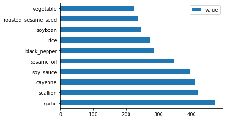

<!--
CO_OP_TRANSLATOR_METADATA:
{
  "original_hash": "76438ce4e5d48982d48f1b55c981caac",
  "translation_date": "2025-08-29T13:59:47+00:00",
  "source_file": "4-Classification/1-Introduction/README.md",
  "language_code": "ar"
}
-->
# مقدمة إلى التصنيف

في هذه الدروس الأربعة، ستستكشف أحد المحاور الأساسية لتعلم الآلة الكلاسيكي - _التصنيف_. سنقوم باستعراض استخدام خوارزميات تصنيف مختلفة مع مجموعة بيانات عن جميع المأكولات الرائعة في آسيا والهند. نأمل أن تكون جائعًا!


> احتفل بالمأكولات الآسيوية في هذه الدروس! الصورة من [Jen Looper](https://twitter.com/jenlooper)

التصنيف هو شكل من أشكال [التعلم الموجه](https://wikipedia.org/wiki/Supervised_learning) الذي يشترك كثيرًا مع تقنيات الانحدار. إذا كان تعلم الآلة يدور حول التنبؤ بالقيم أو الأسماء باستخدام مجموعات البيانات، فإن التصنيف ينقسم عمومًا إلى مجموعتين: _التصنيف الثنائي_ و_التصنيف متعدد الفئات_.

[](https://youtu.be/eg8DJYwdMyg "مقدمة إلى التصنيف")

> 🎥 انقر على الصورة أعلاه لمشاهدة فيديو: يقدم جون غوتاغ من MIT مقدمة عن التصنيف

تذكر:

- **الانحدار الخطي** ساعدك في التنبؤ بالعلاقات بين المتغيرات وإجراء تنبؤات دقيقة حول مكان وقوع نقطة بيانات جديدة بالنسبة لذلك الخط. على سبيل المثال، يمكنك التنبؤ _بسعر اليقطين في سبتمبر مقابل ديسمبر_.
- **الانحدار اللوجستي** ساعدك في اكتشاف "الفئات الثنائية": عند هذا السعر، _هل هذا اليقطين برتقالي أم غير برتقالي_؟

يستخدم التصنيف خوارزميات مختلفة لتحديد طرق أخرى لتحديد تسمية أو فئة نقطة البيانات. دعنا نعمل مع بيانات المأكولات هذه لنرى ما إذا كان بإمكاننا، من خلال ملاحظة مجموعة من المكونات، تحديد أصل المأكولات.

## [اختبار قبل المحاضرة](https://gray-sand-07a10f403.1.azurestaticapps.net/quiz/19/)

> ### [هذا الدرس متوفر بلغة R!](../../../../4-Classification/1-Introduction/solution/R/lesson_10.html)

### مقدمة

التصنيف هو أحد الأنشطة الأساسية للباحث في تعلم الآلة وعالم البيانات. من التصنيف الأساسي لقيمة ثنائية ("هل هذا البريد الإلكتروني مزعج أم لا؟")، إلى التصنيف المعقد للصور وتقسيمها باستخدام رؤية الحاسوب، من المفيد دائمًا أن تكون قادرًا على تصنيف البيانات إلى فئات وطرح الأسئلة عليها.

لصياغة العملية بطريقة أكثر علمية، فإن طريقة التصنيف الخاصة بك تنشئ نموذجًا تنبؤيًا يمكّنك من رسم العلاقة بين المتغيرات المدخلة والمتغيرات الناتجة.


> مشاكل التصنيف الثنائي مقابل متعدد الفئات التي تتعامل معها الخوارزميات. الرسم التوضيحي من [Jen Looper](https://twitter.com/jenlooper)

قبل البدء في عملية تنظيف بياناتنا، تصورها، وتجهيزها لمهام تعلم الآلة، دعونا نتعلم قليلاً عن الطرق المختلفة التي يمكن من خلالها استخدام تعلم الآلة لتصنيف البيانات.

مستمدة من [الإحصائيات](https://wikipedia.org/wiki/Statistical_classification)، يستخدم التصنيف في تعلم الآلة الكلاسيكي ميزات مثل `smoker`، `weight`، و`age` لتحديد _احتمالية الإصابة بمرض معين_. كطريقة تعلم موجهة مشابهة لتمارين الانحدار التي قمت بها سابقًا، يتم تصنيف بياناتك وتستخدم الخوارزميات هذه التصنيفات لتصنيف وتوقع الفئات (أو "الميزات") لمجموعة البيانات وتعيينها إلى مجموعة أو نتيجة.

✅ خذ لحظة لتخيل مجموعة بيانات عن المأكولات. ما الذي يمكن لنموذج متعدد الفئات الإجابة عليه؟ وما الذي يمكن لنموذج ثنائي الإجابة عليه؟ ماذا لو أردت تحديد ما إذا كانت مأكولات معينة تستخدم الحلبة؟ ماذا لو أردت معرفة ما إذا كان بإمكانك، بالنظر إلى كيس بقالة مليء باليانسون النجمي، والخرشوف، والقرنبيط، والفجل، إعداد طبق هندي نموذجي؟

[](https://youtu.be/GuTeDbaNoEU "سلال غامضة مجنونة")

> 🎥 انقر على الصورة أعلاه لمشاهدة فيديو. الفكرة الأساسية لبرنامج 'Chopped' هي "السلة الغامضة" حيث يتعين على الطهاة إعداد طبق من اختيار عشوائي من المكونات. بالتأكيد كان نموذج تعلم الآلة سيساعد!

## مرحبًا بـ 'المصنف'

السؤال الذي نريد طرحه على مجموعة بيانات المأكولات هو في الواقع سؤال **متعدد الفئات**، حيث لدينا العديد من المأكولات الوطنية المحتملة للعمل معها. بالنظر إلى مجموعة من المكونات، إلى أي من هذه الفئات العديدة ستنتمي البيانات؟

يوفر Scikit-learn العديد من الخوارزميات المختلفة لاستخدامها في تصنيف البيانات، اعتمادًا على نوع المشكلة التي تريد حلها. في الدرسين التاليين، ستتعلم عن العديد من هذه الخوارزميات.

## تمرين - تنظيف وتوازن البيانات

المهمة الأولى التي يجب القيام بها، قبل بدء هذا المشروع، هي تنظيف وتوازن البيانات للحصول على نتائج أفضل. ابدأ بملف _notebook.ipynb_ الفارغ في جذر هذا المجلد.

أول شيء يجب تثبيته هو [imblearn](https://imbalanced-learn.org/stable/). هذه حزمة Scikit-learn ستسمح لك بتحقيق توازن أفضل للبيانات (ستتعلم المزيد عن هذه المهمة قريبًا).

1. لتثبيت `imblearn`، قم بتشغيل `pip install`، كما يلي:

    ```python
    pip install imblearn
    ```

1. استورد الحزم التي تحتاجها لاستيراد بياناتك وتصورها، واستورد أيضًا `SMOTE` من `imblearn`.

    ```python
    import pandas as pd
    import matplotlib.pyplot as plt
    import matplotlib as mpl
    import numpy as np
    from imblearn.over_sampling import SMOTE
    ```

    الآن أصبحت جاهزًا لاستيراد البيانات.

1. المهمة التالية هي استيراد البيانات:

    ```python
    df  = pd.read_csv('../data/cuisines.csv')
    ```

   باستخدام `read_csv()` سيتم قراءة محتوى ملف csv _cusines.csv_ ووضعه في المتغير `df`.

1. تحقق من شكل البيانات:

    ```python
    df.head()
    ```

   تبدو الصفوف الخمسة الأولى كما يلي:

    ```output
    |     | Unnamed: 0 | cuisine | almond | angelica | anise | anise_seed | apple | apple_brandy | apricot | armagnac | ... | whiskey | white_bread | white_wine | whole_grain_wheat_flour | wine | wood | yam | yeast | yogurt | zucchini |
    | --- | ---------- | ------- | ------ | -------- | ----- | ---------- | ----- | ------------ | ------- | -------- | --- | ------- | ----------- | ---------- | ----------------------- | ---- | ---- | --- | ----- | ------ | -------- |
    | 0   | 65         | indian  | 0      | 0        | 0     | 0          | 0     | 0            | 0       | 0        | ... | 0       | 0           | 0          | 0                       | 0    | 0    | 0   | 0     | 0      | 0        |
    | 1   | 66         | indian  | 1      | 0        | 0     | 0          | 0     | 0            | 0       | 0        | ... | 0       | 0           | 0          | 0                       | 0    | 0    | 0   | 0     | 0      | 0        |
    | 2   | 67         | indian  | 0      | 0        | 0     | 0          | 0     | 0            | 0       | 0        | ... | 0       | 0           | 0          | 0                       | 0    | 0    | 0   | 0     | 0      | 0        |
    | 3   | 68         | indian  | 0      | 0        | 0     | 0          | 0     | 0            | 0       | 0        | ... | 0       | 0           | 0          | 0                       | 0    | 0    | 0   | 0     | 0      | 0        |
    | 4   | 69         | indian  | 0      | 0        | 0     | 0          | 0     | 0            | 0       | 0        | ... | 0       | 0           | 0          | 0                       | 0    | 0    | 0   | 0     | 1      | 0        |
    ```

1. احصل على معلومات حول هذه البيانات عن طريق استدعاء `info()`:

    ```python
    df.info()
    ```

    الناتج يشبه:

    ```output
    <class 'pandas.core.frame.DataFrame'>
    RangeIndex: 2448 entries, 0 to 2447
    Columns: 385 entries, Unnamed: 0 to zucchini
    dtypes: int64(384), object(1)
    memory usage: 7.2+ MB
    ```

## تمرين - التعرف على المأكولات

الآن يبدأ العمل في أن يصبح أكثر إثارة. دعنا نكتشف توزيع البيانات لكل نوع من المأكولات.

1. ارسم البيانات كأشرطة باستخدام `barh()`:

    ```python
    df.cuisine.value_counts().plot.barh()
    ```

    

    هناك عدد محدود من المأكولات، لكن توزيع البيانات غير متساوٍ. يمكنك إصلاح ذلك! قبل القيام بذلك، استكشف قليلاً.

1. اكتشف مقدار البيانات المتاحة لكل نوع من المأكولات واطبعها:

    ```python
    thai_df = df[(df.cuisine == "thai")]
    japanese_df = df[(df.cuisine == "japanese")]
    chinese_df = df[(df.cuisine == "chinese")]
    indian_df = df[(df.cuisine == "indian")]
    korean_df = df[(df.cuisine == "korean")]
    
    print(f'thai df: {thai_df.shape}')
    print(f'japanese df: {japanese_df.shape}')
    print(f'chinese df: {chinese_df.shape}')
    print(f'indian df: {indian_df.shape}')
    print(f'korean df: {korean_df.shape}')
    ```

    الناتج يبدو كالتالي:

    ```output
    thai df: (289, 385)
    japanese df: (320, 385)
    chinese df: (442, 385)
    indian df: (598, 385)
    korean df: (799, 385)
    ```

## اكتشاف المكونات

الآن يمكنك التعمق أكثر في البيانات ومعرفة ما هي المكونات النموذجية لكل نوع من المأكولات. يجب تنظيف البيانات المتكررة التي تسبب الالتباس بين المأكولات، لذا دعنا نتعلم عن هذه المشكلة.

1. أنشئ دالة `create_ingredient()` في Python لإنشاء إطار بيانات للمكونات. ستبدأ هذه الدالة بإزالة عمود غير مفيد وفرز المكونات حسب عددها:

    ```python
    def create_ingredient_df(df):
        ingredient_df = df.T.drop(['cuisine','Unnamed: 0']).sum(axis=1).to_frame('value')
        ingredient_df = ingredient_df[(ingredient_df.T != 0).any()]
        ingredient_df = ingredient_df.sort_values(by='value', ascending=False,
        inplace=False)
        return ingredient_df
    ```

   الآن يمكنك استخدام هذه الدالة للحصول على فكرة عن أكثر عشرة مكونات شيوعًا لكل نوع من المأكولات.

1. استدعِ `create_ingredient()` وارسمها باستخدام `barh()`:

    ```python
    thai_ingredient_df = create_ingredient_df(thai_df)
    thai_ingredient_df.head(10).plot.barh()
    ```

    

1. افعل الشيء نفسه لبيانات المأكولات اليابانية:

    ```python
    japanese_ingredient_df = create_ingredient_df(japanese_df)
    japanese_ingredient_df.head(10).plot.barh()
    ```

    

1. الآن بالنسبة للمكونات الصينية:

    ```python
    chinese_ingredient_df = create_ingredient_df(chinese_df)
    chinese_ingredient_df.head(10).plot.barh()
    ```

    

1. ارسم مكونات المأكولات الهندية:

    ```python
    indian_ingredient_df = create_ingredient_df(indian_df)
    indian_ingredient_df.head(10).plot.barh()
    ```

    

1. أخيرًا، ارسم مكونات المأكولات الكورية:

    ```python
    korean_ingredient_df = create_ingredient_df(korean_df)
    korean_ingredient_df.head(10).plot.barh()
    ```

    

1. الآن، قم بإزالة المكونات الأكثر شيوعًا التي تسبب الالتباس بين المأكولات المختلفة، عن طريق استدعاء `drop()`:

   الجميع يحب الأرز، الثوم، والزنجبيل!

    ```python
    feature_df= df.drop(['cuisine','Unnamed: 0','rice','garlic','ginger'], axis=1)
    labels_df = df.cuisine #.unique()
    feature_df.head()
    ```

## توازن مجموعة البيانات

الآن بعد أن قمت بتنظيف البيانات، استخدم [SMOTE](https://imbalanced-learn.org/dev/references/generated/imblearn.over_sampling.SMOTE.html) - "تقنية الإفراط في أخذ العينات للأقليات الاصطناعية" - لتحقيق التوازن.

1. استدعِ `fit_resample()`، حيث تولد هذه الاستراتيجية عينات جديدة عن طريق الاستيفاء.

    ```python
    oversample = SMOTE()
    transformed_feature_df, transformed_label_df = oversample.fit_resample(feature_df, labels_df)
    ```

    من خلال تحقيق التوازن في بياناتك، ستحصل على نتائج أفضل عند تصنيفها. فكر في التصنيف الثنائي. إذا كانت معظم بياناتك تنتمي إلى فئة واحدة، فإن نموذج تعلم الآلة سيتنبأ بتلك الفئة بشكل متكرر، فقط لأن هناك المزيد من البيانات لها. تحقيق التوازن في البيانات يزيل هذا التحيز.

1. الآن يمكنك التحقق من عدد التصنيفات لكل مكون:

    ```python
    print(f'new label count: {transformed_label_df.value_counts()}')
    print(f'old label count: {df.cuisine.value_counts()}')
    ```

    الناتج يبدو كالتالي:

    ```output
    new label count: korean      799
    chinese     799
    indian      799
    japanese    799
    thai        799
    Name: cuisine, dtype: int64
    old label count: korean      799
    indian      598
    chinese     442
    japanese    320
    thai        289
    Name: cuisine, dtype: int64
    ```

    البيانات نظيفة ومتوازنة ولذيذة جدًا!

1. الخطوة الأخيرة هي حفظ بياناتك المتوازنة، بما في ذلك التصنيفات والميزات، في إطار بيانات جديد يمكن تصديره إلى ملف:

    ```python
    transformed_df = pd.concat([transformed_label_df,transformed_feature_df],axis=1, join='outer')
    ```

1. يمكنك إلقاء نظرة أخيرة على البيانات باستخدام `transformed_df.head()` و`transformed_df.info()`. احفظ نسخة من هذه البيانات لاستخدامها في الدروس المستقبلية:

    ```python
    transformed_df.head()
    transformed_df.info()
    transformed_df.to_csv("../data/cleaned_cuisines.csv")
    ```

    يمكن الآن العثور على ملف CSV الجديد في مجلد البيانات الرئيسي.

---

## 🚀تحدي

تحتوي هذه المناهج على العديد من مجموعات البيانات المثيرة للاهتمام. استعرض مجلدات `data` لترى ما إذا كان أي منها يحتوي على مجموعات بيانات مناسبة للتصنيف الثنائي أو متعدد الفئات؟ ما الأسئلة التي ستطرحها على هذه المجموعة من البيانات؟

## [اختبار بعد المحاضرة](https://gray-sand-07a10f403.1.azurestaticapps.net/quiz/20/)

## المراجعة والدراسة الذاتية

استكشف واجهة برمجة تطبيقات SMOTE. ما هي حالات الاستخدام التي تناسبها؟ ما المشاكل التي تحلها؟

## الواجب

[استكشاف طرق التصنيف](assignment.md)

---

**إخلاء المسؤولية**:  
تمت ترجمة هذا المستند باستخدام خدمة الترجمة الآلية [Co-op Translator](https://github.com/Azure/co-op-translator). بينما نسعى لتحقيق الدقة، يرجى العلم أن الترجمات الآلية قد تحتوي على أخطاء أو معلومات غير دقيقة. يجب اعتبار المستند الأصلي بلغته الأصلية هو المصدر الموثوق. للحصول على معلومات حساسة أو هامة، يُوصى بالاستعانة بترجمة بشرية احترافية. نحن غير مسؤولين عن أي سوء فهم أو تفسيرات خاطئة تنشأ عن استخدام هذه الترجمة.