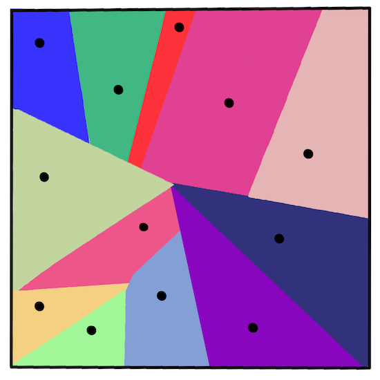
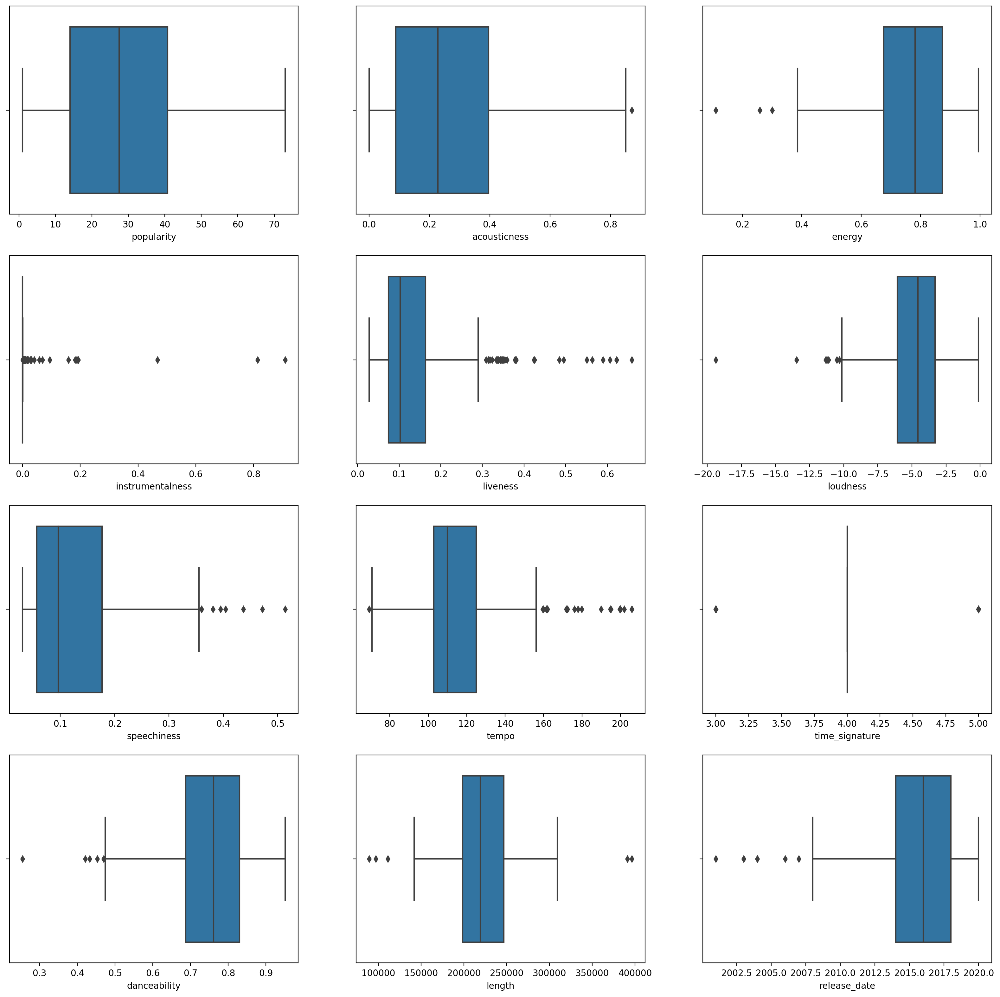
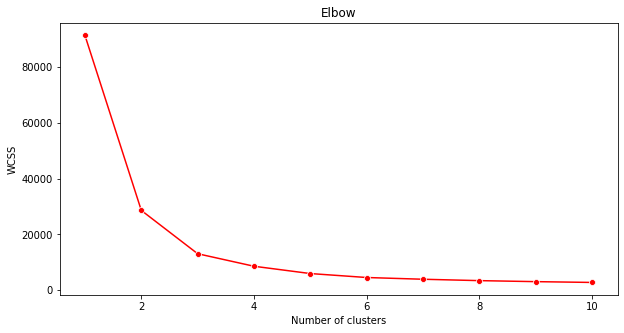

<!--
CO_OP_TRANSLATOR_METADATA:
{
  "original_hash": "085d571097d201810720df4cd379f8c2",
  "translation_date": "2025-08-29T13:26:00+00:00",
  "source_file": "5-Clustering/2-K-Means/README.md",
  "language_code": "ar"
}
-->
# التجميع باستخدام K-Means

## [اختبار ما قبل المحاضرة](https://gray-sand-07a10f403.1.azurestaticapps.net/quiz/29/)

في هذا الدرس، ستتعلم كيفية إنشاء مجموعات باستخدام مكتبة Scikit-learn ومجموعة بيانات الموسيقى النيجيرية التي قمت باستيرادها سابقًا. سنغطي أساسيات K-Means للتجميع. تذكر أنه، كما تعلمت في الدرس السابق، هناك العديد من الطرق للعمل مع المجموعات والطريقة التي تستخدمها تعتمد على بياناتك. سنجرب K-Means لأنه التقنية الأكثر شيوعًا للتجميع. لنبدأ!

المصطلحات التي ستتعرف عليها:

- تقييم Silhouette
- طريقة Elbow
- القصور الذاتي (Inertia)
- التباين (Variance)

## المقدمة

[التجميع باستخدام K-Means](https://wikipedia.org/wiki/K-means_clustering) هو طريقة مشتقة من مجال معالجة الإشارات. تُستخدم لتقسيم وتصنيف مجموعات البيانات إلى 'k' مجموعات باستخدام سلسلة من الملاحظات. تعمل كل ملاحظة على تجميع نقطة بيانات معينة بالقرب من أقرب 'متوسط'، أو النقطة المركزية للمجموعة.

يمكن تصور المجموعات كـ [مخططات Voronoi](https://wikipedia.org/wiki/Voronoi_diagram)، التي تتضمن نقطة (أو 'بذرة') ومنطقتها المقابلة.



> رسم توضيحي من [Jen Looper](https://twitter.com/jenlooper)

تتم عملية التجميع باستخدام K-Means [في ثلاث خطوات](https://scikit-learn.org/stable/modules/clustering.html#k-means):

1. يختار الخوارزمية عددًا من النقاط المركزية 'k' عن طريق أخذ عينات من مجموعة البيانات. بعد ذلك، تقوم بالتكرار:
    1. تعين كل عينة إلى أقرب مركز.
    2. تنشئ مراكز جديدة عن طريق حساب متوسط القيم لجميع العينات المخصصة للمراكز السابقة.
    3. ثم تحسب الفرق بين المراكز الجديدة والقديمة وتكرر العملية حتى تستقر المراكز.

أحد عيوب استخدام K-Means هو أنك ستحتاج إلى تحديد 'k'، أي عدد المراكز. لحسن الحظ، تساعد طريقة 'elbow' في تقدير قيمة بداية جيدة لـ 'k'. ستجربها بعد قليل.

## المتطلبات الأساسية

ستعمل في ملف [_notebook.ipynb_](https://github.com/microsoft/ML-For-Beginners/blob/main/5-Clustering/2-K-Means/notebook.ipynb) الخاص بهذا الدرس، والذي يتضمن استيراد البيانات وتنظيفها الأولي الذي قمت به في الدرس السابق.

## التمرين - التحضير

ابدأ بإلقاء نظرة أخرى على بيانات الأغاني.

1. أنشئ مخططًا صندوقيًا، باستخدام `boxplot()` لكل عمود:

    ```python
    plt.figure(figsize=(20,20), dpi=200)
    
    plt.subplot(4,3,1)
    sns.boxplot(x = 'popularity', data = df)
    
    plt.subplot(4,3,2)
    sns.boxplot(x = 'acousticness', data = df)
    
    plt.subplot(4,3,3)
    sns.boxplot(x = 'energy', data = df)
    
    plt.subplot(4,3,4)
    sns.boxplot(x = 'instrumentalness', data = df)
    
    plt.subplot(4,3,5)
    sns.boxplot(x = 'liveness', data = df)
    
    plt.subplot(4,3,6)
    sns.boxplot(x = 'loudness', data = df)
    
    plt.subplot(4,3,7)
    sns.boxplot(x = 'speechiness', data = df)
    
    plt.subplot(4,3,8)
    sns.boxplot(x = 'tempo', data = df)
    
    plt.subplot(4,3,9)
    sns.boxplot(x = 'time_signature', data = df)
    
    plt.subplot(4,3,10)
    sns.boxplot(x = 'danceability', data = df)
    
    plt.subplot(4,3,11)
    sns.boxplot(x = 'length', data = df)
    
    plt.subplot(4,3,12)
    sns.boxplot(x = 'release_date', data = df)
    ```

    هذه البيانات تحتوي على بعض الضوضاء: من خلال ملاحظة كل عمود كمخطط صندوقي، يمكنك رؤية القيم الشاذة.

    

يمكنك مراجعة مجموعة البيانات وإزالة هذه القيم الشاذة، ولكن ذلك سيجعل البيانات قليلة جدًا.

1. في الوقت الحالي، اختر الأعمدة التي ستستخدمها في تمرين التجميع. اختر الأعمدة ذات النطاقات المتشابهة وقم بترميز عمود `artist_top_genre` كبيانات رقمية:

    ```python
    from sklearn.preprocessing import LabelEncoder
    le = LabelEncoder()
    
    X = df.loc[:, ('artist_top_genre','popularity','danceability','acousticness','loudness','energy')]
    
    y = df['artist_top_genre']
    
    X['artist_top_genre'] = le.fit_transform(X['artist_top_genre'])
    
    y = le.transform(y)
    ```

1. الآن تحتاج إلى اختيار عدد المجموعات المستهدفة. أنت تعلم أن هناك 3 أنواع من الأغاني التي قمنا بتحديدها من مجموعة البيانات، لذا دعنا نجرب 3:

    ```python
    from sklearn.cluster import KMeans
    
    nclusters = 3 
    seed = 0
    
    km = KMeans(n_clusters=nclusters, random_state=seed)
    km.fit(X)
    
    # Predict the cluster for each data point
    
    y_cluster_kmeans = km.predict(X)
    y_cluster_kmeans
    ```

سترى مصفوفة مطبوعة تحتوي على المجموعات المتوقعة (0، 1، أو 2) لكل صف في إطار البيانات.

1. استخدم هذه المصفوفة لحساب 'تقييم Silhouette':

    ```python
    from sklearn import metrics
    score = metrics.silhouette_score(X, y_cluster_kmeans)
    score
    ```

## تقييم Silhouette

ابحث عن تقييم Silhouette أقرب إلى 1. يتراوح هذا التقييم بين -1 و 1، وإذا كان التقييم 1، فإن المجموعة كثيفة ومنفصلة بشكل جيد عن المجموعات الأخرى. القيمة القريبة من 0 تمثل مجموعات متداخلة مع عينات قريبة جدًا من حدود القرار للمجموعات المجاورة. [(المصدر)](https://dzone.com/articles/kmeans-silhouette-score-explained-with-python-exam)

تقييمنا هو **0.53**، وهو في المنتصف. يشير ذلك إلى أن بياناتنا ليست مناسبة تمامًا لهذا النوع من التجميع، ولكن دعنا نستمر.

### التمرين - بناء نموذج

1. استورد `KMeans` وابدأ عملية التجميع.

    ```python
    from sklearn.cluster import KMeans
    wcss = []
    
    for i in range(1, 11):
        kmeans = KMeans(n_clusters = i, init = 'k-means++', random_state = 42)
        kmeans.fit(X)
        wcss.append(kmeans.inertia_)
    
    ```

    هناك بعض الأجزاء هنا التي تستحق التوضيح.

    > 🎓 النطاق: هذه هي التكرارات لعملية التجميع.

    > 🎓 random_state: "يحدد توليد الأرقام العشوائية لتهيئة المراكز." [المصدر](https://scikit-learn.org/stable/modules/generated/sklearn.cluster.KMeans.html#sklearn.cluster.KMeans)

    > 🎓 WCSS: "مجموع المربعات داخل المجموعة" يقيس متوسط المسافة المربعة لجميع النقاط داخل المجموعة إلى مركز المجموعة. [المصدر](https://medium.com/@ODSC/unsupervised-learning-evaluating-clusters-bd47eed175ce).

    > 🎓 القصور الذاتي: تحاول خوارزميات K-Means اختيار المراكز لتقليل 'القصور الذاتي'، "وهو مقياس لمدى تماسك المجموعات داخليًا." [المصدر](https://scikit-learn.org/stable/modules/clustering.html). يتم إلحاق القيمة بمتغير wcss في كل تكرار.

    > 🎓 k-means++: في [Scikit-learn](https://scikit-learn.org/stable/modules/clustering.html#k-means) يمكنك استخدام تحسين 'k-means++'، الذي "يهيئ المراكز لتكون (بشكل عام) بعيدة عن بعضها البعض، مما يؤدي إلى نتائج أفضل على الأرجح من التهيئة العشوائية."

### طريقة Elbow

في السابق، افترضت أنه، لأنك استهدفت 3 أنواع من الأغاني، يجب أن تختار 3 مجموعات. ولكن هل هذا صحيح؟

1. استخدم طريقة 'elbow' للتأكد.

    ```python
    plt.figure(figsize=(10,5))
    sns.lineplot(x=range(1, 11), y=wcss, marker='o', color='red')
    plt.title('Elbow')
    plt.xlabel('Number of clusters')
    plt.ylabel('WCSS')
    plt.show()
    ```

    استخدم متغير `wcss` الذي قمت ببنائه في الخطوة السابقة لإنشاء مخطط يظهر مكان 'الانحناء' في الرسم البياني، مما يشير إلى العدد الأمثل للمجموعات. ربما يكون **3** بالفعل!

    

## التمرين - عرض المجموعات

1. جرب العملية مرة أخرى، هذه المرة مع تحديد ثلاث مجموعات، واعرض المجموعات كمخطط مبعثر:

    ```python
    from sklearn.cluster import KMeans
    kmeans = KMeans(n_clusters = 3)
    kmeans.fit(X)
    labels = kmeans.predict(X)
    plt.scatter(df['popularity'],df['danceability'],c = labels)
    plt.xlabel('popularity')
    plt.ylabel('danceability')
    plt.show()
    ```

1. تحقق من دقة النموذج:

    ```python
    labels = kmeans.labels_
    
    correct_labels = sum(y == labels)
    
    print("Result: %d out of %d samples were correctly labeled." % (correct_labels, y.size))
    
    print('Accuracy score: {0:0.2f}'. format(correct_labels/float(y.size)))
    ```

    دقة هذا النموذج ليست جيدة جدًا، وشكل المجموعات يعطيك تلميحًا عن السبب.

    

    هذه البيانات غير متوازنة جدًا، وغير مترابطة بشكل كافٍ، وهناك تباين كبير بين قيم الأعمدة لتجميعها بشكل جيد. في الواقع، المجموعات التي تتشكل ربما تكون متأثرة بشكل كبير أو منحازة بفعل الفئات الثلاثة التي حددناها أعلاه. كان ذلك جزءًا من عملية التعلم!

    في توثيق Scikit-learn، يمكنك أن ترى أن نموذجًا مثل هذا، مع مجموعات غير محددة بشكل جيد، يعاني من مشكلة 'التباين':

    
    > رسم توضيحي من Scikit-learn

## التباين

يُعرف التباين بأنه "متوسط الفروق المربعة عن المتوسط" [(المصدر)](https://www.mathsisfun.com/data/standard-deviation.html). في سياق مشكلة التجميع هذه، يشير إلى البيانات التي تميل أرقامها إلى التباعد بشكل كبير عن المتوسط.

✅ هذه لحظة رائعة للتفكير في جميع الطرق التي يمكنك من خلالها تصحيح هذه المشكلة. هل تقوم بتعديل البيانات أكثر؟ استخدام أعمدة مختلفة؟ استخدام خوارزمية مختلفة؟ تلميح: جرب [تقييس بياناتك](https://www.mygreatlearning.com/blog/learning-data-science-with-k-means-clustering/) لتطبيعها واختبار أعمدة أخرى.

> جرب هذا '[حاسبة التباين](https://www.calculatorsoup.com/calculators/statistics/variance-calculator.php)' لفهم المفهوم بشكل أكبر.

---

## 🚀تحدي

اقضِ بعض الوقت مع هذا الدفتر، وعدّل المعلمات. هل يمكنك تحسين دقة النموذج عن طريق تنظيف البيانات أكثر (إزالة القيم الشاذة، على سبيل المثال)؟ يمكنك استخدام الأوزان لإعطاء وزن أكبر لعينات بيانات معينة. ماذا يمكنك أن تفعل أيضًا لإنشاء مجموعات أفضل؟

تلميح: جرب تقييس بياناتك. هناك كود معلق في الدفتر يضيف التقييس القياسي لجعل أعمدة البيانات أكثر تشابهًا من حيث النطاق. ستجد أنه بينما ينخفض تقييم Silhouette، يصبح 'الانحناء' في الرسم البياني لطريقة Elbow أكثر سلاسة. يحدث هذا لأن ترك البيانات دون تقييس يسمح للبيانات ذات التباين الأقل بأن تحمل وزنًا أكبر. اقرأ المزيد عن هذه المشكلة [هنا](https://stats.stackexchange.com/questions/21222/are-mean-normalization-and-feature-scaling-needed-for-k-means-clustering/21226#21226).

## [اختبار ما بعد المحاضرة](https://gray-sand-07a10f403.1.azurestaticapps.net/quiz/30/)

## المراجعة والدراسة الذاتية

ألقِ نظرة على محاكي K-Means [مثل هذا](https://user.ceng.metu.edu.tr/~akifakkus/courses/ceng574/k-means/). يمكنك استخدام هذه الأداة لتصور نقاط البيانات النموذجية وتحديد مراكزها. يمكنك تعديل عشوائية البيانات، وعدد المجموعات، وعدد المراكز. هل يساعدك هذا في فهم كيفية تجميع البيانات؟

كما يمكنك الاطلاع على [هذه النشرة حول K-Means](https://stanford.edu/~cpiech/cs221/handouts/kmeans.html) من جامعة ستانفورد.

## الواجب

[جرّب طرق تجميع مختلفة](assignment.md)

---

**إخلاء المسؤولية**:  
تم ترجمة هذا المستند باستخدام خدمة الترجمة الآلية [Co-op Translator](https://github.com/Azure/co-op-translator). بينما نسعى لتحقيق الدقة، يرجى العلم أن الترجمات الآلية قد تحتوي على أخطاء أو معلومات غير دقيقة. يجب اعتبار المستند الأصلي بلغته الأصلية هو المصدر الموثوق. للحصول على معلومات حساسة أو هامة، يُوصى بالاستعانة بترجمة بشرية احترافية. نحن غير مسؤولين عن أي سوء فهم أو تفسيرات خاطئة ناتجة عن استخدام هذه الترجمة.