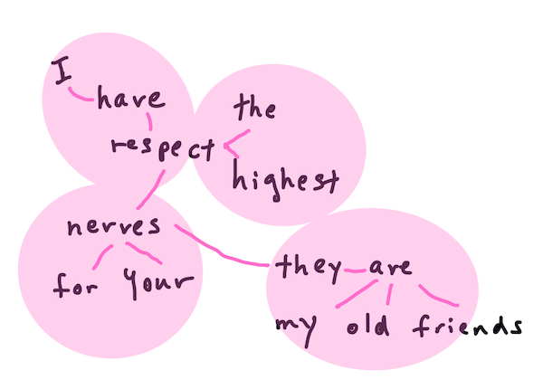

<!--
CO_OP_TRANSLATOR_METADATA:
{
  "original_hash": "6534e145d52a3890590d27be75386e5d",
  "translation_date": "2025-08-29T14:19:34+00:00",
  "source_file": "6-NLP/2-Tasks/README.md",
  "language_code": "ar"
}
-->
# مهام وتقنيات معالجة اللغة الطبيعية الشائعة

في معظم مهام *معالجة اللغة الطبيعية*، يجب تقسيم النص المراد معالجته، وفحصه، وتخزين النتائج أو مقارنتها مع القواعد ومجموعات البيانات. تتيح هذه المهام للمبرمج استنتاج _المعنى_ أو _النية_ أو فقط _تكرار_ المصطلحات والكلمات في النص.

## [اختبار ما قبل المحاضرة](https://gray-sand-07a10f403.1.azurestaticapps.net/quiz/33/)

دعونا نستكشف التقنيات الشائعة المستخدمة في معالجة النصوص. عند دمجها مع التعلم الآلي، تساعد هذه التقنيات في تحليل كميات كبيرة من النصوص بكفاءة. ومع ذلك، قبل تطبيق التعلم الآلي على هذه المهام، دعونا نفهم المشكلات التي يواجهها متخصص معالجة اللغة الطبيعية.

## المهام الشائعة في معالجة اللغة الطبيعية

هناك طرق مختلفة لتحليل النص الذي تعمل عليه. هناك مهام يمكنك تنفيذها ومن خلالها يمكنك فهم النص واستخلاص الاستنتاجات. عادةً ما يتم تنفيذ هذه المهام بشكل متسلسل.

### تقسيم النص إلى وحدات (Tokenization)

ربما تكون أول خطوة تقوم بها معظم خوارزميات معالجة اللغة الطبيعية هي تقسيم النص إلى وحدات أو كلمات. على الرغم من أن هذا يبدو بسيطًا، إلا أن التعامل مع علامات الترقيم وفواصل الكلمات والجمل في اللغات المختلفة يمكن أن يجعل الأمر معقدًا. قد تحتاج إلى استخدام طرق مختلفة لتحديد الحدود.


> تقسيم جملة من **Pride and Prejudice**. تصميم بواسطة [Jen Looper](https://twitter.com/jenlooper)

### التضمين (Embeddings)

[تضمين الكلمات](https://wikipedia.org/wiki/Word_embedding) هو طريقة لتحويل بيانات النص إلى أرقام. يتم التضمين بطريقة تجعل الكلمات ذات المعاني المتشابهة أو الكلمات المستخدمة معًا تتجمع معًا.


> "أكن أعلى درجات الاحترام لأعصابك، فهي أصدقائي القدامى." - تضمين الكلمات لجملة من **Pride and Prejudice**. تصميم بواسطة [Jen Looper](https://twitter.com/jenlooper)

✅ جرب [هذه الأداة المثيرة](https://projector.tensorflow.org/) لتجربة تضمين الكلمات. النقر على كلمة واحدة يظهر مجموعات من الكلمات المشابهة: "toy" تتجمع مع "disney"، "lego"، "playstation"، و"console".

### التحليل النحوي وتحديد أجزاء الكلام (Parsing & Part-of-speech Tagging)

كل كلمة تم تقسيمها يمكن تصنيفها كجزء من الكلام - اسم، فعل، أو صفة. الجملة `the quick red fox jumped over the lazy brown dog` قد يتم تصنيفها كالتالي: fox = اسم، jumped = فعل.


> تحليل جملة من **Pride and Prejudice**. تصميم بواسطة [Jen Looper](https://twitter.com/jenlooper)

التحليل النحوي هو التعرف على الكلمات المرتبطة ببعضها البعض في الجملة - على سبيل المثال `the quick red fox jumped` هو تسلسل صفة-اسم-فعل منفصل عن تسلسل `lazy brown dog`.

### تكرار الكلمات والعبارات

إجراء مفيد عند تحليل نص كبير هو بناء قاموس لكل كلمة أو عبارة ذات اهتمام وعدد مرات ظهورها. العبارة `the quick red fox jumped over the lazy brown dog` تحتوي على تكرار للكلمة "the" بمقدار 2.

دعونا نلقي نظرة على نص مثال حيث نعد تكرار الكلمات. قصيدة "The Winners" لروديارد كيبلينغ تحتوي على المقطع التالي:

```output
What the moral? Who rides may read.
When the night is thick and the tracks are blind
A friend at a pinch is a friend, indeed,
But a fool to wait for the laggard behind.
Down to Gehenna or up to the Throne,
He travels the fastest who travels alone.
```

نظرًا لأن تكرار العبارات يمكن أن يكون حساسًا لحالة الأحرف أو غير حساس حسب الحاجة، فإن العبارة `a friend` لها تكرار بمقدار 2 و`the` لها تكرار بمقدار 6، و`travels` بمقدار 2.

### N-grams

يمكن تقسيم النص إلى تسلسلات من الكلمات بطول محدد، كلمة واحدة (unigram)، كلمتين (bigrams)، ثلاث كلمات (trigrams) أو أي عدد من الكلمات (n-grams).

على سبيل المثال `the quick red fox jumped over the lazy brown dog` مع درجة n-gram بمقدار 2 ينتج n-grams التالية:

1. the quick  
2. quick red  
3. red fox  
4. fox jumped  
5. jumped over  
6. over the  
7. the lazy  
8. lazy brown  
9. brown dog  

قد يكون من الأسهل تصورها كصندوق متحرك فوق الجملة. هنا هو المثال لـ n-grams من 3 كلمات، حيث يتم تمييز n-gram في كل جملة:

1.   <u>**the quick red**</u> fox jumped over the lazy brown dog  
2.   the **<u>quick red fox</u>** jumped over the lazy brown dog  
3.   the quick **<u>red fox jumped</u>** over the lazy brown dog  
4.   the quick red **<u>fox jumped over</u>** the lazy brown dog  
5.   the quick red fox **<u>jumped over the</u>** lazy brown dog  
6.   the quick red fox jumped **<u>over the lazy</u>** brown dog  
7.   the quick red fox jumped over <u>**the lazy brown**</u> dog  
8.   the quick red fox jumped over the **<u>lazy brown dog</u>**  


> قيمة N-gram بمقدار 3: تصميم بواسطة [Jen Looper](https://twitter.com/jenlooper)

### استخراج العبارات الاسمية

في معظم الجمل، هناك اسم يكون هو الموضوع أو المفعول به للجملة. في اللغة الإنجليزية، غالبًا ما يمكن التعرف عليه بوجود "a" أو "an" أو "the" قبله. تحديد الموضوع أو المفعول به للجملة عن طريق "استخراج العبارة الاسمية" هو مهمة شائعة في معالجة اللغة الطبيعية عند محاولة فهم معنى الجملة.

✅ في الجملة "I cannot fix on the hour, or the spot, or the look or the words, which laid the foundation. It is too long ago. I was in the middle before I knew that I had begun."، هل يمكنك تحديد العبارات الاسمية؟

في الجملة `the quick red fox jumped over the lazy brown dog` هناك عبارتان اسميتان: **quick red fox** و**lazy brown dog**.

### تحليل المشاعر

يمكن تحليل الجملة أو النص لمعرفة المشاعر، أو مدى *إيجابيته* أو *سلبيته*. يتم قياس المشاعر من حيث *القطبية* و*الموضوعية/الذاتية*. يتم قياس القطبية من -1.0 إلى 1.0 (سلبي إلى إيجابي) ومن 0.0 إلى 1.0 (الأكثر موضوعية إلى الأكثر ذاتية).

✅ لاحقًا ستتعلم أن هناك طرقًا مختلفة لتحديد المشاعر باستخدام التعلم الآلي، ولكن إحدى الطرق هي وجود قائمة بالكلمات والعبارات التي يتم تصنيفها كإيجابية أو سلبية بواسطة خبير بشري وتطبيق هذا النموذج على النص لحساب درجة القطبية. هل ترى كيف يمكن أن تعمل هذه الطريقة في بعض الظروف وأقل في أخرى؟

### التصريف

التصريف يتيح لك أخذ كلمة والحصول على صيغة المفرد أو الجمع لها.

### التوحيد (Lemmatization)

*اللمّة* هي الجذر أو الكلمة الرئيسية لمجموعة من الكلمات، على سبيل المثال *flew*، *flies*، *flying* لها لمّة الفعل *fly*.

هناك أيضًا قواعد بيانات مفيدة متاحة للباحث في معالجة اللغة الطبيعية، وأبرزها:

### WordNet

[WordNet](https://wordnet.princeton.edu/) هي قاعدة بيانات للكلمات، المرادفات، الأضداد والعديد من التفاصيل الأخرى لكل كلمة في العديد من اللغات المختلفة. إنها مفيدة للغاية عند محاولة بناء الترجمات، المدقق الإملائي، أو أدوات اللغة من أي نوع.

## مكتبات معالجة اللغة الطبيعية

لحسن الحظ، لا تحتاج إلى بناء كل هذه التقنيات بنفسك، حيث توجد مكتبات Python ممتازة تجعلها أكثر سهولة للمطورين الذين ليسوا متخصصين في معالجة اللغة الطبيعية أو التعلم الآلي. تتضمن الدروس القادمة المزيد من الأمثلة على هذه المكتبات، ولكن هنا ستتعلم بعض الأمثلة المفيدة لمساعدتك في المهمة التالية.

### تمرين - استخدام مكتبة `TextBlob`

دعونا نستخدم مكتبة تسمى TextBlob لأنها تحتوي على واجهات برمجية مفيدة للتعامل مع هذه الأنواع من المهام. TextBlob "تعتمد على العملاقين [NLTK](https://nltk.org) و[pattern](https://github.com/clips/pattern)، وتعمل بشكل جيد مع كليهما." تحتوي على قدر كبير من التعلم الآلي المدمج في واجهاتها البرمجية.

> ملاحظة: دليل [البدء السريع](https://textblob.readthedocs.io/en/dev/quickstart.html#quickstart) متاح لـ TextBlob ويوصى به للمطورين ذوي الخبرة في Python.

عند محاولة تحديد *العبارات الاسمية*، تقدم TextBlob عدة خيارات للمستخرجين للعثور على العبارات الاسمية.

1. ألقِ نظرة على `ConllExtractor`.

    ```python
    from textblob import TextBlob
    from textblob.np_extractors import ConllExtractor
    # import and create a Conll extractor to use later 
    extractor = ConllExtractor()
    
    # later when you need a noun phrase extractor:
    user_input = input("> ")
    user_input_blob = TextBlob(user_input, np_extractor=extractor)  # note non-default extractor specified
    np = user_input_blob.noun_phrases                                    
    ```

    > ما الذي يحدث هنا؟ [ConllExtractor](https://textblob.readthedocs.io/en/dev/api_reference.html?highlight=Conll#textblob.en.np_extractors.ConllExtractor) هو "مستخرج للعبارات الاسمية يستخدم تحليل الكتل المدرب باستخدام مجموعة بيانات ConLL-2000." يشير ConLL-2000 إلى مؤتمر تعلم اللغة الطبيعية الحسابية لعام 2000. كل عام، استضاف المؤتمر ورشة عمل لمعالجة مشكلة صعبة في معالجة اللغة الطبيعية، وفي عام 2000 كانت المشكلة هي تقسيم العبارات الاسمية. تم تدريب نموذج على صحيفة وول ستريت جورنال، باستخدام "الأقسام 15-18 كبيانات تدريب (211727 رمزًا) والقسم 20 كبيانات اختبار (47377 رمزًا)". يمكنك الاطلاع على الإجراءات المستخدمة [هنا](https://www.clips.uantwerpen.be/conll2000/chunking/) والنتائج [هنا](https://ifarm.nl/erikt/research/np-chunking.html).

### تحدي - تحسين الروبوت الخاص بك باستخدام معالجة اللغة الطبيعية

في الدرس السابق، قمت ببناء روبوت بسيط للأسئلة والأجوبة. الآن، ستجعل "مارفن" أكثر تعاطفًا من خلال تحليل مدخلاتك لمعرفة المشاعر وطباعة استجابة تتناسب مع المشاعر. ستحتاج أيضًا إلى تحديد `noun_phrase` وطرح أسئلة حولها.

خطواتك عند بناء روبوت محادثة أفضل:

1. طباعة التعليمات التي تنصح المستخدم بكيفية التفاعل مع الروبوت  
2. بدء الحلقة  
   1. قبول مدخلات المستخدم  
   2. إذا طلب المستخدم الخروج، قم بالخروج  
   3. معالجة مدخلات المستخدم وتحديد استجابة المشاعر المناسبة  
   4. إذا تم اكتشاف عبارة اسمية في المشاعر، قم بجمعها واطلب المزيد من المدخلات حول هذا الموضوع  
   5. طباعة الاستجابة  
3. العودة إلى الخطوة 2  

إليك مقتطف الكود لتحديد المشاعر باستخدام TextBlob. لاحظ أن هناك أربعة *تدرجات* فقط لاستجابة المشاعر (يمكنك إضافة المزيد إذا أردت):

```python
if user_input_blob.polarity <= -0.5:
  response = "Oh dear, that sounds bad. "
elif user_input_blob.polarity <= 0:
  response = "Hmm, that's not great. "
elif user_input_blob.polarity <= 0.5:
  response = "Well, that sounds positive. "
elif user_input_blob.polarity <= 1:
  response = "Wow, that sounds great. "
```

إليك بعض المخرجات النموذجية لتوجيهك (مدخلات المستخدم تبدأ بـ >):

```output
Hello, I am Marvin, the friendly robot.
You can end this conversation at any time by typing 'bye'
After typing each answer, press 'enter'
How are you today?
> I am ok
Well, that sounds positive. Can you tell me more?
> I went for a walk and saw a lovely cat
Well, that sounds positive. Can you tell me more about lovely cats?
> cats are the best. But I also have a cool dog
Wow, that sounds great. Can you tell me more about cool dogs?
> I have an old hounddog but he is sick
Hmm, that's not great. Can you tell me more about old hounddogs?
> bye
It was nice talking to you, goodbye!
```

يمكنك العثور على حل محتمل للمهمة [هنا](https://github.com/microsoft/ML-For-Beginners/blob/main/6-NLP/2-Tasks/solution/bot.py)

✅ تحقق من المعرفة

1. هل تعتقد أن الاستجابات المتعاطفة قد "تخدع" شخصًا ليعتقد أن الروبوت يفهمه بالفعل؟  
2. هل يجعل تحديد العبارة الاسمية الروبوت أكثر "إقناعًا"؟  
3. لماذا قد يكون استخراج "العبارة الاسمية" من الجملة أمرًا مفيدًا؟

---

قم بتنفيذ الروبوت في التحقق من المعرفة السابق واختبره على صديق. هل يمكنه خداعهم؟ هل يمكنك جعل الروبوت الخاص بك أكثر "إقناعًا"؟

## 🚀تحدي

خذ مهمة من التحقق من المعرفة السابق وحاول تنفيذها. اختبر الروبوت على صديق. هل يمكنه خداعهم؟ هل يمكنك جعل الروبوت الخاص بك أكثر "إقناعًا"؟

## [اختبار ما بعد المحاضرة](https://gray-sand-07a10f403.1.azurestaticapps.net/quiz/34/)

## المراجعة والدراسة الذاتية

في الدروس القادمة، ستتعلم المزيد عن تحليل المشاعر. ابحث عن هذه التقنية المثيرة في مقالات مثل تلك الموجودة على [KDNuggets](https://www.kdnuggets.com/tag/nlp)

## الواجب

[اجعل الروبوت يتحدث](assignment.md)

---

**إخلاء المسؤولية**:  
تمت ترجمة هذا المستند باستخدام خدمة الترجمة الآلية [Co-op Translator](https://github.com/Azure/co-op-translator). بينما نسعى لتحقيق الدقة، يرجى العلم أن الترجمات الآلية قد تحتوي على أخطاء أو معلومات غير دقيقة. يجب اعتبار المستند الأصلي بلغته الأصلية هو المصدر الموثوق. للحصول على معلومات حساسة أو هامة، يُوصى بالاستعانة بترجمة بشرية احترافية. نحن غير مسؤولين عن أي سوء فهم أو تفسيرات خاطئة تنشأ عن استخدام هذه الترجمة.