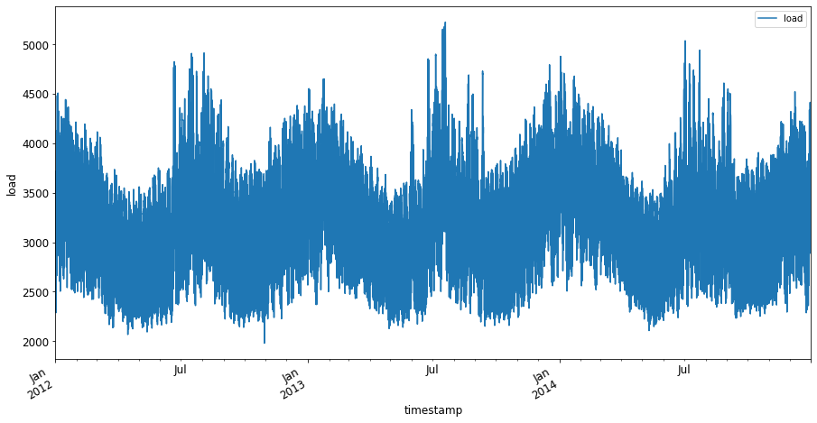

<!--
CO_OP_TRANSLATOR_METADATA:
{
  "original_hash": "3150d40f36a77857316ecaed5f31e856",
  "translation_date": "2025-08-29T13:12:37+00:00",
  "source_file": "7-TimeSeries/1-Introduction/README.md",
  "language_code": "ar"
}
-->
# مقدمة في التنبؤ بالسلاسل الزمنية


> رسم توضيحي من [Tomomi Imura](https://www.twitter.com/girlie_mac)

في هذا الدرس والدرس التالي، ستتعلم قليلاً عن التنبؤ بالسلاسل الزمنية، وهو جزء مثير وقيم من أدوات عالِم تعلم الآلة، ولكنه أقل شهرة مقارنة بمواضيع أخرى. التنبؤ بالسلاسل الزمنية يشبه "الكرة البلورية": بناءً على الأداء السابق لمتغير مثل السعر، يمكنك التنبؤ بقيمته المستقبلية المحتملة.

[](https://youtu.be/cBojo1hsHiI "مقدمة في التنبؤ بالسلاسل الزمنية")

> 🎥 انقر على الصورة أعلاه لمشاهدة فيديو عن التنبؤ بالسلاسل الزمنية

## [اختبار ما قبل المحاضرة](https://gray-sand-07a10f403.1.azurestaticapps.net/quiz/41/)

هذا المجال مفيد ومثير وله قيمة حقيقية للأعمال، نظرًا لتطبيقاته المباشرة على مشكلات التسعير والمخزون وسلاسل التوريد. على الرغم من أن تقنيات التعلم العميق بدأت تُستخدم للحصول على رؤى أعمق لتحسين التنبؤ بالأداء المستقبلي، إلا أن التنبؤ بالسلاسل الزمنية لا يزال مجالًا يعتمد بشكل كبير على تقنيات تعلم الآلة الكلاسيكية.

> يمكن العثور على منهج مفيد للسلاسل الزمنية من جامعة Penn State [هنا](https://online.stat.psu.edu/stat510/lesson/1)

## مقدمة

افترض أنك تدير مجموعة من عدادات مواقف السيارات الذكية التي توفر بيانات حول مدى تكرار استخدامها ومدة استخدامها بمرور الوقت.

> ماذا لو كان بإمكانك التنبؤ، بناءً على الأداء السابق للعداد، بقيمته المستقبلية وفقًا لقوانين العرض والطلب؟

التنبؤ بدقة بالوقت المناسب لاتخاذ إجراء لتحقيق هدفك هو تحدٍ يمكن معالجته باستخدام التنبؤ بالسلاسل الزمنية. قد لا يكون من السار للناس أن يتم فرض رسوم أعلى في أوقات الذروة عندما يبحثون عن موقف للسيارات، ولكنه سيكون وسيلة مؤكدة لتوليد الإيرادات لتنظيف الشوارع!

دعونا نستكشف بعض أنواع خوارزميات السلاسل الزمنية ونبدأ دفتر ملاحظات لتنظيف وإعداد بعض البيانات. البيانات التي ستقوم بتحليلها مأخوذة من مسابقة التنبؤ GEFCom2014. تتكون من 3 سنوات من بيانات الحمل الكهربائي ودرجات الحرارة على مدار الساعة بين عامي 2012 و2014. بناءً على الأنماط التاريخية للحمل الكهربائي ودرجات الحرارة، يمكنك التنبؤ بالقيم المستقبلية للحمل الكهربائي.

في هذا المثال، ستتعلم كيفية التنبؤ بخطوة زمنية واحدة للأمام باستخدام بيانات الحمل التاريخية فقط. ومع ذلك، قبل البدء، من المفيد فهم ما يحدث وراء الكواليس.

## بعض التعريفات

عند مواجهة مصطلح "السلاسل الزمنية"، تحتاج إلى فهم استخدامه في سياقات مختلفة.

🎓 **السلاسل الزمنية**

في الرياضيات، "السلاسل الزمنية هي سلسلة من نقاط البيانات المفهرسة (أو المدرجة أو المرسومة) بترتيب زمني. الأكثر شيوعًا، السلاسل الزمنية هي تسلسل مأخوذ عند نقاط متتالية متساوية التباعد في الزمن." مثال على السلاسل الزمنية هو القيمة اليومية لإغلاق [مؤشر داو جونز الصناعي](https://wikipedia.org/wiki/Time_series). يتم استخدام الرسوم البيانية للسلاسل الزمنية والنمذجة الإحصائية بشكل متكرر في معالجة الإشارات، التنبؤ بالطقس، التنبؤ بالزلازل، وغيرها من المجالات حيث تحدث الأحداث ويمكن رسم نقاط البيانات بمرور الوقت.

🎓 **تحليل السلاسل الزمنية**

تحليل السلاسل الزمنية هو تحليل البيانات المذكورة أعلاه. يمكن أن تأخذ بيانات السلاسل الزمنية أشكالًا مختلفة، بما في ذلك "السلاسل الزمنية المتقطعة" التي تكتشف الأنماط في تطور السلاسل الزمنية قبل وبعد حدث مقاطع. يعتمد نوع التحليل المطلوب للسلاسل الزمنية على طبيعة البيانات. يمكن أن تأخذ بيانات السلاسل الزمنية نفسها شكل سلسلة من الأرقام أو الأحرف.

يتم إجراء التحليل باستخدام مجموعة متنوعة من الطرق، بما في ذلك المجال الترددي والمجال الزمني، الخطي وغير الخطي، والمزيد. [تعرف على المزيد](https://www.itl.nist.gov/div898/handbook/pmc/section4/pmc4.htm) حول الطرق المختلفة لتحليل هذا النوع من البيانات.

🎓 **التنبؤ بالسلاسل الزمنية**

التنبؤ بالسلاسل الزمنية هو استخدام نموذج للتنبؤ بالقيم المستقبلية بناءً على الأنماط التي أظهرتها البيانات التي تم جمعها سابقًا كما حدثت في الماضي. على الرغم من أنه من الممكن استخدام نماذج الانحدار لاستكشاف بيانات السلاسل الزمنية، إلا أن مثل هذه البيانات يتم تحليلها بشكل أفضل باستخدام أنواع خاصة من النماذج.

بيانات السلاسل الزمنية هي قائمة من الملاحظات المرتبة، على عكس البيانات التي يمكن تحليلها باستخدام الانحدار الخطي. النموذج الأكثر شيوعًا هو ARIMA، وهو اختصار لـ "Autoregressive Integrated Moving Average".

[نماذج ARIMA](https://online.stat.psu.edu/stat510/lesson/1/1.1) "تربط القيمة الحالية لسلسلة بالقيم السابقة وأخطاء التنبؤ السابقة." وهي الأنسب لتحليل بيانات المجال الزمني، حيث يتم ترتيب البيانات بمرور الوقت.

> هناك عدة أنواع من نماذج ARIMA، يمكنك التعرف عليها [هنا](https://people.duke.edu/~rnau/411arim.htm) وستتعرف عليها في الدرس التالي.

في الدرس التالي، ستقوم ببناء نموذج ARIMA باستخدام [السلاسل الزمنية أحادية المتغير](https://itl.nist.gov/div898/handbook/pmc/section4/pmc44.htm)، التي تركز على متغير واحد يتغير قيمته بمرور الوقت. مثال على هذا النوع من البيانات هو [مجموعة البيانات هذه](https://itl.nist.gov/div898/handbook/pmc/section4/pmc4411.htm) التي تسجل تركيز ثاني أكسيد الكربون الشهري في مرصد ماونا لوا:

|  CO2   | YearMonth | Year  | Month |
| :----: | :-------: | :---: | :---: |
| 330.62 |  1975.04  | 1975  |   1   |
| 331.40 |  1975.13  | 1975  |   2   |
| 331.87 |  1975.21  | 1975  |   3   |
| 333.18 |  1975.29  | 1975  |   4   |
| 333.92 |  1975.38  | 1975  |   5   |
| 333.43 |  1975.46  | 1975  |   6   |
| 331.85 |  1975.54  | 1975  |   7   |
| 330.01 |  1975.63  | 1975  |   8   |
| 328.51 |  1975.71  | 1975  |   9   |
| 328.41 |  1975.79  | 1975  |  10   |
| 329.25 |  1975.88  | 1975  |  11   |
| 330.97 |  1975.96  | 1975  |  12   |

✅ حدد المتغير الذي يتغير بمرور الوقت في هذه المجموعة من البيانات

## خصائص بيانات السلاسل الزمنية التي يجب أخذها في الاعتبار

عند النظر إلى بيانات السلاسل الزمنية، قد تلاحظ أنها تحتوي على [خصائص معينة](https://online.stat.psu.edu/stat510/lesson/1/1.1) تحتاج إلى أخذها في الاعتبار ومعالجتها لفهم أنماطها بشكل أفضل. إذا اعتبرت بيانات السلاسل الزمنية كإشارة محتملة تريد تحليلها، يمكن اعتبار هذه الخصائص كضوضاء. غالبًا ما تحتاج إلى تقليل هذه "الضوضاء" من خلال تعويض بعض هذه الخصائص باستخدام تقنيات إحصائية.

فيما يلي بعض المفاهيم التي يجب أن تعرفها للعمل مع السلاسل الزمنية:

🎓 **الاتجاهات**

الاتجاهات تُعرف بأنها زيادات ونقصانات قابلة للقياس بمرور الوقت. [اقرأ المزيد](https://machinelearningmastery.com/time-series-trends-in-python). في سياق السلاسل الزمنية، يتعلق الأمر بكيفية استخدام الاتجاهات وإذا لزم الأمر، إزالتها من السلاسل الزمنية.

🎓 **[الموسمية](https://machinelearningmastery.com/time-series-seasonality-with-python/)**

الموسمية تُعرف بأنها التقلبات الدورية، مثل الاندفاعات الموسمية التي قد تؤثر على المبيعات، على سبيل المثال. [اطلع على](https://itl.nist.gov/div898/handbook/pmc/section4/pmc443.htm) كيفية عرض أنواع مختلفة من الرسوم البيانية للموسمية في البيانات.

🎓 **القيم الشاذة**

القيم الشاذة هي تلك التي تكون بعيدة عن التباين القياسي للبيانات.

🎓 **الدورة طويلة الأمد**

بغض النظر عن الموسمية، قد تعرض البيانات دورة طويلة الأمد مثل الركود الاقتصادي الذي يستمر لأكثر من عام.

🎓 **التباين الثابت**

بمرور الوقت، تعرض بعض البيانات تقلبات ثابتة، مثل استخدام الطاقة يوميًا وليلاً.

🎓 **التغيرات المفاجئة**

قد تعرض البيانات تغيرًا مفاجئًا قد يحتاج إلى مزيد من التحليل. على سبيل المثال، الإغلاق المفاجئ للأعمال بسبب COVID تسبب في تغييرات في البيانات.

✅ هنا [مثال على رسم بياني للسلاسل الزمنية](https://www.kaggle.com/kashnitsky/topic-9-part-1-time-series-analysis-in-python) يظهر الإنفاق اليومي على العملة داخل اللعبة على مدار بضع سنوات. هل يمكنك تحديد أي من الخصائص المذكورة أعلاه في هذه البيانات؟


## تمرين - البدء ببيانات استخدام الطاقة

لنبدأ بإنشاء نموذج للسلاسل الزمنية للتنبؤ باستخدام الطاقة المستقبلي بناءً على الاستخدام السابق.

> البيانات في هذا المثال مأخوذة من مسابقة التنبؤ GEFCom2014. تتكون من 3 سنوات من بيانات الحمل الكهربائي ودرجات الحرارة على مدار الساعة بين عامي 2012 و2014.
>
> Tao Hong, Pierre Pinson, Shu Fan, Hamidreza Zareipour, Alberto Troccoli and Rob J. Hyndman, "Probabilistic energy forecasting: Global Energy Forecasting Competition 2014 and beyond", International Journal of Forecasting, vol.32, no.3, pp 896-913, July-September, 2016.

1. في مجلد `working` لهذا الدرس، افتح ملف _notebook.ipynb_. ابدأ بإضافة المكتبات التي ستساعدك على تحميل البيانات وتصويرها:

    ```python
    import os
    import matplotlib.pyplot as plt
    from common.utils import load_data
    %matplotlib inline
    ```

    لاحظ أنك تستخدم الملفات من مجلد `common` المرفق الذي يقوم بإعداد بيئتك وتحميل البيانات.

2. بعد ذلك، قم بفحص البيانات كإطار بيانات باستخدام `load_data()` و `head()`:

    ```python
    data_dir = './data'
    energy = load_data(data_dir)[['load']]
    energy.head()
    ```

    يمكنك أن ترى أن هناك عمودين يمثلان التاريخ والحمل:

    |                     |  load  |
    | :-----------------: | :----: |
    | 2012-01-01 00:00:00 | 2698.0 |
    | 2012-01-01 01:00:00 | 2558.0 |
    | 2012-01-01 02:00:00 | 2444.0 |
    | 2012-01-01 03:00:00 | 2402.0 |
    | 2012-01-01 04:00:00 | 2403.0 |

3. الآن، قم برسم البيانات باستخدام `plot()`:

    ```python
    energy.plot(y='load', subplots=True, figsize=(15, 8), fontsize=12)
    plt.xlabel('timestamp', fontsize=12)
    plt.ylabel('load', fontsize=12)
    plt.show()
    ```

    

4. الآن، قم برسم الأسبوع الأول من يوليو 2014، عن طريق توفيره كمدخل إلى `energy` بالنمط `[من التاريخ]: [إلى التاريخ]`:

    ```python
    energy['2014-07-01':'2014-07-07'].plot(y='load', subplots=True, figsize=(15, 8), fontsize=12)
    plt.xlabel('timestamp', fontsize=12)
    plt.ylabel('load', fontsize=12)
    plt.show()
    ```

    

    رسم جميل! ألقِ نظرة على هذه الرسوم البيانية وحاول تحديد أي من الخصائص المذكورة أعلاه. ماذا يمكننا أن نستنتج من خلال تصور البيانات؟

في الدرس التالي، ستقوم بإنشاء نموذج ARIMA لإجراء بعض التنبؤات.

---

## 🚀تحدي

قم بعمل قائمة بجميع الصناعات ومجالات البحث التي يمكنك التفكير فيها والتي ستستفيد من التنبؤ بالسلاسل الزمنية. هل يمكنك التفكير في تطبيق لهذه التقنيات في الفنون؟ في الاقتصاد القياسي؟ في البيئة؟ في البيع بالتجزئة؟ في الصناعة؟ في التمويل؟ أين أيضًا؟

## [اختبار ما بعد المحاضرة](https://gray-sand-07a10f403.1.azurestaticapps.net/quiz/42/)

## المراجعة والدراسة الذاتية

على الرغم من أننا لن نغطيها هنا، إلا أن الشبكات العصبية تُستخدم أحيانًا لتعزيز الطرق الكلاسيكية للتنبؤ بالسلاسل الزمنية. اقرأ المزيد عنها [في هذه المقالة](https://medium.com/microsoftazure/neural-networks-for-forecasting-financial-and-economic-time-series-6aca370ff412)

## الواجب

[قم بتصور المزيد من السلاسل الزمنية](assignment.md)

---

**إخلاء المسؤولية**:  
تمت ترجمة هذا المستند باستخدام خدمة الترجمة الآلية [Co-op Translator](https://github.com/Azure/co-op-translator). بينما نسعى لتحقيق الدقة، يرجى العلم أن الترجمات الآلية قد تحتوي على أخطاء أو معلومات غير دقيقة. يجب اعتبار المستند الأصلي بلغته الأصلية هو المصدر الموثوق. للحصول على معلومات حساسة أو هامة، يُوصى بالاستعانة بترجمة بشرية احترافية. نحن غير مسؤولين عن أي سوء فهم أو تفسيرات خاطئة تنشأ عن استخدام هذه الترجمة.