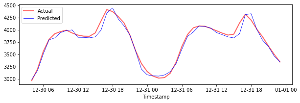

<!--
CO_OP_TRANSLATOR_METADATA:
{
  "original_hash": "f80e513b3279869e7661e3190cc83076",
  "translation_date": "2025-08-29T13:15:57+00:00",
  "source_file": "7-TimeSeries/3-SVR/README.md",
  "language_code": "ar"
}
-->
# التنبؤ بالسلاسل الزمنية باستخدام نموذج Support Vector Regressor

في الدرس السابق، تعلمت كيفية استخدام نموذج ARIMA للتنبؤ بالسلاسل الزمنية. الآن ستتعرف على نموذج Support Vector Regressor، وهو نموذج يستخدم للتنبؤ بالبيانات المستمرة.

## [اختبار ما قبل المحاضرة](https://gray-sand-07a10f403.1.azurestaticapps.net/quiz/51/)

## المقدمة

في هذا الدرس، ستكتشف طريقة محددة لبناء النماذج باستخدام [**SVM**: **S**upport **V**ector **M**achine](https://en.wikipedia.org/wiki/Support-vector_machine) للتنبؤ، أو **SVR: Support Vector Regressor**.

### SVR في سياق السلاسل الزمنية [^1]

قبل فهم أهمية SVR في التنبؤ بالسلاسل الزمنية، إليك بعض المفاهيم المهمة التي تحتاج إلى معرفتها:

- **الانحدار:** تقنية تعلم تحت الإشراف تُستخدم للتنبؤ بالقيم المستمرة من مجموعة معينة من المدخلات. الفكرة هي ملاءمة منحنى (أو خط) في فضاء الميزات يحتوي على أكبر عدد من النقاط. [اضغط هنا](https://en.wikipedia.org/wiki/Regression_analysis) لمزيد من المعلومات.
- **Support Vector Machine (SVM):** نوع من نماذج التعلم الآلي تحت الإشراف يُستخدم للتصنيف، والانحدار، واكتشاف القيم الشاذة. النموذج هو عبارة عن مستوى فائق في فضاء الميزات، والذي يعمل كحد فاصل في حالة التصنيف، وكأفضل خط ملائم في حالة الانحدار. في SVM، يتم استخدام دالة Kernel لتحويل مجموعة البيانات إلى فضاء بأبعاد أعلى بحيث يمكن فصلها بسهولة. [اضغط هنا](https://en.wikipedia.org/wiki/Support-vector_machine) لمزيد من المعلومات عن SVM.
- **Support Vector Regressor (SVR):** نوع من SVM يُستخدم لإيجاد أفضل خط ملائم (والذي يكون في حالة SVM مستوى فائق) يحتوي على أكبر عدد من النقاط.

### لماذا SVR؟ [^1]

في الدرس السابق، تعلمت عن ARIMA، وهو طريقة إحصائية خطية ناجحة جدًا لتوقع بيانات السلاسل الزمنية. ومع ذلك، في العديد من الحالات، تحتوي بيانات السلاسل الزمنية على *لاخطية*، والتي لا يمكن تمثيلها بواسطة النماذج الخطية. في مثل هذه الحالات، قدرة SVM على أخذ اللاخطية في البيانات بعين الاعتبار تجعل SVR ناجحًا في التنبؤ بالسلاسل الزمنية.

## تمرين - بناء نموذج SVR

الخطوات الأولى لتحضير البيانات مشابهة لتلك التي تم تناولها في الدرس السابق عن [ARIMA](https://github.com/microsoft/ML-For-Beginners/tree/main/7-TimeSeries/2-ARIMA).

افتح المجلد [_/working_](https://github.com/microsoft/ML-For-Beginners/tree/main/7-TimeSeries/3-SVR/working) في هذا الدرس وابحث عن الملف [_notebook.ipynb_](https://github.com/microsoft/ML-For-Beginners/blob/main/7-TimeSeries/3-SVR/working/notebook.ipynb). [^2]

1. قم بتشغيل الملف واستيراد المكتبات اللازمة: [^2]

   ```python
   import sys
   sys.path.append('../../')
   ```

   ```python
   import os
   import warnings
   import matplotlib.pyplot as plt
   import numpy as np
   import pandas as pd
   import datetime as dt
   import math
   
   from sklearn.svm import SVR
   from sklearn.preprocessing import MinMaxScaler
   from common.utils import load_data, mape
   ```

2. قم بتحميل البيانات من ملف `/data/energy.csv` إلى إطار بيانات Pandas وألقِ نظرة عليها: [^2]

   ```python
   energy = load_data('../../data')[['load']]
   ```

3. قم برسم جميع بيانات الطاقة المتاحة من يناير 2012 إلى ديسمبر 2014: [^2]

   ```python
   energy.plot(y='load', subplots=True, figsize=(15, 8), fontsize=12)
   plt.xlabel('timestamp', fontsize=12)
   plt.ylabel('load', fontsize=12)
   plt.show()
   ```

   

   الآن، دعنا نبني نموذج SVR الخاص بنا.

### إنشاء مجموعات التدريب والاختبار

الآن بعد أن تم تحميل بياناتك، يمكنك تقسيمها إلى مجموعات تدريب واختبار. بعد ذلك، ستقوم بإعادة تشكيل البيانات لإنشاء مجموعة بيانات تعتمد على خطوات زمنية، وهو أمر ضروري لنموذج SVR. ستقوم بتدريب النموذج على مجموعة التدريب. بعد انتهاء التدريب، ستقوم بتقييم دقته على مجموعة التدريب، ومجموعة الاختبار، ثم مجموعة البيانات الكاملة لرؤية الأداء العام. يجب أن تتأكد من أن مجموعة الاختبار تغطي فترة زمنية لاحقة لمجموعة التدريب لضمان أن النموذج لا يحصل على معلومات من الفترات الزمنية المستقبلية [^2] (وهي حالة تُعرف باسم *الإفراط في التكيف*).

1. خصص فترة شهرين من 1 سبتمبر إلى 31 أكتوبر 2014 لمجموعة التدريب. ستشمل مجموعة الاختبار فترة الشهرين من 1 نوفمبر إلى 31 ديسمبر 2014: [^2]

   ```python
   train_start_dt = '2014-11-01 00:00:00'
   test_start_dt = '2014-12-30 00:00:00'
   ```

2. قم بتصور الفروقات: [^2]

   ```python
   energy[(energy.index < test_start_dt) & (energy.index >= train_start_dt)][['load']].rename(columns={'load':'train'}) \
       .join(energy[test_start_dt:][['load']].rename(columns={'load':'test'}), how='outer') \
       .plot(y=['train', 'test'], figsize=(15, 8), fontsize=12)
   plt.xlabel('timestamp', fontsize=12)
   plt.ylabel('load', fontsize=12)
   plt.show()
   ```

   

### تحضير البيانات للتدريب

الآن، تحتاج إلى تحضير البيانات للتدريب عن طريق تصفيتها وتوسيع نطاقها. قم بتصفية مجموعة البيانات لتشمل فقط الفترات الزمنية والأعمدة التي تحتاجها، وقم بتوسيع النطاق لضمان أن البيانات تقع في النطاق 0,1.

1. قم بتصفية مجموعة البيانات الأصلية لتشمل فقط الفترات الزمنية المذكورة لكل مجموعة، مع تضمين العمود المطلوب 'load' بالإضافة إلى التاريخ: [^2]

   ```python
   train = energy.copy()[(energy.index >= train_start_dt) & (energy.index < test_start_dt)][['load']]
   test = energy.copy()[energy.index >= test_start_dt][['load']]
   
   print('Training data shape: ', train.shape)
   print('Test data shape: ', test.shape)
   ```

   ```output
   Training data shape:  (1416, 1)
   Test data shape:  (48, 1)
   ```

2. قم بتوسيع نطاق بيانات التدريب لتكون في النطاق (0, 1): [^2]

   ```python
   scaler = MinMaxScaler()
   train['load'] = scaler.fit_transform(train)
   ```

4. الآن، قم بتوسيع نطاق بيانات الاختبار: [^2]

   ```python
   test['load'] = scaler.transform(test)
   ```

### إنشاء بيانات مع خطوات زمنية [^1]

بالنسبة لنموذج SVR، تحتاج إلى تحويل بيانات الإدخال لتكون بالشكل `[batch, timesteps]`. لذلك، ستقوم بإعادة تشكيل بيانات `train_data` و`test_data` الحالية بحيث يكون هناك بُعد جديد يشير إلى الخطوات الزمنية.

```python
# Converting to numpy arrays
train_data = train.values
test_data = test.values
```

في هذا المثال، نأخذ `timesteps = 5`. وبالتالي، تكون المدخلات للنموذج هي البيانات لأول 4 خطوات زمنية، والمخرجات ستكون البيانات للخطوة الزمنية الخامسة.

```python
timesteps=5
```

تحويل بيانات التدريب إلى مصفوفة ثنائية الأبعاد باستخدام تعبيرات قائمة متداخلة:

```python
train_data_timesteps=np.array([[j for j in train_data[i:i+timesteps]] for i in range(0,len(train_data)-timesteps+1)])[:,:,0]
train_data_timesteps.shape
```

```output
(1412, 5)
```

تحويل بيانات الاختبار إلى مصفوفة ثنائية الأبعاد:

```python
test_data_timesteps=np.array([[j for j in test_data[i:i+timesteps]] for i in range(0,len(test_data)-timesteps+1)])[:,:,0]
test_data_timesteps.shape
```

```output
(44, 5)
```

اختيار المدخلات والمخرجات من بيانات التدريب والاختبار:

```python
x_train, y_train = train_data_timesteps[:,:timesteps-1],train_data_timesteps[:,[timesteps-1]]
x_test, y_test = test_data_timesteps[:,:timesteps-1],test_data_timesteps[:,[timesteps-1]]

print(x_train.shape, y_train.shape)
print(x_test.shape, y_test.shape)
```

```output
(1412, 4) (1412, 1)
(44, 4) (44, 1)
```

### تنفيذ SVR [^1]

الآن، حان الوقت لتنفيذ SVR. لقراءة المزيد عن هذا التنفيذ، يمكنك الرجوع إلى [هذا التوثيق](https://scikit-learn.org/stable/modules/generated/sklearn.svm.SVR.html). بالنسبة لتنفيذنا، نتبع هذه الخطوات:

1. تعريف النموذج عن طريق استدعاء `SVR()` وتمرير معلمات النموذج: kernel، gamma، c وepsilon.
2. تحضير النموذج لبيانات التدريب عن طريق استدعاء دالة `fit()`.
3. إجراء التنبؤات عن طريق استدعاء دالة `predict()`.

الآن نقوم بإنشاء نموذج SVR. هنا نستخدم [RBF kernel](https://scikit-learn.org/stable/modules/svm.html#parameters-of-the-rbf-kernel)، ونحدد معلمات gamma، C وepsilon كالتالي: 0.5، 10 و0.05 على التوالي.

```python
model = SVR(kernel='rbf',gamma=0.5, C=10, epsilon = 0.05)
```

#### تدريب النموذج على بيانات التدريب [^1]

```python
model.fit(x_train, y_train[:,0])
```

```output
SVR(C=10, cache_size=200, coef0=0.0, degree=3, epsilon=0.05, gamma=0.5,
    kernel='rbf', max_iter=-1, shrinking=True, tol=0.001, verbose=False)
```

#### إجراء التنبؤات باستخدام النموذج [^1]

```python
y_train_pred = model.predict(x_train).reshape(-1,1)
y_test_pred = model.predict(x_test).reshape(-1,1)

print(y_train_pred.shape, y_test_pred.shape)
```

```output
(1412, 1) (44, 1)
```

لقد قمت ببناء نموذج SVR الخاص بك! الآن نحتاج إلى تقييمه.

### تقييم النموذج [^1]

للتقييم، أولاً سنعيد توسيع نطاق البيانات إلى مداها الأصلي. بعد ذلك، للتحقق من الأداء، سنقوم برسم السلاسل الزمنية الأصلية والمتوقعة، وأيضًا طباعة نتيجة MAPE.

إعادة توسيع نطاق المخرجات المتوقعة والأصلية:

```python
# Scaling the predictions
y_train_pred = scaler.inverse_transform(y_train_pred)
y_test_pred = scaler.inverse_transform(y_test_pred)

print(len(y_train_pred), len(y_test_pred))
```

```python
# Scaling the original values
y_train = scaler.inverse_transform(y_train)
y_test = scaler.inverse_transform(y_test)

print(len(y_train), len(y_test))
```

#### التحقق من أداء النموذج على بيانات التدريب والاختبار [^1]

نستخرج الطوابع الزمنية من مجموعة البيانات لعرضها على المحور x في الرسم البياني. لاحظ أننا نستخدم أول ```timesteps-1``` قيمة كمدخل لأول مخرج، لذا ستبدأ الطوابع الزمنية للمخرجات بعد ذلك.

```python
train_timestamps = energy[(energy.index < test_start_dt) & (energy.index >= train_start_dt)].index[timesteps-1:]
test_timestamps = energy[test_start_dt:].index[timesteps-1:]

print(len(train_timestamps), len(test_timestamps))
```

```output
1412 44
```

رسم التنبؤات لبيانات التدريب:

```python
plt.figure(figsize=(25,6))
plt.plot(train_timestamps, y_train, color = 'red', linewidth=2.0, alpha = 0.6)
plt.plot(train_timestamps, y_train_pred, color = 'blue', linewidth=0.8)
plt.legend(['Actual','Predicted'])
plt.xlabel('Timestamp')
plt.title("Training data prediction")
plt.show()
```


طباعة MAPE لبيانات التدريب:

```python
print('MAPE for training data: ', mape(y_train_pred, y_train)*100, '%')
```

```output
MAPE for training data: 1.7195710200875551 %
```

رسم التنبؤات لبيانات الاختبار:

```python
plt.figure(figsize=(10,3))
plt.plot(test_timestamps, y_test, color = 'red', linewidth=2.0, alpha = 0.6)
plt.plot(test_timestamps, y_test_pred, color = 'blue', linewidth=0.8)
plt.legend(['Actual','Predicted'])
plt.xlabel('Timestamp')
plt.show()
```



طباعة MAPE لبيانات الاختبار:

```python
print('MAPE for testing data: ', mape(y_test_pred, y_test)*100, '%')
```

```output
MAPE for testing data:  1.2623790187854018 %
```

🏆 لقد حصلت على نتيجة جيدة جدًا على مجموعة بيانات الاختبار!

### التحقق من أداء النموذج على مجموعة البيانات الكاملة [^1]

```python
# Extracting load values as numpy array
data = energy.copy().values

# Scaling
data = scaler.transform(data)

# Transforming to 2D tensor as per model input requirement
data_timesteps=np.array([[j for j in data[i:i+timesteps]] for i in range(0,len(data)-timesteps+1)])[:,:,0]
print("Tensor shape: ", data_timesteps.shape)

# Selecting inputs and outputs from data
X, Y = data_timesteps[:,:timesteps-1],data_timesteps[:,[timesteps-1]]
print("X shape: ", X.shape,"\nY shape: ", Y.shape)
```

```output
Tensor shape:  (26300, 5)
X shape:  (26300, 4) 
Y shape:  (26300, 1)
```

```python
# Make model predictions
Y_pred = model.predict(X).reshape(-1,1)

# Inverse scale and reshape
Y_pred = scaler.inverse_transform(Y_pred)
Y = scaler.inverse_transform(Y)
```

```python
plt.figure(figsize=(30,8))
plt.plot(Y, color = 'red', linewidth=2.0, alpha = 0.6)
plt.plot(Y_pred, color = 'blue', linewidth=0.8)
plt.legend(['Actual','Predicted'])
plt.xlabel('Timestamp')
plt.show()
```


```python
print('MAPE: ', mape(Y_pred, Y)*100, '%')
```

```output
MAPE:  2.0572089029888656 %
```

🏆 رسومات رائعة جدًا، تُظهر نموذجًا بدقة جيدة. عمل رائع!

---

## 🚀تحدي

- حاول تعديل معلمات النموذج (gamma، C، epsilon) أثناء إنشائه وقم بتقييم النتائج على البيانات لمعرفة أي مجموعة من المعلمات تعطي أفضل النتائج على بيانات الاختبار. لمعرفة المزيد عن هذه المعلمات، يمكنك الرجوع إلى [التوثيق هنا](https://scikit-learn.org/stable/modules/svm.html#parameters-of-the-rbf-kernel).
- حاول استخدام دوال kernel مختلفة للنموذج وقم بتحليل أدائها على مجموعة البيانات. يمكنك العثور على وثيقة مفيدة [هنا](https://scikit-learn.org/stable/modules/svm.html#kernel-functions).
- حاول استخدام قيم مختلفة لـ `timesteps` للنموذج للنظر إلى الوراء لإجراء التنبؤ.

## [اختبار ما بعد المحاضرة](https://gray-sand-07a10f403.1.azurestaticapps.net/quiz/52/)

## المراجعة والدراسة الذاتية

كان هذا الدرس مقدمة لتطبيق SVR في التنبؤ بالسلاسل الزمنية. لقراءة المزيد عن SVR، يمكنك الرجوع إلى [هذه المدونة](https://www.analyticsvidhya.com/blog/2020/03/support-vector-regression-tutorial-for-machine-learning/). يوفر [هذا التوثيق على scikit-learn](https://scikit-learn.org/stable/modules/svm.html) شرحًا أكثر شمولاً حول SVM بشكل عام، [SVRs](https://scikit-learn.org/stable/modules/svm.html#regression) وتفاصيل التنفيذ الأخرى مثل [دوال kernel المختلفة](https://scikit-learn.org/stable/modules/svm.html#kernel-functions) التي يمكن استخدامها ومعلماتها.

## الواجب

[نموذج SVR جديد](assignment.md)

## الشكر

[^1]: النص، الكود والمخرجات في هذا القسم تم تقديمها من قبل [@AnirbanMukherjeeXD](https://github.com/AnirbanMukherjeeXD)
[^2]: النص، الكود والمخرجات في هذا القسم مأخوذة من [ARIMA](https://github.com/microsoft/ML-For-Beginners/tree/main/7-TimeSeries/2-ARIMA)

---

**إخلاء المسؤولية**:  
تمت ترجمة هذا المستند باستخدام خدمة الترجمة الآلية [Co-op Translator](https://github.com/Azure/co-op-translator). بينما نسعى لتحقيق الدقة، يرجى العلم أن الترجمات الآلية قد تحتوي على أخطاء أو معلومات غير دقيقة. يجب اعتبار المستند الأصلي بلغته الأصلية هو المصدر الموثوق. للحصول على معلومات حساسة أو هامة، يُوصى بالاستعانة بترجمة بشرية احترافية. نحن غير مسؤولين عن أي سوء فهم أو تفسيرات خاطئة تنشأ عن استخدام هذه الترجمة.