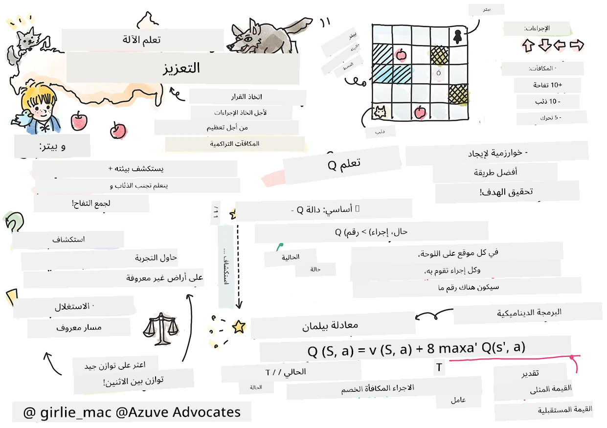
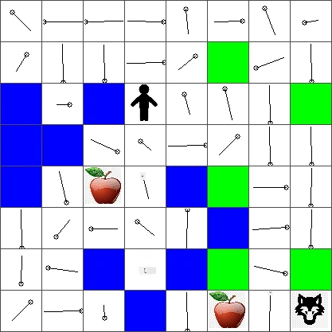

# مقدمة في التعلم المعزز وتعلم كيو


> رسم تخطيطي بواسطة [تومومي إيمورا](https://www.twitter.com/girlie_mac)

يتضمن التعلم المعزز ثلاث مفاهيم مهمة: الوكيل، بعض الحالات، ومجموعة من الإجراءات لكل حالة. من خلال تنفيذ إجراء في حالة محددة، يحصل الوكيل على مكافأة. تخيل مجددًا لعبة الحاسوب سوبر ماريو. أنت ماريو، في مستوى لعبة، واقف بجانب حافة منحدر. فوقك عملة معدنية. أنت كماريو، في مستوى لعبة، في موقع معين ... هذا هو حالتك. التحرك خطوة واحدة إلى اليمين (إجراء) سيجعلك تسقط من الحافة، وهذا سيعطيك درجة رقمية منخفضة. ولكن، الضغط على زر القفز سيمكنك من تسجيل نقطة وستبقى على قيد الحياة. هذه نتيجة إيجابية ويجب أن تمنحك درجة رقمية إيجابية.

باستخدام التعلم المعزز ومحاكي (اللعبة)، يمكنك تعلم كيفية لعب اللعبة لتعظيم المكافأة وهي البقاء على قيد الحياة وتسجيل أكبر عدد ممكن من النقاط.

[](https://www.youtube.com/watch?v=lDq_en8RNOo)

> 🎥 اضغط على الصورة أعلاه للاستماع إلى دميتري وهو يناقش التعلم المعزز

## [اختبار قبلي للمحاضرة](https://ff-quizzes.netlify.app/en/ml/)

## المتطلبات المسبقة والإعداد

في هذا الدرس، سنجرب بعض الكود في بايثون. يجب أن تكون قادرًا على تشغيل كود مفكرة Jupyter لهذا الدرس، إما على جهازك الحاسوبي أو في مكان ما على السحابة.

يمكنك فتح [مفكرة الدرس](https://github.com/microsoft/ML-For-Beginners/blob/main/8-Reinforcement/1-QLearning/notebook.ipynb) والمشي عبر هذا الدرس للبناء.

> **ملاحظة:** إذا كنت تفتح هذا الكود من السحابة، تحتاج أيضًا إلى جلب ملف [`rlboard.py`](https://github.com/microsoft/ML-For-Beginners/blob/main/8-Reinforcement/1-QLearning/rlboard.py)، الذي يُستخدم في كود المفكرة. أضفه إلى نفس المجلد مع المفكرة.

## مقدمة

في هذا الدرس، سنستكشف عالم **[بيتر والذئب](https://en.wikipedia.org/wiki/Peter_and_the_Wolf)**، مستوحى من قصة موسيقية للمؤلف الروسي، [سيرجي بروكوفييف](https://en.wikipedia.org/wiki/Sergei_Prokofiev). سنستخدم **التعلم المعزز** للسماح لبيتر باستكشاف بيئته، وجمع التفاح الشهي وتجنب مواجهة الذئب.

**التعلم المعزز** (RL) هو تقنية تعلم تسمح لنا بتعلم سلوك مثالي لـ **وكيل** في بعض **البيئة** عبر إجراء العديد من التجارب. يجب أن يكون للوكيل في هذه البيئة **هدف**، يُعرّف بواسطة **دالة المكافأة**.

## البيئة

لتبسيط الأمر، دعونا نعتبر عالم بيتر لوحة مربعة بحجم `العرض` × `الارتفاع`، مثل هذه:


كل خلية في هذه اللوحة يمكن أن تكون إما:

* **أرضًا** يمكن لبيتر والكائنات الأخرى المشي عليها.
* **ماء** لا يمكنك بالطبع المشي عليه.
* **شجرة** أو **عشبًا**، مكان للاسترخاء.
* **تفاحة** تمثل شيئًا سيكون بيتر سعيدًا بالعثور عليه ليطعم نفسه.
* **ذئبًا**، يمثل خطرًا ويجب تجنبه.

هناك وحدة بايثون منفصلة، [`rlboard.py`](https://github.com/microsoft/ML-For-Beginners/blob/main/8-Reinforcement/1-QLearning/rlboard.py)، تحتوي على الكود للعمل مع هذه البيئة. نظرًا لأن هذا الكود غير مهم لفهم مفاهيمنا، سنستورد الوحدة ونستخدمها لإنشاء اللوحة التجريبية (كتلة الكود 1):

```python
from rlboard import *

width, height = 8,8
m = Board(width,height)
m.randomize(seed=13)
m.plot()
```

ينبغي أن يطبع هذا الكود صورة للبيئة مشابهة للتي أعلاه.

## الإجراءات والسياسة

في مثالنا، هدف بيتر هو أن يتمكن من العثور على تفاحة، مع تجنب الذئب والعقبات الأخرى. لتحقيق ذلك، يمكنه المشي حوله حتى يجد التفاحة.

لذلك، في أي موضع، يمكنه الاختيار بين أحد الإجراءات التالية: أعلى، أسفل، يسار، ويمين.

سنعرف هذه الإجراءات كقاموس، ونربطها بأزواج من التغييرات في الإحداثيات المقابلة. على سبيل المثال، التحرك يمينًا (`R`) سيعادل الزوج `(1,0)`. (كتلة الكود 2):

```python
actions = { "U" : (0,-1), "D" : (0,1), "L" : (-1,0), "R" : (1,0) }
action_idx = { a : i for i,a in enumerate(actions.keys()) }
```

للتلخيص، الاستراتيجية والهدف لهذا السيناريو هما كالتالي:

- **الاستراتيجية**، لوكيلنا (بيتر) تُعرف بما يسمى **السياسة**. السياسة هي دالة تُرجع الإجراء في أي حالة معينة. في حالتنا، تمثل حالة المشكلة اللوحة، بما في ذلك الموقع الحالي للاعب.

- **الهدف**، من التعلم المعزز هو في النهاية تعلم سياسة جيدة تسمح لنا بحل المشكلة بكفاءة. لكن، كخط أساس، دعنا نعتبر أبسط سياسة تسمى **السير العشوائي**.

## السير العشوائي

دعونا أولاً نحل مشكلتنا بتطبيق استراتيجية السير العشوائي. مع السير العشوائي، سنختار الإجراء التالي عشوائيًا من الإجراءات المسموح بها، حتى نصل إلى التفاحة (كتلة الكود 3).

1. نفذ السير العشوائي بالكود أدناه:

    ```python
    def random_policy(m):
        return random.choice(list(actions))
    
    def walk(m,policy,start_position=None):
        n = 0 # عدد الخطوات
        # تعيين الموضع الابتدائي
        if start_position:
            m.human = start_position 
        else:
            m.random_start()
        while True:
            if m.at() == Board.Cell.apple:
                return n # نجاح!
            if m.at() in [Board.Cell.wolf, Board.Cell.water]:
                return -1 # أكلها الذئب أو غرقت
            while True:
                a = actions[policy(m)]
                new_pos = m.move_pos(m.human,a)
                if m.is_valid(new_pos) and m.at(new_pos)!=Board.Cell.water:
                    m.move(a) # قم بالتحرك الفعلي
                    break
            n+=1
    
    walk(m,random_policy)
    ```

    يجب أن تعيد المكالمة إلى `walk` طول المسار المقابل، والذي يمكن أن يختلف من تشغيل لآخر.

1. نفذ تجربة السير عدة مرات (لنقل 100)، واطبع الإحصائيات الناتجة (كتلة الكود 4):

    ```python
    def print_statistics(policy):
        s,w,n = 0,0,0
        for _ in range(100):
            z = walk(m,policy)
            if z<0:
                w+=1
            else:
                s += z
                n += 1
        print(f"Average path length = {s/n}, eaten by wolf: {w} times")
    
    print_statistics(random_policy)
    ```

    لاحظ أن متوسط طول المسار حوالي 30-40 خطوة، وهو كثير نسبيًا، بالنظر إلى أن متوسط المسافة إلى التفاحة الأقرب حوالي 5-6 خطوات.

    يمكنك أيضًا رؤية كيف يبدو تحرك بيتر أثناء السير العشوائي:

    

## دالة المكافأة

لجعل سياستنا أكثر ذكاءً، نحتاج إلى فهم أي الحركات "أفضل" من غيرها. لهذا، نحتاج إلى تعريف هدفنا.

يمكن تعريف الهدف بدالة **دالة مكافأة**، التي ترجع قيمة نتائج لكل حالة. كلما كان الرقم أكبر، كانت دالة المكافأة أفضل. (كتلة الكود 5)

```python
move_reward = -0.1
goal_reward = 10
end_reward = -10

def reward(m,pos=None):
    pos = pos or m.human
    if not m.is_valid(pos):
        return end_reward
    x = m.at(pos)
    if x==Board.Cell.water or x == Board.Cell.wolf:
        return end_reward
    if x==Board.Cell.apple:
        return goal_reward
    return move_reward
```

شيء مثير للاهتمام حول دوال المكافأة هو أنه في معظم الحالات، *نحصل على مكافأة كبيرة فقط في نهاية اللعبة*. هذا يعني أن خوارزميتنا يجب أن تتذكر somehow الخطوات "الجيدة" التي تؤدي إلى مكافأة إيجابية في النهاية، وتعزز أهميتها. وبالمثل، يُثبط كل التحركات التي تؤدي إلى نتائج سيئة.

## تعلم كيو

الخوارزمية التي سنناقشها هنا تسمى **تعلم كيو**. في هذه الخوارزمية، تُعرف السياسة بدالة (أو هيكل بيانات) يسمى **جدول كيو**. يسجل "جودة" كل العمليات في حالة معينة.

يسمى جدول كيو لأنه من الملائم تمثيله في صورة جدول، أو مصفوفة متعددة الأبعاد. بما أن لوحتنا هي بأبعاد `عرض` × `ارتفاع`، يمكننا تمثيل جدول كيو باستخدام مصفوفة numpy على شكل `عرض` × `ارتفاع` × `len(actions)`: (كتلة الكود 6)

```python
Q = np.ones((width,height,len(actions)),dtype=np.float)*1.0/len(actions)
```

لاحظ أننا نُهيئ كل قيم جدول كيو بقيمة متساوية، في حالتنا - 0.25. هذا يتوافق مع سياسة "السير العشوائي"، لأن كل التحركات في كل حالة متساوية. يمكننا تمرير جدول كيو إلى دالة `plot` لعرض الجدول على اللوحة: `m.plot(Q)`.


في وسط كل خلية هناك "سهم" يشير للاتجاه المفضل للحركة. بما أن كل الاتجاهات متساوية، يعرض نقطة.

الآن نحتاج إلى تشغيل المحاكاة، واستكشاف بيئتنا، وتعلم توزيع أفضل لقيم جدول كيو، مما سيمكننا من إيجاد المسار إلى التفاحة بشكل أسرع بكثير.

## جوهر تعلم كيو: معادلة بيلمان

بمجرد أن نبدأ في الحركة، سيكون لكل إجراء مكافأة مقابلة، أي يمكننا نظريًا اختيار الإجراء التالي بناءً على أعلى مكافأة فورية. ومع ذلك، في معظم الحالات، لن يحقق التحرك هدفنا في الوصول إلى التفاحة، وبالتالي لا يمكننا فورًا تحديد الاتجاه الأفضل.

> تذكر أن النتيجة الفورية ليست المهمة، بل النتيجة النهائية التي سنحصل عليها في نهاية المحاكاة.

من أجل حساب هذه المكافأة المؤجلة، نحتاج إلى استخدام مبادئ **[البرمجة الديناميكية](https://en.wikipedia.org/wiki/Dynamic_programming)**، التي تسمح لنا بالتفكير في مشكلتنا بشكل متكرر.

لنفترض أننا الآن في الحالة *s*، ونريد الانتقال إلى الحالة التالية *s'*. بعمل ذلك، سنتلقى المكافأة الفورية *r(s,a)*، المعرفة بواسطة دالة المكافأة، بالإضافة إلى بعض المكافأة المستقبلية. إذا افترضنا أن جدول كيو يعكس بدقة "جاذبية" كل إجراء، فعند الحالة *s'* سنختار إجراء *a* الذي يقابل القيمة القصوى لـ *Q(s',a')*. إذن، أفضل مكافأة مستقبلية ممكنة يمكننا الحصول عليها عند الحالة *s* ستُعرّف كـ `max`<sub>a'</sub>*Q(s',a')* (يُحسب الحد الأقصى هنا عبر جميع الإجراءات الممكنة *a'* في الحالة *s'*).

هذا يعطينا **معادلة بيلمان** لحساب قيمة جدول كيو عند الحالة *s*، بناءً على الإجراء *a*:


هنا γ هو ما يسمى **عامل الخصم** الذي يحدد إلى أي مدى يجب أن تفضّل المكافأة الحالية على المكافأة المستقبلية والعكس.

## خوارزمية التعلم

بالنظر إلى المعادلة أعلاه، يمكننا الآن كتابة كود زائف لخوارزمية التعلم:

* ابدأ جدول كيو Q بأعداد متساوية لكل الحالات والإجراءات
* اضبط معدل التعلم α ← 1
* كرر المحاكاة عدة مرات
   1. ابدأ من موقع عشوائي
   1. كرر
        1. اختر إجراء *a* في الحالة *s*
        2. نفذ الإجراء بالتحرك إلى حالة جديدة *s'*
        3. إذا صادفنا شرط نهاية اللعبة، أو كانت المكافأة الكلية صغيرة جدًا - اخرج من المحاكاة  
        4. احسب المكافأة *r* في الحالة الجديدة
        5. حدّث دالة Q حسب معادلة بيلمان: *Q(s,a)* ← *(1-α)Q(s,a)+α(r+γ max<sub>a'</sub>Q(s',a'))*
        6. *s* ← *s'*
        7. حدّث المكافأة الكلية وقلل α.

## الاستغلال مقابل الاستكشاف

في الخوارزمية أعلاه، لم نحدد كيف نختار الإجراء بالضبط في الخطوة 2.1. إذا اخترنا الإجراء عشوائيًا، فسن **نستكشف** البيئة عشوائيًا، ومن المحتمل أن نموت كثيرًا وكذلك نستكشف مناطق لم نذهب إليها عادة. النهج البديل هو **استغلال** قيم جدول كيو التي نعرفها بالفعل، وبالتالي اختيار أفضل إجراء (بقيمة جدول كيو أعلى) عند الحالة *s*. وهذا، مع ذلك، سيمنعنا من استكشاف حالات أخرى، ومن المحتمل ألا نجد الحل الأمثل.

لذلك، النهج الأفضل هو تحقيق توازن بين الاستكشاف والاستغلال. يمكن فعل ذلك باختيار الإجراء عند الحالة *s* مع احتمالات تتناسب مع القيم في جدول كيو. في البداية، عندما تكون قيم جدول كيو كلها متساوية، سيكون الاختيار عشوائيًا، ولكن مع تعلمنا المزيد عن بيئتنا، سنكون أكثر ميلًا لاتباع الطريق الأمثل مع السماح للوكيل باختيار مسار غير مستكشف أحيانًا.

## تنفيذ بايثون

نحن الآن مستعدون لتنفيذ خوارزمية التعلم. قبل أن نفعل ذلك، نحتاج أيضًا إلى دالة تُحوّل الأعداد العشوائية في جدول كيو إلى متجه احتمالات للإجراءات المقابلة.

1. أنشئ دالة `probs()`:

    ```python
    def probs(v,eps=1e-4):
        v = v-v.min()+eps
        v = v/v.sum()
        return v
    ```

    نضيف بعض `eps` إلى المتجه الأصلي لتجنب القسمة على صفر في الحالة الأولية، عندما تكون كل مكونات المتجه متطابقة.

نفذ خوارزمية التعلم عبر 5000 تجربة، تُسمى أيضًا **عصور**: (كتلة الكود 8)
```python
    for epoch in range(5000):
    
        # اختر نقطة البداية
        m.random_start()
        
        # ابدأ السفر
        n=0
        cum_reward = 0
        while True:
            x,y = m.human
            v = probs(Q[x,y])
            a = random.choices(list(actions),weights=v)[0]
            dpos = actions[a]
            m.move(dpos,check_correctness=False) # نسمح للاعب بالتحرك خارج اللوحة، مما يؤدي إلى إنهاء الحلقة
            r = reward(m)
            cum_reward += r
            if r==end_reward or cum_reward < -1000:
                lpath.append(n)
                break
            alpha = np.exp(-n / 10e5)
            gamma = 0.5
            ai = action_idx[a]
            Q[x,y,ai] = (1 - alpha) * Q[x,y,ai] + alpha * (r + gamma * Q[x+dpos[0], y+dpos[1]].max())
            n+=1
```

بعد تنفيذ هذه الخوارزمية، يجب تحديث جدول كيو بالقيم التي تحدد جاذبية الإجراءات المختلفة في كل خطوة. يمكننا محاولة عرض جدول كيو برسم متجه في كل خلية يشير إلى الاتجاه المطلوب للحركة. وللبساطة، نرسم دائرة صغيرة بدل رأس السهم.



## التحقق من السياسة

بما أن جدول كيو يسرد "جاذبية" كل إجراء في كل حالة، فمن السهل جدًا استخدامه لتحديد التنقل الفعال في عالمنا. في أبسط الحالات، يمكننا اختيار الإجراء المقابل لأعلى قيمة في جدول كيو: (كتلة الكود 9)

```python
def qpolicy_strict(m):
        x,y = m.human
        v = probs(Q[x,y])
        a = list(actions)[np.argmax(v)]
        return a

walk(m,qpolicy_strict)
```


> إذا جربت الكود أعلاه عدة مرات، قد تلاحظ أحيانًا أنه "يتوقف عن الاستجابة"، وتحتاج إلى الضغط على زر الإيقاف في الدفتر لإيقافه. يحدث هذا لأن هناك حالات قد تتبادل فيها حالتان "الإشارة" لبعضهما البعض من حيث قيمة Q المثلى، وفي هذه الحالة ينتهي بالوكيل إلى التنقل بين تلك الحالات إلى أجل غير مسمى.

## 🚀التحدي

> **المهمة 1:** عدل دالة `walk` لتحديد الحد الأقصى لطول المسار بعدد معين من الخطوات (مثلاً، 100)، وراقب الكود أعلاه وهو يعيد هذه القيمة من وقت لآخر.

> **المهمة 2:** عدل دالة `walk` بحيث لا تعود إلى الأماكن التي زارها سابقًا. هذا سيمنع `walk` من الدخول في حلقة لا نهائية، مع ذلك، قد يظل الوكيل محاصرًا في موقع لا يستطيع الهروب منه.

## التنقل

سياسة التنقل الأفضل هي التي استخدمناها أثناء التدريب، والتي تجمع بين الاستغلال والاستكشاف. في هذه السياسة، سنختار كل فعل باحتمال معين يتناسب مع القيم في جدول Q. قد تؤدي هذه الاستراتيجية إلى عودة الوكيل إلى موقع استكشفه سابقًا، لكن، كما ترى من الكود أدناه، فإنها تؤدي إلى مسار متوسط ​​قصير جدًا للوصول إلى الموقع المطلوب (تذكر أن `print_statistics` تشغل المحاكاة 100 مرة): (الكتلة البرمجية 10)

```python
def qpolicy(m):
        x,y = m.human
        v = probs(Q[x,y])
        a = random.choices(list(actions),weights=v)[0]
        return a

print_statistics(qpolicy)
```

بعد تشغيل هذا الكود، يجب أن تحصل على متوسط طول مسار أصغر بكثير من السابق، في نطاق 3-6.

## دراسة عملية التعلم

كما ذكرنا، عملية التعلم هي توازن بين الاستكشاف والاستغلال للمعرفة المكتسبة حول هيكل فضاء المشكلة. لقد رأينا أن نتائج التعلم (القدرة على مساعدة الوكيل في إيجاد مسار قصير إلى الهدف) قد تحسنت، لكنه من المثير أيضًا مراقبة كيف يتصرف متوسط طول المسار أثناء عملية التعلم:


يمكن تلخيص التعلم كما يلي:

- **يزداد متوسط طول المسار**. ما نراه هنا هو أنه في البداية، يزداد متوسط طول المسار. ويرجع ذلك على الأرجح إلى أننا لا نعرف شيئًا عن البيئة، ومن المحتمل أن نعلق في حالات سيئة، مثل الماء أو الذئب. مع اكتسابنا للمزيد من المعرفة، نتمكن من استكشاف البيئة لفترة أطول، لكننا لا نزال لا نعرف أماكن التفاح جيدًا.

- **ينخفض طول المسار مع التعلّم**. بمجرد أن نتعلم بما فيه الكفاية، يصبح من الأسهل على الوكيل تحقيق الهدف، ويبدأ طول المسار في الانخفاض. ومع ذلك، نحن لا نزال منفتحين على الاستكشاف، لذا غالبًا ما ننحرف عن أفضل مسار، ونستكشف خيارات جديدة، مما يجعل المسار أطول من الأمثل.

- **يزداد الطول بشكل مفاجئ**. ما نلاحظه أيضًا في هذا الرسم البياني هو أنه في نقطة معينة، زاد الطول فجأة. يشير هذا إلى الطبيعة العشوائية للعملية، وأنه يمكن في نقطة ما "إفساد" معاملات جدول Q بإعادة كتابتها بقيم جديدة. من المثالي تقليل هذا عن طريق تقليل معدل التعلم (على سبيل المثال، نحو نهاية التدريب، نضبط قيم جدول Q بقيمة صغيرة فقط).

بشكل عام، من المهم أن نتذكر أن نجاح وجودة عملية التعلم تعتمد بشكل كبير على معايير، مثل معدل التعلم، تناقص معدل التعلم، وعامل الخصم. غالبًا ما تُسمى هذه **المعلمات الفائقة**، لتمييزها عن **المعلمات** التي نحسنها أثناء التدريب (مثل معاملات جدول Q). تُسمى عملية إيجاد أفضل قيم للمعلمات الفائقة **تحسين المعلمات الفائقة**، وتستحق موضوعًا منفصلًا.

## [اختبار ما بعد المحاضرة](https://ff-quizzes.netlify.app/en/ml/)

## المهمة
[عالم أكثر واقعية](assignment.md)

---

<!-- CO-OP TRANSLATOR DISCLAIMER START -->
**تنويه**:
تمت ترجمة هذا المستند باستخدام خدمة الترجمة بالذكاء الاصطناعي [Co-op Translator](https://github.com/Azure/co-op-translator). بينما نسعى للدقة، يرجى العلم أن الترجمات الآلية قد تحتوي على أخطاء أو عدم دقة. يجب اعتبار المستند الأصلي بلغته الأصلية المصدر الرسمي والمعتمد. للمعلومات الهامة، يُنصح بالاستعانة بترجمة بشرية محترفة. نحن غير مسؤولين عن أي سوء فهم أو تفسير ناتج عن استخدام هذه الترجمة.
<!-- CO-OP TRANSLATOR DISCLAIMER END -->