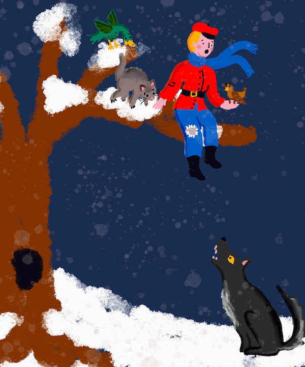

<!--
CO_OP_TRANSLATOR_METADATA:
{
  "original_hash": "20ca019012b1725de956681d036d8b18",
  "translation_date": "2025-08-29T14:07:35+00:00",
  "source_file": "8-Reinforcement/README.md",
  "language_code": "ar"
}
-->
# مقدمة في التعلم المعزز

يُعتبر التعلم المعزز، أو RL، أحد الأسس الرئيسية في تعلم الآلة، إلى جانب التعلم الموجّه والتعلم غير الموجّه. التعلم المعزز يدور حول اتخاذ القرارات: اتخاذ القرارات الصحيحة أو على الأقل التعلم منها.

تخيل أن لديك بيئة محاكاة مثل سوق الأسهم. ماذا يحدث إذا فرضت تنظيمًا معينًا؟ هل سيكون له تأثير إيجابي أم سلبي؟ إذا حدث شيء سلبي، عليك أن تأخذ هذا _التعزيز السلبي_، تتعلم منه، وتغير المسار. وإذا كان هناك نتيجة إيجابية، عليك أن تبني على هذا _التعزيز الإيجابي_.

> بيتر وأصدقاؤه بحاجة للهروب من الذئب الجائع! الصورة بواسطة [جين لوبر](https://twitter.com/jenlooper)

## موضوع إقليمي: بيتر والذئب (روسيا)

[بيتر والذئب](https://en.wikipedia.org/wiki/Peter_and_the_Wolf) هي قصة خيالية موسيقية كتبها المؤلف الروسي [سيرجي بروكوفييف](https://en.wikipedia.org/wiki/Sergei_Prokofiev). تحكي القصة عن بيتر، الشاب الشجاع الذي يخرج من منزله إلى الغابة لمطاردة الذئب. في هذا القسم، سنقوم بتدريب خوارزميات تعلم الآلة لمساعدة بيتر:

- **استكشاف** المنطقة المحيطة وبناء خريطة تنقل مثالية.
- **تعلم** كيفية استخدام لوح التزلج والتوازن عليه، للتنقل بشكل أسرع.

> 🎥 انقر على الصورة أعلاه للاستماع إلى بيتر والذئب بواسطة بروكوفييف

## التعلم المعزز

في الأقسام السابقة، رأيت مثالين لمشاكل تعلم الآلة:

- **التعلم الموجّه**، حيث لدينا مجموعات بيانات تقترح حلولًا نموذجية للمشكلة التي نريد حلها. [التصنيف](../4-Classification/README.md) و[الانحدار](../2-Regression/README.md) هما مهمتان في التعلم الموجّه.
- **التعلم غير الموجّه**، حيث لا توجد لدينا بيانات تدريبية مُعلمة. المثال الرئيسي للتعلم غير الموجّه هو [التجميع](../5-Clustering/README.md).

في هذا القسم، سنقدم لك نوعًا جديدًا من مشاكل التعلم التي لا تتطلب بيانات تدريب مُعلمة. هناك عدة أنواع من هذه المشاكل:

- **[التعلم شبه الموجّه](https://wikipedia.org/wiki/Semi-supervised_learning)**، حيث لدينا الكثير من البيانات غير المُعلمة التي يمكن استخدامها لتدريب النموذج مبدئيًا.
- **[التعلم المعزز](https://wikipedia.org/wiki/Reinforcement_learning)**، حيث يتعلم الوكيل كيفية التصرف من خلال إجراء تجارب في بيئة محاكاة.

### مثال - لعبة كمبيوتر

افترض أنك تريد تعليم الكمبيوتر لعب لعبة، مثل الشطرنج أو [سوبر ماريو](https://wikipedia.org/wiki/Super_Mario). لكي يلعب الكمبيوتر اللعبة، نحتاج إلى أن يتنبأ بالحركة التي يجب أن يقوم بها في كل حالة من حالات اللعبة. بينما قد يبدو هذا كمشكلة تصنيف، إلا أنه ليس كذلك - لأننا لا نملك مجموعة بيانات تحتوي على الحالات والإجراءات المقابلة لها. على الرغم من أنه قد يكون لدينا بعض البيانات مثل مباريات الشطرنج الموجودة أو تسجيلات للاعبين يلعبون سوبر ماريو، فمن المحتمل أن هذه البيانات لن تغطي عددًا كافيًا من الحالات الممكنة.

بدلاً من البحث عن بيانات اللعبة الموجودة، يعتمد **التعلم المعزز** (RL) على فكرة *جعل الكمبيوتر يلعب* مرات عديدة ومراقبة النتائج. لذلك، لتطبيق التعلم المعزز، نحتاج إلى شيئين:

- **بيئة** و**محاكي** يسمحان لنا بلعب اللعبة مرات عديدة. هذا المحاكي سيحدد جميع قواعد اللعبة بالإضافة إلى الحالات والإجراءات الممكنة.

- **دالة المكافأة**، التي تخبرنا بمدى نجاحنا خلال كل حركة أو لعبة.

الفرق الرئيسي بين أنواع التعلم الأخرى وRL هو أنه في RL عادةً لا نعرف ما إذا كنا سنفوز أو نخسر حتى ننهي اللعبة. لذلك، لا يمكننا القول ما إذا كانت حركة معينة وحدها جيدة أم لا - نحن نتلقى المكافأة فقط في نهاية اللعبة. وهدفنا هو تصميم خوارزميات تسمح لنا بتدريب نموذج في ظل ظروف غير مؤكدة. سنتعلم عن خوارزمية RL تُسمى **Q-learning**.

## الدروس

1. [مقدمة في التعلم المعزز وQ-Learning](1-QLearning/README.md)
2. [استخدام بيئة محاكاة الجيم](2-Gym/README.md)

## الشكر

تم كتابة "مقدمة في التعلم المعزز" بحب ♥️ بواسطة [ديمتري سوشنيكوف](http://soshnikov.com)

---

**إخلاء المسؤولية**:  
تمت ترجمة هذا المستند باستخدام خدمة الترجمة الآلية [Co-op Translator](https://github.com/Azure/co-op-translator). بينما نسعى لتحقيق الدقة، يرجى العلم أن الترجمات الآلية قد تحتوي على أخطاء أو معلومات غير دقيقة. يجب اعتبار المستند الأصلي بلغته الأصلية هو المصدر الموثوق. للحصول على معلومات حساسة أو هامة، يُوصى بالاستعانة بترجمة بشرية احترافية. نحن غير مسؤولين عن أي سوء فهم أو تفسيرات خاطئة تنشأ عن استخدام هذه الترجمة.