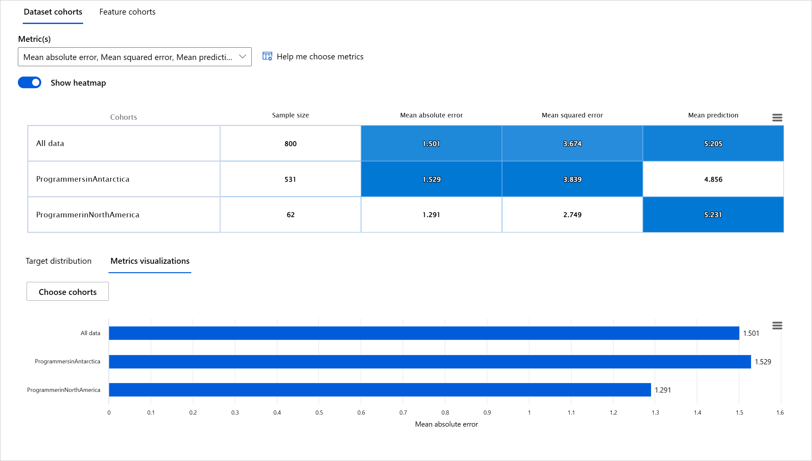

<!--
CO_OP_TRANSLATOR_METADATA:
{
  "original_hash": "ba0f6e1019351351c8ee4c92867b6a0b",
  "translation_date": "2025-08-29T13:32:22+00:00",
  "source_file": "9-Real-World/2-Debugging-ML-Models/README.md",
  "language_code": "ar"
}
-->
# الملحق: تصحيح النماذج في تعلم الآلة باستخدام مكونات لوحة تحكم الذكاء الاصطناعي المسؤول

## [اختبار ما قبل المحاضرة](https://gray-sand-07a10f403.1.azurestaticapps.net/quiz/5/)

## المقدمة

يؤثر تعلم الآلة على حياتنا اليومية بشكل كبير. فالذكاء الاصطناعي يشق طريقه إلى بعض الأنظمة الأكثر أهمية التي تؤثر علينا كأفراد وعلى مجتمعنا ككل، مثل الرعاية الصحية، والتمويل، والتعليم، والتوظيف. على سبيل المثال، تُستخدم الأنظمة والنماذج في اتخاذ قرارات يومية مثل تشخيص الأمراض أو اكتشاف الاحتيال. ونتيجة لذلك، فإن التقدم في الذكاء الاصطناعي إلى جانب التبني المتسارع له يقابله تطور في توقعات المجتمع وزيادة في التشريعات المنظمة. نرى باستمرار مجالات يفشل فيها الذكاء الاصطناعي في تلبية التوقعات، مما يكشف عن تحديات جديدة، وتبدأ الحكومات في تنظيم حلول الذكاء الاصطناعي. لذلك، من المهم تحليل هذه النماذج لضمان تقديم نتائج عادلة وموثوقة وشاملة وشفافة ومسؤولة للجميع.

في هذا المنهج، سنستعرض أدوات عملية يمكن استخدامها لتقييم ما إذا كان النموذج يواجه مشكلات تتعلق بالذكاء الاصطناعي المسؤول. تعتمد تقنيات تصحيح تعلم الآلة التقليدية عادةً على حسابات كمية مثل دقة الإجماليات أو متوسط فقدان الخطأ. تخيل ما يمكن أن يحدث عندما تفتقر البيانات التي تستخدمها لبناء هذه النماذج إلى تمثيل معين لفئات ديموغرافية مثل العرق أو الجنس أو الرؤية السياسية أو الدين، أو عندما تكون هذه الفئات ممثلة بشكل غير متناسب. ماذا عن الحالات التي يتم فيها تفسير مخرجات النموذج لتفضيل فئة ديموغرافية معينة؟ يمكن أن يؤدي ذلك إلى تمثيل زائد أو ناقص لهذه الفئات الحساسة، مما يؤدي إلى مشكلات تتعلق بالعدالة أو الشمولية أو الموثوقية. عامل آخر هو أن نماذج تعلم الآلة تُعتبر صناديق سوداء، مما يجعل من الصعب فهم وتفسير ما يدفع توقعات النموذج. كل هذه التحديات تواجه علماء البيانات ومطوري الذكاء الاصطناعي عندما لا تتوفر لديهم الأدوات المناسبة لتصحيح النماذج أو تقييم عدالتها أو موثوقيتها.

في هذا الدرس، ستتعلم كيفية تصحيح النماذج باستخدام:

- **تحليل الأخطاء**: تحديد الأماكن في توزيع البيانات التي تكون فيها معدلات الخطأ عالية.
- **نظرة عامة على النموذج**: إجراء تحليل مقارن عبر مجموعات بيانات مختلفة لاكتشاف التفاوتات في مقاييس أداء النموذج.
- **تحليل البيانات**: التحقيق في الأماكن التي قد يكون فيها تمثيل زائد أو ناقص للبيانات، مما قد يؤدي إلى انحياز النموذج لفئة ديموغرافية معينة.
- **أهمية الميزات**: فهم الميزات التي تؤثر على توقعات النموذج على المستوى العام أو المحلي.

## المتطلبات الأساسية

كشرط أساسي، يُرجى مراجعة [أدوات الذكاء الاصطناعي المسؤول للمطورين](https://www.microsoft.com/ai/ai-lab-responsible-ai-dashboard)

> 

## تحليل الأخطاء

تعتمد مقاييس أداء النماذج التقليدية المستخدمة لقياس الدقة غالبًا على حسابات تعتمد على التوقعات الصحيحة مقابل التوقعات الخاطئة. على سبيل المثال، يمكن اعتبار أن النموذج دقيق بنسبة 89% مع فقدان خطأ قدره 0.001 أداءً جيدًا. ومع ذلك، فإن الأخطاء غالبًا ما تكون غير موزعة بالتساوي في مجموعة البيانات الأساسية. قد تحصل على درجة دقة نموذج تبلغ 89% ولكن تكتشف أن هناك مناطق معينة في بياناتك يفشل فيها النموذج بنسبة 42%. يمكن أن تؤدي هذه الأنماط من الفشل مع مجموعات بيانات معينة إلى مشكلات تتعلق بالعدالة أو الموثوقية. من الضروري فهم المناطق التي يعمل فيها النموذج بشكل جيد أو لا يعمل. قد تكون المناطق التي تحتوي على عدد كبير من الأخطاء في النموذج تمثل فئة ديموغرافية مهمة.

يوضح مكون تحليل الأخطاء في لوحة تحكم الذكاء الاصطناعي المسؤول كيفية توزيع فشل النموذج عبر مجموعات مختلفة باستخدام تصور شجري. هذا مفيد في تحديد الميزات أو المناطق التي تحتوي على معدلات خطأ عالية في مجموعة البيانات الخاصة بك. من خلال رؤية مصدر معظم الأخطاء في النموذج، يمكنك البدء في التحقيق في السبب الجذري. يمكنك أيضًا إنشاء مجموعات بيانات لإجراء التحليل عليها. تساعد هذه المجموعات في عملية التصحيح لتحديد سبب أداء النموذج بشكل جيد في مجموعة معينة ولكنه يخطئ في مجموعة أخرى.

تساعد المؤشرات المرئية على الخريطة الشجرية في تحديد مناطق المشكلة بسرعة. على سبيل المثال، كلما كان لون العقدة الشجرية أغمق باللون الأحمر، زادت نسبة الخطأ.

الخريطة الحرارية هي وظيفة تصور أخرى يمكن للمستخدمين استخدامها للتحقيق في معدل الخطأ باستخدام ميزة واحدة أو ميزتين لتحديد المساهمين في أخطاء النموذج عبر مجموعة البيانات بأكملها أو المجموعات.

استخدم تحليل الأخطاء عندما تحتاج إلى:

* فهم عميق لكيفية توزيع أخطاء النموذج عبر مجموعة البيانات وعبر عدة أبعاد إدخال وميزات.
* تقسيم مقاييس الأداء الإجمالية لاكتشاف المجموعات الخاطئة تلقائيًا لإبلاغ خطوات التخفيف المستهدفة.

## نظرة عامة على النموذج

يتطلب تقييم أداء نموذج تعلم الآلة فهمًا شاملاً لسلوكه. يمكن تحقيق ذلك من خلال مراجعة أكثر من مقياس واحد مثل معدل الخطأ، الدقة، الاستدعاء، الدقة، أو متوسط الخطأ المطلق (MAE) لاكتشاف التفاوتات بين مقاييس الأداء. قد يبدو أحد مقاييس الأداء رائعًا، ولكن يمكن كشف الأخطاء في مقياس آخر. بالإضافة إلى ذلك، فإن مقارنة المقاييس للكشف عن التفاوتات عبر مجموعة البيانات بأكملها أو المجموعات يساعد في تسليط الضوء على الأماكن التي يعمل فيها النموذج بشكل جيد أو لا يعمل. هذا مهم بشكل خاص لرؤية أداء النموذج بين الميزات الحساسة مقابل غير الحساسة (مثل العرق، الجنس، أو العمر) للكشف عن أي انحياز محتمل قد يكون لدى النموذج. على سبيل المثال، اكتشاف أن النموذج أكثر خطأً في مجموعة تحتوي على ميزات حساسة يمكن أن يكشف عن انحياز محتمل.

يساعد مكون نظرة عامة على النموذج في لوحة تحكم الذكاء الاصطناعي المسؤول ليس فقط في تحليل مقاييس الأداء لتمثيل البيانات في مجموعة معينة، بل يمنح المستخدمين القدرة على مقارنة سلوك النموذج عبر مجموعات مختلفة.

تتيح وظيفة التحليل المستندة إلى الميزات للمكون للمستخدمين تضييق نطاق مجموعات البيانات الفرعية ضمن ميزة معينة لتحديد الشذوذ على مستوى دقيق. على سبيل المثال، تحتوي لوحة التحكم على ذكاء مدمج لتوليد مجموعات تلقائيًا لميزة يختارها المستخدم (مثل *"time_in_hospital < 3"* أو *"time_in_hospital >= 7"*). يتيح ذلك للمستخدم عزل ميزة معينة من مجموعة بيانات أكبر لمعرفة ما إذا كانت مؤثرًا رئيسيًا في نتائج النموذج الخاطئة.

يدعم مكون نظرة عامة على النموذج فئتين من مقاييس التفاوت:

**التفاوت في أداء النموذج**: تحسب هذه المجموعة من المقاييس التفاوت (الاختلاف) في قيم مقياس الأداء المحدد عبر مجموعات البيانات الفرعية. إليك بعض الأمثلة:

* التفاوت في معدل الدقة
* التفاوت في معدل الخطأ
* التفاوت في الدقة
* التفاوت في الاستدعاء
* التفاوت في متوسط الخطأ المطلق (MAE)

**التفاوت في معدل الاختيار**: يحتوي هذا المقياس على الفرق في معدل الاختيار (التوقع الإيجابي) بين المجموعات الفرعية. مثال على ذلك هو التفاوت في معدلات الموافقة على القروض. معدل الاختيار يعني نسبة نقاط البيانات في كل فئة المصنفة على أنها 1 (في التصنيف الثنائي) أو توزيع قيم التوقعات (في الانحدار).

## تحليل البيانات

> "إذا عذبت البيانات بما فيه الكفاية، ستعترف بأي شيء" - رونالد كواس

قد يبدو هذا البيان متطرفًا، لكنه صحيح أن البيانات يمكن التلاعب بها لدعم أي استنتاج. يمكن أن يحدث هذا التلاعب أحيانًا عن غير قصد. كبشر، لدينا جميعًا تحيزات، وغالبًا ما يكون من الصعب معرفة متى يتم إدخال التحيز في البيانات. ضمان العدالة في الذكاء الاصطناعي وتعلم الآلة يظل تحديًا معقدًا.

البيانات هي نقطة عمياء كبيرة لمقاييس أداء النماذج التقليدية. قد تحصل على درجات دقة عالية، لكن هذا لا يعكس دائمًا التحيز الأساسي الذي قد يكون موجودًا في مجموعة البيانات الخاصة بك. على سبيل المثال، إذا كانت مجموعة بيانات الموظفين تحتوي على 27% من النساء في المناصب التنفيذية في شركة و73% من الرجال في نفس المستوى، فإن نموذج الذكاء الاصطناعي للإعلانات الوظيفية المدرب على هذه البيانات قد يستهدف في الغالب جمهورًا ذكوريًا للمناصب العليا. هذا الخلل في البيانات أثر على توقعات النموذج لتفضيل جنس معين. يكشف هذا عن مشكلة عدالة حيث يوجد تحيز جنسي في نموذج الذكاء الاصطناعي.

يساعد مكون تحليل البيانات في لوحة تحكم الذكاء الاصطناعي المسؤول في تحديد المناطق التي يوجد فيها تمثيل زائد أو ناقص في مجموعة البيانات. يساعد المستخدمين في تشخيص السبب الجذري للأخطاء ومشكلات العدالة الناتجة عن اختلالات البيانات أو نقص تمثيل مجموعة بيانات معينة. يوفر هذا للمستخدمين القدرة على تصور مجموعات البيانات بناءً على النتائج المتوقعة والفعلية، مجموعات الأخطاء، والميزات المحددة. أحيانًا يمكن أن يكشف اكتشاف مجموعة بيانات غير ممثلة بشكل كافٍ أن النموذج لا يتعلم بشكل جيد، وبالتالي ارتفاع الأخطاء. وجود نموذج يحتوي على تحيز في البيانات ليس فقط مشكلة عدالة ولكنه يظهر أن النموذج غير شامل أو غير موثوق.

استخدم تحليل البيانات عندما تحتاج إلى:

* استكشاف إحصائيات مجموعة البيانات الخاصة بك عن طريق اختيار مرشحات مختلفة لتقسيم بياناتك إلى أبعاد مختلفة (تُعرف أيضًا بالمجموعات).
* فهم توزيع مجموعة البيانات الخاصة بك عبر مجموعات مختلفة ومجموعات الميزات.
* تحديد ما إذا كانت النتائج المتعلقة بالعدالة، تحليل الأخطاء، والسببية (المستمدة من مكونات لوحة التحكم الأخرى) ناتجة عن توزيع مجموعة البيانات الخاصة بك.
* تحديد المناطق التي يجب جمع المزيد من البيانات فيها لتخفيف الأخطاء الناتجة عن مشكلات التمثيل، ضوضاء العلامات، ضوضاء الميزات، تحيز العلامات، وعوامل مشابهة.

## تفسير النموذج

تميل نماذج تعلم الآلة إلى أن تكون صناديق سوداء. فهم الميزات الرئيسية التي تدفع توقعات النموذج يمكن أن يكون تحديًا. من المهم توفير الشفافية حول سبب اتخاذ النموذج لتوقع معين. على سبيل المثال، إذا توقع نظام ذكاء اصطناعي أن مريضًا مصابًا بالسكري معرض لخطر العودة إلى المستشفى في أقل من 30 يومًا، فيجب أن يكون قادرًا على تقديم بيانات داعمة أدت إلى هذا التوقع. وجود مؤشرات بيانات داعمة يجلب الشفافية لمساعدة الأطباء أو المستشفيات على اتخاذ قرارات مستنيرة. بالإضافة إلى ذلك، القدرة على تفسير سبب اتخاذ النموذج لتوقع معين لمريض فردي يعزز المساءلة مع اللوائح الصحية. عندما تستخدم نماذج تعلم الآلة بطرق تؤثر على حياة الناس، من الضروري فهم وتفسير ما يؤثر على سلوك النموذج. تساعد قابلية تفسير النموذج في الإجابة على أسئلة في سيناريوهات مثل:

* تصحيح النموذج: لماذا ارتكب النموذج هذا الخطأ؟ كيف يمكنني تحسين النموذج؟
* التعاون بين الإنسان والذكاء الاصطناعي: كيف يمكنني فهم وثقة قرارات النموذج؟
* الامتثال التنظيمي: هل يلبي النموذج المتطلبات القانونية؟

يساعد مكون أهمية الميزات في لوحة تحكم الذكاء الاصطناعي المسؤول في تصحيح الأخطاء والحصول على فهم شامل لكيفية اتخاذ النموذج للتوقعات. كما أنه أداة مفيدة لمتخصصي تعلم الآلة وصناع القرار لتفسير وإظهار الأدلة على الميزات التي تؤثر على سلوك النموذج للامتثال التنظيمي. بعد ذلك، يمكن للمستخدمين استكشاف التفسيرات العامة والمحلية للتحقق من الميزات التي تؤثر على توقعات النموذج. تسرد التفسيرات العامة الميزات الرئيسية التي أثرت على توقعات النموذج بشكل عام. تعرض التفسيرات المحلية الميزات التي أدت إلى توقع النموذج لحالة فردية. القدرة على تقييم التفسيرات المحلية مفيدة أيضًا في تصحيح الأخطاء أو تدقيق حالة معينة لفهم وتفسير سبب اتخاذ النموذج لتوقع دقيق أو غير دقيق.

* التفسيرات العامة: على سبيل المثال، ما الميزات التي تؤثر على السلوك العام لنموذج إعادة إدخال مرضى السكري إلى المستشفى؟
* التفسيرات المحلية: على سبيل المثال، لماذا تم توقع أن مريضًا مصابًا بالسكري يزيد عمره عن 60 عامًا وله تاريخ من الدخول إلى المستشفى سيتم إعادة إدخاله أو لن يتم إعادة إدخاله إلى المستشفى خلال 30 يومًا؟

في عملية تصحيح أداء النموذج عبر مجموعات مختلفة، تُظهر أهمية الميزات مستوى تأثير الميزة عبر المجموعات. يساعد ذلك في الكشف عن الشذوذ عند مقارنة مستوى تأثير الميزة في دفع توقعات النموذج الخاطئة. يمكن لمكون أهمية الميزات أن يُظهر القيم في ميزة معينة التي أثرت إيجابًا أو سلبًا على نتيجة النموذج. على سبيل المثال، إذا قام النموذج بتوقع غير دقيق، يتيح لك المكون القدرة على التعمق وتحديد الميزات أو قيم الميزات التي دفعت التوقع. يساعد هذا المستوى من التفاصيل ليس فقط في التصحيح ولكن يوفر الشفافية والمساءلة في حالات التدقيق. أخيرًا، يمكن للمكون أن يساعدك في تحديد مشكلات العدالة. على سبيل المثال، إذا كانت ميزة حساسة مثل العرق أو الجنس لها تأثير كبير في دفع توقعات النموذج، فقد يكون هذا مؤشرًا على وجود تحيز عرقي أو جنسي في النموذج.

استخدم التفسيرية عندما تحتاج إلى:

* تحديد مدى موثوقية توقعات نظام الذكاء الاصطناعي الخاص بك من خلال فهم الميزات الأكثر أهمية للتوقعات.
* الاقتراب من تصحيح النموذج من خلال فهمه أولاً وتحديد ما إذا كان النموذج يستخدم ميزات صحية أو مجرد ارتباطات خاطئة.
* الكشف عن مصادر محتملة للانحياز من خلال فهم ما إذا كان النموذج يعتمد في توقعاته على ميزات حساسة أو ميزات مرتبطة بها بشكل كبير.
* بناء ثقة المستخدم في قرارات النموذج من خلال توليد تفسيرات محلية لتوضيح نتائجها.
* إكمال تدقيق تنظيمي لنظام ذكاء اصطناعي للتحقق من النماذج ومراقبة تأثير قرارات النموذج على البشر.

## الخاتمة

تُعد جميع مكونات لوحة تحكم الذكاء الاصطناعي المسؤول أدوات عملية لمساعدتك في بناء نماذج تعلم الآلة التي تكون أقل ضررًا وأكثر موثوقية للمجتمع. تعمل على تحسين الوقاية من التهديدات لحقوق الإنسان؛ التمييز أو استبعاد مجموعات معينة من فرص الحياة؛ وخطر الإصابة الجسدية أو النفسية. كما تساعد في بناء الثقة في قرارات النموذج من خلال توليد تفسيرات محلية لتوضيح نتائجها. يمكن تصنيف بعض الأضرار المحتملة على النحو التالي:

- **التخصيص**: إذا تم تفضيل جنس أو عرق معين على آخر.
- **جودة الخدمة**: إذا تم تدريب البيانات على سيناريو معين ولكن الواقع أكثر تعقيدًا، مما يؤدي إلى خدمة ضعيفة الأداء.
- **التنميط**: ربط مجموعة معينة بسمات محددة مسبقًا.
- **التقليل من القيمة**: الانتقاد غير العادل ووضع تصنيفات سلبية على شيء أو شخص معين.
- **التمثيل الزائد أو الناقص**. الفكرة هي أن مجموعة معينة لا تُرى في مهنة معينة، وأي خدمة أو وظيفة تستمر في تعزيز ذلك تساهم في الضرر.

### لوحة معلومات Azure RAI

[لوحة معلومات Azure RAI](https://learn.microsoft.com/en-us/azure/machine-learning/concept-responsible-ai-dashboard?WT.mc_id=aiml-90525-ruyakubu) مبنية على أدوات مفتوحة المصدر طورتها مؤسسات أكاديمية ومنظمات رائدة، بما في ذلك Microsoft، وهي أدوات أساسية لعلماء البيانات ومطوري الذكاء الاصطناعي لفهم سلوك النماذج بشكل أفضل، واكتشاف المشكلات غير المرغوب فيها والتخفيف منها في نماذج الذكاء الاصطناعي.

- تعلم كيفية استخدام المكونات المختلفة من خلال الاطلاع على [وثائق لوحة معلومات RAI.](https://learn.microsoft.com/en-us/azure/machine-learning/how-to-responsible-ai-dashboard?WT.mc_id=aiml-90525-ruyakubu)

- استعرض بعض [دفاتر الملاحظات النموذجية للوحة معلومات RAI](https://github.com/Azure/RAI-vNext-Preview/tree/main/examples/notebooks) لتصحيح سيناريوهات الذكاء الاصطناعي الأكثر مسؤولية في Azure Machine Learning.

---
## 🚀 التحدي

لمنع إدخال التحيزات الإحصائية أو المتعلقة بالبيانات من البداية، يجب علينا:

- ضمان تنوع الخلفيات ووجهات النظر بين الأشخاص الذين يعملون على الأنظمة
- الاستثمار في مجموعات بيانات تعكس تنوع مجتمعنا
- تطوير طرق أفضل لاكتشاف التحيز وتصحيحه عند حدوثه

فكر في سيناريوهات واقعية حيث يكون الظلم واضحًا في بناء النماذج واستخدامها. ما الذي يجب أن نأخذه بعين الاعتبار أيضًا؟

## [اختبار ما بعد المحاضرة](https://gray-sand-07a10f403.1.azurestaticapps.net/quiz/6/)
## المراجعة والدراسة الذاتية

في هذا الدرس، تعلمت بعض الأدوات العملية لتضمين الذكاء الاصطناعي المسؤول في تعلم الآلة.

شاهد هذا الورشة للتعمق أكثر في المواضيع:

- لوحة معلومات الذكاء الاصطناعي المسؤول: منصة شاملة لتطبيق RAI عمليًا بواسطة بسميرة نوشي ومهرنوش ساميكي

> 🎥 انقر على الصورة أعلاه لمشاهدة الفيديو: لوحة معلومات الذكاء الاصطناعي المسؤول: منصة شاملة لتطبيق RAI عمليًا بواسطة بسميرة نوشي ومهرنوش ساميكي

ارجع إلى المواد التالية لتتعلم المزيد عن الذكاء الاصطناعي المسؤول وكيفية بناء نماذج أكثر موثوقية:

- أدوات لوحة معلومات Microsoft RAI لتصحيح نماذج تعلم الآلة: [موارد أدوات الذكاء الاصطناعي المسؤول](https://aka.ms/rai-dashboard)

- استكشف مجموعة أدوات الذكاء الاصطناعي المسؤول: [Github](https://github.com/microsoft/responsible-ai-toolbox)

- مركز موارد Microsoft RAI: [موارد الذكاء الاصطناعي المسؤول – Microsoft AI](https://www.microsoft.com/ai/responsible-ai-resources?activetab=pivot1%3aprimaryr4)

- مجموعة أبحاث FATE من Microsoft: [FATE: العدالة، المساءلة، الشفافية، والأخلاقيات في الذكاء الاصطناعي - أبحاث Microsoft](https://www.microsoft.com/research/theme/fate/)

## الواجب

[استكشاف لوحة معلومات RAI](assignment.md)

---

**إخلاء المسؤولية**:  
تمت ترجمة هذا المستند باستخدام خدمة الترجمة الآلية [Co-op Translator](https://github.com/Azure/co-op-translator). بينما نسعى لتحقيق الدقة، يرجى العلم أن الترجمات الآلية قد تحتوي على أخطاء أو معلومات غير دقيقة. يجب اعتبار المستند الأصلي بلغته الأصلية هو المصدر الموثوق. للحصول على معلومات حساسة أو هامة، يُوصى بالاستعانة بترجمة بشرية احترافية. نحن غير مسؤولين عن أي سوء فهم أو تفسيرات خاطئة تنشأ عن استخدام هذه الترجمة.