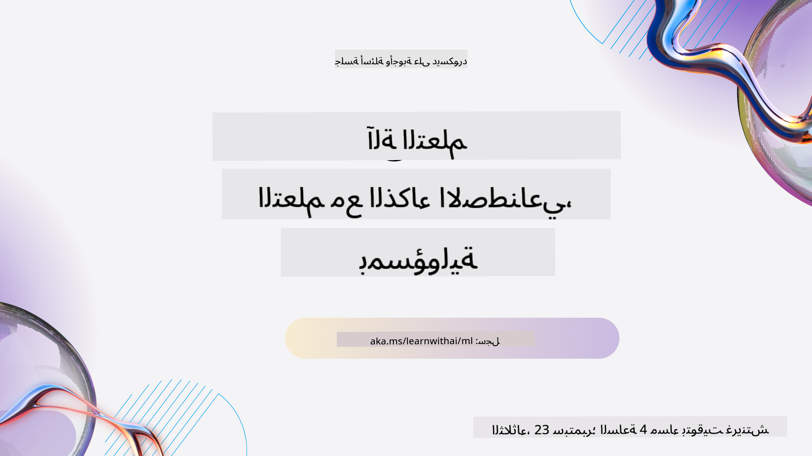
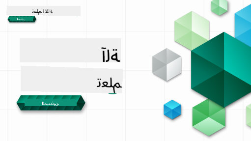

<!--
CO_OP_TRANSLATOR_METADATA:
{
  "original_hash": "7a13afb3674838f557d61f8d67e4d5f8",
  "translation_date": "2025-10-24T08:53:06+00:00",
  "source_file": "README.md",
  "language_code": "ar"
}
-->
  
  
  
  
  

  
  
  

### 🌐 دعم متعدد اللغات  

#### مدعوم عبر GitHub Action (تلقائي ومحدث دائمًا)  

[العربية](./README.md) | [البنغالية](../bn/README.md) | [البلغارية](../bg/README.md) | [البورمية (ميانمار)](../my/README.md) | [الصينية (المبسطة)](../zh/README.md) | [الصينية (التقليدية، هونغ كونغ)](../hk/README.md) | [الصينية (التقليدية، ماكاو)](../mo/README.md) | [الصينية (التقليدية، تايوان)](../tw/README.md) | [الكرواتية](../hr/README.md) | [التشيكية](../cs/README.md) | [الدانماركية](../da/README.md) | [الهولندية](../nl/README.md) | [الإستونية](../et/README.md) | [الفنلندية](../fi/README.md) | [الفرنسية](../fr/README.md) | [الألمانية](../de/README.md) | [اليونانية](../el/README.md) | [العبرية](../he/README.md) | [الهندية](../hi/README.md) | [الهنغارية](../hu/README.md) | [الإندونيسية](../id/README.md) | [الإيطالية](../it/README.md) | [اليابانية](../ja/README.md) | [الكورية](../ko/README.md) | [الليتوانية](../lt/README.md) | [الماليزية](../ms/README.md) | [الماراثية](../mr/README.md) | [النيبالية](../ne/README.md) | [النرويجية](../no/README.md) | [الفارسية](../fa/README.md) | [البولندية](../pl/README.md) | [البرتغالية (البرازيل)](../br/README.md) | [البرتغالية (البرتغال)](../pt/README.md) | [البنجابية (غورموخي)](../pa/README.md) | [الرومانية](../ro/README.md) | [الروسية](../ru/README.md) | [الصربية (السيريلية)](../sr/README.md) | [السلوفاكية](../sk/README.md) | [السلوفينية](../sl/README.md) | [الإسبانية](../es/README.md) | [السواحلية](../sw/README.md) | [السويدية](../sv/README.md) | [التاغالوغية (الفلبينية)](../tl/README.md) | [التاميلية](../ta/README.md) | [التايلاندية](../th/README.md) | [التركية](../tr/README.md) | [الأوكرانية](../uk/README.md) | [الأردية](../ur/README.md) | [الفيتنامية](../vi/README.md)  

#### انضم إلى مجتمعنا  

  

لدينا سلسلة تعلم مع الذكاء الاصطناعي مستمرة على Discord، تعرف على المزيد وانضم إلينا في [سلسلة تعلم مع الذكاء الاصطناعي](https://aka.ms/learnwithai/discord) من 18 - 30 سبتمبر، 2025. ستحصل على نصائح وحيل لاستخدام GitHub Copilot في علم البيانات.  

  

# تعلم الآلة للمبتدئين - منهج دراسي  

> 🌍 سافر حول العالم بينما نستكشف تعلم الآلة من خلال ثقافات العالم 🌍  

يسر دعاة السحابة في Microsoft تقديم منهج دراسي لمدة 12 أسبوعًا يتكون من 26 درسًا حول **تعلم الآلة**. في هذا المنهج، ستتعلم ما يُطلق عليه أحيانًا **تعلم الآلة الكلاسيكي**، باستخدام مكتبة Scikit-learn بشكل أساسي وتجنب التعلم العميق، الذي يتم تغطيته في [منهج الذكاء الاصطناعي للمبتدئين](https://aka.ms/ai4beginners). يمكنك أيضًا دمج هذه الدروس مع [منهج علم البيانات للمبتدئين](https://aka.ms/ds4beginners).  

سافر معنا حول العالم بينما نطبق هذه التقنيات الكلاسيكية على بيانات من مناطق مختلفة من العالم. يتضمن كل درس اختبارات قبل وبعد الدرس، تعليمات مكتوبة لإكمال الدرس، حلول، مهام، والمزيد. تسمح لك منهجيتنا القائمة على المشاريع بالتعلم أثناء البناء، وهي طريقة مثبتة لتثبيت المهارات الجديدة.  

**✍️ شكر جزيل لمؤلفينا** جين لوبر، ستيفن هويل، فرانشيسكا لازيري، تومومي إيمورا، كاسي بريفي، ديمتري سوشنيكوف، كريس نورينغ، أنيربان موكيرجي، أورنيلا ألتونيان، روث ياكوبو، وآمي بويد  

**🎨 شكر أيضًا لرسامينا** تومومي إيمورا، داساني ماديبالي، وجين لوبر  

**🙏 شكر خاص 🙏 لمؤلفي ومراجعي ومساهمي المحتوى من سفراء الطلاب في Microsoft**، وخاصة ريشت داغلي، محمد ساكيب خان إنان، روهان راج، ألكساندرو بيتريسكو، أبيشيك جايسوال، نوارين تاباسم، إيوان سامويلا، وسنيغدا أغاروال  

**🤩 شكر إضافي لسفراء الطلاب في Microsoft إريك وانجاو، جاسلين سوندي، وفيدوشي غوبتا لدروس R الخاصة بنا!**  

# البدء  

اتبع هذه الخطوات:  
1. **قم بعمل Fork للمستودع**: انقر على زر "Fork" في الزاوية العلوية اليمنى من هذه الصفحة.  
2. **انسخ المستودع**: `git clone https://github.com/microsoft/ML-For-Beginners.git`  

> [ابحث عن جميع الموارد الإضافية لهذه الدورة في مجموعة Microsoft Learn الخاصة بنا](https://learn.microsoft.com/en-us/collections/qrqzamz1nn2wx3?WT.mc_id=academic-77952-bethanycheum)  

> 🔧 **تحتاج إلى مساعدة؟** تحقق من [دليل استكشاف الأخطاء وإصلاحها](TROUBLESHOOTING.md) للحصول على حلول للمشاكل الشائعة المتعلقة بالتثبيت، الإعداد، وتشغيل الدروس.  

**[الطلاب](https://aka.ms/student-page)**، لاستخدام هذا المنهج، قم بعمل Fork للمستودع بالكامل إلى حساب GitHub الخاص بك وأكمل التمارين بمفردك أو مع مجموعة:  

- ابدأ باختبار ما قبل المحاضرة.  
- اقرأ المحاضرة وأكمل الأنشطة، توقف وتأمل عند كل نقطة تحقق من المعرفة.  
- حاول إنشاء المشاريع من خلال فهم الدروس بدلاً من تشغيل كود الحل؛ ومع ذلك، يتوفر هذا الكود في مجلدات `/solution` في كل درس قائم على المشروع.  
- قم بإجراء اختبار ما بعد المحاضرة.  
- أكمل التحدي.  
- أكمل المهمة.  
- بعد إكمال مجموعة الدروس، قم بزيارة [لوحة المناقشة](https://github.com/microsoft/ML-For-Beginners/discussions) و"تعلم بصوت عالٍ" من خلال ملء نموذج تقييم التقدم المناسب. يُعتبر "PAT" أداة تقييم تقدم وهي نموذج تقوم بملئه لتعزيز تعلمك. يمكنك أيضًا التفاعل مع نماذج PAT الأخرى حتى نتعلم معًا.  

> لمزيد من الدراسة، نوصي باتباع هذه [وحدات ومسارات التعلم من Microsoft](https://docs.microsoft.com/en-us/users/jenlooper-2911/collections/k7o7tg1gp306q4?WT.mc_id=academic-77952-leestott).  

**المعلمون**، لقد قمنا [بتضمين بعض الاقتراحات](for-teachers.md) حول كيفية استخدام هذا المنهج.  

---

## فيديوهات توضيحية  

بعض الدروس متوفرة كفيديوهات قصيرة. يمكنك العثور على جميع هذه الفيديوهات داخل الدروس، أو على [قائمة تشغيل تعلم الآلة للمبتدئين على قناة Microsoft Developer على YouTube](https://aka.ms/ml-beginners-videos) بالنقر على الصورة أدناه.  

  

---

## تعرف على الفريق  

  

**Gif بواسطة** [موهيت جايسال](https://linkedin.com/in/mohitjaisal)  

> 🎥 انقر على الصورة أعلاه لمشاهدة فيديو عن المشروع والأشخاص الذين أنشأوه!  

---

## منهجية التعليم  

لقد اخترنا مبدأين تعليميين أثناء بناء هذا المنهج: التأكد من أنه عملي **قائم على المشاريع** وأنه يتضمن **اختبارات متكررة**. بالإضافة إلى ذلك، يحتوي هذا المنهج على **موضوع مشترك** يمنحه التماسك.  

من خلال التأكد من أن المحتوى يتماشى مع المشاريع، يصبح العملية أكثر جاذبية للطلاب ويتم تعزيز الاحتفاظ بالمفاهيم. بالإضافة إلى ذلك، يحدد الاختبار منخفض المخاطر قبل الفصل نية الطالب نحو تعلم موضوع معين، بينما يضمن الاختبار الثاني بعد الفصل مزيدًا من الاحتفاظ. تم تصميم هذا المنهج ليكون مرنًا وممتعًا ويمكن أخذه بالكامل أو جزئيًا. تبدأ المشاريع صغيرة وتصبح أكثر تعقيدًا تدريجيًا بحلول نهاية دورة الـ 12 أسبوعًا. يتضمن هذا المنهج أيضًا ملحقًا حول التطبيقات الواقعية لتعلم الآلة، والتي يمكن استخدامها كائتمان إضافي أو كأساس للنقاش.  

> ابحث عن [مدونة قواعد السلوك](CODE_OF_CONDUCT.md)، [المساهمة](CONTRIBUTING.md)، [الترجمة](TRANSLATIONS.md)، و[إرشادات استكشاف الأخطاء وإصلاحها](TROUBLESHOOTING.md). نحن نرحب بملاحظاتكم البناءة!  

## كل درس يتضمن  

- رسم تخطيطي اختياري  
- فيديو تكميلي اختياري  
- فيديو توضيحي (بعض الدروس فقط)  
- [اختبار تمهيدي قبل المحاضرة](https://ff-quizzes.netlify.app/en/ml/)  
- درس مكتوب  
- بالنسبة للدروس القائمة على المشاريع، إرشادات خطوة بخطوة حول كيفية بناء المشروع  
- نقاط تحقق من المعرفة  
- تحدي  
- قراءة إضافية  
- مهمة  
- [اختبار بعد المحاضرة](https://ff-quizzes.netlify.app/en/ml/)  

> **ملاحظة حول اللغات**: هذه الدروس مكتوبة بشكل أساسي بلغة Python، ولكن العديد منها متاح أيضًا بلغة R. لإكمال درس بلغة R، انتقل إلى مجلد `/solution` وابحث عن دروس R. تتضمن امتداد .rmd الذي يمثل ملف **R Markdown** والذي يمكن تعريفه ببساطة كإدراج "كتل كود" (من R أو لغات أخرى) و"رأس YAML" (الذي يوجه كيفية تنسيق المخرجات مثل PDF) في مستند Markdown. وبالتالي، فإنه يعمل كإطار عمل تأليفي مثالي لعلم البيانات لأنه يسمح لك بدمج الكود الخاص بك، نتائجه، وأفكارك من خلال كتابتها في Markdown. علاوة على ذلك، يمكن عرض مستندات R Markdown بتنسيقات إخراج مثل PDF، HTML، أو Word.  

> **ملاحظة حول الاختبارات**: جميع الاختبارات موجودة في [مجلد تطبيق الاختبار](../../quiz-app)، بإجمالي 52 اختبارًا يحتوي كل منها على ثلاثة أسئلة. يتم ربطها من داخل الدروس ولكن يمكن تشغيل تطبيق الاختبار محليًا؛ اتبع التعليمات في مجلد `quiz-app` لاستضافة التطبيق محليًا أو نشره على Azure.  

| رقم الدرس |                             الموضوع                              |                   مجموعة الدروس                   | أهداف التعلم                                                                                                             |                                                              رابط الدرس                                                               |                        المؤلف                        |
| :-----------: | :------------------------------------------------------------: | :-------------------------------------------------: | ------------------------------------------------------------------------------------------------------------------------------- | :--------------------------------------------------------------------------------------------------------------------------------------: | :--------------------------------------------------: |
|      01       |                مقدمة في تعلم الآلة                |      [المقدمة](1-Introduction/README.md)       | تعلم المفاهيم الأساسية وراء تعلم الآلة                                                                                |                                             [الدرس](1-Introduction/1-intro-to-ML/README.md)                                             |                       محمد                       |
|      02       |                تاريخ تعلم الآلة                 |      [المقدمة](1-Introduction/README.md)       | تعلم التاريخ الذي يشكل أساس هذا المجال                                                                                         |                                            [الدرس](1-Introduction/2-history-of-ML/README.md)                                            |                     جين وأيمي                      |
|      03       |                 الإنصاف وتعلم الآلة                  |      [المقدمة](1-Introduction/README.md)       | ما هي القضايا الفلسفية المهمة حول الإنصاف التي يجب أن يأخذها الطلاب في الاعتبار عند بناء وتطبيق نماذج تعلم الآلة؟ |                                              [الدرس](1-Introduction/3-fairness/README.md)                                               |                        تومومي                        |
|      04       |                تقنيات تعلم الآلة                 |      [المقدمة](1-Introduction/README.md)       | ما هي التقنيات التي يستخدمها الباحثون في تعلم الآلة لبناء نماذج تعلم الآلة؟                                                                       |                                          [الدرس](1-Introduction/4-techniques-of-ML/README.md)                                           |                    كريس وجين                     |
|      05       |                   مقدمة في الانحدار                   |        [الانحدار](2-Regression/README.md)         | البدء باستخدام Python و Scikit-learn لنماذج الانحدار                                                                  |         [Python](2-Regression/1-Tools/README.md) • [R](../../2-Regression/1-Tools/solution/R/lesson_1.html)         |      جين • إريك وانجاو       |
|      06       |                أسعار القرع في أمريكا الشمالية 🎃                |        [الانحدار](2-Regression/README.md)         | تصور وتنظيف البيانات استعدادًا لتعلم الآلة                                                                                  |          [Python](2-Regression/2-Data/README.md) • [R](../../2-Regression/2-Data/solution/R/lesson_2.html)          |      جين • إريك وانجاو       |
|      07       |                أسعار القرع في أمريكا الشمالية 🎃                |        [الانحدار](2-Regression/README.md)         | بناء نماذج الانحدار الخطي والمتعدد                                                                                   |        [Python](2-Regression/3-Linear/README.md) • [R](../../2-Regression/3-Linear/solution/R/lesson_3.html)        |      جين وديمتري • إريك وانجاو       |
|      08       |                أسعار القرع في أمريكا الشمالية 🎃                |        [الانحدار](2-Regression/README.md)         | بناء نموذج الانحدار اللوجستي                                                                                               |     [Python](2-Regression/4-Logistic/README.md) • [R](../../2-Regression/4-Logistic/solution/R/lesson_4.html)      |      جين • إريك وانجاو       |
|      09       |                          تطبيق ويب 🔌                          |           [تطبيق ويب](3-Web-App/README.md)            | بناء تطبيق ويب لاستخدام النموذج المدرب                                                                                       |                                                 [Python](3-Web-App/1-Web-App/README.md)                                                  |                         جين                          |
|      10       |                 مقدمة في التصنيف                 |    [التصنيف](4-Classification/README.md)     | تنظيف وتحضير وتصور البيانات؛ مقدمة في التصنيف                                                            | [Python](4-Classification/1-Introduction/README.md) • [R](../../4-Classification/1-Introduction/solution/R/lesson_10.html)  | جين وكاسي • إريك وانجاو |
|      11       |             المأكولات الآسيوية والهندية اللذيذة 🍜             |    [التصنيف](4-Classification/README.md)     | مقدمة في المصنفات                                                                                                     | [Python](4-Classification/2-Classifiers-1/README.md) • [R](../../4-Classification/2-Classifiers-1/solution/R/lesson_11.html) | جين وكاسي • إريك وانجاو |
|      12       |             المأكولات الآسيوية والهندية اللذيذة 🍜             |    [التصنيف](4-Classification/README.md)     | المزيد من المصنفات                                                                                                                | [Python](4-Classification/3-Classifiers-2/README.md) • [R](../../4-Classification/3-Classifiers-2/solution/R/lesson_12.html) | جين وكاسي • إريك وانجاو |
|      13       |             المأكولات الآسيوية والهندية اللذيذة 🍜             |    [التصنيف](4-Classification/README.md)     | بناء تطبيق ويب للتوصيات باستخدام النموذج الخاص بك                                                                                    |                                              [Python](4-Classification/4-Applied/README.md)                                              |                         جين                          |
|      14       |                   مقدمة في التجميع                   |        [التجميع](5-Clustering/README.md)         | تنظيف وتحضير وتصور البيانات؛ مقدمة في التجميع                                                                |         [Python](5-Clustering/1-Visualize/README.md) • [R](../../5-Clustering/1-Visualize/solution/R/lesson_14.html)         |      جين • إريك وانجاو       |
|      15       |              استكشاف الأذواق الموسيقية النيجيرية 🎧              |        [التجميع](5-Clustering/README.md)         | استكشاف طريقة التجميع باستخدام K-Means                                                                                           |           [Python](5-Clustering/2-K-Means/README.md) • [R](../../5-Clustering/2-K-Means/solution/R/lesson_15.html)           |      جين • إريك وانجاو       |
|      16       |        مقدمة في معالجة اللغة الطبيعية ☕️         |   [معالجة اللغة الطبيعية](6-NLP/README.md)    | تعلم الأساسيات حول معالجة اللغة الطبيعية من خلال بناء بوت بسيط                                                                             |                                             [Python](6-NLP/1-Introduction-to-NLP/README.md)                                              |                       ستيفن                        |
|      17       |                      مهام معالجة اللغة الطبيعية الشائعة ☕️                      |   [معالجة اللغة الطبيعية](6-NLP/README.md)    | تعميق المعرفة بمعالجة اللغة الطبيعية من خلال فهم المهام الشائعة المطلوبة عند التعامل مع هياكل اللغة                          |                                                    [Python](6-NLP/2-Tasks/README.md)                                                     |                       ستيفن                        |
|      18       |             الترجمة وتحليل المشاعر ♥️              |   [معالجة اللغة الطبيعية](6-NLP/README.md)    | الترجمة وتحليل المشاعر مع جين أوستن                                                                             |                                            [Python](6-NLP/3-Translation-Sentiment/README.md)                                             |                       ستيفن                        |
|      19       |                  الفنادق الرومانسية في أوروبا ♥️                  |   [معالجة اللغة الطبيعية](6-NLP/README.md)    | تحليل المشاعر مع مراجعات الفنادق 1                                                                                         |                                               [Python](6-NLP/4-Hotel-Reviews-1/README.md)                                                |                       ستيفن                        |
|      20       |                  الفنادق الرومانسية في أوروبا ♥️                  |   [معالجة اللغة الطبيعية](6-NLP/README.md)    | تحليل المشاعر مع مراجعات الفنادق 2                                                                                         |                                               [Python](6-NLP/5-Hotel-Reviews-2/README.md)                                                |                       ستيفن                        |
|      21       |            مقدمة في التنبؤ بالسلاسل الزمنية             |        [السلاسل الزمنية](7-TimeSeries/README.md)        | مقدمة في التنبؤ بالسلاسل الزمنية                                                                                         |                                             [Python](7-TimeSeries/1-Introduction/README.md)                                              |                      فرانشيسكا                       |
|      22       | ⚡️ استخدام الطاقة العالمي ⚡️ - التنبؤ بالسلاسل الزمنية باستخدام ARIMA |        [السلاسل الزمنية](7-TimeSeries/README.md)        | التنبؤ بالسلاسل الزمنية باستخدام ARIMA                                                                                              |                                                 [Python](7-TimeSeries/2-ARIMA/README.md)                                                 |                      فرانشيسكا                       |
|      23       |  ⚡️ استخدام الطاقة العالمي ⚡️ - التنبؤ بالسلاسل الزمنية باستخدام SVR  |        [السلاسل الزمنية](7-TimeSeries/README.md)        | التنبؤ بالسلاسل الزمنية باستخدام Support Vector Regressor                                                                           |                                                  [Python](7-TimeSeries/3-SVR/README.md)                                                  |                       أنيربان                        |
|      24       |             مقدمة في التعلم المعزز             | [التعلم المعزز](8-Reinforcement/README.md) | مقدمة في التعلم المعزز باستخدام Q-Learning                                                                          |                                             [Python](8-Reinforcement/1-QLearning/README.md)                                              |                        ديمتري                        |
|      25       |                 مساعدة بيتر لتجنب الذئب! 🐺                  | [التعلم المعزز](8-Reinforcement/README.md) | صالة التعلم المعزز                                                                                                      |                                                [Python](8-Reinforcement/2-Gym/README.md)                                                 |                        ديمتري                        |
|  خاتمة   |            سيناريوهات وتطبيقات تعلم الآلة في العالم الحقيقي            |      [تعلم الآلة في العالم الحقيقي](9-Real-World/README.md)       | تطبيقات مثيرة وكاشفة لتعلم الآلة الكلاسيكي                                                               |                                             [الدرس](9-Real-World/1-Applications/README.md)                                              |                         الفريق                         |
|  خاتمة   |            تصحيح نماذج تعلم الآلة باستخدام لوحة تحكم الذكاء الاصطناعي المسؤول          |      [تعلم الآلة في العالم الحقيقي](9-Real-World/README.md)       | تصحيح نماذج تعلم الآلة باستخدام مكونات لوحة تحكم الذكاء الاصطناعي المسؤول                                                              |                                             [الدرس](9-Real-World/2-Debugging-ML-Models/README.md)                                              |                         روث ياكوبو                       |

> [ابحث عن جميع الموارد الإضافية لهذه الدورة في مجموعة Microsoft Learn الخاصة بنا](https://learn.microsoft.com/en-us/collections/qrqzamz1nn2wx3?WT.mc_id=academic-77952-bethanycheum)

## الوصول دون اتصال

يمكنك تشغيل هذا التوثيق دون اتصال باستخدام [Docsify](https://docsify.js.org/#/). قم بنسخ هذا المستودع، [تثبيت Docsify](https://docsify.js.org/#/quickstart) على جهازك المحلي، ثم في المجلد الجذري لهذا المستودع، اكتب `docsify serve`. سيتم تشغيل الموقع على المنفذ 3000 على localhost الخاص بك: `localhost:3000`.

## ملفات PDF

ابحث عن ملف PDF للمناهج مع الروابط [هنا](https://microsoft.github.io/ML-For-Beginners/pdf/readme.pdf).

## 🎒 دورات أخرى 

فريقنا ينتج دورات أخرى! تحقق من:

### Azure / Edge / MCP / Agents

---
 
### سلسلة الذكاء الاصطناعي التوليدي

[-9333EA?style=for-the-badge&labelColor=E5E7EB&color=9333EA)](https://github.com/microsoft/Generative-AI-for-beginners-dotnet?WT.mc_id=academic-105485-koreyst)
[-C084FC?style=for-the-badge&labelColor=E5E7EB&color=C084FC)](https://github.com/microsoft/generative-ai-for-beginners-java?WT.mc_id=academic-105485-koreyst)
[-E879F9?style=for-the-badge&labelColor=E5E7EB&color=E879F9)](https://github.com/microsoft/generative-ai-with-javascript?WT.mc_id=academic-105485-koreyst)

---
 
### التعلم الأساسي
  
  
  
  
  
  
  

---

### سلسلة Copilot  
  
  
  

## الحصول على المساعدة  

إذا واجهت صعوبة أو كانت لديك أسئلة حول بناء تطبيقات الذكاء الاصطناعي، انضم إلى:  

  

إذا كان لديك ملاحظات حول المنتج أو واجهت أخطاء أثناء البناء، قم بزيارة:  

  

---

**إخلاء المسؤولية**:  
تم ترجمة هذا المستند باستخدام خدمة الترجمة بالذكاء الاصطناعي [Co-op Translator](https://github.com/Azure/co-op-translator). بينما نسعى لتحقيق الدقة، يرجى العلم أن الترجمات الآلية قد تحتوي على أخطاء أو عدم دقة. يجب اعتبار المستند الأصلي بلغته الأصلية المصدر الرسمي. للحصول على معلومات حاسمة، يُوصى بالترجمة البشرية الاحترافية. نحن غير مسؤولين عن أي سوء فهم أو تفسيرات خاطئة تنشأ عن استخدام هذه الترجمة.