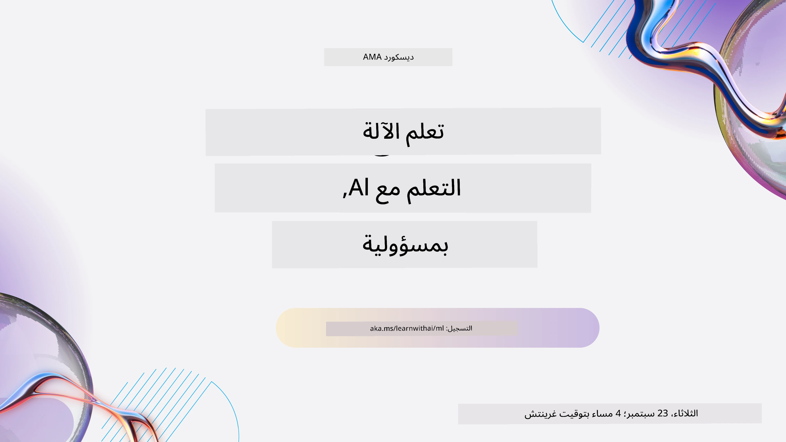
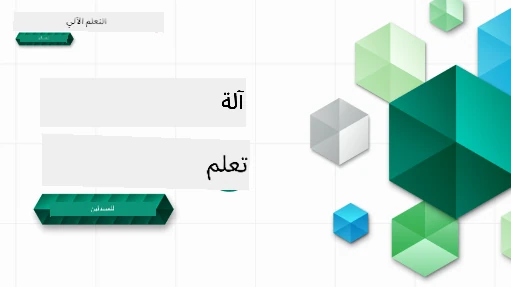

[](https://github.com/microsoft/ML-For-Beginners/blob/master/LICENSE)
[](https://GitHub.com/microsoft/ML-For-Beginners/graphs/contributors/)
[](https://GitHub.com/microsoft/ML-For-Beginners/issues/)
[](https://GitHub.com/microsoft/ML-For-Beginners/pulls/)
[](http://makeapullrequest.com)

[](https://GitHub.com/microsoft/ML-For-Beginners/watchers/)
[](https://GitHub.com/microsoft/ML-For-Beginners/network/)
[](https://GitHub.com/microsoft/ML-For-Beginners/stargazers/)

### 🌐 دعم متعدد اللغات

#### مدعوم عبر إجراء GitHub (آلي ودائم التحديث)

<!-- CO-OP TRANSLATOR LANGUAGES TABLE START -->
[العربية](./README.md) | [البنغالية](../bn/README.md) | [البلغارية](../bg/README.md) | [البرمية (ميانمار)](../my/README.md) | [الصينية المبسطة](../zh-CN/README.md) | [الصينية التقليدية (هونغ كونغ)](../zh-HK/README.md) | [الصينية التقليدية (ماكاو)](../zh-MO/README.md) | [الصينية التقليدية (تايوان)](../zh-TW/README.md) | [الكرواتية](../hr/README.md) | [التشيكية](../cs/README.md) | [الدانمركية](../da/README.md) | [الهولندية](../nl/README.md) | [الإستونية](../et/README.md) | [الفنلندية](../fi/README.md) | [الفرنسية](../fr/README.md) | [الألمانية](../de/README.md) | [اليونانية](../el/README.md) | [العبرية](../he/README.md) | [الهندية](../hi/README.md) | [الهنغارية](../hu/README.md) | [الإندونيسية](../id/README.md) | [الإيطالية](../it/README.md) | [اليابانية](../ja/README.md) | [الكنادية](../kn/README.md) | [الخميرية](../km/README.md) | [الكورية](../ko/README.md) | [اللتوانية](../lt/README.md) | [الماليزية](../ms/README.md) | [المالايالامية](../ml/README.md) | [الماراثية](../mr/README.md) | [النيبالية](../ne/README.md) | [النيجيرية بيدجين](../pcm/README.md) | [النرويجية](../no/README.md) | [الفارسية (اللغة الفارسية)](../fa/README.md) | [البولندية](../pl/README.md) | [البرتغالية (البرازيل)](../pt-BR/README.md) | [البرتغالية (البرتغال)](../pt-PT/README.md) | [البنجابية (الغورموخي)](../pa/README.md) | [الرومانية](../ro/README.md) | [الروسية](../ru/README.md) | [الصربية (السيريلية)](../sr/README.md) | [السلوفاكية](../sk/README.md) | [السلوفينية](../sl/README.md) | [الإسبانية](../es/README.md) | [السواحيلية](../sw/README.md) | [السويدية](../sv/README.md) | [التاغالوغية (الفلبينية)](../tl/README.md) | [التاميلية](../ta/README.md) | [التيلوجو](../te/README.md) | [التايلاندية](../th/README.md) | [التركية](../tr/README.md) | [الأوكرانية](../uk/README.md) | [الأردية](../ur/README.md) | [الفيتنامية](../vi/README.md)

> **تفضل الاستنساخ محليًا؟**
>
> يحتوي هذا المستودع على أكثر من 50 ترجمة للغات مما يزيد بشكل كبير من حجم التنزيل. للاستنساخ بدون الترجمات، استخدم خاصية التحقق المتقطع:
>
> **باش / ماك أو إس / لينكس:**
> ```bash
> git clone --filter=blob:none --sparse https://github.com/microsoft/ML-For-Beginners.git
> cd ML-For-Beginners
> git sparse-checkout set --no-cone '/*' '!translations' '!translated_images'
> ```
>
> **CMD (ويندوز):**
> ```cmd
> git clone --filter=blob:none --sparse https://github.com/microsoft/ML-For-Beginners.git
> cd ML-For-Beginners
> git sparse-checkout set --no-cone "/*" "!translations" "!translated_images"
> ```
>
> هذا يمنحك كل ما تحتاجه لإكمال الدورة مع تنزيل أسرع بكثير.
<!-- CO-OP TRANSLATOR LANGUAGES TABLE END -->

#### انضم إلى مجتمعنا

[](https://discord.gg/nTYy5BXMWG)

لدينا سلسلة تعلم على ديسكورد مع الذكاء الاصطناعي مستمرة، تعرّف على المزيد وانضم إلينا في [سلسلة التعلم مع الذكاء الاصطناعي](https://aka.ms/learnwithai/discord) من 18 إلى 30 سبتمبر 2025. ستحصل على نصائح وحيل لاستخدام GitHub Copilot لعلم البيانات.



# تعلم الآلة للمبتدئين - منهج دراسي

> 🌍 سافر حول العالم بينما نستكشف تعلم الآلة من خلال ثقافات العالم 🌍

يسر فريق مدافعي السحابة في مايكروسوفت أن يقدم منهجًا مدته 12 أسبوعًا، و26 درسًا يدور حول **تعلم الآلة**. في هذا المنهج، ستتعلم ما يُسمى أحيانًا **تعلم الآلة الكلاسيكي**، باستخدام مكتبة Scikit-learn بشكل أساسي وتجنب التعلم العميق، الذي يُغطي في منهج [الذكاء الاصطناعي للمبتدئين](https://aka.ms/ai4beginners). اجمع هذا المنهج مع منهج ['علم البيانات للمبتدئين'](https://aka.ms/ds4beginners) أيضًا!

سافر معنا حول العالم بينما نطبق هذه التقنيات الكلاسيكية على بيانات من مناطق عديدة في العالم. يحتوي كل درس على اختبارات قبل وبعد الدرس، تعليمات مكتوبة لإكمال الدرس، حلاً، مهمة، وأكثر. تتيح منهجية مشاريعنا التعليمية لك التعلم أثناء البناء، وهي طريقة مثبتة لجعل المهارات الجديدة 'تثبت'.

**✍️ شكر حار لمؤلفينا** جين لوبر، ستيفن هاول، فرانسيسكا لازيري، تومومي إيمورا، كاسي بريفي، دميتري سوشنيكوف، كريس نورينج، أنيربان موخرجي، أورنيلا ألتونيان، روث ياكوبو و إيمي بويد

**🎨 شكر أيضًا لفنانينا** تومومي إيمورا، دوساني ماديبالي، وجين لوبر

**🙏 شكر خاص 🙏 لمؤلفي، مراجعي، ومساهمي المحتوى من سفراء طلاب مايكروسوفت**، وبالأخص ريشيت داجلي، محمد سكيب خان إينان، روهان راج، ألكسندرو بترسكو، أبهيشيك جايسوال، نوورين تاباسوم، إيون سامويلا، وسنيغدا أغاروال

**🤩 شكر إضافي لسفراء طلاب مايكروسوفت إيريك وانجاو، جاسلين سوندي، وفيدوشي جوبتا لدروس R الخاصة بنا!**

# بدء الاستخدام

اتبع هذه الخطوات:
1. **افتح المستودع Fork**: انقر على زر "Fork" في الزاوية العلوية اليمنى من هذه الصفحة.
2. **استنسخ المستودع Clone**:   `git clone https://github.com/microsoft/ML-For-Beginners.git`

> 💡 **نصيحة بداية سريعة:** هل تريد البدء في المتصفح بدون إعداد بايثون محليًا؟ استخدم [مساحات أكواد GitHub](https://github.com/features/codespaces) لإنشاء بيئة تطوير سحابية لفوركك. افتح قائمة **Code** الخضراء، اختر **Codespaces**، وأنشئ مساحة أكواد؛ قم بتثبيت تبعيات كل درس حسب الحاجة داخلها.

> [اعثر على جميع الموارد الإضافية لهذه الدورة في مجموعتنا في Microsoft Learn](https://learn.microsoft.com/en-us/collections/qrqzamz1nn2wx3?WT.mc_id=academic-77952-bethanycheum)

> 🔧 **هل تحتاج مساعدة؟** تحقق من [دليل استكشاف الأخطاء وإصلاحها](TROUBLESHOOTING.md) للحلول المتعلقة بمشكلات التثبيت، الإعداد، وتشغيل الدروس.


**[الطلاب](https://aka.ms/student-page)**، لاستخدام هذا المنهج، قم بفورك المستودع بالكامل إلى حساب GitHub الخاص بك وأكمل التمارين بنفسك أو مع مجموعة:

- ابدأ باختبار تمهيدي قبل المحاضرة.
- اقرأ المحاضرة وأكمل الأنشطة، توقف وفكر عند كل اختبار معرفة.
- حاول إنشاء المشاريع بفهم الدروس بدلاً من تشغيل كود الحل مباشرةً؛ ولكن الكود متوفر في مجلدات `/solution` في كل درس موجه للمشروع.
- خذ اختبار ما بعد المحاضرة.
- أكمل التحدي.
- أكمل المهمة.
- بعد إكمال مجموعة دروس، زر [لوحة النقاش](https://github.com/microsoft/ML-For-Beginners/discussions) و"تعلّم جهرًا" من خلال ملء تقييم PAT المناسب. 'PAT' هو أداة تقييم تقدم تملأها لتطوير تعلمك. يمكنك أيضًا الرد على تقييمات PAT الأخرى لنتعلم معًا.

> للدراسة المتقدمة، نوصي باتباع هذه وحدات ومسارات التعلم في [Microsoft Learn](https://docs.microsoft.com/en-us/users/jenlooper-2911/collections/k7o7tg1gp306q4?WT.mc_id=academic-77952-leestott).

**المعلمون**، قمنا [بإدراج بعض الاقتراحات](for-teachers.md) حول كيفية استخدام هذا المنهج.

---

## شروحات فيديو

بعض الدروس متاحة كفيديوهات قصيرة. يمكنك العثور على كل هذه داخل الدروس، أو في [قائمة تشغيل ML للمبتدئين على قناة Microsoft Developer على YouTube](https://aka.ms/ml-beginners-videos) بالنقر على الصورة أدناه.

[](https://aka.ms/ml-beginners-videos)

---

## تعرّف على الفريق

[](https://youtu.be/Tj1XWrDSYJU)

**صورة متحركة بواسطة** [Mohit Jaisal](https://linkedin.com/in/mohitjaisal)

> 🎥 انقر على الصورة أعلاه لمشاهدة فيديو عن المشروع والأشخاص الذين أنشأوه!

---

## المنهجية التعليمية

اخترنا مبدأين تربويين أثناء بناء هذا المنهج: التأكد من أنه **مبني على المشاريع العملية** وأنه يتضمن **اختبارات متكررة**. بالإضافة إلى ذلك، يحتوي المنهج على **موضوع** مشترك ليمنحه ترابطًا.

من خلال ضمان أن المحتوى يتوافق مع المشاريع، يصبح العملية أكثر جاذبية للطلاب ويتم تعزيز استيعاب المفاهيم. بالإضافة إلى ذلك، يضع اختبار بسيط قبل الدرس نية الطالب للتعلم، بينما يضمن الاختبار الثاني بعد الدرس حفظًا إضافيًا. تم تصميم هذا المنهج ليكون مرنًا وممتعًا ويمكن أخذه ككل أو جزئيًا. تبدأ المشاريع صغيرة وتزداد تعقيدًا بنهاية دورة الـ 12 أسبوعًا. يتضمن المنهج أيضًا ملحقًا حول تطبيقات تعلم الآلة في العالم الحقيقي، والذي يمكن استخدامه كاعتمادات إضافية أو كأساس للنقاش.

> اطلع على [مدونة السلوك](CODE_OF_CONDUCT.md)، [كيفية المساهمة](CONTRIBUTING.md)، [الترجمات](..)، و[استكشاف الأعطال](TROUBLESHOOTING.md). نرحب بملاحظاتكم البناءة!

## يتضمن كل درس

- ملاحظات تخطيطية اختيارية
- فيديو إضافي اختياري
- شرح فيديو (لبعض الدروس فقط)
- [اختبار إحماء قبل المحاضرة](https://ff-quizzes.netlify.app/en/ml/)
- درس مكتوب
- للدروس المعتمدة على المشاريع، إرشادات خطوة بخطوة لبناء المشروع
- اختبارات معرفة
- تحدي
- قراءات إضافية
- مهمة
- [اختبار ما بعد المحاضرة](https://ff-quizzes.netlify.app/en/ml/)

> **ملاحظة عن اللغات**: هذه الدروس مكتوبة أساسًا بلغة بايثون، لكن العديد منها متاح أيضًا بلغة R. لإكمال درس R، انتقل إلى مجلد `/solution` وابحث عن دروس R. تحتوي على امتداد .rmd الذي يمثل ملف **R Markdown** والذي يمكن تعريفه ببساطة بأنه تضمين لـ`كتل كود` (من R أو لغات أخرى) و`رأس برنامج YAML` (الذي يوجه كيفية تنسيق المخرجات مثل PDF) في وثيقة `Markdown`. وبذلك، يعمل كإطار تأليف نموذجي لعلم البيانات لأنه يسمح لك بدمج الكود الخاص بك، مخرجاته، وأفكارك من خلال السماح لك بكتابتها في Markdown. علاوة على ذلك، يمكن تحويل وثائق R Markdown إلى صيغ إخراج مثل PDF، HTML، أو Word.

> **ملاحظة عن الاختبارات**: جميع الاختبارات موجودة في [مجلد تطبيق الاختبارات](../../quiz-app)، بإجمالي 52 اختبارًا يحتوي كل منها على ثلاثة أسئلة. ترتبط من داخل الدروس ولكن يمكن تشغيل تطبيق الاختبارات محلياً؛ اتبع التعليمات في مجلد `quiz-app` لاستضافته محليًا أو نشره على Azure.

| رقم الدرس |                             الموضوع                              |                   تجميع الدرس                   | الأهداف التعليمية                                                                                                             |                                                              الدرس المرتبط                                                               |                        المؤلف                        |
| :-----------: | :------------------------------------------------------------: | :-------------------------------------------------: | ------------------------------------------------------------------------------------------------------------------------------- | :--------------------------------------------------------------------------------------------------------------------------------------: | :--------------------------------------------------: |
|      01       |                مقدمة في تعلم الآلة                |      [مقدمة](1-Introduction/README.md)       | تعرّف على المفاهيم الأساسية وراء تعلم الآلة                                                                                |                                             [درس](1-Introduction/1-intro-to-ML/README.md)                                             |                       محمد                       |
|      02       |                تاريخ تعلم الآلة                 |      [مقدمة](1-Introduction/README.md)       | تعرّف على التاريخ الكامن وراء هذا المجال                                                                                         |                                            [درس](1-Introduction/2-history-of-ML/README.md)                                            |                     جين وآمي                      |
|      03       |                 العدالة وتعلم الآلة                  |      [مقدمة](1-Introduction/README.md)       | ما هي القضايا الفلسفية الهامة المتعلقة بالعدالة التي يجب على الطلاب أخذها بعين الاعتبار عند بناء وتطبيق نماذج التعلم الآلي؟ |                                              [درس](1-Introduction/3-fairness/README.md)                                               |                        تومومي                        |
|      04       |                تقنيات تعلم الآلة                 |      [مقدمة](1-Introduction/README.md)       | ما هي التقنيات التي يستخدمها باحثو التعلم الآلي لبناء نماذج التعلم؟                                                                       |                                          [درس](1-Introduction/4-techniques-of-ML/README.md)                                           |                    كريس وجين                     |
|      05       |                   مقدمة في الانحدار                   |        [الانحدار](2-Regression/README.md)         | ابدأ باستخدام بايثون وScikit-learn لنماذج الانحدار                                                                  |         [بايثون](2-Regression/1-Tools/README.md) • [R](../../2-Regression/1-Tools/solution/R/lesson_1.html)         |      جين • إريك وانجوا       |
|      06       |                أسعار القرع في أمريكا الشمالية 🎃                |        [الانحدار](2-Regression/README.md)         | تصوّر ونظّف البيانات تحضيرًا للتعلم الآلي                                                                                  |          [بايثون](2-Regression/2-Data/README.md) • [R](../../2-Regression/2-Data/solution/R/lesson_2.html)          |      جين • إريك وانجوا       |
|      07       |                أسعار القرع في أمريكا الشمالية 🎃                |        [الانحدار](2-Regression/README.md)         | بناء نماذج الانحدار الخطي والتربيعي                                                                                   |        [بايثون](2-Regression/3-Linear/README.md) • [R](../../2-Regression/3-Linear/solution/R/lesson_3.html)        |      جين ودمتري • إريك وانجوا       |
|      08       |                أسعار القرع في أمريكا الشمالية 🎃                |        [الانحدار](2-Regression/README.md)         | بناء نموذج الانحدار اللوجستي                                                                                               |     [بايثون](2-Regression/4-Logistic/README.md) • [R](../../2-Regression/4-Logistic/solution/R/lesson_4.html)      |      جين • إريك وانجوا       |
|      09       |                          تطبيق ويب 🔌                          |           [تطبيق ويب](3-Web-App/README.md)            | بناء تطبيق ويب لاستخدام نموذجك المدرب                                                                                       |                                                 [بايثون](3-Web-App/1-Web-App/README.md)                                                  |                         جين                          |
|      10       |                 مقدمة في التصنيف                 |    [تصنيف](4-Classification/README.md)     | نظّف، جهّز، وتصوّر بياناتك؛ مقدمة في التصنيف                                                            | [بايثون](4-Classification/1-Introduction/README.md) • [R](../../4-Classification/1-Introduction/solution/R/lesson_10.html)  | جين وكاسي • إريك وانجوا |
|      11       |             مأكولات آسيوية وهندية لذيذة 🍜             |    [تصنيف](4-Classification/README.md)     | مقدمة عن المصنفات                                                                                                     | [بايثون](4-Classification/2-Classifiers-1/README.md) • [R](../../4-Classification/2-Classifiers-1/solution/R/lesson_11.html) | جين وكاسي • إريك وانجوا |
|      12       |             مأكولات آسيوية وهندية لذيذة 🍜             |    [تصنيف](4-Classification/README.md)     | المزيد من المصنفات                                                                                                                | [بايثون](4-Classification/3-Classifiers-2/README.md) • [R](../../4-Classification/3-Classifiers-2/solution/R/lesson_12.html) | جين وكاسي • إريك وانجوا |
|      13       |             مأكولات آسيوية وهندية لذيذة 🍜             |    [تصنيف](4-Classification/README.md)     | بناء تطبيق ويب توصية باستخدام نموذجك                                                                                    |                                              [بايثون](4-Classification/4-Applied/README.md)                                              |                         جين                          |
|      14       |                   مقدمة في التجميع                   |        [تجميع](5-Clustering/README.md)         | نظّف، جهّز، وتصوّر بياناتك؛ مقدمة في التجميع                                                                |         [بايثون](5-Clustering/1-Visualize/README.md) • [R](../../5-Clustering/1-Visualize/solution/R/lesson_14.html)         |      جين • إريك وانجوا       |
|      15       |              استكشاف الأذواق الموسيقية النيجيرية 🎧              |        [تجميع](5-Clustering/README.md)         | استكشف طريقة التجميع K-Means                                                                                           |           [بايثون](5-Clustering/2-K-Means/README.md) • [R](../../5-Clustering/2-K-Means/solution/R/lesson_15.html)           |      جين • إريك وانجوا       |
|      16       |        مقدمة في معالجة اللغة الطبيعية ☕️         |   [معالجة اللغة الطبيعية](6-NLP/README.md)    | تعلّم الأساسيات عن معالجة اللغة ببناء بوت بسيط                                                                             |                                             [بايثون](6-NLP/1-Introduction-to-NLP/README.md)                                              |                       ستيفن                        |
|      17       |                      المهام الشائعة في معالجة اللغة الطبيعية ☕️                      |   [معالجة اللغة الطبيعية](6-NLP/README.md)    | تعمّق في معرفتك بمعالجة اللغة الطبيعية وفهم المهام الشائعة المطلوبة عند التعامل مع تراكيب اللغة                          |                                                    [بايثون](6-NLP/2-Tasks/README.md)                                                     |                       ستيفن                        |
|      18       |             الترجمة وتحليل المشاعر ♥️              |   [معالجة اللغة الطبيعية](6-NLP/README.md)    | الترجمة وتحليل المشاعر مع جاين أوستن                                                                             |                                            [بايثون](6-NLP/3-Translation-Sentiment/README.md)                                             |                       ستيفن                        |
|      19       |                  فنادق رومانسية في أوروبا ♥️                  |   [معالجة اللغة الطبيعية](6-NLP/README.md)    | تحليل المشاعر مع مراجعات الفنادق 1                                                                                         |                                               [بايثون](6-NLP/4-Hotel-Reviews-1/README.md)                                                |                       ستيفن                        |
|      20       |                  فنادق رومانسية في أوروبا ♥️                  |   [معالجة اللغة الطبيعية](6-NLP/README.md)    | تحليل المشاعر مع مراجعات الفنادق 2                                                                                         |                                               [بايثون](6-NLP/5-Hotel-Reviews-2/README.md)                                                |                       ستيفن                        |
|      21       |            مقدمة في التنبؤ بالسلاسل الزمنية             |        [السلاسل الزمنية](7-TimeSeries/README.md)        | مقدمة في التنبؤ بالسلاسل الزمنية                                                                                         |                                             [بايثون](7-TimeSeries/1-Introduction/README.md)                                              |                      فرانسيسكا                       |
|      22       | ⚡️ استهلاك الطاقة العالمي ⚡️ - التنبؤ بالسلاسل الزمنية باستخدام ARIMA |        [السلاسل الزمنية](7-TimeSeries/README.md)        | التنبؤ بالسلاسل الزمنية باستخدام ARIMA                                                                                              |                                                 [بايثون](7-TimeSeries/2-ARIMA/README.md)                                                 |                      فرانسيسكا                       |
|      23       |  ⚡️ استهلاك الطاقة العالمي ⚡️ - التنبؤ بالسلاسل الزمنية باستخدام SVR  |        [السلاسل الزمنية](7-TimeSeries/README.md)        | التنبؤ بالسلاسل الزمنية باستخدام الانحدار بدعم المتجهات                                                                           |                                                  [بايثون](7-TimeSeries/3-SVR/README.md)                                                  |                       أنيربان                        |
|      24       |             مقدمة في التعلم التعزيزي             | [التعلم التعزيزي](8-Reinforcement/README.md) | مقدمة في التعلم التعزيزي باستخدام تعلم Q                                                                          |                                             [بايثون](8-Reinforcement/1-QLearning/README.md)                                              |                        دمتري                        |
|      25       |                 ساعد بيتر على تجنب الذئب! 🐺                  | [التعلم التعزيزي](8-Reinforcement/README.md) | صالة التعلم التعزيزي                                                                                                      |                                                [بايثون](8-Reinforcement/2-Gym/README.md)                                                 |                        دمتري                        |
|  خاتمة   |            سيناريوهات وتطبيقات التعلم الآلي في العالم الحقيقي            |      [ML في الحياة الحقيقية](9-Real-World/README.md)       | تطبيقات حقيقية مثيرة ومكشوفة للتعلم الآلي الكلاسيكي                                                               |                                             [درس](9-Real-World/1-Applications/README.md)                                              |                         الفريق                         |
|  خاتمة   |            تصحيح النماذج في التعلم الآلي باستخدام لوحة RAI            |      [ML في الحياة الحقيقية](9-Real-World/README.md)       | تصحيح النماذج في التعلم الآلي باستخدام مكونات لوحة AI المسؤولة                                                              |                                             [درس](9-Real-World/2-Debugging-ML-Models/README.md)                                              |                     روث ياكوبو                      |

> [اعثر على جميع الموارد الإضافية لهذا الدورة في مجموعة Microsoft Learn الخاصة بنا](https://learn.microsoft.com/en-us/collections/qrqzamz1nn2wx3?WT.mc_id=academic-77952-bethanycheum)

## الوصول دون اتصال

يمكنك تشغيل هذا التوثيق دون اتصال باستخدام [Docsify](https://docsify.js.org/#/). قم بعمل نسخة من هذا المستودع، [ثبت Docsify](https://docsify.js.org/#/quickstart) على جهازك المحلي، ثم في المجلد الجذري لهذا المستودع، اكتب `docsify serve`. سيتم تقديم الموقع على المنفذ 3000 على جهازك المحلي: `localhost:3000`.

## ملفات PDF

تجد ملف pdf للمقرر الدراسي مع الروابط [هنا](https://microsoft.github.io/ML-For-Beginners/pdf/readme.pdf).


## 🎒 دورات أخرى

فريقنا ينتج دورات أخرى! تفقد:

<!-- CO-OP TRANSLATOR OTHER COURSES START -->
### LangChain
[](https://aka.ms/langchain4j-for-beginners)
[](https://aka.ms/langchainjs-for-beginners?WT.mc_id=m365-94501-dwahlin)
[](https://github.com/microsoft/langchain-for-beginners?WT.mc_id=m365-94501-dwahlin)
---

### Azure / Edge / MCP / Agents
[](https://github.com/microsoft/AZD-for-beginners?WT.mc_id=academic-105485-koreyst)
[](https://github.com/microsoft/edgeai-for-beginners?WT.mc_id=academic-105485-koreyst)
[](https://github.com/microsoft/mcp-for-beginners?WT.mc_id=academic-105485-koreyst)
[](https://github.com/microsoft/ai-agents-for-beginners?WT.mc_id=academic-105485-koreyst)

---
 
### سلسلة الذكاء الاصطناعي التوليدي
[](https://github.com/microsoft/generative-ai-for-beginners?WT.mc_id=academic-105485-koreyst)
[-9333EA?style=for-the-badge&labelColor=E5E7EB&color=9333EA)](https://github.com/microsoft/Generative-AI-for-beginners-dotnet?WT.mc_id=academic-105485-koreyst)
[-C084FC?style=for-the-badge&labelColor=E5E7EB&color=C084FC)](https://github.com/microsoft/generative-ai-for-beginners-java?WT.mc_id=academic-105485-koreyst)
[-E879F9?style=for-the-badge&labelColor=E5E7EB&color=E879F9)](https://github.com/microsoft/generative-ai-with-javascript?WT.mc_id=academic-105485-koreyst)

---
 
### التعلم الأساسي
[](https://aka.ms/ml-beginners?WT.mc_id=academic-105485-koreyst)
[](https://aka.ms/datascience-beginners?WT.mc_id=academic-105485-koreyst)
[](https://aka.ms/ai-beginners?WT.mc_id=academic-105485-koreyst)
[](https://github.com/microsoft/Security-101?WT.mc_id=academic-96948-sayoung)
[](https://aka.ms/webdev-beginners?WT.mc_id=academic-105485-koreyst)
[](https://aka.ms/iot-beginners?WT.mc_id=academic-105485-koreyst)
[](https://github.com/microsoft/xr-development-for-beginners?WT.mc_id=academic-105485-koreyst)

---
 
### سلسلة كوبايلوت
[](https://aka.ms/GitHubCopilotAI?WT.mc_id=academic-105485-koreyst)
[](https://github.com/microsoft/mastering-github-copilot-for-dotnet-csharp-developers?WT.mc_id=academic-105485-koreyst)
[](https://github.com/microsoft/CopilotAdventures?WT.mc_id=academic-105485-koreyst)
<!-- CO-OP TRANSLATOR OTHER COURSES END -->

## طلب المساعدة

إذا واجهت صعوبة أو كانت لديك أسئلة أثناء تعلم تعلم الآلة أو بناء تطبيقات الذكاء الاصطناعي، لا تقلق — المساعدة متاحة.

يمكنك الانضمام إلى المناقشات مع متعلمين ومطورين آخرين، طرح أسئلة، ومشاركة أفكارك مع المجتمع.

- انضم إلى المجتمع لطرح الأسئلة والتعلم مع الآخرين
- ناقش مفاهيم وأفكار مشاريع تعلم الآلة
- احصل على إرشاد من مطورين ذوي خبرة

مجتمع داعم هو طريقة رائعة لتنمية مهاراتك وحل المشكلات بشكل أسرع.

[مجتمع Microsoft Foundry Discord](https://discord.gg/nTYy5BXMWG)

إذا واجهت أخطاء، مشاكل، أو كانت لديك اقتراحات للتحسين، يمكنك أيضًا فتح **مشكلة** في هذا المستودع للإبلاغ عن المشكلة.

للحصول على ملاحظات حول المنتج أو للبحث في منشورات المجتمع الحالية، تفضل بزيارة منتدى المطورين:

[](https://aka.ms/foundry/forum)

## نصائح إضافية للتعلم

- راجع دفاتر الملاحظات بعد كل درس لفهم أفضل.
- مارس تطبيق الخوارزميات بنفسك.
- استكشف مجموعات البيانات الحقيقية باستخدام المفاهيم المتعلمة.

---

<!-- CO-OP TRANSLATOR DISCLAIMER START -->
**تنويه**:
تمت ترجمة هذا المستند باستخدام خدمة الترجمة بالذكاء الاصطناعي [Co-op Translator](https://github.com/Azure/co-op-translator). بينما نسعى للدقة، يرجى العلم أن الترجمات الآلية قد تحتوي على أخطاء أو عدم دقة. يجب اعتبار المستند الأصلي بلغته الأصلية المصدر الرسمي والمعتمد. للمعلومات الهامة، يُنصح بالاستعانة بترجمة بشرية محترفة. نحن غير مسؤولين عن أي سوء فهم أو تفسير ناتج عن استخدام هذه الترجمة.
<!-- CO-OP TRANSLATOR DISCLAIMER END -->